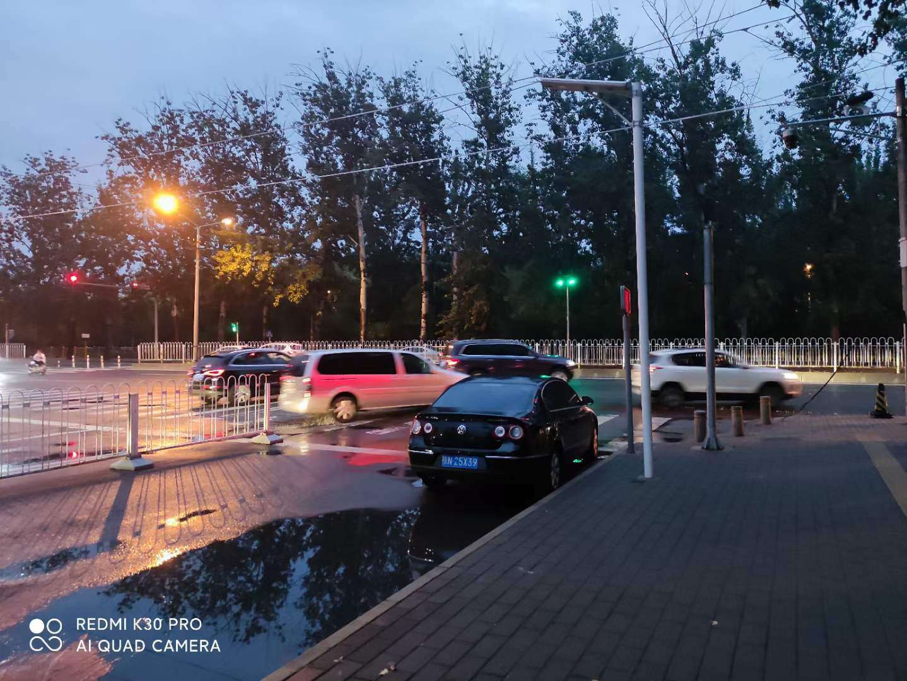

挂这个链接的目的主要是看看有多少人会点进来，以及留一个（或许有人会用的）沟通渠道。

如果需要了解我 2020.04 - 2021.10 这段时间的工作内容，可以在公司内网环境下点下面的链接（三个都一样）。

* [http://go/yichya](http://go/yichya)
* [http://py/yichya](http://py/yichya)
* [http://js/yichya](http://js/yichya)

如果上面的链接没有帮到你，并且也没有其他办法联系到我的话，可以在下面评论区留言，我会不定期回复。请注意必要的信息脱敏。

如果想知道我为什么选择离职，可以在下面评论区回复 `+1`，想看的人足够多了会更新在这里。这个坑填好前，可以先看下面的：

* Riddler 1: [但这一切值得吗？](../riddler-1/)
* _持续更新中_

最后，推荐一本老书 [https://book.douban.com/subject/3267945/](https://book.douban.com/subject/3267945/)
