上一次似乎说想用 MT7620A 的路由器来演示更进一步的 ImageBuilder 用法。不过呢，我改主意了。虽然我现在手里有三个 MT7620A 的路由器吧。

至于为什么改主意……OpenWrt 官方的 Designated Driver（16.x）版仍然没有正式发布，然而只有这个版本才添加了对极 1s 等国产智能路由器的官方支持。

所以嘛，我们跳过这一步，直接来搞 BuildRoot。

* lean 称他的固件为【4MB 的奇迹】，我们就来重演一次他的奇迹好了。*

<!-- more -->

## TL-WR703N Original version

前两天翻数码之家，发现有人卖路由器，极 1s 只要 50 块钱。卖家还有一个不太正常的 WR703N，据说搜不到无线而且有线插上不是 192.168.1.0/24，20 块钱出。因为早就想要一个 WR703N，于是就果断打包入手了。

到手之后极 1s 没怎么折腾就拿去用了（话说居然还有 900 多天才过保，不亏）。既然没过保就不瞎折腾了，插到网内让它安静的提供一下 OpenVPN 服务就行。

这台 WR703N 真的好小，比银行卡的一半稍大一点。直接挂在钥匙上都不是很违和。

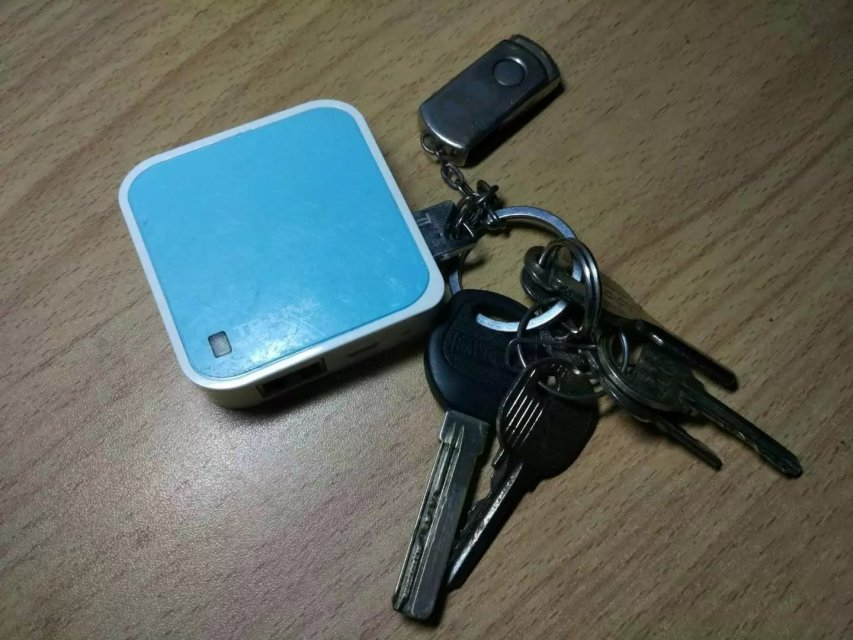

稍微玩了一小会儿。跟卖家说的一样棘手，插上电源之后，看指示灯闪烁的状态，似乎正常启动到了 OpenWrt。然而捅了半天菊花试图恢复出厂设置，无效。这就很尴尬了。进 U-Boot 也分配不到 IP。

上网查过，发现 TP 原装的 U-Boot 并没有自动设置 IP 之类。意思是说，固件挂了，如果没有办法接 TTL 的话，这东西就是一板砖。尼玛。

拆壳，焊 TTL。（从网上借的图，自己的焊盘狗带了一个来不及重拍了。侵删）

【图 1，TTL】

焊点是真 TM 小，倒是难不倒我。有一个迷的问题是 GND 并没有跟各个接口的外壳相连，所以不得不去板子上找一个。

用控制台看了半天固件的默认设置，发现 WIFI 默认被禁用，以太网端口搞了一个特别诡异的配置：固定 IP 192.168.0.100 网关 192.168.0.1……于是把自己电脑 IP 改成 192.168.0.1，顺利访问到路由器的 LuCI 界面。

然后就是刷掉固件解锁 U-Boot，刷 Breed，备份 ART，为后面作死做好准备。 

* 解锁了 U-Boot 分区的固件可以在[【这里】](http://pan.baidu.com/s/1dDu0Rgl)下载。
* Breed 可以在[【这里】](http://www.right.com.cn/forum/thread-161906-1-1.html)下载。如何刷入请见贴内教程，其实也就是一个 `mtd -r write /tmp/breed-ar9331.bin u-boot` 而已。
* 我的 ART 可以在[【这里】](../assets/files/openwrt-customize-2/art.bin)下载。

Breed 界面是这个样子的，可以看到这台设备并没有进行硬件改动，仍然是出厂时的 32MB RAM + 4MB Flash 搭配。

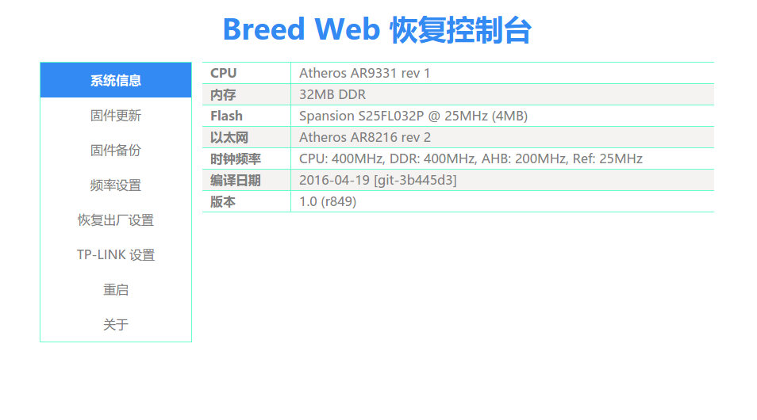

拆 TTL 线的时候就比较悲剧……焊点小也就算了，还特么特别容易掉。虽然我小心小心再小心不过还是手抖毁掉了一个焊盘。不过无所谓了。

搞定之后，我刷的是 lean 定制的自带 ShadowSocksR 和 AdBlock Plus 并优化了 Dnsmasq 的固件，可以在[【这里】](http://www.right.com.cn/forum/thread-186814-1-3.html)下载。

## Challenge

lean 的固件用起来还不错，可以十分愉悦的完成透明代理任务，不过 AdBlock 我反正是没看见……

路由器上有一个 USB 接口，lean 的固件并没有集成任何 USB 相关支持，却加入了一些我觉得并没有什么用的中文翻译、UPNP、动态 DNS 之类的功能。

由于这个路由器非常非常小，小到挂在钥匙上都不太违和，我计划中的使用方式大概是这样：用移动电源给树莓派供电，树莓派某一个 USB 口连接路由器供电口，路由器的 USB 口连接手机，手机打开 USB 网络共享。这样其他设备连接到路由器提供的网络就可以通过手机上网了。

通过搜索得知：

* WR703N 的 USB 控制器为 EHCI 类型，需要安装模块 kmod-usb2 打开支持。
* 手机通过 USB 共享网络使用了 RNDIS。OpenWrt 官方通过模块 kmod-usb-net-rndis 提供了全面支持。

看似并不难的样子。本来计划使用 ImageBuilder 完成映像定制，不过……

* Flash 空间只有 4MB，裁剪的粒度可能比软件包还要小，甚至可能细化到内核的某一个功能特性（事实上也确实如此）
* ShadowSocksR 没有提供上一次搞透明代理那样的第三方软件源（虽然可以配置本地源，所以这其实不算是个什么靠谱的理由）
* 既然有这么个作死的机会，不如……

我们来试试 BuildRoot 吧。

## BuildRoot - Preparation

首先，根据官方的 BuildRoot 教程，我们需要准备以下环境。

* 靠谱的网络。最好挂好了 VPN 或者配置好了 ShadowSocks 透明代理，或者使用前面提到过的 ProxyChains。
* Linux 或者 Mac OS X。重点是 Case-Sensetive Filesystem……所以 Cygwin 不行。
* ToolChains。第一次执行 make 时会检查工具链，如下。


Checking 'working-make'... ok.
Checking 'case-sensitive-fs'... ok.
Checking 'gcc'... ok.
Checking 'working-gcc'... ok.
Checking 'g++'... ok.
Checking 'working-g++'... ok.
Checking 'ncurses'... ok.
Checking 'zlib'... ok.
Checking 'libssl'... ok.
Checking 'perl-thread-queue'... ok.
Checking 'tar'... ok.
Checking 'find'... ok.
Checking 'bash'... ok.
Checking 'patch'... ok.
Checking 'diff'... ok.
Checking 'cp'... ok.
Checking 'seq'... ok.
Checking 'awk'... ok.
Checking 'grep'... ok.
Checking 'getopt'... ok.
Checking 'stat'... ok.
Checking 'md5sum'... ok.
Checking 'unzip'... ok.
Checking 'bzip2'... ok.
Checking 'wget'... ok.
Checking 'perl'... ok.
Checking 'python'... ok.
Checking 'svn'... ok.
Checking 'git'... ok.
Checking 'file'... ok.
Checking 'openssl'... ok.
Checking 'ldconfig-stub'... ok.


全都准备好之后，我们就可以开始了。

首先，从 OpenWrt 官方获取源代码。我们这次的定制使用 2016/05/27 的 Trunk 版本。


git clone git://git.openwrt.org/openwrt.git trunk


如果需要稳定版，可以加上对应的版本号：


git clone git://git.openwrt.org/15.05/openwrt.git chaos_calmer


需要注意的是目前 Chaos Calmer 分支下的稳定版是 15.05.1。

等待一会儿 git clone 完成，cd 进入 trunk 目录。

输入命令


make menuconfig


之后，我们就看到了配置菜单。

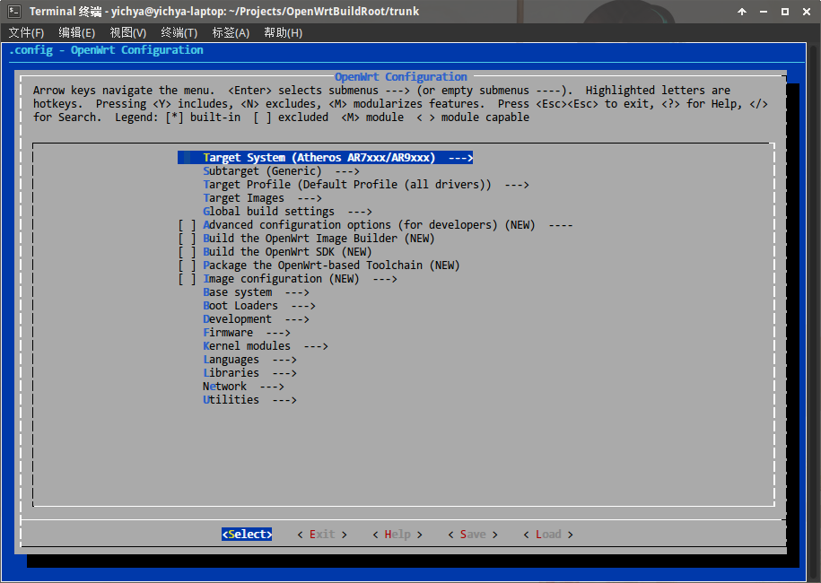

我们发现，这个菜单中包含的项目并不全，甚至连最重要的 LuCI 都没有。在开始前，我们还需要更新 Feeds。


./scripts/feeds update -a
./scripts/feeds install -a


更新 Feeds 之后再查看菜单，LuCI 等项目就出现了。

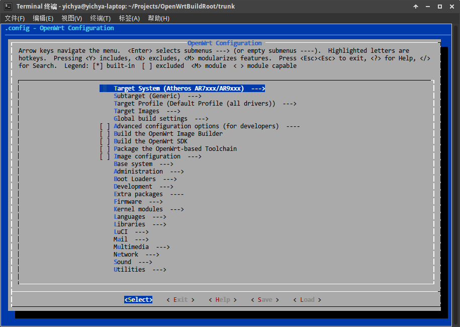

我们此时可以测试一下工具链是否正常，方法当然是 Fire。

目前 Target System 已经是我们要的 Atheros AR7xxx/AR9xxx。修改下面的 Target Profile 为 WR703N：

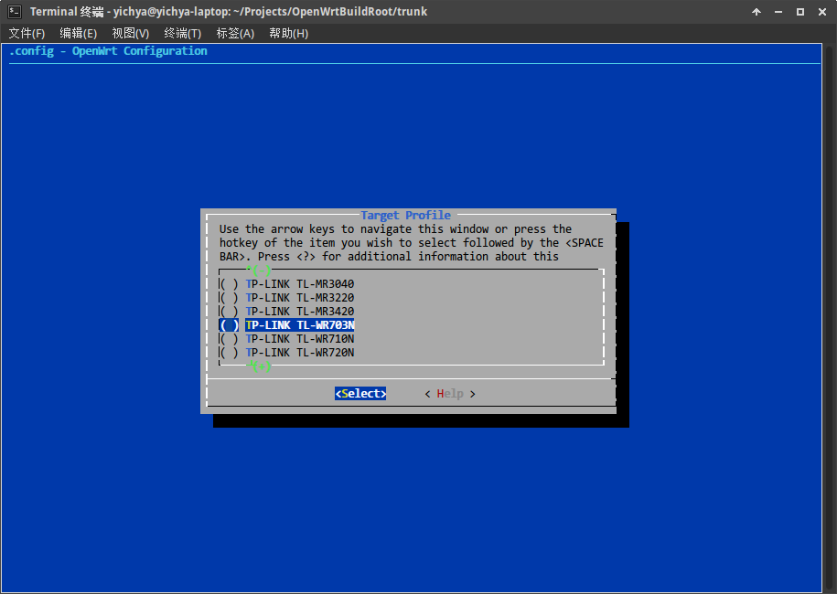

返回，保存。

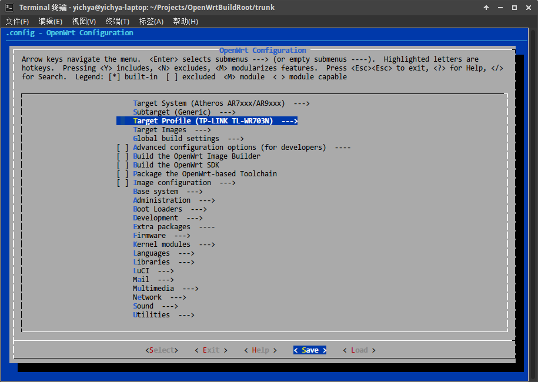

退出，开始编译：


make V=99 -j


其中 V=99 代表显示所有信息。-j 代表允许并行任务（后面可以加一个数字代表线程数，不加代表不限制）

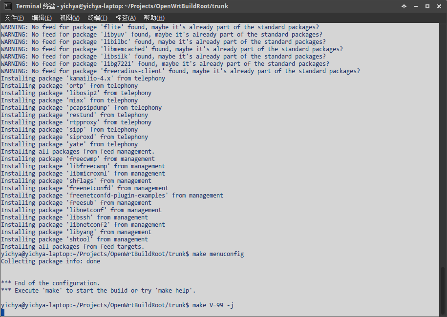

一次完整的编译，从整个 gcc g++ 到内核再到各种软件包都会从源代码编译出来……简直可怕……

根据网络状况、电脑配置说好的，短的大概 20 分钟，长的可能会有几个小时，我们可以开始等了。这个过程中需要保持网络畅通，同时 CPU 也会狂烧……

---------

一觉醒来，发现编译失败了 :) 各种重试中。

如果总是失败，可以试着改用参数


make V=99 -j 1


禁用并行操作，这样可能可以避免由于依赖关系（后面编译的代码依赖前面编译出来的目标文件）未满足产生的错误。

另外一般情况下失败也不需要 make clean，重新 make 即可。程序会自动从上次中断的地方继续。

---------

重试了好几次之后终于编译成功。

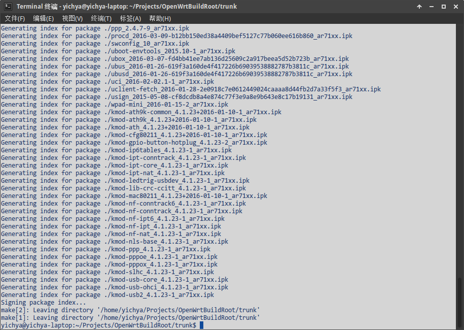

我们已经可以看到生成的 factory 和 sysupgrade 文件，这说明我们的工具链可以正常工作。

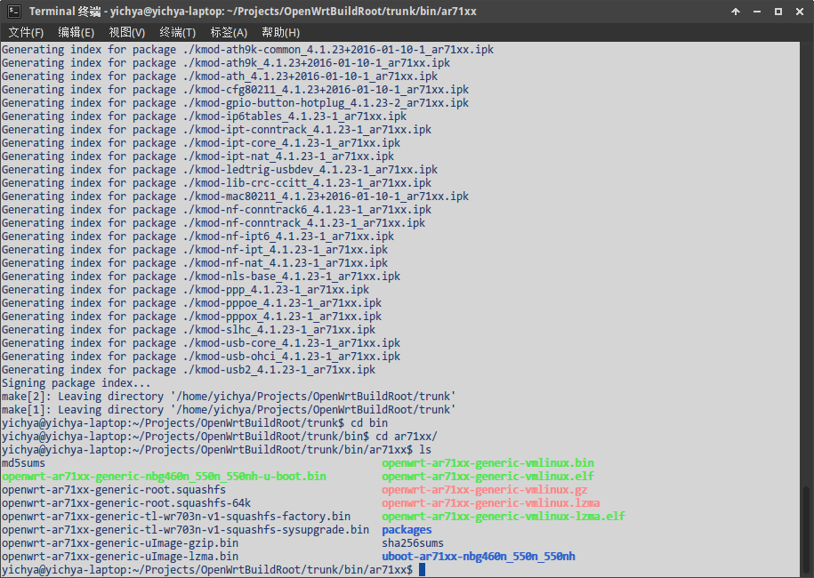

可以试着刷一下，看看新的固件是不是可以正常工作。

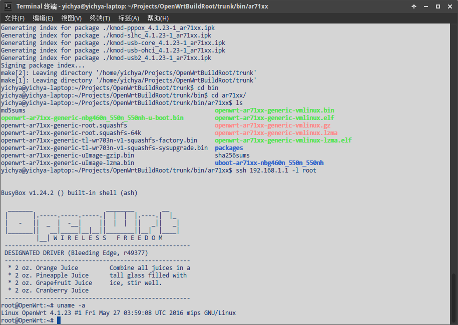

可以顺利通过 SSH 登录到路由器。版本是 Designated Driver r49377，内核版本 4.1.23。

启动日志如下：


[    0.000000] Linux version 4.1.23 (yichya@yichya-laptop) (gcc version 5.3.0 (OpenWrt GCC 5.3.0 r49377) ) #1 Fri May 27 03:59:08 UTC 2016
[    0.000000] MyLoader: sysp=30e153ba, boardp=ad65edf1, parts=b589d2c4
[    0.000000] bootconsole [early0] enabled
[    0.000000] CPU0 revision is: 00019374 (MIPS 24Kc)
[    0.000000] SoC: Atheros AR9330 rev 1
[    0.000000] Determined physical RAM map:
[    0.000000]  memory: 02000000 @ 00000000 (usable)
[    0.000000] Initrd not found or empty - disabling initrd
[    0.000000] Zone ranges:
[    0.000000]   Normal   [mem 0x0000000000000000-0x0000000001ffffff]
[    0.000000] Movable zone start for each node
[    0.000000] Early memory node ranges
[    0.000000]   node   0: [mem 0x0000000000000000-0x0000000001ffffff]
[    0.000000] Initmem setup node 0 [mem 0x0000000000000000-0x0000000001ffffff]
[    0.000000] On node 0 totalpages: 8192
[    0.000000] free_area_init_node: node 0, pgdat 803cbe20, node_mem_map 81000000
[    0.000000]   Normal zone: 64 pages used for memmap
[    0.000000]   Normal zone: 0 pages reserved
[    0.000000]   Normal zone: 8192 pages, LIFO batch:0
[    0.000000] Primary instruction cache 64kB, VIPT, 4-way, linesize 32 bytes.
[    0.000000] Primary data cache 32kB, 4-way, VIPT, cache aliases, linesize 32 bytes
[    0.000000] pcpu-alloc: s0 r0 d32768 u32768 alloc=1*32768
[    0.000000] pcpu-alloc: [0] 0 
[    0.000000] Built 1 zonelists in Zone order, mobility grouping on.  Total pages: 8128
[    0.000000] Kernel command line:  board=TL-WR703N  console=ttyATH0,115200 rootfstype=squashfs,jffs2 noinitrd
[    0.000000] PID hash table entries: 128 (order: -3, 512 bytes)
[    0.000000] Dentry cache hash table entries: 4096 (order: 2, 16384 bytes)
[    0.000000] Inode-cache hash table entries: 2048 (order: 1, 8192 bytes)
[    0.000000] Writing ErrCtl register=00000000
[    0.000000] Readback ErrCtl register=00000000
[    0.000000] Memory: 27940K/32768K available (2783K kernel code, 142K rwdata, 684K rodata, 284K init, 195K bss, 4828K reserved, 0K cma-reserved)
[    0.000000] SLUB: HWalign=32, Order=0-3, MinObjects=0, CPUs=1, Nodes=1
[    0.000000] NR_IRQS:83
[    0.000000] Clocks: CPU:400.000MHz, DDR:400.000MHz, AHB:200.000MHz, Ref:25.000MHz
[    0.000000] clocksource MIPS: mask: 0xffffffff max_cycles: 0xffffffff, max_idle_ns: 9556302233 ns
[    0.000013] sched_clock: 32 bits at 200MHz, resolution 5ns, wraps every 10737418237ns
[    0.007856] Calibrating delay loop... 265.42 BogoMIPS (lpj=1327104)
[    0.089114] pid_max: default: 32768 minimum: 301
[    0.093895] Mount-cache hash table entries: 1024 (order: 0, 4096 bytes)
[    0.100331] Mountpoint-cache hash table entries: 1024 (order: 0, 4096 bytes)
[    0.111217] clocksource jiffies: mask: 0xffffffff max_cycles: 0xffffffff, max_idle_ns: 19112604462750000 ns
[    0.120536] NET: Registered protocol family 16
[    0.125752] MIPS: machine is TP-LINK TL-WR703N v1
[    0.395236] Switched to clocksource MIPS
[    0.399521] NET: Registered protocol family 2
[    0.403856] TCP established hash table entries: 1024 (order: 0, 4096 bytes)
[    0.409442] TCP bind hash table entries: 1024 (order: 0, 4096 bytes)
[    0.415754] TCP: Hash tables configured (established 1024 bind 1024)
[    0.422205] UDP hash table entries: 256 (order: 0, 4096 bytes)
[    0.427925] UDP-Lite hash table entries: 256 (order: 0, 4096 bytes)
[    0.434488] NET: Registered protocol family 1
[    0.438598] PCI: CLS 0 bytes, default 32
[    0.440063] futex hash table entries: 256 (order: -1, 3072 bytes)
[    0.468504] squashfs: version 4.0 (2009/01/31) Phillip Lougher
[    0.472899] jffs2: version 2.2 (NAND) (SUMMARY) (LZMA) (RTIME) (CMODE_PRIORITY) (c) 2001-2006 Red Hat, Inc.
[    0.486706] io scheduler noop registered
[    0.489182] io scheduler deadline registered (default)
[    0.494591] Serial: 8250/16550 driver, 1 ports, IRQ sharing disabled
[    0.501399] ar933x-uart: ttyATH0 at MMIO 0x18020000 (irq = 11, base_baud = 1562500) is a AR933X UART
[    0.510234] console [ttyATH0] enabled
[    0.517047] bootconsole [early0] disabled
[    0.528475] m25p80 spi0.0: found s25sl032p, expected m25p80
[    0.532610] m25p80 spi0.0: s25sl032p (4096 Kbytes)
[    0.538724] 5 tp-link partitions found on MTD device spi0.0
[    0.542929] Creating 5 MTD partitions on "spi0.0":
[    0.547768] 0x000000000000-0x000000020000 : "u-boot"
[    0.553949] 0x000000020000-0x000000150ae4 : "kernel"
[    0.558862] 0x000000150ae4-0x0000003f0000 : "rootfs"
[    0.563668] mtd: device 2 (rootfs) set to be root filesystem
[    0.568299] 1 squashfs-split partitions found on MTD device rootfs
[    0.574372] 0x000000330000-0x0000003f0000 : "rootfs_data"
[    0.580918] 0x0000003f0000-0x000000400000 : "art"
[    0.585601] 0x000000020000-0x0000003f0000 : "firmware"
[    0.610537] libphy: ag71xx_mdio: probed
[    1.196944] ag71xx ag71xx.0: connected to PHY at ag71xx-mdio.1:04 [uid=004dd041, driver=Generic PHY]
[    1.205691] eth0: Atheros AG71xx at 0xb9000000, irq 4, mode:MII
[    1.213157] NET: Registered protocol family 10
[    1.220700] NET: Registered protocol family 17
[    1.223794] bridge: automatic filtering via arp/ip/ip6tables has been deprecated. Update your scripts to load br_netfilter if you need this.
[    1.236553] 8021q: 802.1Q VLAN Support v1.8
[    1.250319] VFS: Mounted root (squashfs filesystem) readonly on device 31:2.
[    1.258178] Freeing unused kernel memory: 284K (803e9000 - 80430000)
[    2.491603] init: Console is alive
[    2.493838] init: - watchdog -
[    3.762590] usbcore: registered new interface driver usbfs
[    3.766833] usbcore: registered new interface driver hub
[    3.772048] usbcore: registered new device driver usb
[    3.784412] ehci_hcd: USB 2.0 'Enhanced' Host Controller (EHCI) Driver
[    3.791597] ehci-platform: EHCI generic platform driver
[    3.795558] ehci-platform ehci-platform: EHCI Host Controller
[    3.801145] ehci-platform ehci-platform: new USB bus registered, assigned bus number 1
[    3.811144] ehci-platform ehci-platform: irq 3, io mem 0x1b000000
[    3.835287] ehci-platform ehci-platform: USB 2.0 started, EHCI 1.00
[    3.841369] hub 1-0:1.0: USB hub found
[    3.844247] hub 1-0:1.0: 1 port detected
[    3.851955] ohci_hcd: USB 1.1 'Open' Host Controller (OHCI) Driver
[    3.858630] ohci-platform: OHCI generic platform driver
[    3.867237] init: - preinit -
[    4.631898] IPv6: ADDRCONF(NETDEV_UP): eth0: link is not ready
[    4.664682] random: procd urandom read with 7 bits of entropy available
[    7.256722] eth0: link up (100Mbps/Full duplex)
[    7.259832] IPv6: ADDRCONF(NETDEV_CHANGE): eth0: link becomes ready
[    7.836137] mount_root: jffs2 not ready yet, using temporary tmpfs overlay
[    7.877141] eth0: link down
[    7.893350] procd: - early -
[    7.894918] procd: - watchdog -
[    8.576824] procd: - ubus -
[    8.631012] procd: - init -
[    9.564509] ip6_tables: (C) 2000-2006 Netfilter Core Team
[    9.588227] Loading modules backported from Linux version v4.4-rc5-1913-gc8fdf68
[    9.594170] Backport generated by backports.git backports-20151218-0-g2f58d9d
[    9.605565] ip_tables: (C) 2000-2006 Netfilter Core Team
[    9.623499] nf_conntrack version 0.5.0 (441 buckets, 1764 max)
[    9.676706] xt_time: kernel timezone is -0000
[    9.759251] PPP generic driver version 2.4.2
[    9.765861] NET: Registered protocol family 24
[    9.829093] ath: EEPROM regdomain: 0x0
[    9.829123] ath: EEPROM indicates default country code should be used
[    9.829137] ath: doing EEPROM country->regdmn map search
[    9.829164] ath: country maps to regdmn code: 0x3a
[    9.829180] ath: Country alpha2 being used: US
[    9.829193] ath: Regpair used: 0x3a
[    9.841020] ieee80211 phy0: Selected rate control algorithm 'minstrel_ht'
[    9.845890] ieee80211 phy0: Atheros AR9330 Rev:1 mem=0xb8100000, irq=2
[   18.544432] jffs2_scan_eraseblock(): End of filesystem marker found at 0x0
[   18.572192] jffs2_build_filesystem(): unlocking the mtd device... done.
[   18.577351] jffs2_build_filesystem(): erasing all blocks after the end marker... done.
[   22.435929] jffs2: notice: (888) jffs2_build_xattr_subsystem: complete building xattr subsystem, 0 of xdatum (0 unchecked, 0 orphan) and 0 of xref (0 dead, 0 orphan) found.
[   25.559368] device eth0 entered promiscuous mode
[   25.564213] IPv6: ADDRCONF(NETDEV_UP): br-lan: link is not ready
[   27.536751] eth0: link up (100Mbps/Full duplex)
[   27.539892] br-lan: port 1(eth0) entered forwarding state
[   27.545310] br-lan: port 1(eth0) entered forwarding state
[   27.585894] IPv6: ADDRCONF(NETDEV_CHANGE): br-lan: link becomes ready
[   29.545252] br-lan: port 1(eth0) entered forwarding state
[   69.213001] random: nonblocking pool is initialized


这样我们初步的准备就算是完成了，我们可以开始下一步工作了。

## BuildRoot - Customization

我们上一步使用默认设置编译的固件实在是功能贫乏，因此我们需要增加最基本的功能以保证正常的使用。

同时为了缩小体积我们需要删除不会用到的部分。固件默认包含的功能中 IPv6 、opkg 包管理器以及其他很多功能都是我们不需要的。我们将在下面的流程中把它们逐个找出来并移除。

打开 make menuconfig 准备设置。

首先，LuCI 当然是重点。选中 LuCI - Collections - luci。当前面的选项变为 <*> 时代表已经正确选中。

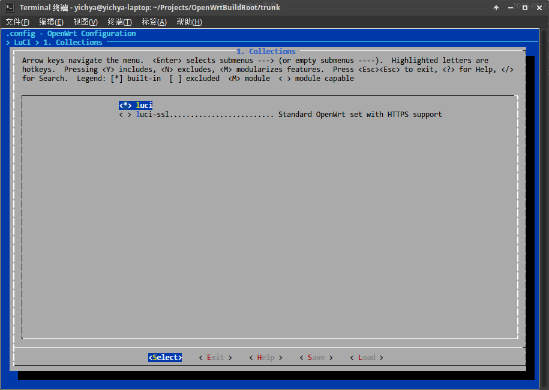

选中 luci 将会同时选中相关的一系列包。我们在 LuCI - Modules 中选中 Minify Lua Sources 压缩 Lua 脚本以增大固件中的可用空间。

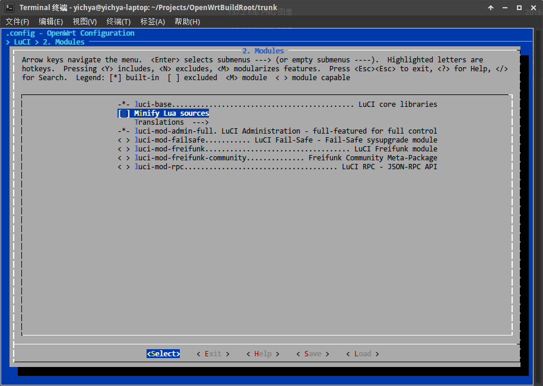

选择主题。一般只需要默认的 luci-theme-bootstrap 就可以了。如果剩余空间足够大，也可以体验一下全新的 Material 风格主题。

LuCI 的定制就算完成，下面我们开始从头看每一个选项。

首先是 Global 部分。这里我们可以对整个编译流程进行控制，也可以对内核支持的功能进行简单的定制。

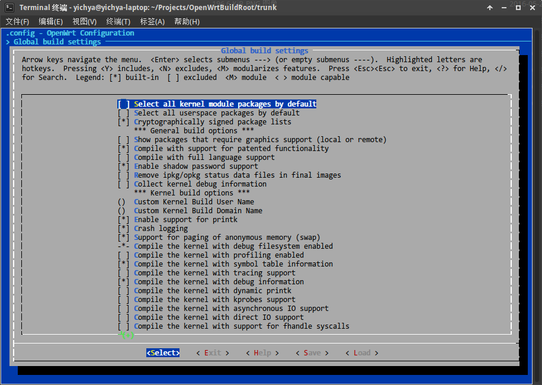

由于 Flash 的可用空间实在是太小，我们尽量关掉下面与调试信息相关的选项：

* Crash Logging
* Support for paging of anonymous memory (swap)
* Compile the kernel with symbol table information
* Compile the kernel with debug information

同时打开下面的选项以裁剪固件大小。选中下面两个选项相当于彻底断绝了在路由器上通过包管理器安装软件的可能性（需要就重新编译嘛 2333）。

* Remove ipkg/opkg status data files in final images
* Strip unnecessary exports from the kernel image
* Strip unnecessary functions from libraries

另外，为减小体积我们需要移除 IPv6 相关支持。在这里关闭 IPv6 支持标记，以便删除 IPv6 相关的模块。

* Enable IPv6 support in packages

全局定制完成后，我们看后面的选项。

* Advanced configuration options (for developers)
* Build the OpenWrt Image Builder
* Build the OpenWrt SDK
* Package the OpenWrt-based Toolchain

这四个选项是为开发者准备的。Advanced configuration options 中可以给工具链指定更多参数，另外的三个则是生成 SDK 和 ImageBuilder 以及打包自带工具链，我们不用管。

Image Configuration 中可以指定一些其他选项，比如 Init 脚本和包管理器相关信息。

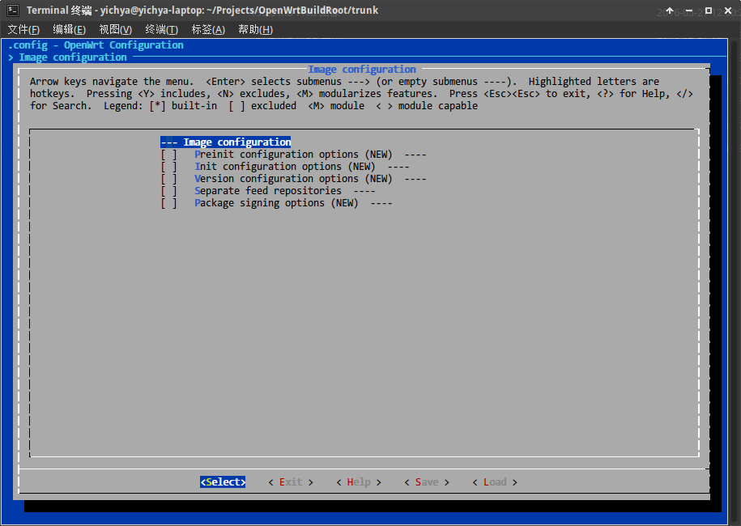

我们在这里去掉 Feeds 以减少空间：

* Separate feed repositories

之后是 Base System 部分，这里是系统核心支持相关的部分。

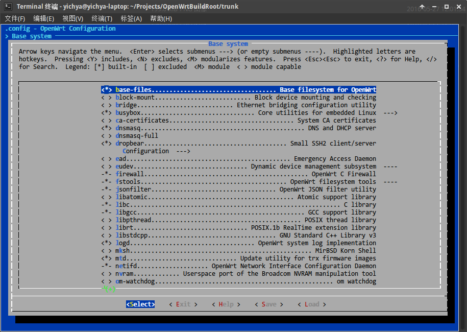

删除 opkg【就几百 KB 空间还装什么软件，包管理器删掉】。

* opkg

WR703N 总共只有一个以太网口，交换机配置工具也可以删掉。

* swconfig

这里就完成了。

下面几个选项都是酱油。

* Administration 页中我们并没有什么用得上的，跳过。
* Boot Loaders 我们直接用已经刷好的 Breed，跳过。
* Development 页面……我们路由器上并没有空间放 gcc 和 gdb。跳过。
* Extra Packages 是空的，不用管了。
* Firmware 并不用选，跳过。

Kernel Modules 我们就要仔细选择了。

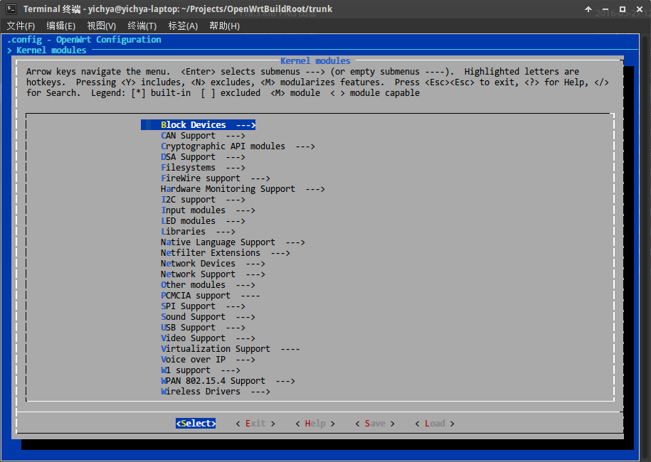

我们在这里需要做的事情是添加 USB RNDIS 设备支持以便可以正确实现通过 USB 线共享网络。

进入 USB Support 页面，可以看到官方已经帮我们选中了 kmod-usb-ohci 和 kmod-usb2。

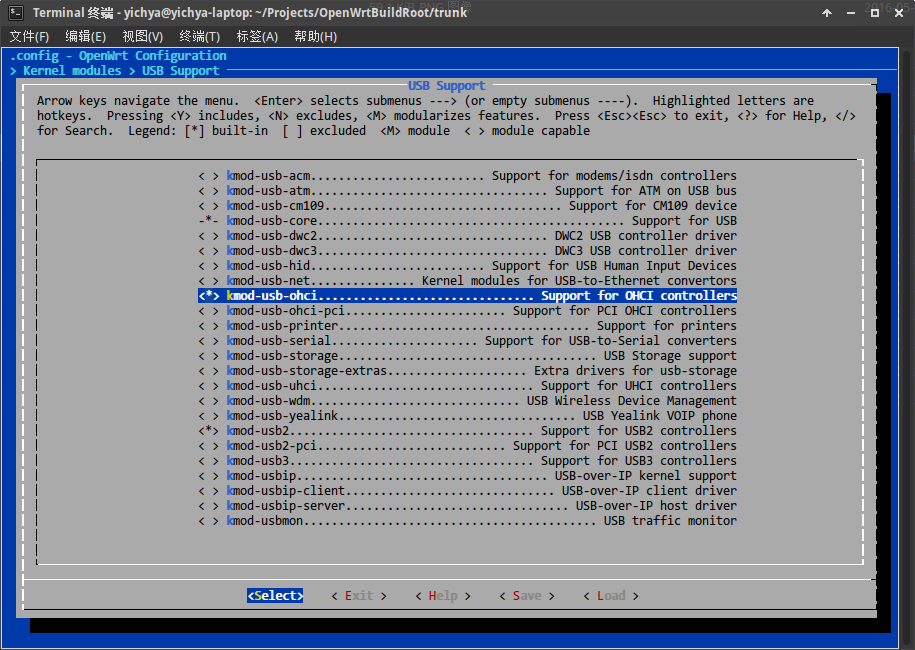

我们选中 kmod-usb-net 和下面的 kmod-usb-net-rndis：

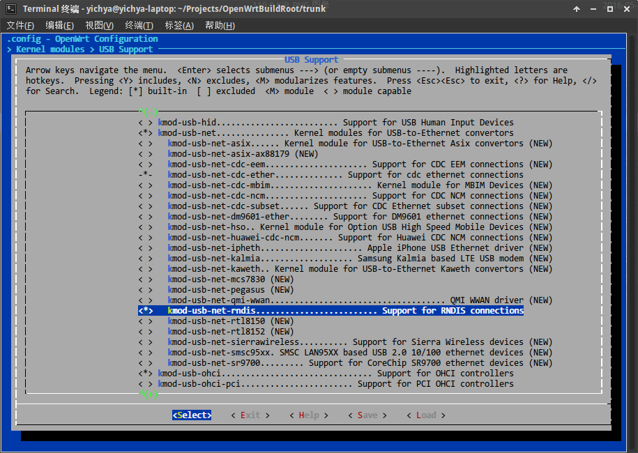

这里就结束了。

为了减小空间，我们还要去掉 MAC80211 的调试信息部分。进入 Wireless Drivers 页面：

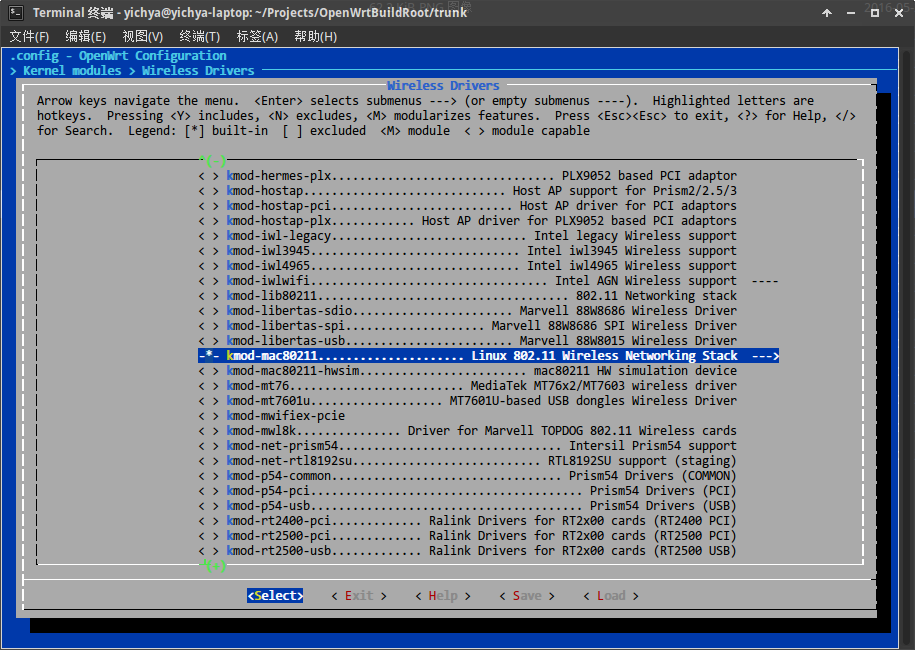

进入 kmod-mac80211，关闭 DebugFS 支持。

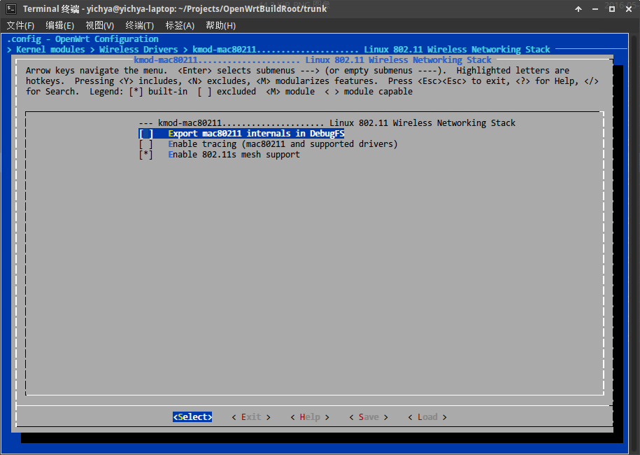

内核部分的定制就完成了。

【在 15.05.1 中关闭 IPv6 还需要在这里手动去除一部分模块的支持，不过最新的 Trunk 似乎已经通过一个选项帮我们完成了所有任务】

后面又是几个酱油选项：

* Languages 页上……我们的路由器上并没有空间运行 PHP 或者 Node.js，跳过。
* Libraries 页不太需要我们自己管，选中某一个功能时系统会自动在这里选中依赖的库。跳过。
* LuCI 上面选过了。
* Mail 页有一些邮件工具，我们用不上，跳过。
* Multimedia 页有一些 mjpg-streamer 之类的，挂摄像头监控用。我们也用不上，跳过。

Network 页上我们去掉 odhcpd 就行，因为它的功能我们直接用 dnsmasq 提供了。

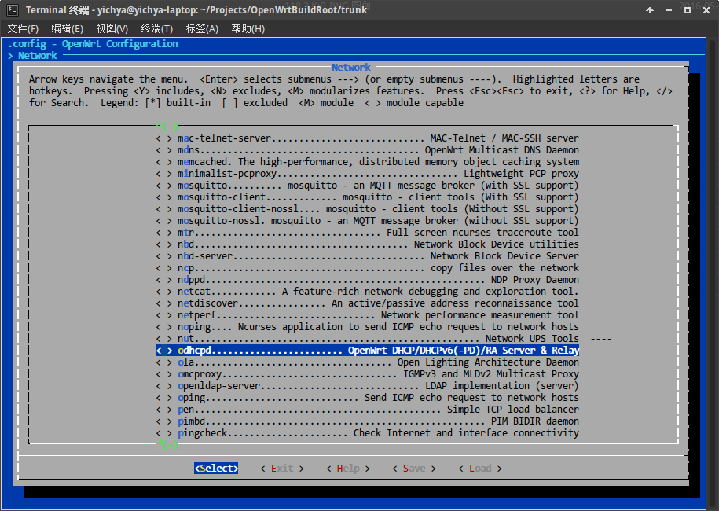

这里还有一个 uclient-fetch 我们应该用不上，也顺便删掉吧。

这样 Network 部分就完成了。

后面两个酱油：

* Sound 不用多解释了吧。话说礼貌居然有了 mpg123……简直感人……不过我们这里还是用不上，跳过。
* Utilities 实用工具，目前我们不是很用得上，跳过。有需要的话可以自己挑。

最后因为上面我们关掉了 MAC80211 的 DebugFS 支持，我们还需要回到 Global 中关掉 Debug Filesystem。

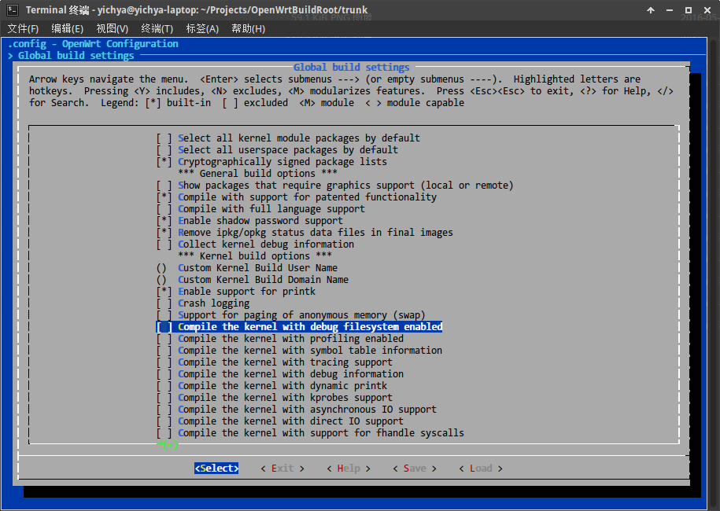

至此配置全部完成。保存，可以开始准备编译了。


make V=99 -j


第二次编译很快，不到三分钟我们就得到了 bin 文件。

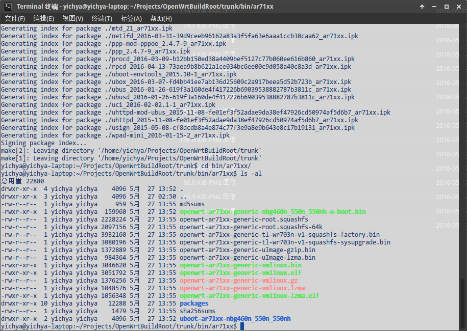

可以看到，虽然添加了 LuCI 和 RNDIS 支持，但由于我们选用正确的选项进行精简，得到的 Bin 文件反而还小了 100 多 KB。

刷上。成功启动，并且看到了 LuCI 界面。

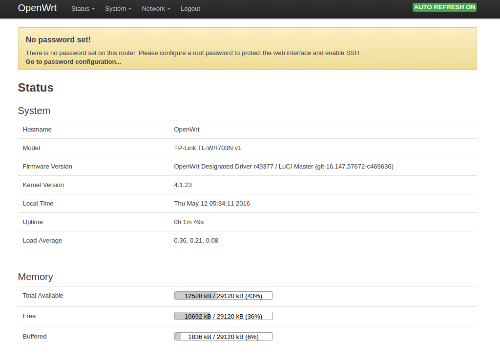

定制成功 :)