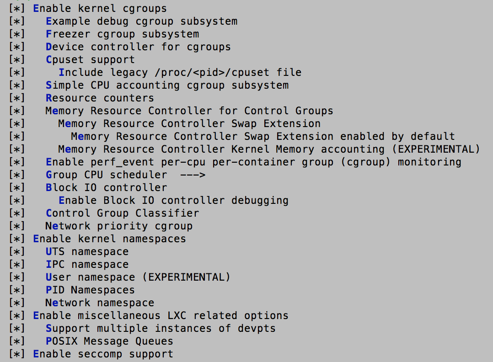
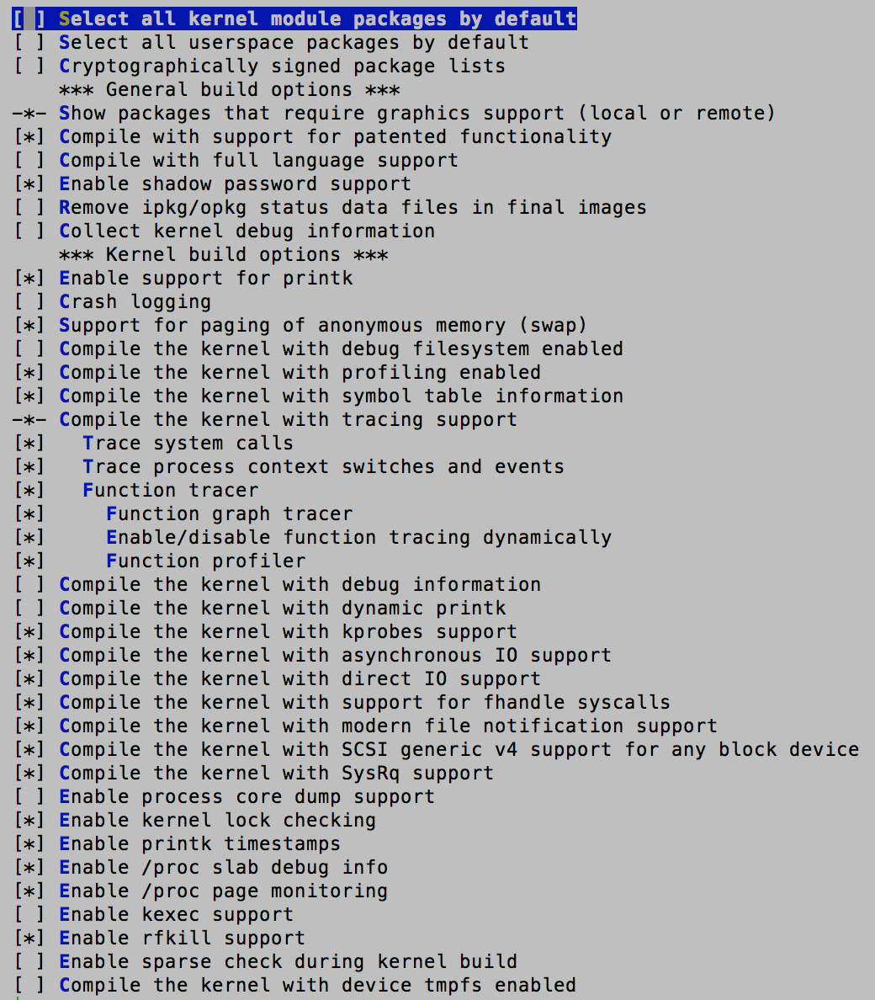
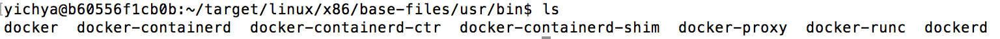
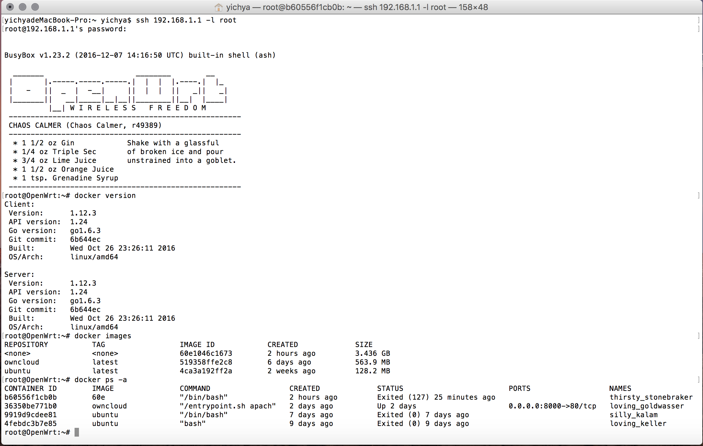
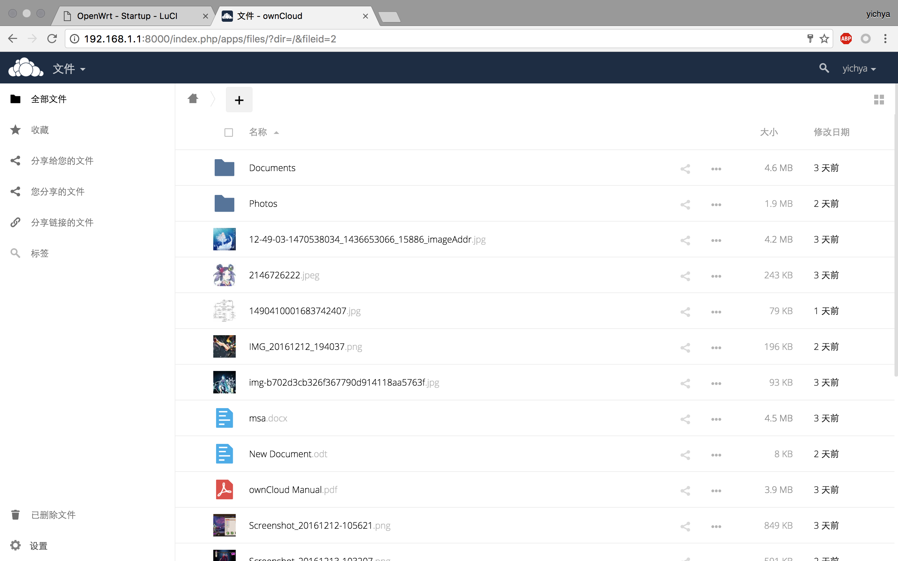
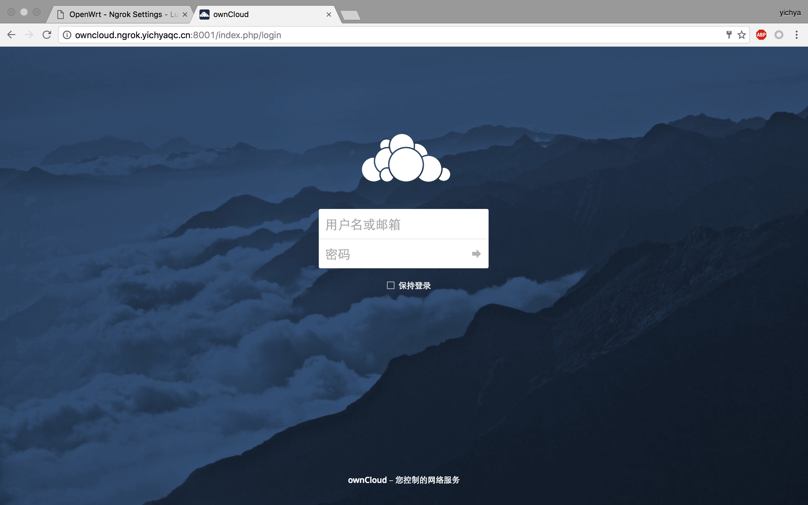

十月份开始沉迷没有 SSR 的辣鸡游戏 :) 加上 Umefit 还有架构师考试以及一大堆上机和大作业啥的，神烦。当然，忙里偷闲还是把这个坑填了。

# Intro

这个坑是很早以前就挖了，突然决定填上这个坑是因为突然看到了群晖 DSM 系统居然支持 Docker，一脸的羡慕嫉妒恨，当天晚上就忍不住了。于是决定把很长时间以前的这个坑填了。

花了挺长时间才搞定了 Docker，然后在双十二当天晚上用 Docker 非常愉快的部署了 ownCloud，顺便做了一下 ngrok 的内网穿透。

现在基本可以稳定使用，除了腾讯云上反向代理用的 nginx 似乎偶尔会抽风之外。另外，由于 Docker 对 iptables 做了很多工作，路由器上的透明代理似乎出了问题，之后有时间我会再处理。

另外停电已有两个多月。停电前我换了新的、容量大了很多的电池，目前基本可以毫无顾忌的让 NAS 彻夜运行。后面会稍微提到一点新的供电设计相关的内容。

<!-- more -->

# Docker Howto in 5 minutes

鬼知道当时折腾的时候我经历了什么，我走了颇多弯路甚至还改了些 OpenWrt patched 过后的 linux 内核的代码……后来才知道根本不需要。

把我折腾的步骤一点一点写下来肯定是没啥必要而且十分的浪费时间所以简单一点直接说应该怎么做吧。

本次部署使用的是 OpenWrt Chaos Calmer 截止 12.12 的最新版，内核版本为 3.18.44。docker 的版本为：

```
Client:
 Version:      1.12.3
 API version:  1.24
 Go version:   go1.6.3
 Git commit:   6b644ec
 Built:        Wed Oct 26 23:26:11 2016
 OS/Arch:      linux/amd64

Server:
 Version:      1.12.3
 API version:  1.24
 Go version:   go1.6.3
 Git commit:   6b644ec
 Built:        Wed Oct 26 23:26:11 2016
 OS/Arch:      linux/amd64
```

## Change config-3.18

首先，我们需要添加 Docker 用到但是 OpenWrt 内核默认关闭的一些功能，包括 madvice/fadvice 系统调用、/proc/keys、一些文件系统的访问控制等。

以上次说过的 [https://gist.github.com/huming2207/47b17be9f27eb4b4e908801e31bfa4fe](https://gist.github.com/huming2207/47b17be9f27eb4b4e908801e31bfa4fe) 中的 config-3.18 为基础，在头部添加这些选项：


CONFIG_ADVISE_SYSCALLS=y
CONFIG_KEYS=y
CONFIG_EXT4_FS_POSIX_ACL=y
CONFIG_EXT4_FS_SECURITY=y
CONFIG_KEYS_DEBUG_PROC_KEYS=y
CONFIG_AUDIT=y
CONFIG_AUDITSYSCALL=y
CONFIG_SCHED_AUTOGROUP=y
CONFIG_TMPFS_POSIX_ACL=y
CONFIG_PROC_KCORE=y
CONFIG_JFFS2_FS_POSIX_ACL=y
CONFIG_JFFS2_FS_SECURITY=y
CONFIG_X86_DECODER_SELFTEST=y


保存即可。

## Add necessary functions to kernel

回到源代码根目录，运行 make menuconfig。

首先，到 Global Build settings 中选中所有 cgroup、namespace、lxc 和 seccomp 相关的选项。



如图选中其他相关的选项。



## Add necessary kernel modules

返回，进入到 Kernel Modules，并选中：

* Block Devices 中的 kmod-dm、kmod-loop
* Filesystems 中的 kmod-ext4、kmod-fuse
* Netfilter Extensions 中的 kmod-ebtables 及下面所有三个、kmod-nf-nathelper、kmod-nf-nathelper-extra。这里还有很多项目在完成后续步骤之后会被自动选中。
* Network Support 中的 kmod-ipsec 及下面所有两个、kmod-veth

这里选中的只是必需的模块，可以根据自己的需求选择其他需要的模块比如文件系统、网卡驱动程序等。

## Add iptables Extensions

Docker 对 iptables 的如此充分利用是我完全没想到的，在这里花了好几个小时才终于使得 Docker 能初步工作。

进入 Network 下面的 Firewall，选中：

* arptables
* conntrack-tools
* ebtables 及下面一个
* ip6tables 及其子菜单中的两个
* iptables 子菜单中的 iptables-mod-conntrack-extra、iptables-mod-extra、iptables-mod-ipsec、iptables-mod-nat-extra
* nftables

虽然我在这里选中了 ipsec、conntrack 和 nf-nathelper，但是 dockerd 启动时仍然会提示 modprobe 这些模块失败，然而手动 modprobe 它们的话会提示这些模块已经被加载了。不过似乎也没什么影响。

## Add Utilities

最后按照 Docker 官方的说明，还需要添加几个工具。

进入 Utilities，选中：

* procps 以及其子菜单中的全部工具
* Compression 中的 xz-utils

## Other modules

回到首页，在 Root Filesystems 中：

* 选择只生成 ext4 格式的映像。在 / 上使用 jffs2 等其他的文件系统可能会遇到 overlay 文件系统不能正常工作导致 Docker 无法创建容器的问题，不过我还没有尝试过。
* 不要为 / 预留少于 150MB 的空间，但同样不建议过大，因为 Docker 的工作目录必须放在其他的分区中。

另外强烈建议选中 Base System 中的 udev 和 ca-certificates。缺少 ca-certificates 意味着几乎无法使用 docker pull。

## Copy Docker executables to base-files folder

到 Docker 官方网站下载 tarball，解压缩得到 7 个文件，复制到 target/linux/x86/base-files/usr/bin 中。当然这个目录应该并不存在，所以请手动创建一下。



## Ready to Build

准备完成，可以 make 了。

## Refurbish & Configure

编译完成后刷入 NAS，等待启动完成后进行分区。

分区可以使用 cfdisk，具体步骤很简单就不赘述了。我把 SSD 上剩余的 18GB 左右空间全部分为了一个 /dev/sdb3，文件系统为 ext4。

配置挂载点，将 /dev/sdb3 挂载到 /var/lib/docker 即可。

如果不这么做而是使用一个较大的 / 分区的话，试图启动容器时会提示因为 Docker 的工作目录是一个符号链接（OpenWrt 中 /var 是到 /tmp 的符号链接）导致启动失败。需要注意的是，由于 OpenWrt 的 mount-root 实现未考虑到这种需求，如果手动建立 /var 目录的话系统将无法启动。

## Autostart dockerd at startup

在 luci 的 system -> startup 下面修改 /etc/rc.local 的地方添加自动启动 dockerd 的命令即可：


start-stop-daemon -S -b -x dockerd


## Enjoy!



## Troubleshooting

如果遇到无法处理的错误的话，可以尝试使用我的 .config 和 config-3.18。下面是链接。

# ownCloud Howto

既然有了 Docker，ownCloud 基本上就没什么难度了。

## Basic Installation

直接 pull。


docker pull owncloud


在机械硬盘上创建好 ownCloud 的工作目录，创建容器的时候用 -v 参数指定就可以了。同时记得将 80 端口映射出来。


docker run -d -v /mnt/sda1/owncloud:/var/www/html -p 8000:80 owncloud


打开 192.168.1.1:8000，设置好 ownCloud 即可。



## Recommended Optimizations

直接这样部署的话 ownCloud 默认使用 sqlite 数据库存储 metadata。这样机械硬盘的压力会比较大，建议采取在 ssd 上部署 mysql 数据库并与 ownCloud 链接的方法。

如果对性能有更高要求还可以安装 memcached 等。

这些可选优化在网上有很多教程，这里就不赘述了。*其实是因为我还没来得及做……*

# ngrok

很羡慕群晖的 QuickConnect 功能，之前想过用花生壳内网版来做，但是一是没有适合 x86 的客户端，二是它的稳定性实在是太太太烂了，动不动就断，而且又限制带宽又限制流量。

早在上个学期还在搞免流的时候就想过用 ngrok，不过后来觉得花生壳这种收费的都做的这么烂 ngrok 也不见得能有多好。不过实际架设起来之后才知道，ngrok 的稳定性比起花生壳真是不知道高到哪里去了。

## Server Configuration

我的腾讯云是 Ubuntu 14.04 LTS，仓库里就有 ngrok 的服务端，直接安装就可以了。

先把自己域名的解析加一条：


按照说明创建 tls 使用的证书：


NGROK_DOMAIN="ngrok.yichyaqc.cn"

openssl genrsa -out base.key 2048
openssl req -new -x509 -nodes -key base.key -days 10000 -subj "/CN=$NGROK_DOMAIN" -out base.pem
openssl genrsa -out server.key 2048
openssl req -new -key server.key -subj "/CN=$NGROK_DOMAIN" -out server.csr
openssl x509 -req -in server.csr -CA base.pem -CAkey base.key -CAcreateserial -days 10000 -out server.crt


取得 server.key server.crt。

在服务端启动 ngrokd。这里指定 http 端口为 8001，https 端口为 8002。


nohup ngrokd -tlsKey=server.key -tlsCrt=server.crt -domain="ngrok.yichyaqc.cn" -httpAddr=":8001" -httpsAddr=":8002"


## Client Configuration

OpenWrt 上的 ngrokc 客户端可能不太好找，我找了几个都不能用。能用的可以在这里下载。下载后放到 /usr/bin 即可。

配套的 luci 插件倒是不难找。平台无关，直接传到 NAS 上 opkg install 即可。不过 luci 插件似乎有 bug，还是需要我们手动修改 /etc/config/ngrok。

直接上配置：

```
config servers 'self'
	option port '4443'
	option host 'www.yichyaqc.cn'

config tunnel 'tunnel1'
	option server 'self'
	option type 'tcp'
	option laddr '127.0.0.1'
	option lport '22'
	option rport '2222'
	option enabled '1'

config tunnel 'owncloud'
	option enabled '1'
	option server 'self'
	option type 'http'
	option lhost '127.0.0.1'
	option lport '8000'
	option custom_domain '0'
	option dname 'owncloud'
```

配置完成后，ngrokc 会自动按照配置启动，这时我们就可以通过 http://owncloud.ngrok.yichyaqc.cn:8001 访问我们 NAS 上的 ownCloud 了。



## Nginx Reverse Proxy

用 Nginx 做反向代理十分简单。


server {
	listen 80;
	server_name owncloud.yichyaqc.cn;

	location / {
		proxy_pass http://owncloud.ngrok.yichyaqc.cn:8001;
	}
}


私有云部署就这样非常愉快的完成了。

# Power

之前买的电池十分坑爹，于是果断买了个看着像 C4 炸弹一样的 12V 15Ah 的锂电池组。还买了个 12v 输入的充电头，把之前的电池街上去给手机充电用了。

**记得加上图**

用了两个月，基本一切愉快。尤其是买了 MacBook Pro 之后几乎忘了还有停电这回事儿。

NAS 本身也进行过少量的改动，不过基本上没什么必要单独提了。

# Finally

去年好像也是年底的时候就啥也不想干就瞎折腾……今年沉迷游戏之后更是如此。

这两天有个学弟突然看起了《疯狂的程序员》，也让我想起了那本书。希望不要因此浪费我大三太多的时间……

最近还有一堆大作业还要考试好烦啊……

想想又到年底了感觉离梦想越来越远了啊……真是……