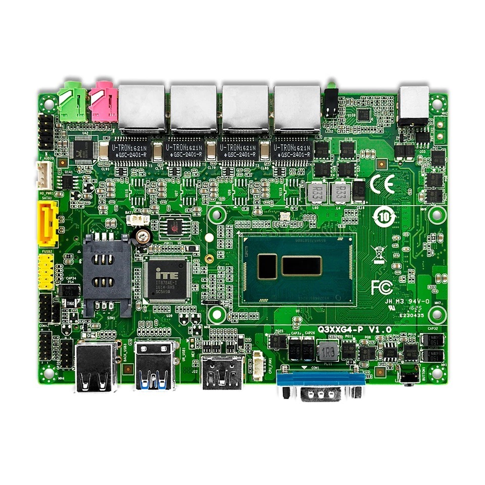
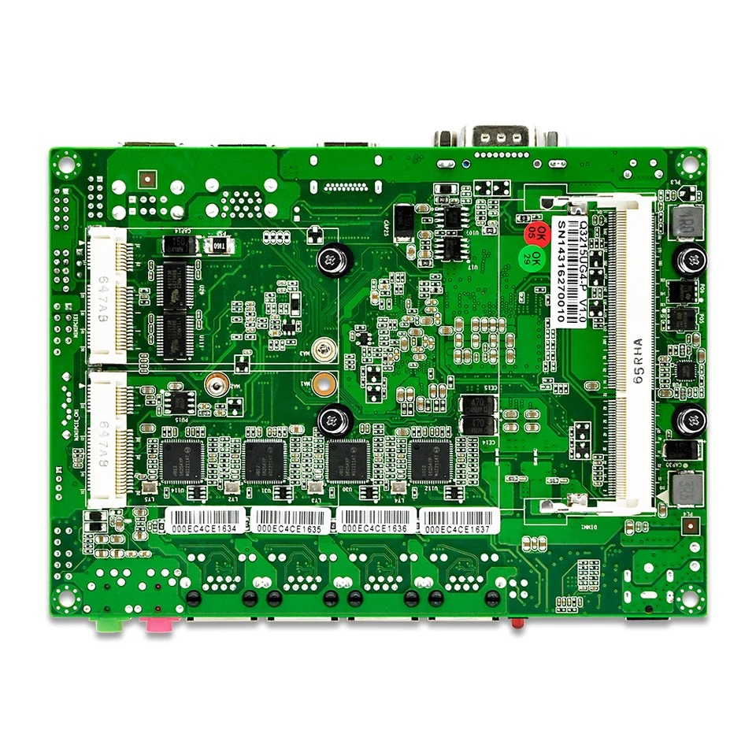
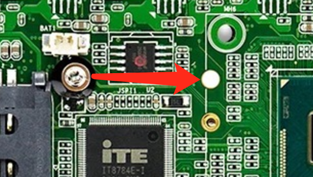
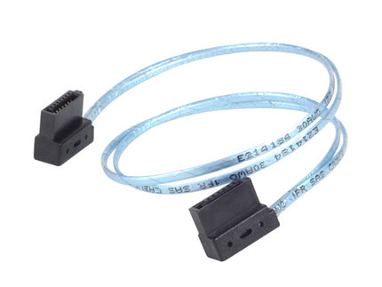
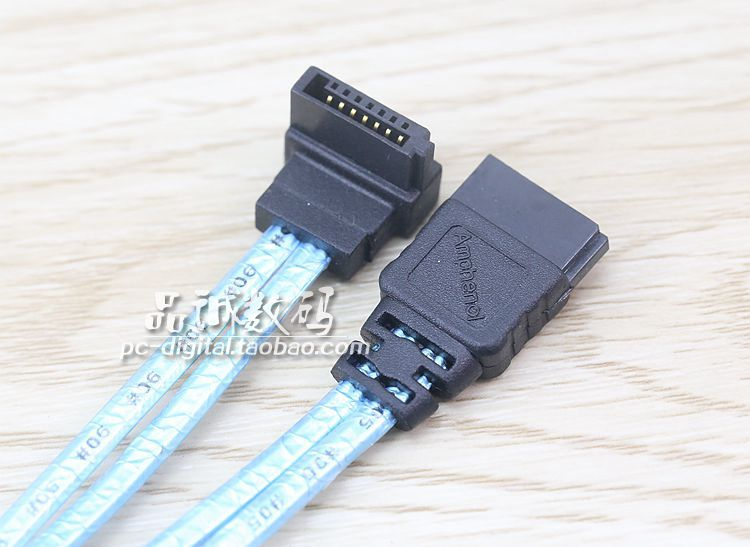
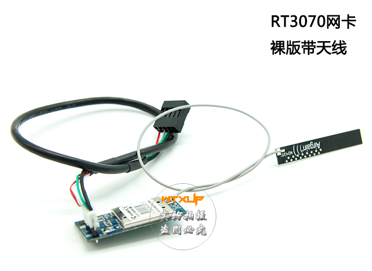

自从三月份过了面试之后，除去被拽回来之前工作的几天，剩下的时间基本上都是一条大咸鱼，基本上除了 Umefit 日常之外就只做一做 OpenWRT 的定制。六月份更是干脆辞掉了 Umefit 的工作，安安心心的享受剩下的一个来月的闲暇时光。

草民的 NAS 在这一段时间经历了包括换 11ac 无线网卡、更新到 LEDE 开发分支等一系列改动，但是后来发现 Samba 的速度始终上不去。而且在使用中也越来越觉得 Atom N2600 的性能确实颇为不足……

然后我就突然发现了这个。

<!-- more -->

这是一块基于 Celeron 3215U SoC 的主板（为什么叫 SoC……一看便知）。虽然说是 Celeron 但是其实我们都知道就是之前的 Atom 产品线改个名字而已。不过一看有四个千兆网卡还都是 Intel 的就有些动心……

一看价格 599。

有句话说得好，永远不要在大半夜做决定。但是我当时就把这句话忘了。于是开工吧。

# Hardware Reassembly

除了 SATA 硬盘用的两条线需要重新摆放之外，剩下的问题并不多，主要是 Mini PCIE 接口需要从半高改为全高。

主板在这里的设计还是比较人性化的，拆下 CPU 散热片，拧下一个螺丝就能把 Mini PCIE 固定用的螺柱取下，然后把主板对应位置的一个贴纸也撕下来粘到对应位置，在对应位置拧好螺柱并复原散热片即可。

但是 SATA 线遇到的问题就比较多了。

# SATA Data Cable

与之前的主板不同，这块主板的 SATA 数据线接口在主板的左边缘。如果使用之前的数据线的话，势必会凸出去很大一截；另外长度也是很让人头疼的一个问题。

在万能的某宝上找 SATA 线。除去普通的直头和 90 度弯头线，我还找到了这样的两种：

分别是银欣 CP11 的水平接头数据线和某不知名小厂生产的反弯头数据线。搜了一下发现反弯头数据线其实十分常见，而且考虑了一下也比较适合我的需求，所以最后选了一条比较软的反弯头数据线。当然这条线就明显太长了。

【图】

# SATA Power Cable

硬盘电源线真的是把我坑死了。草民自己不小心 + 官方文档错误标记导致原硬盘直接被烧毁，接近 1TB 的数据毁于一旦。

**注意！官方 PDF 标记是错的！！！**

当时买主板的时候没仔细看就下单了，后来看评论发现卖家送的硬盘线电源部分似乎只有 5V 和一根 GND……心里纠结了半天。

收货之后看了看主板背面，感觉电源接口的定义跟之前那块大不一样，这个很明显是把两个 GND 放在了下面一侧而不是中间的两个 Pin。

不过我后面居然也没多想，测试的时候我就直接把原来的电源线和我装了大量数据的硬盘随手接在了新主板上。然后试图打开电源。结果发现电源似乎自动触发了某种保护机制，无法上电。

试了好几次还以为是电源问题……后来越想越觉得不对劲，直到后面想起来去看下官方 PDF 定义的时候……更懵逼了。

**1 和 2 在你家主板上明显是连在一起的好嘛！！！咋可能一个 12V 一个 GND 嘛！！！**

我居然还就信了官方 PDF，忽略了上面明显错误的提示。改了电源线线序之后重新试图上电，结果一样还是触发保护机制。

这么折腾了几次我觉得也毫无意义，还是回去用万用表老老实实测出哪个是 5V 哪个是 12V 比较靠谱。

回去测过，结果是方形的 Pin 是 5V，旁边是 12V，另外两个是 GND。改变好线序接好上电，然后发现还是自动保护……

干脆换了个 12V 电源。这次倒是成功开机了，不过硬盘传来了几声清脆的啪啪声……瞬间意识到不妙。一闻果然一股焦糊的味道……完蛋了。

那一瞬间真的是想死的心都有了。

送去狗东，狗东说按政策不保数据。没买服务，想了想那块盘上的东西虽然确实很多不过总价值大概也没有上千……大多数重要东西倒是都在各处有零散的副本。

最后处理是换新了，居然也没收我钱……

统计损失，14 15 年做的很多东西，收集的很多资源之类都丢失了。16 年做的东西还好，丢的主要是些大作业之类无关紧要的东西。而且恰好是在准备从 Umefit 离职，交接工作基本完成；新工作相关的东西都在公司配的电脑上，并没有放在别处。损失固然惨重，不过大多数都是旧的东西，咬咬牙也就扛下来了。

# Thoughts about disaster

想来最主要的过错方是主板厂商。

**这种地方官方的 PDF 都能标错，这锅是绝对甩不掉的。**

而且最终测出来的定义跟之前 SV3-26026 的定义完全不一样，重点是完全不符合正常的 D 型口的规范，无论方向是怎样都不符合。这家厂商为什么要这么做，我是真的不理解。

当然，草民一上来就用装满重要数据的硬盘来测也是十足的作死，这点草民也并不否认。

至于能做什么，我当即买了 50GB 的 iCloud，并且重新配置了 OneDrive。iCloud 使用体验一直还不错，OneDrive 经过针对 GFW 的优化之后速度也能得到极大提升，完全可以满足日常使用需求。对于绝大多数需要保留但是没有很强的私密性的东西，比如照片、文档、不适合用 Git 管理的个人项目之类，放入这些比较保险的网盘是非常合适的选择。

总结下教训：

* 不要拿重要数据载体作死。
* 硬件故障虽然概率不大，但是一旦发生往往意味着无可挽回。
* 做物理上的异地备份，无论是 VPS 还是公有云存储服务。
* 对于包含关键数据的私有存储一定要使用 RAID5、RAID6 甚至 RAID1 来最大程度减少设备故障导致数据丢失的可能性。
* 软件层面的安全同样重要，对于关键数据可以考虑使用 btrfs 快照，避免诸如勒索病毒等带来的威胁

目前这台 NAS 还是用来装些电影和下载的镜像之类的无关紧要的东西了，下一台设备至少要配四个硬盘组 RAID6，不然真的不放心。

# Other Hardware Changes

在帝都呆着的时候，网络肯定是共享了。过道上放了个颇显破旧的 TP-Link，5GHz 自然是没有的，而且动不动就死机，稳定性恐怕还不及我的 WR703N。

不过问题还是得处理。比较优雅的方法自然是在 NAS 上再加装 2.4GHz 无线模块，就像很多双频路由器一样。

挑了一阵买了这个。

虽然之前（两年多前还没校园网只能用 CMCC-EDU 的时候）被 3070 坑过一次，发热严重稳定性感人，开 AP 没一会儿就熄火了。实际上我也是下单之后才意识到的……

买这个之前我试了试直接用 RTL8188CUS，但是完全无法工作。仔细思考后意识到可能是 USB3.0 的干扰问题……把 RTL8188CUS 插上苏菲，也同样发生了几乎无法使用的情况，瞬间感觉药丸。

到货之后果然是坑了。NAS 上面装的是 Ubuntu 17.04，无线网卡完全不能使用，折腾许久也没任何办法。后来换了 Windows Server 2016，勉勉强强能连上了，但是说不准什么时候就会断。把外面过道上的路由换了个信道之后效果倒是似乎显得好了很多……但是这样也没啥用，不能像我一开始期望的当做一个中继器来用。

后面换了 Linux Mint，效果倒是意外的还不错。几天之后又换了 Deepin，效果也是意外的还行。本来以为可以就这样岁月静好下去了，结果机器连续跑了一个星期之后 USB 无线网卡再也识别不出来了。折腾许久仍无起色，没法子，拔下来丢掉了。

后面又买了一个小米 WiFi 插上，顺便试了试延长线（我的显示器上有个 Hub），并不意外的最终确认了原因，主板 USB3.0 的干扰，无解。

还好当初换了 QCA9880 这个 5GHz 的无线网卡……不过现在又有些后悔，感觉不如不买这个破主板了……

于是现在的使用方式依然是插一个 WR703N 接无线信号，网线进 NAS 然后 NAS 再开 5GHz 的 AP。

折腾了好久，硬件基本上没心情再折腾了……后面应该会主要在软件上下功夫。