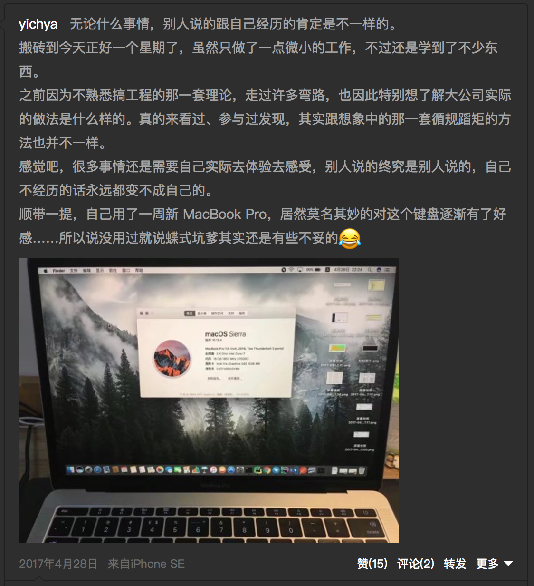
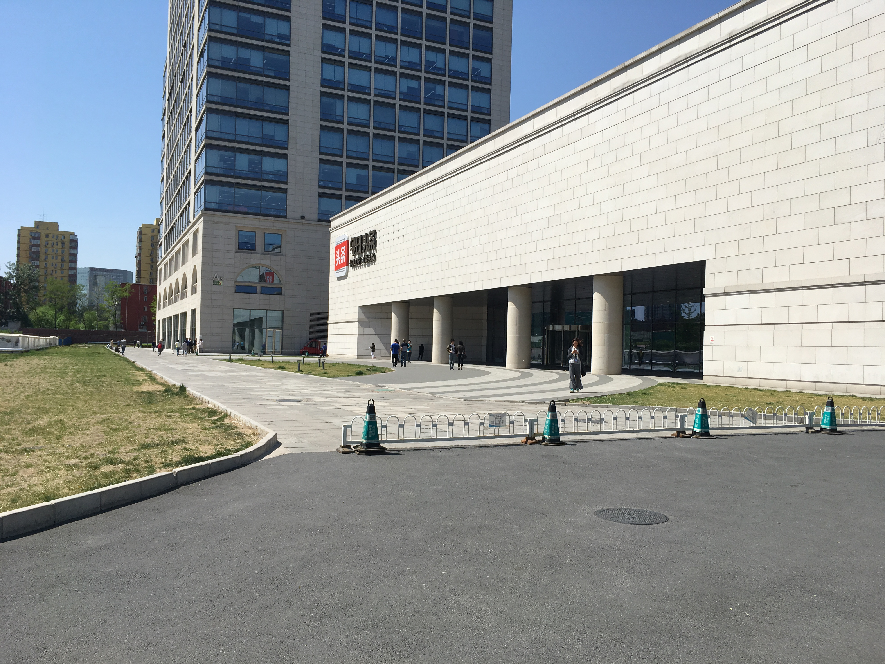

按照计划，半年一次记录。 

其实这半年基本上算是平静无波，大多数事情还是比较让人开心。

<!--
* 1.x Go Master
* 2.5 手工 tcp bbr patch
* 2.9 诛仙
* 2.17 4c Android 7.0
* 2.19 Ryzen
* 3.5 RabbitMQ
* 3.8 Card Picker
* 3.12 Surface 3
* 3.15 Bytedance Interview Appointment
* 3.17 Bytedance 1st Interview
* 3.19 CCF
* 3.21 Bytedance 2nd Interview
* 3.25 Watch Netease Interview + Tencent Interview
* 3.28 Beijing Tour
* 3.31 SpaceX 2nd Falcon Launch
* 4.1 DotNet Linq Presentation & SSSTA Floor AP
* 4.3 Study Golang
* 4.4 SSSTA Hackday
* 4.5 11n 5Ghz Network
* 4.7 Softstar new game
* 4.11 11ac Network
* 4.14 Home + School Disaster
* 4.21 Bytedance Onboard
* 4.30 GPP
* 5.2 Final Disaster
* 5.7 SJZ Metro
* 5.10 Build 2017
* 5.12 Eternal Blue
* 5.13 Navigate B
* 5.19 New Surface Pro
* 5.22 Unique Hackday Signup
* 5.23 Alphago again
* 5.24 Unique Hackday Admission
* 5.27 Bottles about Onmyoji
* 5.28 Cosplay Show
* 6.2 Fly to Wuhan
* 6.4 Unique Hackday Best Tech Award
* 6.6 WWDC 2017
* 6.9 New NAS
* 6.12 HDD Disaster
* 6.21 Projector
* 6.23 Schoolmate :)
* 6.24 SSSTA Meetup
-->

# Overview 

这半年来：

* 寒假立的 Flag 基本上都顺利的收回来了。
    * 实习还是完全靠自己的力量搞定了，虽然还是吃了学校套路。
    * 分布式相关的技能也在平时和工作中逐渐熟练。
    * Lua Web Server 基本上没再动……
* 心理状态比较正常，从签实习之后基本上处于无欲无求的状态，感觉比之前还是好了很多。
* 技术上感觉有一定提升，不过更多的还是照顾了自己的兴趣。

# Courses

现在基本上也不怎么关心成绩了……态度基本上就是不挂科就行。大三上学期确实也达到了这个目标……也仅此而已……实在是没什么可以说的……

说得上的，闲着没事儿去考了下 CCF，第二题翻车只得了十分。总分 200 实在是不值一提，跳过吧。

# About Work

开学基本上跟贵协挺多强者一样就在忙春招找实习的事情。

草民一开始选了几家，但是基本上不是因为时间不合适就是地点不合适，各种吃 Reject……直到 3.15 突然收到来自头条的 HR 小姐姐的电话。后面面试就是，一轮被花式吊打都感觉怀疑人生了不过居然过了，二轮被拽着一个点花式吊打，不过居然还是过了……然后就跟 HR 小哥哥谈好了入职的事情。

很快黄大人跟林韬也都顺利的谈好了自己入职的事情。他们两个都去了饿了么，也是很不错的公司了。

三月底跟丫丫去了下帝都，说是自己去找房子，其实更多的是想要让自己适应一下，给自己一个缓冲的机会。感觉骑自行车穿行在一座城市，是最快的一种熟悉它感受它的方法……丫丫在感受了生存的残酷之后选择弃坑。

四月中旬离开了学校。房子租了自如，算上乱七八糟的大概要有 3500 一个月，只有一间小卧室……还是有点贵啊。

4.21 正式入职。在头条工作的几天真的很愉快！吃的也好【233333】。

然而好日子不长，5.2 吃了你们学校的套路，不得不跟 HR 小哥哥、mentor 小姐姐还有大 Boss 请长假。这次套路的原因居然是，二班某位去饿了么的哥们的大 Boss 跟导员是同学……

回来被导员骂了一顿倒也没什么事情。跟家里也算是彻底讲清楚了。怎么说呢，对你们学校这次是真的无话可说了……

五月份把 Umefit 的事情也完善了一下，六月正式辞职，安心享受最后一个月的学生生活。

现在距离回公司也就大概一个星期时间了 :)

祝自己成功。

# Unique Hackday

五月底看到了华科第四届 Unique Hackday 的相关新闻，想来那个时候考完算法也没什么事情，而且还报销交通费用。于是跟贵协一众强者一起报了名，收到通过邮件的时候开心到无以言表。就这样，一行浩浩荡荡 11 个人就飞去了武汉。

去年在这座城市呆的几天让我对它的印象真的非常非常好，一想到又要去武汉，简直开心到要飞起来了。

