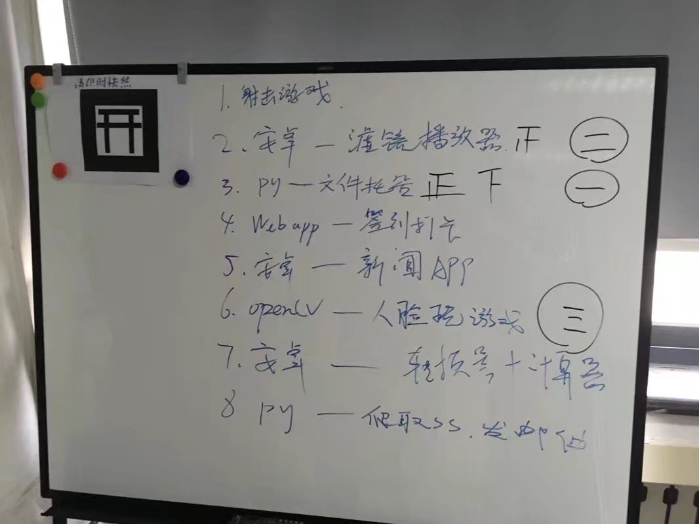

按照计划，半年一次记录。 

其实这半年基本上算是平静无波，大多数事情还是比较让人开心。

# Overview 

这半年来：

* 寒假立的 Flag 基本上都顺利的收回来了。
    * 实习还是完全靠自己的力量搞定了，虽然还是吃了学校套路。
    * 分布式相关的技能也在平时和工作中逐渐熟练。
    * Lua Web Server 基本上没再动……
* 心理状态比较正常，从签实习之后基本上处于无欲无求的状态，感觉比之前还是好了很多。
* 技术上感觉有一定提升，不过更多的还是照顾了自己的兴趣。

# Courses

现在基本上也不怎么关心成绩了……态度基本上就是不挂科就行。确实也达到了这个目标……也仅此而已……实在是没什么可以说的……

说得上的，闲着没事儿去考了下 CCF，第二题翻车只得了十分。总分 200 实在是不值一提，跳过吧。

上半年学的所有课程唯一有点印象的基本上也就是 .net 了。吹了一波 LINQ，效果还不错。

# About Work

开学基本上跟贵协挺多强者一样就在忙春招找实习的事情。

草民一开始选了几家，但是基本上不是因为时间不合适就是地点不合适，各种吃 Reject……直到 3.15 突然收到来自头条的 HR 小姐姐的电话。后面面试就是，一轮被花式吊打都感觉怀疑人生了不过居然过了，二轮被拽着一个点花式吊打，不过居然还是过了……然后就跟 HR 小哥哥谈好了入职的事情。

很快黄大人跟林韬也都顺利的谈好了自己入职的事情。他们两个都去了饿了么，也是很不错的公司了。

期间围观了腾讯和网易的笔试，感觉自己还需要学习很多。另外网易笔试容我呵呵一下某些人……

三月底跟丫丫去了下帝都，说是自己去找房子，其实更多的是想要让自己适应一下，给自己一个缓冲的机会。感觉骑自行车穿行在一座城市，是最快的一种熟悉它感受它的方法……丫丫在感受了生存的残酷之后选择弃坑。

四月中旬离开了学校。房子租了自如，范围内的一个叫太月园的小区，2000 年左右，条件还算不错。算上乱七八糟的大概要有 3500 一个月，只有一间小卧室……还是有点贵啊。

4.21 正式入职。在头条工作的几天真的很愉快！吃的也好【233333】。

然而好日子不长，5.2 吃了你们学校的套路，不得不跟 HR 小哥哥、mentor 小姐姐还有大 Boss 请长假。这次套路的原因居然是，二班某位去饿了么的哥们的大 Boss 跟导员是同学……

回来被导员骂了一顿倒也没什么事情。跟家里也算是彻底讲清楚了。怎么说呢，对你们学校这次是真的无话可说了……

五月份把 Umefit 的事情也完善了一下，六月正式辞职，安心享受最后一个月的学生生活。

祝自己成功。

--------------

从考完试到现在基本每天要么是非常忙要么是累到死什么都不想干，实际上到这篇东西写完的时候已经是七月底了。

回家呆了两天就急急忙忙的赶来帝都了，不过还是跟草民的预想不一样。因为上研的事情跟家里闹的不怎么愉快，预想好的提前找房子也没实现，来抢房子的时候真的是绝望。

在 3km 外的地方租了个非常破的小屋子，住了十来天，今天成功换回到了太月园。房租比之前太月园那一间贵了 30，不过卫生间好很多。重点是可以继续拿房屋补贴了。舒了一大口气。

回到公司，重新接到各种需求，马不停蹄的投入写代码的状态。跟同事也在慢慢的熟悉起来。

给自己定些小目标吧：

* 了解业务，尤其是 BI 相关的业务。利用得天独厚的条件学习数据分析相关的知识，增加自己的竞争力。
* 完成一次比较小的技术改进，比如利用 Thrift 进行常量管理。
* 成功转正。
* 学习足够多的实践经验，借此通过今年年底的架构师考试。
* 推动一次比较大的技术改进，比如全面切换到 Python 3。可以分几步完成：
    * 分享一些 Python 2 和 3 兼容的方案，比如 six。
    * 推动上述方案的进行。
    * 在时机合适的时候对基础库做同样的改进。
    * 在时机合适的时候完成全面切换。

再次祝自己成功。

# Unique Hackday

五月底看到了华科第四届 Unique Hackday 的相关新闻，想来那个时候考完算法也没什么事情，而且还报销交通费用。于是跟贵协一众强者一起报了名，收到通过邮件的时候开心到无以言表。就这样，一行浩浩荡荡 11 个人就飞去了武汉。

去年在这座城市呆的几天让我对它的印象真的非常非常好，一想到又要去武汉，简直开心到要飞起来了。

考完算法出发前的那个晚上那边给出了主题：“夏日的烦恼”和“学科间交叉”。一脸懵逼。徐子大概是蛤三篇看多了，居然从蟾蜍出发想到了夏天蟾蜍各种叫唤然后我们就通过机器学习方法识别出附近环境中的蟾蜍属于哪个品种然后通过释放对应品种的求偶信号或者天敌信号实现捕捉或者驱赶蟾蜍的这么个东西……

飞去武汉。人生头一次坐飞机 233333 感觉除了前半个小时后半个小时啥都不能干（总共也就一个半小时飞行时间）而且全程不能玩手机实在是非常无聊之外跟高铁也没很大区别【笑哭

到武汉之后感觉跟上次来很像，也是感觉扑面而来的潮湿空气，脚底好像都湿透了。

上次来玩没坐地铁，这次有机会坐了还是很开心。然后我们就成功坐地铁穿过了整个武汉……

从地铁站出来到住的地方颇费了一番周折。草民带的东西比较少于是决定自己骑个摩拜，嗯，然后就转了一个多小时，期间各种吐槽，在光谷被堵到没脾气，各种没有自行车道的路线，修地铁到处尘土飞扬，天还热的要死。

晚上看了神奇女侠，嗯……虽然我没什么情怀不过感觉还是很不错的。

看完之后出来吃夜宵，小龙虾实在是差评不想多说了。看了徐子找到的论文，感觉可以一试。遇事不决莽一波，大力出奇迹。确定了通过语言识别分析蟾蜍品种的方向，考虑好了该怎么实现该怎么扯 ppt，甚至一旦无法达成目标最后该怎么做演示用的 Mock 都想好了，感觉基本上是尽人事了，剩下的就听天命。

住处的热水器多么坑爹就不说了，总之那个晚上所有人都没睡好。

第二天来到了熟悉的华科。嗯，感觉真的挺熟悉的……领到了纪念品 T-shirt 还有一个小抱枕，装在一个布袋里面。布袋还是挺实用的。

【图】

比赛前某位校长还是院长的演讲提到去年没有举办 Hackday 其实还是因为这个事情颇为耗费精力，为了两天的比赛整个团队要花超过一个月来筹备，于是团队内部其实也有分歧。这个草民还是能体会到……感觉能有一群心向一处而且有足够执行力的人为同一个目标奋斗实在是太难得了，大多数时候都不得不作出取舍……

真正的比赛过程其实平静无波，大多数事情都还是按照预想的推进下来了。草民顺利的搞定了音频文件的分析、特征提取并且搭起了一个 SVM，丫丫出了足够多的图，黄大人搞定了动画，林韬做好了 App，徐子搞定了 PPT 和用于吹逼的话术。过程中见到了各种大佬，玩 VR 的，玩智能硬件的，高中起就组织 Hackday 并且热衷于此的……除了 Orz 就是 orz……感觉自己无论是能力还是意识跟这些强者比起来都有非常明显的差距，行动力更是远远不如。当然很让我高兴的是是大二诸君跟草民一样颇受触动，希望他们也能因此更加努力奋进吧。

评审的时候发现跟我们预想的很不一样……我们居然要去自己一个一个跟评委谈……当时选定蟾蜍这个主题本身就有一些哗众取宠的意思在里面，然而这么做的话根本就不存在观众了……设计之中的彩蛋（你们懂的……）也不可能拿上来了。

几个评委中给我印象最深的是一个叫做 Kika 的做输入法的公司的一位工程师，因为他很明显对我们这套东西特别了解……甚至提出了改进方案……整个过程中也看了很多其他的团队的东西，其中印象最深的当然是用做实验的那一套方法把妹的那个 App……这哥们实在是 6 翻了。

评奖的时候我们居然还是最佳技术奖……受宠若惊。

前面那个把妹 App 获得最佳设计奖，我个人感觉可以说当之无愧，不过丫丫等人对此倒是不以为然。最佳创意 GitArt 出自前面提到的高中生大佬，听名字真的很让人感兴趣，不过可惜因为流程的关系我们很难真的了解它到底是个什么东西了。至于一二三等奖……草民只记得一等奖是一个从雨伞出发的社交 App，个人觉得十分切合主题，创意也还好，设计似乎还加了分，不过很难让人理解它到底为什么能突破各种大佬做出来的东西拿第一。

联创团队后来也在知乎上提了体验类问题，草民占了个坑到现在也没填，懒 + 没时间。总体来说主办方诚意确实足够了，但是由于经验，包括去年断档等一系列原因吧，很多流程上细节上做的都不尽如人意，不过我还是很看好他们的。贵协大二的各位强者也确定明年一定会去了，期待他们的精彩表现。

来之前请假请到了周三，当然还是希望好好浪上一波了。黄大人早早的回家看牙去了，林韬被突如其来的大是大非打了个措手不及只能跟我们一起回学校。于是我们几个去好好的逛了一次汉街，逛了武大，东湖上赛了一波艇，算是把上次没浪到的地方开开心心毫无心理负担的重新浪了一遍。顺便今年的 WWDC 也是在武汉看的，后面会谈。

【图】

不知道这次之后还会不会有机会回武汉了呢。

呆过的城市里面印象最好的就是武汉了。石家庄第二，西安本来估计是最后一名，不过还有帝都给它撑着。

感觉跟帝都相比，西安还是要友好很多，毕竟人生中最后一段可以说无忧无虑的日子是在西安过完的，三月底回去的时候听到地铁报站的声音都会感觉无比，无比亲切……

# SSSTA Hackday

今年的清明集训本来是希望能搞大点的，然而很可惜，准备的太晚了以至于几乎没得到什么宣传。最后还是贵协内部 9 个作品。

包括网盘

射击游戏

基于 LBS 的签到器

自动抓取 SS 并发送邮件的爬虫等，很多东西手头都没有留照片……很不错，有想法能实现，大家都很棒。

还是希望明年，贵协自己能有同样的有创意有想法有技术含量的作品出来大家一起比较，贵协能强大到吸引学院里其他的人，甚至其他学院、其他学校的人一同竞技。出门参加联创这样的团队组织的 Hackday 也能有所斩获。

# SSSTA Meetup

临近毕业，贵协大多数人都去给大四送行。

大概是贵协人最多的一次碰头了吧。

三年来贵协让草民受益良多，无论是个人技能还是眼界上都得到了极大提升。

希望贵协能一直发展下去，最终能够成为跟华科的联创、冰岩齐名的团队。

# SJZ Metro

5.7 庄里地铁通车。七月份回家从高铁站坐了一小段，体验了一波。

挺不错的，以后去火车站，东西不多的话骑个摩拜到和平医院再坐地铁就可以了。

想想一线城市人口爆炸的最核心原因中，交通肯定是大头。以后要是能解决交通问题，比如实现石家庄到北京只需要半个小时……其实我觉得互联网公司远程工作更有盼头。

# Cosplay Show

时隔两年半，又去看了一次曲漫。

网易还真是财大气粗……专搞了一大块地方卖跟农夫山泉合作那个饮料。

小姐姐很多很好看，有秦爷在，收了不少图。

【图】

应该是最后一次在西安看漫展了吧 233333

ps. 说到这个饮料啊……草民扫了十五六个盖子结果就只有一个 AR 符，抽出来的还是个兵俑，可以说非常脸黑了。

# Events

说来上半年自己经历的事情虽然多，不过跟科技圈大事件比还是少得多了。

* **Build 2017** 日常信仰充值！MS 企业云日常放大招，Cosmos DB 秒天秒地实在是令人印象太深刻了。MS 更多的提到了企业现有的设备如何通过 IOT 框架接入到企业云实现自动化管理和监控。Serverless 作为今年的主题也被 MS 重点宣传。Windows 的发展明显开始发力于虚拟现实和真·平台化，逐渐走出 MS 之前划定的自家的圈子。包括 Timeline 和 WSL 都是很明显的趋势。Timeline 真的是好东西，可惜推迟了，今年还见不到……还有后面几天新款苏菲的发布，很可惜还是没有 ThunderBolt 3 接口。
* **WWDC** macOS 跟 Windows 一比感觉就没有那么多新的特性，不过 APFS 替代 HFS+ 这个上古文件系统还是很不错的改进。最后 ARKit 放大招，真的是不得不服气，实在是牛逼……本来还不知道苹果为何迟迟没有动作，结果一拿出来就是 6 的不行的成果，MS 还得加把劲啊……另外纪念碑谷 2 也在 WWDC 上发布了。当天下载下来玩通关，故事还是不错，新的机关设计也很有创意。
* **SpaceX 2nd Falcon Launch** 从一开始回收成功感到特别激动，到后来回收失败感到特别意外。现在连复飞成功都已经觉得一点都不意外了。SpaceX 真的牛逼。
* **Ryzen** AMD 十二年之后再次翻身。十二年之前草民大概也就是刚启蒙，抱着一本过期杂志上的 RAID 能翻来覆去的看好几遍，当时各种杂志上基本上全都是 Athlon64，火了一年有余，才被新款 Core 抢去风头。如今回顾往事也是颇有感触啊。
* **Eternal Blue** 记得去年还因为自动更新跟贵协很多人争执过，这次出这么个事儿，大概是草民能得到的最有力的支持了。记住，安全风险从来都不是一句空话。
* **Go and Master** 人类终于在围棋上失去了最后的尊严。

# Devices

设备不多。NAS 的数据灾难实在是让我心痛……

* **Surface 3** 一直想要一个方便的手写板，正好缺个平板，就买了 Surface 3。其实最核心原因还是 Surface 4 难产。体验还不错，比起 Nexus 10 那个宽到实在不能接受的边框，Surface 3 的屏占比还是可以接受的。手写笔受性能限制延迟还是比较严重，不过用起来还凑合。
* **SSSTA Ceil AP** 给贵协天花板装了个 AP，希望借此改善网络环境。实际效果并不特别好，毕竟贵协最大的问题还是出口带宽太小了。
* **QCA9880 11ac Network** 四月初给 NAS 换了 11ac 3xMIMO 的无线网卡，实在是爽到爆炸，延迟和带宽都跟直接插千兆线差不多……可惜现在住自如，房间里的 AP 只有 2.4G 信号，并不能用 NAS 中继，所以 NAS 目前就处于吃灰状态……等键盘到了大概还会考虑修改设计吧。
* **GPP SIM Overlay** 偶然看到 GPP 新款卡贴完美解锁 4G 的新闻，立刻到官方淘宝店买了一片。等待的时候无比忐忑（毕竟快一个月的漏洞了天知道能不能赶上车）。结果最后十分顺利。办了微博 V+ 卡，套餐全都是全国而且流量也足够便宜并且够用，而且考虑到自己也比较经常用微博。目前经历了 10.3.2 10.3.3 升级（iOS 升两次级通知栏那个 Bug 都没修，辣鸡）一切顺利。有锁瞬间变无锁实在是太完美了。
* **3215U Mainboard** 六月份给 NAS 换了主板，整体重新组装，过程中烧了硬盘……前面的 blog 已经提过，这里就不细说了。
* **Xgimi z4Air** 四月份住自如，床正对面就是一大白墙，当时就想买投影。618 打折 + 免息，果断入手。感觉分辨率就那么回事也凑合够用，但是对焦经常有不准的情况。自带 Android 平台配置明显过时了，而且莫名其妙的阉割了 Miracast 功能，导致很难开开心心的无线投影。
* **4c Android 7.0** 不算新设备，不过可以提一下。升级之后打阴阳师流畅了些。

# Projects

* **Card Picker** 学习 Nameko 的作品。随便让大家推广了下，看起来还有点儿意思。
* **Navigate B** 感觉还是有必要了解一下 Golang，于是软件建模技术的大作业就用 Golang 来写了。虽然大体上就是把 xp 写的 PHP 翻译成 Go……自己用 Obelisk.js 加了个演示图，算是自己做的一些东西吧。
* **tcp bbr patch** 人肉把 TCP BBR 拥塞控制算法移植回了 4.4 内核。亲测有效，当然并不适用于 NAS……还是老老实实的用 Reno 速度比较快。

# Entertainment

* **诛仙小说** 我也不知道为什么总之就是想看。强烈吐槽作者挖坑之后瞎 jb 填的行为。
* **幻璃镜手游** 上海软星官方作品。四月份不限号删档测试的时候玩了一个星期，感觉受不了。五月份正式运营，玩了不到一个月感觉确实受不了，弃坑了。六月份发现百度开始发力宣传了……不知道现在怎么样，还会不会卡剧情卡半个月……然而完全没有回坑的愿望……
* **阴阳师的日常** 这半年欧气奇足，花鸟卷青行灯茨木童子辉夜姬荒川妖刀一个接一个的来……而且还又抽了个酒吞……妖刀是攒齐碎片之后一周又抽了一个，我当时就真是日了狗了……今天更新新活动，SSR 一个可以换 10 金御札，7.31 的时候用 20 金御札可以换一个随机 SSR。只求不要来重复的，最好是个小姐姐……

# Finally

现在是 7.23 04:32。

一开始确实也没想到自己直到现在，拖了三个星期才有精力和心情把上半年的总结写完，而且关于虚拟化的那篇东西还在拖着。

天要亮啦。如果有什么想到的还没说的，之后有心情再补在这里吧。

与看的这里的你共勉。