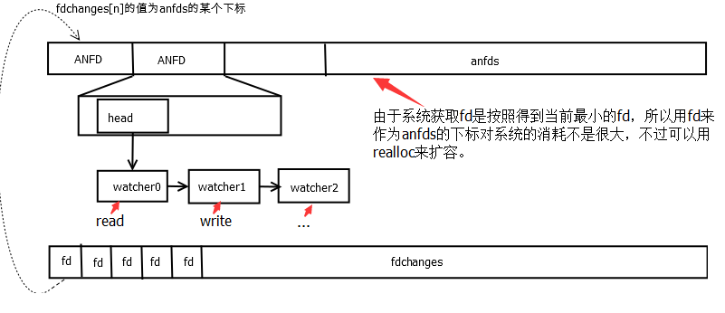
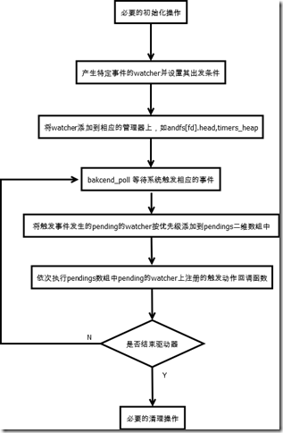

Gevent 技术分享系列。

目录：

* 协程核心：Greenlet
* gevent.core 与事件模型 libev
* 调度核心：gevent.hub
* 典型应用：gevent.socket

ref:

https://yuyang0.github.io/articles/gevent.html

libev 是一个跨平台的事件库，在类 unix 系统上会使用。之前 Node.js 也是依赖 libev 的，不过后面经过发展，演变出了跨平台特性更好、对 Windows 的 IOCP 支持更加完善的 libuv。

这里会涉及到的 IO 模型是 epoll，相关内容可参考 http://www.cnblogs.com/pang1567/p/4057375.html。

关于 libev 可以参考这里：

* http://www.cnblogs.com/pang1567/p/4070073.html
* http://www.cnblogs.com/pang1567/archive/2014/11/03/4071515.html
* http://www.cnblogs.com/Huayuan/archive/2013/05/03/3058580.html

这里我只会比较基本的介绍 libev 的使用方法以及一小部分具体的实现。

gevent.core 基本上是对 libev 的封装：

```
This module is a wrapper around libev__ and follower the libev API pretty closely. Note,
that gevent creates an event loop transparently for the user and runs it in a dedicated
greenlet (called hub), so using this module is not necessary. In fact, if you do use it,
chances are that your program is not compatible across different gevent version (gevent.core in
0.x has a completely different interface and 2.x will probably have yet another interface).
```

这里提到了 gevent.hub，hub 提供了在 Greenlet 之间传递信息的能力，以及一些其他的调度功能，具体我们后面再谈。

## libev 的 Watcher 和 Loop

Watcher 实际上是用来封装各种类型的事件的，不同类型的事件会有不同类型的 watcher，比如 `ev_io`、 `ev_timer`。该结构一般会有一个回调函数，当事件触发时就会调用回调函数。Watcher 会有两种函数（注意 TYPE 代表 Watcher 类型，可以是 `io`，`timer`, `signal` 等等）：
* `ev_TYPE_init` 对 Watcher 对象进行初始化。对 IO 而言该函数是 `ev_io_init`，对 timer 而言，该函数是 `ev_timer_init`。
* `ev_TYPE_set` 与 init 系列函数的区别是该函数一般不设置 callback
* `ev_TYPE_start` 将 Watcher 注册到事件循环中，这样就可以监听事件了。

Loop 即是循环，用于检查所有注册在其中的 Watcher 是否获得到事件。后面我们会具体介绍 libev 的 loop 具体的工作流程。

## gevent.core 的 API

gevent.core 对 libev 的这些组件进行了封装。

### Watcher

这是 libev 的 watcher（cwatcher) 对象的封装，以 io 为例。

```py
#define WATCHER_BASE(TYPE)                                            \
    cdef public loop loop                                             \
    cdef object _callback                                             \
    cdef public tuple args                                            \
    cdef readonly int _flags                                          \
    cdef libev.ev_##TYPE _watcher                                     \

cdef public class io(watcher) [object PyGeventIOObject, type PyGeventIO_Type]:

    WATCHER_BASE(io)

    def start(self, object callback, *args, pass_events=False):
        CHECK_LOOP2(self.loop)
        if callback is None:
            raise TypeError('callback must be callable, not None')
        self.callback = callback
        if pass_events:
            self.args = (GEVENT_CORE_EVENTS, ) + args
        else:
            self.args = args
        LIBEV_UNREF
        libev.ev_io_start(self.loop._ptr, &self._watcher)

    def __init__(self, loop loop, int fd, int events, ref=True, priority=None):
        if fd < 0:
            raise ValueError('fd must be non-negative: %r' % fd)
        if events & ~(libev.EV__IOFDSET | libev.EV_READ | libev.EV_WRITE):
            raise ValueError('illegal event mask: %r' % events)
        libev.ev_io_init(&self._watcher, <void *>gevent_callback_io, fd, events)
        self.loop = loop
        if ref:
            self._flags = 0
        else:
            self._flags = 4
        if priority is not None:
            libev.ev_set_priority(&self._watcher, priority)
```

`WATCHER_BASE` 定义了一系列的属性:

* `loop` 是 `Loop` 类的一个实例，下面我们会分析 `Loop` 是什么
* `_watcher` cwatcher 对象，也就是一个 libev 的 ev_io 对象
* `callback` 回调函数，注意该回调函数是由上层传递进来，它不是由 libev 直接调用，而是由 libev 的回调函数调用，具体到本例就是被 `gevent_callback_io` 调用。
* `args` 一个元组，传递给回调函数的参数
* `__init__` 该函数会设置 loop 属性，同时初始化 libev 的 io watcher 对象 `_watcher` (主要做两件事: 指定事件类型,指定回调函数), 注意它的回调函数 是 `gevent_callback_io`
* `start` 该函数会设置回调函数以及参数，这里设置的回调函数是上层传入的，不要和libev的回调函数混淆，同时调用 `ev_io_start` 将该Watcher 注册到 libev 的事件循环中。

为了弄明白 libev 事件循环的过程，我接下来分析 `gevent_callback_io`。

`gevent_callback_io`

```c
#define GET_OBJECT(PY_TYPE, EV_PTR, MEMBER)                             \
    ((struct PY_TYPE *)(((char *)EV_PTR) - offsetof(struct PY_TYPE, MEMBER)))

static void gevent_callback_io(struct ev_loop *_loop, void *c_watcher, int revents) {
    struct PyGeventIOObject* watcher = GET_OBJECT(PyGeventIOObject, c_watcher, _watcher);
    gevent_callback(watcher->loop, watcher->_callback, watcher->args, (PyObject*)watcher, c_watcher, revents);
}
```

`GET_OBJECT` 的作用是通过结构体中某一个域的指针来获得整个结构体的指针。如果你熟悉 linux 内核就会发现它和 `container_of` 的功能很相似。所以这里实际就是根据 cwatcher 对象 `_watcher` 来获得 watcher 的指针，接着就调用 `gevent_callback`。

```c
static void gevent_callback(struct PyGeventLoopObject* loop, PyObject* callback,
                            PyObject* args, PyObject* watcher, void *c_watcher,
                            int revents) {
    ......
    result = PyObject_Call(callback, args, NULL);
    ......
}
```

所以该函数就调用了上层传入的 callback。

下面这些就是对 libev 的 Watcher 的封装：

```py
#ifdef _WIN32
    def io(self, libev.vfd_socket_t fd, int events, ref=True, priority=None):
        return io(self, fd, events, ref, priority)
#else
    def io(self, int fd, int events, ref=True, priority=None):
        return io(self, fd, events, ref, priority)
#endif

    def timer(self, double after, double repeat=0.0, ref=True, priority=None):
        return timer(self, after, repeat, ref, priority)

    def signal(self, int signum, ref=True, priority=None):
        return signal(self, signum, ref, priority)

    def idle(self, ref=True, priority=None):
        return idle(self, ref, priority)

    def prepare(self, ref=True, priority=None):
        return prepare(self, ref, priority)

    def check(self, ref=True, priority=None):
        return check(self, ref, priority)

    def fork(self, ref=True, priority=None):
        return fork(self, ref, priority)

    def async(self, ref=True, priority=None):
        return async(self, ref, priority)
```

注意上面是 Cython，上面的一系列方法实际是 libev 中 Watcher 的封装，比如 `lp.io(fd, 1)`，创建一个监听 fd 的 read 事件的 Watcher 对象。

每一个 Watcher 对象都有一个 start 方法，该方法接受一个回调函数以及一系列传递给回调函数的参数，调用该方法就会将 Watcher 对象注册到 libev 的事件循环上。

```py
read_watcher = lp.io(fd, 1)
read_watcher.start(cb, args)
```

运行上面的两行代码，那么当 fd 上读就绪时，那么就会调用 cb 函数，并且会把 args 传递给 cb 函数。在 Gevent 中，回调函数一般是协程的 switch 方法，这样一旦调用，那么就切换到另一个协程中去执行。

### Loop

gevent 对 libev 提供的这些接口进行简单封装，提供适用于 Python 的创建 Loop、Watcher 的接口，然后启动 libev 的事件循环，等待回调即可。

假设 Loop 代表类，loop 代表实例：

* `loop.run` 启动事件循环
* `loop.run_callback(fun, *args)` 将 `fun` 注册给 `loop` 的 `_prepare watcher`，这样 `fun` 就会在事件循环要阻塞时运行，`spawn` 以及 `rawlink` 都会使用该方法.
* `loop.io` 创建一个 IO watcher 实例，调用该实例的 `start` 方法来注册回调函数，同时将该 `watcher` 放入事件循环。
* `loop.timer` 创建 Timer Watcher 对象
* `loop.signal` 创建 Signal Watcher 对象

上面提到“当 fd 上读就绪时，那么就会调用 cb 函数”。之前对于 gevent 处理来自 libev 回调的原理我们已经简单的介绍过了，但是 gevent 的回调的具体触发还是依赖于 libev 的 loop。想要理解清楚的话，还是需要对 libev 的流程进行简单分析。

先了解 `struct ANFD`，`ANFD` 表示事件循环中对一个文件描述符 `fd` 的监视的基本信息结构体，定义如下：

```c
typedef struct
{
  WL head;//watch_list结构体
  unsigned char events; /* 所监视的事件 */
  unsigned char reify;  /* 标志位，用来标记 ANFD 需要被重新实例化 (EV_ANFD_REIFY, EV__IOFDSET) */
  unsigned char emask;  /* the epoll backend stores the actual kernel mask in here */
  unsigned char unused;
  unsigned int egen;    /* generation counter to counter epoll bugs */
} ANFD;  /* 这里去掉了对 epoll 的判断和 Windows 的 IOCP */
```

首先是 `WL head` 这个基类监视器链表，这里首先只用关注一个 “head” ，他是之前说过的 `watcher` 的基类链表。这里一个 `ANFD` 就表示对一个文件描述符的监控，那么对该文件描述的可读还是可写监控，监控的动作是如何定义的，就是通过这个链表（这个链表的长度一般不会超过 3，文件的监控条件无非是可读、可写等）把对这个 `fd` 的监控器都挂上去，这样就可以通过文件描述符找到了。而前面的说的 `anfds` 就是这个对象的数组，下标通过文件描述符 `fd` 进行索引。`anfds` 是一个 `ANFD` 型动态数组。这样 `anfds` 数组就是全部的IO监控，最后可以通过 `epoll_wait()` 来监测事件。

每当有新的 IO watcher `fd` 加入，调用 `wlist_add()` 添加到 `anfds[fd]` 的链表 `head` 中。如果一个 `anfds` 的元素监控条件发生改变，如何修改这个元素的监控条件呢。`anfds` 的下标可以用 `fd` 来表示。libev 会通过遍历 `anfds`，并对每个修改过的 `fd` 调用 `epoll_ctl()` 函数来改变 `fd` 的监视状态。这里会有一个优化，简单的说对于某一事件的重复注册（事件相同但是回调函数不同），libev 不会去重新调用 `epoll_ctl()` 去注册事件，具体实现并不太难理解，这里就不展开讲了，可以参考下面的示意图。



具体处理事件的时候就需要调用 epoll_wait 了。

```
eventcnt = epoll_wait (backend_fd, epoll_events, epoll_eventmax, timeout * 1e3);
```

成功的话，我们可以得到响应事件的个数，然后执行 `fd_event()` 去对事件进行处理。

```c
inline_speed void
fd_event (EV_P_ int fd, int revents)
{
    /* do not submit kernel events for fds that have reify set */  
    /* because that means they changed while we were polling for new events */
    ANFD *anfd = anfds + fd;
    if (expect_true (!anfd->reify))  // reify 是 0
        /* 如果 reify 不是0，则表示我们添加了新的事件在 fd 上，不是很懂 */
        fd_event_nocheck (EV_A_ fd, revents);
}

inline_speed void
fd_event_nocheck (EV_P_ int fd, int revents)
{
    ANFD *anfd = anfds + fd;
    ev_io *w;

    for (w = (ev_io *)anfd->head; w; w = (ev_io *)((WL)w)->next)  // 对 fd 上的监视器依次做检测
    {
        int ev = w->events & revents;                             // 相应的事件被触发了

        if (ev)   
        // pending 条件满足，监控器加入到 pendings 数组中 pendings[pri] 上的 pendings[pri][old_lenght+1] 的位置上
            ev_feed_event (EV_A_ (W)w, ev);
    }
}

void noinline
ev_feed_event (EV_P_ void *w, int revents) EV_THROW
{
    W w_ = (W)w;
    int pri = ABSPRI (w_);

    if (expect_false (w_->pending))
        pendings [pri][w_->pending - 1].events |= revents;
    else
    {
        w_->pending = ++pendingcnt [pri];
        array_needsize (ANPENDING, pendings [pri], pendingmax [pri], w_->pending, EMPTY2);
        pendings [pri][w_->pending - 1].w      = w_;
        pendings [pri][w_->pending - 1].events = revents;
    }

    pendingpri = NUMPRI - 1;
}
```

以 epoll 为例，当 `epoll_wait` 返回一个 `fd_event` 时，我们就可以直接定位到对应 `fd` 的 watch list，这个 watch list 的长度一般不会超过 3，`fd_event` 会有一个导致触发的事件，我们用这个事件依次和各个 watcher 注册的 event 做 “&” 操作,如果不为 0，则把对应的 watcher 加入到待处理队列 `pendings` 中（当我们启用 `watcher` 优先级模式时，`pendings` 是个 2 维数组，此时仅考虑普通模式）。

这里要介绍一个新的数据结构 `ANPENDING`，他表示 `pendings` 中的 watcher 也就是监控条件满足了，但是还没有触发动作的状态。

```c
typedef struct
{
    W w;
    int events; /* the pending event set for the given watcher */
} ANPENDING;
```

这里 `W w` 应该知道是之前说的基类指针。`pendings` 就是这个类型的一个二维数组数组，其以 watcher 的优先级（libev 可以对 watcher 优先级进行设置，这里用一维数组下标来表示）为一级下标。再以该优先级上 `pending` 的监控器数目为二级下标（例如在这个 `fd` 上的监控有读和写，则二维数组的下标就是 0 和 1），对应的监控器中的 `pendings` 值就是该下标加一的结果。其定义为 `ANPENDING *pendings[NUMPRI]`。

同 `anfds` 一样，二维数组的第二维 `ANPENDING *` 是一个动态调整大小的数组。这样操作之后。这个一系列的操作可以认为是 `fd_feed` 的后续操作，`xxx_reify` 目的最后都是将 `pending` 的 watcher 加入到这个 `pendings` 二维数组中。

最后在循环中执行宏 `EV_INVOKE_PENDING`，其实是调用 `loop->invoke_cb`，如果没有自定义修改的话（一般不会修改）就是调用`ev_invoke_pending`。该函数会依次遍历二维数组 `pendings`，执行 `pendings` 的每一个 `watcher` 上的触发动作回调函数，在我们这里就是触发 gevent 封装的 libev 回调。这个函数会进一步调用 gevent 本身的回调，从而完成在 greenlet 之间传输数据的任务。

至此一次 IO 触发过程就完成了。整个处理流程可以这样表示：




