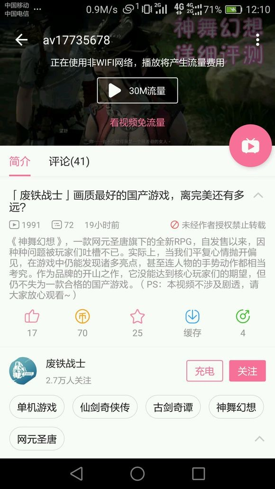
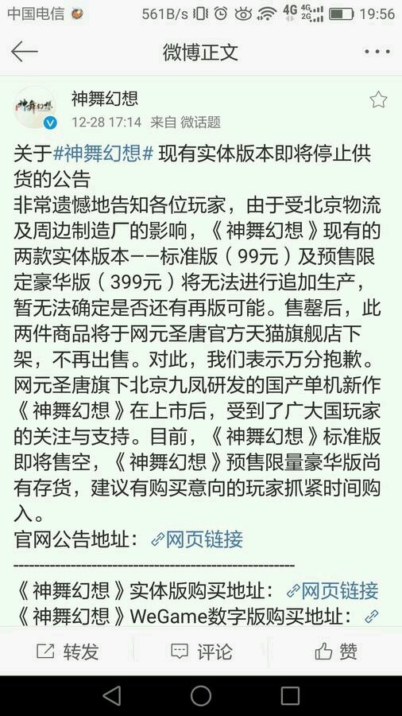
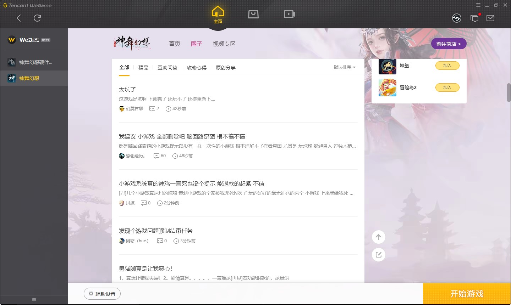

> 轻歌咏梦，从心感动。——《神舞幻想》

**Warning** 此篇吐槽充满了对神舞以及其制作公司的恶意，包含大量未经证实的脑补，请认为神舞做得不错甚至是是国产单机新希望的玩家尽快退散，以免影响您的心情。

---------

其实今年下半年某天神舞开始正式宣传的时候我就打算买预售了，不过当时考虑到手头只有 Mac 和 Surface，没有机器打游戏，就暂时没急着买。后面也没太关注宣传，基本上都是偶尔刷微博的时候看到，比如说宣传女一望舒的时候，我的微博首页基本上全是在骂九凤的，所以我才能恰好看到。 _问我有没有骂？这特么不是废话嘛。后面会仔细说明的。_ 

回学校半个多月之后买了骷髅峡谷，之后刷微博的时候突然看到开启预售，于是直接下单标准版。看到商品介绍里面 6 张光盘，当时我担心的主要还是骷髅峡谷的 Iris Pro 580 带不动。19 号付款，21 号就寄了过来。

拆包看见包装盒的设计我还觉得挺用心的，不过里面送的六张线稿我看了半天，也分不清两个女主角的脸有什么区别，简直就是同一个人换了身衣服。6 张光盘整整装了一下午，然后登录 WeGame 再例行更新一波之后激活，过程还是挺顺利的。顺便发现有硬件检测工具的 Banner，点进去发现还要重新下载 3GB 的东西，也不知道为什么不能和游戏本体做在一起。打开跑了下，卡顿并不意外，贴图糊成一片就让我很意外了，不过当时也没多想，以为是测试工具自动锁定了低画质的纹理，等游戏正式发售应该可以再进行调整。测试过程中女一的配音倒是让我各种出戏，本来奇肱飞车在天上炸应该赶快跑，女主配音却完全感觉不到紧张。 _当然这八成是剧情的锅，后面会仔细说。_

12.22 早上八点五十就可以进入游戏了。然而天贼冷，我十点半才下床。

正式进入游戏的时候发现贴图还是特别糊而且调整不过来，我以为是游戏检测显存大小的时候直接读了 Minimum (64MB)，重启改了 IGD 到 512MB 并没有什么用，于是也就懒得管了。 _这个问题后来看圈子有很多很多人都遇到了，官方 12.25 发的补丁声称修复了这一问题，然而在我的环境中并没有任何修复。正常游戏过程中看显存占用基本都在 1GB 左右，跟我 IGD 上限的 8GB 相去甚远。_

然后就是断断续续的持续约一个星期的游戏过程。期间各种被剧情恶心，各种被小游戏劝退，各种 Bug 报错退出，各种卡顿各种贴图模糊，所有的问题我都咬牙忍下来了。终于熬到了通关，WeGame 显示的游戏时间是 41 个小时。然后我长出了一口气，直接连游戏带 WeGame 卸载。后面再出什么 DLC 我都不想管了，爱咋搞咋搞吧，反正实体版都生产不出来了，看你几时完。

下面开始，一点一点来，慢慢撕。

# Plot

其实在我们的回忆中，国产单机 RPG 或仙或侠，口碑出众者往往以剧情见长，然而这次神舞的剧情水平简直烂到让我意外。

## MainLine

神舞的主线剧情，比较简单的总结起来可以说成这样：

```
一个叫大羿的（大概就是羿吧）神因为帮人界屁民收拾烂摊子搞的自己神力消散了，然后有的屁民就暗地里嘲讽他，他很不爽就想把所有人都搞死，然后设计了一个东西叫净灾，指哪打哪打得人界再也不相信神会庇佑他们了。主角挨了一次净灾之后带上了光环，通过一系列操作搞清楚了谁在搞事情然后打死了搞事情的人。
```

非常简单粗暴的设计。在这个框架下进行扩展：

* 剧情需要有反转，反转看起来会比较带感，那应该先把大 Boss 设计成跟正面人物有一定联系的人物，那还需要有一个足够证明这一点的角色。于是又拉来了一个皇帝，然后再把主角设定成对皇帝忠心耿耿。嗯，关系就稳了。
* 既然是跟正面人物有联系，全程大黑脸肯定不行，而且三部曲呢，后面肯定要留空间洗白。这好办，引入第三方力量源，然后把这个力量源跟黑暗绑定起来，后面就可以说当时被黑暗力量侵蚀了理智之类的。于是又顺便加上了混沌。
* 神舞神舞，神光一个肯定不够，那还得多加几个。男主为什么能成为男主？肯定有光环。光环怎么体现？要跟一个神打，自己肯定要有神力，不然显得这个神就不像神，那就太蠢了。但是直接把男主都设定为神，玩家估计又没什么代入感。这样吧，套个降临派的设定，就说被南斗和北斗钦定了。 _绝对是用烂了的套路，无力吐槽了。_ 
* 这样有了三个神，感觉还是太少，那就随便再加几个，送送人头或者拿来煽煽情都行，灵活发挥。人界莫名其妙来这么多神怎么解释？随便编个理由说回不去了，编成啥样之后再说。

逐一来说。

### 风鸣军与伊祁帝

风鸣村在整个故事里面的作用，基本上可以说也就比炮灰稍微强那么一点儿。一开始看这种设定就感觉跟古剑一有几分相似，世世代代为了某一个目的（守护焚寂 / 除掉傲狠），又有类似的统一信仰。至于男主不被待见我就不知道是为什么了。当然古一里面被屠村还真让人感觉挺意外的，可是这里基本上给人感觉就是全程在各种立 flag。后面果然天降流星，成功实现屠村。屠完村子之后男主出村，然后这些人就彻底消失了，傲狠也不打了，什么风鸣军也不管了。除了知道两个更心灰意冷的去了泣血，剩下的人根本就不知道他们去哪儿了。 _而且直到男主出村，也没人知道为什么男主一出现村子里面的什么水缸之类的就全都碎了，鸡也不下蛋了，什么架子也莫名其妙的全都塌了。_ 傲狠也挺奇怪的，无论出场和退场都不按套路来，而且还一口吐掉了便当……虽然吐不吐其实也没区别，因为后面就只剩下一句台词“天道无常，我行我道”了。

其实前面的部分感觉还算说得过去，虽然说大多数设定都是用烂了的，不过这不是什么大问题，能把事情说明白就行吧。但是到后面，我开始觉得这个编剧的水平脱离预期了……

### 幕后黑手大羿

剧情出现转折的原因也真的是非常奇怪，看对话似乎是因为昙静查到了大羿是幕后主使，然后后面就在想方设法把他转型成反面人物。虽然后面给剧情打的 patch 差不多能让整个故事逻辑上走得通，然而：

* 首先，这个剧情本身就是一条线，可以说非常简单，以至于完全是编剧想怎么发展就怎么发展。然而很可惜，编剧搞的太差劲，剧情发展几乎看不到一点前后关联的影子。
* 其次，这个转折点的设定真的只能给人一种，剧情做到一半没钱做了赶紧想个办法收尾的感觉。 _关于这个，后面也会提到。_ 不得不让人又想，连仙四没钱这种还不知道有没有被验证的传言都要想办法蹭一把？ 

### 非常非常恶心的强行喂屎结局

结局强行 ntr，用不着我说了，吐槽的人太多了，圈子里面全都是在骂结局的，甚至听说有主播看了结局之后直播卸载游戏。

我真的只能说这个结局太招黑了……可以非常负责任的说，就光是这一个喂屎结局，就能让神舞的同人热度会下降 90%。

_嗯，今天是一月十一日。事实是，贴吧和圈子里面全是骂的吐槽的洗地的，就是真的看不到同人作品啊……就算做个斑斓斑叶跳舞的 MMD 也行啊……神舞这口碑真的可以说可见一斑了……_

## Addition

到现在主线差不多编完了，但是感觉太短，那还需要加一些东西进去丰富一下。但是只能说后面加进去的戏份，安排的都非常莫名奇妙，除了让主角受点儿苦，最后能争取到大合唱的一个位子之外，可以说对主线剧情的补充几乎没有任何意义，直接当成是不能跳过的支线任务我看毫无问题。

### 泣血、悲离夫人

泣血这个势力，其实整体的存在感还是蛮高的，尤其是前期编剧花了很多时间在泣血上。问题在于，前面好不容易制造出来的尖锐矛盾，到了后期幕后黑手（实在不想打大羿两个字了，贼难打）撕破脸之后，泣血一秒跳反，这种随便切换势力的做法严重降低了泣血的存在感；而且关于泣血的来头还有结局几乎是一两句话就交代掉了，而且交代的东西都只是为了填坑而填坑。随随便便两句话，解释了一下悲离夫人的遭遇 + 大羿的暗中操作，就把泣血的背景交代完了，这使得整个泣血的设定其实是非常空洞的。

按剧情现在的这种“哪里需要就去哪里，缺什么设定到时候再补上”的表现，几乎可以说把泣血整个拎出去不会太影响整个故事的发展（把所有跟泣血相关的东西删掉就行，除了文本量可能不算小之外问题并不大，而且几乎不用补充什么）。

其实中期两位加入泣血的风鸣村村民（都叫啥来着。。。）后面出场的时候那一段剧情还说得过去，嗯，直到他们突然要以自己的鲜血起誓的时候 :) 起誓起的太早了，只能给人一种酱油的感觉，达不到直击心灵的效果。包括最后跟悲离夫人决战也是一样，这种戏码想效果好的话，需要在之前把存在感刷的足一些，而不是刚出现还没多久就不顾一切的吞下自己的便当。

看看人家五前怎么刻画净天教的。可长点儿心吧。

### 重华、丹朱、霖荷

设定这个丹朱，除了送了他一个霖荷，让他有个提升泣血存在感的作用之外，我也没看出来什么。而且要不是最后霖荷真的莫名其妙在东海什么地方诈尸，霖荷是不是奸细怕是谁也不知道。

重华倒是一看就是做大事的人，而且结局还顺便挖了个大坑，估计下次会有他的戏份。

啊，顺便，斑斓斑叶还是很萌的。期待青丘国大型 DLC。

### 寒荒国、鹊春、鹊鬼、男二的皇子设定 

皇子这种东西，古剑二里面的夏夷则就已经很崩了，这位哥的身份可以说除了一个 DLC 之外基本上没啥用。神舞里面云倾的霁雪皇子身份，感觉就是编剧用来给他一个合理的跟主角拼命的理由，除此之外感觉也没再有什么用处，硬要说有的话，把寒荒国支撑起来，可能对世界观的补足有一些用处吧。

然后说鹊鬼和鹊春。本来以为鹊鬼会是又一股强大的黑暗势力的节奏，结果又是后面一两句话就交代了。这句话还是鹊春说的，大致意思是他和他哥哥还是图样图森破之类的……我当时真的是看的心里憋屈的不行不行的……编剧整这一大圈到底图啥啊？编剧有相当多的东西都没有说清楚。鹊春当上寒荒国的什么祭司之类的，到底是为了干啥？鹊鬼小时候逮走云倾跟鹊春去寒荒当祭司，两件事情到底有什么联系？这些事情都还是大坑，甚至连一两句话交代都没交代，纯粹就是挖开没填，就算以后打算出 DLC 也不能这么挖坑啊。

抛开这些完全没说清楚的设定，不管了……从已知条件入手。皇子小时候突然发病搞死了自己亲妈亲爸还封印了自己记忆，结果鹊春突然要借助这个条件让他去刚伊祁帝，恕我愚钝，我还是看不懂鹊春到底想干啥……至于鹊鬼，也就背景说了一下他把皇子还有岚湘的哥哥还是弟弟一起抓去了然后拿人练蛊，除此之外也没说别的，全程就是在嘿嘿嘿哈哈哈的奸笑，谁特么知道你在笑毛啊？？？这货给我的感觉就是一个纯粹来搞事的煞笔反派，以搞出事情来为乐那种……

这些设定真的是想不出出发点是什么，表现的也很不理想，草民觉得可以说是相当失败的设定了。

 _还有一个大坑不得不说。霖荷这个药她怎么跟鹊春要来的，就随便去要就要到了？？？女二到底是怎么活过来的？？？真是无限十连抽还是霖荷的假死药设定？？？我是不是少看了什么？？？_

### 其他几个国家莫名其妙来撕逼

这个真的只是为了引入一些矛盾或者是为了让这个世界的世界观稍微丰富一点来的吧……

尤其是厌火国的猩猩，感觉就完全是为了搞事而搞事……

### 黑市、鹰礼、倏忽国

倏忽已经~~彻底~~凉了，不算在上面参与撕逼的国家里面。当然这不是重点。

我对鹰礼的设定的理解基本上也就是用于：煽情，强行煽情，把望舒跟黑市串起来免得黑市太没存在感。

鹰礼这个人给我的感觉是，基本上始终智商不在线，瞎几把搞事。而且只要跟他相关的剧情里面，望舒基本上也都表现为智商不在线。

先说望舒。首先，鹰礼当了个什么大官，大官怎么看可都不像是需要跟黑市做肮脏交易才能找到的人。不知道黑市是怎么想的，更不知道望舒是怎么想的……其次，幕后黑手露面阊阖宫那会儿，昙静莫名其妙跟女主来了一波真情告白。然而在此之前，他们两个好像完全就没什么接触吧……还有大羿你是怎么看出来的，在我的印象里面这俩人总共对话恐怕还没有十句吧……昙静真情告白并且便当之后望舒说的那些话听的我真是醉了，简直了好吗你们才认识几天啊……大姐你几天前才跟飞星跳完舞啊……最后鹰礼又冲上来送死，说什么要复国什么的，还说不管望舒嫁不嫁得出去都要照顾她一辈子。我只能说我好像闻到了德国骨科的味道……女主这段哭的那么拼命，我在一旁冷漠脸，甚至替 CV 小姐姐感觉尴尬。 _另外，男主走迷宫走的身体越来越重，恐怕不是因为什么混沌之气，而是因为头上帽子越摞越高吧。_

吐槽鹰礼还得跟她亲姐姐结合起来。回到之前的某个时间，滨洛刚醒过来这帮人泡完温泉闹腾，祸天闲得无聊互换男女主身体……本来觉得是小事，结果编剧突然开始挖大坑，鹰礼上来就是两刀扎在了看起来像是男主的女主身上。然后女主觉得，哎呀这可是亲弟弟啊，哎呀不能让他被发现啊，哎呀得拖点时间让他跑啊，哎呀这点小伤大概没啥事吧，然后就去找男主跳舞了🙄舞确实跳的不错，然后突然一口便当🙄要不是我看了结局我特么信了你的邪🙄然后不到一分钟就活蹦乱跳了，然后随便解释，有神医啊，有超级无敌温泉水保护心脉什么的。

这一段槽点实在是太多了。

望舒这个便当真的是便当，饿了吃，吃多了吐，毫无问题。挨了一刀没关系，先去跳个舞表个白，结果最后突然发现玩脱了，那再把亲弟弟供出来吧，你特么反正最后要供出来那你撑这一阵子干啥？？？

再说鹰礼这个智商我是真的不懂，你老姐看上男主了是个人都看得出来（除了我，虽然设定肯定是勾搭上了，但是身处局外毫无代入感的我真的不懂为什么他们俩就勾搭上了），你还处心积虑的要干掉男主。

你是以为你姐看不出来？？？ _还好编剧让望舒看出来了。感谢上帝。_

真不怕你姐彻底翻脸然后跟你拼命？？？ _可惜……然后就开始狗血了。_

你还怎么照顾你姐，还要照顾一辈子？？？ _彻底崩坏。_

杀男主的原因我也不太懂，我本以为这样做是因为鹰礼被威胁说不干掉飞星的话望舒会有麻烦之类（算是常见设定），这样起码还能从骨科角度多下一点力气。主角团跟鹰礼撕逼的时候我开始觉得不对了，什么叫“那人说干掉你们他就不动望舒”……这智商怎么当上大官的？学学人家越今朝在芒宛寨是怎么做的好吗？

还有后面解释原因的时候居然全都在扯攒了多少钱为复国大业做出了哪些贡献？？？编剧到底想说明什么，倏忽族人热爱自己的民族甚至可以为之付出生命，也包括无辜路人或者说亲姐姐的男票的生命？？？

鹰礼这个人的槽点实在是太多太多太多了，吐不完。草民觉得他真的是从人设到剧情表现全面崩坏，堪称最让我心烦的角色，没有之一，反正他最后吞便当的时候我甚至感觉有些开心。

### 还有些可能比较散乱的或者想不起来的

为什么特意提这个？

神舞的剧情，前后衔接做的**非常、非常、非常**不好，以至于很多细节需要非常费力气从它前面的某个事件往后推，再从它之后的某个时间往前推，一点一点来才能回忆起来这一事件的具体细节。于是，很多小的事件就完全不会被注意到，但是似乎也并不会影响剧情。

其实通关之后整理整个剧情脉络我们会发现，整个故事实际上基本就只有两个阵营，分别是代表正义的主角团和代表邪恶的大羿与他的小伙伴们。大羿的小伙伴们基本上也就是花式骚扰一下主角团，他们内部并无起纷争的必要，如此也就很容易解释为什么初看起来所有的反派之间似乎都没什么联系，只是不停的在找主角的茬而已。说白了其实也就是炮灰，是大羿的炮灰，同时也是编剧用来强行煽情的炮灰。这样的剧情脉络真的只能说毁了一个本来尚可的剧情框架，结果是这个剧情真的可以说，全程充满了各种各样的或是非常平庸或是恶心至极的桥段，几乎找不到哪怕一点优秀值得夸赞的地方。

想来这个问题可能主要还是因为地域差异的问题吧。

> 这里必须提醒弯弯，现在大陆网民的舆论导向都是拒绝鸡汤，与敌人要以牙还牙以眼还眼，痛恨西方圣母的zzzq。

> 神舞的编剧以前是宇骏的御用编剧，幻三和绝代基本上都参与过
> 
> 看了履历感觉她应该参与编剧的国产游戏数量应该是最多的了，搞不好比毛兽都多，只能说以前的编剧写现在的故事不一定会与时俱进吧

（Source：[神舞幻想剧情感想：我总觉得是我看漏了什么](https://tieba.baidu.com/p/5493712765)）

剧情就差不多说这么多行了，下面来说说几个重要角色。

## Characters

神舞一共有五个主角。

_祸天怎么看都是个被莫名其妙强行拉进来凑数的。_

_当然这个队伍怎么建立起来的都很是个问题。_

### 飞星

飞星的设定真的是非常没看点，他在剧情中的所有存在感几乎都来自他手上这个戒指，而不是这个人本身。非常典型的三流网络小说的套路：基本上就是随便一个人只要有这个南斗星轮戒指就可以当主角，甚至可以猜测，当时要是大树或者陶石甚至是什么浣纱啊小璟之类的炮灰配角，恰好没事上山，恰好碰见夕羽，夕羽那天又恰好捡了个戒指的话，我觉得这个剧情后面的发展说不定也没什么区别，无非是改一下，女一浣纱，村子里遭了净灾心灰意冷想去帝都，在箴石小镇碰见了男一羲和，然后剧情继续……

真的只能说想不明白这个首饰盒为什么设定成这个样子。我们来猜一猜企划的想法：

1. 设计一个正面人物，需要有善良的性格。
2. 善良的性格如何获得？顺应环境的话没有张力，应该设计成跟环境因素相反，这样还能顺便给男主贴上性格坚毅之类的标签。这样环境因素就有了，要惨，周围的人应该普遍对他态度不友善，由反差的前提可得男主应该有一颗包容一切的~~圣母~~心。
3. 至于其他的性格特点，既然是个没出过村的人，设计成比较呆萌的大概比较合理，看以前很多 RPG 也都是这样的设定模式。 _于是，这个男主就这样越来越脸谱化了。_
4. 既然是主角那就一定需要有光环。先送他个南斗星轮把他设计成天选之子。 _很快发现不够用了，煽情把自己都给煽凉了的话怎么复活？_ 再加一个，元神为女娲补天那会儿烧的火的余烬化成，这样光环应该足够亮了。

飞星应该算是所有人物设定的基础，其他主角的很多设定都是从他的设定出发来进行的，至于他自己实在是真的没什么可以说的，还是得结合其他的角色一起考虑。

顺便，这个名字也不知道有什么来头。大概就是没什么来头，随便起的一个吧。

### 望舒

先说一点不惮用最坏的恶意猜测彩虹光盘的想法：望舒这个名字，实在是一言难尽。

仙四起码望舒还是有意义的，因为确实有两把剑一阴一阳，分别以月亮神和太阳神命名并无不妥。神舞女一起这个名字意义何在？这货跟月亮有半毛钱关系？还是说只是觉得好听？而且不得不说，玩过游戏之后很容易发现望舒这个角色设计上有相当多地方跟菱纱也是撞设定的，比如综合性格设定，对男主的称呼，甚至说战斗系统中数值上的设定都明显看得出“借鉴”，这个擦边球打的真的是毫无节操。

以下是捧一踩一时间：洛昭言原定的名字是洛闻人，就是怕跟闻人羽撞名字所以官方特地重新定了名字避嫌。贵九凤倒好，想尽办法来倒贴，也不知道一个仙四你们从 2010 年古一就开始贴，一直贴到现在到底是为了啥。

如果上面倒贴的假设成立，这个妹子的设定应该是：

1. 活泼少女，要给人很灵动的那种感觉。
2. 要经常闯荡江湖，很有江湖资历。
3. 要惨，家破人亡那种惨。为什么这么惨，啊，这个再考虑考虑，反正也不是很重要，什么时候需要煽情再随便编一个。
4. 要贪财。至于为什么贪财可以再考虑考虑，仙四的设定不是太好直接拿来用。这样，跟 2 结合一下，把倏忽国直接灭了吧，应该够惨了。贪财的理由就是想凑钱买个小岛复国。

当然这么猜是出于极大的恶意，如果我们不考虑对某一个作品的倒贴的话：

1. 既然设定有两个妹子，性格肯定最好有一定差异。
2. 男主的设定是个啥都不知道的圣母，凑 CP 的话按照以前的套路最好有反差萌，同样也可以考虑借鉴一下之前很多成功的 RPG 作品。
3. 在这种 RPG 游戏的背景下，对于一个这样的性格的妹子一般会设定成：要么就经常闯荡江湖，要么就老是呆在家里一直特别想去闯荡江湖。考虑反差萌这一前提，那么应该设定成有一定的江湖资历。
4. 闯荡江湖的话最好设定个原因或者说是目的，一方面补全人物背景，另一方面也可以借此设计如何跟男一顺理成章的凑 CP 出来。 这里不仔细考虑设定的话还是很难找出一个说得通的理由的。 _当然最后用了上面倒贴中猜测的设定_

倒贴与不倒贴的设定并不冲突，完全可以综合起来用，当然实际上综合起来的话也就是我们在神舞里面看到的望舒了。

人设定好了要跟男主顺理成章的凑成 CP 的话还需要有能一起出去闯荡江湖的理由。可是，恕我记性太差，神舞里面怎么设定的我费了好大力气才想起来，但是想起来之后发现还是看不懂。 _不仅男一女一如此，男二女二同样如此，甚至祸天和夕羽小妹妹好像关系都莫名其妙，这个后面再谈。_

想不起来，看不懂设定的原因能是什么？当然是存在感太低了。不知道为什么跟男主莫名其妙组上了队，在剧情中的其他部分也几乎没什么存在的作用。硬说有一点作用的话，除了某些时候可以拿来强行煽情，或者可以让别人被拿来强行煽情之外，大概也只剩下一个，为了把黑市作为一个矛盾势力拉进来，增加一下主角团被拉进战斗界面的频率。至于剧情主线，她自己，还有小弟鹰礼，几乎可以说扯不上任何关系。 _这一家人内部的关系倒是乱的可以……_

就算倒贴，也还是倒贴不到点子上呢。看看人家古一怎么设计紫胤真人的。脸不要就不要吧，起码把东西做好啊。

当然其实如果不考虑倒贴的话，前期望舒的表现还是挺不错的，加上 CV 不错的表现，其实算是很难得的初期印象尚可的女主了，对我来说初期印象这么好的大概只有瑕一个了。 _当然中期过后瑕绝对完爆望舒，这么说只是因为初期看不出来而已……_

### 云倾

_男二又是一个冰块脸，女二又是个大家闺秀。这个主角群的设定啊，要么编剧是成心的一定要倒贴一把，要么就是真的屁都不懂只会套设定。非蠢即坏。_

霁雪皇子同样是拥有北斗星轮戒指这一超高级 VIP 礼包的仅有的两个用户之一。想来设定成神医，大概可能跟紫英一样，需要有一个足够牛逼的头衔；性格也颇有冰块脸的感觉。说白了还是老套路。

这位老哥其实应该说是槽点比较少的一位了。当然主要是因为，这位老哥身上绑的故事好像都只是为了最后跟伊祁帝或者说跟主角打起来……而且大多数都跟主线没什么关系，主要都是寒荒那边的，因而槽点主要集中在寒荒那边的人身上了……前面跟寒荒还有鹊春他们一起扯的时候说的差不多了，这里不再重复。

关于这位皇子的另一个大坑是，草民想不到他是怎么莫名其妙的跟岚湘搞在一起的。可以说是非常莫名其妙的就弄在一起了……

### 岚湘

首先夸一句，女二的舞跳的真的不错。CG 动作可以说非常美了，战斗中施法还有胜利的动作也很不错，一面小鼓玩的贼好看，可以说是很用心了。特别喜欢那个把鼓放在头顶然后双手一拍的动作，回头找机会录个 GIF。

岚湘的设定其实应该是最对草民胃口的，当然主要还是因为望舒到后期的槽点实在是太多，喜欢不起来……

女二在剧情中的存在感其实跟男二一样都不是很高，而且其中不少事件，比如她的哥哥还是弟弟之类的，都跟男二绑的死死的，感觉就好像是为了让寒荒国那一条线不至于跟主线脱离过远。其实本来应该是需要用来扣题的，神舞神舞嘛，神确实塞了很多足够了，结果舞跳的挺好看就是好像除了某一两个之外，跟主线大都没什么关系……

关于女二的人设之类的感觉也没太大必要分析了，毕竟挺典型的套设定纸片人，存在感也实在不高。就吐一个槽，到底怎么莫名其妙诈尸起来的，是十连抽还是假死药 :) 就这样。

### 夕羽

讲真我也不怎么想的出来她是来干啥的……大概只是卖卖萌吧。至于在剧情里面有什么作用？完全不觉得有什么作用……最后接替她哥哥当了太阳神我也不知道有啥意义，除了把我最终战用得上的灵魄和饰品之类的都拿走了，让我郁闷了四五分钟之外……

这个吉祥物一样的设定，恕我能力有限，我实在是想不出来是干啥的，感觉一开始带主角熟悉世界观之类的还是存在感挺强的，到后面基本上就除了偶尔象征性的跟其他人互动一下之外，也就是用来跟祸天互动，让队伍形成非常规整的三对 CP 的形态了。

其实我觉得她完全可以全程保持一个鸟的形态，只有进入战斗的时候显一下形参加一下战斗，甚至就像百里少侠的肥鸟阿翔一样我觉得问题都不大。

### 祸天

这位姐控老哥，哎……被强行改变性格的滋味不好受，草民懂的……

我要是个神的话，估计能回天上早就回了，实在是懒得跟这帮莫名其妙的人混在一起。

估计这位老哥在被另外几个主角直接怀抱杀的时候，内心也在用各种语言问候编剧的亲属吧……

---------

可算撕完了剧情，累死了。

# Battle

战斗系统其实我还是挺喜欢的。比起仙五 / 五前有更高的策略性，比仙六更像半即时制，比起古一那个节奏超慢毫无看点的战斗系统更是好的太多了。至于古二，不是同一类就不比较了。

## Timing Matters

这个战斗系统最大的亮点，我个人觉得是，“时间”在整个战斗的过程中确确实实的是一个需要仔细考虑的因素。仙三那种战斗系统，虽说是半即时，但其实真正需要考虑的是“速度”这一个数值，而这个数值实际上只是判定行动顺序时”路程 / 速度“这一公式中的除数而已，也就是说跑完一段路就可以开始行动了。这样的模型在游戏过程中体现为速度值与先手后手和行动频率相关，而不是某一个与墙钟时间相关的因素。即使考虑熟练度不到四级的法术的吟唱时间，实际体现也更适合用”路程 / 速度“这种方式来描述。

神舞的战斗系统在这里引入的设定有些类似于格斗游戏中的连击这一设定。每一次攻击除了造成伤害之外还会引发持续一段时间的【弱点状态】。在这个状态下攻击可以获得一定加成；多段攻击可以增加弱点加成的百分比，也有可能增加弱点状态的持续时间。

假设 A、B 两人打一个 Boss。用户让 B 先行动，打出一个 200% 攻击加成的弱点状态，等待一会儿之后让 A 行动进行实际输出，就可以在弱点状态下打出较高的伤害。简单画一个图：

```

|<A Dequeue><A Wait ......... User Input><A ... Prepare><A Act 1><A Act 2><A Act 3><A Act 4><A Act 5><A Enqueue>|
|<B Dequeue><B Wait ... User Input><B . Prepare><B Act 1><B Enqueue>                                            |
|[200% Atk+]                                    <Weak ... Time>                                                 |
|[210% Atk+]                                            <Weak ... Time>                                         |
|[220% Atk+]                                                     <Weak .. Time>                                 |
|[230% Atk+]                                                              <Weak . Time>                         |
|[240% Atk+]                                                                       <Weak  Time>                 |
|[250% Atk+]                                                                                <Weak Time>         |
|                                               <Total Weak ......................................Time>         | 

```

所有在 Weak Time 时候的攻击都可以享受到一定的加成。需要注意 User Input 的时间长短完全由用户实际操作决定，并且以墙钟时间为准；Prepare、Act 以及每一段 Weak 的时间、攻击加成的值是预先设定好的。

这个设定的亮点在于，用户通过仔细考虑行动顺序以及每一个技能的吟唱时间，可以在输出之前先准备好足够高的弱点伤害加成，打出更高的伤害。比起之前的半即时，这样的设计跟即时战斗明显更接近一些，实际的游玩体验也会更有类似于即时制的紧张刺激的感觉，当然神舞这块儿做的还是不行，太拖沓……

非常可惜得失，这些至关重要的的数据，神舞并没有披露出来。望舒和夕羽开一个能打出弱点状态的技能，需要的吟唱时间一般比较短，而岚湘则会需要比较长的时间；输出时吟唱时间的计算更加重要，但是玩家完全看不到某一个技能需要吟唱多久，每一段攻击的间隔时间是多少，这样导致很多时候都不能仔细考虑弱点时间，无法实现伤害最大化。不知道后面会不会把这些东西标记出来……

## BattleField


---------

# Finally.A

不知道从什么时候开始，国内游戏玩家的口味我再也看不懂了。



当年的仙一，凄美的故事打动了所有人，灵月之争甚至能延续到今天；今天的神舞，剧情简直恶心到无以复加，其他游戏系统即使没有大踏步地后退也完全看不到任何一丁点进步的影子，却只因为用了免费的虚幻四引擎画出了个在这个年代勉强合格的画面，就获得了这样的评价。所以这就是现在的游戏玩家的要求吗？虚幻引擎，听起来多么高大上，即使金玉其外败絮其中也没有关系，玩家根本不关心金玉里面有什么东西，只要看着好看，甚至说只要用一下动作捕捉，把手势摆到位，就可以算是合格，甚至就会有人鼓吹神舞就是标杆就是国产游戏的希望。

联系到其他的一些游戏作品。现在的玩家都喜欢多人模式，与人斗其乐无穷，单机有什么意思。节奏要快，能一刀 99 级最好了，或者做成短的时间片形式，一局十五到二十分钟，什么时候都可以玩。一定要做好内购系统，卖皮肤，开箱子，出新的角色和装备，随便放个什么限定 SSR 出来，马上就有大把大把死宅成千上万的往里面充钱。还有余钱的话，把画面做的像样一点，这样塞钱给所谓专业人士让他们打高分的时候也不至于那么容易被玩家看穿。至于单机剧情？不重要，没人看，做起来成本又高，随便做做吧，砍掉也可以，反正根本没有人关心。

联系到更广泛的娱乐圈现状。拍一部电影或者是电视剧，剧本不重要，台词不重要，其他的什么都不重要，只要请来那些形象气质佳自带粉丝群体的小鲜肉，在镜头前面随便摆两个姿势展示一下他们俊美的脸庞。动作是否到位，表情是否生动，这些都无所谓，反正有各种替身有配音演员有后期制作。片子剪出来之后，再请公关公司采取手段在各种社交与媒体平台上运作一番，等到电影电视剧上映，照样坐拥过亿票房，收视率三个百分点。至于剧情？不重要，没人看，随便怎么样都行，能凑齐足够多的镜头展示小鲜肉们的盛世美颜就行了，或者买个版权再吸一波原作粉，赚的更多。

我曾经以为国产单机市场已经凉的差不多了，还能坚持支持的玩家大多是对这种畸形的娱乐产业不太感兴趣。神舞出来之后我才意识到，孟爸爸不愧是彩虹光盘出身，再加上做过两代古剑，这个圈子里面的浑水，他已经摸的透透的了。

# Finally.B

写完上面那些非常怨念的东西之后，偶然看了一下微博，只见神舞官方发了这么条东西。



感觉还是有点惊讶的，因为看网元圣唐在天猫的网店，神舞的实体版加起来卖了可能仅有九千套左右。有消息声称实体版与 WeGame 的比例约为一比五至一比六，那么总销量可能仅有五万左右。如果现在就停止销售实体版，即使考虑到 WeGame 如此卖力的推广，实际最终销量恐怕也很难超过十万。

其实冷静下来之后仔细想想，上面那些写的确实还是太过怨念了。虽然确实有收了钱的媒体，有水军，甚至有某些真正的玩家会站在各种不同的立场给神舞打一个还不错的评价，不过看圈子里面基本上还是充满了各种抱怨。



就算孟爸爸带节奏水平一流，也架不住大批量的玩家用脚投票，销量如此就是最好的证明。

看神舞贴吧的时候也顺便去逛了逛好久没去的闲情吧（好久不去只是因为百度贴吧恶心而已……），有一篇分析个人觉得很不错：[【浅谈】关于造成神舞幻想销量的因素](https://tieba.baidu.com/p/5495993952)

很多人的观点都跟我上面提到的相一致。单机剧情成本高导致大多数公司做不起 / 不想做，玩家口味普遍偏向快餐化导致对剧情类游戏热情降低，导致单机游戏在厂商和玩家两方都不受待见。这两条不仅仅适用于中国市场，全球都如此，当然国内的情况更是非常非常的典型。

还是以仙六为例。北软可以说非常用心的做了几乎完美的单机剧情，以至于大部分资金可能都花在了这上面，其他方面表现就受到了很大的影响，甚至不得不在游戏还未打磨完成时发售（因为钱花光了）；玩家的快餐化口味遇上仙六这样典型的慢热型剧情，可能很多人根本没有耐心看完初期跟启魂圣宗撕逼的部分，就已经完全失去耐心弃坑，以至于后面高潮迭起的剧情根本没有机会被他们看到。两种原因综合，再加上致仙剑六等人恶意抹黑这样的非常规因素，导致仙六口碑爆冷。

这次神舞个人感觉其实像上面说的这样的问题仍然存在，并且十分严重。虽然孟彩虹在这方面经验确实比较丰富，因此选择了看似高大上实则并不花钱的虚幻四并且把它作为宣传中的一个重大卖点。确实这样做也获得了一定程度的成功，但是仍然无法脱离整个大环境低迷导致的负面影响，因此整个游戏的品质也无法保证。

# Finally.Finally

若有缘了五年的古剑三，看起来终于要开始宣传了呢。


不过再怎么说，工爸爸还是走了，去做九霄奔云传了。

古三出来的时候会不会又有“九霄才是真古剑”的说法呢？孟丽丽重金捧出来的神舞，又将何去何从？

不如静观其变吧。
