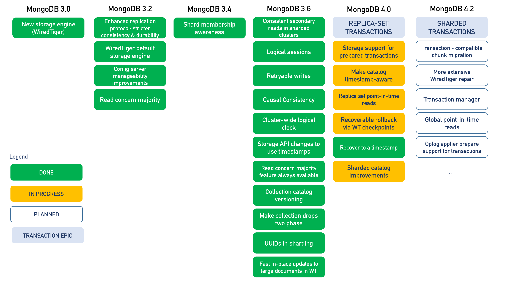

大概算是个大新闻：MongoDB 即将在 4.0 版本引入单个 Replica Set 上的 Transaction 支持，在 MongoDB 4.2 上引入支持 Sharding 的 Transaction 支持。为了达到这个目的，MongoDB 已经经过了三年多的持续开发。



这里选择下面的一些特性，介绍一下 MongoDB 为了实现 Transaction 进行的工作：

* Logical Sessions
* WiredTiger Timestamps
* Retryable writes
* Safe Secondary Reads
* Cluster-wide Logical Time
* Local Snapshot Reads

# Logical Sessions

Logical Sessions 是 MongoDB 3.6 引入的一项新特性，通过引入 Logical Sessions，MongoDB 管理自身的能力得到了极大的增强。

## Logical Session ID

Logical Session ID（LSID）用于标记系统中的各类资源和操作等。

* **id**: GUID，通过一些算法保证在分布式系统内的唯一性。
* **uid**: 用户名的 SHA-256 Digest，用于区分不同的 Client。

这些 ID 类似于 ObjectID，均在客户端直接生成，不需要与任何 mongod / mongos 请求获得。

## Use Case 1：Easy Administration

```

      +------+  +------+  +------+
      | App1 |  | App2 |  | App3 |
      +------+  +------+  +------+
        ||         ||         ||
  +--------+   +--------+   +--------+
  | mongos |   | mongos |   | mongos | 
  +--------+   +--------+   +--------+
             X            X
     +------------+  +------------+
     |   shard1   |  |   shard2   |
     | +--------+ |  | +--------+ |
     | | sec-md | |  | | sec-md | |  sec-md: Secondary mongod Instance
     | +--------+ |  | +--------+ | 
     | +--------+ |  | +--------+ |
     | | pri-md | |  | | sec-md | |  primary-md: Primary mongod Instance
     | +--------+ |  | +--------+ |
     | +--------+ |  | +--------+ |
     | | sec-md | |  | | pri-md | |
     | +--------+ |  | +--------+ |
     +------------+  +------------+
```

类似于很多常见数据库，MongoDB 支持主从复制和分片。每一个 Replica Set 有一个 Primary 和几个 Secondary 节点，在集群启动时通过选举选出一个 Primary 节点。当遇到节点崩溃或者网络错误时，节点的身份可以随情况改变。分片通过 mongos 完成，App 向 mongos 发送请求，mongos 进行路由并找到对应的 Shards，在对应的 Shards 上完成操作。每次请求数据并不一定会都在同一个 shard 上，mongos 会自动完成处理。

对于任何一个请求，都需要涉及到下面两种概念：

1. Operations（Op-s），管理命令或者 IO 操作；
2. Cursors，实际执行命令并返回数据。

在 MongoDB 3.4 中，当进行了错误的操作（如 collection.find 使用的字段没有索引导致 mongos 去所有的 shard 上面进行全 collection 的扫描）时，用户能做的事情十分有限，只能通过设定的 Timeout 去终止他们。尤其当 mongos 恰好在此时崩溃 / 断开网络连接了，而下面的 shards 中执行操作的 Cursors 就会彻底脱离控制，用户不仅拿不到查询的数据，也无法停止查询。

而在 MongoDB 3.6 中，所有的 op 和 cursor 都会有自己的 Logical Session ID。用户可以从任意一个 mongos / mongod 的 session table 中查看所有正在进行 / 某一用户正在进行的操作，同样也可以在任意一个 mongos 或者 mongod 上通过 kill sessions 命令终止他们。mongos 会向所有的 mongod 发送同样的 kill 命令要求它们终止对应的操作。

通过引入 Logical Session，所有的操作都将可以被中断，而不再像在 MongoDB 3.4 中，只有管理员可以进行这样的操作了。

## Use Case 2: Distributed Garbage Collection

```
                                    
+--------+        +-----------------+        +---------------------+
| Client | -----> | mongod / mongos | -----> | Sessions Collection |
+--------+  LSID  |  #              |  sync  +---------------------+
                  +--+--------------+ (5min interval)
                     |
                 Controller
```

对于一个长时间运行的 op 或者 cursor，我们希望可以自动完成对他们的清理。

之前我们只能指定 Timeout，而现在对于 Client 的每一个请求（op）都会有对应的 LSID，MongoDB 进程每 5 分钟会同步这些请求的 LSID 到一个全局的 Sessions Collection 中。

Session Collection 内 Document 的内容包括：

* **lsid**: Logical Session ID
* **lastUse**: Controller 报告的该 session 最后被使用的时间（并不一定真的是该 session 最后被使用的时间）

MongoDB 利用 Sessions Collection 追踪创建超过 30 分钟的操作并进行回收。另外，其他的 mongod / mongos 可以通过 Controller 来操作 Sessions Collections 内的的 session 以及对应的 ops / cursors。这样即使有一些长时间运行的 session 可能近段时间内在这一个 mongod / mongos 内没有操作，但是它们可能是在某一个跨 shard 的 Transaction 中，这样通过外部可以避免这些 op / cursor 被错误的回收。

举一个例子，Distributed Garbage Collection 对于 MongoDB 3.6 中引入的 Retryable Writes 十分重要。Retryable Write 让用户即使在网络故障时也可以确定写入是否完成，而实现 Retryable Write 需要所有写入操作涉及到的节点都维持一个状态，以便确定整个写入操作是否完成。利用 Logical Sessions 我们可以在操作完成后及时将这些状态回收。关于 Retryable Writes 的更详细内容我们后面会谈。

# WiredTiger Timestamps

WiredTiger 从 MongoDB 3.2 开始成为 MongoDB 的默认存储引擎，而 WiredTiger 是支持 Transaction 的。在 WiredTiger 中，Transaction 的实现主要依靠基于 Timestamp 的 MVCC。

## MongoDB OpLog 与 WiredTiger Journal

```
+-----+-----+-----+-----+
| ... | 100 | 101 | 102 |  MongoDB OpLog
+-----+-----+-----+-----+
         |        X     
+-----+-----+-----+-----+
| ... | 100 | 102 | 101 |  WiredTiger Journal
+-----+-----+-----+-----+
```

MongoDB 的 Replication 基于 OpLog，也就是将每一次操作记录下来并在 Secondary 上 Redo。由于采取了这种形式，OpLog 的顺序就十分重要。而由于并发的关系，存储引擎和 MongoDB 记录自己的 Journal 或者 OpLog 的顺序可能是不一样的（如图），这时在 Secondary 上进行的 Redo 就会出现问题。MongoDB 解决问题的方法是在底层增加了一个 Timestamp 且通过某种方式（Cluster-wide Logical Clock）保证 Timestamp 的准确性。

```
          +------+
          | root |
          +------+
         /        \
+-------+          +-------+
| kv kv |          | kv kv |
+-------+          +-------+
                        |
                        | update
                        |
               +-----+------+------+
       update  | txn | next | data | data: BSON of document or index updated
    structure  | ts  |      |      | ts: Timestamp
               +-----+------+------+
                        |
                        | update
                        |
               +-----+------+------+
       update  | txn | next | data | data: BSON of document or index updated
    structure  | ts  |      |      | ts: Timestamp
               +-----+------+------+
```

MongoDB 使用类似上面表示的树形结构来存储 Document 和 Index。当进行更新时 WiredTiger 创建一个 Update Structure 来标记具体更新的内容，其中包含一些与 Transaction 相关的信息，到下一个 update structure 的链接，以及具体更新的内容。进行读取操作的时候，WiredTiger 通过按顺序读取 update structures 来返回正确的结果。当然这是一个很简化的描述。

为了解决 OpLog / Journal 的顺序问题，WiredTiger 在 update structure 中增加了 Timestamp。这个 Timestamp 是由 MongoDB 提供给 WiredTiger 的。WiredTiger 将会按 Timestamp 记录的顺序处理 update structures，这样就能保证 WiredTiger 的 Journal 跟 MongoDB 的 OpLog 顺序一致。另外，WiredTiger 还可以读取截止到某一个 Timestamp 的数据（Recover to timestamp）。

## 处理 Replication 乱序的情况

在进行 Replication 的时候，OpLog 会被多个线程同时读取并 Redo 在 Secondary 上（因为只有一个的话太慢了，跟不上 Primary）。虽然每一个线程会主动选择关系比较紧密的一组 OpLog 进行操作以保证 Replication 按正确的顺序进行，但是不同线程进行 Redo 的时候同样可能出现 Redo 顺序混乱的问题。

```
+-----+-----+-----+-----+
| ... | 100 | 101 | 102 |  MongoDB OpLog Batches（Ordered）
+-----+-----+-----+-----+
         |     |     |
 threads |      \   / 
      to |       \ /
   apply |       / \
   oplog |      /   \
         |     |     |
+-----+-----+-----+-----+
| ... | 100 | 102 | 101 |  Data applied to Secondary
+-----+-----+-----+-----+
```

MongoDB 同样利用 Timestamp 解决了这一问题，解决问题的方式类似于 Recover to Timestamp：进行查询时，即使 Secondary 上 Redo 的顺序是乱的，WiredTiger 仍然会按照 update structure 中记录的 Timestamp 来读取数据。

## Batch Boundary

```      
      |     batch 1     |     batch 2     |
+-----+-----+-----+-----+-----+-----+-----+
| ... | 100 | 101 | 102 | 103 | 104 | 105 |
+-----+-----+-----+-----+-----+-----+-----+
      |                 |                 |
  timestamp         timestamp
```

