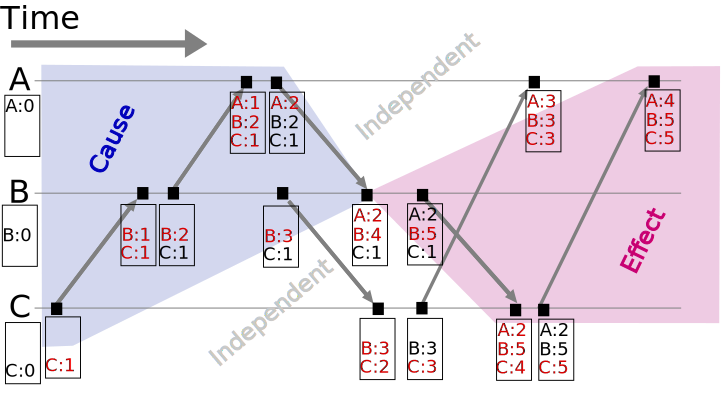

大概算是个大新闻：MongoDB 即将在 4.0 版本引入单个 Replica Set 上的 Transaction 支持，在 MongoDB 4.2 上引入支持 Sharding 的 Transaction 支持。为了达到这个目的，MongoDB 已经经过了三年多的持续开发。


这里选择下面的一些特性，介绍一下 MongoDB 为了实现 Transaction 进行的工作：

* Logical Sessions
* WiredTiger Timestamps
* Retryable writes
* Safe Secondary Reads
* Cluster-wide Logical Time
* Local Snapshot Reads

# Logical Sessions

Logical Sessions 是 MongoDB 3.6 引入的一项新特性，通过引入 Logical Sessions，MongoDB 管理自身的能力得到了极大的增强。

## Logical Session ID

Logical Session ID（LSID）用于标记系统中的各类资源和操作等。

* **id**: GUID，通过一些算法保证在分布式系统内的唯一性。
* **uid**: 用户名的 SHA-256 Digest，用于区分不同的 Client。

这些 ID 类似于 ObjectID，均在客户端直接生成，不需要与任何 mongod / mongos 请求获得。

## Use Case 1：Easy Administration

```

      +------+  +------+  +------+
      | App1 |  | App2 |  | App3 |
      +------+  +------+  +------+
        ||         ||         ||
  +--------+   +--------+   +--------+
  | mongos |   | mongos |   | mongos | 
  +--------+   +--------+   +--------+
             X            X
     +------------+  +------------+
     |   shard1   |  |   shard2   |
     | +--------+ |  | +--------+ |
     | | sec-md | |  | | sec-md | |  sec-md: Secondary mongod Instance
     | +--------+ |  | +--------+ | 
     | +--------+ |  | +--------+ |
     | | pri-md | |  | | sec-md | |  primary-md: Primary mongod Instance
     | +--------+ |  | +--------+ |
     | +--------+ |  | +--------+ |
     | | sec-md | |  | | pri-md | |
     | +--------+ |  | +--------+ |
     +------------+  +------------+
```

类似于很多常见数据库，MongoDB 支持主从复制和分片。每一个 Replica Set 有一个 Primary 和几个 Secondary 节点，在集群启动时通过选举选出一个 Primary 节点。当遇到节点崩溃或者网络错误时，节点的身份可以随情况改变。分片通过 mongos 完成，App 向 mongos 发送请求，mongos 进行路由并找到对应的 Shards，在对应的 Shards 上完成操作。每次请求数据并不一定会都在同一个 shard 上，mongos 会自动完成处理。

对于任何一个请求，都需要涉及到下面两种概念：

1. Operations（Op-s），管理命令或者 IO 操作；
2. Cursors，实际执行命令并返回数据。

在 MongoDB 3.4 中，当进行了错误的操作（如 collection.find 使用的字段没有索引导致 mongos 去所有的 shard 上面进行全 collection 的扫描）时，用户能做的事情十分有限，只能通过设定的 Timeout 去终止他们。尤其当 mongos 恰好在此时崩溃 / 断开网络连接了，而下面的 shards 中执行操作的 Cursors 就会彻底脱离控制，用户不仅拿不到查询的数据，也无法停止查询。

而在 MongoDB 3.6 中，所有的 op 和 cursor 都会有自己的 Logical Session ID。用户可以从任意一个 mongos / mongod 的 session table 中查看所有正在进行 / 某一用户正在进行的操作，同样也可以在任意一个 mongos 或者 mongod 上通过 kill sessions 命令终止他们。mongos 会向所有的 mongod 发送同样的 kill 命令要求它们终止对应的操作。

通过引入 Logical Session，所有的操作都将可以被中断，而不再像在 MongoDB 3.4 中，只有管理员可以进行这样的操作了。

## Use Case 2: Distributed Garbage Collection

```
                                    
+--------+        +-----------------+        +---------------------+
| Client | -----> | mongod / mongos | -----> | Sessions Collection |
+--------+  LSID  |  #              |  sync  +---------------------+
                  +--+--------------+ (5min interval)
                     |
                 Controller
```

对于一个长时间运行的 op 或者 cursor，我们希望可以自动完成对他们的清理。

之前我们只能指定 Timeout，而现在对于 Client 的每一个请求（op）都会有对应的 LSID，MongoDB 进程每 5 分钟会同步这些请求的 LSID 到一个全局的 Sessions Collection 中。

Session Collection 内 Document 的内容包括：

* **lsid**: Logical Session ID
* **lastUse**: Controller 报告的该 session 最后被使用的时间（并不一定真的是该 session 最后被使用的时间）

MongoDB 利用 Sessions Collection 追踪创建超过 30 分钟的操作并进行回收。另外，其他的 mongod / mongos 可以通过 Controller 来操作 Sessions Collections 内的的 session 以及对应的 ops / cursors。这样即使有一些长时间运行的 session 可能近段时间内在这一个 mongod / mongos 内没有操作，但是它们可能是在某一个跨 shard 的 Transaction 中，这样通过外部可以避免这些 op / cursor 被错误的回收。

举一个例子，Distributed Garbage Collection 对于 MongoDB 3.6 中引入的 Retryable Writes 十分重要。Retryable Write 让用户即使在网络故障时也可以确定写入是否完成，而实现 Retryable Write 需要所有写入操作涉及到的节点都维持一个状态，以便确定整个写入操作是否完成。利用 Logical Sessions 我们可以在操作完成后及时将这些状态回收。关于 Retryable Writes 的更详细内容我们后面会谈。

# WiredTiger Timestamps

WiredTiger 从 MongoDB 3.2 开始成为 MongoDB 的默认存储引擎，而 WiredTiger 是支持 Transaction 的。在 WiredTiger 中，Transaction 的实现主要依靠基于 Timestamp 的 MVCC。

## MongoDB OpLog 与 WiredTiger Journal

```
+-----+-----+-----+-----+
| ... | 100 | 101 | 102 |  MongoDB OpLog
+-----+-----+-----+-----+
         |        X     
+-----+-----+-----+-----+
| ... | 100 | 102 | 101 |  WiredTiger Journal
+-----+-----+-----+-----+
```

MongoDB 的 Replication 基于 OpLog，也就是将每一次操作记录下来并在 Secondary 上 Redo。由于采取了这种形式，OpLog 的顺序就十分重要。而由于并发的关系，存储引擎和 MongoDB 记录自己的 Journal 或者 OpLog 的顺序可能是不一样的（如图），这时在 Secondary 上进行的 Redo 就会出现问题。MongoDB 解决问题的方法是在底层增加了一个 Timestamp 且通过某种方式（Cluster-wide Logical Clock）保证 Timestamp 的准确性。

```
          +------+
          | root |
          +------+
         /        \
+-------+          +-------+
| kv kv |          | kv kv |
+-------+          +-------+
                        |
                        | update
                        |
               +-----+------+------+
       update  | txn | next | data | data: BSON of document or index updated
    structure  | ts  |      |      | ts: Timestamp
               +-----+------+------+
                        |
                        | update
                        |
               +-----+------+------+
       update  | txn | next | data | data: BSON of document or index updated
    structure  | ts  |      |      | ts: Timestamp
               +-----+------+------+
```

MongoDB 使用类似上面表示的树形结构来存储 Document 和 Index。当进行更新时 WiredTiger 创建一个 Update Structure 来标记具体更新的内容，其中包含一些与 Transaction 相关的信息，到下一个 update structure 的链接，以及具体更新的内容。进行读取操作的时候，WiredTiger 通过按顺序读取 update structures 来返回正确的结果。当然这是一个很简化的描述。

为了解决 OpLog / Journal 的顺序问题，WiredTiger 在 update structure 中增加了 Timestamp。这个 Timestamp 是由 MongoDB 提供给 WiredTiger 的。WiredTiger 将会按 Timestamp 记录的顺序处理 update structures，这样就能保证 WiredTiger 的 Journal 跟 MongoDB 的 OpLog 顺序一致。

另外，WiredTiger 还可以读取截止到某一个 Timestamp 的数据（Recover to timestamp）。Recover To Timestamp 是 WiredTiger 的一个非常重要的特性，后面几个地方都会提到。

## 处理 Replication 乱序的情况

在进行 Replication 的时候，OpLog 会被多个线程同时读取并 Redo 在 Secondary 上（因为只有一个的话太慢了，跟不上 Primary）。虽然 MongoDB 会让每一个 Redo 线程选择互相关联的一组 OpLog 进行 Redo，以保证 Replication 按正确的顺序进行，但是不同线程进行这样的 Redo 的时候同样可能出现顺序混乱的问题。

```
      |      batch      |  MongoDB OpLog Batches（Ordered）
+-----+-----+-----+-----+
| ... | 100 | 101 | 102 |  
+-----+-----+-----+-----+
         |     |     |
          \   /      |  
           \ /       |     Threads Applying OpLog
           / \       |
          /   \      |
         V     V     V
+-----+-----+-----+-----+
| ... | 101 | 100 | 102 |  Data applied to Secondary
+-----+-----+-----+-----+
```

MongoDB 同样利用 Timestamp 解决了这一问题，解决问题的方式类似于 Recover to Timestamp：进行查询时，即使 Secondary 上 Redo 的顺序是乱的，WiredTiger 仍然会按照 update structure 中记录的 Timestamp 来读取数据。这样当你查询 OpLog 101 写入的数据的时候，OpLog 100 和 101 的数据都会正常的返回。

## Batch Boundary

```      
      |     batch 1     |     batch 2     |
+-----+-----+-----+-----+-----+-----+-----+
| ... | 100 | 101 | 102 | 103 | 104 | 105 |
+-----+-----+-----+-----+-----+-----+-----+
      |                 |                 |
  timestamp         timestamp
```

MongoDB 将 OpLog 划分到不同的 Batch 中，每一个 Batch 会被一系列 thread 读取用于在 Secondary 上进行 Redo。Batch 的 Redo 是按照顺序来的，一个 Batch 在所有的 Secondary 上都完成 Redo 之后才会开始下一个 Batch 的 Redo。

以前每一个 Batch 在 Redo 的时候会用一个全局锁来标记，在这个 Batch 被 Redo 的时候 Secondary 是不能进行读取操作的，这是由于 Batch 的 Redo 顺序并不确定，如果不使用锁进行标记的话很可能读到不一致的数据。但是这样会带来性能上的损失：读取的操作需要等待当前的 Batch Redo 完成，锁释放才能进行，而 Redo 操作同样需要等到读取操作完成之后（这个读操作可能耗时很长）才能继续进行。

解决这一问题的方法还是利用了 WiredTiger 的 Timestamp：Batch 1 执行完成之后可以开始 Batch 2，我们可以知道 Batch 2 记录的 OpLog 的起始时间，这样我们还是可以用类似于 Recover To Timestamp 的方法对外呈现这一时间点前的一致的数据，而不会影响后续仍在进行的 Redo 操作。

即使有了上面这些因素来尽量保证 Replication 时数据的一致性，对于 Index 的更新仍然可能存在问题，比如两个线程同时操作一个带有 Unique Index 的 Document。解决这一问题应该是涉及到了 Index 的数据结构变动，这个不太清楚是怎么做的【捂脸】……

## Replication Rollback

```
                  Primary   |   Secondary
                            |   +-----+-----+-----+-----+
                            |   | ... | 101 |     |     |  Redo finished 1 / 3
                            |   +-----+-----+-----+-----+
                            |
+-----+-----+-----+-----+   |   +-----+-----+-----+-----+
| ... | 101 | 102 | 103 |   |   | ... | 101 | 102 | 103 |  Redo finished 3 / 3
+-----+-----+-----+-----+   |   +-----+-----+-----+-----+
               |            |
    Majority Commit Point   |   +-----+-----+-----+-----+
                            |   | ... | 101 | 102 |     |  Redo finished 2 / 3
                            |   +-----+-----+-----+-----+
```

首先了解一下 Majority Commit Point：Oplog 在 Primary 上生成并在 Secondary 上进行 Redo。但是不同的 Secondary 上 Redo 的进度可能是不一样的。Majority Commit Point 表示的是大多数 Secondary 已经完成 Redo 的位置，这意味着这个位置之前的数据已被写入到大多数的 Secondary 中，这样即使 Primary 因为某些原因不可用，Secondaries 重新选出的 Primary 中仍然会有这条 OpLog 的记录。像这里表示的 102 就被大多数的 Secondary 同步了，因此它就是 Majority Commit Point。当然此时如果 Primary 跪了，103 号记录就会丢失。

```
                  | Old History   |                     |  New History
+-----+-----+-----+-----+-----+   |   +-----+-----+-----+-----+-----+
| ... | 101 | 102 | 103 | 104 |   |   | ... | 101 | 102 | 201 | 202 |
+-----+-----+-----+-----+-----+   |   +-----+-----+-----+-----+-----+
                  |               |                     |
```

当 Primary 离线后恢复时，一般来说 Cluster 中已经有了新的 Primary 且它上面已经有了一些新的写入。旧的 Primary 会发现 103 104 跟新的 Primary 上面的记录不一样，这时旧的 Primary 将需要对 103 104 进行 Undo，然后重新把 201 202 接在 102 后面。

以前 MongoDB 进行这样的 Undo 的做法是：由于旧 Primary 上的 Document 和 Index 在这个过程中会被实际改写，MongoDB 必须从其他的节点上去拿到被 103 104 修改之前的数据，覆盖现有数据后再继续进行 Replication。现在我们可以利用 Recover To Timestamp（估计大家都猜到了）。

具体一点说，Replication 的过程中 Majority Commit Point 以及对应的 Timestamp 是可以实时了解到的。WiredTiger 保证在这个时间点之后的数据都没有实际写入到磁盘，方法是把以前的基于 Journal 的方式改为使用 Check Point：在磁盘上创建这些 Document 和 Index 在某一 Timestamp 的副本。这样做实际上还减少了 50% 的 Journal，对数据库的吞吐量带来了显著的提升。

# Retryable Writes

我们进行一次数据库写入的时候可能会遇到很多的问题：比如做一个类似于 x+= 1 这样的写入操作，可能操作没发送到 mongod，或者发送到 mongod 却没有返回客户端。这种时候就会出现一些问题，用户很难确定自己进行的操作是否成功了，因为这段时间内可能其他的什么操作也修改了 x。MongoDB 现在实现了：用户只要把相同的写入请求重新发一遍就行，而且绝对不会出现 x 被自增了两次的情况。

先说一下 MongoDB 的 OpLog 是什么样的：假如原来 x = 3，对于上面的一个 x += 1 的这种操作，OpLog 实际记录的是【把 x 改成 4】。因为像 x += 1 这种操作不是幂等的，MongoDB 需要记录的 OpLog 会把这样的操作转化为一个幂等的操作，这样 Secondary 做 Redo 的时候即使重复 Redo 了一条 OpLog 也没有关系。

## Transaction Table

我们来考虑一个更复杂点的操作：假设原来 x = 3，y = 4，进行【x += 1】，再进行【y += 2】。

每一次 x += 1 这样的操作都会创建一条 oplog，为了使得这样的操作可以重复，MongoDB 还需要去修改 Transaction Table。

```
  transaction table
+------+-----+-------+
| lsid | txn | lastw |
+------+-----+-------+
| lsid | txn | lastw |          oplog
+------+-----+-------+      +----+------+      +------+-------+        +----+-------+
| lsid | txn | lastw | ---> | tn |      | ---> | tn-1 | y = 6 | -...-> | t0 | x = 4 | 
+------+-----+-------+      +----+------+      +------+-------+        +----+-------+
```
Transaction Table 包含：

* **lsid** Logical Session ID（最前面说的那个）
* **txn** 这次写入对应的 Transaction Number
* **lastw** 指向上次写入的 OpLog

假如我们进行了上面 【x += 1】 的操作之后，跟数据库的连接断开。当我们重试这个【x += 1】的操作的时候，数据库会在 transaction table 中查找有相同的 lsid 和 txn 的操作，这样就可以对应到这个 transaction 内最后的一次成功写入。这样我们就可以判断这次【x += 1】的写入操作是否成功进行了，如果成功则忽略，失败则进行重试即可。MongoDB 会将结果返回给客户端，以便客户端确定这次重试是【上次成功这次忽略】还是【上次没成功这次重试】。

```
  transaction table
+------+-----+-------+
| lsid | txn | lastw |
+------+-----+-------+
| lsid | txn | lastw |          oplog  
+------+-----+-------+      +----+---------------+      +------+-----------------------+ 
| lsid | txn | lastw | ---> | t0 | findAndModify | ---> | noop | preimage or postimage |  
+------+-----+-------+      +----+---------------+      +------+-----------------------+ 
```

在 OpLog 中会记录所有需要的信息，返回给客户端的信息也会从 OpLog 中取得，就像完成了一次普通的写入一样。一个很典型的例子是 findAndModify：findAndModify 可以设置返回 update 前或者 update 后的文档，但是 update 前的文档肯定是找不到了，update 后的可能又会被其他操作覆盖掉，因此还需要一个 noop OpLog，用于记录文档在更新前（preimage）或更新后（postimage）的内容，以便正常返回给客户端。

MongoDB 客户端 / 连接器默认会自动进行一次 Retry，有上面这些机制保证，这次重试即使发生了，对客户端几乎也是无感知的。

## Transaction Table Replication

Transaction Table 也是需要复制到各个 Secondary 上的。Replication 的原理之前也都说了，就是去 Redo OpLog。前面说了怎么处理各种情况下的乱序问题，下面为了简单起见就不再考虑 Replication 乱序的问题。

```
      | single tx | 
+-----+-----+-----+-----+-----+
| ... | w01 | w02 | wtt | ... |  Primary 
+-----+-----+-----+-----+-----+
                  |
             Primary Fail
                  | 
+-----+-----+-----+-----+-----+-----+-----+-----+
| ... | w01 | w02 | ... | w01 | w02 | wtt | ... |  Secondary <Become Primary after Primary fails>
+-----+-----+-----+-----+-----+-----+-----+-----+
```

对于一个包括 w01 w02 两个写入操作的 Transaction，Primary 上会有 w01 w02 的 OpLog 以及更新 Transaction Table 的 OpLog。正常情况下 Secondary 只要把 w01 w02 wtt 的 OpLog 都 Redo 过来就行了，但是有可能在 wtt 送到 Secondary 之前 Primary 就离线了，并且按照前面说的 Majority Commit Point 的规则，w02 保留，wtt 丢失了。如果此时我们在新的 Primary 上重试上面包含 w01 w02 的 Transaction，因为没有 Transaction Table，新的 Primary 会认为这次操作并没有进行过，于是就会重新去进行 w01 w02，这样可能就会把之前其他写入破坏掉。

```
  transaction table
+------+-----+-------+
| lsid | txn | lastw |
+------+-----+-------+
             /      :      ···>: before w02 get to Secondary, w01 rebuild data in transaction table 
            /       :            and lastw points to w01
    oplog  V        V      --->: after w02 get to Secondary, lastw points to w02
 +----+-----+      +----+-----+
 | t1 | w02 | ---> | t0 | w01 | 
 +----+-----+      +----+-----+
```

为了避免这种情况发生，Transaction Table 采用特殊的方式进行 Replication，具体方式是 OpLog 会记录所有需要的信息（lsid，txn 等），使得 Secondary 上可以根据这些信息重新将这些 OpLog 组成链，并且正确的创建或者更新 Transaction Table 中的对应条目。

# Safe Secondary Reads

前面已经说了 MongoDB 的 Replication 和 Sharding 是如何进行的。Sharding 需要配置如何去做分片，配置存在 Writing Table 中。但是只有 Primary 有 Writing Table，Secondary 是没有这个 Table 的，这样在迁移数据的时候可能就会出问题。

在 Shard 间迁移数据分三步：

1. 从 Shard A 复制到 Shard B
2. 修改 Writing Table，把对应数据的位置从 Shard A 改成 Shard B
3. 删掉 Shard A 上的数据

因为第二步这个过程并不可能瞬间完成，故在第二步和第三步之间会出现问题。假设此时步骤 1 完成，步骤 2 正在进行，这时有一个写入进来，而且正确的写到了 Shard B 上。Shard B 上的数据更新了，而且过了 Majority Commit Point，用户肯定希望数据正常的写入进去了。此时来了一个查询，结果由于 Writing Table 没更新完，查询查到了没有新数据的 Shard A 上，自然是查不到刚才写入的数据。还有一种情况，查询的数据可能需要从多个 Shard 里面拿，这样因为两个 Shard 上都有数据，可能查询就会从两个 Shard 上拿到数据，即使可能用户在这个数据上设置了 Unique Index。

解决这个问题的方法也并不是很困难，Primary 更新完 Writing Table 前锁住 Shards 拦住后面的查询，这样如果出现像上面那样查询查到 A 的情况，就可以拒绝查询并且让 mongos 去 B 上拿数据。

至于 Secondary，Secondary 根本没有 Writing Table 所以查询查到 A 还是会出问题。

```
        Chunks(ck)     |     Writing Table (Cached)
                       |
+-----+-----+-----+    |    +-----+-----+-----+
| ck1 | ck4 | ck5 |    |    | ck1 | ck4 |     |  Primary 
+-----+-----+-----+    |    +-----+-----+-----+

+-----+-----+-----+    |    +-----------------+
| ck1 | ck4 | ck5 |    |    |       ???       |  Secondary
+-----+-----+-----+    |    +-----------------+
```

假设此时将 Chunk 5 挪进了这个 Shard。Primary 的 Writing Table 还没更新，因此对 Shard 5 的查询会被 Primary 拒绝，而对于 Secondary 来说因为它没有 Writing Table 所以 Secondary 就会傻乎乎的去从自己的 Chunk 5 副本里面去拿东西。

为了解决这样的问题，MongoDB 引入了 Safe Secondary Reads 这一特性。

其实说来也很简单，只要把 Writing Table 也复制到 Secondary 上不就行了？不过 MongoDB 实际做的时候是把整个 Shard 的配置都复制了一遍到每一个 Shard 的 Primary 上，然后 Secondary 再去从 Primary 上复制，这样每一个 Shard 的每一个 Replica Set 都有一份完整的 Writing Table。

```
 +-------------------------+----------------------------------+
 |  Shard A Chunks(ck)     |     Routing Tables               |
 |                         |                                  |
 |  +-----+-----+-----+    |    +-----+-----+-----+           |
 |  | ck1 | ck4 | ck5 |    |    | ck1 | ck4 | ck5 |  Shard A  |  Primary
 |  +-----+-----+-----+    |    +-----+-----+-----+           |
 |                         |    | ck2 | ck3 | ck6 |  Shard B  |
 |                         |    +-----------------+           |
 +-------------------------+----------------------------------+

 +-------------------------+----------------------------------+
 |  Shard A Chunks(ck)     |     Routing Tables               |
 |                         |                                  |
 |  +-----+-----+-----+    |    +-----+-----+-----+           |
 |  | ck1 | ck4 | ck5 |    |    | ck1 | ck4 | ck5 |  Shard A  |  Secondary
 |  +-----+-----+-----+    |    +-----+-----+-----+           |
 |                         |    | ck2 | ck3 | ck6 |  Shard B  |
 |                         |    +-----------------+           |
 +-------------------------+----------------------------------+
```

这样 mongos 直接查 Secondary 跟查 Primary 完全一样，不再会有上面的问题出现了。

# Cluster-wide Logical Time

前面我们提到了很多跟 Timestamp 相关的东西，那么保证 Cluster 中有一个足够精确的时钟对于上面很多特性的实现都是至关重要的。MongoDB 实现了 Cluster 级别的全局时钟，并且基于这个时钟还将实现 Casual Consistency 以及 Global Snapshot。

## Lamport Clock and Vector Clock

数学学的不太好……简单的解释下。

Lamport Clock 是一个在分布式系统中用来确定事件发生顺序的方法。它并不真的是一个时钟，只是一个跟事件关联的数值；在分布式系统内不同进程进行交互的时候通过这个数值，并将这个数值与事件绑定，通过这个数值即可确定事件的先后发生顺序。

```python
# Sender
time += 1              
time_stamp = time
send(message, time_stamp)         # send logical time to receiver

# Receiver
message, time_stamp = receive()   
time = max(time_stamp, time) + 1  # update logical time
```

这样对于这样交流过的 Sender 和 Receiver，有如下结论：

* 如果事件 b 在事件 a 之后发生，那么 `C(a) < C(b)`；
* 如果 `C(a) < C(b)`，那么事件 b 有可能在事件 a 之后发生：
    * 如果事件 a 和事件 b 有因果关系，那么事件 b 在事件 a 之后发生，否则无法比较；
    * 事件 b 一定不会在事件 a 之前发生。

上面情况下通过上述方式交流过的进程之间的关系被称为 Partial Order；如果一个系统中所有的进程都通过这样的交流互相达到了 Partial Ordering，那么称这个系统达到了 Total Order，这样这个系统内所有事件的先后顺序都可以被确定。

除了 Lamport Clock 还有很多更强大的 Logical Clock 比如 Vector Clock：



Vector Clock 的规则是这样的：

1. 开始所有的 Clock 都是 0
2. 某一进程内部产生事件时，把自己的 Clock + 1
3. 某一进程向其他进程发消息时，把自己的 Clock + 1 然后把自己的 Vector 发给其他进程
4. 某一进程接受信息的时候，把自己的 Clock + 1 然后把自己的 Vector 中所有的进程对应的 Clock 值跟接收到的信息中的 Vector 做比较，把自己记录的值更新为两者中比较大的值。

Vector Clock 的优势在于可以检测出多点写入时产生的冲突。MongoDB 并没有使用 Vector Clock，原因在于 Vector Clock 的通信机制较为复杂，Payload 大（需要传递所有的进程的 Vector），会导致比较大的性能开销。

其他的 Logical Clock 这里就不再多谈了。如果想更详细的了解请戳下面这些 Wikipedia 链接：

* https://en.wikipedia.org/wiki/Lamport_timestamps
* https://en.wikipedia.org/wiki/Happened-before
* https://en.wikipedia.org/wiki/Partially_ordered_set
* https://en.wikipedia.org/wiki/Total_order
* https://en.wikipedia.org/wiki/Vector_clock

## Lamport Clock in MongoDB

与学术研究不同，实际工程上需要考虑的东西更多一点。下面我们来看 MongoDB 是怎样利用 Lamport Clock 的：

1. MongoDB 中发送和接收并不代表一次事件，只有改变了数据库状态的操作（比如一次写入）才叫做事件，也只有这些事件才会导致上面 `time` 的增加（被称作一次 Tick）。很显然，Tick 只会发生在 Primary 上。
2. 所有互相通信的进程都会给对方发送目前自己已知的最大的 `time` 值，接收方再去根据这个值进行 Tick。

但是有下面一种特殊的情况需要处理：

```
                      (1)                                 
Malicious Client  ---------> +----------------+        
                             |                |
Client --------------------> | MongoDB Server | (2)
                (3)          |                |
Client --------------------> +----------------+

(1) Malicious client send 2^63 - 1 as timestamp
(2) MongoDB Server Tick, time += 1
(3) Normal clients send writes and they fail
```

假设有一个恶意客户端想破坏 MongoDB 服务器，它只需要发送 2^63 - 1 作为 Logical Time，这样 MongoDB 服务器进行 Tick 的时候对这个值 +1，然后 Logical Clock 就崩溃了。更糟糕的是一旦这次写入过了 Majority Commit，所有的 Secondary 都会跟着崩溃，唯一的修复方法只能是去修改数据库底层的数据存储。

解决这个问题的方法是使用签名。对 Cluster Time 进行签名，这样客户端就无法修改 Cluster Time。这跟上面提到的两个规则并不矛盾。当然这样的加密可能会带来一些性能损失，不过 MongoDB 在这里进行了一定的优化，实际性能损失并不明显。

## Casual Consistency

https://en.wikipedia.org/wiki/Consistency_model#Causal_Consistency

简单的说：有潜在性因果相关的写操作必须以同样的顺序被各进程所感知，而并发的写操作在不同的机器上可以有不同的顺序。

MongoDB 利用 Cluster-wide Logical Time 作为联系实现了 Causal Consistency。

1. Write to Primary `{query: {_id: 5}, update: {page: 4}}`
2. Primary return `{clusterTime: X}`
3. Read from Secondary `{afterClusterTime: X}`
4. Secondary wait for replication
5. Secondary return `{_id: 5, page: 4}`

# Local Snapshot Reads

```js
session.startTransaction({readConcern: {level: "snapshot"}});
var cursor = collection.find({a: 5});
while (cursor.hasNext()) {
    printJson(cursor.next());
}
session.commitTransaction();
```

* `readConcern.level = snapshot` 所有读取都是在这个 Snapshot 上的。
* `session.commitTransaction()` 用户使用 Snapshot（实际上是 WiredTiger 的 Snapshot）会占用一些 cache 之类的资源，commit 或 abort Transaction 可以主动释放这些资源。

目前上面这些操作只能在一个单独的 Replica Set 上完成；上面提到的 Global Snapshot 现在还没搞定，要等 MongoDB 4.2。

```js
while (!batch.full() && wtCursor.hasNext()) {
    next = wtCursor.next();
    if (filter.matches(next)) {
        batch.add(next);
    }
    if (timeToYield()) {
        checkForInterrupt();            // Check if killed or timeout
        wtCursor.saveState();           
        releaseLocksAndWtSnapshot();    // Release resources for snapshot
        reacquireLocksAndWtSnapshot();  // Acquire a newer one snapshot
        wtCursor.restoreState();
    }
}

return batch;
```

假设我们在进行一些查询，需要扫描某个 Collection。上面是 MongoDB 进行查询时服务器的伪代码。

首先我们需要一个 WiredTiger 的 Cursor 来扫整个 Collection。当 Cursor 向 Batch 里面写东西的时候会去逐一比较 Filter，匹配的放进 Batch。当需要返回数据给客户端的时候，MongoDB 会先检查 Op 是否被 Kill 或者是否超时，然后会保存 Cursor 的状态，释放锁和 Snapshot，然后重新获得锁和一个新的 Snapshot 并还原 Cursor 的状态。虽然此时是一个旧的 Cursor 从一个新的 Snapshot 开始读，但是 WiredTiger 仍然可以准确返回上次位置继续进行读取。Magic。

但是对于 Snapshot Read 来说，返回数据的时候不会有释放锁、释放 Snapshot、重新获得锁、获得新的 Snapshot 的过程，MongoDB 只从开始时的 Snapshot 读取。

这样对于单个读取操作来说足够了，但是对于多个请求同时需要读取的情况该如何处理呢？

```
                        +----------------+
         (1)find        | MongoDB Server |
     -----------------> |  +----------+  |
         (3)return      |  | Sessions |  |
     <----------------- |  |          |  |
         (4)getMore     |  | (2) Lock |  |
     -----------------> |  | Snapshot |  |
         (6)commit      |  |          |  |
     -----------------> +--+----------+--+
```

MongoDB 利用 Logical Session ID 将用户请求与锁和 Snapshot 进行关联，这样每一个用户可以通过自己的 lsid 得到自己的 Snapshot 以及 Cursor，这样用户可以很方便的继续从 Cursor 上获得数据。

1. 用户进行一次 find 这样的操作。
2. MongoDB 返回数据前会记录对应的锁和 Snapshot。
3. MongoDB 返回数据
4. 用户发送 getMore 请求，从上次中断的地方继续读。
5. 返回数据前同样经过 (2)(3) 的步骤，先保存状态再返回数据。
6. commit 或者 abort 结束 Transaction，Server 释放锁和 Snapshot。

其实在这里只使用 Cursor 同样可以达到目的，但是 MongoDB 将这样的操作统一划到 Transaction 的范围内，原因是 MongoDB 希望能将所有的操作和 Session 关联起来，便于更好的管理；另外可能会存在同时在某个 Snapshot 上用多个 Cursor 进行操作的情况（这些操作不会同时进行，但是可以交替使用同一组锁和 Snapshot）。

# Finally

MongoDB 从 3.0 开始把默认的 mmap 存储引擎换掉，改为使用 WiredTiger，到现在已经几乎做好支持 ACID 的准备，确实费了相当大的力气，即使到现在工作都尚未完成。目前无论是 MongoDB 还是 WiredTiger，文档都并不十分详细；而且 MongoDB 的 Transaction 支持还在紧张开发中，很多方案可能还会被修改。

这篇东西虽然花了不少时间整理，但是由于草民个人水平极其有限以及 MongoDB 官方文档并不太详细（Blog 基本上都是在吹牛逼……），其中还是有很多东西说的并不很清晰，也很可能跟实际情况存在一些出入。不过学习的过程中还是涨了很多姿势，一开始以为就是一个基于时间戳的 MVCC 我还是太年轻了，看到 Vector Clock 的时候岂止一脸懵逼。

最后希望 MongoDB 4.0 尽快发布，支持 Transaction 的文档数据库，听起来就刺激。