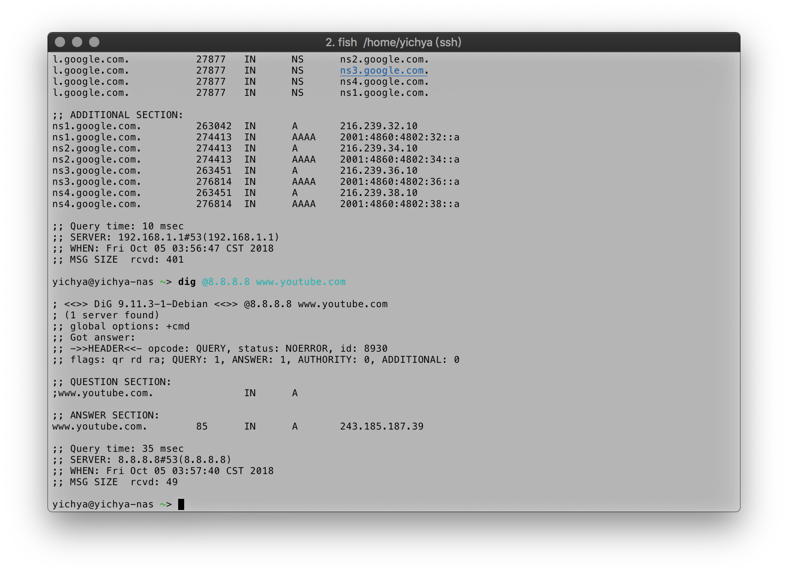
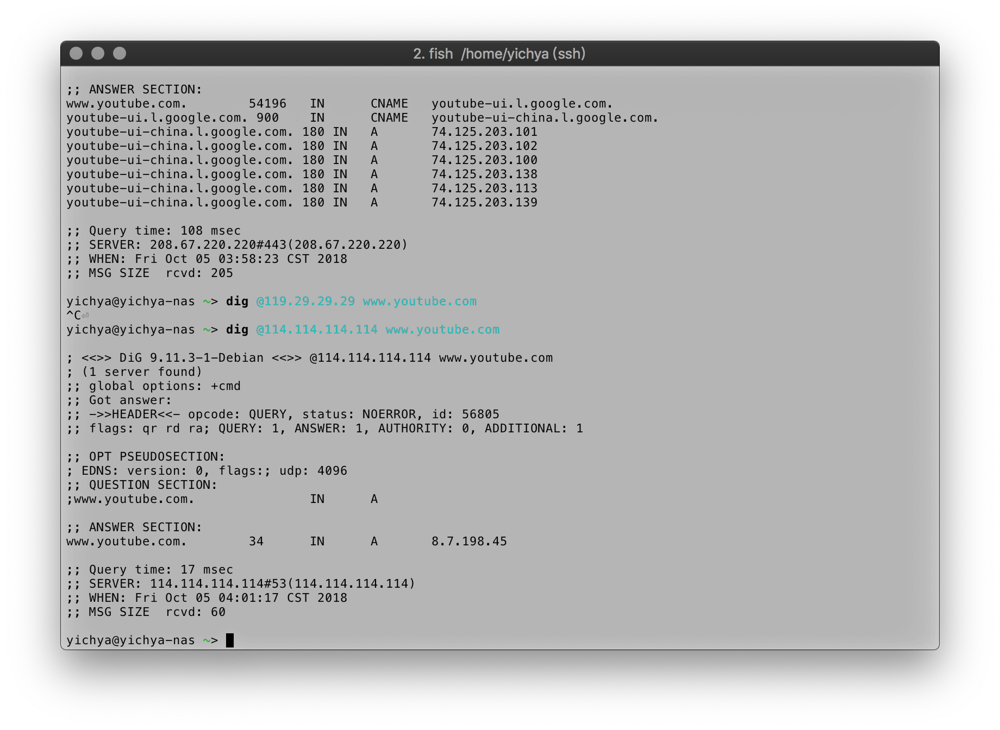
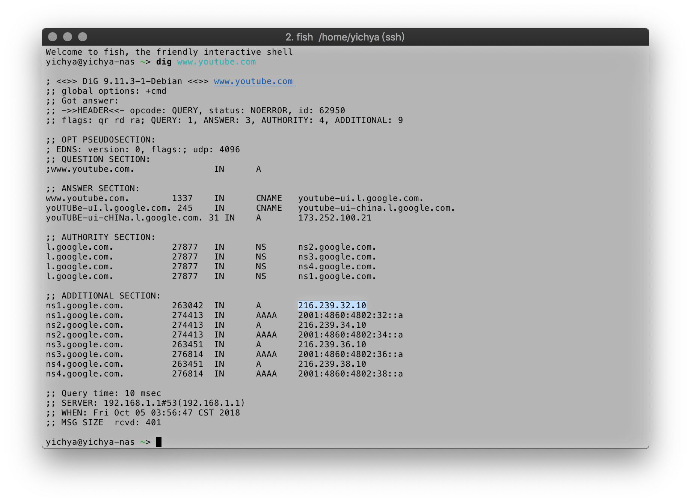
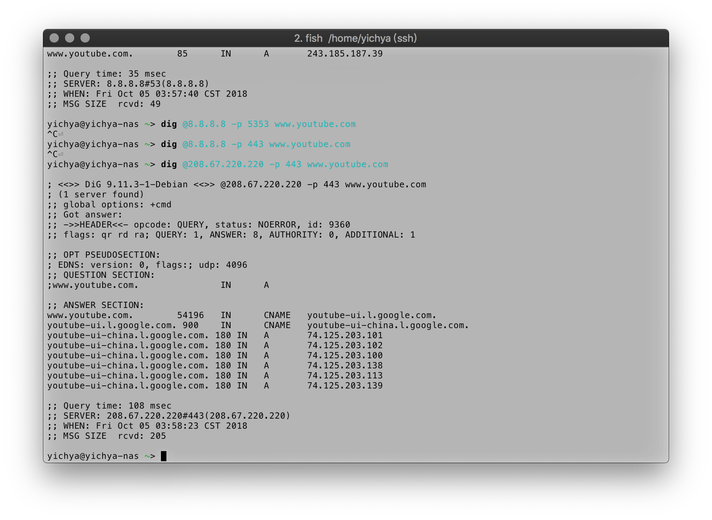
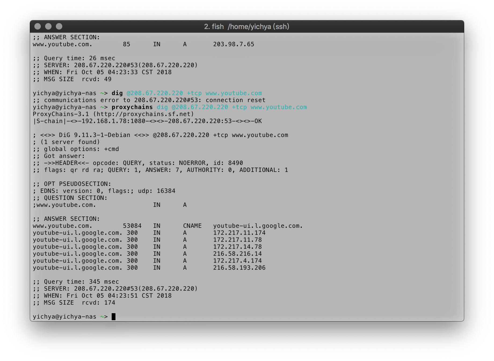
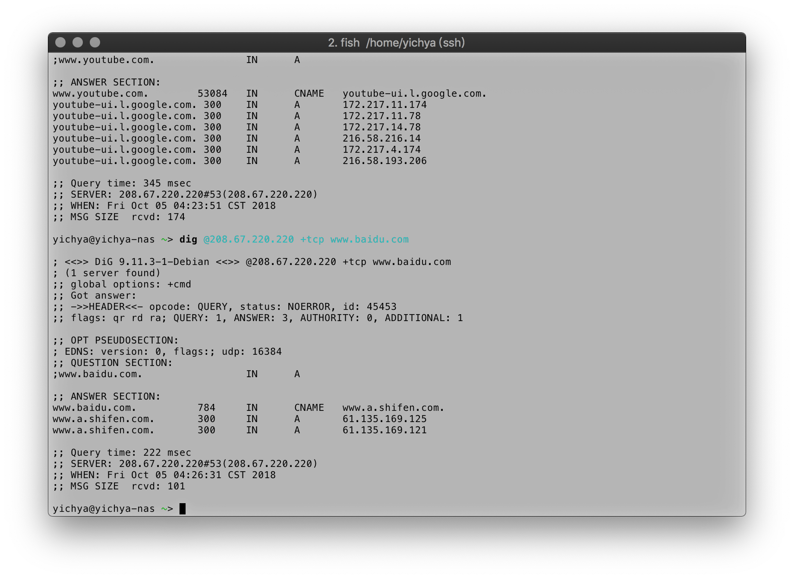
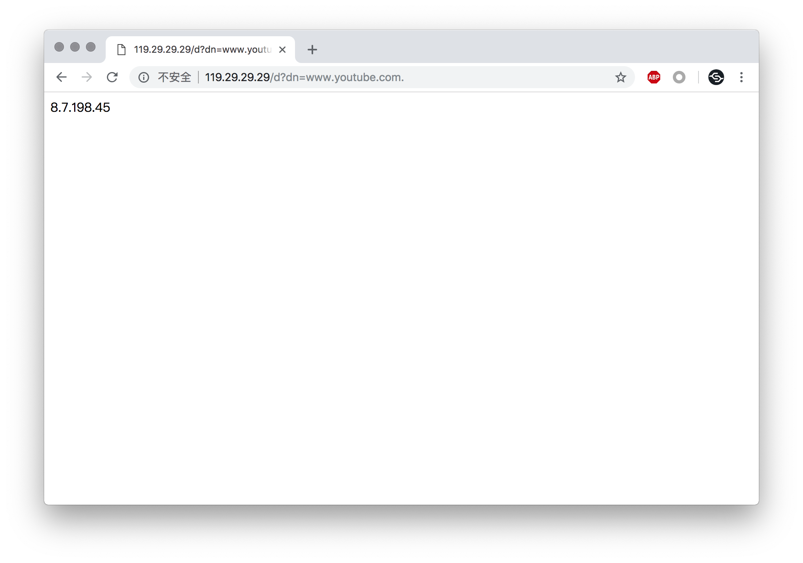
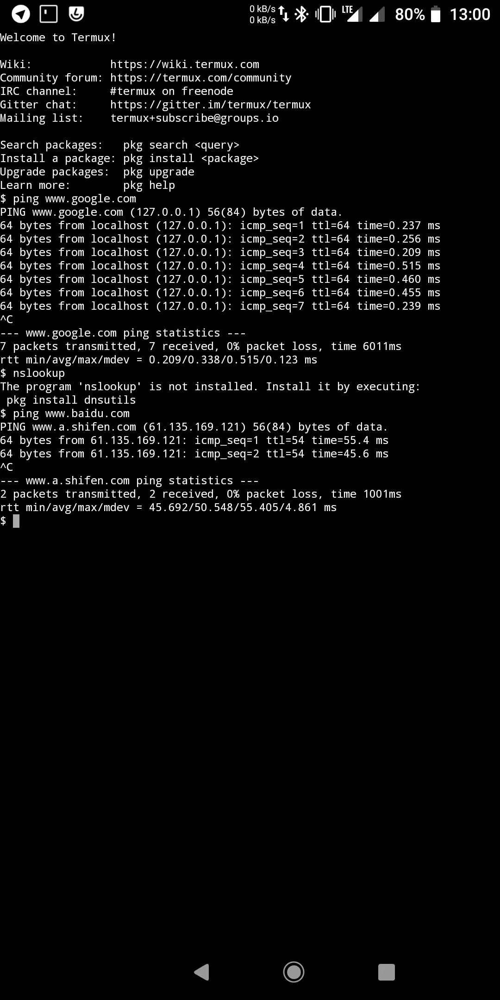
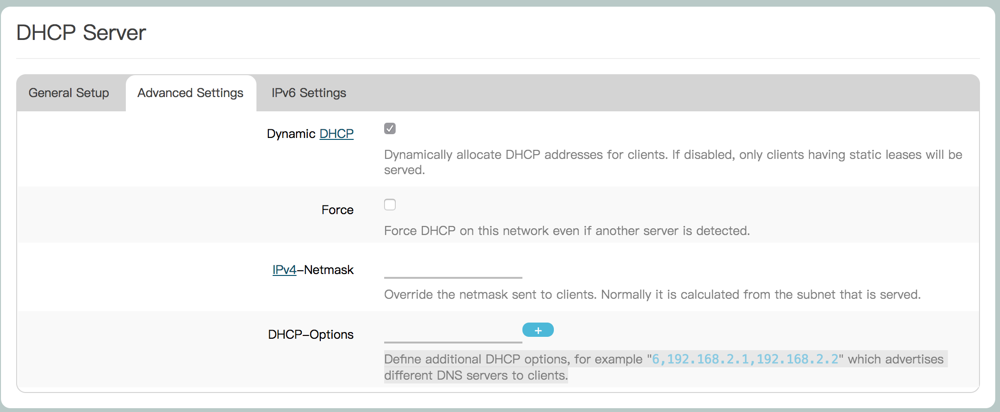
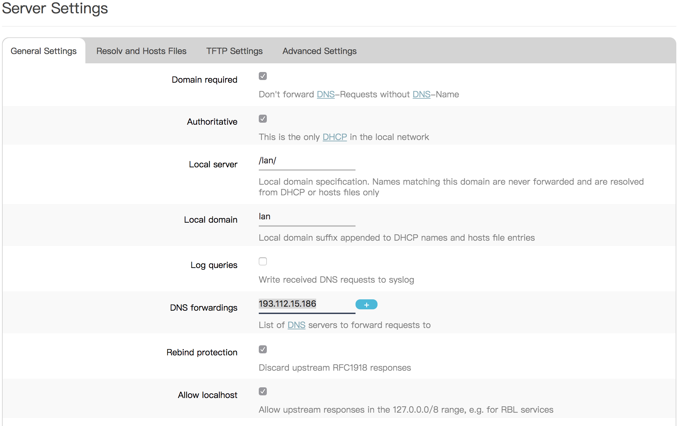

DNS 污染极为简单易行且效果极佳，一直都是各种牛鬼蛇神搞事的极佳手段。这篇东西介绍一下常见的 DNS 投毒现象，以及草民尝试过的几种避免被投毒的方案。

这篇东西假设您使用了基于 OpenWrt 的 NAT 网关（可以简单的理解为路由器），并且在使用其上配置的透明代理。如果没有基于 OpenWrt 的路由器，并且也懒得弄一个的话，建议在客户端上自己装个 Shadowsocks 简单解决一下；如果用了 OpenWrt 但是没有搞透明代理，可以往前翻一翻草民两年半前介绍 OpenWrt 上架设透明代理的那篇东西。

另外，由于这里提到的不少东西，如 ChinaDNS、DNS-forwarder 等并未收录在 OpenWrt 官方的 Packages 中，最好能够有自己的 ImageBuilder 或者 BuildRoot 环境。当然这些软件一般都有第三方构建好的适合各种体系结构的 ipk 包，如果您的路由器不是很特别的话，应该可以直接传到路由器中 opkg install 之。所谓「很特别的路由器」这里大概可以举一个例子：用树莓派刷个 OpenWrt 搞的那种「无线路由器」。一般第三方构建的 ipk 只有适合 ar71xx 或者 ramips 两种常见架构的，偶尔可能有 x86(64)，arm 的还是比较少见。如果有心思搞 arm 或者 x86/64 架构的路由器，不妨准备一个 BuildRoot 环境，搞事情会方便很多。OpenWrt 的 ImageBuilder 或者 BuildRoot 使用同样可以翻一翻草民之前的介绍。

# 「抢答」- DNS 污染的手段

DNS 污染的主要方式是通过伪装 DNS 服务器并发回错误结果，即「抢答」完成的。

由于 DNS 协议使用了 UDP 协议进行传输，不似 TCP 有「连接」的概念。把 DNS 请求包在一个数据包里，写一下「谁发的」和「发给谁」，丢到网络上，然后就等有人回应。至于这个包是不是真的发给了期望发给的人，发送回答的是不是期望回答的人，从 UDP 协议的角度来讲，没有任何办法能够确认。虽然使用 UDP 协议提高了 DNS 解析的速度，但是也大大牺牲了数据安全性。

「抢答」发生的时机不同，带来的影响也是不一样。下面是一个 DNS 解析结果从根 DNS 返回到用户的几种情况。

```
    (1)           (2)                 |(4)
User <- ISP -+- ISP DNS <----------+- | <---------------------+--- Root DNS
             |                     | GFW                      |
             +- Local Public DNS <-+  |                       |
             |         (3)           GFW                      |
             +----------------------- | <- Remote Public DNS -+
                                      |(5)
```  

用户看到错误解析记录的原因可能分别来自（1）-（5）五个位置，其中（1）（4）（5）是「抢答」，（2）（3）是被「抢答」影响导致解析记录被「污染」。

1. 解析请求在 ISP 的网络上被「抢答」：一个 DNS 解析请求，在到达任何一个真正的 DNS 之前即被 ISP 网络中的其他设施抢答。
2. 解析请求正常到达 ISP 提供的 DNS，但是 ISP DNS 中缓存的记录由于 ISP 自身原因或者 GFW（4）而不可靠。前者是否存在不确定，因为很难与（1）进行区分，但是（1）毫无疑问存在。
3. 用户使用 GFW 内的公共 DNS，但是公共 DNS 中缓存的记录由于公共 DNS 运营商自身原因或者 GFW（4）而不可靠。在「自我审查」的压力下，前者一般可认为存在，但是没有明显证据。
4. ISP DNS 或者 GFW 内的公共 DNS 中没有缓存某记录，查询上游根 DNS，但是被 GFW 抢答。
5. 用户使用 GFW 外的公共 DNS，请求到达该公共 DNS 前被 GFW 抢答。

此几种情况仅从解析结果来看不易区分，不过可以从得到结果的耗时猜个大概，耗时越短说明抢答发生的越早。

下面的记录分别在联通 4G 和联通宽带下进行尝试，解释常见的几种投毒方式。



*使用 Google 公共 DNS，被 GFW 抢答，即（5）。GFW 抢答一般会给出一个国外 IP，但是这个 IP 访问要么超时要么 Empty Response。这些 IP 有人进行了收集，被称为 GFW 黑名单。*



*使用 114.114.114.114。返回的 IP 同样是 GFW 黑名单里面的。至于是（3）还是（4），不太确定。*



*使用运营商提供的 DNS。这个很有意思，返回了看起来没啥问题的 CNAME，但是解析 CNAME 记录的时候返回的记录，域名看起来出现了奇怪的大写字母，IP 是 GFW 黑名单里面的。同样不好确定是（1）还是（2）。*



*使用 OpenDNS 加非标准端口，绕过重重阻碍得到了正确的解析结果。*



*GFW 的另一种玩法：TCP 阻断。很多公共 DNS 都支持通过 TCP 方式进行查询，虽然速度慢不过可以避免被投毒。GFW 对此的态度很简单：直接 MITM 攻击之，向两边发送 RST 阻断连接。下面正常返回的结果使用了 Shadowsocks 代理，因此损失了智能解析结果（智能解析使用的 IP 是 Shadowsocks 的服务端 IP，不适用于客户端所处网络环境）。*



*TCP 阻断只在 TCP 报文中出现特定关键字（这里是 YouTube）时触发，如果查询百度，是不会有这种情况存在的。这种阻断方式一般用于阻断包含特定内容的 HTTP 明文传输，详细内容在维基百科上有介绍。*



*笑话 1。DnsPod 被腾讯云收购之后。直接用 https 方式查询 DnsPod API 得到的结果跟 114 一样是黑名单 IP。结合 114 的结果来看，我个人倾向于国内大体量的公共 DNS 为了避免被查水表会进行自我审查。*



*笑话 2。联通 4G 神仙操作：* `127.0.0.1 www.google.com` *考虑到曾经有过辽宁联通把工信部网站解析到 127.0.0.1 的超·神仙操作，google.com 被这么搞看起来已经是小场面了。*

另外，还有一种可笑的情况：GFW 的投毒是双向的，也就是说假如 GFW 外某 DNS 请求在未找到记录的时候请求了 GFW 内的上游 DNS，这个请求有可能在到达 GFW 内 DNS 前被 GFW 抢答，导致 GFW 外的 DNS 被污染。这事儿真的出现过，具体可以在维基百科上了解一下。

# 反制策略

由于 DNS 协议本身的上述缺陷，对投毒的反制很难达到完美。我们这里对反制策略进行下面几个维度的评估：

* 纯净程度
* 解析速度
* 稳定性（SLA）
* 线路优化
* 使用门槛

一般来说，这几点基本不太可能兼得。举几个典型例子，并进行简单分析如下：

* **运营商（ISP）提供的 DNS** PPPoE 鉴权完成之后，马上会得到一个运营商分配的 DNS，举例如 `202.99.160.68` 和 `202.99.166.4`。ISP 提供的 DNS 会考虑 ISP 提供的 CDN 和线路优化，解析速度最快，使用门槛最低（零门槛），稳定性亦有保证。但是纯净程度基本上是最差劲的，除了被 GFW 投毒之外，运营商自我审查或者利用 DNS 污染进行 HTTP 劫持来投广告之类亦是屡见不鲜。
* **国内公共 DNS** 举例如 `114.114.114.114` 和 `119.29.29.29`。一般来说不会有运营商投广告这种事情（被运营商抢答除外），一般会有同样不错的智能解析、线路优化功能，解析速度比运营商提供的 DNS 没有很明显差别，使用门槛稍高一点点（需要用户自行设置，但 360 之类工具亦可一键代劳）。纯净程度由于仍会被 GFW 投毒，比较一般。至于为什么技术实力这么强的大佬还会被投毒？您敢不被投毒嘛？投毒和东风快递选一个？
* **国外公共 DNS** 举例如 `8.8.8.8`，`1.1.1.1`。除了解析比国内公共 DNS 慢，包括使用门槛、线路优化、稳定性等方面跟国内公共 DNS 没太大差别。纯净程度上，则一样会被运营商或者 GFW 抢答。
* **小众、未公开、自建 DNS** 举例如 Pdomo `193.112.15.186` 或者 Tuna `101.6.6.6`。小众 DNS 目前看起来 ISP 不算很感兴趣，不会去抢答；GFW 内自建的小 DNS 一般会默认上游不安全，会通过采取一些特定反制策略的方式来避免被 GFW 抢答导致自身被污染。使用门槛一般来说跟国内公共 DNS 类似（除非要换非标准端口防止被运营商抢答，这个下面会谈）。由于设置在 GFW 内，一般来讲解析速度尚可，追求服务质量的话一般也会考虑智能解析和线路优化。问题主要在 SLA 上，上面举的两个例子都曾经因为各种千奇百怪的原因暂停服务数小时甚至数天，严重影响用户使用。另外，还发生过 Pdomo 开 SNI 加速结果遭到人身威胁被迫关闭的情况，这样小 DNS 的 SLA 更难保证，说不定稍微有点名气之后就得在被投毒和被东风快递之间选一个。
* **在 NAT 网关上架设复杂反制策略，实现内网纯净解析** 通过一系列复杂操作可以实现纯净程度、稳定性、解析速度、线路优化皆得，但是对于普通用户来说门槛很高，需要有特定设备和相当的计算机知识。

下面按照使用门槛排序，分别介绍几种反制策略。

## 反制策略 1：使用小众或未公开 DNS

ISP 投毒目前来看似乎还没那么丧心病狂，一般来说只有发到国内外特定的几个公共 DNS 的请求会被 ISP 特殊照顾，至于小众 DNS 被投毒的情况似乎并不明显。因此我们只需要简单修改一下客户端实际使用的 DNS 地址就行。小众 DNS 在不考虑 SLA 的情况下是非常好的选择，就算临时跪了也可以立刻切换回运营商 DNS 或者公共 DNS，不会有太大影响。

在客户端上直接修改的方式就不赘述了，教程烂大街，随便一搜就能搜到。不过对于 OpenWrt 路由器来说可以采取以下三种不同的方式来设置：

1. 忽略路由器通过 PPPoE 获得的 DNS，指定为我们要使用的 DNS。
2. 在 DHCP 分配地址时，将默认分配给客户端的 DNS（一般就是路由器自己的地址比如 `192.168.1.1`），改为分配我们要使用的 DNS 的地址。
3. 直接指定 dnsmasq 的上游 DNS 为我们要使用的 DNS。

一般的家庭路由器都可以使用第一种方式来设置，不外乎找到 WAN 配置并且改掉里面的 DNS 设置项目，也很简单不多说了。

第二种方式是通过在 DHCP 设置中添加额外的参数来完成：



如图上选中部分。添加参数 `6,<DNS1 IP>[,<DNS* IP>,...]` 即可。

第三种方式通过修改 dnsmasq 的设置完成：



在选定的地方添加上游 DNS 的 IP 即可。一个不够可以再加。

## 反制策略 2：使用公共 DNS 的非标准端口

使用上面策略 1 中的的方法，一般来说在不考虑运营商投毒和 SLA 的情况下都足够解决问题，但是运营商抢答已经是家常便饭了，发到国内外公共 DNS 的请求基本都存在被运营商抢答的风险。GFW 同样会盯着几个特定墙外公共 DNS 并进行抢答。

一般来说这种抢答只会发生在 53/udp 端口上，因此很容易想到的办法就是通过其他的端口来传递 DNS 请求和结果。OpenDNS 在 443 端口上同样提供 DNS 查询服务，pdomo 的辅 DNS 也有非标准的 2323 端口。另外据说 Google DNS 在 5353 上有服务，但是这个草民测试不成功。

设置这个就需要一个比较靠谱的 DNS 转发器了。最简单的办法肯定还是直接在路由器的 dnsmasq 上设置，参考上一步设置 dnsmasq 上游的图，在 IP 地址后面添加 #443 或者 #5353 这样的端口号即可。

## 反制策略 3：使用 Shadowsocks 转发 UDP 流量，将 DNS 请求转发到墙外

## 反制策略 3.5：在 3 的基础上增加 ChinaDNS 做线路优化

## 反制策略 4：自建 DNS，SLA 自己来保证

## 反制策略 5：DNS over TLS 弄不起来，DNS over HTTPS 说不定可以

## 反制策略 6：直接在路由器上通过 TCP 方式向上游进行 DNS 请求

## 反制策略 7：利用 DNS 白名单，自行实现「智能解析」，搭配 chnroute 实现最佳白名单方案

# 技巧：拦截内网中的所有 DNS 请求，并全部交由路由器进行处理

# 后记
