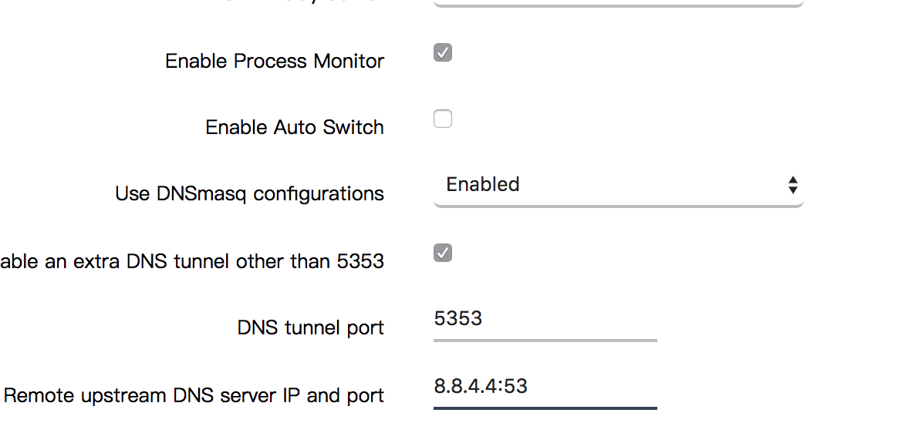

DNS 污染极为简单易行且效果极佳，一直都是各种牛鬼蛇神搞事的极佳手段。这篇东西介绍一下常见的 DNS 投毒现象，以及草民尝试过的几种避免被投毒的方案。

这篇东西假设您使用了基于 OpenWrt 的 NAT 网关（可以简单的理解为路由器），并且在使用其上配置的透明代理（这里以 Shadowsocks 为例，V2Ray 没有用过，应该是差不多的），同时使用了 ChnRoute 过滤国内 IPv4 地址。如果没有基于 OpenWrt 的路由器，并且也懒得弄一个的话，建议在客户端上自己装个 Shadowsocks 简单解决一下；如果用了 OpenWrt 但是没有搞透明代理，或者没有使用 ChnRoute 的话，可以往前翻一翻草民两年半前介绍 OpenWrt 上架设透明代理的那篇东西。关于 ChnRoute 下面也会有更详细一点的介绍。

另外，由于这里提到的不少东西，如 ChinaDNS、DNS-forwarder 等并未收录在 OpenWrt 官方的 Packages 中，最好能够有自己的 ImageBuilder 或者 BuildRoot 环境。当然这些软件一般都有第三方构建好的适合各种体系结构的 ipk 包，如果您的路由器不是很特别的话，应该可以直接传到路由器中 opkg install 之。所谓「很特别的路由器」这里大概可以举一个例子：用树莓派刷个 OpenWrt 搞的那种「无线路由器」。一般第三方构建的 ipk 只有适合 ar71xx 或者 ramips 两种常见架构的，偶尔可能有 x86(64)，arm 的还是比较少见。如果有心思搞 arm 或者 x86/64 架构的路由器，不妨准备一个 BuildRoot 环境，搞事情会方便很多。OpenWrt 的 ImageBuilder 或者 BuildRoot 使用同样可以翻一翻草民之前的介绍。

# 「抢答」- DNS 污染的手段

DNS 污染的主要方式是通过伪装 DNS 服务器并发回错误结果，即「抢答」完成的。

由于 DNS 协议使用了 UDP 协议进行传输，不似 TCP 有「连接」的概念。把 DNS 请求包在一个数据包里，写一下「谁发的」和「发给谁」，丢到网络上，然后就等有人回应。至于这个包是不是真的发给了期望发给的人，发送回答的是不是期望回答的人，从 UDP 协议的角度来讲，没有任何办法能够确认。虽然使用 UDP 协议提高了 DNS 解析的速度，但是也大大牺牲了数据安全性。

「抢答」发生的时机不同，带来的影响也是不一样。下面是一个 DNS 解析结果从根 DNS 返回到用户的几种情况。

```
    (1)           (2)                 |(4)
User <- ISP -+- ISP DNS <----------+- | <---------------------+--- Root DNS
             |                     | GFW                      |
             +- Local Public DNS <-+  |                       |
             |         (3)           GFW                      |
             +----------------------- | <- Remote Public DNS -+
                                      |(5)
```  

用户看到错误解析记录的原因可能分别来自（1）-（5）五个位置，其中（1）（4）（5）是「抢答」，（2）（3）是被「抢答」影响导致解析记录被「污染」。

1. 解析请求在 ISP 的网络上被「抢答」：一个 DNS 解析请求，在到达任何一个真正的 DNS 之前即被 ISP 网络中的其他设施抢答。
2. 解析请求正常到达 ISP 提供的 DNS，但是 ISP DNS 中缓存的记录由于 ISP 自身原因或者 GFW（4）而不可靠。前者是否存在不确定，因为很难与（1）进行区分，但是（1）毫无疑问存在。
3. 用户使用 GFW 内的公共 DNS，但是公共 DNS 中缓存的记录由于公共 DNS 运营商自身原因或者 GFW（4）而不可靠。在「自我审查」的压力下，前者一般可认为存在，但是没有明显证据。
4. ISP DNS 或者 GFW 内的公共 DNS 中没有缓存某记录，查询上游根 DNS，但是被 GFW 抢答。
5. 用户使用 GFW 外的公共 DNS，请求到达该公共 DNS 前被 GFW 抢答。

此几种情况仅从解析结果来看不易区分，不过可以从得到结果的耗时猜个大概，耗时越短说明抢答发生的越早。

下面的记录分别在联通 4G 和联通宽带下进行尝试，解释常见的几种投毒方式。


*使用 Google 公共 DNS，被 GFW 抢答，即（5）。GFW 抢答一般会给出一个国外 IP，但是这个 IP 访问要么超时要么 Empty Response。这些 IP 有人进行了收集，被称为 GFW 黑名单。*


*使用 114.114.114.114。返回的 IP 同样是 GFW 黑名单里面的。至于是（3）还是（4），不太确定。*


*使用运营商提供的 DNS。这个很有意思，返回了看起来没啥问题的 CNAME，但是解析 CNAME 记录的时候返回的记录，域名看起来出现了奇怪的大写字母，IP 是 GFW 黑名单里面的。同样不好确定是（1）还是（2）。*


*使用 OpenDNS 加非标准端口，绕过重重阻碍得到了正确的解析结果。*


*GFW 的另一种玩法：TCP 阻断。很多公共 DNS 都支持通过 TCP 方式进行查询，虽然速度慢不过可以避免被投毒。GFW 对此的态度很简单：直接 MITM 攻击之，向两边发送 RST 阻断连接。下面正常返回的结果使用了 Shadowsocks 代理，因此损失了智能解析结果（智能解析使用的 IP 是 Shadowsocks 的服务端 IP，不适用于客户端所处网络环境）。*


*TCP 阻断只在 TCP 报文中出现特定关键字（这里是 YouTube）时触发，如果查询百度，是不会有这种情况存在的。这种阻断方式一般用于阻断包含特定内容的 HTTP 明文传输，详细内容在维基百科上有介绍。*


*笑话 1。DnsPod 被腾讯云收购之后。直接用 https 方式查询 DnsPod API 得到的结果跟 114 一样是黑名单 IP。结合 114 的结果来看，我个人倾向于国内大体量的公共 DNS 为了避免被查水表会进行自我审查。*


*笑话 2。联通 4G 神仙操作：* `127.0.0.1 www.google.com` *考虑到曾经有过辽宁联通把工信部网站解析到 127.0.0.1 的超·神仙操作，google.com 被这么搞看起来已经是小场面了。*

另外，还有一种可笑的情况：GFW 的投毒是双向的，也就是说假如 GFW 外某 DNS 请求在未找到记录的时候请求了 GFW 内的上游 DNS，这个请求有可能在到达 GFW 内 DNS 前被 GFW 抢答，导致 GFW 外的 DNS 被污染。这事儿真的出现过，具体可以在维基百科上了解一下。

# 反制策略

由于 DNS 协议本身的上述缺陷，对投毒的反制很难达到完美。我们这里对反制策略进行下面几个维度的评估：

* 纯净程度
* 解析速度
* 稳定性（SLA）
* 线路优化
* 使用门槛

一般来说，这几点基本不太可能兼得。举几个典型例子，并进行简单分析如下：

* **运营商（ISP）提供的 DNS** PPPoE 鉴权完成之后，马上会得到一个运营商分配的 DNS，举例如 `202.99.160.68` 和 `202.99.166.4`。ISP 提供的 DNS 会考虑 ISP 提供的 CDN 和线路优化，解析速度最快，使用门槛最低（零门槛），稳定性亦有保证。但是纯净程度基本上是最差劲的，除了被 GFW 投毒之外，运营商自我审查或者利用 DNS 污染进行 HTTP 劫持来投广告之类亦是屡见不鲜。
* **国内公共 DNS** 举例如 `114.114.114.114` 和 `119.29.29.29`。一般来说不会有运营商投广告这种事情（被运营商抢答除外），一般会有同样不错的智能解析、线路优化功能，解析速度比运营商提供的 DNS 没有很明显差别，使用门槛稍高一点点（需要用户自行设置，但 360 之类工具亦可一键代劳）。纯净程度由于仍会被 GFW 投毒，比较一般。至于为什么技术实力这么强的大佬还会被投毒？您敢不被投毒嘛？投毒和东风快递选一个？
* **国外公共 DNS** 举例如 `8.8.8.8`，`1.1.1.1`。除了解析比国内公共 DNS 慢，包括使用门槛、线路优化、稳定性等方面跟国内公共 DNS 没太大差别。纯净程度上，则一样会被运营商或者 GFW 抢答。
* **小众、未公开、自建 DNS** 举例如 Pdomo `193.112.15.186` 或者 Tuna `101.6.6.6`。小众 DNS 目前看起来 ISP 不算很感兴趣，不会去抢答；GFW 内自建的小 DNS 一般会默认上游不安全，会通过采取一些特定反制策略的方式来避免被 GFW 抢答导致自身被污染。使用门槛一般来说跟国内公共 DNS 类似（除非要换非标准端口防止被运营商抢答，这个下面会谈）。由于设置在 GFW 内，一般来讲解析速度尚可，追求服务质量的话一般也会考虑智能解析和线路优化。问题主要在 SLA 上，上面举的两个例子都曾经因为各种千奇百怪的原因暂停服务数小时甚至数天，严重影响用户使用。另外，还发生过 Pdomo 开 SNI 加速结果遭到人身威胁被迫关闭的情况，这样小 DNS 的 SLA 更难保证，说不定稍微有点名气之后就得在被投毒和被东风快递之间选一个。
* **在 NAT 网关上架设复杂反制策略，实现内网纯净解析** 通过一系列复杂操作可以实现纯净程度、稳定性、解析速度、线路优化皆得，但是对于普通用户来说门槛很高，需要有特定设备和相当的计算机知识。

下面按照使用门槛排序，分别介绍几种反制策略。

## 反制策略 1：使用小众或非公共 DNS

ISP 投毒目前来看似乎还没那么丧心病狂，一般来说只有发到国内外特定的几个公共 DNS 的请求会被 ISP 特殊照顾，至于小众 DNS 被投毒的情况似乎并不明显。因此我们只需要简单修改一下客户端实际使用的 DNS 地址就行。小众 DNS 在不考虑 SLA 的情况下是非常好的选择，就算临时跪了也可以立刻切换回运营商 DNS 或者公共 DNS，不会有太大影响。

在客户端上直接修改的方式就不赘述了，教程烂大街，随便一搜就能搜到。不过对于 OpenWrt 路由器来说可以采取以下三种不同的方式来设置：

1. 忽略路由器通过 PPPoE 获得的 DNS，指定为我们要使用的 DNS。
2. 在 DHCP 分配地址时，将默认分配给客户端的 DNS（一般就是路由器自己的地址比如 `192.168.1.1`），改为分配我们要使用的 DNS 的地址。
3. 直接指定 dnsmasq 的上游 DNS 为我们要使用的 DNS。

一般的家庭路由器都可以使用第一种方式来设置，不外乎找到 WAN 配置并且改掉里面的 DNS 设置项目，也很简单不多说了。

第二种方式是通过在 DHCP 设置中添加额外的参数来完成：


如图上选中部分。添加参数 `6,<DNS1 IP>[,<DNS* IP>,...]` 即可。

第三种方式通过修改 dnsmasq 的设置完成：


在选定的地方添加上游 DNS 的 IP 即可。一个不够可以再加。

## 反制策略 2：使用公共或非公共 DNS 的非标准端口

使用上面策略 1 中的的方法，一般来说在不考虑运营商投毒和 SLA 的情况下都足够解决问题，但是运营商抢答已经是家常便饭了，发到国内外公共 DNS 的请求基本都存在被运营商抢答的风险。GFW 同样会盯着几个特定墙外公共 DNS 并进行抢答。

一般来说这种抢答只会发生在 53/udp 端口上，因此很容易想到的办法就是通过其他的端口来传递 DNS 请求和结果。OpenDNS 在 443 端口上同样提供 DNS 查询服务，pdomo 的辅 DNS 也有非标准的 2323 端口。另外据说 Google DNS 在 5353 上有服务，但是这个草民测试不成功。

设置这个就需要一个比较靠谱的 DNS 转发器了。最简单的办法肯定还是直接在路由器的 dnsmasq 上设置，参考上一步设置 dnsmasq 上游的图，在 IP 地址后面添加 #443 或者 #5353 这样的端口号即可。


## 反制策略 3：在墙内自建 DNS，SLA 自己来保证

非公共 DNS 使用起来一般来说很开心，但是 SLA 往往并不理想。考虑到现在腾讯云买个 VPS 基本都是白菜价，做个活动 8 块钱一个月，学生认证可能 1 块钱一个月，很多人应该都有自己的 VPS。那不妨利用一下 VPS 来自己搭建一个非公开的 DNS，就算挂了，反正是自己的，上去马上重启就行。

pdomo 提供了一个架设镜像的教程，教程是基于 Linux 的。草民撸的腾讯云图省事儿装的是 Windows Server 2008 R2，也没有 WSL 环境，又不想重装系统怎么办呢？pdomo 教程中使用的软件叫 overture，这个软件是 go 写的，并且官方提供了 Windows 版（[https://github.com/shawn1m/overture/releases](https://github.com/shawn1m/overture/releases)）。那问题就很好解决了。

下载解压缩。


修改其中的 `config.json`，配置为使用 TCP 方式连接上游 OpenDNS（照抄 pdomo 给的配置，稍微修改一下适配最新版），并且运行在一个非标准端口（这里是 23456）上，避免被运营商抢答。在这里还可以配置到上游的 socks 代理以及用于智能解析的 EDNS Client Subnet（这个是什么在下面的 DNS over HTTPS 里面会做演示），这样即使 VPS 所处网络存在 DNS 污染也可以通过这样的方式避免自己受到影响。

```json
{
  "BindAddress": ":23456",
  "PrimaryDNS": [
    {
      "Name": "OpenDNS1",
      "Address": "208.67.220.220:443",
      "Protocol": "tcp",
      "SOCKS5Address": "",
      "Timeout": 6,
      "EDNSClientSubnet": {
        "Policy": "disable",
        "ExternalIP": ""
      }
    }
  ],
  "AlternativeDNS":[
    {
      "Name": "OpenDNS2",
      "Address": "208.67.222.222:443",
      "Protocol": "tcp",
      "SOCKS5Address": "",
      "Timeout": 6,
      "EDNSClientSubnet": {
        "Policy": "auto",
        "ExternalIP": ""
      }
    }
  ],
  "OnlyPrimaryDNS": false,
  "RedirectIPv6Record": true,
  "IPNetworkFile": {
    "Primary": "./all_ip.txt"
  },
  "DomainFile": {
    "Primary": "./nofile"
  },
  "DomainBase64Decode": true,
  "HostsFile": "./hosts",
  "MinimumTTL": 7200,
  "CacheSize" : 0,
  "RejectQtype": [255]
}
```

然后直接运行 `overture-windows-amd64.exe` 就可以开始运行服务了。

当然最好的方式是搭配一个靠谱的进程管理器使得 overture 可以开机启动，无论是 Windows 自带的服务管理器还是第三方进程管理器。我这里使用了 pm2 和 pm2-windows-service，配置十分简单，教程可自行搜索，就不再细说了。


自建 DNS 的好处在于，在享受非公开 DNS 的绝大多数红利的同时 SLA 还可以控制，出问题上去重启一下就行，而且可以提供给几乎任何设备使用。坏处当然是成本比较高（需要花钱买 VPS），而且行事需要低调，如果太张扬的话恐怕会跟 pdomo 一样得在被投毒和被东风快递之间做出选择了。

## 反制策略 4：使用 Shadowsocks 转发 UDP 流量，将 DNS 请求转发到墙外

Shadowsocks 除了转发 TCP 包之外，亦可转发 UDP 包。利用 Shadowsocks 的这一特性，我们可以配置隧道转发所有 UDP 请求，这些请求看起来就像是从 Shadowsocks 服务端发出的一样。

配置的方式一般都很简单，Shadowsocks 配置页面一般都有对应设置，设置好远程 DNS 地址和本地 DNS 端口就可以了。



按图上这样设置之后，只要发送 DNS 请求到路由器的 5353/udp 端口，请求就会通过 Shadowsocks 转发到 Shadowsocks 服务器上。


然后我们像上一步那样，设置 dnsmasq 的上游服务器为 `127.0.0.1#5353` 就可以实现转发所有 DNS 查询了。

需要注意的是，因为 Shadowsocks 本身是运行在 TCP 上的，这样查询的一个比较明显的问题就是速度较慢，一般和 ping Shadowsocks 服务器的延时一致。不过考虑到 DNS 查询大多数情况下都是被缓存的，实际使用时会在首次进行 DNS 查询时感觉有些缓慢，不过影响尚可接受。

### 反制策略 4.5：在 4 的基础上增加 ChinaDNS 做线路优化

使用 Shadowsocks 转发所有 DNS 请求的缺点还在于会损失智能解析。智能解析根据查询来源 IP 自动分析最佳结果，但是如果使用 Shadowsocks 转发所有 DNS 请求，来源 IP 就变为 Shadowsocks 服务器的 IP，这样智能解析的结果肯定不适合使用了 chnroutes 进行过滤的情况（当然会适合使用全局代理的情况）。

不过对于这个问题，其实有一个很巧妙的方法就是使用 ChinaDNS。ChinaDNS 的原理如下：

> ChinaDNS 分国内 DNS 和可信 DNS。ChinaDNS 会同时向国内 DNS 和可信 DNS 发请求，如果可信 DNS 先返回，则采用可信 DNS 的数据；如果国内 DNS 先返回，又分两种情况，返回的数据是国内的 IP, 则采用，否则丢弃并转而采用可信 DNS 的结果。

我们已经使用 Shadowsocks 的 UDP 隧道得到了可信 DNS，所以我们可以很简单的配置国内 DNS 为 `114.114.114.114` 或者 `119.29.29.29` 这样的公共 DNS，可信 DNS 配置为 `127.0.0.1:5353` 即可。然后给 ChinaDNS 指定一个运行端口，比如 5300，再改 dnsmasq 的上游端口就完成。

OpenWrt 的官方仓库内并没有 ChinaDNS 和配套的 LuCI。如果没有 BuildRoot 环境的话，需要自己找对应架构的 ipk 包装到路由器上，如果有 BuildRoot 环境的话，clone 下面两个仓库，并放到 package/extra 目录下面，就可以在 menuconfig 里面找到了。

* [https://github.com/aa65535/openwrt-chinadns](https://github.com/aa65535/openwrt-chinadns)
* [https://github.com/aa65535/openwrt-dist-luci](https://github.com/aa65535/openwrt-dist-luci)

安装 / 编译过程就不再赘述了，可以翻草民之前的介绍。配置参见下图（第二个 Bidirectional Filter / 双向过滤一般来说需要关掉）。考虑到路由器空间一般比较紧张，建议配置 ChinaDNS 和 Shadowsocks 使用同一份 ChnRoute 文件，避免空间浪费。


*草民路由器上的 ChinaDNS 因为实践下面最后一种策略拆了，图是随便找的一个，图上配置运行端口是 5353，可信 DNS 是 `127.0.0.1:5300`，跟上面说的正好是反过来的，实际使用的时候注意一下。*

使用 ChinaDNS 的问题其实还是很明显：如果国内 DNS 返回了在 CHNRoute 内的错误地址，那么 ChinaDNS 仍然会原样将这个错误地址返回，解析结果依然是不正常的。目前来看这种情况还是挺经常发生的，所以 ChinaDNS 目前只能说并不是很好用的方案，并不建议使用。

## 反制策略 5：直接在路由器上通过 TCP 方式向上游进行 DNS 请求

DNS 请求会被抢答或者投毒的原因都是因为其使用了不可靠的 UDP 协议。RFC 规范中其实同样定义了使用 TCP 进行 DNS 查询的方案，上面出现过很多次的 dig 工具就支持通过 TCP 方式查询，只要在查询的时候加上 +tcp 参数就行了。

非常幸运的是，国外的 Google DNS 和 OpenDNS 都支持使用 TCP 方式查询，唯一问题只是绝大多数客户端对其支持都不是很好，尤其是 dnsmasq，实现非常诡异：udp 进 udp 出，tcp 进 tcp 出。有人提过 issues，官方的意思则是「现在的代码结构不太好，只能这么做，我们也没别的什么办法」。真棒。

好在我们可以像跑 ChinaDNS 然后把它搞成 dnsmasq 的上游一样。支持这么搞的工具有 unbound、pdnsd 和 dns-forwarder，unbound 好处在功能强大且官方支持，坏处在依赖太多体积太大；dns-forwarder 简单可靠但是不在官方仓库里面，需要我们自己 clone；pdnsd 官方仓库好像也没有，没用过。

我们这里还是以 dns-forwarder 为例。配套的 LuCI 界面跟 ChinaDNS 在同一个仓库里，如果之前 clone 过就不用重复 clone 了。

* [https://github.com/aa65535/openwrt-dns-forwarder](https://github.com/aa65535/openwrt-dns-forwarder)
* [https://github.com/aa65535/openwrt-dist-luci](https://github.com/aa65535/openwrt-dist-luci)

之后就很简单，像设置 ChinaDNS 一样，设置 dns-forwarder 的上游为 `208.67.220.220:443`，然后运行在本地某一个端口，比如 5301，然后把 dnsmasq 的上游设置成 `127.0.0.1#5301` 就行了。


*配置图再盗一次，因为这个我跟 ChinaDNS 一块儿炸了。图上的上游是 8.8.8.8*

通过 TCP 方式请求好处在于连接相对 UDP 来说比较稳定可靠，至少目前使用这种方式还暂时不会被篡改结果。然而这个结果理论上来说也是可以被篡改的，只是成本比较高。像 GFW 目前的 MITM 方式就是直接发 RST，避免过于复杂的 MITM。

## 反制策略 6：DNS over TLS 弄不起来，DNS over HTTPS 说不定可以

上面说的 DNS over TCP 仍然存在被 MITM 的可能性。那么有没有什么办法最大限度避免被 MITM 呢？很容易想到的方法应该是 SSL，利用 SSL 加密 DNS 的方式有两种即 DNS over TLS 和 DNS over HTTPS。前者目前来看由于种种原因比较凉（不细说了，草民也不是十分了解原因是什么，但是反正就是比较凉），后者则背靠 Google 和 Cloudflare，已经有了可以初步使用的实现。

OpenWrt 的官方仓库里面有 https-dns-proxy 和一个简单的 LuCI 界面。配置非常简单，选一下服务提供商和运行的端口，然后再改 dnsmasq 的上游就行了。


https-dns-proxy 的实现很简单：接到 DNS 请求后，利用 libcurl 请求下面地址，解析返回的 JSON 串，构造 DNS 请求发送回去。

[https://dns.google.com/resolve?name=www.yichya.review&type=A](https://dns.google.com/resolve?name=www.yichya.review&type=A)

```json
{  
    "Status":0,
    "TC":false,
    "RD":true,
    "RA":true,
    "AD":false,
    "CD":false,
    "Question":[  
        {  
            "name":"www.yichya.review.",
            "type":1
        }
    ],
    "Answer":[  
        {  
            "name":"www.yichya.review.",
            "type":5,
            "TTL":1798,
            "data":"yichya.github.io."
        },
        {  
            "name":"yichya.github.io.",
            "type":1,
            "TTL":3599,
            "data":"185.199.109.153"
        },
        {  
            "name":"yichya.github.io.",
            "type":1,
            "TTL":3599,
            "data":"185.199.111.153"
        },
        {  
            "name":"yichya.github.io.",
            "type":1,
            "TTL":3599,
            "data":"185.199.110.153"
        },
        {  
            "name":"yichya.github.io.",
            "type":1,
            "TTL":3599,
            "data":"185.199.108.153"
        }
    ],
    "Comment":"Response from 204.13.250.16."
}
```

但是如何知道 `dns.google.com` 对应的地址是多少呢？https-dns-proxy 可以指定一个初始 DNS，只要这个 DNS 解析 `dns.google.com` 的结果正确就行了。这个地址目前应该尚未被投毒。就算被投毒也没关系，我们可以通过上面说的 ShadowSocks 隧道来解析这个地址。

另外，通过指定 EDNS client subnet 参数，我们可以继续保留智能解析。

未提供 EDNS client subnet 的情况下：[https://dns.google.com/resolve?name=www.youtube.com&type=A](https://dns.google.com/resolve?name=www.youtube.com&type=A)

```json
{
  "Status": 0,
  "TC": false,
  "RD": true,
  "RA": true,
  "AD": false,
  "CD": false,
  "Question": [
    {
      "name": "www.youtube.com.",
      "type": 1
    }
  ],
  "Answer": [
    {
      "name": "www.youtube.com.",
      "type": 5,
      "TTL": 21374,
      "data": "youtube-ui.l.google.com."
    },
    {
      "name": "youtube-ui.l.google.com.",
      "type": 1,
      "TTL": 74,
      "data": "216.58.219.14"
    },
    {
      "name": "youtube-ui.l.google.com.",
      "type": 1,
      "TTL": 74,
      "data": "216.58.219.46"
    },
    {
      "name": "youtube-ui.l.google.com.",
      "type": 1,
      "TTL": 74,
      "data": "216.58.217.206"
    },
    {
      "name": "youtube-ui.l.google.com.",
      "type": 1,
      "TTL": 74,
      "data": "172.217.5.206"
    },
    {
      "name": "youtube-ui.l.google.com.",
      "type": 1,
      "TTL": 74,
      "data": "172.217.11.174"
    },
    {
      "name": "youtube-ui.l.google.com.",
      "type": 1,
      "TTL": 74,
      "data": "172.217.5.78"
    },
    {
      "name": "youtube-ui.l.google.com.",
      "type": 1,
      "TTL": 74,
      "data": "172.217.4.142"
    },
    {
      "name": "youtube-ui.l.google.com.",
      "type": 1,
      "TTL": 74,
      "data": "172.217.14.110"
    },
    {
      "name": "youtube-ui.l.google.com.",
      "type": 1,
      "TTL": 74,
      "data": "172.217.11.78"
    },
    {
      "name": "youtube-ui.l.google.com.",
      "type": 1,
      "TTL": 74,
      "data": "172.217.14.78"
    },
    {
      "name": "youtube-ui.l.google.com.",
      "type": 1,
      "TTL": 74,
      "data": "216.58.216.14"
    },
    {
      "name": "youtube-ui.l.google.com.",
      "type": 1,
      "TTL": 74,
      "data": "216.58.193.206"
    }
  ]
}
```

随便写一个国内 IP，比如喜闻乐见的 114.114.114.114：[https://dns.google.com/resolve?name=www.youtube.com&type=A&edns_client_subnet=114.114.114.114](https://dns.google.com/resolve?name=www.youtube.com&type=A&edns_client_subnet=114.114.114.114)

```json
{
  "Status": 0,
  "TC": false,
  "RD": true,
  "RA": true,
  "AD": false,
  "CD": false,
  "Question": [
    {
      "name": "www.youtube.com.",
      "type": 1
    }
  ],
  "Answer": [
    {
      "name": "www.youtube.com.",
      "type": 5,
      "TTL": 21599,
      "data": "youtube-ui.l.google.com."
    },
    {
      "name": "youtube-ui.l.google.com.",
      "type": 5,
      "TTL": 899,
      "data": "youtube-ui-china.l.google.com."
    },
    {
      "name": "youtube-ui-china.l.google.com.",
      "type": 1,
      "TTL": 179,
      "data": "74.125.203.138"
    },
    {
      "name": "youtube-ui-china.l.google.com.",
      "type": 1,
      "TTL": 179,
      "data": "74.125.203.102"
    },
    {
      "name": "youtube-ui-china.l.google.com.",
      "type": 1,
      "TTL": 179,
      "data": "74.125.203.139"
    },
    {
      "name": "youtube-ui-china.l.google.com.",
      "type": 1,
      "TTL": 179,
      "data": "74.125.203.100"
    },
    {
      "name": "youtube-ui-china.l.google.com.",
      "type": 1,
      "TTL": 179,
      "data": "74.125.203.113"
    },
    {
      "name": "youtube-ui-china.l.google.com.",
      "type": 1,
      "TTL": 179,
      "data": "74.125.203.101"
    }
  ],
  "Additional": [],
  "edns_client_subnet": "114.114.114.114/21",
  "Comment": "Response from 216.239.34.10."
}
```

一般来说身处国内只要提供一个国内 IP 就可以满足需求了。如果还想进一步优化到 ISP，可以写自家 ISP 的 DNS，比如联通就写 202.99.166.4 肯定就不会有问题。

Cloudflare 的 DNS over TLS 跟 Google 的相似，不过不会看来源 IP 也不会看 EDNS client subnet，据说是出于保护用户隐私的目的。

这种做法的问题主要是查询过程十分繁琐。从头开始进行一次查询，要先 TCP 握手，然后 TLS 握手，然后发请求等返回。一来一回 200ms，整个请求查询完要花一秒多甚至近两秒，使用起来并不愉快。当然如果已经完成 TLS 握手建立了连接，那后续所有的查询都只需要一来一回，200ms 足够。


虽然 https-dns-proxy 利用 libcurl 的 http2 支持进一步优化了这个流程，不过实际使用中还是避免不了初次建立连接时候次数繁多的来回，并且 tcp 连接 keepalive 的时间并不长，几分钟没有新的查询的话连接就会断开，下次查询又要重新握手再握手。种种因素共同作用下，DNS over HTTPS 的用户体验还是非常缓慢，只能作为备用方案。

另外还有一个有些阴谋论的想法：如果 GFW 要对 DNS over HTTPS 进行污染的话，可以通过以下步骤：

* 污染 `dns.google.com`，解析到一个被天朝控制的 IP
* 在这个 IP 上配置 SSL 证书，用 CNNIC 作为根证书颁发机构，签一个证明自己是 `dns.google.com` 的证书
* 做同样的 HTTP API，实现完全一致但是返回被污染的结果

虽然反制这个的策略很简单（只要不信任 CNNIC 就可以避免被污染，然后利用未被污染的方式解析 `dns.google.com`），但是如果 GFW 真的这么做了的话，那真的是只能说**可耻**啊。当然 GFW 可能更倾向于直接像屏蔽 Google 的 IP 段一样屏蔽这个服务，那其实还是 Shadowsocks 代理 + EDNS client subnet 做智能解析优化，在不明显增加延时的情况下仍然可以保证正常访问这个服务。

## 反制策略 7：利用 DNS 白名单，自行实现「智能解析」，搭配 ChnRoute 实现最佳白名单方案

Shadowsocks 的 Windows 和 macOS 客户端使用的 pac 代理模式都是基于一个叫 gfwlist 的黑名单维护的。这个名单维护的是被 GFW 拉黑的域名的列表。然而主要问题在于 GFW 真正使用的名单肯定不会轻易公开，gfwlist 依靠社区进行维护，经常会出现更新不够及时的情况。而且比如像 GitHub 这种网站，GFW 态度不确定，连接情况时好时坏，一般会倾向于把它直接加入需要代理的域名列表。而且这个黑名单相当于在赤裸裸宣告「天朝有个 GFW 做审查，这些网站都是被审查的」，风险相当大，说不定哪一天就被东风快递了。

接触透明代理之后听说了 ChnRoute，目前对 ChnRoute 的应用可以理解为 IP 白名单，也就是说在 ChnRoute 内的 IP 都进行直连，不在里面的统统走代理。虽然这样会导致一些周边国家，比如日本韩国这样，直连效果并不差的网站被强行走代理，不过对于非游戏党来说这样的问题还是可以接受的。

ChnRoute 由 CNNIC 直接进行维护。官方维护的东西可以认为比较靠谱，而且不会有什么风险，实际使用效果也还是非常好的。ChnRoute 更新频率并不算高，很长一段时间不更新问题也并不大（不过如果放到路由器上跑的话，在有 BuildRoot 环境的时候还是建议费点心思维护一下）。

结合 gfwlist 和 chnroute 思考，DNS 有黑名单，如果 IP 有白名单的话，那是不是 DNS 也可以有白名单？只要维护一份国内常见网站的域名列表，在这个列表内的域名使用国内 DNS 解析，结合智能解析，解析出来的地址应该也都是都是 ChnRoute 内的 IP，可以放心直连；不在列表内的使用可信 DNS 解析，结合智能解析，解析结果也是适合 Shadowsocks 服务端的 IP，这样直连和隧道都能得到最佳解析效果，岂不美哉。

然后就真的找到了这么个东西：

[https://github.com/felixonmars/dnsmasq-china-list/](https://github.com/felixonmars/dnsmasq-china-list/)

这份列表被命名为「accelerated-domains.china.conf」，寓意是「国内域名加速列表」。Readme 中的用途倒是基本写明白了「可以用来加速 VPN」，这种就是做事做得不够干净没有很好的规避风险的表现（雾）其实白名单的话 Readme 写的冠冕堂皇一点的话完全就没有什么风险，美滴很。白名单的好处也是不需要经常维护更新，大网站不会天天加域名改域名，就算加了临时走一下代理也不太影响使用，最多慢一点。不过这个名单的维护频率高得离谱，当然也不是坏事了。

列表的形式是 dnsmasq 配置文件，其中指定了这些域名使用 `114.114.114.114` 进行查询，那其实只要放到路由器里面，然后像下图这样修改 dnsmasq 的配置，并另外指定 dnsmasq 上游为一个可信 DNS（比如 DNS over HTTPS 或者 Shadowsocks 的 UDP 隧道）就行了。


实际使用的效果非常好，国内域名自动走 `114.114.114.114` 解析，解析只需 20ms 左右。国外域名解析通过 UDP 隧道，200ms 保证可信。


这种方案也是草民目前使用的方案，优点十分突出，无论是纯净程度、解析速度、稳定性、线路优化都几乎完美，配置难度在所有配置中也不是最高的（不需要重新编译或者到处找第三方包）。缺点主要是这个白名单十分庞大，对于配置比较低的路由器来说完全吃不消（当然草民的是软路由，资源日常过剩，并不存在这个问题）。

# 技巧：拦截内网中的所有 DNS 请求，并全部交由路由器进行处理

有的设备可能自己会指定一个 DNS 地址而不是使用 DHCP 分配的地址，比如 Google 的电视棒就写死了 8.8.8.8，这样的话我们的辛劳工作就白费了。为了避免这种情况出现，我们可以拦截从 LAN 区域转发到 WAN 区域任意地址 53/udp 端口的请求，并转发到路由器 IP 上，由路由器进行解析。

```bash
iptables -t nat -A PREROUTING -i br-lan -p udp --dport 53 -j DNAT --to 10.32.15.1
```

效果很明显，仿佛任何一个地址都是 DNS：


之后还可以在防火墙上配置 drop 掉从路由器出去的任何 DNS 请求（如果用了上面的白名单的话，记得放行 `114.114.114.114`），以绝后患。

# 后记

从两年前听说了透明代理这种神奇的东西开始，草民日常兴趣中的很大一块都是「给自己搭一个绝对舒适的局域网环境」。设备从一开始的洋垃圾 HG556a，到后面买了 MT7620 的极 1s，再到后面干脆买工控小主板和 802.11ac 无线网卡自己搭软路由，使用的 OpenWrt 也从随便下一个到自己用 ImageBuilder 再到自己 BuildRoot。当然网络使用的体验也确实在不断提升，现在我的所有能连 Wifi 的设备，基本除了手机需要到处带之外都不再特意装 Shadowsocks 客户端了，而且随便掏出一个就可以看 Youtube 1080P。

从某个时候开始用 Telegram，加了很多 Channel，确实比起之前大大扩展了消息面。感觉「兼听则明」的道理什么时候都是适用的，尤其是在现在这个时代，消息越来越变得不可靠，增加消息来源更是非常重要。另外 Telegram 上的一些其他群组也会介绍一些 VPS 或者广域网相关的知识，增长见识也是极好的。目前草民使用 Telegram 的频率应该已经远高于微信，与微博不相上下了。

天朝特色的审查在很长一段时间内应该都仍然会存在，甚至可能会更糟。虽然这里介绍了 7 种不同的 DNS 污染反制策略，但并没有哪一种策略无懈可击。其实原因很简单：如果 GFW 的策略也由黑名单转变为白名单的话该怎样？若是放到两三年前我尚且不会有这种担忧，但是现在真的感觉不敢说了。