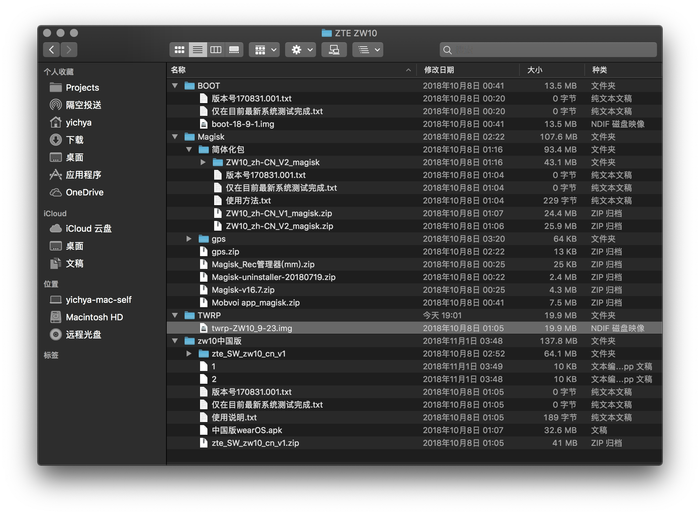

感觉上次花很多时间折腾这种东西大概得数到 16 年 DIY NAS 那会儿。当时做的 NAS 倒是仍然在正常服役，虽然说从主板到硬盘到无线网卡都已经换了个遍，只剩下 SSD 还是两年多前买的那一块了。

无聊刷 Telegram 的时候看到了这个 ZW10，因为十分便宜只要二百多块，而且配置还挺不错：

* Snapdragon 2100。平台是带基带的，不过手表里面只有一个固化的 T-Mobile eSIM，国内用不了，出国可以用
* 768MB RAM
* 4GB Flash
* 400x400 圆形 OLED 屏幕
* 500mAh 电池，同类产品中算是比较大的
* Android Wear 2.0，基于 Android 7.1.1，官方承诺会升到 8.0 不过目前还没动静
* 基础防水（好像是 IP67）

也没细看教程就买了，反正二百多买个新鲜。

到手之后觉得问题主要是个头太大，很厚很重，像我这种连华为手环那么轻的都懒得戴的，大概只能揣兜里。

然后经历了随便瞎装 App -> 解锁 Bootloader + Root + 魔改出门问问 -> 拆机换 SIM 卡等一系列操作。目前装了一张联通卡，虽然也不指望拿来打电话什么的，不过反正图个新鲜图个乐呵，就不用那么认真了。

以下解锁 + Root + 魔改出门问问参考 [https://learningman.top/archives/997.html](https://learningman.top/archives/997.html)；硬改 SIM 卡参考酷安「看这里哟哟哟」大佬的动态。

所有资源可以在 [https://storage.learningman.top/Blog/ZTE%20ZW10/](https://storage.learningman.top/Blog/ZTE%20ZW10/) 这里下载。



# Unlock Bootloader

解锁 Bootloader 会导致 Data 分区被清空。如果手表存储上有重要文件的话，务必先备份。

关机。一直按住电源键开机，直到看到 Fastboot 的一个选择页面


此时把手表放上底座，然后 `fastboot oem unlock`。手表上会显示一个提示，按上面的说明确认即可。

解锁后手表会自动重启，然后进入原厂 Recovery 开始清空 Data。原厂 Recovery 有个挺漂亮的圈圈，不过无所谓，反正很快就要被干掉了。

# Flash Boot and Recovery

完事后关机进 Fastboot 刷 Boot 和 Recovery 进行解锁。很简单，就是两个命令的事儿。

```
fastboot flash boot boot-18-9-1.img
fastboot flash recovery twrp-ZW10_9-23.img
```

刷完重启，还是按住电源键，进 Fastboot，然后按两下选 Recovery Mode。按住电源键进 Recovery。


然后刷 Magisk 包进行 Root。点一下 Install，然后点一下 ADB Sideload，然后就可以 ADB 大法了。

```
adb sideload Magisk-v16.7.zip
adb sideload ZW10_zh-CN_V2_magisk.zip
adb sideload Mobvoi+app_magisk.zip
```

刷完重启，Root、简体中文和魔改出门问问就都完成了。出门问问的商店里面有支付宝和网易云音乐什么的，很方便。各取所需。

