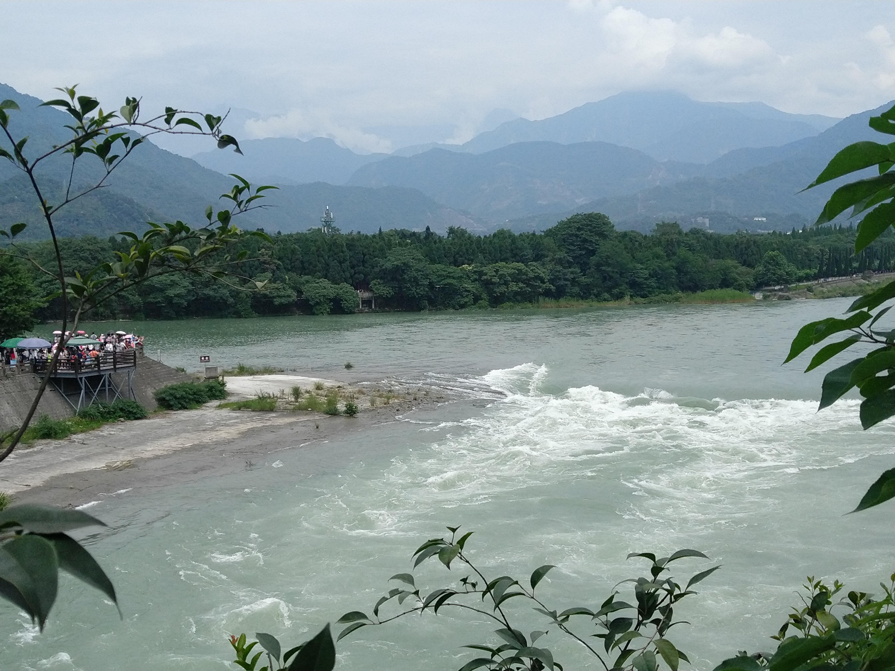

想来上次写总结已经是一年半之前的事情了。说来原因也很简单，从 17 年的暑假开始彻底成为一只大社畜，实在是不再有能像之前那样很长的一段时间专注于某一件自己的事情。工作之外很难有自己觉得像样的产出，自然也就没什么动力去写总结了。17 年下半年的总结如果硬要写的话，除去工作上的事情以及学校的各种破事儿，大概只有买了 4K 显示器和 NUC，去了趟峨眉山，通关了神舞幻想这个辣鸡游戏。

其实从去年开始实习，就一直在思考如何在工作之余通过兴趣提升自己。然而想了一整年，终究由于各种各样的因素没有找到什么进展，后来索性看开了，人活这么大，终极追求无非是「从心所欲而不逾矩」，这么想的话，当一个佛系青年大概也还不错。可惜没有找到新的有兴趣探索的领域，自己感觉亦是并没有什么看得见的提升，还是会觉得有些遗憾吧。

日常工作说起来也毕竟不会那么顺心。草民自认为是个相当激进的程序员，或许是中二期还没过吧，总觉得任何事情都应该有足够「优雅」的方式描述。然而现实就总是很残酷，SGI Sun 等一大堆已成过去式的商业公司一再证明，技术总是不得不向商业低头，而草民身处商业公司的商业化部门，自然更是每天都在面对技术与商业之间无法调和的矛盾。当所有人都要以极快的速度修改已经乱到彻底无法维护的代码，结果就是代码变得更加无法维护，每天都在各种查 bug 修 bug 和被 pm 催着做需求，真的感觉是 dead man walking。好在 boss 们乐意让草民少写一些业务，多去操心系统设计与架构上的事情，草民才终究没有窒息于此。能做更符合兴趣的事情，草民也是已经很感激各位 boss 抬举了。

其他的事情或许没有变得更好，但至少也终究没有变得更糟。如预期那样转正、毕业；家庭情况并未好转，但也终于没再继续恶化；身体也还行，没啥大问题。

进入正题吧。

# School，SSSTA

去年的架构师考试仍然跪了，作文差五分，选择差四分。今年最终也没有再去，感觉一是自己实力确实不够，对专有名词完全不眼熟，不会 Java 不了解企业级那些构件平台之类的，作文亦是完全在瞎编；二是感觉这个考试考的东西也实在是过于传统，死死抱着那套 Java 企业级架构不放，完全是已经过时的东西了，也就作文每年蹭个热点，前年微服务去年 Serverless 的，要是我没猜错今年肯定是 Service Mesh。考虑来考虑去，终究感觉这玩意儿现在对我来说实在没啥意义。或许以后决定在哪座城市定居的时候，迁户口如果用得上再去考一个吧，反正裸考也就差不到十分的事儿。

上学期或许可以说组了整个大四战斗力最强的项目组，制定了足够周全的计划对付阿三，结局算是完美。代码就不放了，虽然不至于烂到想放弃署名权，但是实在也是乏善可陈，不丢人了。

找徐巍挂靠了毕业需要的所有手续，于是毕设终于可以做自己想做的东西，也就是去年十月份挖的那个图形化 menuconfig 的大坑。当然最后做是做出来了（[https://github.com/yichya/LEDEForge](https://github.com/yichya/LEDEForge)），只是最终感觉也没啥用处，提交完就再也没碰过。

6.25 晚上，或者说 6.26 凌晨终于拿到了毕业证。一手交钱一手交证，从此两不相欠。

6.26 晚上最后去了一次阳光天地。

阳光天地大概是除了 G302 之外，在西安最令我怀念的地方。

6.27 早上坐高铁离开了西安，再见就不知道是什么时候了。

回想起来最大的遗憾大概是大二的时候给 SSSTA 定的那种像联创冰岩之类的看齐的目标终于也没能达成，当然细想起来也不算没能达成吧，目前和为之算是有比较好的合作关系，SSSTA 因为各种原因吧，仍然不得不以名义上的官方组织存在，终究不是草民所能改变的了，不过想做事的话可以去为止找活。

最怀念的 G302（其实是去年年初的老图，不过其实这一年半来，除了多了几个屏之外也没啥变化）

回想自己的大学生活，SSSTA 真的是助益良多。大一上学期的时候 xp、博导、凯爷带草民入门 Python 和 UWP 开发，大一下、大二上确定自己的兴趣并为之不懈奋斗，大二下在学长们的带领下开始接活真正做事，到大三找到实习、成功转正，贵协对草民的影响几乎是决定性的。

「也许不经意间的一个决定，就改变了人生的轨迹」。

真的感觉自己非常幸运，选择了 SSSTA，也同时被 SSSTA 选择，能融入这样一个强者辈出的群体，最终成为其他人眼中的强者（自认为应该还是可以这样评价贵协和自己的）。

秋招已过。决定工作的学弟们基本都找到了理想的取向（有来字节跳动的，有去 keep 的，等）。今年选择读研或出国的大佬比例更高一些，大体也都比较顺利，当然我很相信他们的能力，毕竟贵协出来的个个都是大佬，这点我还是很确定的。

# Enjoy Life

大概从大三下学期开始吧，对出门转转这种事情再也不像之前那么抗拒了。17 年去了武汉和成都，18 年成都 + 重庆 + 内蒙古 + 杭州，活这么大还从来没浪得这么洒脱过。

6.16 毕设终于提交完之后两天的晚上，成都。

6.18 去了心心念念的东郊记忆，可惜错过了两天前的漫展。

6.19 青城山。超喜欢这个地方，甚至动了在山脚下买套房子养老的心思。

6.20 都江堰

6.21 重庆。所有人都在拍洪崖洞的时候，我在拍面前的大桥。三维立体的交通令人印象深刻，不过草民去的那几天实在是天气太差，给草民印象实在是不怎么好。

6.23 二厂文创公园，虽然前几天还看到微博还是哪里吹来着，但是个人感觉不如东郊记忆

可能是这辈子最后一次见到丫丫（还有图上另外两个大佬

7.28 内蒙古团建。随手一拍就是一张 Windows XP 墙纸，甚至不用修图。

晒了一整天，虽然个人对草原并不怎么感冒，不过也算难得一见的绮丽风光。就是后来晒伤了有点难受，而且来回大巴车太折磨人了。

9.29 请了两天假去了杭州。西湖感觉也就那么回事儿，不过其他的地方还算印象不错。道路命名很有意思，浣纱路，白泽里。忍不住回想起了西安，凤栖原，太白立交。比起什么和平路啊中山路啊体育大街这种起码强太多了（说的就是你石家庄

10.1 乌镇。人爆炸多，然而个人觉得就那么回事儿。

10.2 千岛湖。绝赞的绮丽风光，这才像个湖对不对。可惜只停留了一个白天，应该多呆一个晚上的。后悔没早早做计划了。

浪也不局限于旅游。十一月初网易云音乐的国风极乐夜也去凑了个热闹。

见到了不才、银临、肥皂菌、云之泣、绯村柯北、梓钰等等一大堆名字如雷贯耳的大佬。真的特别开心。

最后的少年中国几乎让草民热泪盈眶，没想到有朝一日古风歌也能突破小众圈子，响彻鸟巢。

还有些年初的团建，去九月学糖那次，等等。图太多也很麻烦就不全往上可劲儿堆了（

今年一年总的来说浪得足够开心，想去的地方基本都去了。明年的目标大概是再去看更多的大水塘，听更多的古风音乐会（

# Work & Skills

上半年实习期间做的还是创意工具，然后也进行了一些个人认为算是比较大的变动，比如说对象存储迁移这种。自认为也算有些成果。

中间有感于友商的一系列操作，感觉也要更有国际化意识这样，于是转正的时候申请去了国际化组。应该也还算有些成果。

感觉工作加实习一年多以来在接触的东西越来越多。甚至语言上也是如此，实习期间主要写 Node 和 Python，现在又在主要写 Go。在不同语言的特性之间来回碰壁，天天因为 Go 没有泛型，oop 半残而郁闷，回头看混乱不堪的 Python 更郁闷。

深深感觉到软件工程作为一门工程学科的重要性，感觉自己掌握的还是远远不够，还需相当多的积累。

最前面有关于技术和商业的对立关系的困惑。最近也时常在想有没有可能通过一种特殊的范式或者框架来使得对复杂业务的描述可以简单或者统一化，便于后续维护。然而这个问题显然不是草民现在的水平能够想明白的，只能寄希望于灵感了。

技能方面呢，这一年来技术上的精进基本都来自工作。经验说起来感觉是个很难量化的东西，但是感觉可以这么说，每周感觉跟之前比有一点点进步。

最大的进步应该是对 Node 和 Go 的掌握。这两门语言之前其实都不是草民首选的技术方案，尤其是 Go 之前基本上只写过两门课程的大作业，没有过任何实操经验。不过写多了学多了自然会更了解，目前感觉熟练度虽然仍不及 Python，但也达到足够工作需要的水准了。

前面提到在寻找不同的用以解决技术和商业对立问题的范式。开始尝试 Haskell，对这门语言感到非常、非常的不适应。目前进度很慢，仍需勤加练习。

依然在坚持每天更新 OpenWrt，并且开始维护自己的一些组件仓库（比如 [https://github.com/yichya/shadowsocks-openwrt](https://github.com/yichya/shadowsocks-openwrt) 等）。毕竟作为一个比较激进的码农，参与开源社区活动并做出贡献是非常重要的一环。希望能以自己最熟悉的 OpenWrt 开始，在开源社区找到适合自己的角色。

# Gaming

年初买了 GTX 1070 外接显卡给 NUC 用。其实之前自认为不算什么游戏玩家，因为也就玩玩仙剑，偶尔尝试一些 FPS 比如 Crysis 这样。后来受 SSSTA 游戏组学弟影响，开始更多的关注不同种类的游戏作品，也希望借此获得更多思考。

阴阳师我居然还在坚持玩 = = 签到 800 天了，SSR 依然没有集齐，新的 SSR 基本都没有，除了一个每日白送抽到的炼狱茨木童子。

七月份被叶神安利尝试了一下天涯明月刀。感觉一般般没啥意思，十月份去杭州回来就 afk 了再也没打开过，估计也再也不会打开了。。。

之前一直嘲讽的若有缘三（aka 古剑奇谭三，大概没有人看闲情所以不知道这个梗）发售了。游戏品质可以说意外的好，比起去年那个神舞幻想真的是强太多太多了。吹爆云无月小姐姐！！！

然后是古墓丽影暗影，水平依然很高，故事引人入胜。最近在补古墓丽影崛起（被地狱之刃打断了否则可能已经通关了）。

最后是这两天刚刚通关的地狱之刃·苏纽尔的献祭。其实一开始以为是个妹子救男朋友的故事，手残党艰难打通关还没太看懂结局。

后来看了 Hellblade 特色纪录片之后才明白这款游戏的核心是怎么样的，深受触动。

> 我在煎熬中学会了不要畏惧死亡，苏纽尔，因为没有失去的生活也是没有爱的生活。逃离死亡你只会看到它投下的阴影，你越是躲避它，阴影就越发壮大，直到你看到的只剩下黑暗。当大限来临我们必须直面死亡，像朋友一样拥抱它，只有这样我们才不会恐惧，摆脱我们的黑暗。

> 苏纽尔，一定不要忘记，孩童看待世界的眼光：每片秋叶都好比一件艺术品；每次云卷云舒，都仿佛流动的画卷；而每一天，都是一个崭新的故事。我们自己，也正是从这种不可思议的力量中诞生，就像汪洋中的浪花，最终会回到大海。不要为了浪花、秋叶、云朵的逝去而哀伤。因为即使在黑暗中，世界的神奇和美妙也从未远离，它只是静静地等待着，等着被再一次看见。

如果能够理解这款游戏不是去跟神讨价还价救男朋友，而是苏纽尔的自我救赎旅程的话，这款游戏的立意就提高了很大一个层次；而如果再提高一个角度，从游戏制作者希望传达的意图出发，则会看到其中独特、强烈、贯穿始终的对精神疾病患者的人文关怀。从前几年微软的 Build 大会，到这次地狱之刃，草民总是会被这样充满光辉的人文关怀打动。真的强烈推荐。

我其实很希望能看到更多类似地狱之刃，或者 Tsioque Gorogoa 这样的游戏。独立游戏比起 3A 大作来说更多在于对开发者自己意图的表达，而这种表达通过游戏的方式呈现，往往能给受众非常沉浸式的体验，玩家在体验游戏的过程中也更容易与开发者产生共鸣。

作为一个萌新玩家，我衷心期望有一天游戏能真的以「第九艺术」的身份被大众接受。

# Events

今年要说事情还真的挺多的，但感觉大多数都很药丸，尤其微软 Build 2018 第二天什么鬼，还有十月份那次 Windows 10 1809 疯狂翻车。。。

药丸的事情太多了，因此跳过这个环节。

# Devices

这一年半来买的东西确实还挺多的。。。

* **Intel Skull Canyon NUC** 骷髅峡谷。目前搭载 16Gx2 内存和 256Gx2 Intel 760p RAID 0。运行速度相当快，用起来非常愉悦，
* **Gigabyte Aorus GTX 1070 Gaming Box** 给 NUC 搭配的外接显卡盒子。大多数游戏可以 4K 30fps，搭配去年买的 Dell P2415Q 显示器，体验简直美轮美奂。
* **iPad 2018** 可能是目前为止拥有的体验最好的平板。没有买 Apple Pencil 因为已经有 Surface 了。
* **Surface Pro 4** 从室友手里收来的二手货，但是还是相当新。目前放在公司作为 Excel 专用设备。
* **Blackberry Passport** 情怀。由于内嵌的 Android Runtime 只是 4.3，而且使用很卡，目前半吃灰。
* **ZTE Zw10** 魔改了 SIM 卡，不出意外一样半吃灰。
* **Alcatel Idol 4S** 便宜的 Windows Phone。买来发现 WP 还是那个死样子。吃灰。
* **Dyson V10 Fluffy** 脑子一热在杭州银泰买的吸尘器，四千多块钱 = = 平均三周用一次，吸吸地板和床垫，效果相当不错。
* **Many VPSes** 买了一大堆 VPS，搬瓦工，nfphosting，腾讯云羊毛，virmach，cbvps 什么的。现在也都不知道拿来干啥，基本上除了梯子和内网穿透都不做什么别的。

还有些零碎的机械键盘、10TB 机械硬盘之类的，无关紧要不逐一列举了。

# Projects 

严格来说没有什么新东西，上面提到的两个之外还在维护自己定制的 LuCI openwrt.org 主题 [https://github.com/yichya/luci-theme-openwrt-custom](https://github.com/yichya/luci-theme-openwrt-custom)。

近期的计划是给 OpenWrt 写一个 Telegram 机器人，完成一些操作比如建立 SSH 隧道、重启、获得公网 IP 等操作。还想做一个个人用 lambda 平台，跟 Telegram 绑定，添加函数自动注册在 Telegram 上，可以很方便调用这样。

# Finally

最后想说的其实是 Mess 里面可能出现过的一些事情。

其实在帝都呆的越久越觉得这里终究不是草民的容身之地。难免会因此焦虑。毕竟再佛系，如果生存需求都难以满足，这佛也实在太难佛下去。

年初跟家里说了想选择一个二线城市定居，不想留在帝都也不想回石家庄。家里大概总是没把我说的当真，见面总是谈起在北京怎么怎么样在石家庄怎么怎么样。

前几天又跟老爸说了一次，我爸这次倒意外的好说话，甚至提出年后先去成都考察一段时间。或许这是我推进人生主线的可能？如果真的如此，那未来一年半时间都会被用来心无旁骛打主线。

新的一年许个愿？

希望主线能顺利推进吧。

希望能有更多的空闲时间，照顾自己的兴趣，也能够多到处走一走，看更多的大水塘。

还有就是，希望我上面提到的几个困惑，技术和商业对立，合适的范式这些，都能够得到顺利解决。

与看到这里的你共勉。
