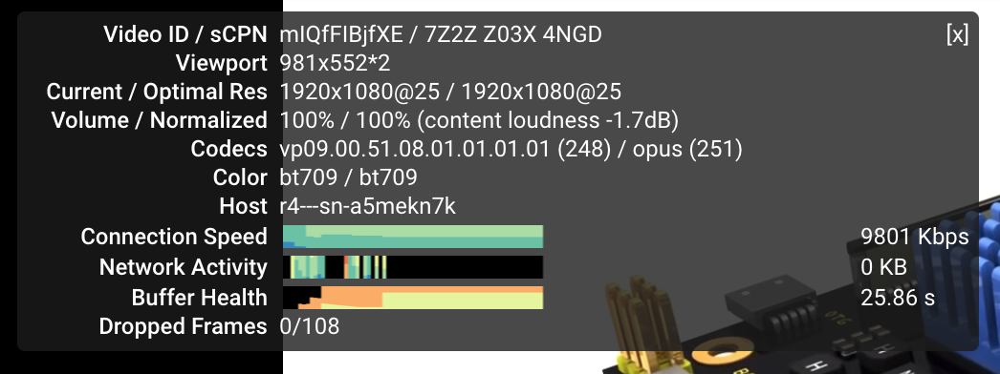
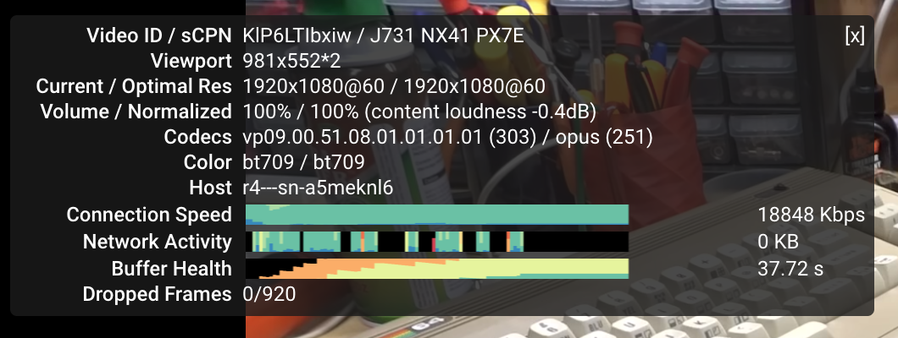
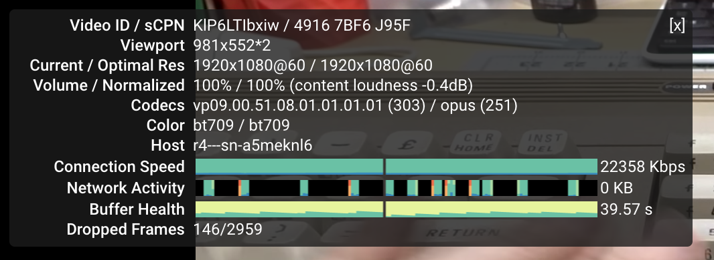
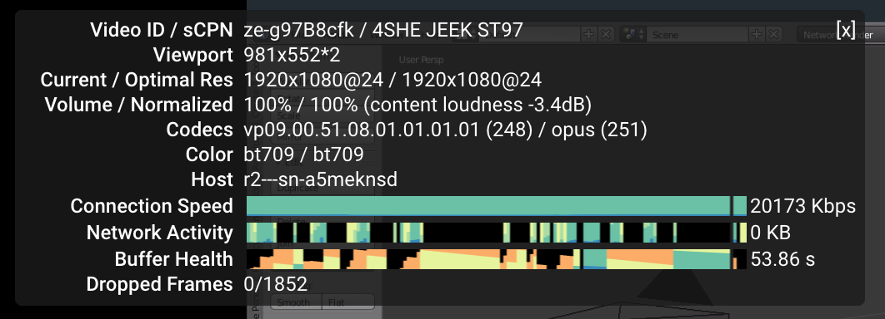
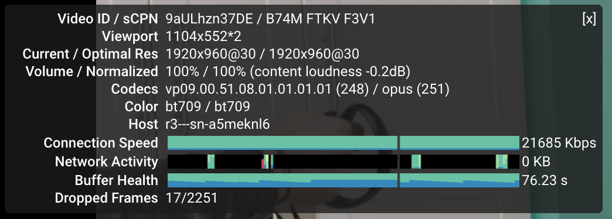
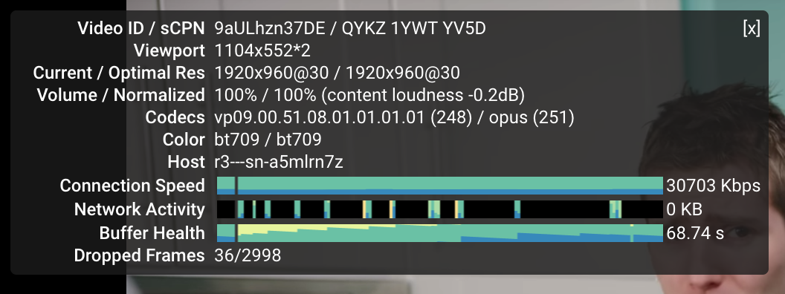

最近一个月左右吧，仍然在不断的改进自己架梯子的方案，目前感觉也有一些阶段性的东西可以稍微记录一下。不过由于一些懒得言明的原因，比起之前这个 category 下面相对更纯粹就是技术向的东西，这里大概会有稍微多一点的一些不吐不快的东西吧。

或许可能会是目前来看最容易导致草民被查水表的东西了。

标题叫「Broken Ladders」的原因其实也是感觉未来会越来越悲观。

# Overview

上个月由于拿搬瓦工那台 VPS 下 Steam 下北邮人 PT 之类，500GB 的流量在距离结算日还有两周的时候就用到只剩不到 100GB 了，一下就慌了。然后想起来还有另外一台有 ss + kcptun 的机器，虽然配置不高网络也不怎么好，不过还勉强可以苟一下。刚接上发现其实速度还挺快，看 YouTube 跟搬瓦工那台比完全不逊色，于是直接切过去用了。

用了几天，发现经常看着看着 YouTube 梯子就挂了，然后意识到大概是吃了 UDP QoS。上网搜解决方案，有调整 kcptun 参数的方案，也有在 UDP 包前面加 TCP 头伪装成 TCP 的黑魔法方案。尝试了一下第二种也就是 udp2raw-tunnel，效果确实不错，除了带宽降低到了之前的一半不到 = = 

后来看教程又对 kcptun、udp2raw 还有 ss 进行了一些调优，带宽回到了正常状态，于是这就是目前草民在使用的方案了。顺便对这台机器的配置进行了升级，原来 6 美元一年的配置升到了 8 美元一年，内存翻倍，拿来看 YouTube 1080p 反正基本没什么问题，也可以支持草民正常的 Google、GitHub 等操作，于是很愉快。

原来的搬瓦工也不再用来当主力梯子了，基本上只用来继续支持手机 4g 梯子 + 内网穿透 + IPv6 下北邮人 PT。因为 shadowsocks-android 和 shadowsocks-libev 不支持 UDP over TCP，UDP 转发也是通过 UDP 传输的，这样导致在 UDP 丢包率比较高的环境下 UDP 转发非常成问题，体现就是在手机上连 DNS 转发都不能用，非常令人恼火。索性彻底拆了这台机器上的 ss 服务端。然后转而决定尝试 v2ray。尝试 v2ray 的过程又遇到了客户端上的其他的一些问题，不过还好影响不大，后面细谈。

原来的 wr703n 因为最近 openwrt 的 ath79 target 突然能正常在草民的那台魔改过的 wr703n 上启动了，于是重新收拾了它一下，build 了一个目前认为足够稳定的版本，采取的是之前的使用方案。目前除了 usb 口没有供电之外一切正常，那玩意儿上的 usb 我也不用索性就不管它了。

新买的 virmach 因为是 Windows Server 2008 所以一直没什么用。v2ray 有 Windows 服务端而且似乎十分好用，在上面用 v2ray 服务端提供了 shadowsocks 和 mtproxy 两种协议，目前使用体验只能说凑合吧，用来应急之类的足够了，毕竟那台 virmach 的机器确实网络也不怎么好。

目前草民的 5 个 vps 中三个稳定用来提供不同用途的梯子，剩下两个，一个是腾讯云重庆机房只用来内网穿透，另一个由于 ip 不固定且配置也不高，用来跑 tg 机器人和备用的内网穿透。

下面来详细谈一谈最近在这些方案上踩的坑吧。

# UDP QoS & udp2raw-tunnel

目前 nas 上使用的主力方案是这样。至于为什么最近才切换到这个方案，草民来简单介绍一下。

## History

草民最早尝试 kcptun 还是去年的事儿。当时买的搬瓦工因为各种一系列经典操作（包括但不限于，在 8388 端口上跑 ss，加密方式还是特别随便选的一个，然后扔到贵协路由器上做透明代理）导致直接被 gfw 照顾了 ip。看 nfphosting 有便宜到一年 6 美元的玩具，于是随手买了一台玩儿。

俗话说一分钱一分货，这台比起上面搬瓦工那个实在是完全没眼看：

* 搬瓦工 CN2 直连，DC3 DC8 俩数据中心随便选（顺便草民目前看推荐 DC8，草民帝都联通，带宽几乎可以跑满，延迟也是最低的），这台并不知道走什么路由，实际看下来，ping 在 300-400ms，丢包率感人
* 虚拟化方案是 openvz，于是开 bbr 就基本不用想了。虽然有 rinetd-bbr 这种操作，但是效果只能说非常一般，而且 rinetd-bbr 本身并不稳定，跑一阵儿就自己无声无息的挂掉了，非得重启不可

去年刚来帝都住的还是自如合租那种，仨人抢一个 2.4G 的辣鸡 Wi-Fi，也不知道入户宽带是什么样的。NAS 连外网的方式还是用一个也很垃圾的无线网卡，总之种种因素叠加起来，结果就是看 YouTube 可能有个 2000kbit/s 就烧高香了。加上 rinetd-bbr 大概能翻个倍。GitHub Google 也顶多勉强能用，拉个 openwrt 仓库要么丢包要么慢的要死，令人绝望。

然后就尝试了 kcptun。刚用起来惊为天人，速度可以一下子冲到 10000kbit/s，然而经常出现用着用着就断了的情况。当时完全不知道是为什么，还以为是 kcptun 不稳定或者是 vps 提供商的网络问题。也没什么好办法，总之就搁置不管了。反正那段时间，在公司做事情会搞到贼晚，可能十二点多一点多才回去。回去基本也不干什么事儿，手机开了 b 站免流，如果网实在太差就干脆躺床上用流量看 b 站。说起来好像现在还没有当时努力了，那会儿虽然一点半可能才到家，然而第二天依然要么九点五十要么十点二十出门；现在十一点左右回家，然后早上十一点才出门。也不知道为什么，实在是没有精神，大概是感觉日子没盼头了也就提不起兴趣了？

后来大概二月还是三月份左右吧，搬瓦工可以换 ip 了。之前那台被照顾的机器终于又可以用了，于是长了个心眼，端口改成 443，加密改成 chacha20-ietf-poly1305，日常使用除了经常吃 rst（下面会说）之外基本不再有问题。用这种方式折腾到了大概四月底，然后搬到现在跟同事合租的屋子里面。中间回学校，没什么变动；毕业回来跟同事合租的房子，又过了一段时间把 Wi-Fi 连路由器的操作改为用 cat6 的网线，看 YouTube 的速度一下提升到了 20000kbit/s 以上，非常愉快。后面的一段时间基本上就是在优化 DNS 解析的流程，具体可以看上篇。

这样就一直到了十二月，突然发现搬瓦工流量即将不够的时候，然后就是开头说的了。

## UDP QoS 

kcptun 在正常情况下是非常理想的：

* 比默认情况下的 TCP 采取更加激进的拥塞控制策略，有效带宽高
* 使用前向纠错，延迟低
* 连接稳定性比起容易吃 gfw rst 的 TCP 来说更好

但是中间断流的问题非常让人难受。但是也不知道是为什么会断流，这就更让人难受。

后来大概是七月份，想在路由器上更好的集成 kcptun 因此想找一个 C / C++ 的实现。虽然没找到特别好的，但是却意外发现了下面这篇介绍 UDP QoS 的博客：

[https://blog.chionlab.moe/2017/04/06/kcptun-with-fake-tcp/](https://blog.chionlab.moe/2017/04/06/kcptun-with-fake-tcp/)

里面提到吃 UDP QoS 的现象：

> 在正常运行一段时间之后流量会中断，需要等待数分钟才能恢复，有时候除非更换端口，将一直保持 0 速度。

同时也提到了可能的绕过这一限制的解决方案，也就是上面说的「加了 TCP 头的 UDP 包」。

其实原理说来也简单：我们不想要 TCP 的拥塞控制，又不想要 UDP 的 QoS，QoS 是在链路上做的我们完全无法干涉，而拥塞控制这种事情，我们至少还能够在发送端和接收端进行干涉；那么我们的做法就是：用 raw socket 绕过操作系统的 TCP 协议栈，由 kcp 来处理拥塞控制；但是发出去的包看起来就是正常的 tcp 包，可以正常的像一个 tcp 包那样在链路上传递。

具体的实现上还有很多细节，草民并不曾从头搓一个这样的东西出来因此理解也就只能局限在上面的理论上了， 更深入的分析可以看上面的那个博客链接。

## udp2raw-tunnel

因为上面提到的原因，改用了 kcptun 之后又撞在了 UDP QoS 上，因此决定认真尝试一次 udp2raw。一段时间搜索后发现了这个：

[https://github.com/wangyu-/udp2raw-tunnel](https://github.com/wangyu-/udp2raw-tunnel)

因为上次更新还是十二月份，算是相对活跃，而且看文档比较详细，评价不错，另外也有比较好的 OpenWrt 支持（[https://github.com/sensec/luci-app-udp2raw](https://github.com/sensec/luci-app-udp2raw)，[https://github.com/sensec/openwrt-udp2raw](https://github.com/sensec/openwrt-udp2raw)），于是就果断决定用这个了。

这玩意儿的架设相当简单，文档也足够详细。服务端用默认参数启动，然后把 release 里面提供的二进制文件直接复制到 OpenWrt 路由器里面，简单测试了一下，除了发现带宽比起只使用 kcptun 降低了一半之外没发现什么问题，而且似乎真的不再吃 QoS 了。

## Better Integration with OpenWrt

于是决定正式搞一下。把上面 sensec 的两个仓库加入到 package/extra 里面，然后直接编译。编译的流程遇到了一个问题：因为我的 OpenWrt 选择的 C 库是 glibc，但是 udp2raw 却在 makefile 里面写死了 musl，这样编译的过程中完全不能链接就跪了（顺便他这个 makefile 写的啊，真的看着贼难受）。换用 musl 之后编译确实没问题了，但是运行又出新的问题，启动直接 segmentation fault，也不知道为啥。

看他那个 makefile 也实在是看的很难受，干脆把它改成 cmake 了。幸运的是原仓库里面有一个 cmake 的配置文件，但是版本很旧了。进行了一些修改，包括在配置中添加缺少的文件和链接库、删掉自带的 libev 源代码并改用动态链接以节省空间（因为原来有 shadowsocks-libev）并修改 my_ev.h my_ev.cpp 中的 include 路径，以及其他文件中的 include 修改之类。然后果然是可以正常编译正常启动了，但是非常奇怪的是启动的过程中出现了更加奇怪的问题。

程序启动的时候会注册两个 signal 的 handler：

```c
    ev_signal signal_watcher_sigterm;
    ev_signal_init(&signal_watcher_sigterm, sigterm_cb, SIGTERM);
    ev_signal_start(loop, &signal_watcher_sigterm);

    ev_signal signal_watcher_sigint;
    ev_signal_init(&signal_watcher_sigint, sigint_cb, SIGINT);
    ev_signal_start(loop, &signal_watcher_sigint);
```

但是注册的时候却非常奇怪，总是提示注册的信号值不合法：

```c
assert (("libev: ev_signal_start called with illegal signal number", w->signum > 0 && w->signum < EV_NSIG));
```

这个鬼问题折腾了我几天，后来到处翻代码的时候突然在 `my_ev_common.h` 里面看到这么几行：

```c
#define EV_STANDALONE 1
#define EV_COMMON  void *data; unsigned long long u64;
#define EV_COMPAT3 0
```

我们知道 libev 是一个异步 io 库，其中几乎所有的 api 调用都是回调风格，而回调的时候就需要携带对应信息以便正确完成处理。在 libuv 中这个信息使用 `void* data` 这个指针传递，libuv 基本上就是 libev 魔改因此这里应该是一致的。udp2raw-tunnel 不知道出于什么原因把这个东西给改了，加了一个 uint64 进来，而我们修改 cmake 文件使用系统自带的预先编译好的 libev，这样 abi 就出现了差异，结果就是参数不能正常传递，像上面注册信号的时候实际上读到的是这里莫名其妙加进去的一个 uint64 型变量，而这个值初始化的时候恰好落在 0 - 64 范围内的可能性还真的是非常非常低，因此每次启动都会有上面那个 assertion failure 也就不足为奇了。

解决问题的方法很简单，直接删掉这几行就行了。删掉之后重新编译，果然问题得到解决，udp2raw 工作完全正常。这里为什么要加这么一个 uint64 变量我想了很久也没想明白，给作者提了 issue（[https://github.com/wangyu-/udp2raw-tunnel/issues/240](https://github.com/wangyu-/udp2raw-tunnel/issues/240)）也全无回音。既然没有影响反正我就删掉了，不管了。

草民修改后的代码可以在下面取到：

[https://github.com/yichya/udp2raw-tunnel](https://github.com/yichya/udp2raw-tunnel)

如果要使用的话，还需要修改 [https://github.com/sensec/openwrt-udp2raw](https://github.com/sensec/openwrt-udp2raw) 的 Makefile，把里面的 git 仓库地址和 commit id 修改掉，添加 libev 依赖，并且还需要配置为使用 cmake：

```patch
diff --git a/Makefile b/Makefile
index fd8037c..287e24b 100644
--- a/Makefile
+++ b/Makefile
@@ -8,12 +8,12 @@
 include $(TOPDIR)/rules.mk

 PKG_NAME:=udp2raw-tunnel
-PKG_VERSION:=20180428.0
-PKG_RELEASE:=1
+PKG_VERSION:=20190113.6
+PKG_RELEASE:=5

 PKG_SOURCE_PROTO:=git
-PKG_SOURCE_URL:=https://github.com/wangyu-/udp2raw-tunnel.git
-PKG_SOURCE_VERSION:=2c2d897bc2140dbe77cea99f92942425632088e6
+PKG_SOURCE_URL:=https://github.com/yichya/udp2raw-tunnel.git
+PKG_SOURCE_VERSION:=489f3b50b15fdc3d498a58415329159c4f5c5cbb
 PKG_SOURCE_SUBDIR:=$(PKG_NAME)-$(PKG_VERSION)
 PKG_SOURCE:=$(PKG_NAME)-$(PKG_VERSION)-$(PKG_SOURCE_VERSION).tar.xz

@@ -26,30 +26,23 @@ PKG_BUILD_DIR:=$(BUILD_DIR)/$(PKG_NAME)-$(PKG_VERSION)
 PKG_BUILD_PARALLEL:=1

 include $(INCLUDE_DIR)/package.mk
+include $(INCLUDE_DIR)/cmake.mk

 define Package/udp2raw-tunnel
        SECTION:=net
        CATEGORY:=Network
        TITLE:=Tunnel which turns UDP Traffic into Encrypted FakeTCP/UDP/ICMP Traffic
        URL:=https://github.com/wangyu-/udp2raw-tunnel
+       DEPENDS:=+libstdcpp +libev
 endef

 define Package/udp2raw-tunnel/description
        udp2raw-tunnel is a tunnel which turns UDP Traffic into Encrypted FakeTCP/UDP/ICMP Traffic by using Raw Socket.
 endef

-MAKE_FLAGS += cross2
-
-define Build/Configure
-       $(call Build/Configure/Default)
-       $(SED) 's/cc_cross[[:space:]]*=.*/cc_cross=$(TARGET_CXX)/' \
-               -e 's/\\".*shell git rev-parse HEAD.*\\"/\\"$(PKG_SOURCE_VERSION)\\"/' \
-               $(PKG_BUILD_DIR)/makefile
-endef
-
 define Package/udp2raw-tunnel/install
        $(INSTALL_DIR) $(1)/usr/bin
-       $(INSTALL_BIN) $(PKG_BUILD_DIR)/udp2raw_cross $(1)/usr/bin/udp2raw
+       $(INSTALL_BIN) $(PKG_BUILD_DIR)/udp2raw_cmake $(1)/usr/bin/udp2raw
 endef

 $(eval $(call BuildPackage,udp2raw-tunnel))
```

目前我不确定这样修改为使用 cmake 后还能不能正常跨平台进行交叉编译，没有条件测。从我对 ngrokc 进行修改的经验来看，应该是不会影响交叉编译的。

## Performance optimization

起初在没有使用 udp2raw 的时候，直接用 kcptun 连接看 YouTube 大概有 20000kbit/s 左右。后来加了 udp2raw 速度降到不到 10000kbit/s。虽然仍然能满足看 YouTube 的需求，但是总还是觉得浪费了很多带宽。于是着手考虑性能上的优化。



需要注意的是，一般来讲低延迟和高吞吐量是很难兼得的。草民的需求偏向于高吞吐量，主要用于看 YouTube 这样大流量的应用，对于延迟的要求并不高，因此下面的优化着重于增加总吞吐量。对于游戏党，下面的拥塞控制策略可能并不适用，请自行尝试。

先说明默认情况下的配置，上图 YouTube 就是在这个配置下测出来的。

* udp2raw-tunnel: `-s -l 0.0.0.0:53 -r 127.0.0.1:4000 -k "super secret password" --raw-mode faketcp -a`
* kcptun: `-r 127.0.0.1:4000 -l :443 --key "super secret password" --mtu 1300`
* shadowsocks-libev: 
    ```json
    {
        "server": "127.0.0.1",
        "server_port": 443,
        "local_address": "0.0.0.0",
        "local_port": 1234,
        "password": "super secret password",
        "timeout": 60,
        "method": "aes-256-gcm",
        "fast_open": false
    }
    ```

### Increase SockBuf

因为加 udp2raw 导致了速度减慢，所以还是先从 udp2raw 入手。看了 udp2raw-tunnel 的一些 issue（比如 [https://github.com/wangyu-/udp2raw-tunnel/issues/85](https://github.com/wangyu-/udp2raw-tunnel/issues/85)），先尝试增大 SockBuf：

```
--sock-buf 4096 --force-sock-buf
```

测试一下，发现带宽直接翻倍了：



在我的使用环境下设置为 4096 以上的值不再有明显效果，后面直接改成了 10240，基本上没感觉到有什么变化。

### CPU Usage

udp2raw 从设计上来说只是一个隧道，因此其实感觉上它不应该会对性能有很大影响，但是考虑到 shadowsocks-libev、kcptun 和 udp2raw 都可以对自己的封包进行加密，实际使用的时候，数据量一大，CPU 就很可能成为瓶颈。

随便跑了一个 speedtest，然后在服务端（VPS）和客户端（NAS）看性能：

（VPS）

```
  PID USER      PR  NI    VIRT    RES    SHR S %CPU %MEM     TIME+ COMMAND
13327 root      20   0    3900   1172    652 R 18.3  0.2   0:08.00 udp2raw
13326 root      20   0  110440  24832   3364 S 11.0  4.7   0:06.62 server_linux_am
12924 nobody    20   0   25500   3920   1220 S  4.3  0.7   0:01.95 ss-server
```

（NAS）

```
  PID  PPID USER     STAT   VSZ %VSZ %CPU COMMAND
 9556     1 root     S    81712  34%  15% /usr/bin/udp2raw
10901     1 root     S     105m  45%  12% /usr/bin/ss-kcptun 
10976     1 root     R     6304   3%   4% /usr/bin/ss-redir 
```

因为我们的封包最外层是 udp2raw，所以虽然看 udp2raw 的加密是最耗费资源的（看他那个代码，是不是用了硬件加速实际很难说），但是我们还是尽量不改变它的加密，以避免这一层变得不可靠。

默认情况下的配置是，udp2raw 使用默认的 aes128cbc，kcptun 使用默认的 aes，ss 使用 aes-256-gcm。因为考虑到两边都是 x86 平台，使用 aes 加密应该可以使用 cpu 的硬件加速，从而安全速度两开花。但是后来发现这样做 CPU 使用率非常高。

第一步尝试是把 kcptun 的加密都改成 xor，ss 的不变，然后看性能是否有提升。

（VPS）

```
  PID USER      PR  NI    VIRT    RES    SHR S %CPU %MEM     TIME+ COMMAND
13327 root      20   0    3900   1172    652 S 19.6  0.2   0:23.50 udp2raw
13656 root      20   0  110440  18388   3316 S  8.6  3.5   0:05.92 server_linux_am
12924 nobody    20   0   25500   3920   1220 S  2.7  0.7   0:04.34 ss-server
```

（NAS）

```
  PID  PPID USER     STAT   VSZ %VSZ %CPU COMMAND
 9556     1 root     S    81712  34%  18% /usr/bin/udp2raw
13476     1 root     S     105m  45%   9% /usr/bin/ss-kcptun 
13555     1 root     S     5904   2%   5% /usr/bin/ss-redir 
```

看起来 kcptun 的 cpu 占用从 12% 降低到了 9% 左右。再实测一下 YouTube，带宽也稍有提升：



目前已经跟之前的水平十分接近了，但是还有可以优化的地方。

上面说过使用 aes 应该可以借助 cpu 的硬件加速功能得到最佳使用体验，但是首先需要硬件支持 aes。我其实一开始觉得这应该不是什么问题的，但是还是确认了一下，结果发现好像不太对劲。

VPS 上的没有问题。

```
# cat /proc/cpuinfo
processor	: 0
vendor_id	: GenuineIntel
cpu family	: 6
model		: 45
model name	: Intel(R) Xeon(R) CPU E5-2620 0 @ 2.00GHz
stepping	: 7
microcode	: 1808
cpu MHz		: 1000.004
cache size	: 15360 KB
physical id	: 0
siblings	: 12
core id		: 0
cpu cores	: 6
apicid		: 0
initial apicid	: 0
fpu		: yes
fpu_exception	: yes
cpuid level	: 13
wp		: yes
flags		: fpu vme de pse tsc msr pae mce cx8 apic sep mtrr pge mca cmov pat pse36 clflush dts acpi mmx fxsr sse sse2 ss ht tm pbe syscall nx pdpe1gb rdtscp lm constant_tsc arch_perfmon pebs bts rep_good xtopology nonstop_tsc aperfmperf pni pclmulqdq dtes64 monitor ds_cpl vmx smx est tm2 ssse3 cx16 xtpr pdcm pcid dca sse4_1 sse4_2 x2apic popcnt tsc_deadline_timer aes xsave avx lahf_lm ida arat epb pln pts dtherm tpr_shadow vnmi flexpriority ept vpid xsaveopt
bogomips	: 4000.01
clflush size	: 64
cache_alignment	: 64
address sizes	: 46 bits physical, 48 bits virtual
power management:
```

但是 NAS 好像就不太对了。

```
# cat /proc/cpuinfo
processor	: 1
vendor_id	: GenuineIntel
cpu family	: 6
model		: 61
model name	: Intel Core Processor (Broadwell, no TSX, IBRS)
stepping	: 2
microcode	: 0x1
cpu MHz		: 1696.074
cache size	: 16384 KB
physical id	: 1
siblings	: 1
core id		: 0
cpu cores	: 1
apicid		: 1
initial apicid	: 1
fpu		: yes
fpu_exception	: yes
cpuid level	: 13
wp		: yes
flags		: fpu vme de pse tsc msr pae mce cx8 apic sep mtrr pge mca cmov pat pse36 clflush mmx fxsr sse sse2 ss syscall nx pdpe1gb rdtscp lm constant_tsc rep_good nopl xtopology cpuid tsc_known_freq pni pclmulqdq vmx ssse3 cx16 pcid sse4_1 sse4_2 x2apic movbe popcnt tsc_deadline_timer xsave rdrand hypervisor lahf_lm abm 3dnowprefetch cpuid_fault invpcid_single pti ssbd ibrs ibpb tpr_shadow vnmi flexpriority ept vpid ept_ad fsgsbase tsc_adjust erms invpcid rdseed xsaveopt arat
bugs		: cpu_meltdown spectre_v1 spectre_v2 spec_store_bypass l1tf
bogomips	: 3392.14
clflush size	: 64
cache_alignment	: 64
address sizes	: 40 bits physical, 48 bits virtual
power management:
```

起初还以为是虚拟化导致的问题，仔细一看真没有：

```
> cat /proc/cpuinfo
processor	: 0
vendor_id	: GenuineIntel
cpu family	: 6
model		: 61
model name	: Intel(R) Celeron(R) CPU 3215U @ 1.70GHz
stepping	: 4
microcode	: 0x2b
cpu MHz		: 798.223
cache size	: 2048 KB
physical id	: 0
siblings	: 2
core id		: 0
cpu cores	: 2
apicid		: 0
initial apicid	: 0
fpu		: yes
fpu_exception	: yes
cpuid level	: 20
wp		: yes
flags		: fpu vme de pse tsc msr pae mce cx8 apic sep mtrr pge mca cmov pat pse36 clflush dts acpi mmx fxsr sse sse2 ss ht tm pbe syscall nx pdpe1gb rdtscp lm constant_tsc arch_perfmon pebs bts rep_good nopl xtopology nonstop_tsc cpuid aperfmperf pni pclmulqdq dtes64 monitor ds_cpl vmx est tm2 ssse3 sdbg cx16 xtpr pdcm pcid sse4_1 sse4_2 x2apic movbe popcnt tsc_deadline_timer xsave rdrand lahf_lm abm 3dnowprefetch cpuid_fault epb invpcid_single pti ssbd ibrs ibpb stibp tpr_shadow vnmi flexpriority ept vpid fsgsbase tsc_adjust erms invpcid rdseed intel_pt xsaveopt dtherm ida arat pln pts flush_l1d
bugs		: cpu_meltdown spectre_v1 spectre_v2 spec_store_bypass l1tf
bogomips	: 3392.36
clflush size	: 64
cache_alignment	: 64
address sizes	: 39 bits physical, 48 bits virtual
power management:
```

贼尴尬。udp2raw 加密没法改，那就把 ss 的改成 chacha20-ietf-poly1305 吧。

（VPS）

```
  PID USER      PR  NI    VIRT    RES    SHR S %CPU %MEM     TIME+ COMMAND
13327 root      20   0    3900   1172    652 R 20.0  0.2   0:38.48 udp2raw
13656 root      20   0  110440  18564   3336 S  8.7  3.5   0:15.99 server_linux_am
14030 nobody    20   0   25104   3548   1228 S  6.0  0.7   0:02.33 ss-server
```

（NAS）

```
  PID  PPID USER     STAT   VSZ %VSZ %CPU COMMAND
 9556     1 root     S    81712  34%  17% /usr/bin/udp2raw 
15290     1 root     S     105m  45%   9% /usr/bin/ss-kcptun 
15365     1 root     S     5892   2%   2% /usr/bin/ss-redir 
```

ss 的 cpu 占用率本来就不高，这样调整完之后客户端低了一点，服务端高了一点，也是预期中的。但其实这个值基本上就是误差了 = = 打开 YouTube，更加尴尬的是速度反而低了：



再改回 aes-256-gcm：



个人倾向于认为这里改变 ss 的加密算法实际上没有什么意义了，因为本来 ss 的 cpu 占用率就并不高，那么 CPU 的部分基本上也就压榨到这里。如果说还有什么可以提升的地方，个人觉得 udp2raw 的 aes-128-cbc 占用了比 ss 的 aes-256-gcm 高很多的 cpu，如果这些多占用的 cpu 资源真的全都被 udp2raw 用来加密的话那他的加密实现肯定是有问题的，这里应该是一个很好的优化点，后续直接改为使用 libsodium 应该是最好的。

### More Aggressive Congestion Control

默认情况下 kcptun 的拥塞控制还是不够激进，这里我们也可以尝试进行一些调整。看了 kcptun 里面关于调整参数的一些 issue（比如 [https://github.com/xtaci/kcptun/issues/251](https://github.com/xtaci/kcptun/issues/251) [https://github.com/xtaci/kcptun/issues/137](https://github.com/xtaci/kcptun/issues/137)）。

有样学样，照着一顿改。先随便改了一发 kcptun 的参数：

```
--mtu 1300 --crypt xor --mode fast2 --dscp 46 --ds 70 --ps 30 --sndwnd 4096 --rcvwnd 4096 --nocomp
```

顺便直接把 udp2raw 的 SockBuf 增大到最大了，省事儿。

```
--sock-buf 10240 --force-sock-buf
```

还是 YouTube：



这里的示例更多的只是想说明，默认情况下的参数并不一定是推荐参数，对这些参数稍作修改就可以达到带宽增加近 50% 的效果，而且这里只是随便填写了一组参数进去，如果针对自己特定的网络环境再仔细调整，效果可能还会更好。当然了，调整这些参数说白了是个体力活，而且每次调整完参数，重启 kcptun udp2raw 什么的，重新完成握手都要花将近一分钟的时间，想得到最佳效果需要颇花些工夫。草民因为目前感觉已经差不多稳了，所以就没有再进行进一步的仔细调整。至于详细的调整方案，可以看上面的 issue 里面的介绍，会有更详细的根据 snmp dump 中的数据以及 udp 丢包率等进行计算的方法。

## Still a Weird Problem There

之前用搬瓦工那台机器上面架的 ss 天天吃 rst，非常难受。

```
Sun Jan 27 02:58:44 2019 daemon.err /usr/bin/ss-redir[3203]: server recv: Connection reset by peer
Sun Jan 27 02:58:44 2019 daemon.err /usr/bin/ss-redir[3203]: server recv: Connection reset by peer
Sun Jan 27 02:58:50 2019 daemon.err /usr/bin/ss-redir[3203]: server recv: Connection reset by peer
Sun Jan 27 02:58:50 2019 daemon.err /usr/bin/ss-redir[3203]: server recv: Connection reset by peer
Sun Jan 27 02:58:50 2019 daemon.err /usr/bin/ss-redir[3203]: server recv: Connection reset by peer
Sun Jan 27 02:58:50 2019 daemon.err /usr/bin/ss-redir[3203]: server recv: Connection reset by peer
Sun Jan 27 02:58:50 2019 daemon.err /usr/bin/ss-redir[3203]: server recv: Connection reset by peer
Sun Jan 27 02:58:52 2019 daemon.err /usr/bin/ss-redir[3203]: server recv: Connection reset by peer
Sun Jan 27 02:59:19 2019 daemon.err /usr/bin/ss-redir[3203]: server recv: Connection reset by peer
```

当时的想法是因为我用的是 443 端口嘛，gfw 实际上会对这几个端口做明文的关键词检测阻断，然后如果检测到了就 mitm 给双端发 rst。然后我就在想可能是因为加密后的数据里面恰好就有关键词，然后就吃 rst 了。

结果改用 kcptun 之后还是天天吃 rst。。。

昨天晚上看到了这个 issue，提到问题可能是因为 TCP Fast Open：

[https://github.com/shadowsocks/shadowsocks-libev/issues/1552](https://github.com/shadowsocks/shadowsocks-libev/issues/1552)

看这个说明关掉了 TCP Fast Open 似乎并没什么改善。

后来仔细一想，草民的 nfp 主机是 openvz 方案，openvz 模拟的内核是 2.6.3x，而 TCP Fast Open 是在 3.7 内核才引入的特性，那应该根本打不开 TCP Fast Open 才对：

```
# sysctl net.ipv4.tcp_fastopen
sysctl: cannot stat /proc/sys/net/ipv4/tcp_fastopen: No such file or directory
```

而且实际上我的传输是通过 udp2raw + kcptun 进行的，gfw 并不太可能在这个过程中伪造一个 rst 包，处理成 udp2raw + kcptun 封包然后发送到两端，因此 ss 看到的 connection reset 基本不可能是 gfw 导致的。

所以这个问题还是很奇怪。目前只能怀疑 shadowsocks-libev 在哪里的实现可能有问题了。于是又搜索了一下 shadowsocks-libev 的 issues： [https://github.com/shadowsocks/shadowsocks-libev/issues/1038](https://github.com/shadowsocks/shadowsocks-libev/issues/1038)

> BTW, `server recv: Connection reset by peer` means the client connected to your ss-redir closes the connection actively.

也就是说这个报错是从客户端到 ss-redir 的连接被客户端主动断开，而不是 ss-redir 到 ss-server 之间的连接断开。如果这样的话，那似乎更可能是因为 ss 转发的时候可能在数据上出现了错误，导致客户端需要主动断开。这个暂时还不是很确定，因此未再做尝试，后面可能会再仔细研究。

# V2Ray

## MTProxy

## Client Problem

# Finally

