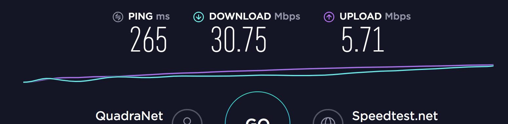
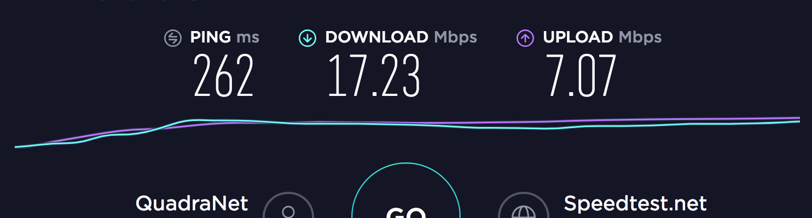
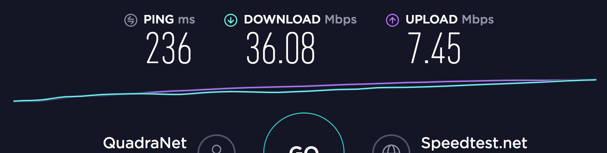
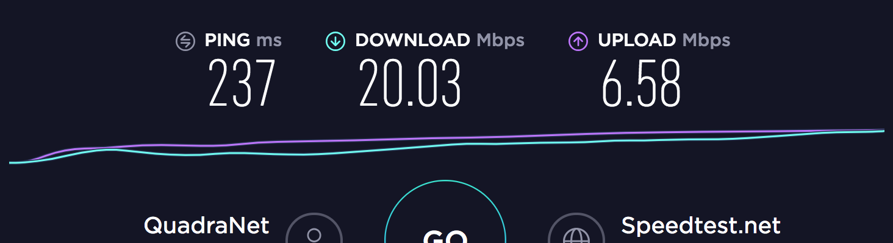
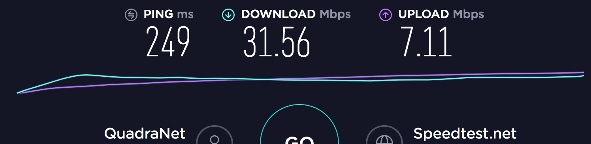

最近一个月左右吧，仍然在不断的改进自己架梯子的方案，目前感觉也有一些阶段性的东西可以稍微记录一下。不过由于一些懒得言明的原因，比起之前这个 category 下面相对更纯粹就是技术向的东西，这里大概会有稍微多一点的一些不吐不快的东西吧。

或许可能会是目前来看最容易导致草民被查水表的东西了。

标题叫「Broken Ladders」的原因其实也是感觉未来会越来越悲观。

# UDP QoS & udp2raw-tunnel

目前 nas 上使用的主力方案是这样。至于为什么最近才切换到这个方案，草民来简单介绍一下。

## History

草民最早尝试 kcptun 还是去年的事儿。当时买的搬瓦工因为各种一系列经典操作（包括但不限于，在 8388 端口上跑 ss，加密方式还是特别随便选的一个，然后扔到贵协路由器上做透明代理）导致直接被 gfw 照顾了 ip。看 nfphosting 有便宜到一年 6 美元的玩具，于是随手买了一台玩儿。

俗话说一分钱一分货，这台比起上面搬瓦工那个实在是完全没眼看：

* 搬瓦工 CN2 直连，DC3 DC8 俩数据中心随便选（顺便草民目前看推荐 DC8，草民帝都联通，带宽几乎可以跑满，延迟也是最低的），这台并不知道走什么路由，实际看下来，ping 在 300-400ms，丢包率感人
* 虚拟化方案是 openvz，于是开 bbr 就基本不用想了。虽然有 rinetd-bbr 这种操作，但是效果只能说非常一般，而且 rinetd-bbr 本身并不稳定，跑一阵儿就自己无声无息的挂掉了，非得重启不可

去年刚来帝都住的还是自如合租那种，仨人抢一个 2.4G 的辣鸡 Wi-Fi，也不知道入户宽带是什么样的。NAS 连外网的方式还是用一个也很垃圾的无线网卡，总之种种因素叠加起来，结果就是看 YouTube 可能有个 2000kbit/s 就烧高香了。加上 rinetd-bbr 大概能翻个倍。GitHub Google 也顶多勉强能用，拉个 openwrt 仓库要么丢包要么慢的要死，令人绝望。

然后就尝试了 kcptun。刚用起来惊为天人，速度可以一下子冲到 10000kbit/s，然而经常出现用着用着就断了的情况。当时完全不知道是为什么，还以为是 kcptun 不稳定或者是 vps 提供商的网络问题。也没什么好办法，总之就搁置不管了。反正那段时间，在公司做事情会搞到贼晚，可能十二点多一点多才回去。回去基本也不干什么事儿，手机开了 b 站免流，如果网实在太差就干脆躺床上用流量看 b 站。说起来好像现在还没有当时努力了，那会儿虽然一点半可能才到家，然而第二天依然要么九点五十要么十点二十出门；现在十一点左右回家，然后早上十一点才出门。也不知道为什么，实在是没有精神，大概是感觉日子没盼头了也就提不起兴趣了？

后来大概二月还是三月份左右吧，搬瓦工可以换 ip 了。之前那台被照顾的机器终于又可以用了，于是长了个心眼，端口改成 443，加密改成 chacha20-ietf-poly1305，日常使用除了经常吃 rst（下面会说）之外基本不再有问题。用这种方式折腾到了大概四月底，然后搬到现在跟同事合租的屋子里面。中间回学校，没什么变动；毕业回来跟同事合租的房子，又过了一段时间把 Wi-Fi 连路由器的操作改为用 cat6 的网线，看 YouTube 的速度一下提升到了 20000kbit/s 以上，非常愉快。后面的一段时间基本上就是在优化 DNS 解析的流程，具体可以看上篇。

这样就一直到了十二月，由于拿搬瓦工那台 VPS 下 Steam 下北邮人 PT 之类，500GB 的流量在距离结算日还有两周的时候就用到只剩不到 100GB 了，一下就慌了。然后想起来还有另外一台有 ss + kcptun 的机器，虽然配置不高网络也不怎么好，不过还勉强可以苟一下。刚接上发现其实速度还挺快，看 YouTube 跟搬瓦工那台比完全不逊色，于是直接切过去用了。

用了几天，发现经常看着看着 YouTube 梯子就挂了，然后意识到大概是吃了 UDP QoS。上网搜解决方案，有调整 kcptun 参数的方案，也有在 UDP 包前面加 TCP 头伪装成 TCP 的黑魔法方案。尝试了一下第二种也就是 udp2raw-tunnel，效果确实不错。

## UDP QoS 

kcptun 在正常情况下是非常理想的：

* 比默认情况下的 TCP 采取更加激进的拥塞控制策略，有效带宽高
* 使用前向纠错，延迟低
* 连接稳定性比起容易吃 gfw rst 的 TCP 来说更好（当然后面发现这应该是我的误解，具体后面谈）

但是中间断流的问题非常让人难受。而且也不知道是为什么会断流，这就更让人难受。

后来大概是七月份，想在路由器上更好的集成 kcptun 因此想找一个 C / C++ 的实现。虽然没找到特别好的，但是却意外发现了下面这篇介绍 UDP QoS 的博客：

[https://blog.chionlab.moe/2017/04/06/kcptun-with-fake-tcp/](https://blog.chionlab.moe/2017/04/06/kcptun-with-fake-tcp/)

里面提到吃 UDP QoS 的现象：

> 在正常运行一段时间之后流量会中断，需要等待数分钟才能恢复，有时候除非更换端口，将一直保持 0 速度。

同时也提到了可能的绕过这一限制的解决方案，也就是上面说的「加了 TCP 头的 UDP 包」。

其实原理说来也简单：我们不想要 TCP 的拥塞控制，又不想要 UDP 的 QoS，QoS 是在链路上做的我们完全无法干涉，而拥塞控制这种事情，我们至少还能够在发送端和接收端进行干涉；那么我们的做法就是：用 raw socket 绕过操作系统的 TCP 协议栈，由 kcp 来处理拥塞控制；但是发出去的包看起来就是正常的 tcp 包，可以正常的像一个 tcp 包那样在链路上传递。

具体的实现上还有很多细节，草民并不曾从头搓一个这样的东西出来因此理解也就只能局限在上面的理论上了， 更深入的分析可以看上面的那个博客链接。

## udp2raw-tunnel

因为上面提到的原因，改用了 kcptun 之后又撞在了 UDP QoS 上，因此决定认真尝试一次 udp2raw。一段时间搜索后发现了这个：

[https://github.com/wangyu-/udp2raw-tunnel](https://github.com/wangyu-/udp2raw-tunnel)

因为上次更新还是十二月份，算是相对活跃，而且看文档比较详细，评价不错，另外也有比较好的 OpenWrt 支持（[https://github.com/sensec/luci-app-udp2raw](https://github.com/sensec/luci-app-udp2raw)，[https://github.com/sensec/openwrt-udp2raw](https://github.com/sensec/openwrt-udp2raw)），于是就果断决定用这个了。

这玩意儿的架设相当简单，文档也足够详细。服务端用默认参数启动，然后把 release 里面提供的二进制文件直接复制到 OpenWrt 路由器里面，简单测试了一下，除了发现带宽比起只使用 kcptun 降低了一半之外没发现什么问题，而且似乎真的不再吃 QoS 了。

## Better Integration with OpenWrt

于是决定正式搞一下。把上面 sensec 的两个仓库加入到 package/extra 里面，然后直接编译。编译的流程遇到了一个问题：因为我的 OpenWrt 选择的 C 库是 glibc，但是 udp2raw 却在 makefile 里面写死了 musl，这样编译的过程中完全不能链接就跪了（顺便他这个 makefile 写的啊，真的看着贼难受）。换用 musl 之后编译确实没问题了，但是运行又出新的问题，启动直接 segmentation fault，也不知道为啥。

看他那个 makefile 也实在是看的很难受，干脆把它改成 cmake 了。幸运的是原仓库里面有一个 cmake 的配置文件，但是版本很旧了。进行了一些修改，包括在配置中添加缺少的文件和链接库、删掉自带的 libev 源代码并改用动态链接以节省空间（因为原来有 shadowsocks-libev）并修改 my_ev.h my_ev.cpp 中的 include 路径，以及其他文件中的 include 修改之类。然后果然是可以正常编译正常启动了，但是非常奇怪的是启动的过程中出现了更加奇怪的问题。

程序启动的时候会注册两个 signal 的 handler：

```c
    ev_signal signal_watcher_sigterm;
    ev_signal_init(&signal_watcher_sigterm, sigterm_cb, SIGTERM);
    ev_signal_start(loop, &signal_watcher_sigterm);

    ev_signal signal_watcher_sigint;
    ev_signal_init(&signal_watcher_sigint, sigint_cb, SIGINT);
    ev_signal_start(loop, &signal_watcher_sigint);
```

但是注册的时候却非常奇怪，总是提示注册的信号值不合法：

```c
assert (("libev: ev_signal_start called with illegal signal number", w->signum > 0 && w->signum < EV_NSIG));
```

这个鬼问题折腾了我几天，后来到处翻代码的时候突然在 `my_ev_common.h` 里面看到这么几行：

```c
#define EV_STANDALONE 1
#define EV_COMMON  void *data; unsigned long long u64;
#define EV_COMPAT3 0
```

我们知道 libev 是一个异步 io 库，其中几乎所有的 api 调用都是回调风格，而回调的时候就需要携带对应信息以便正确完成处理。在 libuv 中这个信息使用 `void* data` 这个指针传递，libuv 基本上就是 libev 魔改因此这里应该是一致的。udp2raw-tunnel 不知道出于什么原因把这个东西给改了，加了一个 uint64 进来，而我们修改 cmake 文件使用系统自带的预先编译好的 libev，这样 abi 就出现了差异，结果就是参数不能正常传递，像上面注册信号的时候实际上读到的是这里莫名其妙加进去的一个 uint64 型变量，而这个值初始化的时候恰好落在 0 - 64 范围内的可能性还真的是非常非常低，因此每次启动都会有上面那个 assertion failure 也就不足为奇了。

解决问题的方法很简单，直接删掉这几行就行了。删掉之后重新编译，果然问题得到解决，udp2raw 工作完全正常。这里为什么要加这么一个 uint64 变量我想了很久也没想明白，给作者提了 issue（[https://github.com/wangyu-/udp2raw-tunnel/issues/240](https://github.com/wangyu-/udp2raw-tunnel/issues/240)）也全无回音。既然没有影响反正我就删掉了，不管了。

草民修改后的代码可以在下面取到：

[https://github.com/yichya/udp2raw-tunnel](https://github.com/yichya/udp2raw-tunnel)

如果要使用的话，还需要修改 [https://github.com/sensec/openwrt-udp2raw](https://github.com/sensec/openwrt-udp2raw) 的 Makefile，把里面的 git 仓库地址和 commit id 修改掉，添加 libev 依赖，并且还需要配置为使用 cmake：

```patch
diff --git a/Makefile b/Makefile
index fd8037c..287e24b 100644
--- a/Makefile
+++ b/Makefile
@@ -8,12 +8,12 @@
 include $(TOPDIR)/rules.mk

 PKG_NAME:=udp2raw-tunnel
-PKG_VERSION:=20180428.0
-PKG_RELEASE:=1
+PKG_VERSION:=20190113.6
+PKG_RELEASE:=5

 PKG_SOURCE_PROTO:=git
-PKG_SOURCE_URL:=https://github.com/wangyu-/udp2raw-tunnel.git
-PKG_SOURCE_VERSION:=2c2d897bc2140dbe77cea99f92942425632088e6
+PKG_SOURCE_URL:=https://github.com/yichya/udp2raw-tunnel.git
+PKG_SOURCE_VERSION:=489f3b50b15fdc3d498a58415329159c4f5c5cbb
 PKG_SOURCE_SUBDIR:=$(PKG_NAME)-$(PKG_VERSION)
 PKG_SOURCE:=$(PKG_NAME)-$(PKG_VERSION)-$(PKG_SOURCE_VERSION).tar.xz

@@ -26,30 +26,23 @@ PKG_BUILD_DIR:=$(BUILD_DIR)/$(PKG_NAME)-$(PKG_VERSION)
 PKG_BUILD_PARALLEL:=1

 include $(INCLUDE_DIR)/package.mk
+include $(INCLUDE_DIR)/cmake.mk

 define Package/udp2raw-tunnel
        SECTION:=net
        CATEGORY:=Network
        TITLE:=Tunnel which turns UDP Traffic into Encrypted FakeTCP/UDP/ICMP Traffic
        URL:=https://github.com/wangyu-/udp2raw-tunnel
+       DEPENDS:=+libstdcpp +libev
 endef

 define Package/udp2raw-tunnel/description
        udp2raw-tunnel is a tunnel which turns UDP Traffic into Encrypted FakeTCP/UDP/ICMP Traffic by using Raw Socket.
 endef

-MAKE_FLAGS += cross2
-
-define Build/Configure
-       $(call Build/Configure/Default)
-       $(SED) 's/cc_cross[[:space:]]*=.*/cc_cross=$(TARGET_CXX)/' \
-               -e 's/\\".*shell git rev-parse HEAD.*\\"/\\"$(PKG_SOURCE_VERSION)\\"/' \
-               $(PKG_BUILD_DIR)/makefile
-endef
-
 define Package/udp2raw-tunnel/install
        $(INSTALL_DIR) $(1)/usr/bin
-       $(INSTALL_BIN) $(PKG_BUILD_DIR)/udp2raw_cross $(1)/usr/bin/udp2raw
+       $(INSTALL_BIN) $(PKG_BUILD_DIR)/udp2raw_cmake $(1)/usr/bin/udp2raw
 endef

 $(eval $(call BuildPackage,udp2raw-tunnel))
```

目前我不确定这样修改为使用 cmake 后还能不能正常跨平台进行交叉编译，没有条件测。从我对 ngrokc 进行修改的经验来看，应该是不会影响交叉编译的。

## Performance optimization

起初在没有使用 udp2raw 的时候，直接用 kcptun 连接看 YouTube 大概有 20000kbit/s 左右。后来加了 udp2raw 速度降到不到 10000kbit/s。虽然仍然能满足看 YouTube 的需求，但是总还是觉得浪费了很多带宽。于是着手考虑性能上的优化。


需要注意的是，一般来讲低延迟和高吞吐量是很难兼得的。草民的需求偏向于高吞吐量，主要用于看 YouTube 这样大流量的应用，对于延迟的要求并不高，因此下面的优化着重于增加总吞吐量。对于游戏党，下面的拥塞控制策略可能并不适用，请自行尝试。

先说明默认情况下的配置，上图 YouTube 就是在这个配置下测出来的。

* udp2raw-tunnel: `-s -l 0.0.0.0:53 -r 127.0.0.1:4000 -k "super secret password" --raw-mode faketcp -a`
* kcptun: `-r 127.0.0.1:4000 -l :443 --key "super secret password" --mtu 1300`
* shadowsocks-libev: 
    ```json
    {
        "server": "127.0.0.1",
        "server_port": 443,
        "local_address": "0.0.0.0",
        "local_port": 1234,
        "password": "super secret password",
        "timeout": 60,
        "method": "aes-256-gcm",
        "fast_open": false
    }
    ```

### Increase SockBuf

因为加 udp2raw 导致了速度减慢，所以还是先从 udp2raw 入手。看了 udp2raw-tunnel 的一些 issue（比如 [https://github.com/wangyu-/udp2raw-tunnel/issues/85](https://github.com/wangyu-/udp2raw-tunnel/issues/85)），先尝试增大 SockBuf：

```
--sock-buf 4096 --force-sock-buf
```

测试一下，发现带宽直接翻倍了：


在我的使用环境下设置为 4096 以上的值不再有明显效果，后面直接改成了 10240，基本上没感觉到有什么变化。

### CPU Usage

udp2raw 从设计上来说只是一个隧道，因此其实感觉上它不应该会对性能有很大影响，但是考虑到 shadowsocks-libev、kcptun 和 udp2raw 都可以对自己的封包进行加密，实际使用的时候，数据量一大，CPU 就很可能成为瓶颈。

随便跑了一个 speedtest，然后在服务端（VPS）和客户端（NAS）看性能：

（VPS）

```
  PID USER      PR  NI    VIRT    RES    SHR S %CPU %MEM     TIME+ COMMAND
13327 root      20   0    3900   1172    652 R 18.3  0.2   0:08.00 udp2raw
13326 root      20   0  110440  24832   3364 S 11.0  4.7   0:06.62 server_linux_am
12924 nobody    20   0   25500   3920   1220 S  4.3  0.7   0:01.95 ss-server
```

（NAS）

```
  PID  PPID USER     STAT   VSZ %VSZ %CPU COMMAND
 9556     1 root     S    81712  34%  15% /usr/bin/udp2raw
10901     1 root     S     105m  45%  12% /usr/bin/ss-kcptun 
10976     1 root     R     6304   3%   4% /usr/bin/ss-redir 
```

因为我们的封包最外层是 udp2raw，所以虽然看 udp2raw 的加密是最耗费资源的（看他那个代码，是不是用了硬件加速实际很难说），但是我们还是尽量不改变它的加密，以避免这一层变得不可靠。

默认情况下的配置是，udp2raw 使用默认的 aes128cbc，kcptun 使用默认的 aes，ss 使用 aes-256-gcm。因为考虑到两边都是 x86 平台，使用 aes 加密应该可以使用 cpu 的硬件加速，从而安全速度两开花。但是后来发现这样做 CPU 使用率非常高。

第一步尝试是把 kcptun 的加密都改成 xor，ss 的不变，然后看性能是否有提升。

（VPS）

```
  PID USER      PR  NI    VIRT    RES    SHR S %CPU %MEM     TIME+ COMMAND
13327 root      20   0    3900   1172    652 S 19.6  0.2   0:23.50 udp2raw
13656 root      20   0  110440  18388   3316 S  8.6  3.5   0:05.92 server_linux_am
12924 nobody    20   0   25500   3920   1220 S  2.7  0.7   0:04.34 ss-server
```

（NAS）

```
  PID  PPID USER     STAT   VSZ %VSZ %CPU COMMAND
 9556     1 root     S    81712  34%  18% /usr/bin/udp2raw
13476     1 root     S     105m  45%   9% /usr/bin/ss-kcptun 
13555     1 root     S     5904   2%   5% /usr/bin/ss-redir 
```

看起来 kcptun 的 cpu 占用从 12% 降低到了 9% 左右。再实测一下 YouTube，带宽也稍有提升：


目前已经跟之前的水平十分接近了，但是还有可以优化的地方。

上面说过使用 aes 应该可以借助 cpu 的硬件加速功能得到最佳使用体验，但是首先需要硬件支持 aes。我其实一开始觉得这应该不是什么问题的，但是还是确认了一下，结果发现好像不太对劲。

VPS 上的没有问题。

```
# cat /proc/cpuinfo
processor	: 0
vendor_id	: GenuineIntel
cpu family	: 6
model		: 45
model name	: Intel(R) Xeon(R) CPU E5-2620 0 @ 2.00GHz
stepping	: 7
microcode	: 1808
cpu MHz		: 1000.004
cache size	: 15360 KB
physical id	: 0
siblings	: 12
core id		: 0
cpu cores	: 6
apicid		: 0
initial apicid	: 0
fpu		: yes
fpu_exception	: yes
cpuid level	: 13
wp		: yes
flags		: fpu vme de pse tsc msr pae mce cx8 apic sep mtrr pge mca cmov pat pse36 clflush dts acpi mmx fxsr sse sse2 ss ht tm pbe syscall nx pdpe1gb rdtscp lm constant_tsc arch_perfmon pebs bts rep_good xtopology nonstop_tsc aperfmperf pni pclmulqdq dtes64 monitor ds_cpl vmx smx est tm2 ssse3 cx16 xtpr pdcm pcid dca sse4_1 sse4_2 x2apic popcnt tsc_deadline_timer aes xsave avx lahf_lm ida arat epb pln pts dtherm tpr_shadow vnmi flexpriority ept vpid xsaveopt
bogomips	: 4000.01
clflush size	: 64
cache_alignment	: 64
address sizes	: 46 bits physical, 48 bits virtual
power management:
```

但是 NAS 好像就不太对了。

```
# cat /proc/cpuinfo
processor	: 1
vendor_id	: GenuineIntel
cpu family	: 6
model		: 61
model name	: Intel Core Processor (Broadwell, no TSX, IBRS)
stepping	: 2
microcode	: 0x1
cpu MHz		: 1696.074
cache size	: 16384 KB
physical id	: 1
siblings	: 1
core id		: 0
cpu cores	: 1
apicid		: 1
initial apicid	: 1
fpu		: yes
fpu_exception	: yes
cpuid level	: 13
wp		: yes
flags		: fpu vme de pse tsc msr pae mce cx8 apic sep mtrr pge mca cmov pat pse36 clflush mmx fxsr sse sse2 ss syscall nx pdpe1gb rdtscp lm constant_tsc rep_good nopl xtopology cpuid tsc_known_freq pni pclmulqdq vmx ssse3 cx16 pcid sse4_1 sse4_2 x2apic movbe popcnt tsc_deadline_timer xsave rdrand hypervisor lahf_lm abm 3dnowprefetch cpuid_fault invpcid_single pti ssbd ibrs ibpb tpr_shadow vnmi flexpriority ept vpid ept_ad fsgsbase tsc_adjust erms invpcid rdseed xsaveopt arat
bugs		: cpu_meltdown spectre_v1 spectre_v2 spec_store_bypass l1tf
bogomips	: 3392.14
clflush size	: 64
cache_alignment	: 64
address sizes	: 40 bits physical, 48 bits virtual
power management:
```

起初还以为是虚拟化导致的问题，仔细一看真没有：

```
> cat /proc/cpuinfo
processor	: 0
vendor_id	: GenuineIntel
cpu family	: 6
model		: 61
model name	: Intel(R) Celeron(R) CPU 3215U @ 1.70GHz
stepping	: 4
microcode	: 0x2b
cpu MHz		: 798.223
cache size	: 2048 KB
physical id	: 0
siblings	: 2
core id		: 0
cpu cores	: 2
apicid		: 0
initial apicid	: 0
fpu		: yes
fpu_exception	: yes
cpuid level	: 20
wp		: yes
flags		: fpu vme de pse tsc msr pae mce cx8 apic sep mtrr pge mca cmov pat pse36 clflush dts acpi mmx fxsr sse sse2 ss ht tm pbe syscall nx pdpe1gb rdtscp lm constant_tsc arch_perfmon pebs bts rep_good nopl xtopology nonstop_tsc cpuid aperfmperf pni pclmulqdq dtes64 monitor ds_cpl vmx est tm2 ssse3 sdbg cx16 xtpr pdcm pcid sse4_1 sse4_2 x2apic movbe popcnt tsc_deadline_timer xsave rdrand lahf_lm abm 3dnowprefetch cpuid_fault epb invpcid_single pti ssbd ibrs ibpb stibp tpr_shadow vnmi flexpriority ept vpid fsgsbase tsc_adjust erms invpcid rdseed intel_pt xsaveopt dtherm ida arat pln pts flush_l1d
bugs		: cpu_meltdown spectre_v1 spectre_v2 spec_store_bypass l1tf
bogomips	: 3392.36
clflush size	: 64
cache_alignment	: 64
address sizes	: 39 bits physical, 48 bits virtual
power management:
```

贼尴尬。udp2raw 加密没法改，那就把 ss 的改成 chacha20-ietf-poly1305 吧。

（VPS）

```
  PID USER      PR  NI    VIRT    RES    SHR S %CPU %MEM     TIME+ COMMAND
13327 root      20   0    3900   1172    652 R 20.0  0.2   0:38.48 udp2raw
13656 root      20   0  110440  18564   3336 S  8.7  3.5   0:15.99 server_linux_am
14030 nobody    20   0   25104   3548   1228 S  6.0  0.7   0:02.33 ss-server
```

（NAS）

```
  PID  PPID USER     STAT   VSZ %VSZ %CPU COMMAND
 9556     1 root     S    81712  34%  17% /usr/bin/udp2raw 
15290     1 root     S     105m  45%   9% /usr/bin/ss-kcptun 
15365     1 root     S     5892   2%   2% /usr/bin/ss-redir 
```

ss 的 cpu 占用率本来就不高，这样调整完之后客户端低了一点，服务端高了一点，也是预期中的。但其实这个值基本上就是误差了 = = 打开 YouTube，更加尴尬的是速度反而低了：


再改回 aes-256-gcm：


个人倾向于认为这里改变 ss 的加密算法实际上没有什么意义了，因为本来 ss 的 cpu 占用率就并不高，那么 CPU 的部分基本上也就压榨到这里。如果说还有什么可以提升的地方，个人觉得 udp2raw 的 aes-128-cbc 占用了比 ss 的 aes-256-gcm 高很多的 cpu，如果这些多占用的 cpu 资源真的全都被 udp2raw 用来加密的话那他的加密实现肯定是有问题的，这里应该是一个很好的优化点，后续直接改为使用 libsodium 应该是最好的。

后来又仔细看了 udp2raw-tunnel 的代码，发现里面原来是有一个硬件加速的 aes 实现的，使用的方式就非常粗暴的是通过在 Makefile 里面写不同的 target 链接不同的文件来做 = = 虽然确实是 Makefile 的正确用法，但是还是感觉贼难受。目前服务端换成了作者提供的预先编译好的支持硬件 aes 的版本，但是实际用下来也还是感觉没什么区别，CPU 占用率几乎没有变化。有时间打算换成 chacha20-ietf-poly1305 吧。

### More Aggressive Congestion Control

默认情况下 kcptun 的拥塞控制还是不够激进，这里我们也可以尝试进行一些调整。看了 kcptun 里面关于调整参数的一些 issue（比如 [https://github.com/xtaci/kcptun/issues/251](https://github.com/xtaci/kcptun/issues/251) [https://github.com/xtaci/kcptun/issues/137](https://github.com/xtaci/kcptun/issues/137)）。

有样学样，照着一顿改。先随便改了一发 kcptun 的参数：

```
--mtu 1300 --crypt xor --mode fast2 --dscp 46 --ds 70 --ps 30 --sndwnd 4096 --rcvwnd 4096 --nocomp
```

顺便直接把 udp2raw 的 SockBuf 增大到最大了，省事儿。

```
--sock-buf 10240 --force-sock-buf
```

还是 YouTube：


这里的示例更多的只是想说明，默认情况下的参数并不一定是推荐参数，对这些参数稍作修改就可以达到带宽增加近 50% 的效果，而且这里只是随便填写了一组参数进去，如果针对自己特定的网络环境再仔细调整，效果可能还会更好。当然了，调整这些参数说白了是个体力活，而且每次调整完参数，重启 kcptun udp2raw 什么的，重新完成握手都要花将近一分钟的时间，想得到最佳效果需要颇花些工夫。草民因为目前感觉已经差不多稳了，所以就没有再进行进一步的仔细调整。至于详细的调整方案，可以看上面的 issue 里面的介绍，会有更详细的根据 snmp dump 中的数据以及 udp 丢包率等进行计算的方法。

## Still a Weird Problem There

之前用搬瓦工那台机器上面架的 ss 天天吃 rst，非常难受。

```
Sun Jan 27 02:58:44 2019 daemon.err /usr/bin/ss-redir[3203]: server recv: Connection reset by peer
Sun Jan 27 02:58:44 2019 daemon.err /usr/bin/ss-redir[3203]: server recv: Connection reset by peer
Sun Jan 27 02:58:50 2019 daemon.err /usr/bin/ss-redir[3203]: server recv: Connection reset by peer
Sun Jan 27 02:58:50 2019 daemon.err /usr/bin/ss-redir[3203]: server recv: Connection reset by peer
Sun Jan 27 02:58:50 2019 daemon.err /usr/bin/ss-redir[3203]: server recv: Connection reset by peer
Sun Jan 27 02:58:50 2019 daemon.err /usr/bin/ss-redir[3203]: server recv: Connection reset by peer
Sun Jan 27 02:58:50 2019 daemon.err /usr/bin/ss-redir[3203]: server recv: Connection reset by peer
Sun Jan 27 02:58:52 2019 daemon.err /usr/bin/ss-redir[3203]: server recv: Connection reset by peer
Sun Jan 27 02:59:19 2019 daemon.err /usr/bin/ss-redir[3203]: server recv: Connection reset by peer
```

当时的想法是因为我用的是 443 端口嘛，gfw 实际上会对这几个端口做明文的关键词检测阻断，然后如果检测到了就 mitm 给双端发 rst。然后我就在想可能是因为加密后的数据里面恰好就有关键词，然后就吃 rst 了。

结果改用 kcptun 之后还是天天吃 rst。。。

昨天晚上看到了这个 issue，提到问题可能是因为 TCP Fast Open：

[https://github.com/shadowsocks/shadowsocks-libev/issues/1552](https://github.com/shadowsocks/shadowsocks-libev/issues/1552)

看这个说明关掉了 TCP Fast Open 似乎并没什么改善。

后来仔细一想，草民的 nfp 主机是 openvz 方案，openvz 模拟的内核是 2.6.3x，而 TCP Fast Open 是在 3.7 内核才引入的特性，那应该根本打不开 TCP Fast Open 才对：

```
# sysctl net.ipv4.tcp_fastopen
sysctl: cannot stat /proc/sys/net/ipv4/tcp_fastopen: No such file or directory
```

而且实际上我的传输是通过 udp2raw + kcptun 进行的，gfw 并不太可能在这个过程中伪造一个 rst 包，处理成 udp2raw + kcptun 封包然后发送到两端，因此 ss 看到的 connection reset 基本不可能是 gfw 导致的。

所以这个问题还是很奇怪。目前只能怀疑 shadowsocks-libev 在哪里的实现可能有问题了。于是又搜索了一下 shadowsocks-libev 的 issues： [https://github.com/shadowsocks/shadowsocks-libev/issues/1038](https://github.com/shadowsocks/shadowsocks-libev/issues/1038)

> BTW, `server recv: Connection reset by peer` means the client connected to your ss-redir closes the connection actively.

也就是说这个报错是从客户端到 ss-redir 的连接被客户端主动断开，而不是 ss-redir 到 ss-server 之间的连接断开。如果这样的话，那似乎更可能是因为 ss 转发的时候可能在数据上出现了错误，导致客户端需要主动断开。

为了对此进行验证，我选了一个比较 trick 的方法。我在 NAS Host 上搭了一个 V2Ray 实例，它的 InBound 是 shadowsocks 和 socks5，OutBound 是 VMess。

```
client <- {tproxy} -> ss-redir <- {ss} -> v2ray ([socks5, ss-server), vmess) <- {vmess} -> v2ray ([vmess], freedom)
```

* `client` / `ss-redir` / `v2ray` 代表传输过程经过的某一环节
* `{tproxy` / `ss` / `vmess}` 代表传输过程中使用的协议
* `v2ray ([inbound, ...], outbound)`

我通过 socks5 确定了 V2Ray 的 VMess 不会有莫名其妙出现断开连接的情况，然后把 ss-redir 配置为使用这个 shadowsocks，也就是说 ss 客户端和服务端是在同一个 192.168.1.0/24 里面的，甚至它们之间只有一个虚拟网桥。然后，非常不意外的，系统日志中依然有非常大量的 Connection Reset = =

后来又看了几个 issue（比如 [https://github.com/shadowsocks/shadowsocks-libev/issues/1536#issuecomment-309941927](https://github.com/shadowsocks/shadowsocks-libev/issues/1536#issuecomment-309941927) 这个）。感觉这个设计着实比较迷，而且设计上采取这种方式断开连接的话更是让人对其协议的可靠性感到十分不放心。。。

考虑了以上种种原因之后，草民决定认真尝试一下 V2Ray。

# V2Ray

前面讲了为什么会打算尝试 V2Ray。只能说 shadowsocks-libev 的实现实在是并不让人开心，感觉目前唯一能吸引草民的也就是足够好用的透明代理，至于它自己的传输层，不能支持 UDP over TCP，又有奇怪的 Connection Reset 问题，感觉实在是无法让人愉悦的使用。

因为目前其实可选的梯子方案基本上也就只有 shadowsocks、魔改 shadowsocks、openvpn 还有 v2ray；魔改 openvpn 实在也不怎么让人放心，于是还是转投了 Project V 阵营。

V2Ray 的主要协议 VMess 最大的好处在于可以运行在 TCP 上，也可以运行在 UDP 上，这样在 UDP QoS 普遍非常严重的情况下，比起 shadowsocks 来说 V2Ray 就友好得多。目前草民在手机上使用，体验很好，之前使用 shadowsocks 时域名解析的各种超时之类问题全都没有再出现过。

## Server Problem

草民在搬瓦工（Ubuntu 18.04）和 Virmach（Windows Server 2008 R2）上分别架了个 V2Ray 服务器。搬瓦工上面的一切正常，但是 Virmach 上面的那个却基本不能使用 VMess 协议。究其原因，Virmach 那台服务器的时间经常会迷之变慢，而且是持续变慢，而 VMess 协议要求客户端与服务器的时间差不能超过一分钟（[https://www.v2ray.com/developer/protocols/vmess.html](https://www.v2ray.com/developer/protocols/vmess.html) 中「认证信息」部分）。因此 Virmach 这台服务器现在只能用作备用 Shadowsocks 和主力 MTProxy。当然它实际上的主要用途是北邮人 PT 的 Seedbox，而且它的路由比较差，也很难指望它真的用来做主力梯子。

## Client Problem

客户端方面的问题则比较奇怪。之前草民在主力 Android 手机上用「炼妖壶」开了两个空间，外部空间正常用，内部空间则放一些 Telegram 之类不那么和谐的 App，然后分别在两个空间内安装梯子客户端。之前使用 Shadowsocks 时这样使用完全没有问题，但是最近换用 V2Ray，遇到的问题是手机只启动一个 V2Ray 客户端的没有任何问题，但是如果同时启动两个的话，两个都不能正常工作。目前仍然是未解之谜，后来考虑草民很少使用炼妖壶，所以直接把炼妖壶拆掉了，平时只运行一个 V2Ray。目前尚好。

## Performance Optimization

草民在 OpenVZ 那台 VPS 上同样也架设了 V2Ray，并且直接使用了 V2Ray 提供的 mKCP 协议，替代原来的 kcptun + shadowsocks，udp2raw 仍然保留。但是 mKCP 似乎不像 kcptun 那样拥有前向纠错等功能，性能调整余地很小。

一开始 uplink capacity 写错了，居然同时影响了 downlink，看 YouTube 速度奇慢无比，还是进行了 speedtest 发现上传几乎不动才意识到 uplink capactiy 是不是写太大了（100MB/s），调整之后（改为 10MB/s）速度正常了许多。

V2Ray 的推荐是，对于客户端来说，downlink 可以设置很大，但是 uplink 最好是实际的速度到实际速度两倍之间。选择了几组数据进行了简单测试，但是因为网络环境并不是很稳定，似乎观察不出什么规律；而且同样是 10 / 10，前后隔了十分钟测试的结果差了近三分之一，所以也就仅供参考了。服务端这两个值都是 100，单位都是 MB/s。



_uplink = 5, downlink = 10_



_uplink = 5, downlink = 100_



_uplink = 10, downlink = 10_



_uplink = 10, downlink = 20_



_uplink = 10, downlink = 100_

上面这个结果也就只能看看，并不是很严谨（虽然我尽量控制了变量，但是网络波动这种事情我也实在是无能为力）。目前选择的还是 uplink = 10，duwnlink = 10 的参数，基本与实际保持一致的同时，也与 udp2raw 的 sockbuf 大小，以及实际的物理链路带宽一致。感觉上没啥大问题，先这样用了。

另外关于 V2Ray VMess 的加密方式，同样有 chacha20 和 aes 可选，关于这两种加密方式的实际影响前面已经谈过，这里就不再重复折腾了。

# V2Ray dokodemo-door TProxy

V2Ray 的入站除了普通的 socks 协议之外，还有一个类似于 ss-redir 的 dokodemo-door 模式 （[https://www.v2ray.com/chapter_02/protocols/dokodemo.html](https://www.v2ray.com/chapter_02/protocols/dokodemo.html)），可以像 ss-redir 一样搭配 iptables-mod-tproxy 实现透明代理。

考虑到 V2Ray 可以支持 dokodemo-door 实现一个跟 ss-redir 完全一致的透明代理，我认真的开始考虑彻底抛弃 shadowsocks 转而只使用 V2Ray。

## Filtering

透明代理的原理其实很简单：网关 iptables 拦截所有数据包，然后依照规则匹配转发路径；透明代理通过添加一组规则，把部分数据包转发到一个隧道（在我们这里就是 ss-redir 或者 dokodemo-door）上，其他不匹配规则的数据包则正常发送。转发的事情其实非常容易理解，毕竟梯子天生就是干这种事儿的；但是匹配规则的事情，就稍微有那么一点复杂了。

之前的透明代理方案，无论是 chnroute 还是 gfwlist，使用的方式都是由 iptables 来决定如何匹配，在这里决定哪些地址需要转发的是  iptables-mod-ipset。这么做的原因其实也很简单：ss-redir 本身没有按照规则进行匹配的功能。但是 V2Ray 可以通过 GeoIP 智能决定哪些需要进行转发，这样这里就需要进行选择：是由 ipset 来做匹配还是直接用 V2Ray 做更好。

### V2Ray GeoIP Implementation

直接看代码（`v2ray.com/core/app/router/condition_geoip.go:17`）。匹配部分的代码都在这儿。

```go
type GeoIPMatcher struct {
    countryCode string
    ip4         []uint32
    prefix4     []uint8
    ip6         []ipv6
    prefix6     []uint8
}

func normalize4(ip uint32, prefix uint8) uint32 {
    // 这个其实就是把 prefix 后面的位置都搞成 0，子网掩码大家懂吧
    return (ip >> (32 - prefix)) << (32 - prefix)
}

func (m *GeoIPMatcher) match4(ip uint32) bool {
    // 对于 Slice 来讲 len 是个预先存好的常量，问题不大
    if len(m.ip4) == 0 {
        return false
    }

    if ip < m.ip4[0] {
        return false
    }

    size := uint32(len(m.ip4))
    l := uint32(0)
    r := size
    for l < r {
        // 右移一位相当于就是除以 2
        x := ((l + r) >> 1)
        // 这里有个前提，在初始化上面那个 Slice 的时候会有一个排序
        // 此处这个 Slice 是排序好的
        // 这个判断非常明显就是二分查找了
        if ip < m.ip4[x] {
            r = x
            continue
        }
        
        nip := normalize4(ip, m.prefix4[x])
        if nip == m.ip4[x] {
            return true
        }

        l = x + 1
    }

    return l > 0 && normalize4(ip, m.prefix4[l-1]) == m.ip4[l-1]
}
```

粗看代码应该是个二分查找的操作，感觉性能应该还是可以接受的。

### IPTables and IPSet

IPTables 在某些程度上几乎可以说是臭名昭著了。规则以链表的方式组织，搜索成本可想而知。（请记住这个结论）

IPSet 作为 IPTables 的插件，它的实现（[https://github.com/Olipro/ipset/tree/master/kernel/net/netfilter/ipset](https://github.com/Olipro/ipset/tree/master/kernel/net/netfilter/ipset)）粗看（其实草民只看了文件名根本没看代码）应该是使用了 Hashmap 和 Bitmap 做加速，实际性能应该还是很不错的。

### Other Perspective

性能方面仅凭 Code Review 感觉其实差别并不会很大（考虑到规则的量级，chnroute 目前不到 9000 行，那么二分查找最多也就匹配十几遍，至少可以认为都很快），但其实上面都只是推测，实际性能肯定还是应该上 iperf 之类的来压一压看看。不过目前需要先把功能都实现完全，测试后面补上。

这里再另外考虑一个可能存在的权衡点：内核空间到用户空间。IPSet 整个在内核空间里面，不涉及到用户空间的复制，对于不需要转发的情况来说肯定比 V2Ray 要快，对于私有地址这种规则明确（就那么十几条）、毫无疑问不需要转发、对性能要求最高的情况，即使 V2Ray 可以支持也还是尽量由 IPSet 来完成。

### Solution

找了一些现有的 LuCI V2Ray 的实现，对于透明代理的设计基本是这样的：私有地址用 IPSet，其他的统一用 V2Ray 来转发，在 V2Ray 里面用 GeoIP 做区分。比如目前我在用的 [https://github.com/lijunjie-vip/luci-app-v2ray](https://github.com/lijunjie-vip/luci-app-v2ray) 就是一个采取这样方案的设计。

但是上面这一个仓库的设计并不是特别的好，它缺少自定义哪些地址走代理哪些不走的功能。从我自己的角度来讲，我用 udp2raw 所以 V2Ray 上面的服务端 IP 实际上是 127.0.0.1，这个仓库里面的脚本虽然会自动添加服务端 IP 到不代理的 IPSet 中，但是仅在我的使用场景来说这个功能并不能正常工作；我还有其他的一些线路非常好的 VPS，访问它们的时候我并不希望过透明代理。

考虑到这些问题，我另外又选择了一个跟之前的 ss 相似的一个 LuCI 界面（[https://github.com/techotaku/luci-app-transparent-proxy](https://github.com/techotaku/luci-app-transparent-proxy)）。它可以负责配置基于 IPSet 的透明代理规则，而我们实际使用的 V2Ray 只负责打开 Redirect 端口就可以了。于是删掉了其中跟设置 IPTables 规则相关的全部代码，顺便把启动方式改为 procd。

然而上面那个透明代理的 LuCI 还不能直接使用。IPTables 是个相当复杂而且设计十分奇特的东西，其中坑相当多 = =

### Proxy Loopback Problem

对于透明代理来说，我们的使用场景是这样：

1. iptables 匹配：地址是私有地址则直接转发，否则通过 redirect 进 V2Ray
2. V2Ray 匹配：地址是 geoip:cn 则直接转发，否则通过 V2Ray 转发
3. V2Ray 出数据包不经过 iptables，直接转发

于是这里就出现了问题：实际上第三步出来的数据包还是会进入 iptables 做匹配，也就是说 （3）实际上会回到（1），但是 V2Ray 匹配结果是 geoip:cn 的数据包不应该再经过 iptables 转发回到 V2Ray，否则这些包就会陷入死循环。但是我们怎么判断一个数据包是 V2Ray 匹配到是 geoip:cn 出来直接转发的呢？

V2Ray 提供了 mark 的功能，也就是说 V2Ray 可以在出数据包上增加一个标记，这个标记的值可以设置，这里直接写死了 255（`0xff`）。比如下面是 freedom 的配置：

```json
{
    "streamSettings": {
        "sockopt": {
            "mark": 255
        }
    },
    "settings": {
        "keep": ""
    },
    "protocol": "freedom",
    "tag": "direct"
}
```

然后在 iptables 里面可以根据这个标记做匹配：

```sh
iptables -t nat -A V2RAY -p tcp -j RETURN -m mark --mark 0xff
```

luci-app-v2ray 里面是正确写了这个规则的，但是 luci-app-transparent-proxy 里面没有写，得加上。这个规则加的位置又有需要注意的地方：必须把它放在 REDIRECT 规则前面，否则会先被 REDIRECT 规则匹配到，然后又是死循环。还记得 IPTables 是链表嘛？

```patch
diff --git a/files/root/usr/bin/transparent-proxy-rules b/files/root/usr/bin/transparent-proxy-rules
index e773280..685be9c 100644
--- a/files/root/usr/bin/transparent-proxy-rules
+++ b/files/root/usr/bin/transparent-proxy-rules
@@ -72,8 +72,8 @@ EOF
 ipt_nat() {
        include_ac_rules nat
        ipt="iptables -t nat"
+       $ipt -A TP_SPEC_WAN_FW -p tcp -j RETURN -m mark --mark 0xff
        $ipt -A TP_SPEC_WAN_FW -p tcp -j REDIRECT --to-ports $local_port || return 1
        if [ -n "$OUTPUT" ]; then
                $ipt -N TP_SPEC_WAN_DG
                $ipt -A TP_SPEC_WAN_DG -m set --match-set tp_spec_dst_sp dst -j RETURN
```

## DNS Whitelist

架梯子这种事情，保证 DNS 解析纯净当然是重中之重。起初我的想法是沿用之前的白名单方案，白名单直接走 114.114.114.114，其他部分则用 V2Ray 架一个 DNS 隧道转发到 208.67.220.220 这样。这个操作非常简单就可以完成，只需要一个下面这样的 inbound：

```json
{
    "port": "5353",
    "protocol": "dokodemo-door",
    "settings": {
        "port": 443,
        "network": "tcp,udp",
        "address": "208.67.220.220"
    }
}
```

实际用这个感觉也没什么问题，跟之前基本上一样，而且不再需要用 dns-forwarder 把 UDP 转成 TCP 去处理 shadowsocks 不支持 UDP over TCP 带来的一系列问题。

后来发现 V2Ray 其实是有一个内置的 DNS 解析器的，而且它内置有一个 GeoSite 规则，很类似于之前使用的白名单。于是这里又有了选择点。

### V2Ray DNS Server

V2Ray 在前两天发布的 4.15 版本正式把 DNS 服务器作为了一个可选功能开放，于是干脆试一试。然而文档语焉不详，也没有可以参考的例子，尝试的过程十分艰难。这里直接说我摸索出来的结论是怎么样的。

非常奇怪的是 DNS 在 V2Ray 的设计中是一个 outbound，是用来拦截 DNS 请求并转发到内置的 DNS 解析器的，而内置的 DNS 解析器在这里又充当了 inbound 的角色。个人不太理解为什么这么设计，不过能看明白这个，后面的事情就很简单。

inbound 还是上面那个，加一个 tag 叫 `dns_inbound` 后面写 routing 的时候用。

```json
{
    "port": 15353,
    "protocol": "dokodemo-door",
    "settings": {
        "port": 443,
        "network": "tcp,udp",
        "address": "208.67.220.220"
    },
    "tag": "dns_inbound"
}
```

outbound 就是一个 dns，没有什么设置，给一个 tag 就行了：

```json
{
    "protocol": "dns",
    "settings": {},
    "tag": "dns_outbound"
}
```

然后写一个 routing 把 `dns_inbound` 转发到 `dns_outbound`：

```json
{
    "type": "field",
    "inboundTag": [
        "dns_inbound"
    ],
    "outboundTag": "dns_outbound"
},
```

然后添加 `dns_object`，在这里定义 geosite:cn 走 114.114.114.114，其他的走 208.67.220.220。也给一个 tag 叫 `dns_object`：

```json
{
    "dns": {
        "servers": [
            "208.67.220.220",
            {
                "address": "114.114.114.114",
                "port": 53,
                "domains": [
                    "geosite:cn"
                ]
            }
        ],
        "clientIp": "202.99.166.4",
        "tag": "dns_object"
    }
}
```

这里非常奇怪的是必须把 208.67.220.220 写在 114.114.114.114 上面，否则即使不在 geosite:cn 里面的域名也会被 dispatch 到 114.114.114.114 上面，原因尚不明确：

```
2019/02/10 17:18:31 [Debug] v2ray.com/core/app/log: Logger started
2019/02/10 17:18:31 [Warning] v2ray.com/core: V2Ray 4.15.0 started
2019/02/10 17:18:33 [Debug] [3518282463] v2ray.com/core/proxy/dokodemo: processing connection from: 127.0.0.1:47771
2019/02/10 17:18:33 [Info] [3518282463] v2ray.com/core/app/dispatcher: taking detour [dns_outbound] for [tcp:208.67.222.222:443]
2019/02/10 17:18:33 [Debug] v2ray.com/core/app/dns: querying DNS for: www.youtube.com.
2019/02/10 17:18:33 [Debug] v2ray.com/core/transport/internet/udp: dispatch request to: udp:114.114.114.114:53
2019/02/10 17:18:33 [Info] v2ray.com/core/transport/internet/udp: establishing new connection for udp:114.114.114.114:53
2019/02/10 17:18:33 [Info] v2ray.com/core/app/dispatcher: taking detour [direct] for [udp:114.114.114.114:53]
2019/02/10 17:18:33 [Info] v2ray.com/core/proxy/freedom: opening connection to udp:114.114.114.114:53
2019/02/10 17:18:33 [Debug] v2ray.com/core/app/dns: updating IP records for domain:www.youtube.com.
2019/02/10 17:18:41 [Info] v2ray.com/core/app/proxyman/outbound: failed to process outbound traffic > v2ray.com/core/proxy/freedom: connection ends > context canceled
2019/02/10 17:18:41 [Info] v2ray.com/core/transport/internet/udp: failed to handle UDP input > io: read/write on closed pipe
```

按照上面的理解，实际上 `dns_outbound` 会自动转发到 `dns_object`，而 `dns_object` 实际上是一个 inbound。这个 inbound 可能会请求 114.114.114.114 和 208.67.220.220 两个地址，那么我们针对这两个地址增加两条 routing 设置它们分别走直接转发和通过 V2Ray 转发：

```json
{
    "ip": [
        "geoip:cn"
    ],
    "type": "field",
    "inboundTag": [
        "dns_object"
    ],
    "outboundTag": "direct"
},
{
    "type": "field",
    "inboundTag": [
        "dns_object"
    ],
    "outboundTag": "proxy"
}
```

配置到这里就完事儿了。可以尝试一下。

解析一个不在 geosite:cn 中的域名：

```
> dig @127.0.0.1 -p 15353 www.youtube.com +tcp

; <<>> DiG 9.11.3-1ubuntu1.3-Ubuntu <<>> @127.0.0.1 -p 15353 www.youtube.com +tcp
; (1 server found)
;; global options: +cmd
;; Got answer:
;; ->>HEADER<<- opcode: QUERY, status: NOERROR, id: 36800
;; flags: qr; QUERY: 0, ANSWER: 10, AUTHORITY: 0, ADDITIONAL: 0

;; ANSWER SECTION:
www.youtube.com.	600	IN	A	216.58.219.46
www.youtube.com.	600	IN	A	216.58.217.206
www.youtube.com.	600	IN	A	172.217.5.206
www.youtube.com.	600	IN	A	172.217.11.174
www.youtube.com.	600	IN	A	172.217.5.78
www.youtube.com.	600	IN	A	172.217.14.110
www.youtube.com.	600	IN	A	172.217.11.78
www.youtube.com.	600	IN	A	172.217.14.78
www.youtube.com.	600	IN	A	216.58.216.46
www.youtube.com.	600	IN	A	216.58.193.206

;; Query time: 612 msec
;; SERVER: 127.0.0.1#15353(127.0.0.1)
;; WHEN: Sun Feb 10 17:19:59 CST 2019
;; MSG SIZE  rcvd: 322
```

跟直接 dig 对比：

```
> dig www.youtube.com

; <<>> DiG 9.10.6 <<>> www.youtube.com
;; global options: +cmd
;; Got answer:
;; ->>HEADER<<- opcode: QUERY, status: NOERROR, id: 30725
;; flags: qr rd ra; QUERY: 1, ANSWER: 12, AUTHORITY: 0, ADDITIONAL: 1

;; OPT PSEUDOSECTION:
; EDNS: version: 0, flags:; udp: 4096
;; QUESTION SECTION:
;www.youtube.com.		IN	A

;; ANSWER SECTION:
www.youtube.com.	86394	IN	CNAME	youtube-ui.l.google.com.
youtube-ui.l.google.com. 294	IN	A	172.217.5.206
youtube-ui.l.google.com. 294	IN	A	172.217.11.174
youtube-ui.l.google.com. 294	IN	A	172.217.4.142
youtube-ui.l.google.com. 294	IN	A	172.217.5.78
youtube-ui.l.google.com. 294	IN	A	172.217.14.110
youtube-ui.l.google.com. 294	IN	A	172.217.11.78
youtube-ui.l.google.com. 294	IN	A	216.58.216.14
youtube-ui.l.google.com. 294	IN	A	216.58.193.206
youtube-ui.l.google.com. 294	IN	A	172.217.4.174
youtube-ui.l.google.com. 294	IN	A	216.58.219.14
youtube-ui.l.google.com. 294	IN	A	216.58.217.206

;; Query time: 233 msec
;; SERVER: 10.32.15.1#53(10.32.15.1)
;; WHEN: Sun Feb 10 17:26:42 CST 2019
;; MSG SIZE  rcvd: 254
```

解析一个在 geosite:cn 中的域名：

```
> dig @127.0.0.1 -p 15353 www.bilibili.com +tcp

; <<>> DiG 9.11.3-1ubuntu1.3-Ubuntu <<>> @127.0.0.1 -p 15353 www.bilibili.com +tcp
; (1 server found)
;; global options: +cmd
;; Got answer:
;; ->>HEADER<<- opcode: QUERY, status: NOERROR, id: 16220
;; flags: qr; QUERY: 0, ANSWER: 16, AUTHORITY: 0, ADDITIONAL: 0

;; ANSWER SECTION:
www.bilibili.com.	600	IN	A	120.92.107.177
www.bilibili.com.	600	IN	A	119.3.234.165
www.bilibili.com.	600	IN	A	120.92.108.182
www.bilibili.com.	600	IN	A	119.3.229.89
www.bilibili.com.	600	IN	A	119.3.227.169
www.bilibili.com.	600	IN	A	117.50.11.92
www.bilibili.com.	600	IN	A	120.92.50.129
www.bilibili.com.	600	IN	A	119.3.238.64
www.bilibili.com.	600	IN	A	120.92.113.99
www.bilibili.com.	600	IN	A	120.92.83.126
www.bilibili.com.	600	IN	A	117.50.8.201
www.bilibili.com.	600	IN	A	106.75.118.115
www.bilibili.com.	600	IN	A	106.75.74.76
www.bilibili.com.	600	IN	A	117.50.8.170
www.bilibili.com.	600	IN	A	120.92.78.97
www.bilibili.com.	600	IN	A	120.92.82.179

;; Query time: 10 msec
;; SERVER: 127.0.0.1#15353(127.0.0.1)
;; WHEN: Sun Feb 10 17:20:05 CST 2019
;; MSG SIZE  rcvd: 524
```

跟直接 dig 对比：

```
> dig www.bilibili.com

; <<>> DiG 9.10.6 <<>> www.bilibili.com
;; global options: +cmd
;; Got answer:
;; ->>HEADER<<- opcode: QUERY, status: NOERROR, id: 22568
;; flags: qr rd ra; QUERY: 1, ANSWER: 17, AUTHORITY: 0, ADDITIONAL: 1

;; OPT PSEUDOSECTION:
; EDNS: version: 0, flags:; udp: 4096
;; QUESTION SECTION:
;www.bilibili.com.		IN	A

;; ANSWER SECTION:
www.bilibili.com.	31	IN	CNAME	interface.biliapi.com.
interface.biliapi.com.	170	IN	A	119.3.227.169
interface.biliapi.com.	170	IN	A	120.92.107.177
interface.biliapi.com.	170	IN	A	120.92.50.129
interface.biliapi.com.	170	IN	A	106.75.118.115
interface.biliapi.com.	170	IN	A	119.3.234.165
interface.biliapi.com.	170	IN	A	120.92.78.97
interface.biliapi.com.	170	IN	A	117.50.8.201
interface.biliapi.com.	170	IN	A	120.92.83.126
interface.biliapi.com.	170	IN	A	119.3.238.64
interface.biliapi.com.	170	IN	A	106.75.74.76
interface.biliapi.com.	170	IN	A	120.92.82.179
interface.biliapi.com.	170	IN	A	120.92.113.99
interface.biliapi.com.	170	IN	A	120.92.108.182
interface.biliapi.com.	170	IN	A	117.50.11.92
interface.biliapi.com.	170	IN	A	119.3.229.89
interface.biliapi.com.	170	IN	A	117.50.8.170

;; Query time: 16 msec
;; SERVER: 10.32.15.1#53(10.32.15.1)
;; WHEN: Sun Feb 10 17:26:30 CST 2019
;; MSG SIZE  rcvd: 333
```

从查询耗时可以看到白名单解析是按照预期工作的。与直接 dig 的结果进行对比来看，可以发现 V2Ray 解析的结果中没有 CNAME 记录。根据文档来看，V2Ray 的解析只能返回 A 或者 AAAA，CNAME 这种的不会出现在结果中。个人觉得影响不大，可以忽略。

### Another Weird Problem

理论上来讲配置到这儿应该已经没有什么问题了，但是我始终不能正常把 V2Ray 直接作为 dnsmasq 的上游服务器，所有查询似乎都被丢弃了。在中间插了一个 dns-forwarder 也无济于事。日志中可以看到所有的 DNS 请求似乎都超时了：

```
2019/02/10 17:40:11 [Info] v2ray.com/core/app/dns: failed to lookup ip for domain www.bilibili.com at server udp:114.114.114.114:53 > context deadline exceeded
2019/02/10 17:40:11 [Info] v2ray.com/core/proxy/dns: ip query > v2ray.com/core/app/dns: returning nil for domain www.bilibili.com > context deadline exceeded
2019/02/10 17:40:11 [Info] v2ray.com/core/app/dns: failed to lookup ip for domain apple.com at server udp:114.114.114.114:53 > context deadline exceeded
2019/02/10 17:40:11 [Info] v2ray.com/core/app/dns: failed to lookup ip for domain www.icloud.com at server udp:114.114.114.114:53 > context deadline exceeded
2019/02/10 17:40:11 [Info] v2ray.com/core/proxy/dns: ip query > v2ray.com/core/app/dns: returning nil for domain apple.com > context deadline exceeded
2019/02/10 17:40:11 [Info] v2ray.com/core/proxy/dns: ip query > v2ray.com/core/app/dns: returning nil for domain www.icloud.com > context deadline exceeded
2019/02/10 17:40:11 [Info] v2ray.com/core/app/dns: failed to lookup ip for domain bing.com at server udp:114.114.114.114:53 > context deadline exceeded
2019/02/10 17:40:11 [Info] v2ray.com/core/proxy/dns: ip query > v2ray.com/core/app/dns: returning nil for domain bing.com > context deadline exceeded
2019/02/10 17:40:12 [Info] v2ray.com/core/app/dns: failed to lookup ip for domain beacons3.gvt2.com at server udp:114.114.114.114:53 > context deadline exceeded
2019/02/10 17:40:12 [Info] v2ray.com/core/proxy/dns: ip query > v2ray.com/core/app/dns: returning nil for domain beacons3.gvt2.com > context deadline exceeded
```

但是直接用 dig 查询的时候完全不会有这个 Timeout 的问题。而且看 V2Ray 的代码，查询的超时是固定值 4s（硬编码改不了），也不存在超时太短的问题。目前只能认为 V2Ray 的 DNS 实现存在问题或者有不规范的地方，dnsmasq 构造的查询与 V2Ray 不兼容。因此只能暂时放弃使用 V2Ray GeoSite 的方案，转为使用之前的方案。具体哪里不规范草民也没有精力仔细去排查了 = =

另外也可以发现 V2Ray 的这个 dns 查询似乎比直接转发要慢。从我个人的感受来讲这确实不是偶然现象，也与缓存什么的无关，它就是慢。匪夷所思的慢。

## Customized Projects

草民改动过的两个仓库都在 GitHub 上。还在考虑把 Socks 和 HTTPS 代理的功能加上，另外也可能会尝试使用一下 V2Ray 的反向代理用来替代 ngrokc，近期应还会再进行一些维护。

* [https://github.com/yichya/luci-app-v2ray](https://github.com/yichya/luci-app-v2ray)
* [https://github.com/yichya/luci-app-transparent-proxy](https://github.com/yichya/luci-app-transparent-proxy)

另外，从软路由上去掉 ss 之后，也可以顺便去掉 libsodium，并且 mbedtls 也可以换成 openssl，愉快很多。

# Finally

最近越来越觉得，GFW 固然可怕，但是其实更可怕的是企业的自我审查。微博算是个很典型的例子，什么能搜什么搜不了，什么能上热搜什么上不了；有的微博莫名其妙的评论就消失了，转发就消失了，甚至连转发按钮都不知道哪儿去了。发一个「春节好无聊啊」结果被提示「包含敏感内容禁止发送」，属实魔幻。当然了，这个我们都理解，要恰饭的嘛。

但是最近比较令我感到害怕的是微信。年前三家公司推出新的聊天 App 要围剿微信，结果微信把「违反法律法规」当成了用来进行不正当竞争的手段，当场封杀。关键是这招还特别好用，说你违规你就是违规，这帽子一扣比啥都有效。结合深圳南山法院之前的经典案例，除了能说一句「无耻」还能说什么呢。

现在就感觉，墙内所有消息来源，要么遭遇 GFW 审查要么遭遇企业自我审查，微博随便点开一个就看不见评论转发，微信随便点开一个就是已被删除或者已被屏蔽，甚至都无法知道屏蔽的真实原因是什么。呵。呵。呵。照这么下去再推出新的聊天 App 还有啥意义？啥都发不出来，还在发什么东西上继续做文章没有任何意义。要我说真的好用的聊天 App 其实就是 Telegram，解决刚需，避免审查，而且没什么乱七八糟的东西，要是不需要绑定真实手机号就更完美了。

其实为什么这篇要叫 Broken Ladders 呢。

照这个趋势下去，总隐隐觉得要不了多久，墙内审查将会严格到基本只剩下正面消息或者娱乐至死那种消息，政治倾向不太正面的消息肯定封，触动资本利益的，看着不顺眼的，随便找个理由扣个帽子，照样封。而且最近已经多次听说有人因为什么「搭建私人信道访问国际互联网」这种狗屁理由被罚款写保证书甚至拘留了，再这么下去，架梯子？架个屁。

行了，深夜胡言乱语就到这儿，我也不知道我上面几段都说了些啥，说不定明儿顺手就删了。

今天是初七，要上班了啊。
