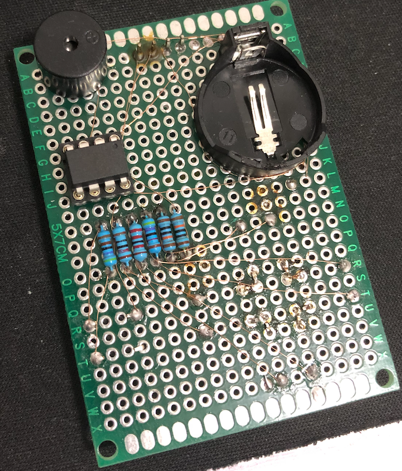

最近无聊，上 YouTube 看到这么个东西。

<iframe width="800" height="450" src="https://www.youtube.com/embed/APwnDlavXlw" frameborder="0" allow="accelerometer; autoplay; encrypted-media; gyroscope; picture-in-picture" allowfullscreen></iframe>

感觉是个很有意思的东西，于是决定亲手尝试一下。

虽然之前有折腾路由器的经验，不过像这次这么硬核的 DIY 也还是头一次尝试，中途也确实走了些许弯路。前后折腾了两个星期左右，终于得到了一个大致可用的成品。

# Learn what to do

视频中提到的东西，简单总结起来大概是这样：

* ATTiny85 单片机
    * 512 字节 SRAM，8KB ROM，最高可以运行在 16MHz
    * I2C Bus
    * 最多三个 ADC（模数转换器，不能反过来转）。其中一个引脚用于 RESET 了，所以实际可用两个
    * 小巧，节能之类的特性就跳过了
* 一块 I2C Bus 的 128x64 OLED 屏幕
    * 通过 I2C Bus 跟单片机通信，就是主要的输出部件了
* 由于 ATTiny85 的 IO 引脚数量完全不够用，需要利用 ATTiny85 内置的 DAC
    * 通过电阻和按钮搭配得到不同阻值，转换为不同级别的电压，输入到 DAC 中即可区分不同的按钮
* 通过 3V 的纽扣电池供电
    * 电池座
* 蜂鸣器等其他零件

理解起来并不困难，接线之类操作也非常简单，而且作者也给出了很详尽的接线图，甚至标记好了所有的电阻的阻值：


作者同时也给出了三个游戏的源代码，只要编译就能运行。那感觉就可以开始准备采购了。

# Buying Stuff

数了数自己手里现有的零件。现有的大概也只有按钮和常用电阻包。上万能的某宝搜了一下 ATTiny85，发现最多见的是这种超小型的开发板。


稍微了解了一下，这是一个山寨版的 DigiSpark，大体上就是 ATTiny85 加少量外围的电路（USB 接口，电压转换器，LED 灯等），然后预先刷好一个 BootLoader 使得可以通过 USB 接口与单片机进行互操作。听起来似乎不错，有 USB 对于草民这样的初学者来说可以大大降低门槛。

正好这家有我想要的所有东西，于是一次性买齐。感觉第一次上就做上面视频里面那样只有一个框的这种对我来说难度略大，因此还是决定先使用实验电路板的方式。另外，常用电阻包两年多前买的还没有用过，所以这次就没再买了。顺便买了两片之前一直很好奇的 ESP8266 说不定以后也用得上。


# First Attempt

很快拿到了快递。开发板插上 USB，就有一个小灯一闪一闪，大概一秒闪两三下的样子，同时电脑也提示识别到了设备，看起来没问题。按教程装好了 Arduino IDE 和对应的 DigiSpark 开发板定义，然后尝试写一个跑马灯进去。

实际尝试使用 Arduino IDE 的时候真的感觉极为痛苦：

* 连最最基本的静态分析功能都没有，想找个函数或者常量的定义，对不起，做不到。
* 基本只有一个格式化代码的功能，而且格式化出来的东西也特别诡异，让我一个习惯了现代 IDE 的码农感觉极为绝望，真他妈难用，巨他妈难用。
* Include 的路径特别特别特别奇怪，从网上抓来的代码天知道会 Include 什么东西，尖括号双引号不分，尖括号里面的文件不知道在哪，而且 Include 之类的路径都不知道在哪里配置。
* 从网上找来的各种 Lib 代码风格一个比一个可怕，真的是纯爱好者水平。

从 DigiSpark 官网上找了示例代码过来。看起来倒是十分好理解，两个函数，一个只执行一次，另一个无限循环。

```cpp
// the setup routine runs once when you press reset:
void setup() {                
  // initialize the digital pin as an output.
  pinMode(0, OUTPUT); //LED on Model B
  pinMode(1, OUTPUT); //LED on Model A  or Pro
}

// the loop routine runs over and over again forever:
void loop() {
  digitalWrite(0, HIGH);     // turn the LED on (HIGH is the voltage level)
  digitalWrite(1, HIGH);
  delay(1000);               // wait for a second
  digitalWrite(0, LOW);      // turn the LED off by making the voltage LOW
  digitalWrite(1, LOW); 
  delay(1000);               // wait for a second
}
```

但是托这个辣鸡 IDE 的福，这里面 `pinMode` `digitalWrite` `delay` 三个函数原型是什么不知道，实现在哪儿不知道，`OUTPUT` `HIGH` `LOW` 值是什么定义在哪不知道，简直是开局劝退。

总之忍了忍还是尝试了一下。构建，写入。

```
> Device is found!
connecting: 16% complete
connecting: 22% complete
connecting: 28% complete
connecting: 33% complete
> Device has firmware version 1.6
> Available space for user applications: 6012 bytes
> Suggested sleep time between sending pages: 8ms
> Whole page count: 94  page size: 64
> Erase function sleep duration: 752ms
parsing: 50% complete
> Erasing the memory ...
erasing: 55% complete
erasing: 60% complete
erasing: 65% complete
> Starting to upload ...
writing: 70% complete
writing: 75% complete
writing: 80% complete
> Starting the user app ...
running: 100% complete
>> Micronucleus done. Thank you!
```

提示写入成功，然后发现不太对，这个灯的闪烁频率似乎还是一秒钟两三下。。。

于是尝试把 Delay 改大到 2000 甚至 10000，写入，然后发现还是没有任何变化，开始感觉事情似乎有些不对了。

# Resetting Fuses

折腾一圈确认这个板子的 ROM 写不进去之后，开始尝试 Google 解决方案。

搜了一圈儿，看到这样一个帖子 [https://digistump.com/board/index.php/topic,2832.0.html](https://digistump.com/board/index.php/topic,2832.0.html)。下面的回复很明确提到了 DigiSpark 存在山寨版，并且这些山寨版很可能没有正确设置 Fuses 的值。Fuses 是配置单片机运行方式的三个寄存器，可以决定运行频率、一些引脚的行为以及其他的运行行为等。里面也附带了一个这样的工具 [http://www.engbedded.com/fusecalc/](http://www.engbedded.com/fusecalc/) 帮助理解每一个寄存器的值的含义。

看帖子的描述，似乎我这块儿单片机 `SELFPRGEN` 很可能是没有启用，因此 DigiSpark 使用的 MicroNucleus 无法修改 ROM 中的内容。非常神奇的是它改不了居然也不报错，静默失败可还行。

有一个很简单的方法去验证这个猜测：DigiSpark 默认出厂时把 RESET 脚配成了一个可用的 IO（即打开 `RSTDISBL`）。那也就是说，如果手头这个方案的 RESET 脚还是 RESET 功能的话，那大概率上生产厂家没有配置 Fuses。随手拿镊子一戳，闪烁的 LED 灭了，果然不出所料这个脚还是 RESET 功能。那就改吧。

比较麻烦的地方是，想修改 Fuses 的值，必须使用编程器来操作。然而手头并没有可以用的编程器，搜网上看大多数方案都是用 Arduino Uno 做编程器，然而我的 Arduino Uno 早找不到了，并且它还需要一个 10uf 的电容避免 Arduino Uno 重启。没法子，换方案。

又搜了一段时间，发现可以用树莓派来做：[https://www.instructables.com/id/Programming-the-ATtiny85-from-Raspberry-Pi/](https://www.instructables.com/id/Programming-the-ATtiny85-from-Raspberry-Pi/)

接线如图。


从电阻包里面翻出几个一千欧姆的电阻，在面包板上用杜邦线接好。


然后按照教程上说的，先打开树莓派的 SPI 总线，然后装一下 avrdude。因为教程比较老（用的还是一代的树莓派，现在都 3b+ 了），现在 avrdude 不用按教程说的那样自己编译，直接用 apt-get 装就行了，官方源里面的版本足够新。wiringPi 也是一样。装好之后输入以下命令，设置好 RESET 脚的状态，然后就可以用 avrdude 操作单片机了：

```bash
sudo gpio -g mode 22 out
sudo gpio -g write 22 0
sudo avrdude -p t85 -P /dev/spidev0.0 -c linuxspi -b 10000
```


读出来一看，Extended Fuse 值是 `0xFF`，果然不意外，`SELFPRGEN` 没有开启。那其实很简单，把它打开就成。


```
sudo avrdude -p t85 -P /dev/spidev0.0 -c linuxspi -b 10000 -U lfuse:w:0x62:m -U hfuse:w:0xdf:m -U efuse:w:0xfe:m
```


修改完 Fuse，再尝试用 Arduino IDE 写入代码，果然恢复了正常。

后来顺手刷了最新版的 MicroNucleus 节省了大概 500 字节空间出来，同时把 Fuse 调整成了 DigiSpark 的默认值，跟上面的变化主要是运行在 16MHz 并且把 RESET 作为一个可用的 IO 引脚而不是 RESET。

# Screen Connected

单片机的问题解决了，接下来就先尝试点亮一下屏幕，顺便规划一下这个东西大致的元件布局。初步的想法是跟视频中的类似，做成一个类似于 Gameboy 那样的布局：正面上面是屏幕，下面上下左右加一个 Action 键，反面把元件在上半部分随便放一放避免放在下半部分硌手。至于走线，省事儿起见直接用漆包线了（后来焊这玩意儿差点搞瞎我的狗眼）。

预先刷了一个弹球的程序进去，用来测试屏幕是否靠谱：[https://www.instructables.com/id/ATTiny85-connects-to-I2C-OLED-display-Great-Things/](https://www.instructables.com/id/ATTiny85-connects-to-I2C-OLED-display-Great-Things/)

简单连接好屏幕和单片机的电源线。I2C 的两个信号线暂时留空（因为不记得哪个是哪个了）。成功点亮的时候效果是这样的：


背面布局是这样的。背面看起来似乎十分干净，实际上有好几根漆包线。


既然能成功点亮正常运行，那我们就继续下一步。

# Buttons

上面视频教程里面的按钮方案其实非常简单，只需要初中物理知识就足够理解了。


这样链接的情况下，在没有按下任何一个按钮的情况下 ADC 上的电压跟 GND 是一致的；按下一个按钮之后就成了一个分压（回忆一下滑动变阻器是啥样子）。只要每个按钮对应的电压变化量足够大，再添加合适的防抖，就很容易通过 ADC 读数确定目前按下的按钮是哪一个。图上只有四个按钮，不过其实原理一样，再加按钮就加一个 32R 的就行了。至于为什么一定要是这样间隔两倍的方式排列，是因为这样可以避免同时按下多个按钮的时候产生的阻值或者阻值范围冲突。

于是看教程附带的图，开始找零件。比较郁闷的是发现电阻包里面完全没有图上标记的这种阻值，不过大概还是能组成间隔两倍的样子。找了 10K 22K 47K 100K 200K 的电阻和按钮，然后先把按钮随手这样焊了一下。


焊好之后发现犯了一个很要命的错误：按钮方向错了。为了方便插在实验电路板上，我实际的连接方式跟下面的正确方式比，每一个按钮都旋转了 90 度。


本来其实也不算什么特别大的问题，但是比较要命的是我还像视频里面一样把四个脚连在一起了，这就彻底翻车了。拆也很难拆了，于是只能思考在这种情况下如何解决问题。

最后还是想到了一个方案：还是类似于滑动变阻器的方法，只不过稍微复杂一些。


简单画一下就是，六个这样的电阻直接串联，然后按下一个按钮就把其中一个电阻短接起来。每个电阻被短接的时候，滑动变阻器分压的比例都会发生改变，实际 ADC 取到的电压也会有所变化。同时按下几个按钮的情况因为采取了两倍这种方案，因此也是不会有问题的。

这样操作虽然是可行的，但是实际开关走线的量会大很多，另外中间四个连在一起的引脚还是需要分开（不过不用在上面连线）。

于是搞了整整一下午。六个电阻串联，每个按钮对应的两条线都用漆包线连接到对应的按钮上。搞到最后眼都花了。


写了一个很简单的程序，尝试读取一下 ADC 的值，确认是否正常。

```cpp
#include <DigisparkOLED.h>
#include <Wire.h>

void setup() {
  // put your setup code here, to run once:
  oled.begin();
  pinMode(A0, INPUT);
  pinMode(A2, INPUT);
  pinMode(PB4, OUTPUT);
  oled.clear(); //all black
  analogReference(DEFAULT);
}


void loop() {
  // put your main code here, to run repeatedly:
  
  oled.setCursor(0, 0); //top left
  oled.setFont(FONT6X8);
  oled.print(F("P5:"));
  oled.print(analogRead(A0));
  oled.println(F("    "));
  oled.print(F("P3:"));
  oled.print(analogRead(A2));
  oled.println(F("    "));
  delay(1000);
}
```

刷进去开机。


测试一下（图上接线接的是 A0 也就是 RESET 那个脚）：


简单测试得到结果大概如下：

| Button | Min Value | Max Value |
| ------ | --------- | --------- |
| None   | 360       | 362       |
| Up     | 557       | 558       |
| Down   | 391       | 392       |
| Left   | 433       | 434       |
| Right  | 374       | 375       |
| Action | 366       | 368       |

同时按下两个按钮，值也是固定且可区分的，不过实际场景下没有用到这样的值。


目前来看，基本可说万事俱备，只差真的写一个程序进去了。

# Change Plan

尝试了最上面视频作者提供的三个小游戏，但是无一例外，要么无法正常编译，要么编译出来的代码超过了最大可用空间。究其原因，ATTiny85 内置的空间本来就很小，MicroNucleus 这个 BootLoader 占用了近 1.5KB 的空间，留给程序使用的代码就只有 6.5KB 左右了，很难满足需求。在对这个代码和环境都并不是很熟悉的情况下也没有很好的方案去尝试进一步压榨空间，胡乱尝试了一些方案之后也只能放弃。

想来想去，还是决定直接买单独的芯片，放弃使用带 USB 口的 DigiSpark 了。另外买了五个 DIP-8 封装的芯片和插座。


没有 USB 口，所有写入就只能都通过树莓派了。接线跟之前基本一样，插了个插座上去方便操作。


取下背面的 DigiSpark，重新焊一个插座上去，装好 ATTiny85。这张图上的走线也更清楚一些，方便对上面有多少漆包线有个更清晰的认识。



终于可以写入一个游戏尝试玩耍一下了。


# Enjoy

最终尝试了一下 Tiny Bomber，因为可以使用所有的按钮以及蜂鸣器。

小视频：

<video controls="controls">
  <source type="video/mp4" src="../assets/images/diy-retro-arcade/tiny-bomber.mov"></source>
  <p>Your browser does not support the video element.</p>
</video>

虽然走了不少弯路不过最终还是得到了一个可以玩一下的小玩意儿。当然也有一些问题：

* 按键并不灵敏，按下没反应或者误按之类情况时有发生
* 耗电比较严重，CR2032 电池可能连续玩几分钟，电压就严重下降，需要取下来等一会儿才能继续使用

不过总结起来感觉，这次尝试还算比较顺利。作为一个纯娱乐向的项目，也比较有意思。

之后或许会尝试用一起买的 ESP8266 尝试一些其他玩法。
