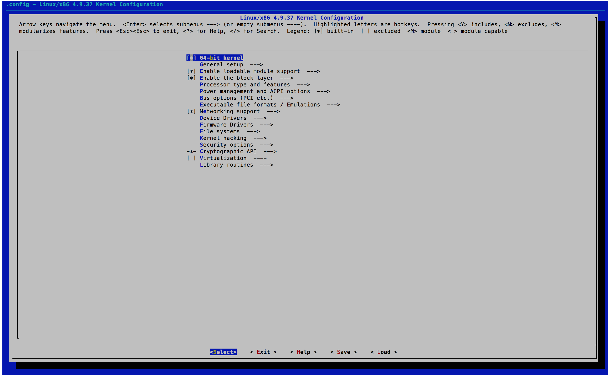
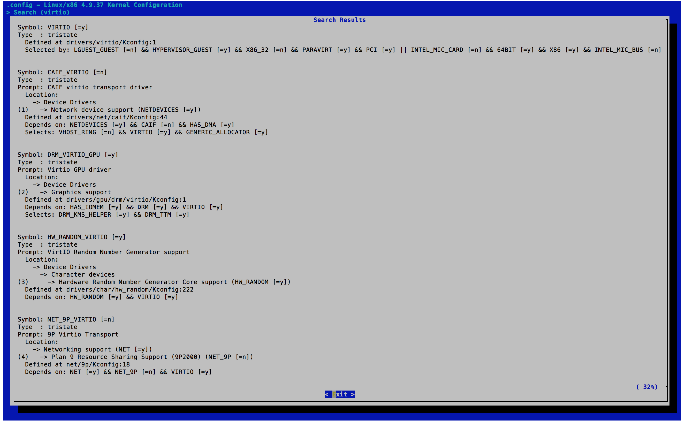
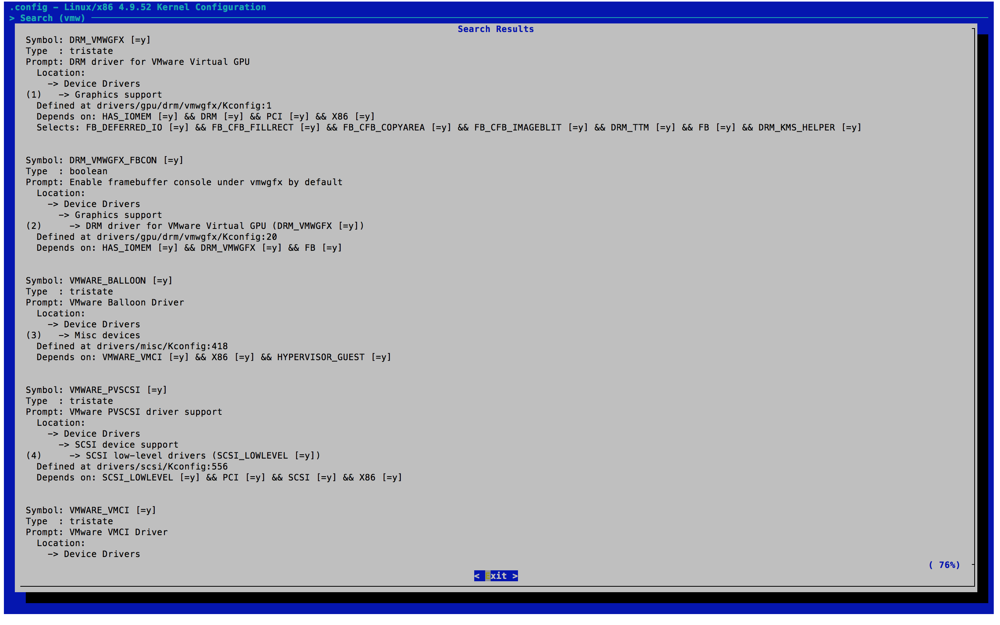
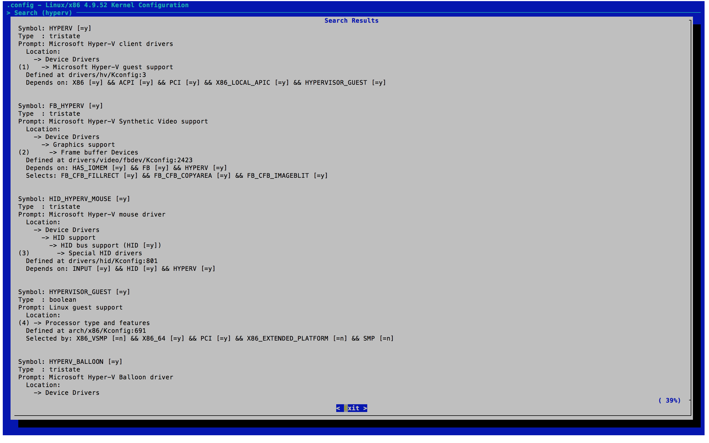

算是老坑扒出来，趁有时间重新认真填一下。

这篇东西最早是 2017 年年底写的，从那个时候到现在（2019 年清明），基本上这台 NAS 的方案就没有再有过什么大变化：

* 2.4GHz 的无线网卡最终换到了 RTL8192EUS，实测下来受到 USB 3.0 的干扰最小，基本不影响正常使用，于是固定到了盘架左侧的空间里面，当然现在用六类线直接插到入户设备上，也就不再用 2.4GHz 无线网卡了。
* 2TB 的硬盘不够用了，于是 2018 年双十一买了西部数据的 10TB 5400RPM 监控盘，应该是能买到的这个转速下容量最大的盘了

另外 Host OS 从 Deepin 换到 Linux Mint，重新划分空间并且配置了到 OneDrive 的自动同步，还搞了 IPv6 代理用来下北邮人，这些后面会详细谈。

至于最近为什么突然想起来重新填这个坑？上个月同事发现手机没空间了，因此也打算搞一个类似草民这种方案的 NAS。不过他的方案搭建起来明显没有草民这么顺利，中间多踩了很多坑，比如 IOMMU Group 不好拆分之类的问题。一起搞下来发现也算是比较常见的问题，因此一同总结进来，顺便把之前留的坑都认真填上。

这里前面部分还是主要谈虚拟化的一些东西，后面再额外介绍一些网盘同步、IPv6 代理下载 PT 之类的内容。

# 需要解决的问题

上次换主板，除了考虑到原来的那块主板的 CPU 性能和网卡的数量之外，更多的还是包括想让这台设备拥有更加丰富的功能，尤其是狗东 618 买了投影之后，更主要的目的也包括让这台设备能够承担一些 HTPC 相关的工作。

考虑上面提到的需求，这台设备具备的功能基本上不可能用单独的一个操作系统来完成了：

* 路由相关的功能，考虑到我对透明代理的重度依赖以及自己的技能树，基本上还是考虑使用 OpenWRT 或者 LEDE，实在不能够满足的话也可以考虑用 RouterOS 提供 AP 服务，与 OpenWRT 结合运行
* 存储相关功能最好可以用 DSM，如果 Host OS 功能足够强大（比如使用了 Windows 10 + Hyper-V 这种方案）的话，也可以考虑不单独用 VM 来做，直接由 Host OS 来管理
* HTPC 相关的功能就需要一个普通的 Windows 或者带 X 的 Linux，而且需要能够控制集成显卡（声卡可以使用 HDMI 音频完成，板载的声卡可以用也可以不用）

问题显得还是有些棘手：每一个需求都几乎需要一个单独的操作系统来运行，如果硬件上直接跑的系统自身的功能太弱的话，所有的操作都需要一个 VM 来跑。而且每一项功能的实现都需要 Host OS 或者 VM 独占一个或多个硬件设备（比如路由的功能，除去无线网卡之外还需要能够控制有线网卡）；而如果存储部分不由 Host OS 管理的话，情况还可能会更加复杂一些。

## 关于无线网卡

草民使用的无线网卡 QCA9880 是一块很典型的 PCIE 总线设备，板载的四个 Intel 网卡也是一样的。

对于有线网卡，基本上所有的 Hypervisor 都会包含功能全面的网络配置组件，能够实现虚拟交换机的创建、虚拟网卡与物理网卡的桥接等，并且也有很多种可选的优化帮助性能上的提升，基本上不需要我们过于操心如何直接控制硬件。但是对于无线网卡来说，由于 Hypervisor 几乎都不包括无线网卡支持，能直接包括 AP 支持的更是闻所未闻，因此无线网卡的支持基本上只能通过将控制权直接传递给 VM 这种方案，也就是所谓的直通（Passthrough）来完成。

对于支持 MSI 的 PCI-E 设备来说，常见的 Hypervisor 在 CPU 支持一些虚拟化特性（包括 VT-x、VT-d，Hyper-V 还要求 SR-IOV）的前提下都可以实现常见 PCIE 设备的直通。MSDN 的文档上面提到目前 Hyper-V 能够直接支持的设备包括 NVMe 存储设备和显卡（AMD 据说大多数支持，NVIDIA 似乎只有部分 Quadro 专业卡或者或者 Tesla 计算卡能得到较好支持）。至于我们这次要直通的无线网卡，在 Windows 下配置直通的时候会被识别为未知 PCIE 设备，但是可以工作（虽然并不完全正常，后面会详谈）。KVM 和 ESXi 没有专门区分不同的 PCIE 设备，能不能通主要看脸（比如 ESXi 上面我就翻车了）。

## 关于集成显卡

网上很多人介绍利用 ESXi 组建家庭 HTPC 的时候都提到要关掉集成显卡、板载声卡，原因是集显从来没听说有直通成功的，而且还会拉低独显的性能……

草民的这块主板并没有可以用来插独立显卡的地方，在这种情况下直接配置集成显卡的直通属于非常典型的作死行为，毕竟一旦翻车除了重装 Host OS 之外几乎没有解决方法。

搜索资料得知，Intel 的集成显卡支持一种特性，可以实现在不同的 VM 之间共享集成显卡，提供包括 3D 加速和视频输出等服务。不过目前并不知道有什么 Hypervisor 支持这一特性，所以目前比较稳妥的方式还是由 Host OS 来负责控制集成显卡，也就是说最好选择带图形界面的 Linux 搭配 KVM / Xen，或者使用 Windows 搭配 Hyper-V 来实现需求。ESXi 肯定是不支持了，ESX 也许还可以考虑一下，毕竟 ESX 本质上也就是一个带 X 的 Linux。

## 关于存储

存储的部分看似简单，其实最为棘手。

对于一个常见的系统，从硬件到我们能看到的挂载好的文件系统，经过了多个层次的抽象：

1. 磁盘控制器，直接连接到 PCIE 总线的 PCIE 设备
2. 磁盘（ATA 设备），可能是一个磁盘，或者是一个磁盘阵列，也可能是光盘、磁带或者什么闻所未闻的神奇设备，不过总之是一个可以接收 ATA 命令的设备
3. 块（block）设备，对于 Linux 来说就是 /dev 下面的一个 node
4. LVM、ZFS、btrfs 等卷管理器，也可以把 MBR、GPT 这些的划进来
5. 分区，可以直接挂载的 node
6. 文件系统

每一个层次都可以被 Hypervisor 拦腰截断，抽象为一个可以被 VM 识别的设备，但是抽象成的设备和实际的效果都不一样，这种情况下就需要我们仔细考虑。

比如，对于 NAS 来说，硬盘的电源管理是非常重要的一项功能，而完成这项功能需要操作系统给 ATA 设备直接发送相关的命令。结合草民现有的平台，就需要有这样的考虑：

* 系统盘 SSD 和机械硬盘是在同一个磁盘控制器下面的两个磁盘，如果我们直通磁盘控制器的话，Host OS 肯定会直接崩溃
* 直通单个 ATA 设备，对于我们的平台来说是最好的选择。
* 直通块设备及其以上的层次的话，通过 ATA 命令管理硬盘的需求肯定就不能实现了

草民的实践中尝试了在 KVM 内直通 ATA 设备和直通块设备，但是发现两种方式似乎都是 QEMU 模拟了一个 ATA 设备，并没能达到我的预期效果。因此最终选择的方式还是由 Host OS 负责存储管理。

## 直通在这些设备上的意义

对于显示设备，直通几乎是唯一能够提供与正常硬件相近的 3D 加速性能的方法。Hypervisor 模拟的显示设备往往只有非常基础的 3D 加速功能以及 16MB 左右的 VRAM，对于对显示性能有一定需求的平台，比如渲染用的集群或者家用 HTPC，模拟显示设备远远不能满足我们的需求，这时必须利用设备直通来解决我们的需求。

与显示设备类似，Host OS 不能提供直接支持的设备，比如无线网卡，只能通过直通的方式将控制权交由 VM 来利用这些设备。

对于 Hypervisor 能直接支持的有线网络设备，直通能带来明显的性能提升。数据显示，直通网络设备比起其他的半虚拟化（VirtIO）或者是通过虚拟网卡桥接等方式，性能最好且对系统资源的占用也最小。

对于存储相关的设备，性能相关的部分与有线网卡类似（可以参考 Hyper-V 支持 NVMe 相关的文档）。除此之外，直接对 ATA 设备的管理（电源管理、SMART 数据监测）甚至是磁盘控制器的管理（比如阵列的管理）都是选用直通这一方案的重要收益。

# 虚拟化相关技术简介

虚拟化技术按照 Hypervisor 的类型可以分为 Type-I 和 Type-II 两种，按照对硬件的模拟的类型可以分为 Full Virtualization 和 Paravirtualization 两种。不过对于 Type-I 和 Type-II，其实并没有非常严格的界限。

## Type-I 与 Type-II

Type-I 的 Hypervisor 本身就是运行在硬件上的 Host OS；Type-II 的 Hypervisor 是 OS 上的一个应用程序。我们用到的 ESXi 属于典型的 Type-I 的 Hypervisor，普通的 QEMU 算是典型的 Type-II Hypervisor。

而我们常用的 QEMU-KVM 就不能明确的划归 Type-I 和 Type-II。KVM 通过在内核中添加模块，实现了高效率的虚拟化，但是用户看到的仍然是用户空间中的 QEMU-KVM；Hyper-V 在 Wikipedia 上被划分为 Type-I 型，应该是 NT 内核初始化之前先由 Hyper-V 接管了部分 CPU 控制权限。

## Full Virtualization 与 Paravirtualization

Full Virtualization 模拟真实的硬件环境，使得 Guest OS 可以不做修改就运行在 VM 中；Paravirtualization 则并不模拟完整的硬件环境，只是提供一些 API 供 Guest OS 实现虚拟化功能，也就是说 Guest OS 需要针对 Hypervisor 进行修改才能运行在 VM 中。

Linux 内核提供了针对 Xen 和 KVM 等 Hypervisor 的 Paravirtualization 支持，内核启动时可以自动识别自己运行的环境，以适应对应的虚拟化 API。对于 Hyper-V 等 Linux 没有直接支持 Paravirtualization 的 Hypervisor，内核会以在普通硬件上工作的方式在 VM 中运行（但是这种情况下内核能够识别出 Hyper-V Hypervisor）。

# 草民的虚拟化实践

草民的尝试中包括了 VMWare ESXi、Ubuntu 17.04 上的 KVM 以及 Windows Server 2016 上的 Hyper-V。这三种 Hypervisor 在草民的平台上都能够支持 PCI 设备的直通，不过实际的尝试中出现了各种各样的问题，最终只有 KVM 一种方案能比较完美的使用。

## 定制 OpenWRT（LEDE）

默认的 OpenWRT 或者 LEDE 只能比较好的支持某一种 Hypervisor。为此，我们需要修改默认的内核配置，添加那些用于支持各种 Hypervisor 的特性。

Linux 目前自带 Xen、KVM、Hyper-V 和 VMWare 相关的一些特性支持。主要包括：

* 基本的 Guest 支持
    * Paravirtualization 支持
    * 针对 KVM、Xen 的 Guest 支持
* Balloon（动态内存分配）驱动程序
* IO 半虚拟化驱动程序
    * SCSI 设备
    * 网络设备
    * 其他的一些设备
* 虚拟显示设备支持
    * Framebuffer
    * DRM（不是数字版权保护那个）
* PCI ／ PCI-E 通道驱动程序
* 用于与 Host 通信的虚拟管道设备
* 其他的虚拟设备，如键盘鼠标等

我们在定制 Guest OS 的时候，基本的 Guest 支持以及 Paravirtualization 支持肯定是需要添加进去的，否则无法享受半虚拟化特性带来的性能提升；对于 IO 等设备，Virtio 提供的半虚拟化支持对性能提升也有很大的帮助；至于虚拟的显示设备则可有可无。直通 PCI-E 设备肯定也需要 PCI-E 通道的驱动程序（草民的尝试中就是因为 LEDE 不能顺利支持 Hyper-V 的虚拟 PCI-E 设备导致最终放弃使用 Hyper-V，但是 Xubuntu 就能很顺利的使用 Hyper-V 直通无线网卡）。

考虑到 Hyper-V 支持 PCI-E 直通的特性是 4.6 内核才加入的，我们可选的似乎只有 LEDE 开发分支（虽然事实证明并没有什么卵用），草民也就用 LEDE 开发分支了。先准备好 LEDE Buildroot 环境，并且配置 target 为 x86-64，保存回到命令行后执行 `make kernel_menuconfig` 即可进入 Linux 内核配置界面。



### Virtio

Virtio 提供了一系列半虚拟化驱动程序，包括：

* GPU
* 随机数发生器
* SCSI 设备接口
* Balloon（动态内存）
* Block 设备接口
* Console
* 输入输出设备
* 虚拟的 Bus
* PCI 前端驱动
* 网络设备驱动
* 虚拟 Socket，用于与 Host 直接通信

我们这里会用到的包括 SCSI、Block、Console、PCI、Bus 以及网络设备，简单起见全选即可。



### VMWare

VMWare 提供了 GPU、动态内存、VMXNET3 网卡、SCSI 以及与 Host 通信用的 VMCI 驱动程序。同样全选就行了。



### Hyper-V

Hyper-V 的情况要复杂一些。

驱动程序仍然还是上述的几样（FrameBuffer、动态内存、虚拟网卡、虚拟 SCSI 接口、输入输出设备、主机通信接口、PCI Bus）。同样全选即可。



但是全选并不意味着能全都正常工作……草民的尝试中就发现 LEDE 默认会忽略 Hyper-V 的 PCI Bus，当然可以通过以下方法可以绕过这个问题。

```patch
diff --git a/config/Config-kernel.in b/config/Config-kernel.in
index 3468899..8a55b1e 100644
--- a/config/Config-kernel.in
+++ b/config/Config-kernel.in
@@ -765,3 +765,8 @@ config KERNEL_DEVKMEM
          Say Y here if you want to support the /dev/kmem device. The
          /dev/kmem device is rarely used, but can be used for certain
          kind of kernel debugging operations.
+
+config KERNEL_PCI_HYPERV
+       bool "Hyper-V PCI Frontend"
+       help
+               just test.
```

然后在 Kernel build settings 中选中 Hyper-V PCI Frontend 即可。然而非常奇怪的是，实际使用的时候会立即 Oops 崩溃，原因不明，后来（隔了好几个月之后），x86 target 更新到 4.14 内核了，解决了这一问题，不过由于直通只能在 Windows Server 下运行，因此我也没再进行验证。

### UEFI Support

如果需要 Hyper-V Gen2 提供的一些特性的话，需要让我们编译的 LEDE 支持 UEFI 启动。

在本地 merge 这个 branch：[sduponch:x86_uefi](https://github.com/sduponch/source/tree/x86_uefi)，然后即可在 Target Images 中发现 UEFI 相关选项。

不知道为什么这个，似乎到现在（2019 年清明），还没有 merge 进 master……

## PCI Passthrough 超级大坑

### Hyper-V PCI Passthrough

关于 Hyper-V 的直通，草民不再重新搭环境搞了，成本太高。直接参考 [https://lenovopress.com/lp0088.pdf](https://lenovopress.com/lp0088.pdf) 。

### KVM 

KVM 搞这个，其实可以说相当简单。

## 主机与虚拟机的网络配置

不同的 Host OS 下选择了不同的网络配置，后面谈……

## 存储部分的设计

对于最终决定的方案 KVM 来说，这个应该算得上是大坑了……后面再谈……
