算是老坑扒出来，趁有时间重新认真填一下。

这篇东西最早是 2017 年年底写的，从那个时候到现在（2019 年清明），基本上这台 NAS 的方案就没有再有过什么大变化：

* 2.4GHz 的无线网卡最终换到了 RTL8192EUS，实测下来受到 USB 3.0 的干扰最小，基本不影响正常使用，于是固定到了盘架左侧的空间里面，当然现在用六类线直接连到了入户设备上，也就不再用 2.4GHz 无线网卡了。
* 2TB 的硬盘不够用了，于是 2018 年双十一买了西部数据的 10TB 5400RPM 监控盘，应该是能买到的这个转速下容量最大的盘了

另外 Host OS 从 Deepin 换到 Linux Mint，重新划分空间并且配置了到 OneDrive 的自动同步，还搞了 IPv6 代理用来下北邮人，这些后面会详细谈。

至于最近为什么突然想起来重新填这个坑？上个月同事发现手机没空间了，因此也打算搞一个类似草民这种方案的 NAS。不过他的方案搭建起来明显没有草民这么顺利，中间多踩了很多坑，比如 IOMMU Group 不好拆分之类的问题。一起搞下来发现也算是比较典型的问题，因此一同总结进来，顺便把之前留的坑都认真填上。

这里前面部分还是主要谈虚拟化的一些东西，后面再额外介绍一些网盘同步、IPv6 代理下载 PT 之类的内容。

# 需要解决的问题

上次换主板，除了考虑到原来的那块主板的 CPU 性能和网卡的数量之外，更多的还是包括想让这台设备拥有更加丰富的功能，尤其是狗东 618 买了投影之后，更主要的目的也包括让这台设备能够承担一些 HTPC 相关的工作。

考虑上面提到的需求，这台设备具备的功能基本上不可能用单独的一个操作系统来完成了：

* 路由相关的功能，考虑到我对透明代理的重度依赖以及自己的技能树，基本上还是考虑使用 OpenWRT 或者 LEDE，实在不能够满足的话也可以考虑用 RouterOS 提供 AP 服务，与 OpenWRT 结合运行
* 存储相关功能最好可以用 DSM，如果 Host OS 功能足够强大（比如使用了 Windows 10 + Hyper-V 这种方案）的话，也可以考虑不单独用 VM 来做，直接由 Host OS 来管理
* HTPC 相关的功能就需要一个普通的 Windows 或者带 X 的 Linux，而且需要能够控制集成显卡（声卡可以使用 HDMI 音频完成，板载的声卡可以用也可以不用）

问题显得还是有些棘手：每一个需求都几乎需要一个单独的操作系统来运行，如果硬件上直接跑的系统自身的功能太弱的话，所有的操作都需要一个 VM 来跑。而且每一项功能的实现都需要 Host OS 或者 VM 独占一个或多个硬件设备（比如路由的功能，除去无线网卡之外还需要能够控制有线网卡）；而如果存储部分不由 Host OS 管理的话，情况还可能会更加复杂一些。

## 关于无线网卡

草民使用的无线网卡 QCA9880 是一块很典型的 PCIE 总线设备，板载的四个 Intel 网卡也是一样的。

对于有线网卡，基本上所有的 Hypervisor 都会包含功能全面的网络配置组件，能够实现虚拟交换机的创建、虚拟网卡与物理网卡的桥接等，并且也有很多种可选的优化帮助性能上的提升，基本上不需要我们过于操心如何直接控制硬件。但是对于无线网卡来说，由于 Hypervisor 几乎都不包括无线网卡支持，能直接包括 AP 支持的更是闻所未闻，因此无线网卡的支持基本上只能通过将控制权直接传递给 VM 这种方案，也就是所谓的直通（Passthrough）来完成。

对于支持 MSI 的 PCI-E 设备来说，常见的 Hypervisor 在 CPU 支持一些虚拟化特性（包括 VT-x、VT-d，Hyper-V 还要求 SR-IOV）的前提下都可以实现常见 PCIE 设备的直通。MSDN 的文档上面提到目前 Hyper-V 能够直接支持的设备包括 NVMe 存储设备和显卡（AMD 据说大多数支持，NVIDIA 似乎只有部分 Quadro 专业卡或者或者 Tesla 计算卡能得到较好支持）。至于我们这次要直通的无线网卡，在 Windows 下配置直通的时候会被识别为未知 PCIE 设备，但是可以工作（虽然并不完全正常，后面会详谈）。KVM 和 ESXi 没有专门区分不同的 PCIE 设备，能不能通主要看脸（比如 ESXi 上面我就翻车了）。

## 关于集成显卡

网上很多人介绍利用 ESXi 组建家庭 HTPC 的时候都提到要关掉集成显卡、板载声卡，原因是集显从来没听说有直通成功的，而且还会拉低独显的性能……

草民的这块主板并没有可以用来插独立显卡的地方，在这种情况下直接配置集成显卡的直通属于非常典型的作死行为，毕竟一旦翻车除了重装 Host OS 之外几乎没有解决方法。

搜索资料得知，Intel 的集成显卡支持一种名为 GVT-g 的特性，可以实现在不同的 VM 之间共享集成显卡，提供包括 3D 加速和视频输出等服务。看教程 [[GUIDE] Running Windows via QEMU/KVM and Intel GVT-g on Arch Linux
](https://www.reddit.com/r/VFIO/comments/8h352p/guide_running_windows_via_qemukvm_and_intel_gvtg/) 尝试了一下，步骤倒并不困难，不过方案还并不成熟，virt-manager 和 qemu 的版本都有要求，配置起来坑也蛮多，感觉意义也不是很大。因此目前比较稳妥的方式还是由 Host OS 来负责控制集成显卡，也就是说最好选择带图形界面的 Linux 搭配 KVM / Xen，或者使用 Windows 搭配 Hyper-V 来实现需求。ESXi 肯定是不支持了，ESX 也许还可以考虑一下，毕竟 ESX 本质上也就是一个带 X 的 Linux。

## 关于存储

存储的部分看似简单，其实最为棘手。

对于一个常见的系统，从硬件到我们能看到的挂载好的文件系统，经过了多个层次的抽象：

1. 磁盘控制器，直接连接到 PCIE 总线的 PCIE 设备
2. 磁盘（ATA 设备），可能是一个磁盘，或者是一个磁盘阵列，也可能是光盘、磁带或者什么闻所未闻的神奇设备，不过总之是一个可以接收 ATA 命令的设备
3. 块（block）设备，对于 Linux 来说就是 /dev 下面的一个 node
4. LVM、ZFS、btrfs 等卷管理器，也可以把 MBR、GPT 这些的划进来
5. 分区，可以直接挂载的 node
6. 文件系统

每一个层次都可以被 Hypervisor 拦腰截断，抽象为一个可以被 VM 识别的设备，但是抽象成的设备和实际的效果都不一样，这种情况下就需要我们仔细考虑。

比如，对于 NAS 来说，硬盘的电源管理是非常重要的一项功能，而完成这项功能需要操作系统给 ATA 设备直接发送相关的命令。结合草民现有的平台，就需要有这样的考虑：

* 系统盘 SSD 和机械硬盘是在同一个磁盘控制器下面的两个磁盘，如果我们直通磁盘控制器的话，Host OS 肯定会直接崩溃
* 直通单个 ATA 设备，对于我们的平台来说是最好的选择。
* 直通块设备及其以上的层次的话，通过 ATA 命令管理硬盘的需求肯定就不能实现了

草民的实践中尝试了在 KVM 内直通 ATA 设备和直通块设备，但是发现两种方式似乎都是 QEMU 模拟了一个 ATA 设备，并没能达到我的预期效果。因此最终选择的方式还是由 Host OS 负责存储管理。

## 直通在这些设备上的意义

对于显示设备，直通几乎是唯一能够提供与正常硬件相近的 3D 加速性能的方法。Hypervisor 模拟的显示设备往往只有非常基础的 3D 加速功能以及 16MB 左右的 VRAM，对于对显示性能有一定需求的平台，比如渲染用的集群或者家用 HTPC，模拟显示设备远远不能满足我们的需求，这时必须利用设备直通来解决我们的需求。

与显示设备类似，Host OS 不能提供直接支持的设备，比如无线网卡，只能通过直通的方式将控制权交由 VM 来利用这些设备。

对于 Hypervisor 能直接支持的有线网络设备，直通能带来明显的性能提升。数据显示，直通网络设备比起其他的半虚拟化（VirtIO）或者是通过虚拟网卡桥接等方式，性能最好且对系统资源的占用也最小。

对于存储相关的设备，性能相关的部分与有线网卡类似（可以参考 Hyper-V 支持 NVMe 相关的文档）。除此之外，直接对 ATA 设备的管理（电源管理、SMART 数据监测）甚至是磁盘控制器的管理（比如阵列的管理）都是选用直通这一方案的重要收益。

# 虚拟化相关技术简介

虚拟化技术按照 Hypervisor 的类型可以分为 Type-I 和 Type-II 两种，按照对硬件的模拟的类型可以分为 Full Virtualization 和 Paravirtualization 两种。不过对于 Type-I 和 Type-II，其实并没有非常严格的界限。

## Type-I 与 Type-II

Type-I 的 Hypervisor 本身就是运行在硬件上的 Host OS；Type-II 的 Hypervisor 是 OS 上的一个应用程序。我们用到的 ESXi 属于典型的 Type-I 的 Hypervisor，普通的 QEMU 算是典型的 Type-II Hypervisor。

而我们常用的 QEMU-KVM 就不能明确的划归 Type-I 和 Type-II。KVM 通过在内核中添加模块，实现了高效率的虚拟化，但是用户看到的仍然是用户空间中的 QEMU-KVM；Hyper-V 在 Wikipedia 上被划分为 Type-I 型，应该是 NT 内核初始化之前先由 Hyper-V 接管了部分 CPU 控制权限。

## Full Virtualization 与 Paravirtualization

Full Virtualization 模拟真实的硬件环境，使得 Guest OS 可以不做修改就运行在 VM 中；Paravirtualization 则并不模拟完整的硬件环境，只是提供一些 API 供 Guest OS 实现虚拟化功能，也就是说 Guest OS 需要针对 Hypervisor 进行修改才能运行在 VM 中。

Linux 内核提供了针对 Xen 和 KVM 等 Hypervisor 的 Paravirtualization 支持，内核启动时可以自动识别自己运行的环境，以适应对应的虚拟化 API。对于 Hyper-V 等 Linux 没有直接支持 Paravirtualization 的 Hypervisor，内核会以在普通硬件上工作的方式在 VM 中运行（但是这种情况下内核能够识别出 Hyper-V Hypervisor）。

# 草民的虚拟化实践

草民的尝试中包括了 VMWare ESXi、Ubuntu 17.04 上的 KVM 以及 Windows Server 2016 上的 Hyper-V。这三种 Hypervisor 在草民的平台上都能够支持 PCI 设备的直通，不过实际的尝试中出现了各种各样的问题，最终只有 KVM 一种方案能比较完美的使用。

## 定制 OpenWRT（LEDE）

默认的 OpenWRT 或者 LEDE 只能比较好的支持某一种 Hypervisor。为此，我们需要修改默认的内核配置，添加那些用于支持各种 Hypervisor 的特性。

Linux 目前自带 Xen、KVM、Hyper-V 和 VMWare 相关的一些特性支持。主要包括：

* 基本的 Guest 支持
    * Paravirtualization 支持
    * 针对 KVM、Xen 的 Guest 支持
* Balloon（动态内存分配）驱动程序
* IO 半虚拟化驱动程序
    * SCSI 设备
    * 网络设备
    * 其他的一些设备
* 虚拟显示设备支持
    * Framebuffer
    * DRM（不是数字版权保护那个）
* PCI ／ PCI-E 通道驱动程序
* 用于与 Host 通信的虚拟管道设备
* 其他的虚拟设备，如键盘鼠标等

我们在定制 Guest OS 的时候，基本的 Guest 支持以及 Paravirtualization 支持肯定是需要添加进去的，否则无法享受半虚拟化特性带来的性能提升；对于 IO 等设备，Virtio 提供的半虚拟化支持对性能提升也有很大的帮助；至于虚拟的显示设备则可有可无。直通 PCI-E 设备肯定也需要 PCI-E 通道的驱动程序（草民的尝试中就是因为 LEDE 不能顺利支持 Hyper-V 的虚拟 PCI-E 设备导致最终放弃使用 Hyper-V，但是 Xubuntu 就能很顺利的使用 Hyper-V 直通无线网卡）。

考虑到 Hyper-V 支持 PCI-E 直通的特性是 4.6 内核才加入的，我们可选的似乎只有 LEDE 开发分支（虽然事实证明并没有什么卵用），草民也就用 LEDE 开发分支了。先准备好 LEDE Buildroot 环境，并且配置 target 为 x86-64，保存回到命令行后执行 `make kernel_menuconfig` 即可进入 Linux 内核配置界面。


### Virtio

Virtio 提供了一系列半虚拟化驱动程序，包括：

* GPU
* 随机数发生器
* SCSI 设备接口
* Balloon（动态内存）
* Block 设备接口
* Console
* 输入输出设备
* 虚拟的 Bus
* PCI 前端驱动
* 网络设备驱动
* 虚拟 Socket，用于与 Host 直接通信

我们这里会用到的包括 SCSI、Block、Console、PCI、Bus 以及网络设备，简单起见全选即可。


### VMWare

VMWare 提供了 GPU、动态内存、VMXNET3 网卡、SCSI 以及与 Host 通信用的 VMCI 驱动程序。同样全选就行了。


### Hyper-V

Hyper-V 的情况要复杂一些。

驱动程序仍然还是上述的几样（FrameBuffer、动态内存、虚拟网卡、虚拟 SCSI 接口、输入输出设备、主机通信接口、PCI Bus）。同样全选即可。


但是全选并不意味着能全都正常工作……草民的尝试中就发现 LEDE 默认会忽略 Hyper-V 的 PCI Bus，当然可以通过以下方法可以绕过这个问题。

```patch
diff --git a/config/Config-kernel.in b/config/Config-kernel.in
index 3468899..8a55b1e 100644
--- a/config/Config-kernel.in
+++ b/config/Config-kernel.in
@@ -765,3 +765,8 @@ config KERNEL_DEVKMEM
          Say Y here if you want to support the /dev/kmem device. The
          /dev/kmem device is rarely used, but can be used for certain
          kind of kernel debugging operations.
+
+config KERNEL_PCI_HYPERV
+       bool "Hyper-V PCI Frontend"
+       help
+               just test.
```

然后在 Kernel build settings 中选中 Hyper-V PCI Frontend 即可。然而非常奇怪的是，实际使用的时候会立即 Oops 崩溃，原因不明，后来（隔了好几个月之后），x86 target 更新到 4.14 内核了，解决了这一问题，不过由于直通只能在 Windows Server 下运行，因此我也没再进行验证。

### UEFI Support

如果需要 Hyper-V Gen2 提供的一些特性的话，需要让我们编译的 LEDE 支持 UEFI 启动。

在本地 merge 这个 branch：[sduponch:x86_uefi](https://github.com/sduponch/source/tree/x86_uefi)，然后即可在 Target Images 中发现 UEFI 相关选项。

不知道为什么这个，似乎到现在（2019 年清明），还没有 merge 进 master……

## PCI Passthrough 超级大坑

### Hyper-V PCI Passthrough

关于 Hyper-V 的直通，草民不再重新搭环境搞了，成本太高。直接参考 [https://lenovopress.com/lp0088.pdf](https://lenovopress.com/lp0088.pdf) 里面的说明即可。

### KVM

正常情况下来说，KVM 搞这个，其实可以说相当简单。

首先确定 UEFI 里面打开了 VT-d。修改 `/etc/default/grub` 里面的默认内核参数，加上 `intel_iommu=on,igfx_off` 即可。

重启，在关闭虚拟机的情况下，打开虚拟机详情，添加硬件，如图选择 PCI Host Device 再选择需要穿进来的设备即可。

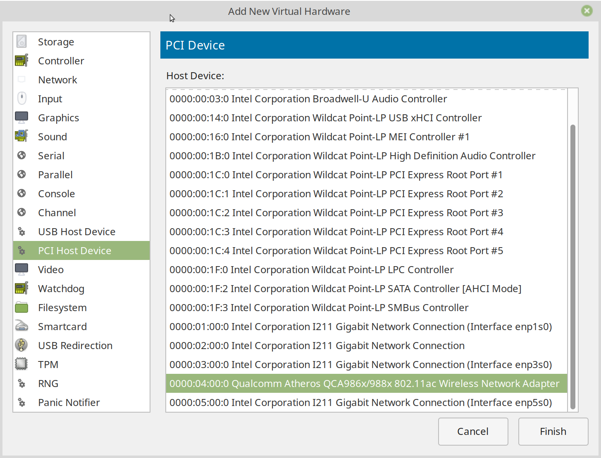

在草民这块儿主板上，直通 PCIE 设备没有遇到任何问题，非常顺利。通进去之后 OpenWrt 很快自动识别到了无线网卡，按常规方法配置好 SSID 密码之类即可正常使用。

### IOMMU Group Breaking Up

草民自己的是非常顺利，但是同事的方案就遇到了比较大的麻烦。

同事选择的是 ASRock 的一块儿 J3455 的主板，主要的问题是，绝大多数设备都被分到了一个 IOMMU Group 里面，比如 [Any ideas why all PCIe ports are assigned to the same iommu group?](https://www.reddit.com/r/VFIO/comments/63j1p7/any_ideas_why_all_pcie_ports_are_assigned_to_the/) 里面说的这样，主板上的 M2 插槽，PCIE 插槽还有 SATA 控制器以及有线网卡都被分在了同一个 IOMMU 组里面，那就需要把这些设备一股脑通进同一台虚拟机中，而这样操作很明显是不可接受的。

帖子里面提到的解决方法是安装打了 ACS Override 补丁的内核。于是找到了一个地址 [https://queuecumber.gitlab.io/linux-acs-override/](https://queuecumber.gitlab.io/linux-acs-override/) 提供预先编译好的带 ACS Override 补丁的内核，选一个版本安装，然后在内核命令行里面添加对应的参数 `pcie_acs_override=downstream` 即可。

但是就这一块儿主板来说，这一个补丁似乎并没有效果。仔细看了看上面的那个帖子，里面提到要对 ACS Override 补丁再做一些调整，具体是删掉其中一行 if 里面的一个条件。

```c
/* Never override ACS for legacy devices or devices with ACS caps */
if (!pci_is_pcie(dev) ||
    pci_find_ext_capability(dev, PCI_EXT_CAP_ID_ACS))
        return -ENOTTY;
```

需要把这个 patch 中 `pci_find_ext_capability(dev, PCI_EXT_CAP_ID_ACS)` 这一个条件去掉。修改这个 patch，删掉这一行和上面的 or 运算符，补一个小括号，然后把上面行号也减掉 1（为什么这么改，可以了解一下 patch 文件的格式）。之后的事情就是 Clone 下来 Linux 内核源代码，`git apply` 这个 patch，然后花一个多小时重新编译内核。

从重新编译好的内核启动之后 IOMMU Group 顺利拆分，虚拟机也可以正常启动，无线网卡可正常识别正常使用。除去之后内核即使是小版本的升级也会比较麻烦之外，问题基本解决。

### DKMS

同事的存储在我之前的建议下使用了 ZFS。不像 ext4 btrfs 这样的文件系统，ZFS 没有原生 Linux 支持，需要编译成内核模块 insmod 进内核才能正常使用。为方便起见 ZFS 支持 DKMS，也就是说更新内核的时候可以自动重新编译出新的内核模块。而由于我们上面重新编译了自己的内核，DKMS 可以说很不意外的炸了，具体怎么炸的我目前也不是特别了解。

同事目前自己拖了 zfs on linux 的源代码下来，使用非 DKMS 的方式进行编译，目前可以正常使用。DKMS 的问题之后有空再尝试修复吧。

## 主机与虚拟机的网络配置

一般来说给虚拟机连接网络，方式不外乎三种：三层上做 NAT，二层上做桥接，一层上直接把网卡直通进虚拟机。Hyper-V 和 KVM 对这三种方法都能很好支持，当然会有一些细节在里面。

### Hyper-V

Hyper-V 会自动创建一个 NAT 方式的适配器，一般新建虚拟机的时候直接选择这个，虚拟机就可以连接网络了。

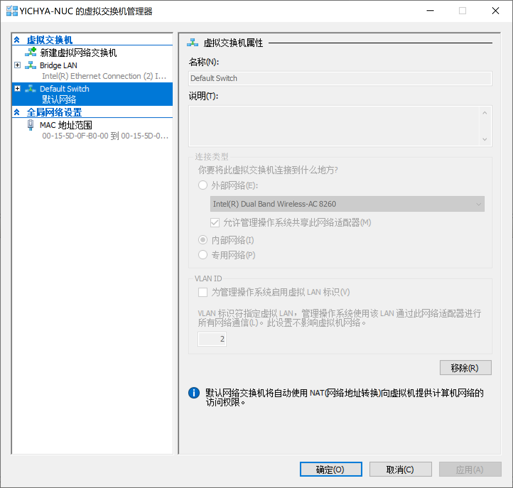

Hyper-V 也可以很容易的实现桥接方式，新建一个外部交换机，然后选择需要桥接的设备即可。

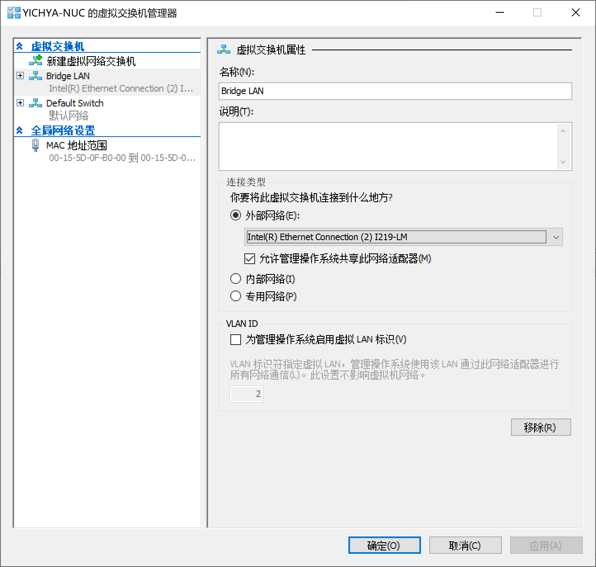

另外，也可以像上面说的那样直接把物理设备直通进虚拟机，步骤就不再赘述。服务器版 Windows 的 Hyper-V 在使用桥接模式的情况下，可以选择启用 SR-IOV 进行网络设备虚拟化，原理与直通很相似，性能水平也基本接近。

### KVM

KVM 配置网络的方法很多，不过大体上跟 Hyper-V 也基本上一样，同时支持包括直通网络设备、桥接、NAT 三种方式。当然实际做起来比 Hyper-V 稍微复杂一些。

默认情况下 virt-manager 也同样会创建一个 NAT 方式的网络，新建虚拟机的时候直接选定即可。

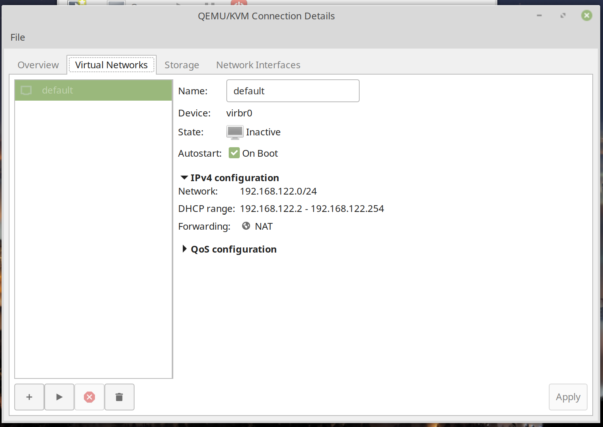

KVM 也可以使用桥接的方式。创建一个桥，然后选定要桥接的设备即可。

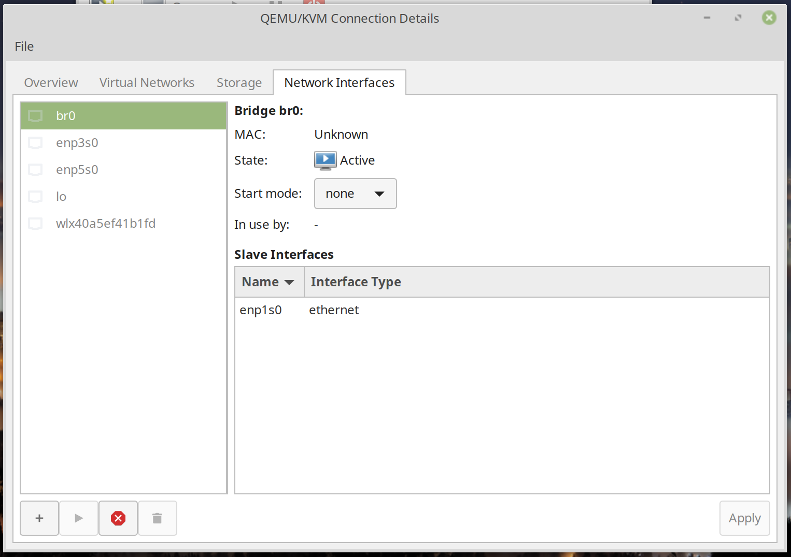

一般来说桥接是比较好的做法，性能比较好的同时也方便从入户的 NAT 网关配置端口转发。比如我的 OpenWrt 上就配置了 ssh 和 OpenVPN 的端口转发，因为帝都联通有公网 IP，直接从公司连回来延迟很低（平均不到 10ms），带宽也不错，甚至可以尝试进行 Steam 串流。

不过桥接也有两个问题：

* Host 开机会慢一些，主要是需要等到虚拟机启动建好这个桥才行
* 跟 Docker 会有一些冲突，具体原因可以看 [Docker breaks libvirt bridge network](https://serverfault.com/questions/963759/docker-breaks-libvirt-bridge-network)，简单做法，可以通过添加下面这些 sysctl 参数解决：

    ```
    net.bridge.bridge-nf-call-ip6tables = 0
    net.bridge.bridge-nf-call-iptables = 0
    net.bridge.bridge-nf-call-arptables = 0
    ```

    然而还是有问题：一般来说设置这些参数的 systemd target 在 Docker 前启动，Docker 一启动就会把这些参数又覆盖掉，所以每次开机还需要手动 `sysctl -p` 一下。当然我使用的时候就比较省事，因为也不怎么用 Docker 就直接卸了。

除了直接这样创建 Bridge，还可以通过 macvtap 的方式，效果与 Bridge 类似。

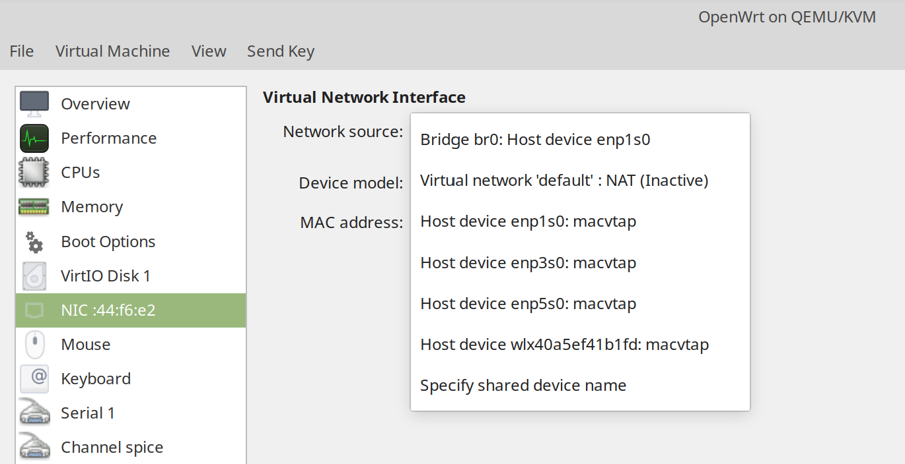

不过 macvtap 有比较大的局限性，主要是不能实现 Host 和 Guest 互相访问，因此一般情况下很少使用。

另外，若想在虚拟网络设备上达到比较好的性能，需要选定 virtio 网络设备，同时 OpenWrt 也需要正确添加 virtio 网络设备的支持。

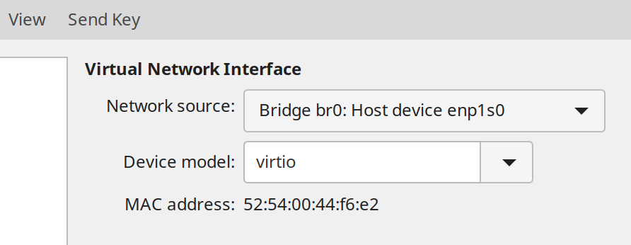

除此之外 KVM 也可以直通网络设备，步骤跟直通无线网卡是一样的，就不再赘述了。

# 存储部分

NAS 毕竟 Storage 才是大头。本来是希望使用黑群晖之类比较靠谱的 NAS 操作系统，但是仔细考虑之后觉得好像也没有很大意义，所以还是直接由 Host OS 来做管理，包括 Samba、PT 下载之类的这样配置起来也容易些。

目前选定的文件系统是 btrfs，原因主要是觉得高级特性比较多，Docker 可以直接做 graph driver，支持快照方便备份数据、子卷方便空间共享，而且实际性能也没有比 ext4 差很多（当然主要是我对性能要求也没有特别高）。当然实际用下来发现有个比较烦的问题是 btrfs 每半分钟要 sync 一次，这样我的硬盘始终没有机会停转，不节能，而且噪音也略大。当然目前 5400rpm 的硬盘本身噪音也并不是很大，所以这个还是忍了。

## 空间划分

由于之前硬盘挂过一次，现在对数据不可能再随心所欲。仔细思考了一段时间，应该如何对待我的数据。

目前想的方案是这样：硬盘格式化容量大约是 9.09TB，90GB 拿去给 Host OS 当 /home，剩下 9TB 凑个整，直接划成一个大 btrfs 分区，然后在里面建立三个子卷：

* Public：可以和室友共享的数据，包括一些电影、镜像之类资源，并且丢了也不会觉得心疼。室友可以直接连接 NAS 的 IP，就可以看到共享分区，并且随意读取其中的资源，不过修改是不被允许的。
* Private：不能随意共享的数据，包括一些照片、文档等。不过由于不是很重要，丢了也不会觉得可惜。
* Critical：很重要的数据，不能共享，不能丢失，量一般来说不大。这些数据采取自动同步到网盘的方式来保证数据安全（OneDrive 出问题的可能性还是很低的）。只要 OneDrive 和草民的 NAS 不同时出问题，数据就不会丢掉。

因为使用了 btrfs，这三个子卷共享总共 9TB 的空间。不用费心思考虑哪个分区有多大，使用起来十分方便。

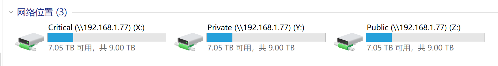

个人觉得这样的方式应该可以满足草民绝大多数情况下的需求，因此方案共享出来给大家参考。

## 共享文件系统

共享文件的方式，简单起见使用了兼容性、性能都比较好的 Samba。与虚拟机互通数据的需求则使用 Plan 9，Plan 9 使用非常方便，不过性能比较差，目前我基本上只用于比较方便的更新虚拟机中的 OpenWrt。

### Samba

Samba 的配置教程到处都是，无非是 apt 安装，修改配置文件添加共享，做好权限控制（包括可见性），配置好 smbpasswd 之类。具体步骤就不再赘述了。

### Plan 9

Plan 9 使用十分简单，不过需要对 OpenWrt 内核添加 kmod-9p 这个模块才能使用，这个无论是自己编译进内核还是 opkg 安装都可以。

在 virt-manager 里面添加一个共享，像下图这样配置。

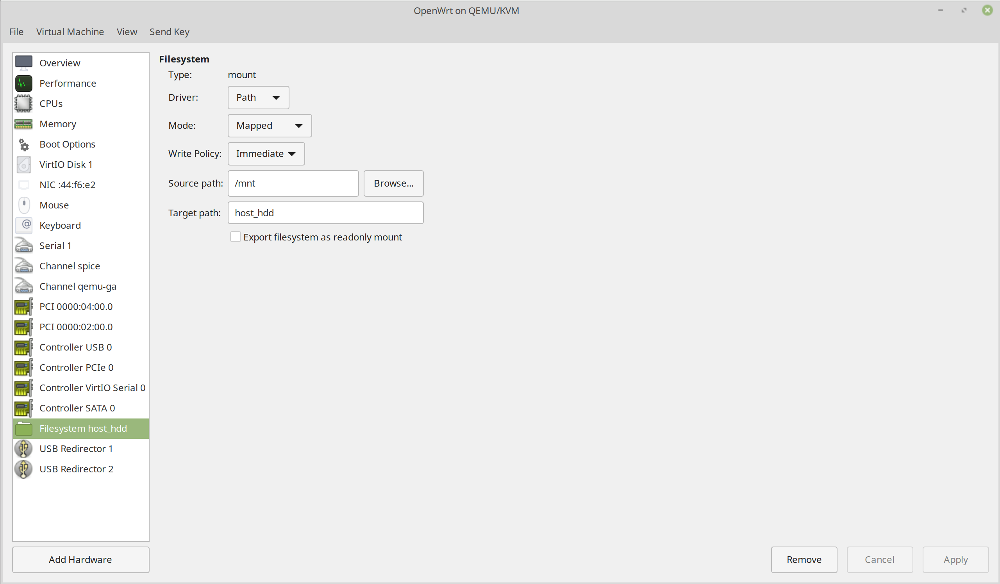

OpenWrt 的挂载点还不能自动识别 9P 文件系统，因此需要写到 Startup 里面：

```
mount -t 9p host_hdd /root
```

重启就可以在挂载点里面看到了。

```
root@LEDE:~# mount
/dev/root on /rom type squashfs (ro,relatime)
proc on /proc type proc (rw,nosuid,nodev,noexec,noatime)
sysfs on /sys type sysfs (rw,nosuid,nodev,noexec,noatime)
tmpfs on /tmp type tmpfs (rw,nosuid,nodev,noatime)
/dev/loop0 on /overlay type f2fs (rw,lazytime,noatime,background_gc=on,discard,no_heap,user_xattr,inline_xattr,inline_data,inline_dentry,flush_merge,extent_cache,mode=adaptive,active_logs=6,alloc_mode=reuse,fsync_mode=posix)
overlayfs:/overlay on / type overlay (rw,noatime,lowerdir=/,upperdir=/overlay/upper,workdir=/overlay/work)
/dev/vda1 on /boot type ext4 (rw,noatime,block_validity,delalloc,barrier,user_xattr)
/dev/vda1 on /boot type ext4 (rw,noatime,block_validity,delalloc,barrier,user_xattr)
tmpfs on /dev type tmpfs (rw,nosuid,relatime,size=512k,mode=755)
devpts on /dev/pts type devpts (rw,nosuid,noexec,relatime,mode=600,ptmxmode=000)
/dev/vda1 on /mnt/vda1 type ext4 (rw,relatime,block_validity,delalloc,barrier,user_xattr)
host_hdd on /root type 9p (rw,sync,dirsync,relatime,access=client,trans=virtio)
```

## OneDrive 同步

我使用的是这个 [https://github.com/abraunegg/onedrive](https://github.com/abraunegg/onedrive)。

按说明编译，安装 systemd service 并配置好自动启动即可。教程还是很详细的。实际使用，写进 Critical 分区的数据每 45 秒会同步到 OneDrive 一次，每五分钟会从 OneDrive 拉取变更，基本可以满足我的需求。

## IPv6 + PT 下载

搞 NAS 最主要的用途还是存放电影、镜像之类资源，毕竟说真的，不能丢的资源还是少数，多数情况下还是娱乐为主。之前在学校的时候有睿思，下东西那叫一个爽，现在睿思没得用了，不过还可以尝试一下北邮人 PT。折腾了一段时间，目前还算稳定，下载速度尚可。

帝都联通从去年下半年就开始嚷嚷着有 IPv6 支持了，然而反正是我到现在都没有见过 IPv6 地址。所以还是得想法子自己搞一个。因为入户设备本身是个 NAT 网关，虽然有公网 IP，但是经常改变，而且也不一定能在上面跑 6in4 这样的协议，所以还是只能考虑用隧道方案。常用的方案有 6plat 和自己架代理两种。

### 6plat

6plat 比较简单，成本也很低。随便申请一个 6plat 的账号，然后会得到一个 OpenVPN 配置文件，用它连接就可以得到一个 IPv6 地址了。当然如果想在内网使用，除了在 OpenWrt 里面连 OpenVPN 之外，还需要再配置一下 IPv6 NAT。把下面这行写在 Firewall 的 Custom Rules 里面即可。

```bash
ip6tables -t nat -A POSTROUTING -j MASQUERADE
```

### Proxy

之前 6plat 还可以正常上北邮人，但是后来因为某些原因 6plat 的地址段被全都屏蔽了，所以只能换用自己架的方式。

自己架的方式需要有一台 VPS，最好本身就有 IPv6 地址（比如 vultr 的很多都有）。没有 IPv6 地址的话则稍微复杂一点。

首先到 [https://tunnelbroker.net/](https://tunnelbroker.net/) 申请一个免费的隧道。

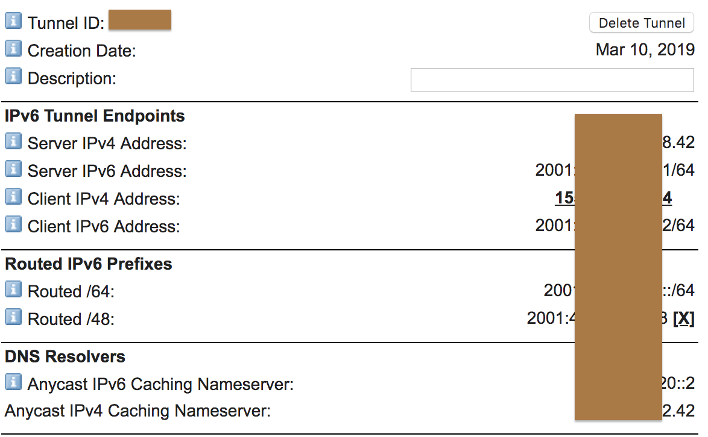

如果是 KVM Linux / Windows 的话，基本上照着 Example Configurations 里面的配置抄一下就可以使用了。对于 Windows 来说，可能还需要关掉 Routing and Remote Access 服务，否则这个隧道可能不定时抽风，而且这个命令每次开机都要重新打一遍，挺费事儿的，建议还是用 Linux。

如果是 OpenVZ 方案的话，则需要首先联系客服打开 TUN / TAP 支持，然后使用这个 [https://github.com/Blaok/tb-userspace](https://github.com/Blaok/tb-userspace)。虽然这个代码看起来也确实是比较可怕，不过好在运行起来十分稳定。修改配置文件把隧道的配置写进去：

```
INT=tb
SERVER=<Server IPv4 Address>
LOCAL=<Client IPv4 Address>
ADDR64=<Routed /64>
ADDR48=<Routed /48>
MTU=1480
```

再按照说明安装好 systemd service，配置服务开机启动就行了。

```
# ifconfig tb
tb        Link encap:UNSPEC  HWaddr 00-00-00-00-00-00-00-00-00-00-00-00-00-00-00-00
          inet6 addr: <Routed /48> Scope:Global
          inet6 addr: <Routed /64> Scope:Global
          UP POINTOPOINT RUNNING NOARP MULTICAST  MTU:1480  Metric:1
          RX packets:54201409 errors:0 dropped:0 overruns:0 frame:0
          TX packets:71461688 errors:0 dropped:0 overruns:0 carrier:0
          collisions:0 txqueuelen:500
          RX bytes:56603544261 (56.6 GB)  TX bytes:25960610719 (25.9 GB)

# systemctl status tb@he
● tb@he.service - User Space Tunnel Broker
   Loaded: loaded (/etc/systemd/system/tb@.service; enabled; vendor preset: enabled)
   Active: active (running) since Sun 2019-03-24 08:22:10 EDT; 1 weeks 6 days ago
 Main PID: 19093 (tb-userspace)
   CGroup: /system.slice/system-tb.slice/tb@he.service
           └─19093 /usr/local/bin/tb-userspace tb <Server IPv4 Address> <Client IPv4 Address> sit

Warning: Journal has been rotated since unit was started. Log output is incomplete or unavailable.
```

VPS 有 IPv6 地址了，然后就需要一个 SOCKS5 代理到本地。其实就是一个梯子，这个随便用什么方案都行，可以参考之前的 Broken Ladders 选择最好的方案。目前我使用的是 V2Ray ws + tls + cdn，速度很快。

### Downloader

最后需要一个能够通过 SOCKS5 代理连接 Peer 的 BT 下载软件。Windows 的话直接用常见的 uTorrent 就可以，Linux 的话 Transmission 是不支持的，建议使用 Deluge。安装方式就不赘述了，apt 即可，然后配一下 web 管理界面的开机自启动。最后在 Web 界面里面配一下 Deluge 的代理即可。

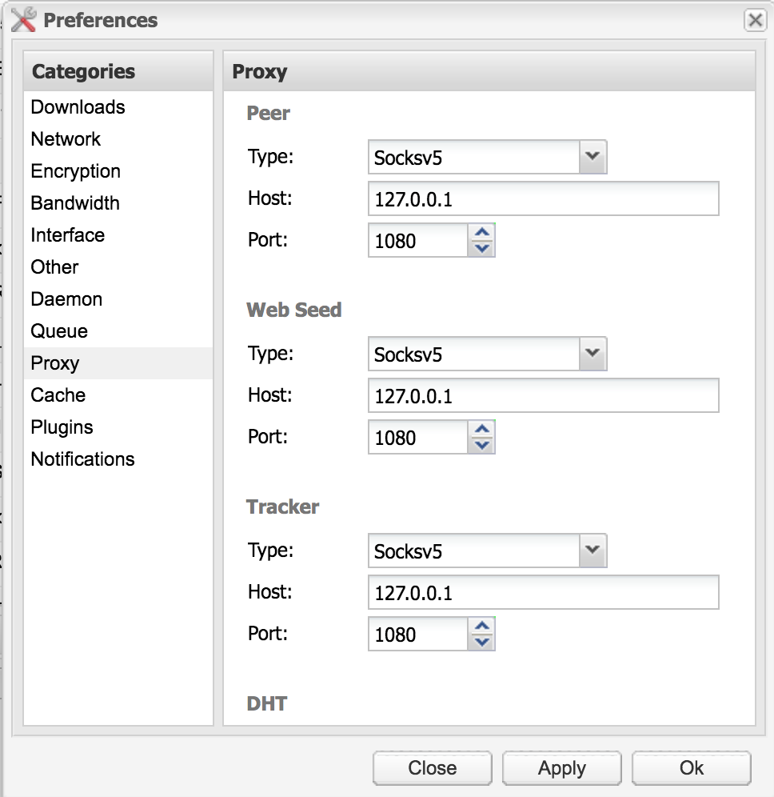

