最近一个来月，充满了魔幻。

因为各种原因，主要还是草民父母这边的关系，选择跟小姐姐分开了。为此事，这辈子做了第一次心理咨询。结果说实话，也没有太好。

后来她发来这个，并且说，「确实是这样的。没必要再消磨下去了。」

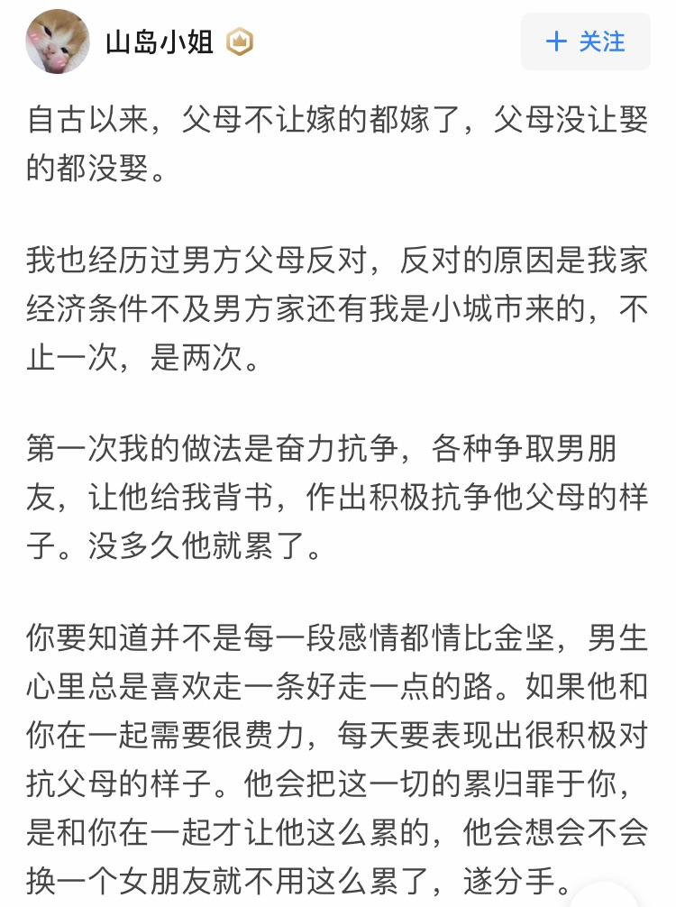

至少没到反目成仇那一步，已经能算是万幸了吧。想来想去，确实是很多事情都做的很不好，也确实是有心无力了。

本来因为这事，近一个月根本就没心情做任何事情，只想逃离现实。就连工作都没什么进度，更别提写什么年终总结了。恰逢 nCov 肆虐，回家之后闹的更凶。折腾几日下来，居然又见到了很多极为魔幻的事情。

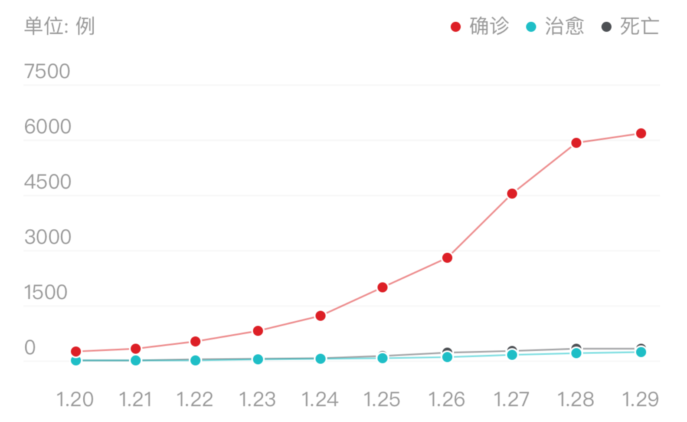

按说也不是第一次了。确实，很多事情都不是第一次了，这么一想，更觉得魔幻。

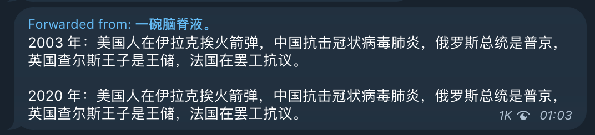

说起来，2003 年草民实在是个小屁孩，啥都不懂，唯一的印象是当时大约是五一还是什么时候放假，假期延长了好多天，然后改成了隔天去学校上课。这次也是，春节假期延长三天，有的地区更是直接要求二月十号才能复工。所谓「覆巢之下，焉有完卵」，举个例子，跟小姐姐要说还剩一件什么事情，也无非是那边的房子还没转租出去。本来觉得春节过了事情应该很好解决，况且还有她的闺蜜也有意向，现在一看，这事儿反倒变得棘手。虽然草民真的是有觉悟的了。

总结还是写吧，只不过肯定不会分享到空间或者朋友圈了，Telegram Bot 的推送应该也会删掉，总之，全篇负能量的东西，看见的人越少越好吧。

# Life

从七月份认识，到春节前分手，这半年其实跟小姐姐还是颇经历了很多事情的。光说四处转转，近的去了颐和园，远一点的去了杭州（对，又去了一次杭州），去了草民一直心心念念的西塘，而且确实感觉非常好。虽然有一些莫名其妙的插曲略微影响了一些体验，不过还是觉得很好。可能的话，有空再去多住几天也好。

*西塘，夜景，个人觉得，确实比乌镇好太多了*

就放这一张吧，多了也不过徒增伤感。而且其实今年也没再去什么别的之前没去过的地方。

其他还有一件觉得比较难受的事情，G302 终于还是被收走了。

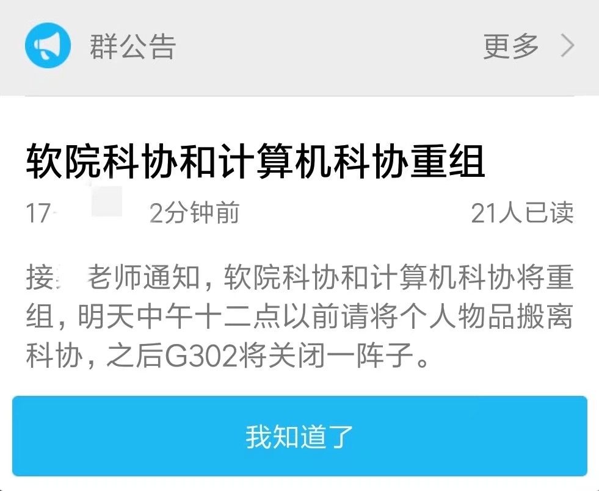

这事儿也确实是不意外，贵校一贯水平。大概六七月份的时候那间屋子里面的所有东西都被清空了，后面听说是新导员准备拿那间屋子开什么校企合作的医学影像实验室之类。也是贵校一贯操作。

顺带着，草民感觉，SSSTA 终于还是走到头了。有一说一，19 年新一届，到现在群里面几乎没有新人说话，老人也很少活跃了。虽然说不意外吧，但是肯定还是会觉得很难受。

两件悲伤的事情过了，也说点开心的。

七月份的时候非常幸运的又见到了以为这辈子再也无缘见面的黄大人。（背景为 @Finley 在帝都的住所）

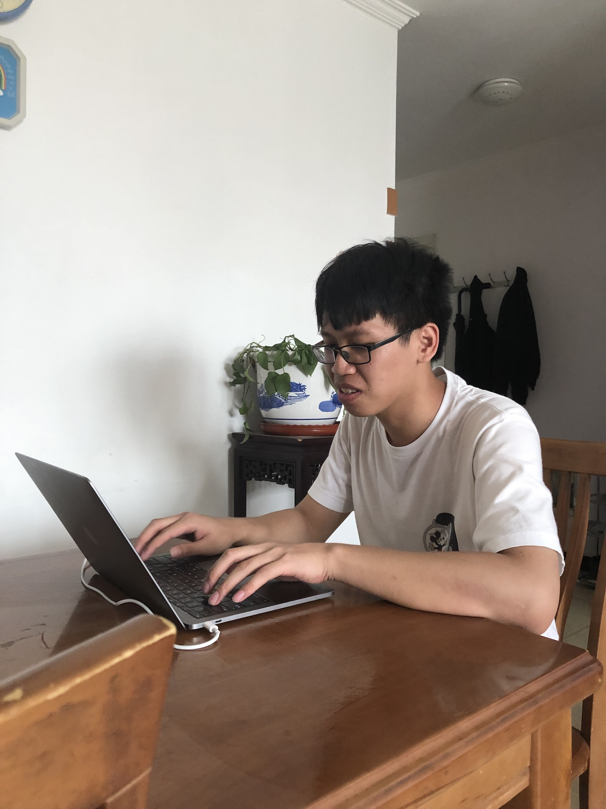

然后是，1.30 回了帝都，补完了爱 5。前面抄袭的事情也没必要洗，这季该追还是追了。

_放这张图主要是，当时看到这个，草民第一反应就是【有内味儿了】_

作为真·大结局，至少算是填了大多数坑，当然又多挖了一个估计这辈子没机会补上的糖浆。

_其实草民还蛮吃这一对的，不过咖喱酱这个表情管理确实看不懂_

看的时候确实真的是找回了之前的感觉，不管怎么说，还是感谢。

# Work

去年其实已经觉得空闲时间在变少，今年更是绝大多数时间都扔在了工作上面。但是其实，回过头来看，大概也就做了两件比较大的事情。一是国际化广告录入重构，彻底脱离旧代码仓库，用 go 重写，草民整个从头搭了架子，做了初期的大部分工作；另一个同事后面接手做了后面一部分工作，安排了测试等等非常大量的事情。前后大概花了八个月终于上线，算是国际化最大的成果。草民大概前面近四个月花在上面吧。当前的工作也还是这项工作的后继，会把更多的东西从旧代码仓库中拆分出来。二是在 galaxy 那边，国内的几个核心表，从业务直连 db 的方式改为通过 rpc 操作 db，草民搭了 rpc 部分，比起上面的重构来说更加辛苦，也因此背了许多次事故，但终于也是花了近半年时间达成了目标。中间还有一些字段管理平台之类小事情，花了一部分时间，但总体来说，基本不值一提了。

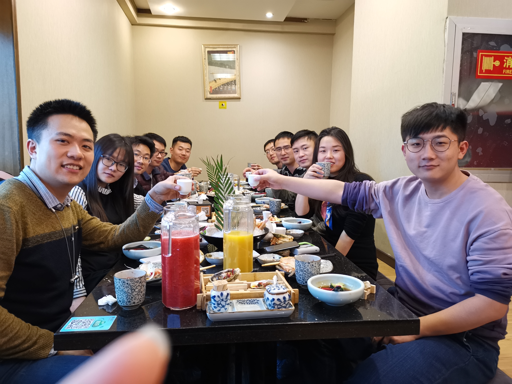

_国际化 team 年初的 tb，里面一个离职了，一个去国内了，又来了几个新人_ 

三月份，人生第一次参加绩效考核，结果要说，确实还算不错，尤其上半年评定去年绩效，总觉得其实都没做什么特别大的事情，但是周围同事评价都蛮高的。但这次说实话，迁库这事儿做的实在是太差劲，草民自己背了一个 P0 一个 P1，其他草民知道的，平台对接的同学背了一个 P0，内容营销也至少有个事故但可能评级不算高。品牌那边本来就不对付，草民那个 P0 也影响了他们，恐怕之后更不对付。这么一想，真的可以说是「把能得罪的人基本上都得罪光了」。非常感谢 Galaxy 这边的大佬们，确实是没少替草民背锅，尤其两次遇到需要修数据的情况的时候都是他们陪着草民熬夜写脚本去刷库，怎么想都实在是觉得过意不去。

说起同事关系，草民在国内做迁库的时候，人手十分不足，无论是我们 rd 还是 qa 那边都是如此。私下一起吃饭，大家也都觉得是乱成一团，加上新来的大佬雷霆手段（有一说一，吃饭点开会是真的难以接受），还有自己要达成的目标上来说，颇有一段时间心理压力非常大。加上最近留意到，近一年，认识的大佬离职了好多个，周围也有熟悉的朋友，转组的转组，找下家的找下家，结合前面那一摊子乱事儿，实在是没法不往坏的方面去想。当然确实，现在翻过去来看，至少从草民的角度来说，工作上的事情，或许可能也算是过去了吧，当然也可能是因为开头提到的事情跟这比较起来确实也不算什么了。

年底又回了国际化，大概三个原因吧，一方面国际化确实缺人，草民去 galaxy 那边算是被借过去的，迁库的事儿完了自然要还回来；另一方面迁库那事儿估计搞得新大佬对草民印象不算好，可能也不太乐意让草民再去负责这块儿；第三个也是草民自己这边的原因吧，那边的底子搭完，虽然后续做异构也算是草民比较感兴趣的，但是草民实在是觉得疲惫，也觉得想换轻松一点的事情了。

<video controls="controls">
  <source type="video/mp4" src="../assets/images/about-my-2019/bowling.mp4"></source>
  
Your browser does not support the video element.

</video>

_大概是十月的某次 tb，第一次玩保龄球_

说句实在话，今年目标混吃等死，不想再像去年一样背什么大锅。当然其实，细数下来算得上大锅的也就那么几口。素材部分早早就划出去了，pack 年底也因为 boss 产假划出去了，平台这边剩下的，说到底无非那么几个东西，galaxy，录入业务，账号业务。galaxy 费了老鼻子劲儿搞定，之后大概率就没草民啥事了；国内创编有国内那些经验丰富的大佬扛着，自然没草民啥事，说实话也懒得掺合；账户这块儿算是固定方向，大概率不会有草民啥事儿。跟草民关系最大的，国际化创编 19 年一年费了老鼻子劲儿完工，今年四月大体搞定上层迁移，技术债务基本还完，之后估计除去正常业务迭代，剩下的也就是些零碎事情。下半年完成混吃等死的目标，多照顾照顾自己的心情，挺好的。

但确实得说，18 年选择去国际化，确实是正确决定。虽然说友商搞事这种事情没再发生（至少现在不记得了），但是有一点好是，在这个方向进行的努力和看到的成果，起码让草民能对这个团队还能有一些希望。国际化毕竟担子轻，业务体量小一点，服务化起步早一点，起码现在搞迁移，能数清楚 145 个接口，其中最重要的几十个都是直接走上面录入重构 rpc，迁移就是挪一下（当然涉及到 diff 之类保证正确性的事情，那个就又不得不吐槽一下 qa），要不是因为疫情的问题实在缺人，进展应该非常快。

虽然对工作抱怨了这么多，但是同组的同事确实都很 nice，无论怎么说，感谢他们。

# Escaping

特别认真的想过跑路。完全逃避现实的那种跑路。

18 年奶奶去世的时候回老家，当时见到了某个据说在村子里最德高望重的长辈，他说草民「之前的生活基本都一帆风顺，没遇到过什么挫折，还需要磨练」。当时草民还没太当回事，心里觉得「可拉倒吧，怎么就一帆风顺了」。现在回想起来，确实如他所说，之前那些事情跟现在草民遇到的事情完全没有什么可比性。而且也确实，草民抗压能力实在还是太差了。

一直不愿意留在北京。想过去成都或者武汉。当然现在闹了这一波 nCoV，武汉政府这波骚操作下来，反正草民可能就不想了。

今年九月份那会儿压力特别大的时候也想跑路。当然当时主要也是压力实在太大，现在其实想了想，或许也没有那么严重吧。

然后又是现在这档子事儿。分手就很绝望，意识到这种事情不得不听父母的，就更绝望。也不是没有抗争过，但是说实话，结果只是更加更加绝望。

现在真的觉得已经到承受水平的上限，再多压一根稻草，可能就真的坚持不住了。想想也是，工作不顺，生活不顺，如果人生是游戏，早该读档重来了。

目前的想法，真的跑路的话也就两种打算，一是直接内部转岗去成都，二是辞职考研。之前也有听说过苏州微软的事情，而且有之前的学长、同事之类都在那边，也是有些想考虑，但是还是觉得可能难度偏大，按现在想逃离现实的主要目的来看，可能也不是特别合适吧。

也跟父母说了，年后要认真做把户口迁移到成都的事情，但这事儿又不知道什么时候才能真的执行下去。

定个时间吧。去年年终奖是四月中旬发的，拿到年终奖的时候，如果心态还没好转，还是觉得很悲观的话，就真的逃离现实，认认真真休息一段时间，然后去一个新的城市开始新的生活。

# Events

一样，药丸的一年，实在是没啥特别可说的。跳过。

估计以后如果没有什么特别特别值得一提的事情，就删掉这个部分了。

# Gaming

今年空闲时间比去年更少，尤其下半年更是如此，因此虽然买了好多游戏，甚至还买了 XBox，但其实大多数游戏都是浅尝辄止，大概也就还在坚持玩痒痒鼠。买了青行灯和御馔津的大手办，还有些呱太盒蛋之类，增添点生活情趣。

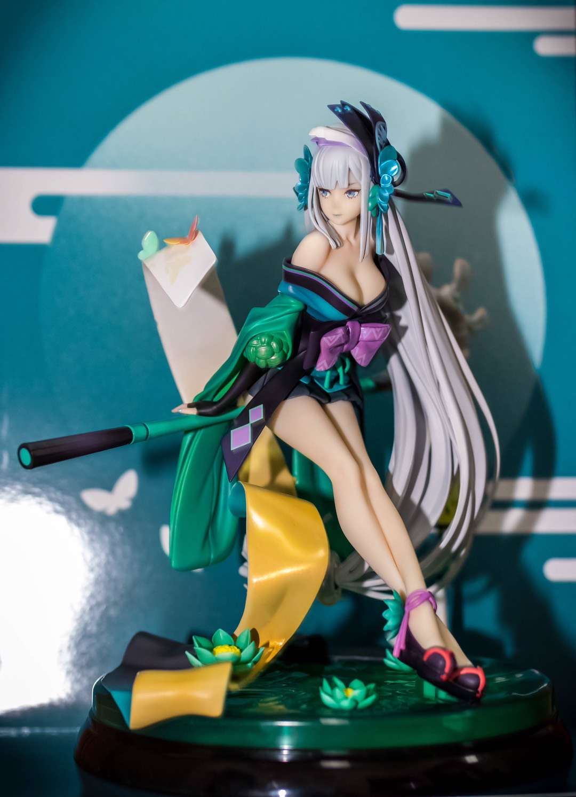

说起来御馔津连照片都没来得及拍一张。

另外有个还蛮值得一提的，今年去了 GCores 的核聚变，顺便跟大炮面基。

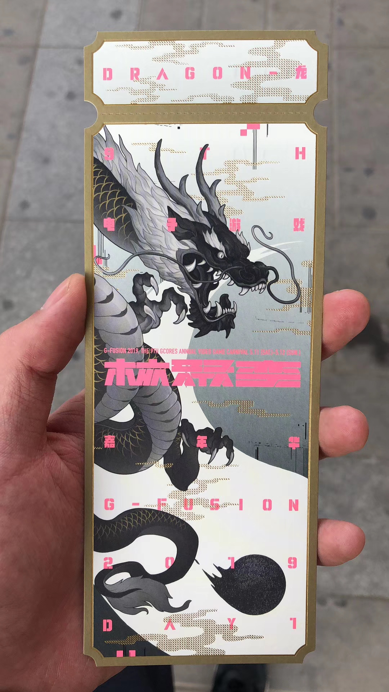

选边的脸比较黑，纪念品就木有了。人是真的多，排队模拟器，上面那些各种挑战根本排队等都等不过来。不过还是尽量把独立游戏区都转了转，然后把所有的签凑齐了（笑

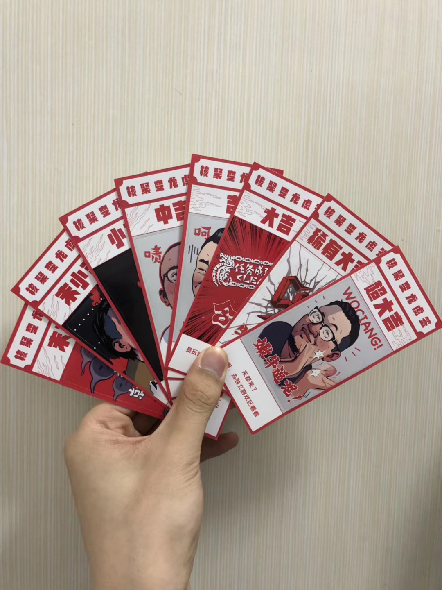

排队模拟器反正是真不想再去了，而且游戏玩的那么菜，凑啥热闹，在家躺尸不香嘛。

另外，春节假期延长了几天，为了逃避现实开始沉迷地平线。确实是好游戏。

最后还是比较期待四月（划掉）九月份的 2077，买了 Steam 和 XBox 的。还有希望我仙今年真的有七吧，幻璃镜反正是真的死了，最近两年几乎除了搞周边、做授权之外，都没看到有啥像样的东西了。

# Devices

东西还蛮多，选几个有代表性的好了。

* **Corsair One i160** 看了 LTT 安利，为了省下关税，趁同事出差美国请他带回。大概花了 2.7w 的样子。性能确实很不错，不过 GPU 显存、供电部分的风扇坏了，又没法送回去修，自己串了个电阻降低转速之后勉强接着用。
* **Samsung Galaxy S9** 也不知道为什么想换手机但是就换了。锤子出给了同事。奔着 Dex 还有上面的 Linux 去的，但是实际发现并不怎么用这俩功能。过不多久 S9 升级 Android 10 应该也就没有 Linux on Dex 了，也无所谓。哦当然 Knox 也是很重要的，但实际用下来感觉似乎也就是炼妖壶而已？
* **iPhone 8** 淘汰了 SE，也出给了同事（跟上面是同一个）。右下角翘屏，气疯了。其他没啥特别的，用起来挺舒服。
* **AirPods 2** 淘汰了一代，也出给了上面同一个同事（他可真惨）。一样没啥特别的。
* **iPad Mini 5** 淘汰了去年的 iPad 2018，出给了同学（终于不是上面的那个同事了哈哈哈哈哈哈）。很不错，除了 iPadOS 太弱鸡了。
* **Robomaster S1** 小姐姐送的。体验确实很不错，拿来吓唬她的两只猫很有趣（雾。非常可惜，几乎没有时间玩（毫不意外，毕竟要是有时间玩，草民早就自己买了）。
* **路由器** 虽然已经有 nas 了但是还是忍不住剁手。
  * 一个 NetGear R7800，洋垃圾，原装壳子估计过关的时候被打孔了，买家另外定制的铁壳。这几天在家用，官方固件，体验极差，接着吃灰吧。
  * 一个 Mikrotik hap ac2，高通方案，主要奔着 RouterOS 去的。实际体验不错。
  * 一个竞斗云，据说是高通某个实验开发版废弃的。刷了 OpenWrt，配了透明代理啥的，用起来还凑合。送给小姐姐了。
* **XBox One X** 黑五几乎六折左右入手，虽然说今年年底可能就有新一代主机了，但是还是并不觉得亏。顺便申请了招行的双币卡，买了 XBox Game Pass Ultimate 订阅，好多好游戏。
* **WD Elements 12TB** 杀鸡取卵，奔着里面氦气盘去的，当然价格便宜也是很重要原因。去年买的 10TB 监控盘塞回母鸡肚子里，一切正常。

还有些其他的小东西，ESP8266、Cherry MX 8.0、ODroid Go、Nokia 8110、GoPro Hero 7、ChainedBox 之类，不重要，不再列举了。

# Projects

Haskell 学习计划凉了。也不太打算接着学了，感觉脾气合不来。

基本上也就是还在维护自己的 openwrt V2Ray 和透明代理插件，详情可以翻翻 Broken Ladders，最下面有链接。

其他的，给 Flowerss（[https://github.com/indes/flowerss-bot](https://github.com/indes/flowerss-bot)）贡献了两个 commit，修了个小问题，大概算是第一次参与开源项目开发，说出来也真是惭愧得很。

# Finally

今年终于等到了不才的第一张专辑。还在想为什么去年的总结没提到蚍蜉渡海，仔细一想，那已经是 2017 年十月份的事情了。买的时候晚了十分钟，没有签名，难受。

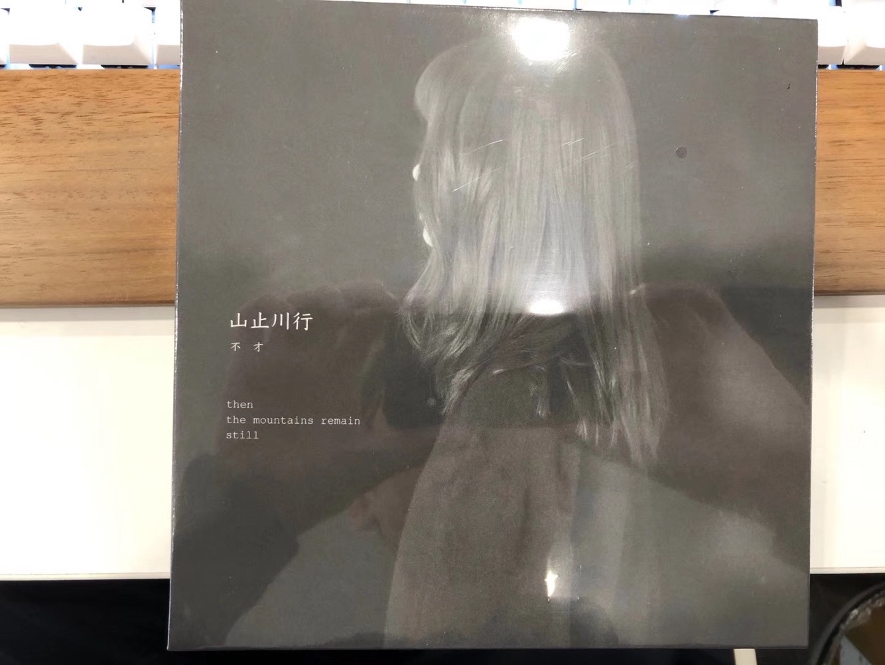

《寻常歌》作为先行曲，其实八月份就放出来了，可惜当时没能理解歌词的含义。现在真的，「当时只道是寻常」。

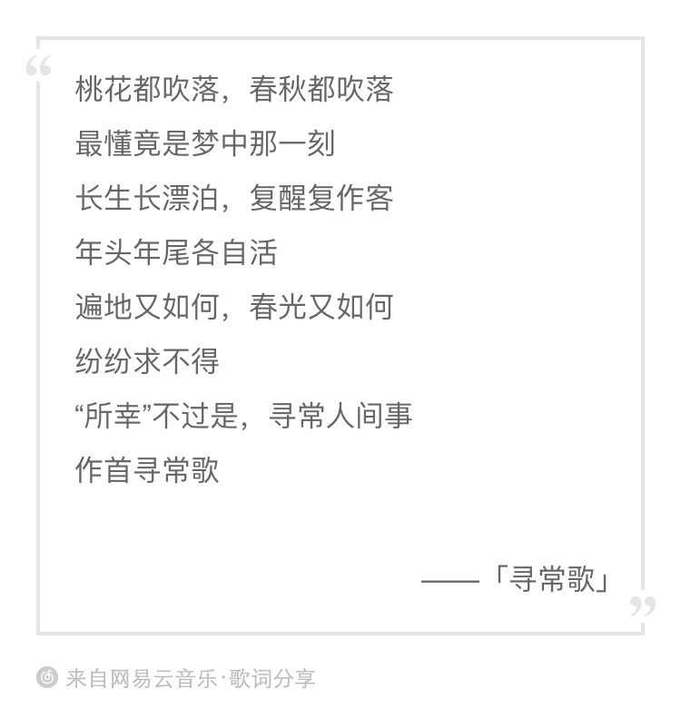

版权问题，没法嵌播放器进来，如果真的有人看到这里的话，点下面的链接就好。

[https://music.163.com/song?id=1383011136&userid=63706128](https://music.163.com/song?id=1383011136&userid=63706128)

现在是 2.22 号周六 02:22，算下来从 2.3 开始在家远程工作已经两周有余了。体验最深的是，家里的工位实在是很难受，椅子没有头枕，桌子角度很奇葩，几天下来，脖子十分难受。

最近作息是彻底完蛋，早上十点半晨会费好大力气才能起得来，中午吃完饭可能睡到两点半或者三点，晚上吃完晚饭就开始犯困，往往会撑不住睡上一两个小时，然后醒过来，熬夜到四点甚至六点才能勉强睡着。如果工作时间还有面试的话，那就更令人绝望。

中间有过两三天吧，晚上实在是睡不着，又不知道能干啥，就干脆起来干活，直到脖子开始抗议或者捕捉到那么一点睡意，再躺到床上去玩手机。晚上时间基本整块，没有莫名其妙的事情打断进来，效率很高。这样的经历让草民想起了之前还在学校的时候的很多事情，尤其是在 G302 爆肝的不知道多少个夜晚。

爆肝。多么熟悉的一个词。又是一个不知道被遗忘了多久的词。但确实也是因为有这样的经历，草民也突然明白了自己目前真正想要的。多少个日日夜夜都在想的事情，现在终于有勇气去做了。

列举一下今年想完成的几件事吧。

* 全年目标，混吃等死
    * 工作上真的想做的事情还是真的做吧
* 上半年拿到绩效结果后，无论怎样，给自己放个假，独自一人出去走走，计划大概是烧掉剩下的五天年假，不够的话病假补上
    * 选个周五，晚上下班坐卧铺，第二天早上到西安，呆一天，去学校和阳光天地转转
    * 周日早上坐西成高铁，想了很多次的朝天站，选个下雨天，坐高铁去，在那里呆三天吧，那边也多少有些算得上景点的地方。

    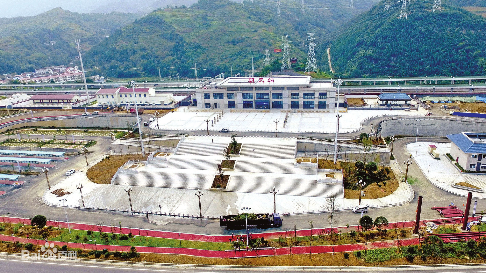

    * 然后周三，上午高铁去成都，办户口，办完去东郊记忆之类地方走走，呆两天吧
    * 周五随便选个交通工具回帝都，周六休息一天周日上班
* 下面这些安排在下半年，要么烧年假，要么国庆，如果真的辞职了的话，那就随意
    * 去一些一直想去的地方看看，比如苏州
    * 再去之前去过但是没能呆太久的地方，比如西塘，住一两天
    * 上面两个都去了的话那不如顺便，上海安排一下，见见老同学，还有创意组同事，如果还能去半次元玩玩就更好了
* 认真考虑扎根成都的事情
    * 如果上半年绩效结果还凑合，考虑长期（一年或两年），组内方向或者转岗
    * 如果上半年绩效结果真的很差，考虑辞职考研（短期）

希望今年过完，真的能彻底跟自己和解吧。
