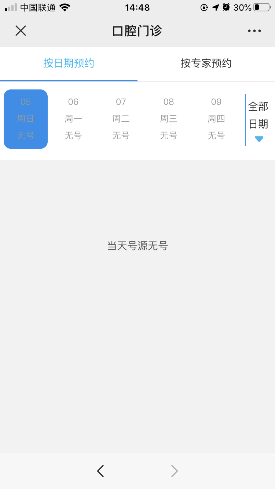

大概是因为长期不算好的口腔卫生习惯 + 疯狂喝可乐的关系，草民的牙齿脱矿非常严重。17 年底第一次洗牙的时候就被指说有脱矿情况，后面越发严重，19 年中旬终于有一颗牙（左上第三颗）的釉质脱落了。于是跑了三趟北大口腔，也总结了自己的一些经验出来。其实也不算什么经验，就是反正住的这么近，晚上熬夜去排个队，早上请个假完事儿回来上午补个觉就是了，然后再搭配一些观察到的各种现象比如哪天哪种号多这样。

这是当时的诊断结果，洗牙的时候护士姐姐还特意强调了「不能再喝碳酸饮料了」。实在是忍不住呀。

另外也是三个医生（牙体牙髓科，牙周科，还有洗牙的护士姐姐）都提了智齿必须拔除的事情，当时本来考虑这个牙补完就趁六月份病假清空处理掉这两个麻烦，结果一拖就拖到现在。

补完之后基本无事了将近一年，除了中间有过几次后槽牙异常疼痛，「上火」那种感觉，不过基本都不太可持续也不太能稳定复现。

然后反正就是今天凌晨的时候突然发现右上第四颗牙又发生了跟上次一样的事情。。。

当时那叫一个难受啊。。。

唯一一点好处是这次倒是几乎没什么感觉，不像上次碰一下都疼，心里还稍微觉得稳一点，

# Make a Plan

反正出这事儿能不拖就不拖，越拖越难受。于是立刻开始考虑解决方案。

## 北大口腔

第一个想法自然还是直接跑去北大口腔排队，反正是清明假期第二天，按以往规律上午十一点怎么也搞定了，随便哪儿吃点东西下午想怎么睡就怎么睡。结果上公众号一看，因为疫情原因取消现场排号，所有都需要预约。。。

实话说这个预约难度简直高于上青天，而且只能预约一个周之后的门诊（之前的根本不可能有号），还得费很大力气抢，直接放弃。

## 海淀医院

于是只好考虑 Plan B，还是觉得说公立医院，有医保，而且靠谱一些这样。所以就去看了之前经常去的海淀医院。

上网看了些攻略相关，比如 [https://blog.timoq.com/2019/07/12/海淀医院补牙/](https://blog.timoq.com/2019/07/12/%E6%B5%B7%E6%B7%80%E5%8C%BB%E9%99%A2%E8%A1%A5%E7%89%99/)，还有知乎上一些问题，感觉好像评价蛮不错的，而且挂号也不是很难，那干脆安排一下。微信公众号走起。

结果口腔科一个号都没有？？？甚至也是最近一周全空了？？？

我本来以为是这个系统完全是废的，但随便点开了其他科室一看又好好的

那反正这个也不知道咋回事，也没什么办法，只好实地跑一趟了。好在看挂号攻略，海淀医院口腔科并不难搞，早上八点前去就行。那反正就早起呗。

## 瑞尔齿科

然后又觉得需要个备用方案，公司跟瑞尔齿科有个啥 py 交易来着忘了，反正咨询一下也不要钱，只要价格不太贵先把问题解决了再说。于是也顺便去瑞尔齿科的公众号上填了个单子。

## 中关村医院

后面又一想，旁边还有个中关村医院，起码也是二级甲等，补个小牙洞还是完全不疼的牙应该没什么难度吧。于是也摸索过去，这个倒是非常顺利的预约上了号，看起来前面人还不算少。心里反正这会儿是有了个底。

## Plan

考虑了一下方案，肯定还是优先海淀医院，中关村现在可以说算是保底，瑞尔齿科反正也就先问问，我当时估摸着最早收到电话的时间也得是九点往后，那会儿我估计要么在补牙的过程中要么已经补完牙了，直接回一个「不需要了谢谢」就完事。

初步考虑，六点起床先去海淀医院看看情况，如果海淀医院可以的话就直接海淀医院搞定，否则走保底中关村医院。计划定下来已经快三点了，当时觉得这三个小时睡不睡也没啥区别，不如干脆填博客的坑。

# Realistic

做完计划就开始刷 b 站了，刷到五点半困的受不了，睡了一会儿。睡睡醒醒起来七点了，出门。

## 海淀医院

先去海淀医院。看着一个人都没有，到门口测体温的地方有个阿姨直接说「疫情期间口腔科不开，走吧」。难怪完全约不到号。。。。。。

## 中关村医院

于是开始往备用方案跑。

人倒是不多。门口简单测了一下体温之类。特意问了一下保安「口腔科开不开诊」，保安说「开」，于是去大厅挂号。

自助取号的地方取不到，去窗口问，前面只有一个人排队也是挂口腔科的。窗口里面的工作人员说「挂口腔科的话得上去要加号」，于是上去二楼，二楼的值班护士说「现在动钻头的都看不了，只能开一些药这样子」。。。

又白跑了一趟，而且有种要凉的感觉。。。

## 其他各种小诊所

从中关村医院出来，大概不到八点。

公立医院全凉凉了，现在也不知道该怎么办。第一个想到的是之前中航对面的物美旁边有一个「天秀口腔」，印象中也是医保定点，所以决定先去了解一下。

_去年五月份的老图了。这个名字反正确实很秀_

到的时候大概八点半。大门紧闭，不过没有锁，门上也没贴什么暂缓营业之类的通知，只有一些正常的「新型冠状病毒注意事项」之类。推门进去，门口遇到一个保洁阿姨，阿姨说「最近不开诊，估计这一个礼拜都没戏，拿个名片到时候先打电话预约一下吧」。凉凉 +1

印象中附近还有好几个口腔诊所，反正还早，也得想想办法，干脆打开高德，周围不太远的几个范围转了一个遍。

看时间差不多九点左右，于是附近转了个来回，这一转更心凉了。

附近有印象没印象的，叫得上叫不上名字的全部关门。。。起初还以为是因为是节假日的上午压根就不开门，但仔细看了一些，大多数贴了营业时间的都没有标注周末不开门，而且牙科诊所这种明显周末生意更好一点（毕竟大多数人可能更倾向于休息日来看牙）。

顺便也跑了一趟天使那边的瑞尔齿科

门上贴了两个告示，上面那张不用说了，下面那张大致是「依照北京市卫健委要求暂时停业，开业时间另行通知」，落款日期好像是 4.2 还是 4.3，所以这样的话大概就能解释为什么所有口腔诊所一律关门了。。。

刚好回去的时候看了一眼微信，瑞尔的客服，稍微问了一下

那反正就凉透了呗。

# Final Solution

看这阵势基本上是凉透了，估计只能去硬着头皮抢下个周的北大口腔预约了。想想这一圈不能白转悠，一方面打卡了这么多家口腔诊所干脆记录一下，另一方面门都出了，也带着身份证之类，干脆去把之前拖了很久的业务办一下。折腾了一圈拍了一顿照片办了一堆业务，快 11 点了，想着找个地方吃点东西然后回去补觉，结果路过了前面看过但是关着门的某一家口腔诊所

看着灯亮了？于是进去看了一下居然真的在营业。。。

前台简单办了点手续，接待的护士说「今天能不能做的话得看有没有忙完，如果能做的话会给你电话，不能做的话就另外约个时间」。似乎有戏的样子。

旁边 kfc 随便吃了点东西当作早午饭，吃到一半电话来了，说 12:20 可以安排。

后面也就基本顺利，护士姐姐虽然全身防护服，戴着口罩，但是眼妆真心好看，令人印象深刻。。。扯远了，补好之后医生针对我的口腔提了几个建议

* 脱矿比较严重，建议定期涂氟化物，每月或者每三个月为宜
* 智齿尽快拔掉（到目前为止，确实每个口腔医生都说这个智齿不能拖了。。。）
* 咬合不是很齐，可以考虑做一下矫正（这个是第一次听说）
* 牙结石（肯定的，一年没洗牙了）
* 前面崩掉的半个门牙处理一下

也问了是否还有其他牙需要补，医生说问题不大好好刷牙就行了。看来还不错。

最后收费 600，虽然比起北大口腔贵了一倍，而且完全不能走医保报销，不过反正问题解决了，价格也能接受。回去睡觉。

# Thoughts

睡了一下午，晚上简单整理一下。

最大的感受，大概还是那句话，「覆巢之下，焉有完卵」。

## Dental Care

之前完全没考虑过新冠会导致无法看牙，主观地觉得可能也就是发热门诊不容易挂号吧，其他门诊应该都正常进行。万万没想到会是这个样子。

当然仔细想这个也蛮正常的，就像上面那家最后解决了草民问题的诊所要求草民签名的免责声明一样，毕竟动钻头可能把口水和血雾啥的喷溅的到处都是（比如像我这种一年没洗牙的，牙龈不怎么好的带一点血很正常，另外，为什么喷溅的明明是草民的血，草民打这句话的时候却很想笑）

草民其实一直还是觉得这事儿跟自己没太大关系吧，因为确实，对草民来说，在家工作两个月，活也没少干，钱也没少拿，习惯了这种模式的话也完全不觉得有什么大不了的；受影响的基本也就是些娱乐活动，比如海底捞没得吃了，电影没得看了，这些都不算什么必需品，忍一忍也就过去了，而且最近堂食也在逐渐恢复，4 号刚吃了好久没吃的温野菜，朝阳大悦城几乎已经恢复了往日的人气。

但真有个迫在眉睫的事情，尤其是还跟身体健康相关，却因为疫情问题受到严重影响甚至差一点就搞不定，那种感觉是真的很难受很难受。

## Breakfast

即便在疫情并不怎么严重的帝都，在全国疫情局势已经得到很大程度控制的今天，想在街边吃个早饭，还是几乎不可能的事情。

九点多的时候本来在想，难得起这么早，而且骑车子绕着中关村转了好几圈，贼累（现在腿还疼。。。今天一天运动量几乎等于之前两个月加起来了），去吃个小馄饨啥的舒服一点，结果到了之前经常吃麻辣烫的小店门口

_人去屋空了，里面就剩一个电动三轮车_

就很难受。

中关村 e 世界底下的 kfc 因为在楼里面，门口保安也拦着不让进，吃的话只能在旁边扫码点餐然后带走。

这么一想这次疫情，很多常吃的小馆子可能就倒闭了，常去的一些电影院之类可能也会特别惨，类似这样的事情可能数不胜数。

## Summary

可能比起很多人来说，虽然都被新冠的恐惧笼罩着，但草民确实相对幸运，至少工作还好好的，身体除了这次这个牙之外也没出什么大问题，牙的问题也很幸运的解决了，但这件事给草民的触动确实还是很大。

> 最初，没有人在意这场灾难……直到它与每个人息息相关。 ——《流浪地球》

最后还是希望一切尽快好起来吧。
