草民公司离家很近，之前用联通宽带，有公网 ipv4，ping 延时大概只有 10ms（可能比很多 2.4g 的无线路由器的一跳还要快），但是带宽不算高，上下都只有 1MB 左右。后来用了一小段时间的移动宽带，没有公网 ipv4 但是有公网 ipv6，公司的环境有的情况下能做 ipv6 nat，有的情况直接也有 ipv6，因此也可以做，只是速度和延迟都比之前差一点。现在又换回了联通宽带，破解了光猫弄了 pppoe 拨号，还做了一些诸如 tinc 这样虚拟局域网的搭建等。后面也做了一些操作系统的升级，踩了一些乱七八糟的坑，这里一并介绍一下相关的事情，权当经验分享。

# 网络升级

之前合租的时候，网络是共享的。入户光纤 300Mbit，千兆口空出来，三个人刚好每人 100Mbit，用起来除了端口转发比较麻烦之外，基本上也没什么大问题。

现在跟父母住，他们的话要求不高，大头主要自己用，所以随便一点，想破解就破解了，也比较顺利，基本一次成功，没遇到太多问题。

## 没网线的几天日子是怎么过的

现在流量毕竟便宜，手头有几张日租卡，在不搞什么流量特别大的应用的情况下勉强撑了几天。

### Nokia 8110 4G

最早的几天是用了 Nokia 8110 4G 的共享网络，搭配一张日租卡。因为有内网穿透的关系，反正勉强也能用


当初买这个玩意儿其实是觉得说这个东西多少算是个智能机器，kaios 也算新鲜，说不定有些可玩性，结果到手才发现真的是啥都没有，telegram 都没有，vpn 都没法连。。。而且电池续航也不怎么样，待机时间跟普通安卓机没啥区别，所以就吃灰了。

### Quectel EC20

后面尝试用了一下之前买的移远的 EC20 模块。买这玩意儿的过程就比较凄惨：

* 第一次买卖家发错货了，发了个树莓派转接板，刚想退货结果卖家下架了……
* 后来又买了一个，到货倒是基本正常
* 结果这个刚拿到，第一次买的卖家就找过来说「发错货了已经重新给您发了新的，旧的麻烦发回来给我们」，但我那几天事儿又特别多，仔细一想有树莓派也可以用一下就干脆补了个差价自己留着了……

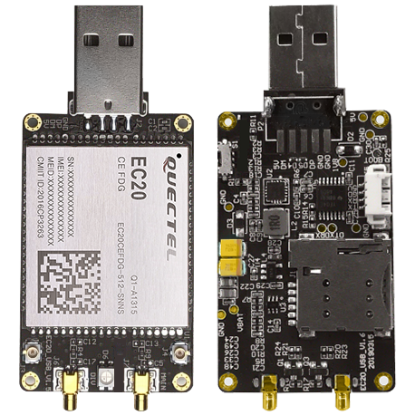

_拆了外壳是这个样子_ 

这东西有好多个版本，具体区别见 [https://laidycy.com/2019/09/08/移远EC20 测评/](https://laidycy.com/2019/09/08/%E7%A7%BB%E8%BF%9Cec20-%E6%B5%8B%E8%AF%84/)，草民应该是分别有一个 CEFILG CEFHLG CEHCLG，不过其实用都一样用，gps 从来没见有过数据，也确实没用到过什么双天线之类的特性。

软件方面淘宝能买到的有三个版本，一个是 CDC ECM 模式的，适合 Linux / MacOS，一个是 RNDIS 模式的适合 Windows。还有一个适合 Android 的，但是我没有买，官方提供的固件（[https://eyun.baidu.com/s/3c2ZU82O](https://eyun.baidu.com/s/3c2ZU82O) 密码：I4WY）的话反正只有 Linux / Windows 的。而且其实，Linux 要支持 CDC ECM 也要额外编译驱动进去，一般有 CDC ECM 驱动的基本都有 RNDIS 驱动，所以建议直接买 Windows 版。草民买的都是 Linux 版，其中一个费了好大力气刷成 Windows 版，刷的过程也是一波三折，后面详细介绍吧。

EC20 用起来大致还不错，就有一个问题，在某些情况下会随机断开连接，然后自动重连，这样像是看 B 站啥的，过程中就经常会突然卡一下。

```
[  334.215687] usb 1-1: new high-speed USB device number 25 using ehci-platform
[  334.925432] usb 1-1: string descriptor 0 read error: -71
[  334.960474] usb 1-1: can't set config #1, error -71
[  334.964214] usb 1-1: USB disconnect, device number 25
[  335.245659] usb 1-1: new high-speed USB device number 26 using ehci-platform
[  335.432339] rndis_host 1-1:1.0 usb0: register 'rndis_host' at usb-ehci-platform-1, RNDIS device, ee:d1:b9:5b:8e:d0
[  335.486727] option 1-1:1.2: GSM modem (1-port) converter detected
[  335.491752] usb 1-1: GSM modem (1-port) converter now attached to ttyUSB0
[  335.499115] option 1-1:1.3: GSM modem (1-port) converter detected
[  335.504592] usb 1-1: GSM modem (1-port) converter now attached to ttyUSB1
[  335.512850] option 1-1:1.5: GSM modem (1-port) converter detected
[  335.517965] usb 1-1: GSM modem (1-port) converter now attached to ttyUSB2
[  335.608803] option 1-1:1.6: GSM modem (1-port) converter detected
[  335.613886] usb 1-1: GSM modem (1-port) converter now attached to ttyUSB3
[  335.862160] usb 1-1: USB disconnect, device number 26
[  335.869233] rndis_host 1-1:1.0 usb0: unregister 'rndis_host' usb-ehci-platform-1, RNDIS device
[  335.920652] option1 ttyUSB0: GSM modem (1-port) converter now disconnected from ttyUSB0
[  335.927402] option 1-1:1.2: device disconnected
[  335.932312] option1 ttyUSB1: GSM modem (1-port) converter now disconnected from ttyUSB1
[  335.939917] option 1-1:1.3: device disconnected
[  335.944982] option1 ttyUSB2: GSM modem (1-port) converter now disconnected from ttyUSB2
[  335.952377] option 1-1:1.5: device disconnected
[  335.957206] option1 ttyUSB3: GSM modem (1-port) converter now disconnected from ttyUSB3
[  335.964796] option 1-1:1.6: device disconnected
[  336.425637] usb 1-1: new high-speed USB device number 27 using ehci-platform
[  336.824408] rndis_host 1-1:1.0 usb0: register 'rndis_host' at usb-ehci-platform-1, RNDIS device, ee:d1:b9:5b:8e:d0
[  336.866728] option 1-1:1.2: GSM modem (1-port) converter detected
[  336.871760] usb 1-1: GSM modem (1-port) converter now attached to ttyUSB0
[  336.879172] option 1-1:1.3: GSM modem (1-port) converter detected
[  336.884620] usb 1-1: GSM modem (1-port) converter now attached to ttyUSB1
[  336.892858] option 1-1:1.5: GSM modem (1-port) converter detected
[  336.897966] usb 1-1: GSM modem (1-port) converter now attached to ttyUSB2
[  336.985657] option 1-1:1.6: GSM modem (1-port) converter detected
[  336.990720] usb 1-1: GSM modem (1-port) converter now attached to ttyUSB3
[  337.137549] usb 1-1: USB disconnect, device number 27
[  337.143594] rndis_host 1-1:1.0 usb0: unregister 'rndis_host' usb-ehci-platform-1, RNDIS device
[  337.198384] option1 ttyUSB0: GSM modem (1-port) converter now disconnected from ttyUSB0
[  337.205216] option 1-1:1.2: device disconnected
[  337.210127] option1 ttyUSB1: GSM modem (1-port) converter now disconnected from ttyUSB1
[  337.217599] option 1-1:1.3: device disconnected
[  337.222737] option1 ttyUSB2: GSM modem (1-port) converter now disconnected from ttyUSB2
[  337.230112] option 1-1:1.5: device disconnected
[  337.234925] option1 ttyUSB3: GSM modem (1-port) converter now disconnected from ttyUSB3
[  337.242606] option 1-1:1.6: device disconnected
```

非常奇怪，也不知道是不是因为供电啥的问题导致的。Windows 下有一个更明显的特点：如果把 ECM 或者 RNDIS 无线网卡禁用，只用移动宽带拨号的话，就完全不会有断开的问题。总之这个问题一直不知道原因。

### Realtek USB Wireless Network Adapter

后面办了宽带，在狗东同时买了六类扁平线，以及为了尝鲜选的两种便宜型号的 usb 5g wifi，毫不意外两个螃蟹。


型号好像，大一点的那个是 rtl8812bu，是 USB 3.0 的，后面那个好像是 rtl8821cu，似乎只是 USB 2.0，考虑到 3.0 的话应该做了一些抗干扰的事情所以就用了 3.0 的，虽然到主板的线接的还是 USB2.0 的线。不管怎么说，比之前 11n 的辣鸡网卡还是有用多了。

```
$ lsusb
Bus 002 Device 001: ID 1d6b:0003 Linux Foundation 3.0 root hub
Bus 001 Device 003: ID 0bda:b812 Realtek Semiconductor Corp. 802.11ac NIC
Bus 001 Device 001: ID 1d6b:0002 Linux Foundation 2.0 root hub
```

比较头疼的是两个还都没自带驱动，贼费劲。其中一个费了很大力气倒是找到了一个能 dkms 的 [https://github.com/RinCat/RTL88x2BU-Linux-Driver](https://github.com/RinCat/RTL88x2BU-Linux-Driver)，稍微调整一下脚本和 loglevel 之类避免 dmesg 被刷屏，后面用起来基本上没太大问题。目前是拿来在 host 上当 ap 了，给工作电脑用（openwrt 里面因为开了 v2ray 的关系，zoom 什么的视频会议完全不能用，连上去几秒钟就会异常中断，现在也不知道原因）。

## 改桥接

其实很简单，只是提前有些东西要记下来，丢了比较麻烦。

先把目前光猫上面所有连接的状态记录下来，主要是 VLAN ID 这些，草民的如下表。

| Name | Mode | VLAN ID | 802.1p | NAT |
| ---- | ---- | ------- | ------ | --- | 
| 1_TR069_R_VID_3969 | PPPoE | 3969 | 6 | ❎ 
| 2_INTERNET_R_VID_3961 | PPPoE | 3961 | 0 | ✅
| 3_IPTV_R_VID_3964 | DHCP | 3964 | 4 | ✅ 
| 4_Other_R_VID_3962 | PPPoE | 3962 | 5 | ✅ 

然后参考 [https://twd2.me/archives/13956](https://twd2.me/archives/13956)，步骤大约是

1. 访问 http://192.168.1.1/hidden_version_switch.gch
    * Version Type 选择 Default Version
    * Admin password 填 `CUAdmin`
    * 然后点击 Submit，该操作会将光猫重置为默认版本的软件，并清除所有配置。
    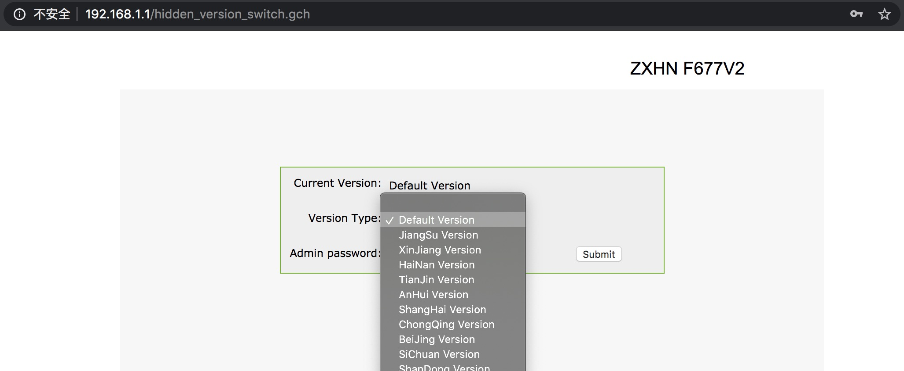
2. 访问 http://192.168.1.1/cu.html，点选管理员账户，然后输入密码 `CUAdmin` 即可登录。
3. 对着上面的表格把对应的连接建好。教程上说 TR069 和 PPPoE 都需要建，草民只建了一个 PPPoE 的桥接，另外建了一个 PPPoE 的直接拨号（跟以前的模式一样的那种），给父母和 NAS Host 用。

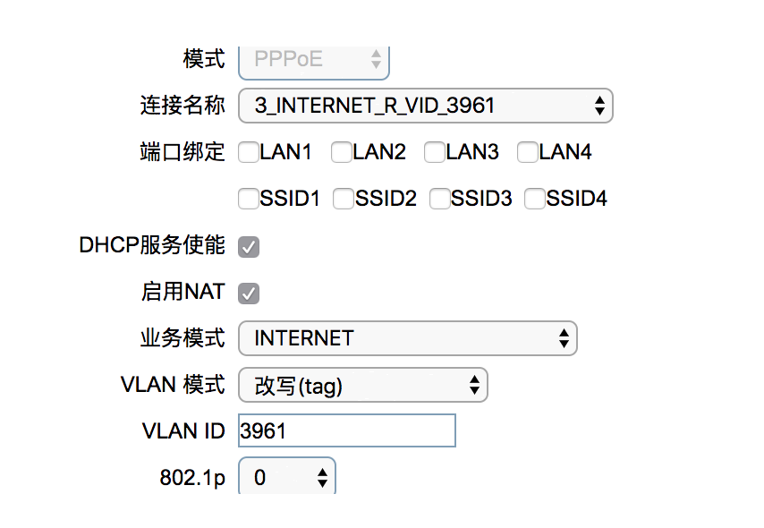

IPTV 之类，因为房东一直有交着有线电视的费用，平时我也不看，所以就直接干掉了。

## 一条线上跑两个连接

目前的做法是这样：一条千兆线上面同时跑了两种协议，一个就是 IP，一个是 PPPoE 隧道。IP 协议的话，在这个隧道上面直接 DHCP 就可以拿到一个 IPv4 地址，走光猫的 NAT 正常上网；PPPoE 就更简单了，就是走一个正常的 PPPoE 流程完事。

感觉上是有一点类似多拨再叠加那种做法，只不过我这么做的话就没有叠加这一步了，两个设备完全分开。因为在 NAS 上大流量的应用也不少（主要是下 PT）这些，加上光猫的 WiFi 还要给父母用，所以这样做总体来说是最方便的。至于实际速度是怎么样的，还真没有进行过测试，只能说没觉得有什么问题。

# 准入

说准入其实还是因为公司的 VPN 就叫【准入客户端】，感觉这个名字也算贴切。

草民自己的理解是，网络分内外，进到内网之后可以访问内网里面被保护的资源，资源除了数据也包括 CPU 显卡这些计算资源，比如说连接回来 steam 串流，也算是在访问自己的计算资源。像草民的目的其实也就比较简单，基本上也就是希望能比较方便的访问到 NAS 里面的一些东西，比如传一些文件过来，或者远程开始编译一下 OpenWrt、开始新的 PT 下载等。

使用场景上，因为大多数情况下使用的场所比较固定（公司电脑），最早的时候只简单考虑了 OpenVPN 这种方式进行操作。不过因为 OpenVPN 有诸多限制，后面也考虑了一些其他方案，目前的方式是主要使用 tinc，OpenVPN 还是架设着，但是一般不用了。

## OpenVPN

常规方案。

优势在于
* 很成熟，久经考验
* 支持很多种模式，适合不同场景
* 安全性、稳定性等都比较理想，举例目前已经可以使用比较新的 TLS 1.3 来处理，GCM 等等各种安全特性都有比较好的支持。

缺点主要在于

* 配置十分复杂，要生成一大堆证书，tap 模式要自己去做桥接，tun 模式的话要自己写一大堆 push route 之类的命令，对新手很不友好
* 依赖固定的 IP Port 连接，这就要求服务器必须有公网 IP 地址，否则就要走内网穿透的方式

部署的时候可以选择在 Host 上部署然后把端口穿透出来，或者直接部署在有公网 IP 的 OpenWrt 路由器上。OpenWrt 路由器对 OpenVPN 支持也比较好。

### 基本配置

这个网上其实说的已经很多了，基本上也就是生成证书，再按照自己选定的方式创建一个配置文件。

OpenWrt 这里比较好的一点是有一个还算好用的 LuCI 界面，要求不高的情况下已经足够完成服务端配置。只需要在对应位置填好参数，上传好各证书文件，配置文件就算搞定；如果是在 Host 里面的话可能配置文件就还是需要手写。

草民在配置的过程中发现了一个点可能需要注意，就是因为草民使用场景比较简单，为了避免麻烦基本上是一个客户端配置复制很多份给不同设备用，这种情况的话需要选中 duplicate_cn 这个配置，否则所有用相同证书的客户端，同一时间只有一个可以连的上来。

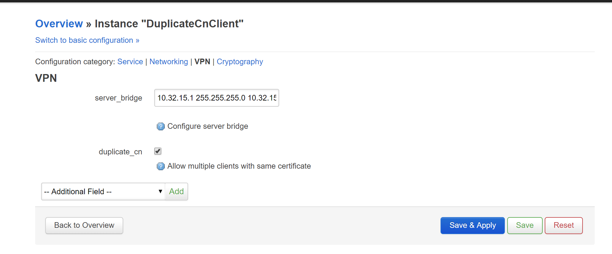

### 在 OpenWrt 里面搭建

OpenWrt 里面搭建的话，为了方便，这里选用的是 tap 模式。tap 模式的好处是可以桥接在路由器的局域网网段上，连进来的设备就跟插了一根网线上去到交换机上，或者连到了家里的 WiFi 一样，使用起来是最方便的。

OpenWrt 配桥接非常简单，只要在 Interface LAN 里面把这个接口加到 Bridge Interfaces 里面就行了。

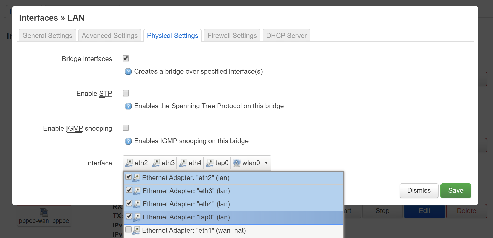

### 在 Host 上配置

因为搞 TPROXY 透明代理的时候出了些奇怪的问题，从外网连路由器的连接会被无差别 drop，除非针对一些 IP 做端口转发，还可以转发到 Host 上。

这个问题至今不知道原因，但只在 IPv4 网络有这个问题，IPv6 没这个问题（废话，压根没在 IPv6 上配透明代理）。但这个问题导致架设在路由器上的 OpenVPN 服务端完全不能在 IPv4 网络使用，这就会非常让人头疼。

Host 上面配的话其实步骤基本跟上面差不多。因为我们的 Host - Guest 网络是通过桥接来做的，那只要在这个桥里面加上 tap0 就行，具体的步骤在上一篇里面也有提及，就不再赘述了。当然还是要注意 Docker 会跟 Bridge 冲突的问题（[Docker breaks libvirt bridge network](https://serverfault.com/questions/963759/docker-breaks-libvirt-bridge-network)），这个也是上一篇中提到的。

当然后面公司的办公网莫名其妙有了 IPv6 NAT，于是就也考虑了通过 IPv6 的方式直接连到路由器的 OpenVPN 的方案。

### IPv6 DDNS

因为之前用的 NameCheap 还有 CloudFlare 啥的都不支持 IPv6 的 DDNS，所以另外找了一个 [https://dynv6.com/](https://dynv6.com/) 这家的方案，OpenWrt 内置的 ddns 可以直接支持，而且免费方案已经够用，体验很不错。

## Zerotier

上面说了 OpenVPN 的各种令人头秃的问题，所以也就不得不去考虑一个能少掉几根头发的方案。

Zerotier 这个东西其实 2017 年我就有尝试过，配置真的很方便，有很好用的管理界面，而且包括 OpenWrt 在内的各大平台都支持，但是因为 NAT 打洞这个事情一定会需要一个有公网 IP 的服务器，打不通的话就得通过这个服务器转发，然而 Zerotier 的这个服务器在墙外，这使得大多数情况下实际这个体验都真的不算好。

后面最近又尝试了一下。相关教程基本上都烂大街了，这里也不再说明了。为了解决上面说的这个中转问题，尝试了一下自己架设 Moon 节点，还有手机客户端等，总体来看大概有下面几点：

* 实际使用的效果比起 17 年的体验来说似乎好一些，不像当时那样动不动就断了，稳定了不少
* Moon 架设不难，但是想让所有的设备都 Orbit 上来的话还是比较费劲，而且像是手机客户端这种是没有地方去操作进行 Orbit 的
* 因为 Controller 还是使用的 Zerotier 官方的，如果这个东西被墙了的话 Zerotier 相当于整个就废了，自己搭建 Controller 的难度很大，而且也存在像是手机客户端这种可能就不能配置自己的 Controller 这种可能性

在这样一系列考虑之后，最终还是没有真正去大量使用 Zerotier，转而考虑下面的 Tinc 方案。

## Tinc

[https://www.tinc-vpn.org/](https://www.tinc-vpn.org/) 也拥有比较好的平台支持，包括 OpenWrt 和 Android 客户端（[https://tincapp.pacien.org/](https://tincapp.pacien.org/)），但是没有 iOS 支持（只有越狱版的，而且好像还是很老的版本了）。

### 自己搭 Tinc

Tinc 的搭建总体来说也比较简单，教程不太多，可以参考 [Tinc VPN 大局域网实现备忘录](https://www.yiwan.pro/index.php/ltd_documents/422-tinc-vpn-config-memorandum.html)。里面只有 Linux 和 Android 的配置，Windows 下的话可以参考 [Tinc VPN 折腾日记](https://wuzk.tk/2018/09/13/2018/20180913/)。Linux 和 Windows 基本上也就稍微有一点不同，主要在于初始化对应的 tun 设备的方式不是使用 `tinc-up` `tinc-down` 两个脚本，而是通过 tap 驱动自带的脚本新建一个 tun 设备，然后在 Tinc 的配置文件里面直接指定他的名称和 IPv4 地址。比如我这里使用的是名为「Tinc」的 tun 设备，在配置文件里面指定的设备和在网络连接里面看到的设备名字就需要是一样的，并且要给它指定 IPv4 地址。

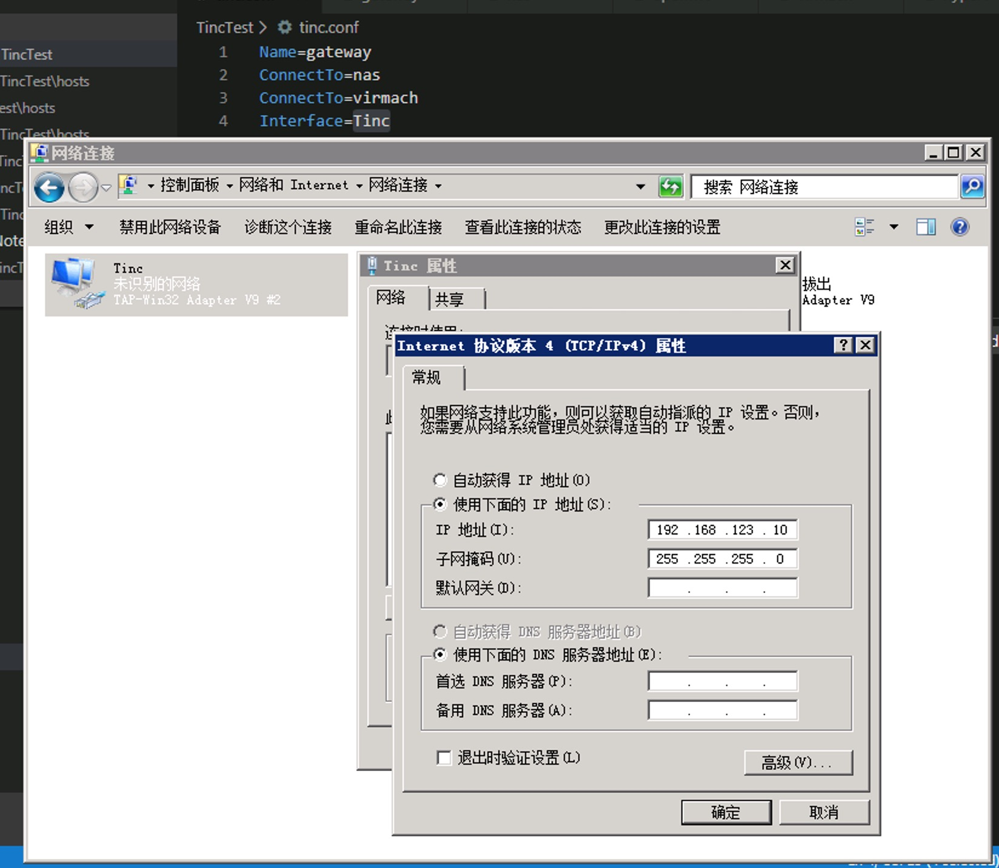

OpenWrt 上的话，配置就不能写在 tinc.conf 里面了，要通过 `/etc/config/tinc` 来生成，不过除了格式之外，基本上也没太大区别。

```
root@OpenWrt-NAS:~# cat /etc/config/tinc
config tinc-net TincTest
	option enabled 1
	list ConnectTo nas
	list ConnectTo gateway
	list ConnectTo virmach
	option Name openwrt
	option PrivateKeyFile /etc/tinc/TincTest/rsa_key.priv
	option BindToAddress '* 2233'
```

还有一点是，为了方便起见，可以把这个设备添加到 Interfaces 里面，并且把防火墙区域设置成 WAN，相当于配一个 NAT，这样 LAN 内没有装 Tinc 的设备也仍然可以通过 Tinc 的 IP 访问对应设备，使用起来会方便一些。

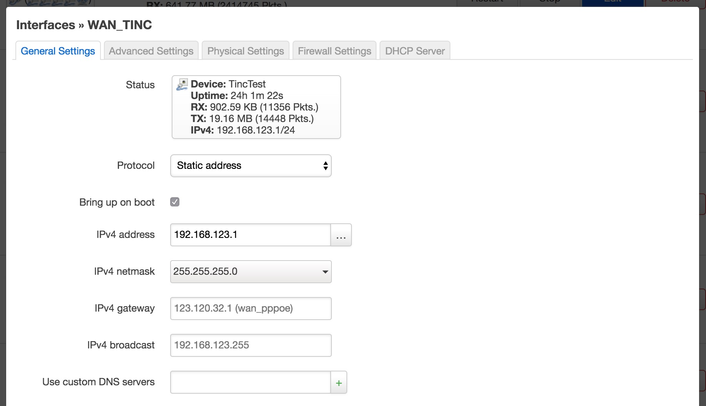

### 手机客户端

[https://tincapp.pacien.org/](https://tincapp.pacien.org/) 这里提供的 Android 客户端似乎是一个 Tinc 1.1 的实现，配置文件上似乎会有一些区别，不过它兼容 1.0 协议和配置文件，直接复制进去正常用就好了。

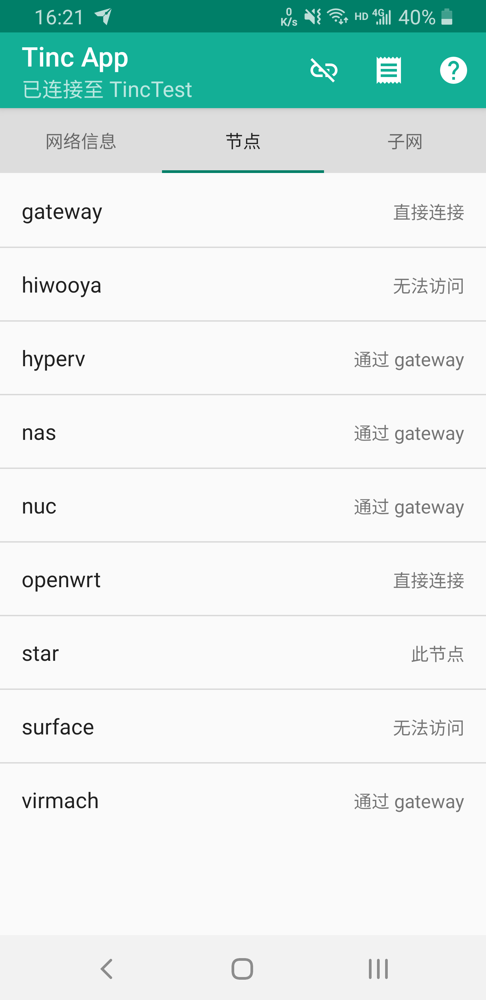

这里的 gateway 是一台位于张家口的阿里云主机（家里和公司的网络 Ping 大概都是 12ms 左右，手机也差不太多），virmach 就是 VirMach 的一台 VPS，nas 有公网 IP，除了这三台设备外，其他的都没有公网 IP，但互相之间都完全可以正常连接。移动设备的话，从 App 里面看，大多数情况下 Tinc 会倾向于走 gateway 转发，nas 大多数时候会直连。因为 gateway 为了方便，带宽直接拉满然后按流量收钱，所以其实用起来还是有点肉疼（虽然说充了 50 块钱在阿里云的余额里面，但是还没有哪个月用超过两毛钱的，平时基本都是一毛钱都不到，不知道这五十块啥时候用得完）。

里面有些无法访问的节点，hiwooya 是真的没接电源（这个东西是我找了好久好久才找到的比较完善的便携无线路由方案，后面应该会单独开一篇来介绍，预告一下）；surface 这个按电源键锁屏了然后它也就无法访问了，甚至还接着电源，说好的 Connected Standby 呢。

### 效果，稳定性

Tinc 实际使用的体验还是很不错的，尤其有一点非常好的是，可以手动指定连接关系，甚至每一台设备连接其他设备的时候的地址都可以单独配置，这样可以手动指定已知的最短路径，使得体验最佳。这个功能主要适用于内网固定设备连接路由器的情况，可以在配置文件里面直接写路由器的内网 IP 地址。

举一个例子，说起来比较复杂一点：台式机的 Windows 跑了一个 Linux 虚拟机，但是为了使用公司 VPN，它连接网络使用的是 NAT 方式，这样内网的其他机器就不能通过 IP 直接访问到这台 VM；不过可以在这台 VM 上搭建 Tinc 并且直接配置几个已知设备的内网 IP 直连，搭配上 OpenWrt 路由器上配置的 NAT，内网任何设备都可以通过这台 VM 的 Tinc IP 来访问它。

```
yichya@yichya-hyperv ~> cat /etc/tinc/TincTest/hosts/nas
Address = 192.168.122.1
Subnet = 192.168.123.2/32

-----BEGIN RSA PUBLIC KEY-----
...
-----END RSA PUBLIC KEY-----
yichya@yichya-hyperv ~> cat /etc/tinc/TincTest/hosts/openwrt
Address = 10.32.15.1
Port = 2233
Subnet = 192.168.123.1/32

-----BEGIN RSA PUBLIC KEY-----
...
-----END RSA PUBLIC KEY-----
```

这种场景也适用于 Host - Guest 连接，Guest 知道 Host 的地址，但是 Host 不知道 Guest 的地址。比如 libvirt 这种，建一个 NAT 网络，默认的 Host 地址就是 192.168.122.1，相当于也是一个小局域网，内网固定设备连接路由器的场景，套用上面的配置方案，在 Guest 的配置里面连 Host 就可以使用内网地址进行直连，而不用像其他客户端那样走公网地址。

不过也有一些问题，主要是稳定性和性能似乎都不如 Tinc，同样是 NAS 的 Host - Guest，Zerotier 的延时要比 Tinc 明显低（Ping 的时候 Zerotier 稳定在 0.5ms 左右，Tinc 会在 1ms+ 的某个位置波动），而且即使是内网，似乎有时候也会莫名其妙出现卡顿和连接断开的情况（当然目前出现过这种情况的场景草民没有在 Zerotier 上重新验证过，所以不好说是不是 Tinc 自己的问题）。

另外，似乎有些非常奇怪的现象，在公司的时候似乎，访问家里路由器的 LuCI，看到登录界面前 tinc 就会断开，其他时候就没有这问题，但这个问题在 Surface 和 NUC 上都发生过，手机上倒是无法复现（同样连公司的 WiFi）。忍不住让人在想是不是这个协议安全性堪忧，但这个事情确实不是很好验证。

## 针对 DDNS 抽风的预案

使用 OpenVPN 这样的方案，依赖 NAS 的公网 IP，但是公网 IP 是经常会变化的，需要通过 DDNS 等方案去解决这个问题。但是 DDNS 经常会出现迷之抽风的情况，针对这种情况就需要准备一些预案，避免真的挂了只能通过自己跑回家里的方式来解决问题。

### Zerotier / Tinc

这俩肯定是解决这个问题的比较理想的一个方案了，Tinc 的话，只要有一台设备，有不变的公网 IP，那最坏的情况，整个网络还可以通过这台设备做中转；Zerotier 的话更简单，Controller 没挂没被墙就不会有任何问题。

### Pulseway

Pulseway 这个东西主要是加拿大白嫖王（Linus）给他们做过很多次广告，于是试用了一下。

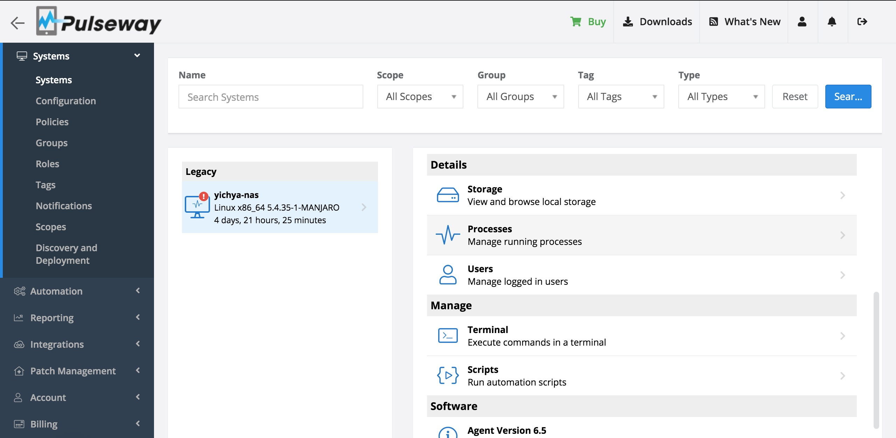

体验的感觉大概是：

* 免费版最多只能管理两台设备，功能倒是没啥限制
* 可能因为国外服务，国内用起来还是很慢，基本上做任何操作都要等几秒才有反应，从 agent 的日志上也能看到很多 timeout
* 跑在 NAS 上就能看到 NAS 的公网 IP 地址，不过在草民的这种部署方式下，这个公网 IP 是光猫 PPPoE 出来的，相当于没啥用
* 有个终端，但实在是很挫，用起来是真的难受，建议只用来紧急时候 reboot 或者开个 ssh 隧道啥的，隧道开了就通过隧道连回去解决问题
* 有手机客户端，功能跟 web 没太大区别，终端还是一样的很辣鸡

总结下来感觉用来应急没啥大问题，反正就是个救生艇，也不指望什么大船一样的用户体验，关键时刻能发挥作用就行。

### 内网穿透

内网穿透的方案就非常多了，之前常用的 ngrok，现在比较流行 frp，还有 v2ray 也有这个功能。草民目前使用的是 v2ray 提供的内网穿透，主要问题是配置比较费劲，服务端和客户端都要写很多十分复杂的配置才能穿透出去。稳定性这方面倒是相当不错，用了相当长一段时间了还从来没出过问题。

内网穿透在 v2ray 里面叫「反向代理」，教程可以直接参考 [https://www.v2ray.com/chapter_02/reverse.html](https://www.v2ray.com/chapter_02/reverse.html)。

目前草民用来 PT 的梯子就是 ws + cdn，ws 正好需要一个主页用来做一些伪装什么的，这个页面就是通过 v2ray 的内网穿透提供的，直接把这个端口挂在 Caddy 后面就完事了。这个页面目前是 Cockpit，一个功能很强大的 Linux 管理工具，利用它也可以进行应急的问题排查。关于 Cockpit 后面会稍微详细一点介绍。

# Docker + 新角色

之前不装 Docker 是因为桥接的时候有那个兼容性的问题，现在改成桥接 PPPoE 方式之后，这个问题就不再是问题了，然后考虑有些现在跑在 VPS 上的东西可以挪下来方便维护，再加上因为一直用的 Mint 比较老了，有些想用的新特性用不到，想做一下切换，但是目前系统里面有些东西安装部署太麻烦，为了便于维护也考虑把这些东西放到 Docker 里面。

## rsshub + rssbot

之前 [https://rsshub.yichya.review](https://rsshub.yichya.review) 的本体在 VirMach 的一台 Windows VPS 上，但后面觉得更新太麻烦就找了台俄罗斯 Linux VPS，一开始直接 clone 下来运行，要处理一大堆依赖，后面一想直接上 Docker 能省好多事儿。

那台 VPS 很便宜，有 IPv6 还不限流量，当然便宜肯定有便宜的代价，一个很严重的问题就是那台 VPS 的硬盘小不说（只有 5GB，虽然加钱就能扩），而且隔一段时间就会跪一次，表现为硬盘无法写入，dmesg 大量硬盘设备报错，/ 变成只读；重启一般都无法成功，需要上去手动 fsck 一遍才能继续开机。出了几次这种事之后就觉得说这台机器还是老老实实当 IPv6 代理用来拖 PT 比较好，不考虑这种需要持久化数据的用法了。

后面 RSS Bot 换成了 flowerss（[http://github.com/indes/flowerss-bot](http://github.com/indes/flowerss-bot)），用 Go 编写，主要优势是支持 Instant View，虽然实际用的时候发现成功率不高。它的数据使用 sqlite 或者 mysql 存，之前的 rust rssbot 使用的是一个迷之 json 文件，不方便查看修改。草民部署的时候用 sqlite，因为放在本地的关系可以直接用 DataGrip 打开来进行操作，也十分方便。


顺便还是非常强烈推荐通过 rsshub + rssbot 这种方式定制自己的消息源，比起很多其他的资讯应用来说都更方便，有效信息的比例也高出很多。

## Onedrive

客户端不错，但是安装太麻烦，搞到 Docker 省事儿一些。

我这里使用的是 [croc/onedrive](https://hub.docker.com/r/croc/onedrive/) 这个 docker image，总体来说凑合，只要把需要同步的目录通过 volume 弄进去就好了，但是有一个问题是这个东西在任何网络抖动或者一些上传冲突之类的情况下都会直接丢一个 Broken Pipe 出来然后自己就退出了，因此启动它的时候必须要加上 `--restart always` 这个参数；但每次启动它又都会运行一大堆 groupadd useradd 之类的，就让人觉得这个 image 不是很靠谱。。。

```
Timeout was reached on handle 5641DE81CB70
Timeout was reached on handle 5641DE81CB70
HTTP request returned status code 401 (Unauthorized)
{
    "error": {
        "code": "unauthenticated",
        "innerError": {
            "date": "2020-04-28T17:07:58",
            "request-id": "6fcdfa8f-a1d4-4fd6-a2dc-e7a252a198f2"
        },
        "message": "Must be authenticated to use '\/drive' syntax"
    }
}
Downloading Pictures/Camera Roll/Screenshot_20200501-162129_Tinc App.png... done.
Broken pipe
groupdel: cannot remove the primary group of user 'app'
groupadd: group 'app' already exists
useradd: group 'app' does not exist
su: user app does not exist
useradd: warning: the home directory already exists.
```

反正只要上面提到的几个点都注意一下，这个也基本上没什么太大问题，凑合用用还是可以的。

## Deluge

Deluge 这个东西其实也是一样，东西是好东西，但是配置起来太麻烦，也可以考虑挪到 Docker 里面。

当然考虑到北邮人限制只能用 1.x，Docker 最好自己弄，基于一个 ubuntu 18.04 自己装一下，把 WebUi 的端口和文件下载路径、配置文件路径都透出来就可以了，步骤并不困难。

Deluge 这里还有一个小技巧，就是可以在启动 daemon 的时候在 daemon 里面顺便启动 webui，这个需要对配置文件做一点修改。Deluge 这个配置看起来就像是两个 JSON 文件强行粘在一起，只能说确实是很奇怪。。。

1. 在配置文件目录（一般是容器里面的 `/var/lib/deluged/config`，如果把这个目录通过 docker 挂出去了的话自己确定一下容器外的路径）下面的 core.conf 里面加上 enabled_plugins 这一项，把 WebUi 打开
    ```
    # cat core.conf
    {
        "file": 1,
        "format": 1
    }{
    // ......
        "enabled_plugins": [
            "WebUi"
        ],
    // ......
    ```

2. 在 core.conf 同级目录新建 web_plugin.conf，写两个配置即可
    ```
    # cat web_plugin.conf
    {
        "file": 1,
        "format": 1
    }
    {
        "port": 8112,
        "enabled": true
    }
    ```

这样容器的启动命令可以直接写成 `deluged -d -c /var/lib/deluged/config`，容器启动起来就可以通过 8112 端口访问到 WebUi，这样就不需要额外命令再去启动 WebUi 了。

# Manjaro

Linux Mint 19 用了挺长一段时间了，虽然没啥大问题，但是很多东西都很旧了，比如内核就算装 hwe 也只能上到 5.3，libvirtd 没有 vsock 更没有 virtio-fs，跟虚拟机做文件共享只能用 9p，然而 9p 因为不知道什么原因，在草民这里性能十分糟糕。

但这些都不是最严重的问题，最大的问题是，ubuntu 的 5.3.0-40 内核在草民的机器上出现了严重的兼容性问题，似乎是因为 PCI Passthrough 导致设备树变化的时候在内核里面出现了空指针（现场没有了不好找），结果是 OpenWrt 虚拟机完全无法启动，只能退回到之前版本内核。

出了这么大问题，以及就算 Ubuntu 20.04 了还不知道 Mint 几时跟进，再加上也确实 Mint 用太久了想换换口味。恰好当时 Manjaro 刚出了个新版本，内核是 5.4 LTS，Manjaro 印象之前口碑不错，于是就决定换一下。

## Live Test，bridge or macvtap

这次换发行版的一个前提自然是之前直通的那种使用方式能正常工作。Live 的时候就可以起个虚拟机看看这次主要看的这些问题，因为镜像什么的都是现成的，只要启动前在启动界面改一下内核 cmdline 打开 VT-d 就行了。另外有个小技巧：Manjaro Live 启动的时候会根据卷标找 rootfs 存在哪儿，但那个卷标巨长，而且这个卷标具体是什么也是写在内核 cmdline 里面的，启动之后不好改；但实际只要在 initramfs 那个 shell 里面简单操作下，直接在 /dev/disk/by-label 里面新建个符号链接就可以正常的继续启动。

看下来：

* Manjaro 的 5.4 内核，反正那个严重的兼容性问题没了（至少从我开始用 Manjaro 起到现在 5.4.35 止，都没再有过这个问题）
* vsock 有了，但是好像虚拟机里面 socat 弄不出来，不知道咋整
* virtio-fs 还是没看见，也不知道咋弄
* 另外不知道为啥，还没桥接了，只有 macvtap，反正 macvtap 不影响 pppoe 拨号

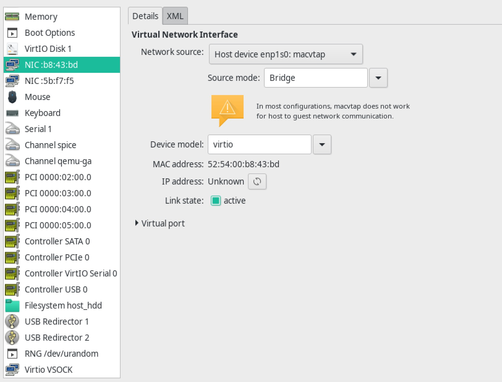

用 macvtap 最大的问题是 host - guest 连接不好弄，不过这里就直接另外搞了一个 NAT 的虚拟网卡，毫无问题。当然要注意，在 OpenWrt 里面，这个接口需要去掉 Use Default Gateway，让默认路由走 PPPoE，另外最好也配置成 WAN 的防火墙区域，使用起来方便一点。

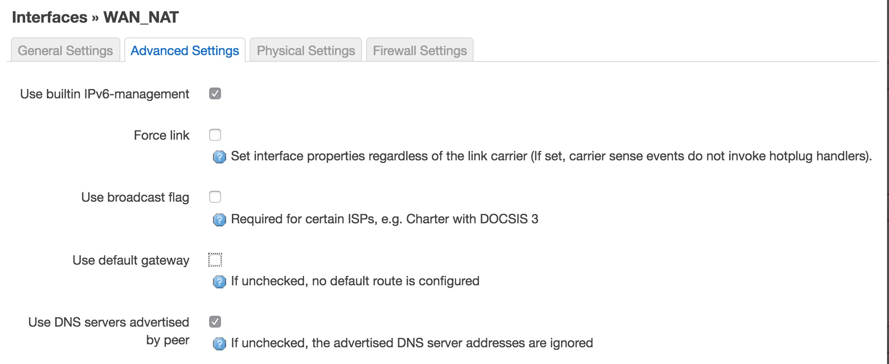

Live 跑了几个小时，基本确定没问题，就突然冒出来一个想法：把系统装 U 盘里面，这样可以把主板上宝贵的 PCIE 插槽空出来接 EC20 啥的，但仔细一想，好像我现在也没这需求，真用得上的时候直接插一个上去又不是不能用。。。

## app migrations

其实我的 NAS 上面挂的东西并不算多，当时统计下来，基本上也就是这些：

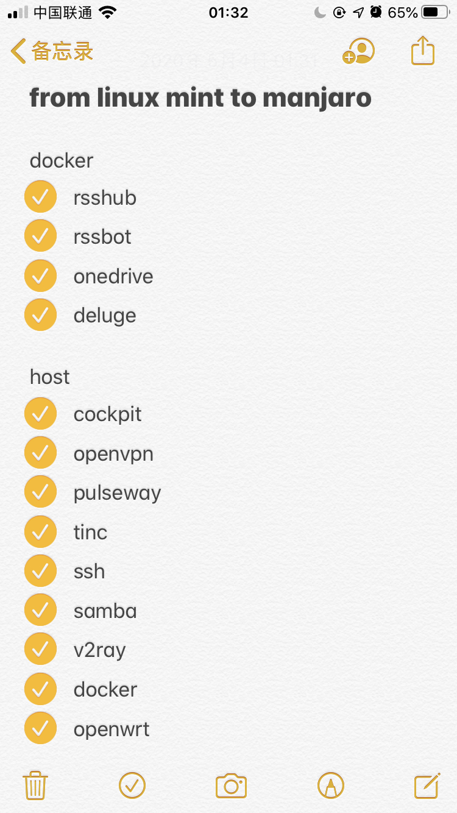

比较麻烦但是又很重要的两个，Deluge 和 Onedrive 都挪到 Docker 了。Docker 的好处就非常明显，旧系统把 /var/log/docker 单独准备一个 btrfs 子卷，新系统装完把原来的子卷直接挂到 /var/lib/docker，整个迁移就完成了，其他什么事情都不需要做，非常非常爽。所以说有很多东西能放 Docker 还是放 Docker，尤其很多都是官方直接提供好 docker image 的这种，拉下来就直接可以用，也方便更新。

另外，还有一点好处，Docker 的这个目录可以不用跟 / 抢空间，像我这种 ssd 只有不到 20G 的这一点就很有意义，像很多常驻的服务其实都可以这样做，二进制文件都可以放 hdd，数据什么的统一在机械盘上找个地方一起放，反正不是操作系统本体，也不经常请求，量也不大，内存闲的很，基本全都进 cache，而且因为都是一些后台服务，对我来说 OpenWrt 属于要在开机后尽可能快的起来的那种服务，其他的这些后台的服务启动快一点慢一点其实都没什么太大关系。通过这种方式可以把很多服务都从 ssd 上挪出去，而且基本无感知，还方便后续做可能的迁移，一举多得。

当然确实并不是所有东西都可以丢 docker 里面，尤其还有很多东西确实不好挪，比如 openvpn tinc pulseway cockpit 这些迁移起来都比较麻烦。

# Cockpit

上面提了蛮多次 Cockpit，这里也简单介绍一下这是个啥东西。相当好用，很值得推荐。

[https://cockpit-project.org/](https://cockpit-project.org/) 是一个 Web 界面的 Linux 管理工具，界面友好，有很多实用功能，包括相当好用的终端、跟 systemd 结合比较紧密的各种功能（服务，日志等）、简单的存储管理（草民基本就拿来看一下 smart），还可以管理 libvirt 虚拟机、docker / podman 容器等。而且还支持两步验证，这样即使是直接挂到公网上面去，也不会有被暴力破解的安全风险（事实上我真的这样做了）。

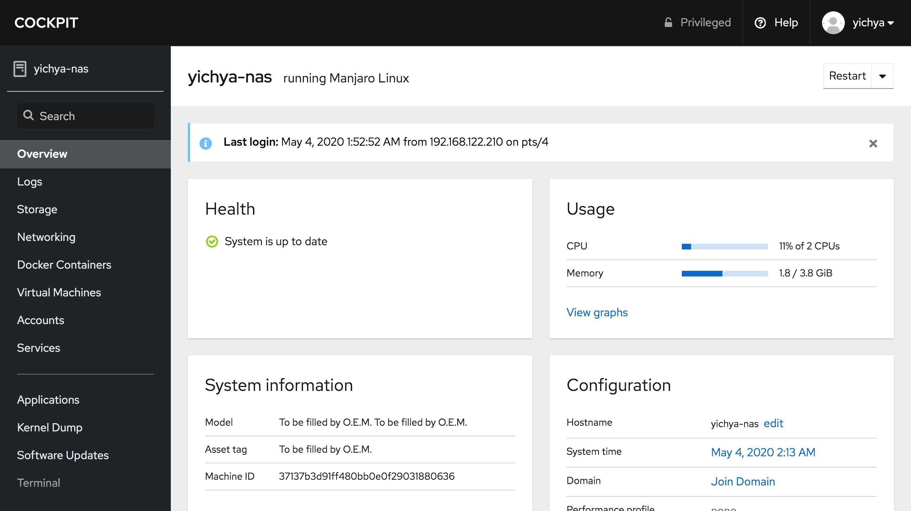

实际部署 Cockpit 的时候可能会有下面几个点需要注意，简单提一下。

## Two factor authentication

配置两步验证并不难，参考 [Enable Two-Factor Auth for Cockpit with Google Authenticator](https://scottlinux.com/2017/05/13/enable-two-factor-auth-for-cockpit-with-google-authenticator/) 就好了。但可能有两点需要注意：

* 备份 ~/.google_authenticator，这样即使重装系统也不会丢失已经配置好的两步验证
* 有的两步验证 app（比如草民公司内嵌在 VPN 客户端的那个）扫上面那个二维码的时候总是会提示错误「用户和密码不能为空」，这时就需要手动输入。

手动输入其实就是，在二维码下面会有一个「Secret Key」

``` 
$ google-authenticator
Do you want authentication tokens to be time-based (y/n) y
Warning: pasting the following URL into your browser exposes the OTP secret to Google:
< ... QR Code ... >
Your new secret key is: OYKBEL7NNU5YNR6NSIAMM7LSUE
```

在 App 里面手动添加的地方，用户随便编一个邮箱，密码输下面那个，然后就可以正常添加进去了。

## Manjaro & Cockpit

Manjaro 提供的 Cockpit 好像是一个 Arch 社区打包出来的，实际使用的时候会因为目前尚不清楚的原因不能登录。

一个能用，但是可能并不正确的解决方法是把 `cockpit-session` 来一个 SetUID

```
$ ls -al /usr/lib/cockpit/
total 720
drwxr-xr-x   2 root root                 4096 Apr 19 17:35 ./
drwxr-xr-x 187 root root               155648 Apr 27 02:21 ../
-rwxr-xr-x   1 root root                42816 Apr 17 06:03 cockpit-askpass*
-rwxr-xr-x   1 root root                 6206 Apr 17 06:03 cockpit-desktop*
-rwsr-x---   1 root cockpit-wsinstance  51072 Apr 17 06:03 cockpit-session*
-rwxr-xr-x   1 root root               125176 Apr 17 06:03 cockpit-ssh*
-rwxr-xr-x   1 root root                43112 Apr 17 06:03 cockpit-tls*
-rwxr-xr-x   1 root root               273104 Apr 17 06:03 cockpit-ws*
-rwxr-xr-x   1 root root                14096 Apr 17 06:03 cockpit-wsinstance-factory*
```

草民确实不知道这样做是不是正确，但确实能用，所以也在这里简单记录下吧。

## Reverse-Proxy behind Caddy

目前比较常见的部署 V2Ray ws + tls + cdn 的方式中，caddy 可能是最常见的 web 服务器。caddy 的好处主要是自带 certbot，不用自己操心续期证书的事情，不过像比较常见的白嫖 cloudflare cdn 的这种，cloudflare 会直接发一个有效期 15 年的证书出来，但那个证书只能用来回源，不过确实也是足够了。

草民部署 Cockpit 的方式是使用了 V2Ray 的内网穿透（或者说反向代理），然后这个页面挂在 VPS 的首页上用来自欺欺人（逃

想让 Cockpit 能正常使用，需要在 Caddy 的配置文件里面加上下面的几个配置：

```
proxy / localhost:9090 {
    websocket
    insecure_skip_verify
    transparent
}
```

Cockpit 自己的配置主要是把一些 HTTPS 相关的配置搞对就行了，包括 Origins ProtocolHeader AllowUnencrypted 这几个，UrlRoot 这个既然是用来自欺欺人那这个就没必要躲躲藏藏的了。

```
[WebService]
Origins = https://<your domain name>
ProtocolHeader = X-Forwarded-Proto
UrlRoot = /
AllowUnencrypted = true
```

# Finally

最近大概半年左右，NAS 软路由这些概念突然莫名其妙火起来了。也不知道为什么就火起来了？


这个图是百度指数，考虑百度的使用人群（会搭这玩意儿的我觉得基本都会买个 k2p 在上面装 passwall 什么的翻墙上谷歌吧），可能这个数据不太准，但应该足够说明问题了。Google Trends 的话也有类似趋势，但因为不好做语言和地区过滤，结果是「nas」搜索量巨大，比「软路由」多好几个数量级那种。。。

草民自认为还算比较早入坑（毕竟 2016 年下旬就开始搞了），但是一方面有时间的时候没钱、有钱的时候没时间，另一方面没那么多数据要存（去年买的 12TB 现在也没用到三分之一），也没有大 house 要考虑全屋覆盖、各种布线啥的，总结下来就是也没有很强的动力。

不过这个概念既然是火起来了，那面向消费者的产品或许能迎来降价也说不定？为啥不买四盘位群晖一步到位，说白了还不是就是没钱嘛。

自己折腾这个前后折腾了也有快四年了，至少个人的应用场景基本上已经想的差不多了。如果说还有哪里没想到，感觉可能也就差在一些更便捷的使用这种，比如 DSM 那个看起来很不错的 Web 界面，还有 KodExplorer 这种，就是一个真的面向普通用户的 Web 界面。但个人对此兴趣真的不大，因为确实没需求。

至于软路由那个层面，其实再继续下去可能也就是搞个 kvr 漫游或者 Mesh 啥的，这个也只能说啥时候真的有那么大 house 需要头疼无线覆盖的时候再说吧。
