难得的国庆假期，还是跟中秋连起来。今年完全是自己行动了，本来想拉着父母再去趟成都，他们不想去，于是想了想决定把前两年立的 flag 收一下，跑一趟苏州和上海。

基本上想法是觉得苏州能看的东西会多点，但其实基本上没考虑什么安排，想法主要是看看太湖，其他的随缘。上海的话就真的没啥特别想关注的，所以计划是 9.30 - 10.2 在苏州，10.3 早上去上海，10.3 下午 - 10.5 在上海，10.6 中午高铁回帝都（上午肯定起不来就不安排别的了）。

9.29 下午从帝都高铁出发，晚上到苏州，出来直接地铁就到住的地方了。

## 如家精选酒店

平江万达对面的如家精选。什么辣鸡，拉黑，绝对拉黑。没得洗衣服就算了，电梯每次开关门都是 duang 一声巨响，根本睡不好觉，不得不把空调的风速开到最大才能勉强盖住那个声音。

被吵得完全睡不着，就大致定了下要去的地方

* 9.30
  * 西山看太湖
  * 如果还有时间就在西山再转转
* 10.1
  * 估计前一天会很累，这一天就不去太远的地方
  * 下午睡醒去看拙政园，以及市内随便找地方逛逛
  * 晚上看姜子牙
* 10.2
  * 周边古镇蛮多，选一个去看看

下面就主要是简单记录了。

## 西山风景区

五个字总结：血亏，不要去

### 去程

地铁加两趟公交，全程两个半小时左右。

公交都能扫 apple pay，没座，晕车晕到死。到了西山那边快线 11 路全是老头老太太

### 缥缈峰

就很辣鸡，60 门票 20 车费完全不值，不推荐。主要其实最大的问题还是交通成本，一个半小时的公交车简直要了我的命。20 的车票会直接送到山顶，也可以接到山脚下出发点，当然也可以选择自己走下去，要不了多久，而且除了最后一小段，路都是平的。。。真的无聊。

本意是从高处看看太湖，然而现实是

* 所谓最高峰其实就是个小土坡
* 离湖太远
* 天气不好

还好带了 Mavic Mini 去。

峰顶自拍。就没啥

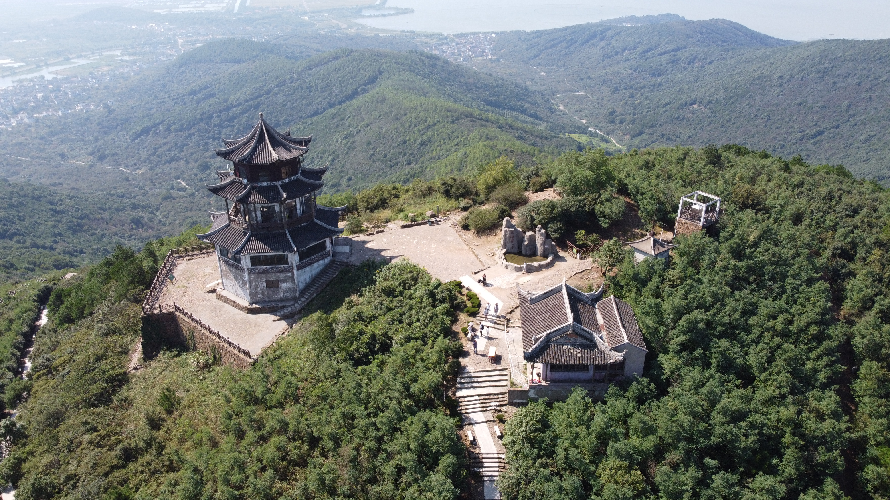

还有些地质博物馆啥的，我反正没去

### 太湖

等公交的时候到湖边呆了一会儿。

确实很大，真的大，一眼看不见边那种大（当然也可能是天气原因）。

比较难受的是太湖的水……

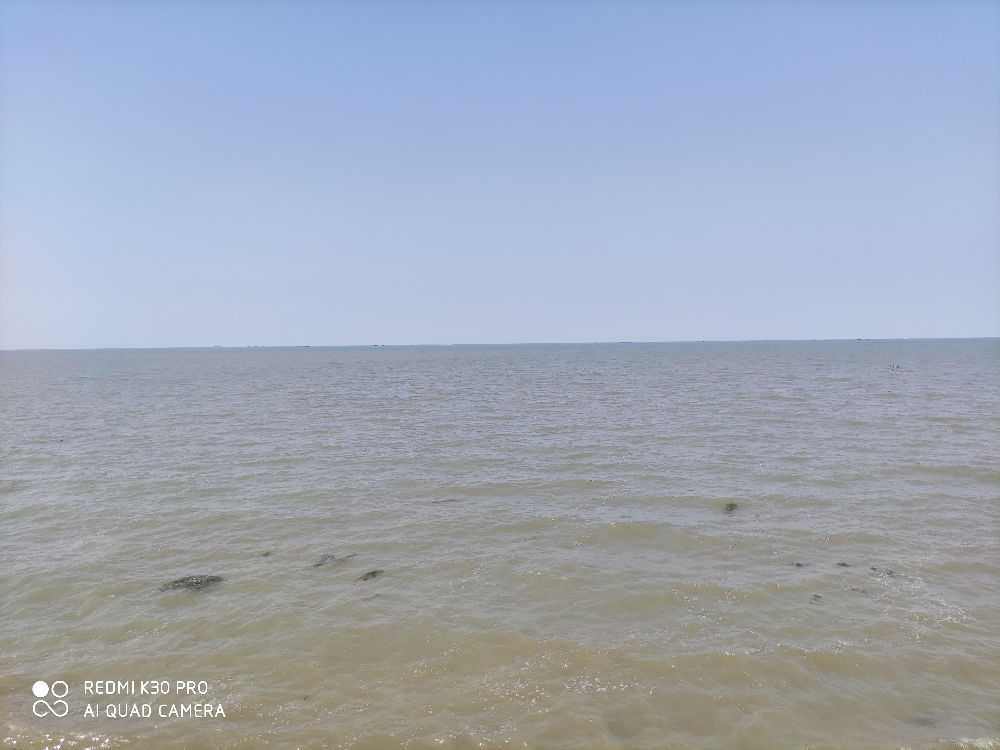

是那种土黄色的，反正看着就感觉很浑浊……

### 林屋洞

从缥缈峰过去又要坐一个小时公交，加上等车也得等半个小时。

草民第一次见到溶洞，感觉还可以，主要是很多地形确实很经典。

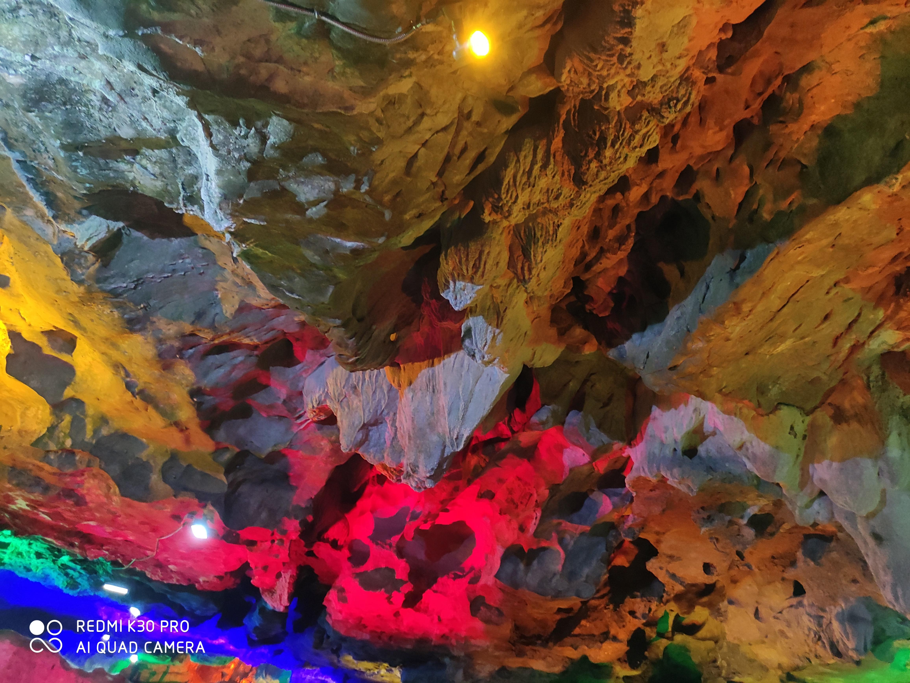

从那边山顶往下看看其实也蛮有意思，尤其是下面的村子，布局很好玩（图片有定位坐标）

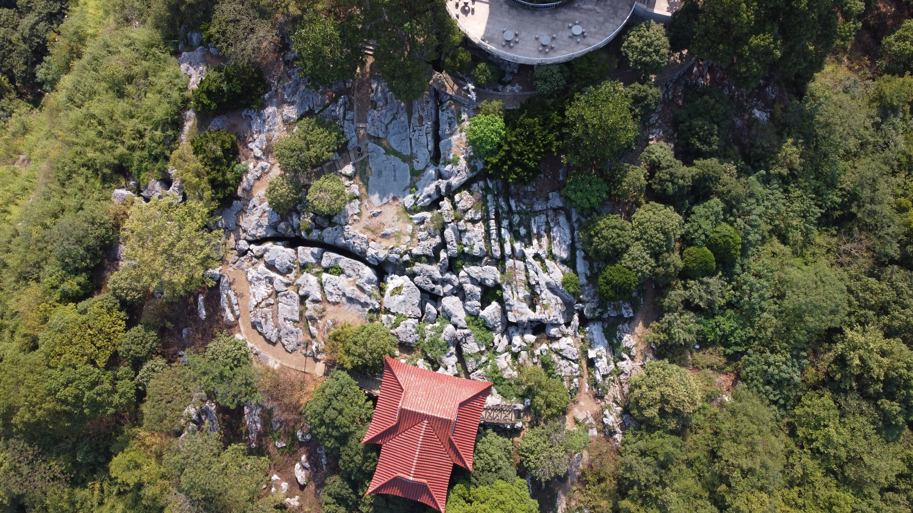

这个属于那种，假如真的去了西山发现很坑，或在附近哪儿转悠有那么一两个小时空出来，可以去看看。但绝对不值得为了这个单独跑一趟西山，成本太高了。

### 返程

我 tm 裂开，真的，哇，回来的时候坐快线 11 路，中间有个学校放假，瞬间挤满，那段真的令人绝望。

回来大概五点半到酒店，吃了点东西睡了一觉起来八点半了，决定再出门走走。

## 观前街

还不错，人不算太多，天气也比较凉快。不过一定要说有啥可看的也没啥可看的就是普通的商业街。

建议晚上来溜达。七八点过去，转一转到十点，坐地铁回来，很舒服。当然草民是走路回来的了，而且走路回来也很舒服。

走路回来路过的某个小河

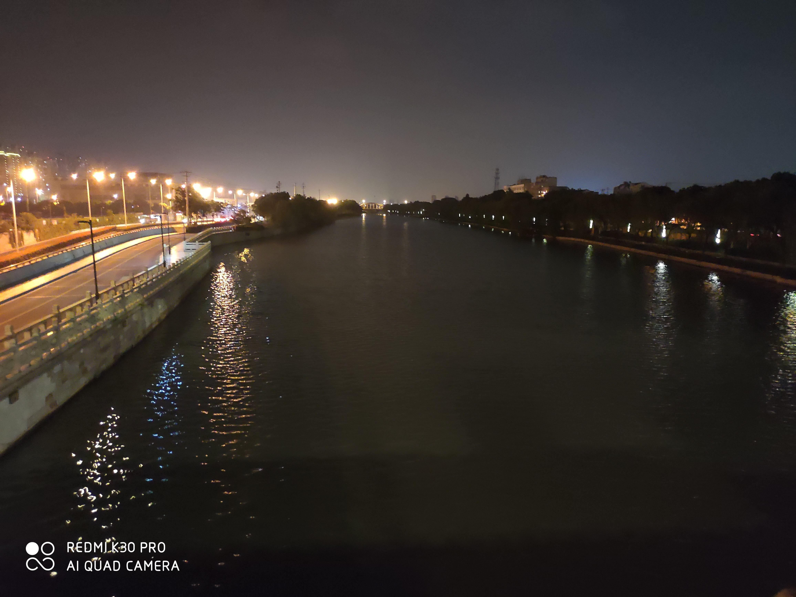

## 拙政园

攻略上一般会推荐跟苏州博物馆还有狮子林在一起看。那个博物馆从外面看反正我感觉十分滑稽，还好没真的订票进去。园林感觉就看一个就行了没必要全看。

总体来说还行，交通还算方便，下地铁走个几百米就到，不用坐公交。里面的景色也值得花一个小时来看看。一个小时就够了。没怎么拍图，网上一堆

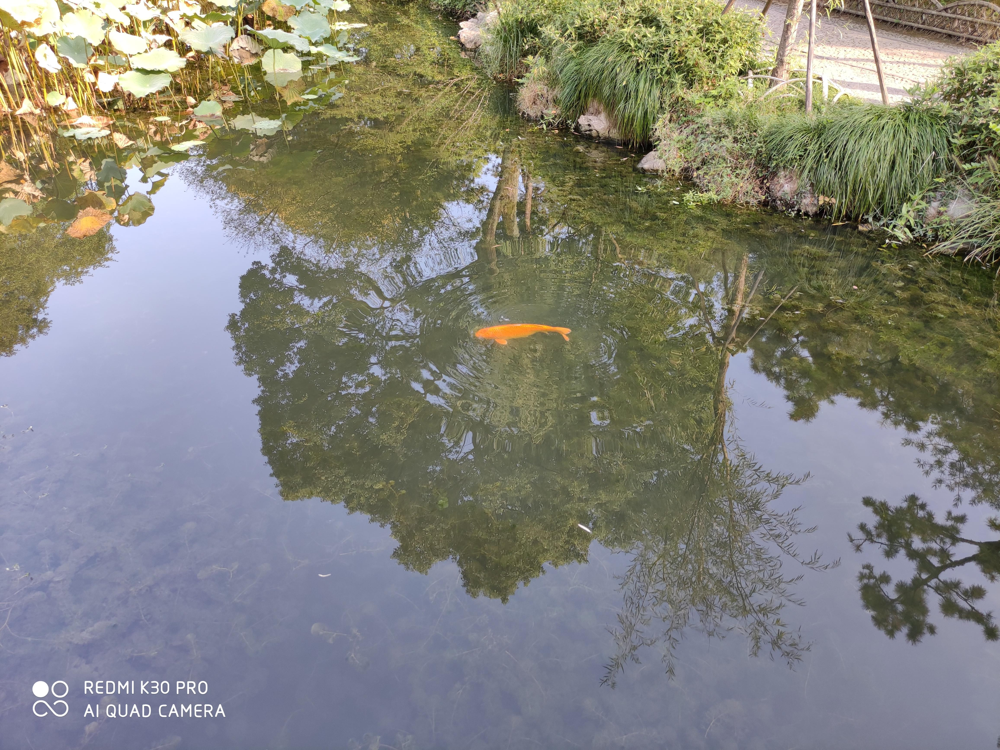

另外，满园到处都是汉服小姐姐，也有不少格裙小姐姐，可以说小赚一把眼福。

## 金鸡湖

很不错，强烈推荐。下午四点半左右到，走一圈两个小时。

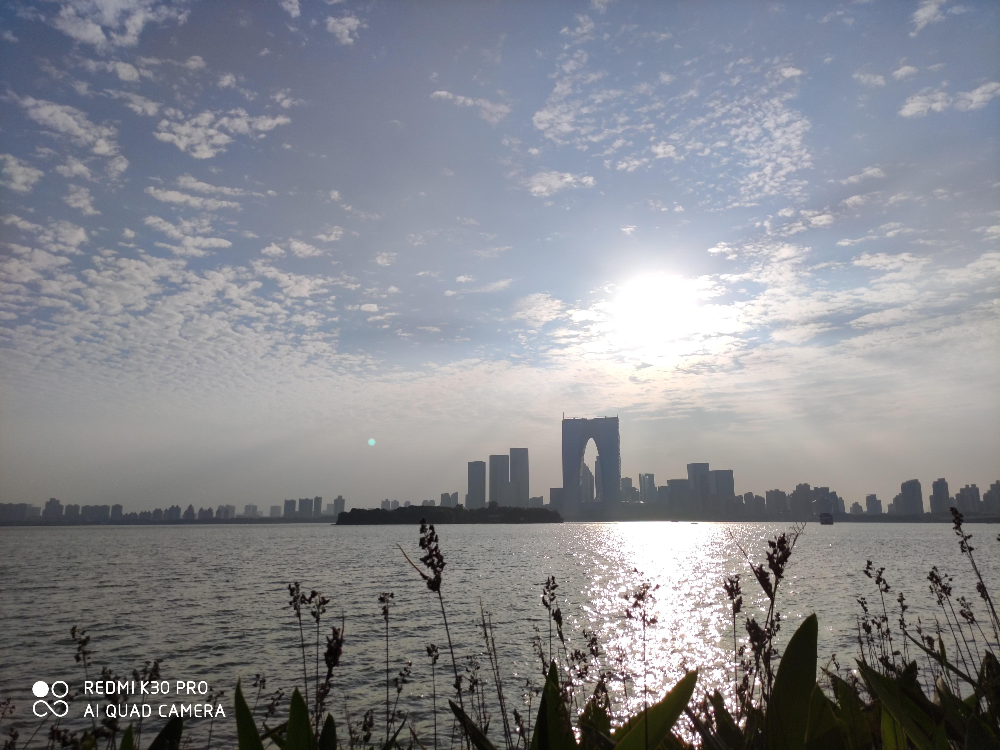

五点半太阳落山，下午看看风景，晚上吹吹风，双倍的快乐。

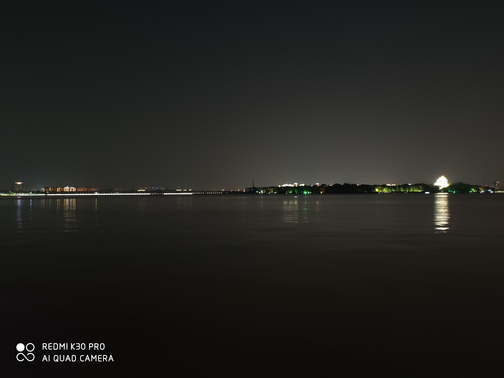

李公堤就很辣鸡，全是车，挤的水泄不通，鸣笛吵得要死。全程体验最差的一段。

摩天轮因为施工关闭了，连带着下面的一大截步道。

## 晚上看的姜子牙

顺便一提而已。

看完当时的第一感觉是故事情节很跳跃，发展前后完全没什么逻辑关系，我第一想法是节奏问题。后来看了知乎评论，也确实认同「本身故事就有比较大的硬伤」这一点，不甚理想的节奏只是这一根本问题在叙事这一特定方面的体现。画面的话，非专业人士觉得没毛病，具体的不懂怎么评价。

平江那家万达影城感觉，呃，破破烂烂的。而且 imax 屏幕明显亮度不足，观感不甚理想。可能是因为整个行业关了大半年，缺少维护或者是没钱维护了？

## 同里

为啥选了同里而没选高德上评分更高的周庄呢？

毫无疑问，四号线直达的诱惑实在是难以抗拒（笑）啥时候周庄通了地铁再说吧。

### 个人经验

先甩点结论。今天呆的时间其实太长，如果重新安排草民今天的行程的话

1. 中午吃完饭，一点半左右到景区。可以上午晚点起，十一点半左右吃个午饭，吃完就往那边去，刚好。
2. 先看所有地图上标记出来的内部景点。基本都值得一看，尤其太湖水利展示馆还有珍珠塔景园，其他也建议都看看。建议提前看的原因有两个，一个是这些地方都比较凉快，另一个是这些地方都会在 17:15 关门。最多两个小时足够全看完了。
3. 如果想坐船的话也是一样，17:00 左右基本游船就收摊了。不过那个船没啥意思，看心情选择。
4. 下午四点左右人会渐渐多起来，汉服小姐姐和格裙小姐姐也会多起来（lo 娘吧，有，但很稀有，非常稀有）
5. 18:30 左右基本天就黑的差不多了。建议天黑后一小时内跑路，当然国庆这两天 19:30 - 20:30 有昆曲，想看也可以看完之后利索点跑路。另外上午 11:00 前后，下午 14:00 前后也各有一场表演，可以选看。
6. 总体 5 - 6 个小时，绝对足够把景区所有道路覆盖一遍。草民呆了大概 9 个小时，估摸着景区绝大多数道路得走了超过四遍

另外，个人觉得在景区里留宿属于可以但没有必要，简单的说

* 呆到八点半再坐地铁回市区也轻而易举，不像乌镇西塘千岛湖那样，回个杭州路上三个小时起步
* 主要还是，晚上真的没啥看头

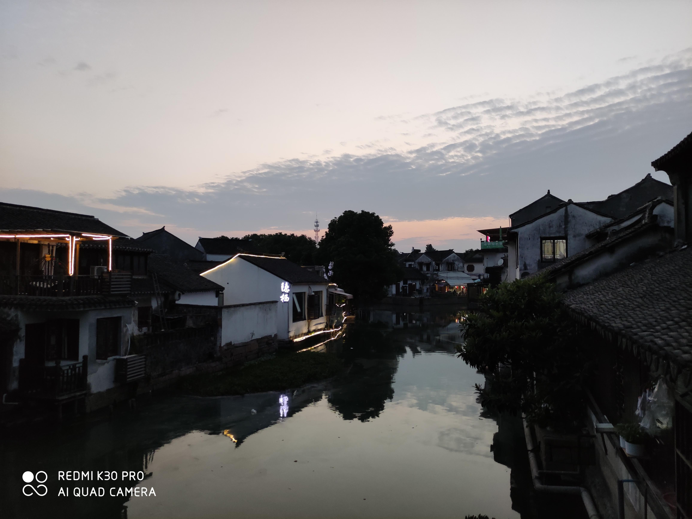

如果要留宿，建议前一天晚上六点左右到就行了。

### 交通

真的很方便，真的真的很方便。四号线坐到头，出站就是卖景区门票的，在那里买票还可以免费坐大巴，关键是比高德的票还便宜十几块钱。辣鸡高德。当然大巴跟公交车发车点在一块儿，坐哪个都差不多。二十分钟就能到景区。比起周庄那种，一看高德两个小时大巴这样上来就劝退的是不是有好太多太多了。

回程的话估计了一下时间，想当天回的话最晚看完八点半的昆曲必须离开景区，再晚可能会错过换乘最后一趟地铁。从景区出来可以选择坐黑车去地铁站，快一些，重点是不用等公交车来。草民遇上的是一个人三块钱，个人觉得靠谱。

### 整体感觉

比预期中小，我以为整个景区是贴着同里湖的，但实际上并没有靠着湖那一大块。个人感觉上比乌镇（东西栅加起来）大，比西塘应该是小一些。

风格上，拿来跟乌镇和西塘比的话，跟西塘更接近，但是细节差一些。如果个人评价

* 西塘是「很想再去一次，只差个合适的时间」
* 同里是「并不太想再去但是如果同行的人中有人很想去也可以一起去」
* 乌镇是「谁爱去谁去，莫挨老子」

### 生活气息

还是对比

* 乌镇就完全没有生活气息，就是景区加客栈加中间一个会展中心一个木心美术馆。不存在原住民，都是乌镇旅游发展有限公司的职员。完全不会觉得有人在这里生活。
* 西塘相比就有一些生活气息在里面，至少不是乌镇那种非常刻意的就完全摆出来给人看的感觉，相比起来就有意思很多
* 同里比起来就更粗放一些，真的会觉得有很多原住民，从满地乱跑的电动车、三轮车、外卖小哥还有开在某个不算特别隐蔽的位置的五金店来看可见一斑。景区做的都是游客生意，店铺寸土寸金，难道还指望着游客来买水龙头不成？防杠补充一点，无论是原住民还是乌镇那种旅游公司职工，到景区外面找个五金店买水龙头都很正常，但五金店开在景区里面就真的很有意思。当然还是需要说出来的一点是电动车满地跑其实……挺烦的

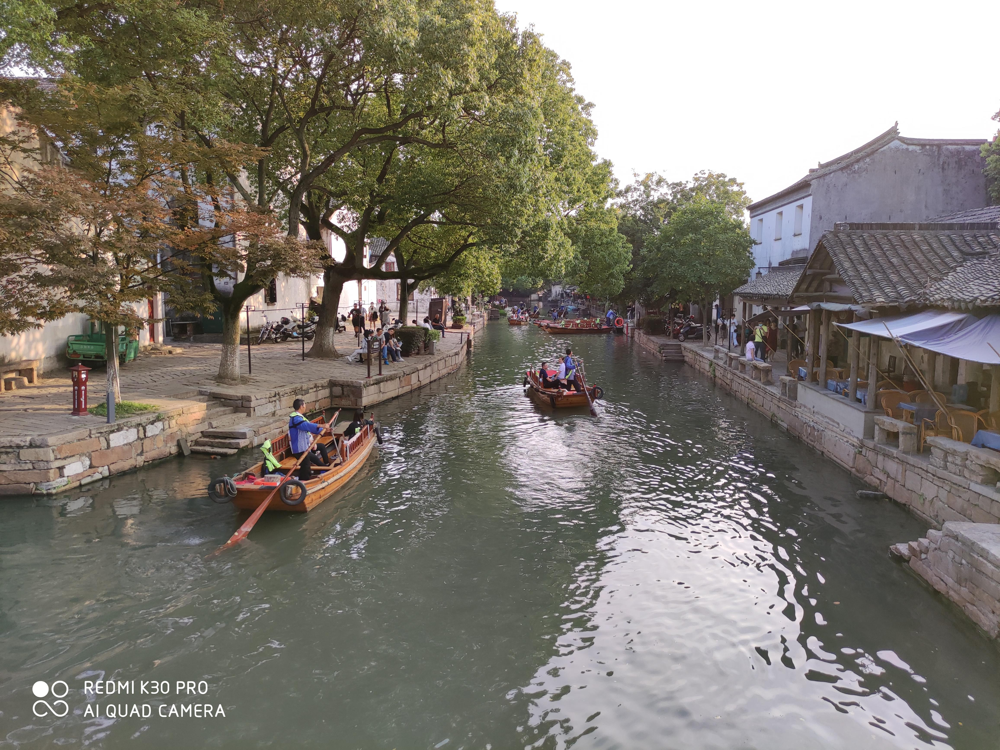

总结一下就是乌镇太假，西塘刚好，同里这个太真实了体验只能说凑合

### 景区规划

* 乌镇就不说了，东栅什么辣鸡，那么小，又闷，挤的跟狗一样，毫无体验。西栅也没好多少，主游道太窄，而且大多数位置两边都是商铺，真实寸土寸金
* 西塘感觉，正常一些，起码主游道比较宽敞，而且沿河一侧大多都能走，河道也相对宽一点，总体就不会感觉特别拥挤
* 同里在这方面跟西塘差不多，除了河道窄一些

但是有一点细节。为什么同里的游船五点就停了？这里我想贴个当时在西塘拍的图

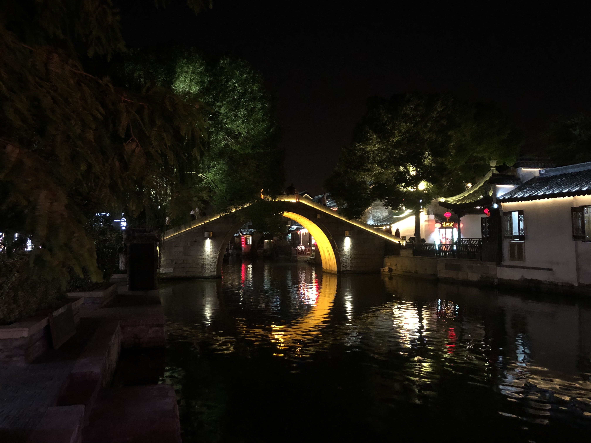

我今天想在同里拍一个类似的，但是找了一圈都没能找到一个光线条件类似的。晚上没有沿河那种吃饭的座位的地方全都是黑漆漆一片，有那种座位的地方就是那种巨耀眼的白光，根本无法拍照。

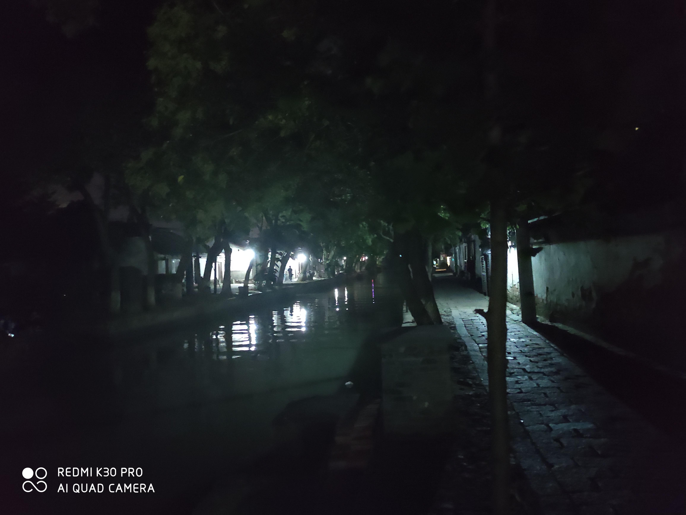

仿佛恐怖片的某个角落，在这种光线条件下能不能划船还两说，但反正我肯定不愿意坐船

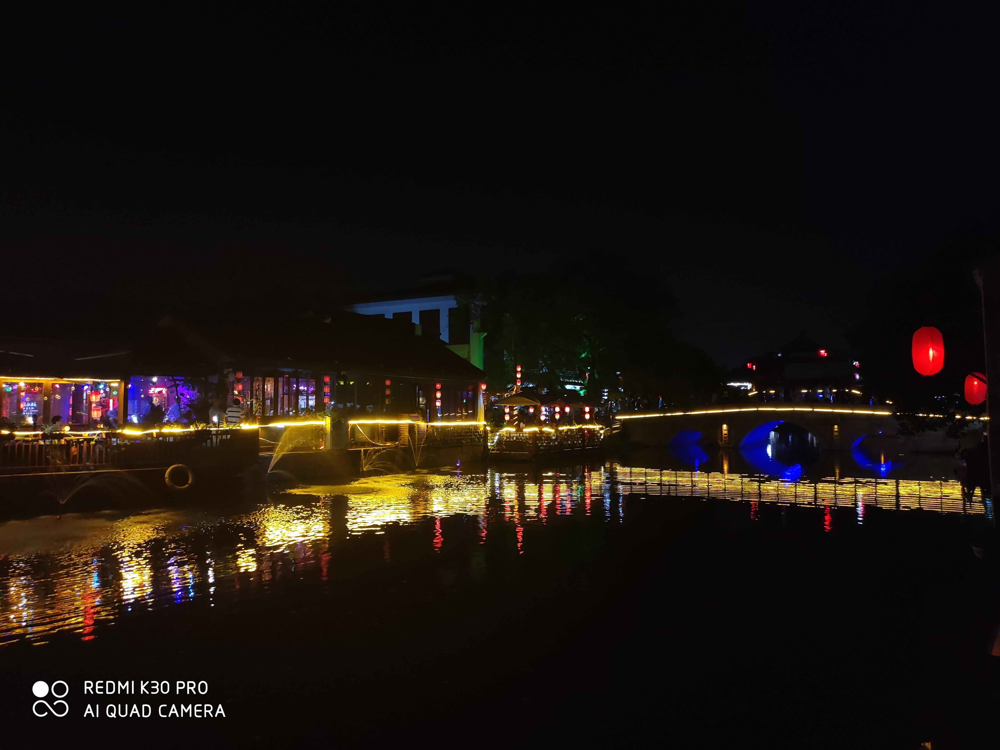

可能是晚上拍到的光线条件最好的一张了。

感觉就是同里还得再优化一下景区规划，天天喊着姑苏八点半，别连个灯带都不愿意装啊。

### 消费

想不起来乌镇和西塘的物价水准了。印象中反正西塘的不贵，乌镇真的不记得。

同里这边，可乐五块钱一瓶，吃的话，自己一个人的话吃碗面，十几二十块足够，如果一家人的话一百块出头应该吃的很舒坦了。

三点多去了一家叫 illy 的咖啡店歇脚。反正东西很贵，不好吃，不推荐。当然我的主要目的是坐一会儿看看风景所以是带着觉悟上的（笑）

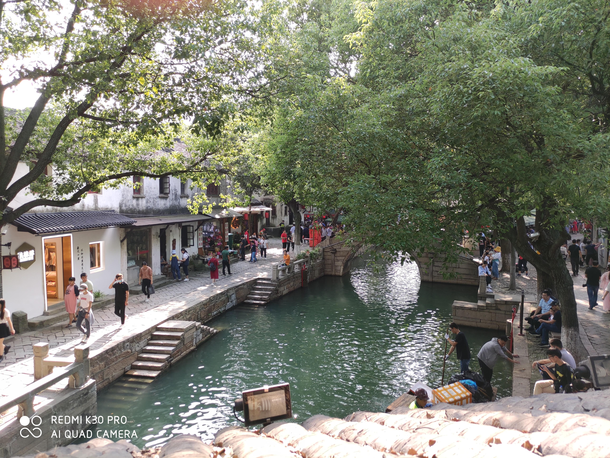

同里这边比较奇怪的一点是那种卖明信片冰箱贴这种小玩意的文创店极少。乌镇可以说隔几家店就有一个，西塘也差不多，我想在同里买个冰箱贴，绕着整个景区转了好几圈才找到一家卖的。虽然款式也不怎么喜欢，就黄不拉几的，但实在没得选就买了两个……相比之下西塘那个冰箱贴真的好看，甚至为此我完全愿意专门挑个西塘下雪的日子再去一次。另外发现了一个蛮有意思的陶瓷杯垫，买了两个当摆件。

## 总体感受

逛了三天，简单说说总体的感受。

### 交通

从日常出行的角度来说，总体觉得偏不理想

* 没有摩拜或者青桔或者哈罗。只有固定桩的共享自行车，而且绝大多数情况下是找不到的，事实上造成交通并不是特别方便
* 地铁发车间隔蛮长的，而且只有四条线，很难 cover 所有需求（尤其是周边景点这么多的情况下，要么自驾要么就得公交车，还是不太友好）
* 到处都在修地铁。当然现在是个城市都 tm 是到处都在修地铁，什么北京深圳杭州成都武汉西安石家庄，有一个算一个，哦还得再补上一个上海

如果说仅从旅游考虑，去周边景点的话，其实说比起比如从杭州去千岛湖或者乌镇或者西塘之类地方来说，苏州这边很大的一个优势就是全都是公交车，地铁一小时搭配公交一小时，基本大多数地方都能到了，而且不用担心错过大巴之类坑爹情况，最慢半个小时一趟，不需要预约，不存在没票，当场上车当场扫码，而且只要两三块钱。当然公交一小时对草民来说还是个比较大的挑战，实在是晕车，尤其没座的时候，而且公交车就很容易很挤

### 城市

先说好的

* 上述交通提到的景点，公交车能到，相对景区大巴那还是有明显的优势的
* 金鸡湖这种湖可不是随便哪里都有的，真的是城市感受中的一个巨大的加分项。

值得注意但是没有褒贬的

* 漂亮小姐姐真的多，非常多，而且这里格子裙（或者说 jk 制服）的流行程度非常高，虽然有一点比较奇怪的是绝大多数这种小姐姐都戴眼镜，不好猜原因，年龄问题（太年轻不适合隐形眼镜）或者习惯问题或者纯粹是出门玩怎么舒服怎么来了
* 地铁循环播放的广告居然是相亲的微信公众号，令人震惊

比较令人不悦的

* 上述交通问题，从日常出勤角度来说，比较负面的体验
* 住的辣鸡酒店极为糟心（当然这个主要怪飞猪，为什么不给我推亚朵）。如果有下次，一定要住金鸡湖边的亚朵。平江万达这家如家精选直接拉黑。
* 西山那边基本全是老头老太太，某种程度上说明了些问题？

个人的一些没有根据的想法

* 晚上看酒店的电视（忘了具体哪个台了，想看一下，电视还罢工了，只记得反正是个什么综合频道），几个小时的节目，一大半在说「姑苏八点半」，总结起来就是「我们做了这些这些吸引游客，做了那些那些吸引游客，啊还有苏州锦鲤抽奖你们还不搞快点赶紧来」，剩下的就是介绍楼盘，二手房交易信息什么的……就我只想说，反正这代表了个态度你们懂吧……
* 苏州离上海确实太近了，而且印象中除了一个微软甚至想不起来什么其他的互联网企业，加上政府这个态度，其实我觉得这里不太适合生存，攒够钱来养老还行……建议只把这里当作旅游城市。还好当初没真的立一个来苏州定居的 flag

### 总结

* 无论个人感受还是政府定位都是偏向旅游城市。来玩还行，生存就算了。当然离上海这么近，专心搞好自己的角色挺好的
* 交通颇有不便，景区看情况，除此之外几无亮点
* 目前不想来第二次，但不抗拒再来

当然确实这个评价还是有失偏颇，毕竟完全没去工业园区看一眼，假如在成都只在老城区瞎转悠也会觉得很没意思。
