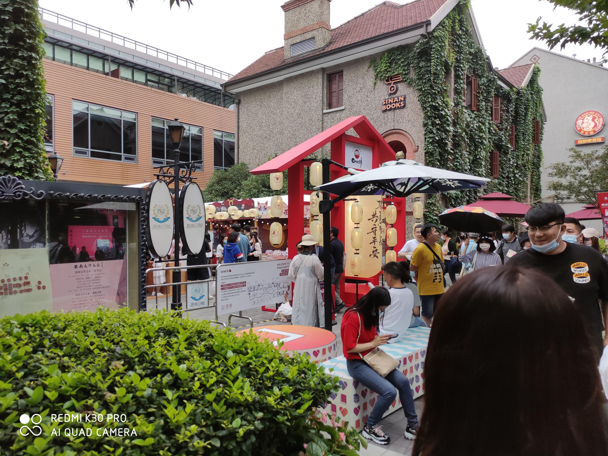
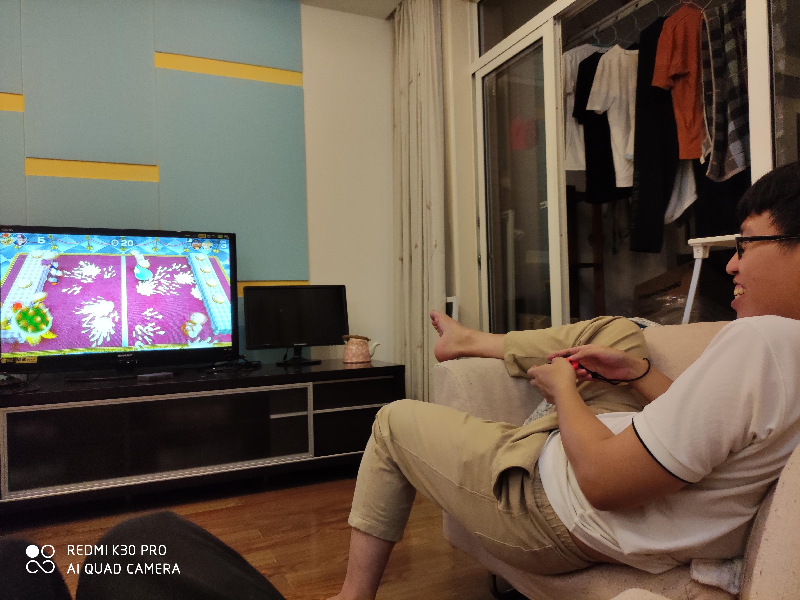

假期的第二站是上海，两天半时间自由活动。同样没什么明确安排，目的主要是跟拉大佬们吃饭加热门地点打卡。从苏州高铁站过来到上海虹桥站，高铁不到半小时，完全是城际水准。

## 亚朵 lab

可算不用住辣鸡酒店了。

这家亚朵的介绍是「只有 18 间套房的 mini 酒店」。有多 mini，从前台可见一斑。又见到了那个萌萌的机器人

风格很独特，既然是 lab 嘛独特是应该的。定的是这个「独奏大床房」

上面三张图来自这家酒店的微信客服朋友圈。个人感觉

* 比较小。但反正我自己住，太大也是浪费，小点挺好的
* 门锁啊马桶啊什么的都是智能的
* 床还是自带高度调节的，贼爽
* 电视可以投屏，虽然只能 dlna，显示支持苹果 airplay 但反正我没弄出来

## Day 1 阴阳师主题店

一开始都没想起来有这个地方可以去看，还是谢神在群里发了图才想起来的。

思南公馆那个位置就很神奇，反正我基本上去哪儿都要从 13 号线新天地那一站过，于是每天都有理由去看看

### 游园活动

刚好 10.1 - 10.8 有活动。旁边排队的那一圈是去思南书屋的，并不是游园活动的队伍（虽然那里好多人都拿着一张 yys 的卡片搞得我以为还要预约）

具体活动的话

* 反正就很贵，玩一圈差不多得花个快两百块吧，凑齐 100 个神秘符咒换器之道一套……反正我有了，但还是觉得，总不能真的花 3500 全买冷饮凑够 100 个符咒吧，其他方案全都不可行，要花时间太多了
* 刨冰好久没吃了，除了贵了点之外还不错
* 国庆这几天有 coser 出来营业。具体情况可以看微博。啊总之小暮小姐姐太好看了

### 一楼的周边店

简单的说，去看看可以，不建议买东西，如果要排队就不建议进去看

* 进店可能要排队，看情况，比如 coser 出来营业的时候就不怎么需要排队
* 贼小。真的小，一层周边店，两三个小屋子，最多十分钟就能转完一圈。
* 没啥新品，都是上架了好久的东西了。中间那个手办陈列柱也有日子没更新了
* 东西一样很贵。还不能用守护特权那个 95 折优惠。
* 一楼没法直接上二楼三楼，得从外面绕一下。因为一楼那块用一个屏风挡住了，搞的我以为二楼不开，后来才知道得从外面上去。
* 三楼要预约，有个微信小程序，当天的预约看脸，后面几天的看具体活动
* 消费满 70 块钱会送一个闪卡，包括二楼吃饭也送

## SSSTA 老变态聚会

见到了好久没见的林韬，黄大人，文韬老师，啊还有第一次见文韬老师的女票。顺便参观了下饿了么的办公地点。闲聊没啥内容，有也不会记录，当没有吧。

顺便去他们的住处玩耍了一会儿 switch

马里奥派对真好玩，噗哟噗哟俄罗斯方块那个操作可真是反直觉，各种误操作。啊什么时候摇杆漂移问题解决了我就去买 switch

## Day 2 传奇地锅

跟上面提到的 4 个大佬吃饭。挺好吃，就是量比较少。

## 主题店 again

下雨就很烦。好在中间停了一小会，coser 们可以出来营业。也是天气原因，今天感觉人相对少一点，主题店就不怎么需要排队。

这两个板子前面也终于空出来了一小会儿。也不知道啥时候我才能抽到 sp 姑姑，难受

源赖光家族见面会，然而没拍到源总 hhh

差一个源总和 sp 茨木，可以去微博自己找找

## 外滩

大概刚下过雨的关系人还不是特别多。看完就觉得「就这？」

大家的意见都是晚上再来。看这样子晚上无非多些光污染，我反正觉得我晚上懒得再来。

顺便坐了轮渡，两块钱，可以刷 apple pay 公交卡。毕竟公交性质，就最短路径连接两个站，几分钟就到了。

游船门票要 120。轮渡只有一条线能搭乘，另外一条线限流，国庆这几天每天 12:00 到 18:30 不营业。

## 交通大学

去膜一下。

出地铁就天黑了，绕了好几圈，没找着大门。

## 环球港

好大。啥都有。买了小米牙刷的刷头。

b1 那个火影拉面味道一般，而且量很少，完全不够吃。花椒粉是个好东西。

旁边有个 square enix cafe 还挺神奇，但那个就真的更小了，相比起来 onmyoji cafe & shop 可以说是财大气粗（很显然思南公馆那个地方房租也不会便宜，看旁边的各种店老高端了）

## 见到了旭东

多的也不说了，只能感叹一句真的是生活不易。

回来骑了一辆特别舒服的哈啰单车，真的特别舒服，令人印象极为深刻。

## Day 3 上午去看海

交通成本太高了。去一趟奉贤区要 3 个小时，实话说，地铁真的不方便

好多人在拍婚纱照 hhh

旁边看起来大概是一些酒店什么的。全烂尾了

总体没啥看头，算是做了个成就

## 主题店 again

反正就是看海回来顺便（强行顺便）去看 coser 了嘛。今天小暮不在但是团子来了

店长不知火，微博有小暮的 cos

饿了，于是顺便上楼解决了一下午饭问题

* 挺小的。大概装满的话能有 40 - 50 个位置。看起来应该人不多，并不需要预约排队啥的
* 这几天 15:00 闭餐，闭餐的时候只有饮料。平常好像 14:00 - 16:00 闭餐
* 点了下面这一堆总共不到 200
    * 限定的薯饼，不错，推荐
        * 限定是指会送一张对应的明信片
        * 其实还蛮想要不知火和青行灯的，但是那些东西实在不是很想吃，而且一张纸片，算了算了
    * 蓝莓椰子冰沙，不错，推荐
    * 牛舌，还行
    * 鹅肝塔，比较一般，主要可能是凉了味道就不是那么好
* 总体来说味道还行，价格基本上就是稍微贵一点的水平

顺便又看了一眼预约，微信关注个公众号，有小程序，每个时段（一个小时）30 个名额，有时候空的还蛮多的但是有时候就约不上。看自己需求

## 跟谢神和李居吃饭

梅龙镇那个商圈实在是辣鸡，贼小，啥都没有，电梯还非得绕一圈。谢神还是那个老样子 hhh

尊牛汇确实不错，不过实话说，点贵了，没吃啥海鲜，但反正出来玩管他呢。如果有下次就吃最便宜的

## Day 4 骑车去火车站

现在想想真的是脑子抽了才骑车过去。虹桥那边有个商务区，是个巨大的禁停区，裂开。商圈几乎没人。

在高铁站吃了好久没吃的吉祥馄饨。舒坦

## 总体感受

还不错。

### 交通

比起苏州，还是好一些

* 有共享单车，美团最多，哈罗其次，青桔没怎么见到
* 实话说觉得上海的地铁实在是不太行，主要是少个靠谱的环线，以及有些换乘站实在是太别扭了

关于环线正好今天早上刷知乎的时候看到一篇文章 [环线归途——大陆城市轨道环线浅述（三）【新的道路】](https://zhuanlan.zhihu.com/p/261309259)，干货蛮多。tldr

* 上海地铁起步还是晚一些，并且初期缺少规划
* 上海的城市结构不太适合大环线

可能过几年规划中的弦线差不多了之后地铁会更舒服一些。

### 城市

个人感觉其实没啥特别的

* 商圈好多，骑车骑一截就是一个商场，除此之外就没啥别的了
* 环境确实更有活力，比如有 yys 这种主题店就很让人羡慕，包括漂亮小姐姐也更多
* 有些人可能对老街感兴趣，但说实话草民感觉兴趣不大，并且老街那一片的交通相对会不方便

### FAQ

想了几个问题借此对比一下

Q：假如说回到 2017 年第一次找工作，可以重新选，会选魔都还是帝都？

A：如果这样的话肯定魔都，感觉魔都会更有活力，环境相对也好一些，周末能玩的地方也多一些

Q：假如上海有靠谱的坑会跳过去吗？

A：看有多靠谱，假如真的薪资 double 还 955 那为什么不跳 hhh 但实话说那边确实没有那么大的吸引力，除非真的薪资 double 还 955 否则真的不觉得有很大意义跳过去

Q：目前去过的几个城市，个人会怎么排序？

A：上海大概会放在比杭州略好一些的位置，苏州会放在大概跟西安一样的位置。成都 > 武汉 > 上海 >= 杭州 > 深圳 > 苏州 = 西安 > 北京 > 石家庄

Q：以后还想去上海嘛？

A：大概跟苏州一样，不会主动去，有人同行的话可以考虑一下
