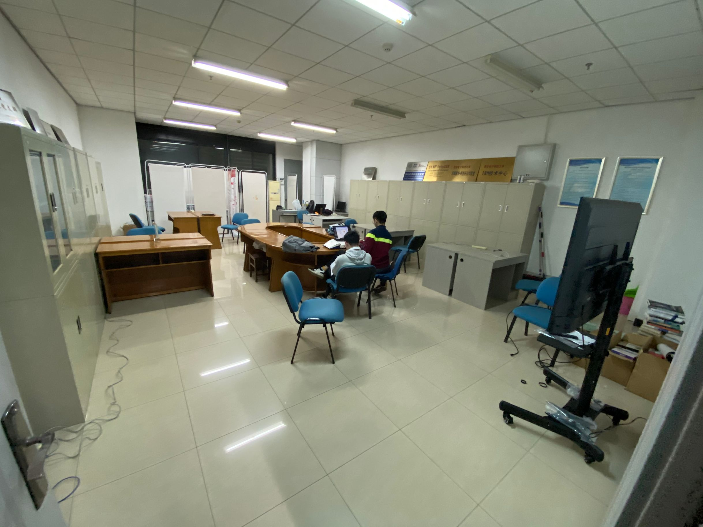
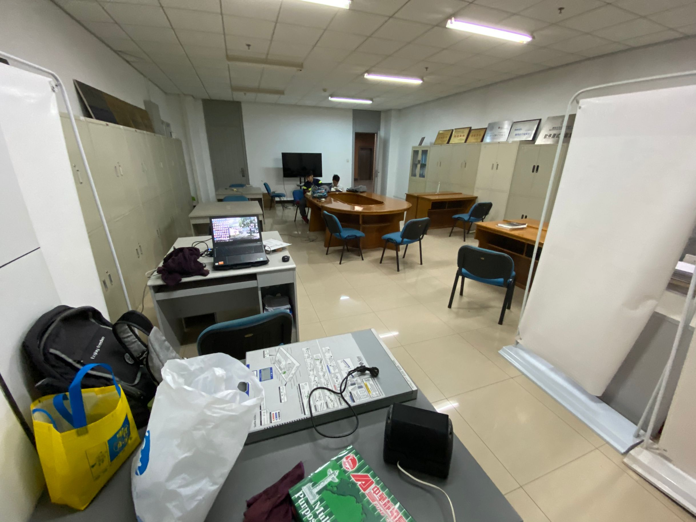
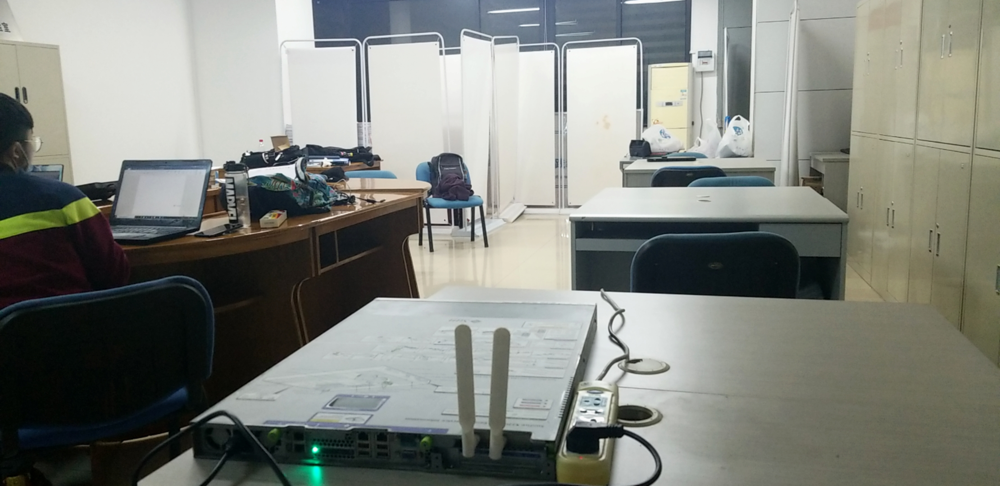
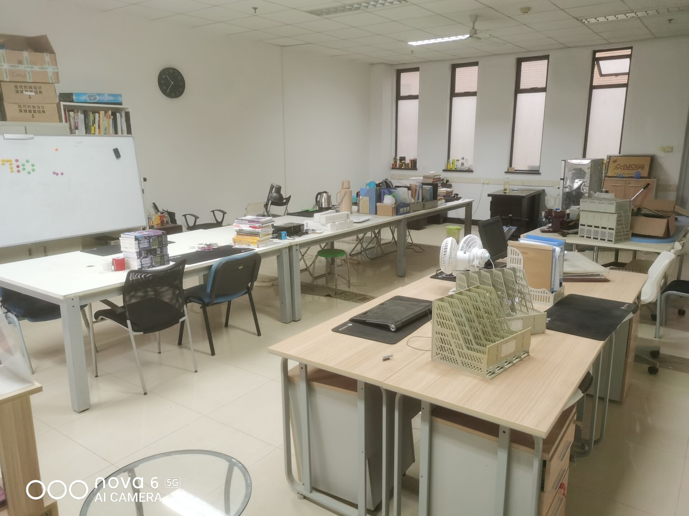
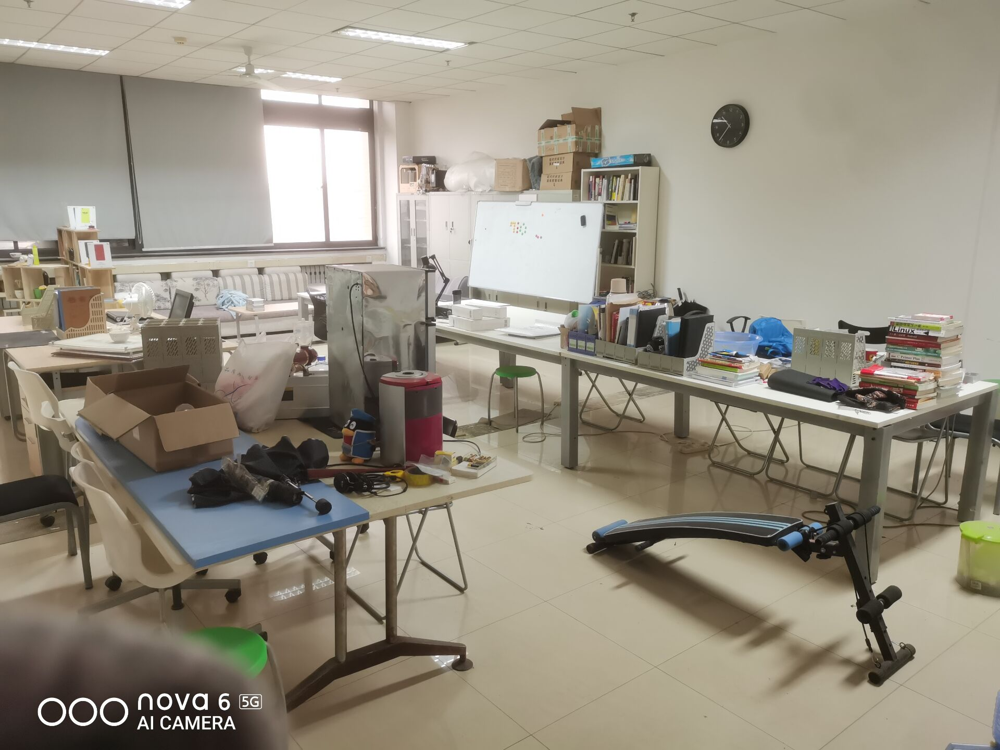
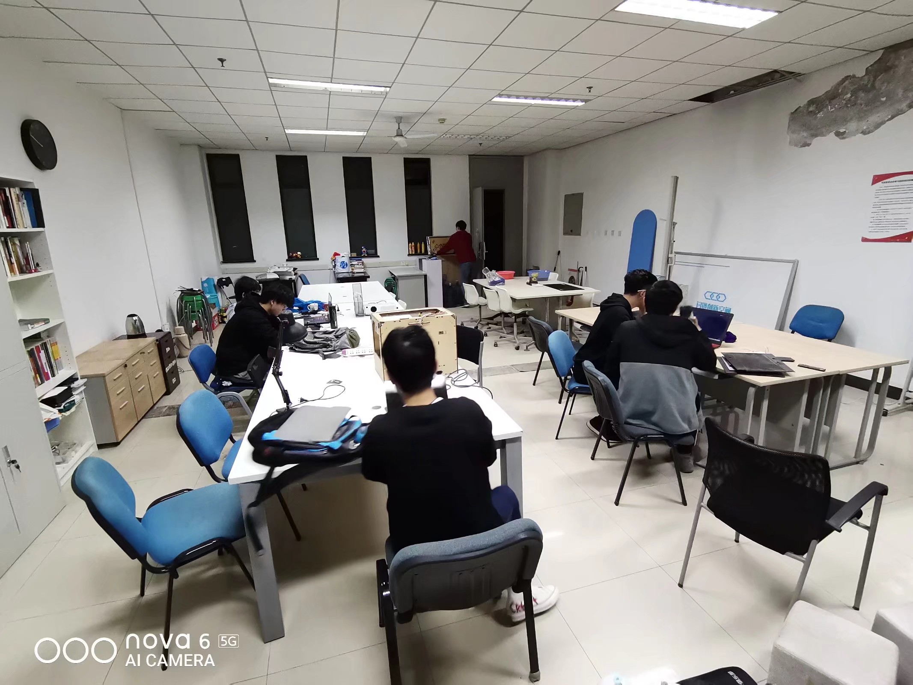
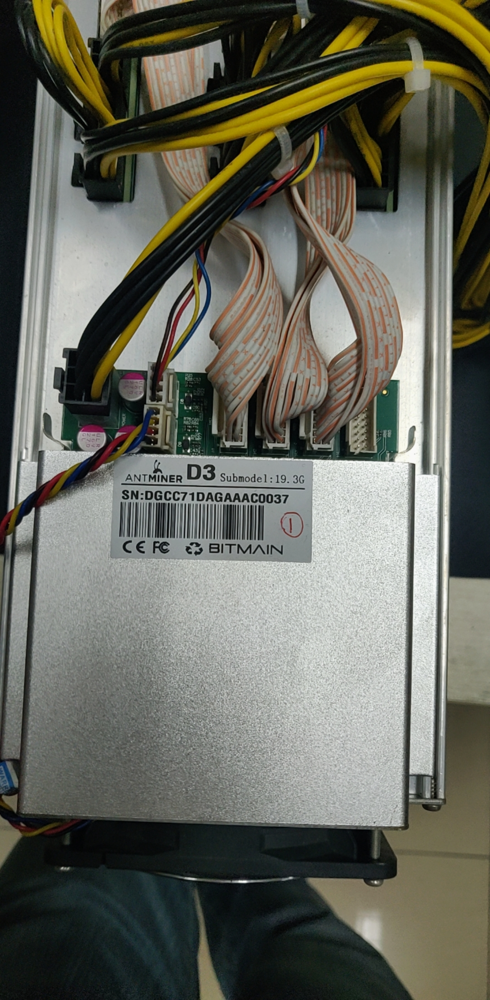

2020 年的程序员节，贵协满血复活，可喜可贺，可喜可贺！！！

虽然 G316 只有 G302 一半大，但至少贵协遗老不再四处流浪了，而且还有空调，夏天能舒服很多

草民吃灰了一年半的喷气式发动机又接上了电源

听说最近 G 楼很多屋子都因为各种原因空出来了，nova 和十三他们也在申请其他教室，好日子要来了。

Update：过了几天之后又申请到了 G546，屋子自然是多多益善可惜离 G316 实在是太远了，爬两层楼不说还得横向穿过大半个 G 楼

在里面寻宝的过程中甚至找到了一台矿机，当然搜了一下 Antminer D3 发现已经完全不值钱了可能就一两百块钱。

还有些破显卡啥的不提了。实名羡慕寻宝的乐趣

下次去成都的话一定要从西安路过一下去看看，顺便跟各位强者约饭啊哈哈哈哈
