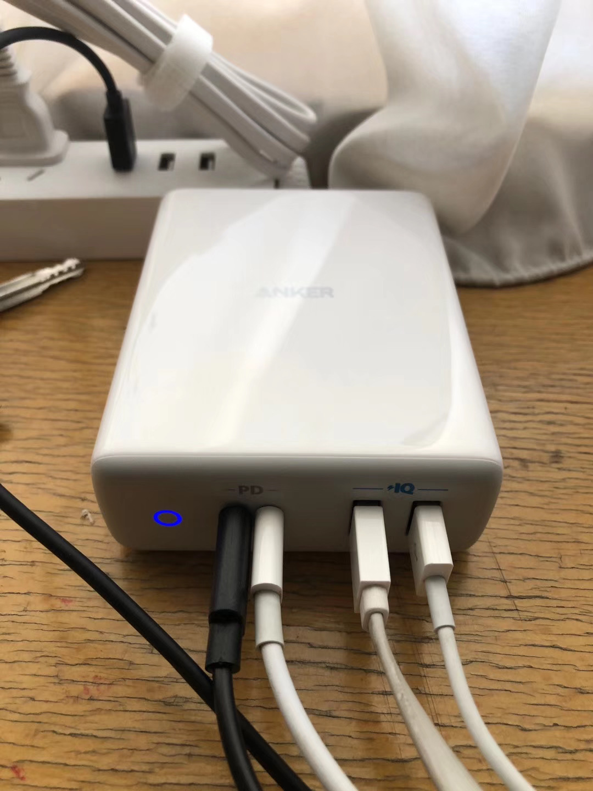
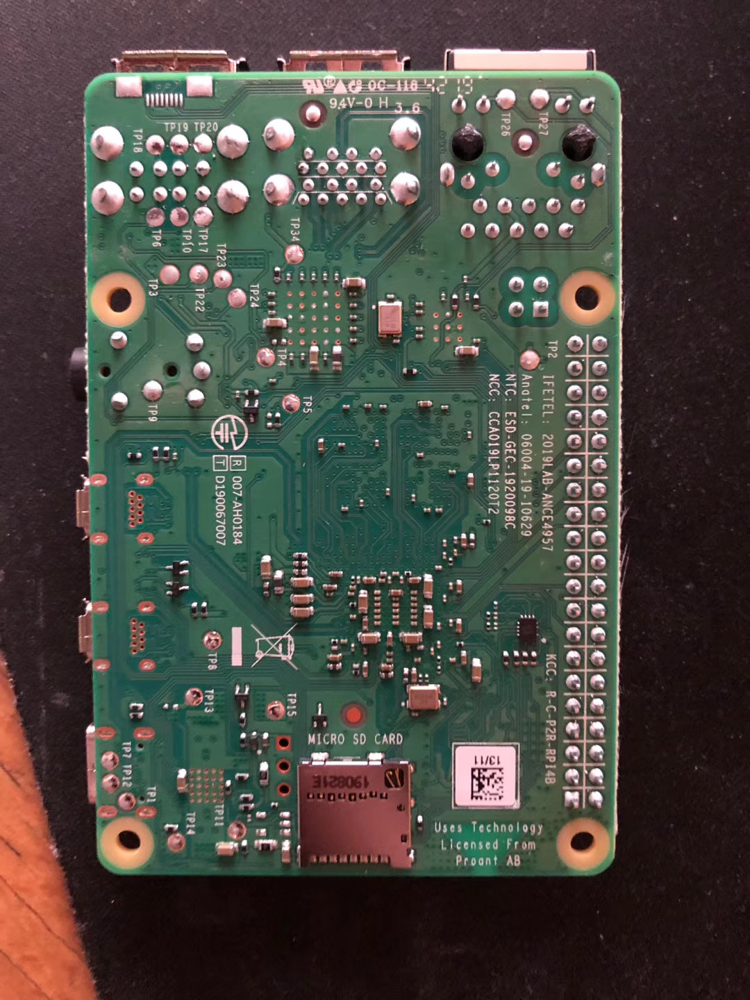
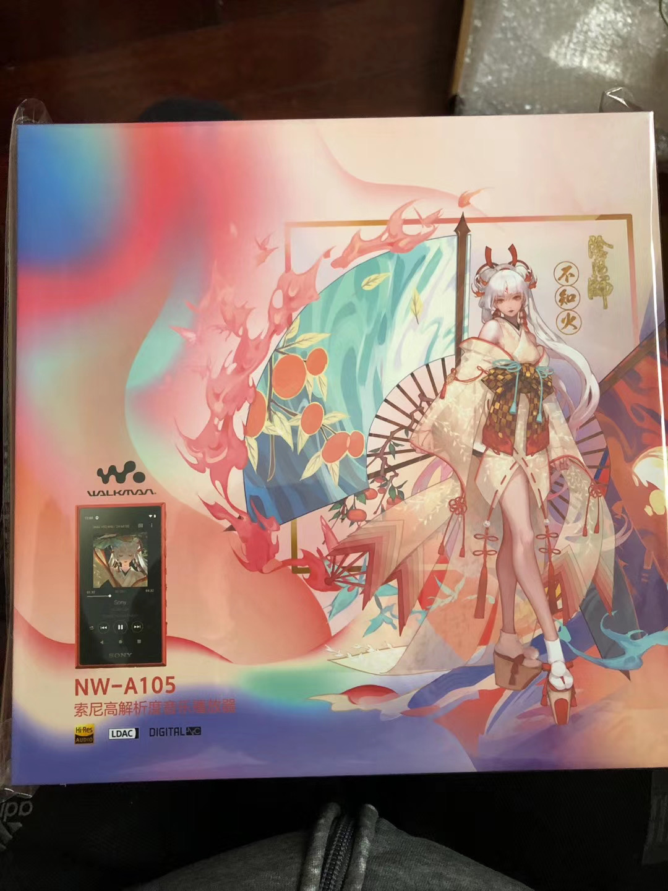
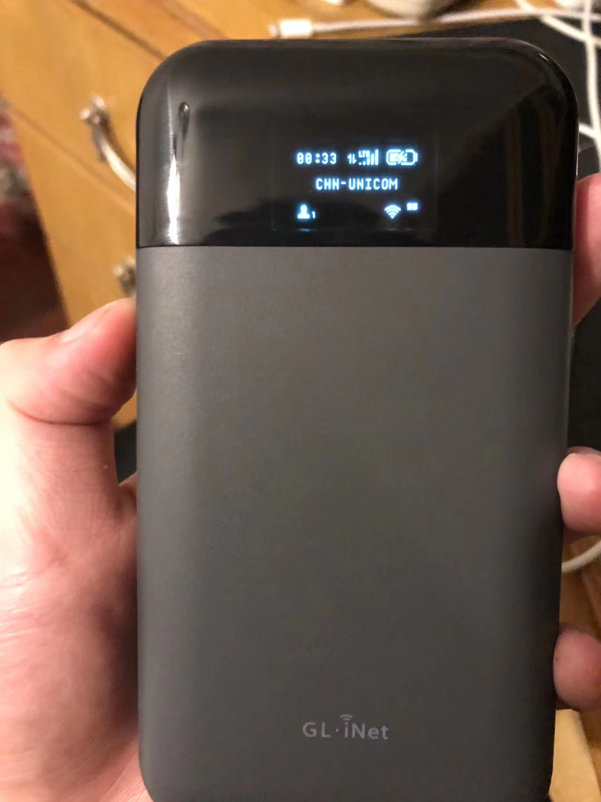
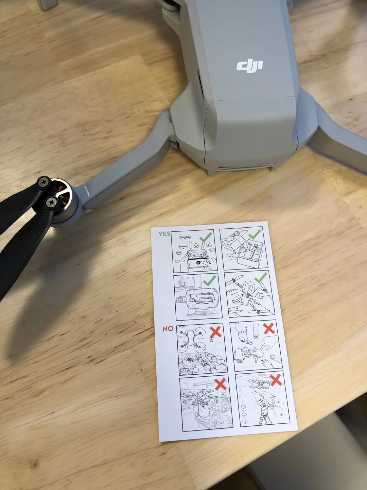
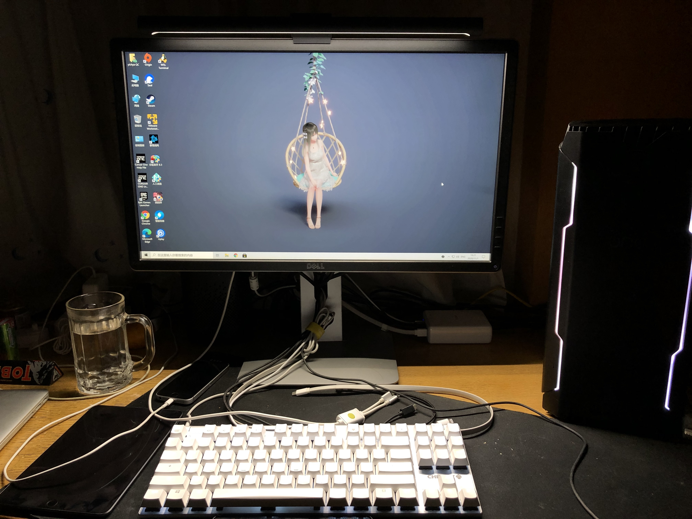
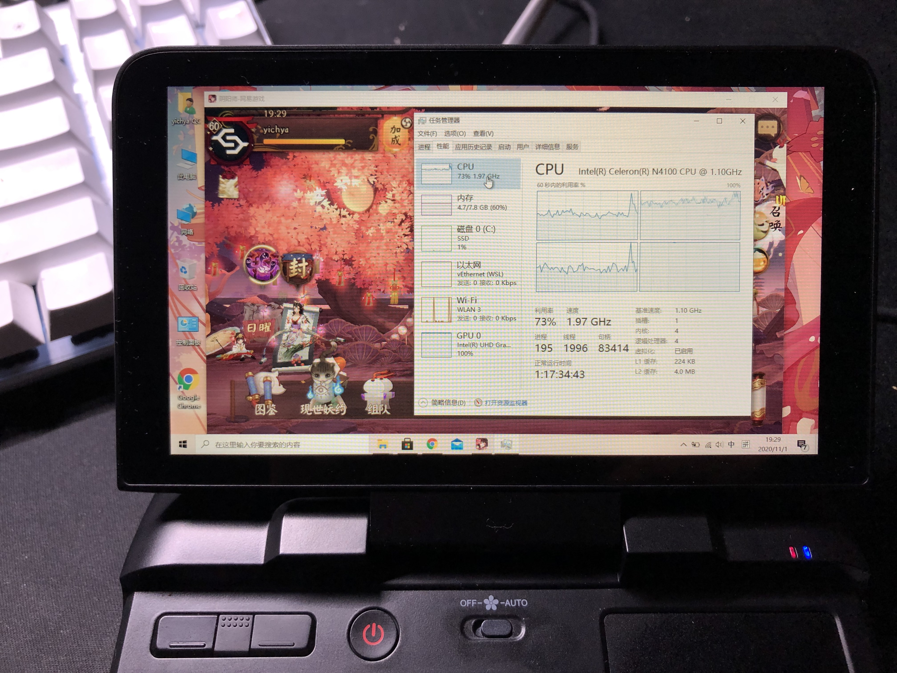

之前立了一个 flag 说定期整理一些 Devices 系列的小东西，结果各种原因就拖了半年拖到了现在，好不容易终于有心情收一下 flag 了。

选了以下这些东西介绍，按大致购买日期排序。里面没提到的要么是实在没存在感（忘了）要么是实在觉得没啥可说。看心情写一些内容，可能会贴一点图说明。

# Anker PowerPort Atom PD 4

先说一句好 tm 贵，将近六百块，简直了。

好用倒是挺好用。两个 Type-C 口能输出 100w，能解决基本所有问题。还有两个 Type-A 应急，但是那两个口就 5V2A，啥快充协议都不支持，这点感觉挺不好的，要是支持一下 QC3.0 就完美了。

中间去深圳之后过了几天就坏了，不知道是那次进了水还是怎么样。狗东很爽快的换了一个。目前安好

Type-C 用来冲一冲 Android 手机、充电宝、MacBook Pro 2017 什么的就很方便，Type-C Lightning 线也十分好用，但这都是标准用例吧。下面说两个不太标准的。

## Surface 转接线

其实当时为啥买这个呢，主要原因是年初 Surface 的电源线放在公司了，因为疫情的关系拿不回来。。。毕竟谁 tm 能想到出这档子事。

后来想起来有这种 PD 转换线，但是当时手头只有一个苹果的充电头，那东西不输出 15v，Surface 用不了，就吐血。于是买了这个应该比较标准的 PD 充电器，果然就一切正常了。

之后几次出门，基本上都是只带这一个充电器 + MacBook Pro 2017 + Surface Pro 4 + 其他小功率设备（手机 iPad 啥的随便怎么都能充上的那种）+ 两三根对应线。比起以前出门带一把充电器的体验好多了。

## MagSafe 转接线

随便买的一根，发现跟这个充电器不兼容，跟小米 20000mah 的充电宝也不兼容（这个充电宝可以充 MacBook Pro 2017 也可以用上面的转接线充 Surface），但是插在 mbp 的充电头上就能用了。

# Raspberry Pi 4B

买到了 Type-C 供电没问题的版本。目前能买到的 4G 8G 内存的版本应该都没有问题，2G 的话……为什么要买 2G 的

刚买 4G 版没多久就出了 8G 内存的版本，感觉就被背刺了一波。但又仔细一想树莓派啥情况下能用到 8G 内存啊，官方系统还是 32 位的呢（内核寻址 8G，单进程最大好像 3G 左右？这样的限制。真要用还是用的完的），而且主要还是实在想不到什么场景要用那么多内存。。。

Type-C 输出不了视频，但是里面居然还有个 USB 2.0 的定义就很神奇。其实要是 Type-C 能加上视频输出，把两个 Micro HDMI 干掉换成一个全尺寸 HDMI，应该比现在的方案更好一些。

当然还是万年吐槽什么时候能加上板子里面的 USB 插针，不要连个什么外设都得从外面接 USB 了，太难受了。

还有一点想吐槽的是买了 A2 的 TF 卡之后才知道树莓派只支持 A1，买 A2 也没用，气疯。

# Sony AW-N105

痒痒鼠的不知火联名版。说联名其实就是

* 包装盒印了一个立绘
* 主推红色（但其实还是自己想怎么选怎么选）
* 带一个钥匙链
* 送一些数字专辑什么的我反正没领

没了。就这？就这。

实际使用体验其实很一般，最大的槽点是按键松松垮垮的感觉就很廉价（虽然其实真的挺贵的两千多呢），而且音质总觉得连 iPhone SE 都不如（看了网上评测对这个东西的音质也是评价比较差的）。还有是 Android 系统，内置搜狗输入法和应用宝，就很烦，全冻结了换了酷安和 GBoard，装了 Telegram 和网易云音乐，然后扔在公司看心情听歌用。实际就基本上是在吃灰。

比较好的一点是有自动关机功能，而且关机真的不掉电，比之前用来听歌的那个真·垃圾堆里面翻出来的三星 mp3 好多了（但总觉得音质不如那个三星）。

# 锤子的真无线耳机

使用体验反正一般，经常莫名其妙断开连接，手势不能自定义，电池续航一般，音质就不说了，入耳检测之类更不可能有。但反正 199 要啥自行车，平时也就扔公司开会用。

# 小爱音箱 Pro 万能遥控版 + Yeelight 的烛泡

夏天开空调用，确实很方便，还可以蓝牙 Mesh 连一些温度计啥的。

最大的问题是 Aux 输入延迟巨高，能有半秒。玩 Crisis，鼠标开枪过半秒才听到枪声，根本没法玩。最多能凑合用来玩玩地平线。看视频什么的倒是感觉影响不是很大。

后来买了 YeeLight 的灯，晚上开关灯也不需要爬起来按开关了，还可以调色温。但是说实话这个灯个人觉得偏暗。

# GL-E750

可能是完美的随身路由：

* 出厂 OpenWrt（虽然是魔改了的）
* 高通方案的双频 Wifi（QCA95xx + QCA9882）
* 自带 EC20，插卡 LTE
* 128MB RAM，128MB ROM
* 7000MAH 电池，Type-C 电源输入（同时可以转接出一个网线口）
* 还有一个 USB 口

实际用下来确实还是挺不错的，但也有几个缺点

* 贵。妈的一千三真的是心在滴血
* 出厂魔改的 OpenWrt 不是很好。。。版本略旧（18.06 的一个很老的 commit）。梯子支持，除了特别传统的 OpenVPN 之类的，官方只有 ShadowSocks 而且版本很老，无论是功能还是稳定性都不理想。
* 私有的一些包只是部分开源，比如跟 OLED 屏通信的 daemon 程序，依赖一个私有库，没有源代码，没有头文件，啥都没有，完全编译不了。
* 虽然合并了支持到 OpenWrt 项目，但实际好像并不能用，几周前自己编译的还是官方的 snapshot 刷进去都开不了机

比较多的问题还是集中在软件上，假以时日还是能解决的吧，硬件确实还是真的很不错的

# Dji Mavic Mini

七月说去阿纳亚玩，以为终于有机会飞无人机了于是买了一台。刚到货那边就特意打电话通知说不能飞无人机。好气。

后来 9 月去青城后山飞了一次，10 月去苏州飞了一次。两次感觉都不错，操控手感什么的比起之前一两百块钱的玩具那是天壤之别（废话）。拍照出的图也非常理想。电池续航也还不错。

总体来说 Dji 东西口碑确实是自己打出来的，很不错。

# Redmi K30 Pro

8 月去成都那次把买来刚一年的 Samsung Galaxy S9 丢了。还好只是丢了个两千块的手机，我当时所有的银行卡、支付宝什么的都绑定在那个号上，结果成都还没办法补办西安的卡，真的裂开。

回来急着用手机，但又不想买最近各个都是挖孔屏或者后面摄像头凸起不对称的那种手机，这样剩下的就很少了，买了看起来还不错的 K30 Pro。

一开始去线下店买，本来想 8 + 128 结果没货了，拿了个 8 + 256，后来发现线上还有 12 + 128 的。。。。。。于是又买了一个 12 + 128 的，8 + 256 给父亲用来换下他那个极为辣鸡的华为了（就不说别的，连双卡 4G 都支持不了，简直是屑中之屑）。

时隔三年用回 MIUI，其实说实话感觉没之前印象那么好了，广告真的多，小米兰亭其实觉得不是特别顺眼，其他的功能其实大家也基本都追上来了，系统也有些莫名其妙的小 bug（比如分身的 VPN 不能设置始终开启，锁屏界面的通知会莫名其妙变成全透明的）。但也没有什么特别感知强烈的问题吧。

其他的

* 拍照确实不错，屏幕、电池、信号等等之类，觉得基本没毛病吧都挺好。说到信号，买回来突然发现平时会去的地方基本都覆盖 5G 了还挺惊讶的，后面出去玩的时候也发现基本大多数地方都有 5G 覆盖了
* 升降摄像头反正我一周开一次可能都算多的所以不怎么介意它的寿命什么的问题，能全面屏更好
* 没有无线充电和双扬声器，其实从 S9 换过来这两点还有点不适应
* 屏下指纹还不错，识别率比 iPhone 8 的明显要高

后面把主力机也从 iPhone 切换过来了，变回了之前那种 Android 机只用于娱乐，iPhone 用于工作（以及大部分跟钱沾边的事情，除了微信支付还扔在 Android 机上）这样的分工方案。后来觉得这种方案更合理，因为疫情后非常频繁需要使用手机接入会议，iPhone + AirPods 的方便程度还是无法替代的。

至于切换过来有没有觉得卡顿，首先装的 App 并不多（qq 微信微博知乎，it 之家，网易云音乐，b 站，高德地图，阴阳师，没了），而且这些应用都比较守规矩（像是淘宝那种不守规矩的真不敢装在 Android 手机上），其实没有觉得有明显的体验下降。真的比较明显的不方便其实还是发现已经对苹果的 Handoff 有一定程度的依赖了。。。

# 小米的显示器挂灯

盼了好久，国庆期间三里屯店有现货，终于成功入手。

可以说是今年花钱买的所有东西中感觉最提升幸福指数的一样东西了，显著提升晚上坐在电脑前面做任何事情的体验。

有一个个人的 Protip 是这样，草民把遥控器放在床头，晚上到家开灯可以去床头摸一下开关，也可以直接把灯管从磁吸底座上拿下来一下再放回去，这个灯重新通电后就会自动点亮而且能维持上次使用时候的亮度、色温设置。睡前用遥控器把灯关了就行。晚上上厕所啥的需要开这个灯也很方便，拍一下遥控器就好了，还可以闭着眼把亮度拧到最低避免被突然亮瞎眼。

# 小米的 65W GaN 充电器

买这个的主要原因是九月初把 MacBook Pro 2017 的充电器忘在会议室了，也懒得找了。。。

这个充电器很小很方便，体积大概是两个五福一安竖着立起来那么大。而且能 33w 充 K30 Pro，也能跟之前买的 MagSafe 线兼容。其实出门要多带一个这个感觉问题也不大，不过没必要就算了。

# GPD MicroPC

买这个的主要原因是发现 Surface 一直在吃灰，然后意识到没有使用它的场景，于是用另外一个可能有的场景替换之。顺便把 Surface 出掉了，里外里相当于花了 400 块不到。

确实小。长边比 K30 Pro 还短 1cm 左右，短边大概是比 iPhone SE 的长边短不到 1cm，可以很轻松放进裤子口袋。出厂系统是 Windows 10 Pro x64，版本很老（1809），颇费些力气才能升级到 2009。而且十分省电，扣上待机一晚上也就掉 2% 左右的电，可以说十分理想了，正常使用只要不是一直让风扇拉满、亮度开最大的那种，其实六七个小时应该是没啥问题。

当然吧，这东西有几个槽点

* 做工真的挺差的，反正就怎么都觉得很廉价
    * 充电器和线都很山寨
    * 主机居然放不平，真令人难以置信。。。自己处理了一下脚垫才能放平
    * 屏幕歪脑袋（据说甚至是通病）
    * 720P 的屏幕有一个坏点（虽然影响不大但就很让人忍不住吐槽）
* 用 Chrome 看 B 站花了两次屏，不知道是什么问题，客户端看 B 站倒是正常
* 触控板居然不能禁用手势。。。。。。没有地方能设置，至少我没找到
* 性能真的差。虽然本来也没抱什么期望，但是，720p 的屏幕，开个 PC 版阴阳师（还不是用虚拟机跑的那种），GPU 100%，CPU 60%，风扇飞转，就这 FPS 目测也就有个十几二十的样子。。。。。。

目前的使用场景主要是

* 中午吃饭的时候可以一遍排队一边做任何需要电脑的事情（比如天天在过工单，烦死）
* 需要终端的时候会比手机和平板都方便很多，同时比平板还好带

# Summary

其实今年还剩俩月，而且马上就是双十一了（

但估计不会有什么新东西入手，真有的话放到明年了 hhh 最近在纠结的主要是

* 苹果全家桶
  * Apple Watch（感觉买了也不会戴的所以不想买）
  * iPhone 12 Mini（主要太贵而且觉得没必要）
  * ARM 的 MacBook（还没出）
  * 新的 iPad Mini（同样感觉没必要）
* 在考虑整个正经的 NAS，主要是至少两个盘位得有吧，但还是要么太贵要么配置太差，也觉得没啥需求，估计逃离帝都了再安排吧

另外以后还是可能半年或者更短时间写一点记录，时间太长容易忘记重点。
