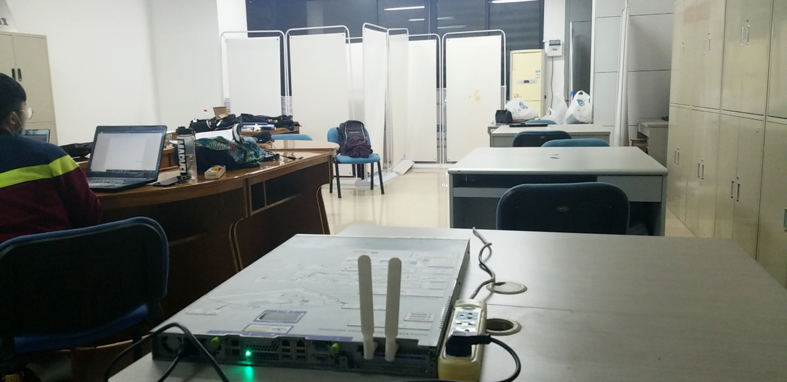
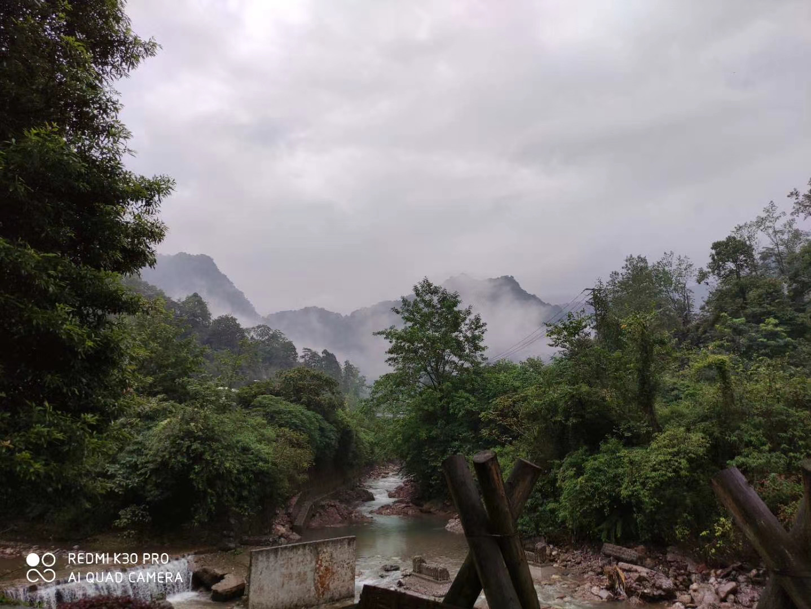
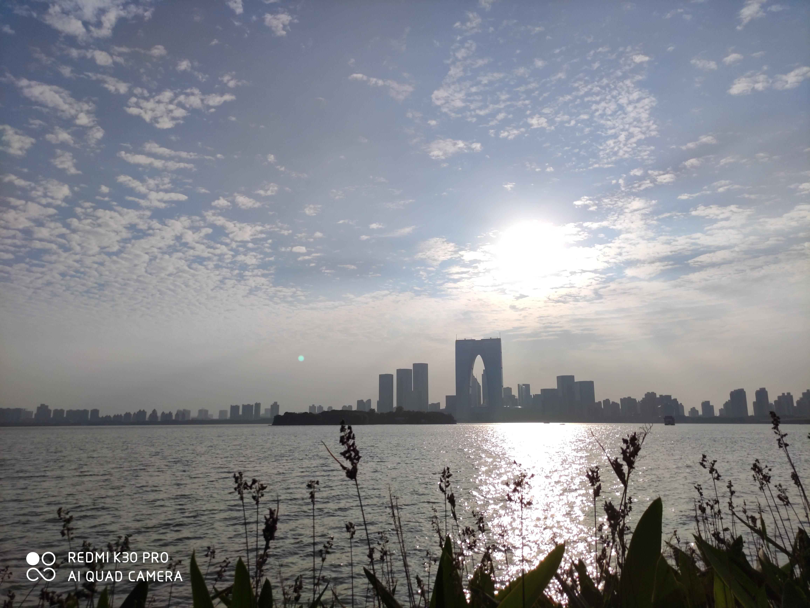
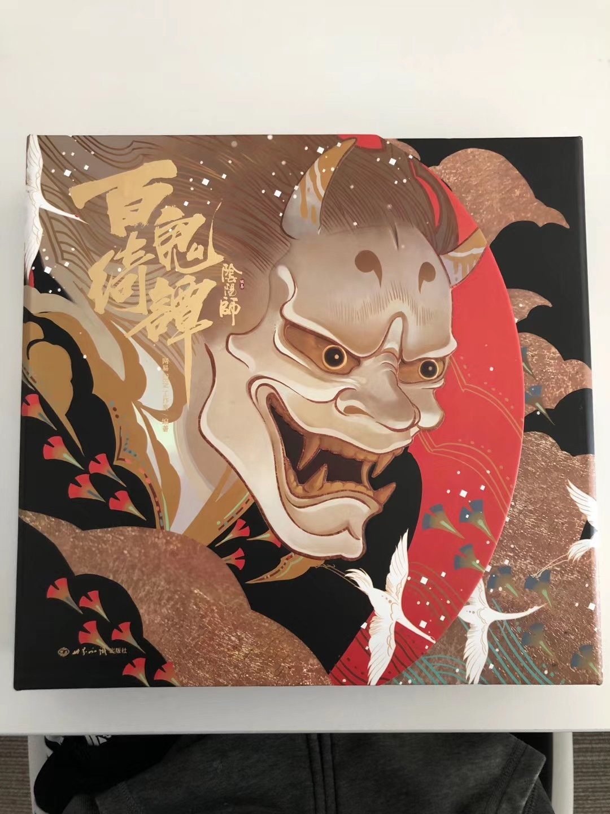
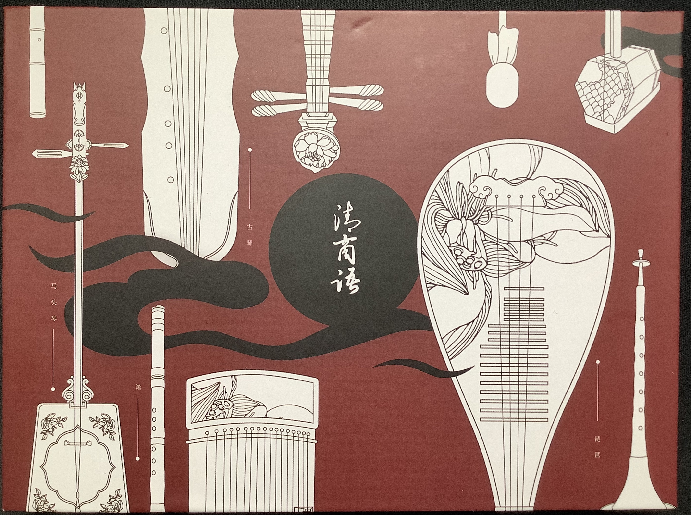

年常系列。

今年从各种意义上来说都是极为特殊的一年，最大的感想还是「覆巢之下，焉有完卵」。小到看个牙（[四月份的看牙记录](../dental-care-during-covid-19/)，以及五月份未能完成的拔智齿，对没错又拖了一年），大到草民的工作，都因为这场突如其来的疫情，变得十分艰难。甚至连今年的奥运会，都不得不因此推迟，放在之前任何时候都真的是难以想象。

_现在应该也不只 59 款了，三次加起来怎么也得上百了_

最近天气冷起来，帝都这边的疫情也开始出现一些反复。当然大家都已经或多或少接受了大环境下的「新常态」，而且其实除了出门常备口罩、动不动就要扫码之外，日常生活大致也没什么变化。

无论怎样，2020 年终于过去，至少还是挺过来到现在了。其实回过头来想想，虽然是这样的大背景，但其实草民自己的话今年可能是人生中拿到了最多成就的一年，可以说还是很值得认真回味一下的。

# Life Mainline

可能说今年最大的一个成就是终于搞定了成都户口（[具体操作](../household-registration-migration/)），并且换了身份证。虽然说这个手续实际办起来十分简单，但是跟家里人沟通花了很大的精力。但无论怎么说，终于推进人生主线了！！！

_老四川人了_

之前可能一直没有特别认真的提过为什么想去成都，但想是真的认真的想过的。

草民没有退路。石家庄真的是不太行，产业发展不起来，环境也差，河北的教育更是可怕。

目前身在帝都，然而现状实在是令人无奈。房租每月就要八千多，而且租房总是对生活的极大压抑：家具什么的都不是自己的，大件也不敢买，说不准什么时候就要搬家。买房的话，限购就已经很难解决；房价更是可怕，附近老房子单价十几万，然而老房子的户型都很不理想，客厅、卫生间等都很小，甚至都不一定有电梯，实际的居住体验很不理想；买远了的话，通勤也是大问题，帝都堵车极其严重，真买车的话也要摇号，地铁虽然比较靠谱，但也不能解决时间成本问题。况且人在帝都，并不一定（甚至是大概率不）意味着能够享受到帝都的好资源。虽然说帝都的上限是非常高的，但是绝大多数人负担不起那个成本。可能说投入不够高的情况下，同样的成本，换个地方的收益更大。

从各方面来看，成都可能目前是最好的选择。最重要的，互联网相关产业已有显著成果，加上政策到位，后续发展空间非常大（与西安之类地方对比）。物价水平很低，房价也比较理想（与上海、深圳、杭州之类地方对比），基本的生存能够保证。此外，优秀的城市规划、覆盖全面的地铁、双机场等，基础建设水平很高；加上周围可玩的地方很多，总体下来能提供很不错的日常生活体验。至于很多人看重的教育水平，虽然不算太能打，但直说，哪儿不比河北好，而且成都还是有很多数得上的名校的，起码成电就不会比草民自己现在的水平要差。即便作为一个求稳的选择，成都也是一个很好的保底，同时也是后续跳一跳的一个很好的起点。

今年去成都搞定了户口之后，其实蛮多同事也有来了解过，大家其实还蛮一致的认为成都不错的，但可能因为诸多原因（比如已经结婚甚至拖家带口了），实际操作起来比较困难。草民目前其实就毫无问题，准备好了行动就是。甚至说明年看好了位置可以先买上，托管给自如之类，让他们收拾好租出去拿来续房贷，草民继续在帝都攒钱，过渡一段时间，等到成都有靠谱的坑位之后再行动，都完全没问题。

目前淘宝买了社保，每个月 562.01 + 50 块钱服务费，如果限购政策不变的话明年十月份就可以去买房了（当然真的想买的话现在都可以，上个月社保卖家还专门过来说他们有一些解决的路子，不过现在也不急，还是按规矩来吧）。

此次折腾下来，大概也可以说算是有了个盼头，有了很清晰、拆解的足够细的目标（凑够社保攒够钱，解决年轻人的第一套房子的问题）。当然此处就真的很羡慕毕业就去了成都的大学室友，已经成功上车，也去他家里参观了下，说真的是草民想象中最好的解决方案了，户型非常实用，总价十分理想，离公司也还挺近，真的是羡慕了羡慕了。

# SSSTA Back

或许也是疫情导致的意外，时隔一年贵协终于又有了自己的活动室，而且一次就两个 [SSSTA Back to Life](../sssta-back-to-life/)

虽然说 G316 G546 加起来才跟 G302 一样大，而且这俩离得真的是有够远。。。

_喷气机又通电了，可喜可贺可喜可贺_

贵协遗老们终于又有地方可以呆了，而且有了根据地，之后开展活动也会容易许多许多。贵协终于又有了美好的未来啊。

# Work

年初说今年目标主要是混吃等死，多照顾照顾自己的心情。虽然其实一直都觉得今年还是比较混吃等死，但是其实回过头来想想，干的事情比起去年真不见得少。今年真的写代码的事情倒是少一些，但是要面试、过简历、开一大堆各种会对齐各种各样的事情、追着各种业务方要进度，比起去年的心累程度有过之而无不及，尤其面试真的是面到心态爆炸，过简历什么的也是脑仁疼，上半年在家工作那段时间更是，上下班时间没有明确的界限，以至于感觉随时游走在彻底黑化的边缘。。。当然带了一些新同学倒是都很靠谱，缓解了一定压力，除了有一个呆了一个月突然就跑了的，搞的草民措手不及。。。

回了国际化之后，比起之前专心搞技术优化，有时候也需要去对接一些特定的产品需求，这个就搞得草民非常头疼。不知道从什么时候开始，工作的流程居然变成了平台这边的研发需要直接跟策略产品对接，然而那些策略产品真的是一言难尽，系统现有的能力都不清楚，想一出是一出，还说不清楚做啥；需求说不清，拉会第一名，非常会跟老板们扯犊子。六月份上的中小企业扶持项目，还吹牛逼说会有多高多高的增长，实际真的是呵呵……还有跟 Shopify 的对接（反正这个大家都知道了，发过通稿），也真的是不知道怎么想的，这么大个项目加起来才有不到二十天的开发时间，真的不知道那些产品天天在干啥？就感觉天天招人，为了达成指标什么奇怪的人都拉进来，结果效率也没见多大提升，反而天天还得收拾烂摊子。

哎又忍不住嘴臭了。但真的，真的觉得颇有一段时间整个就是乌烟瘴气，想起来都觉得暴躁。不说了不说了。

其实要说 Shopify 这个整的还算挺不错的，听说当天 Shopify 股价大涨 4% 多呢，其实应该有点头脑的，完全可以先买上一波的。

_神一样的排版。链接就不带了，随便 google 一下都有_

总结下来今年最大的成就其实也就是年初说的上层重构和一些重大安全预案的支持吧，除此之外无非是一些杂事，不提也罢。

重构这个，花了两年时间把平台的技术债务还的差不多了，这个事情对大家都好。搭配上日常的 Code Review，至少还是可以说很大程度上把代码收拾干净了，也避免了进一步的腐败。团队里面也有一些项目开始尝试 Java，其实草民目前仍然觉得这个语言和搭配的框架就是一坨翔，运行时虽然不至于是一坨翔但是也比较菜。草民之前是旗帜鲜明的反对 Java 的，但是现在需要从更高的角度考虑问题，因此为了向下兼容，还是算了，起码比让不会写 Python 的人强行写 Python，写不好还来说 Python 不行这样要好很多，总之该用就用，能用就用。当然从个人角度来说也应该尝试尝试，毕竟抛开成见扩展自己的知识面也不是一件坏事，有一定了解之后也可以更准确的在撕逼中精准打击某些 Java 传教士的痛处。

安全项目嘛，谁也没想到 TikTok 今年会这样，先是印度后是美国，加之国内舆论压力，颇有一段时间觉得心累。但比起心累来说，更要命的还是保证系统可用性，于是凭借着自己对系统的熟悉程度，主持了整个平台的机房迁移，好在总算是没出什么事情。当然那次还是欠了一些债，两个多月之后爆出来了，于是又背了一个 P0，想想也是哭笑不得。后面也协助准备了一些其他的预案，但说实话，天知道什么时候用得上，计费那边大概不到一个月前还在继续做改造，等他们弄完的话平台就根本不需要什么预案了。

最近在做的事情主要还是安全对接，然而之前的老系统问题实在是太多，大家意识也还是不够强，总体来看欠的债还是得慢慢还。

细数起来，来这边算上实习的时间，加起来也有三年了。除去刚来的那段时间主要做的一些创意相关的事情，总结下来，自己觉得算是个做梦的过程：

* nebula envoy 算是最有野心的一个。除去一些不得不做出来的妥协，它几乎就是最初理想中的样子。
* build stone 算是走的最远的一个。虽然有这样那样的问题，尤其是今年的好几个大项目带来的挑战，但草民仍然认为它比较好的解决了最迫在眉睫的问题，也为之后更好的实践打下了坚实的基础。
* tt_ads 其实算是接锅吧，当然也算是收 flag（指之前说的 python2 -> python3，虽然现在看条件还是不成熟）。这个本来以为不会花太久时间，结果今年各种事弄的拖到了十一月份才差不多完事，好在终于是完事了。对草民自己来说一方面是给平台打基础，一方面也是自己学习和复盘的过程，同时也可以算得上是难得的喘息。

其实今年，跳出去年的成果从其他的视角来看，有时候也经常会怀疑是不是自己的方向错了。很经典的一个例子：spring 那一套的想法是牛逼的开发人员写 java，不那么牛逼的开发人员只写 xml，各司其职。想想确实是非常理想的方式，但问题就在于太过于理想，以绝大多数人的水平（无论是研发还是产品，产品尤甚）是很难严格按照这个模型迭代的，因此发展到现在，能解决的问题已经不如带来的麻烦更多。然而出于各种原因（比如「老子学不动了.jpg」）还是永远不缺人吹……

其实草民想做的事情真的说出来的话，本质上跟这个可能也没有特别大的差别，那这个到底是不是好的实践呢？

今年的绩效其实也算蛮意外的，想草民上半年绝望下半年暴躁再加上不定时嘴臭，但好像大家的评价还是蛮高的。同事关系上感觉也很不错，老板可算不再开午餐会了 hhh 当然今年还是对新同学嘴臭的太多，这个会改会改真的会改。比较让人心乱的事情其实也有，其实也还是人员流动的问题，很多 17 年刚来实习的时候就认识的大佬们今年换组的换组、跑路的跑路，还是难免心有戚戚焉。但从草民自己的角度来说，年初也在想跑路，现在觉得其实还是情绪太差导致的，所以说记住一句话是一定不要在深夜做决定，晚上情绪太容易不稳定了。

明年的目标目前觉得还是专心做技术吧，或者也可以说从头开始做一个新的梦，把它做好。

# Enjoy Life

上半年疫情封锁整的只能在家歇着，加上现在跟父母住一起也不太敢点外卖，以至于好几个月连个烧烤都没得吃，更别提海底捞什么的了。艰难的熬到了五六月份，可算逐渐恢复了正常态。虽然不至于说报复性消费或者旅游啥的，但今年比起去年还是浪的狠一些。至于去的地方，除了公司安排，剩下的基本都是收一收去年和前年立的 flag

## 深圳

六月，人生中第一次出差，久违的坐了飞机，去了深圳呆了两个星期。住在公司对面的亚朵，真的是美滋滋

虽然是来出差的，但是来都来了，该打的卡还是要打的。中间周末去人才公园走走，顺便看看海，结果好几次落汤鸡，主要是整个鞋子都湿了没得换，真实绝望。

本来去看海回来就想顺便去南山公园转转，可惜那天下雨不让上去。后来恰好赶上团建去爬了一波，可能还是天气原因（热的要死，蚊子也多），没走几步就体力不支，十分丢人

走之前一天可算赶上好天气，认真看了看深圳湾

跟两位许久未见的在腾讯的大佬约了饭。腾讯那个大楼确实很可以，中间还专门有两层就用来健身，顶层餐厅也确实很令人羡慕。

除此之外跟之前的 mentor 小姐姐吃了一次潮汕牛肉火锅。有个趣事是当时选火锅的时候选的是怡宝，草民还愣了半天想那不是个做纯净水的牌子嘛？结果服务员真的就拿了两桶怡宝纯净水上来，然后那个就是锅底，草民当时是完全懵逼的。。。但品尝过之后确实那个感觉很可以

总结一下的话，其实个人对深圳的印象真的是很一般

* 到处在修地铁，交通简直爆炸
* 气候太可怕了，实在是太热太潮湿
* 最让人难受的是，每次想去外面溜达溜达，基本都会赶上下大暴雨……

从长远来说，虽然深圳落户基本没门槛，但是房价比帝都还离谱，怎么想都觉得不宜居，真的还是打扰了打扰了.jpg

## 阿那亚

七月底的大团建。说是大团建其实也就呆了一晚上加一上午，主要大概还是各种意义上的成本问题。

本来想着终于有买无人机的理由了，然后买完之后第二天那边就打电话来说不允许飞，郁闷。。。

第一天晚上到，本来说去看海的但天气等原因，娱乐活动改为在民宿看湄公河行动和玩 switch，那个民宿真的舒服。第二天去看海。什么礼堂和图书馆之类的真的很辣鸡，建议当不存在。

_混入 Galaxy 天团.jpg_

个人的感觉是

* 入住手续办理是真的辣鸡，还有摆渡车之类的都不知道地方
* 作为度假村确实很舒服，有食堂有外卖有自助餐，小住个十天半个月什么的很舒坦。交通也比较方便，高铁就能到帝都（多长时间忘了反正不长）。草民回来的时候就是直接坐高铁回来的。
* 人稍微多一点的情况（比如五六个人一起）的话其实民宿的价格平摊下来也就三四百每人每天，就完全能接受。置业的话好像要 2w 多一平，这个除非真的钱多到……

以及，估计短时间内不会想再去。

## 成都

前面说过迁户口要跑至少两次嘛。草民跑了三次，中间那次因为没预约就崩了。但是当时觉得来了不能白来啊，而且当时刚弄完一个大项目十分需要放松一下，于是打算收一下两年前的 flag

梅开二度了东郊记忆。一开始进错了方向，找不到招牌，还以为牌子拆了。

其实里面跟两年前比也没太大变化，当然外面感觉几乎认不出来了。也难怪，上次去的时候旁边的商圈还没盖好，加上这次还是晚上去的。

隔天跑了一趟青城后山，简直可以说完美，太棒了。

恰好是在下一点小雨，其实一开始是很担心说下雨不让上去。从早上不到十点开始爬山，按照高德上某个大佬的攻略，从飞泉沟上去到五龙沟下来，全程没坐索道，走了一大圈，到下午五点左右下来坐车，除去中间大概在山顶停留的不到两个小时之外基本一直在走（中间偶尔坐下休息个几分钟）。

带了无人机，在山顶观景台飞一飞，舒坦。非常喜欢山顶云雾缭绕的感觉

五龙沟那部分其实比起上山的那部分要更有看点，全程都有山涧相伴，非常舒服，而且路其实比起上山的那部分也要平一些。但因为赶时间所以就走的比较快（虽然后面发现并没有必要那么赶

有几个需要注意的点

* 山底下那个什么古镇，还有山顶的那个什么白云寺建议都当不存在，尤其山顶，正在施工，没有任何看点，路还特别难走……
* 注意时间，最后一趟大巴是六点左右离开景区，啊当然其实高铁还有很多，真的错过大巴的话找个黑车到高铁站问题不大

其他的就真的完美。而且重点是交通真的很方便，成都的地铁很靠谱，从任何地方坐到犀浦，下来直接上高铁，半小时左右就到，下车走几步就是大巴。非常适合作为周末一整天的日常健身娱乐，爬完山下来晚上还能在市区里面吃个串串再回家休息，实在是极为舒适。

反正上面说的这些真的就是时间问题了 hhh

## 苏州 + 上海

依然是收 flag 系列。下面也都记录的比较详细，简单贴几个图吧

[Vacation 2020 (1) Suzhou](../vacation-2020-1/)

苏州的话，金鸡湖拿到了全场最佳

同里的话，还行，交通方便带来的优势很大

[Vacation 2020 (2) Shanghai](../vacation-2020-2/)

上海的话其实最主要的活动大概是阴阳师主题店，去看小暮和团子

当然跟贵协上海分部的各位强者吃饭也是很重要的（蟹老板和李居那次忘了拍照了）

顺便解锁了一个成就：在三个不同的城市看海

明年的国庆个人的希望是能继续推进主线（基本上就是指在成都买房）就继续推进主线，推不动的话就去九寨沟看看，依然是收 flag 系列

## 寒冬夜行人

不才的个人专场 live，十一月初看到，发现还是在帝都，当场买票。

疆进酒那个场地正好在天坛旁边，于是顺便去里面转转。其实天坛好小啊，祈年殿更小，完全没有当年看航拍的时候那种气势的感觉

下午因为去的早，跟官方组织稍微见了个面（但反正还是很自闭），其实看得出来大家都是为爱发电，圆滚滚的老板不批假来不了，柚子姐开了个菜鸟驿站忙得不行。。。于是是晚景协助各种事情。其实看大家基本都是学生那样，真的是为爱发电了。

下面这个手牌是某个小姐姐发的。其实还有一些手幅、发卡，还有小姐姐发糖和橘子，啊真好

因为来得足够早，能够挤到很靠前的地方（大概……算……是第三排），四舍五入就是零距离了。云才 szd 但真的可惜没听到天地无疆。现场是真的稳，行走的 CD 真的名不虚传

这个锦旗笑死（看不才的微博还有另外几个，一个比一个有节目效果）

最后合影。

签售。头一次经历这种场面，草民表示真的是 awsl，吓得只会说谢谢了

真的开心，有这么一场 live，今年真的就可以说圆满了。当然如果说真的希望有什么可以改进的地方的话

* 还是需要专门的摄像和直播团队的，这次直播也是用爱发电
* 气氛组可以再熟练一点
* 周边之类如果有准备的话最好能提前公示安排，不要等到检票前半个小时才知道具体签售的流程，以及海报的纸质啊……

总结下来是觉得可能团队对办 live 没太多经验，这个反正也都是添头，而且毕竟第一次问题不大，之后办多了熟悉了自然就好了。然后其实也蛮希望自己能参与的。

直播的视频的话可以看 [BV1pi4y157Mr](https://www.bilibili.com/video/BV1pi4y157Mr) 以及花絮 [BV1Ct4y1k75k](https://www.bilibili.com/video/BV1Ct4y1k75k) （最后还露了个脸）。歌单的话可以看 [https://music.163.com/#/playlist?id=5377481886](https://music.163.com/#/playlist?id=5377481886)

那最后就是明年巡演再见啦！

# Gaming

游戏的话今年肯定有一个最值得期待的就是 2077，跳票好几次，以至于真的现在患上了黄底黑字 ptsd

终于还是玩上了。街头小子开局，慢慢来，下一把选打工人

然而想吐槽的是

* bug 真的多，黑梦简直载入史册
* 开车手感巨烂
* 一开始捏人一不小心弄成了个大妈，结果 2077 年了夜之城居然连整容的地方都没有，头秃

好在跟其他平台的 bug 比起来还算好的，现在 2077 被索尼下架，被微软打上 bug 警告标签，实在是惨。但反正可以等，问题也不是特别大

然后轩辕剑七，其实感觉还不错，但是没什么时间玩，只打了个开头就鸽了

最后阴阳师终于 1500 天啦！！！

除了丫丫之外当年还在玩痒痒鼠的人基本都弃坑了。当年 500 天的时候是 10w 多，999 天的时候是 5w 多，1500 天的时候是 3w 多，讲道理痒痒鼠这个留存真的是非常可以了

今年又买了不少各种周边，比如其实从来没玩过的崩崩崩里面的嘤嘤嘤嘤嘤嘤嘤嘤（逃

这个确实是见到的时候就想买，但当时其实以为已经没得卖了，后来发现官方店里又上架了，光速入手。虽然买了但肯定是不会真的入坑崩崩崩的（

还有一个是 2019 年预定的小葵，等了一年多终于到了。然而这个脸看起来就不太聪明的样子

另外还有比如 b 站出的万古生香、春意红包的音乐盒（半年了还没拼完，太会咕了，下次一定），以及其他的还有蛮多痒痒鼠的周边，最值得一提的大概是百鬼绮谭，不过看版号怕是去年就印好了堆仓库里，但今年才能拿来卖

还有不知火的公交卡，当然能出镜主要是因为它是和不才女神的专辑同一天到的（这张就是上面拿去签名的那一张）

说到专辑，顺便还买了阿杰的清商语和泠鸢 yousa 的折纸信笺

虽然草民现在手头连个光驱都没有，但收藏嘛，买蚍蜉渡海的时候不也没光驱。哦还有银临的三娃琉璃也预订了，看什么时候到。

其他的因为太多了就不一个一个列举了。

# Gadgets

今年立的 flag 要把 Gadgets 系列认真做起来，于是 [Gadgets (2020)](../gadgets-2020/)

里面提到说当时在纠结 ARM MacBook 然后……草民就买了一台，现在用来写这篇东西的就是它了

不得不说这小东西真的不讲武德，编译 OpenWrt 快的飞起。其他的，反正基本上没觉得跟之前的机器有什么很明显的区别，除了现在还只能用 Insider 版的 VS Code，虽然也完全没遇到什么问题。看情况，应该明年会单独写一篇东西介绍它了。

# Projects

今年的个人兴趣主要还是集中在 NAS / 梯子 / OpenWrt 的日常进化 [DIY NAS Project (5) Connectivity Upgrades & Manjaro](../diy-nas-project-5/)

NAS 的话叛教到 Manjaro 快一年，总体觉得更喜欢这种滚动升级的版本，而且也不至于像 Arch 那样太容易滚挂。目前用的到的东西也不需要 AUR，印象中十分稳定，从来没出过问题。另外抛弃了之前用 OpenVPN 做准入的方式，全面拥抱 Tinc，包括现在出门会随身带着的 MicroPC 里面都是装了 Tinc 客户端的，可以随时随地接入回来做各种事情。当然从安全的角度来说 Tinc 目前的协议还不支持 AEAD，但考虑到也不用来翻墙，问题也不大吧。

梯子这块儿可能还是想多说几句。

今年其实比较大的事情是 V2Ray 在 VMess 被扒的底裤都不剩了之后社区引入了 VLESS 协议，后续还引入了 xtls 极大提升了性能。但是维护者 rprx 比较强势以至于遭到了原来的维护者的不满，之后假借开源协议问题发难，终于导致割裂 [Xray, Penetrates Everything.](https://github.com/XTLS/Xray-core)

在当时 VMess 被发现各种安全问题的同时其实社区就有讨论发展方向：

* 继续迭代 VMess，查漏补缺（比如增加了 VMessAEAD 增强健壮性等）
* 从头开始设计新协议，完全抛弃加密和混淆等安全特性，依赖诸如 TLS 等业界已经在大量使用、能够保证安全性和隐蔽性（从外界来看 TLS 底下是什么几乎可以认为区分不了的）的协议保证安全性

然而此事没有 silver bullet

* 其实大多数人是没有足够的密码学知识来自己造协议的，比如 MTProxy 有一段时间就因为不能很好的对抗重放攻击，导致被 GFW 一封一个准。VMess 这次被查出大量问题，也是佐证了这一点
* TLS 虽然大家都在用，但也并不代表着 TLS 就是完美无缺的
    * Server Name Indication（[ESNI 封锁](https://www.iyouport.org/%E6%8A%A5%E5%91%8A%EF%BC%9A%E4%B8%AD%E5%9B%BD%E7%9A%84%E9%98%B2%E7%81%AB%E9%95%BF%E5%9F%8E%E5%B7%B2%E7%BB%8F%E5%B0%81%E9%94%81%E5%8A%A0%E5%AF%86%E6%9C%8D%E5%8A%A1%E5%99%A8%E5%90%8D%E7%A7%B0%E6%8C%87/)）
    * TLS 指纹（[鹦鹉已死](https://github.com/v2ray/v2ray-core/issues/2583#issuecomment-648762186)），也有 NaiveProxy 这样的方案在试图解决这一问题

这个大概也是一个选择的问题吧。从草民的想法来说更信任 TLS，鹦鹉问题的话其实假装自己是 Go 程序的话，虽然不如 NaiveProxy 那样假装自己是 Chrome 那么隐蔽，但个人觉得也足够 GFW 投鼠忌器。基于这样的考虑，草民其实是很早就跟进了 VLESS，尤其是在拖北邮人这种 TLS 套 VMess 的场景下，的确很明显地获得了 CPU 占用率的显著下降，后来因为 splice 真香就把主力梯子也换成了 Xray VLESS + XTLS，至今已用月余，体验极佳。

OpenWrt 的话在跟进 Xray 的过程中自己从头写了 LuCI 客户端 [luci-app-xray](https://github.com/yichya/luci-app-xray)，集成简单的透明代理功能，做了一系列优化并且迁移到新的 LuCI API，实现了彻底抛弃 luci-compat（强迫症行为

另外今年还有一个比较开心的事情是节点建设，之前买的搬瓦工传家宝 DC6 可以免费迁移到日本机房，Ping 降低至之前一半，带宽能跑满宽带上限，搭配 XTLS 简直爽到。同时黑五采购了 GreenCloud 的新加坡不限流量 Windows 服务器（这个过 CloudFlare CDN 能到 30MB/s 简直可怕），成功把梯子接入点搞到遍布全球

* 新加坡 x1
* 日本 x1
* 美国 x2
* 俄罗斯 x2
* 加上中国的一个阿里云作为 Tinc 接入点

妈妈再也不用担心敏感时期没有梯子用了。

# Finally

个人总结下来，今年其实是达成了很多目标而且收了之前立下的很多 flag 的，开心。最近其实心情也一直还挺不错，除了会因为接到的安全工单太多而焦虑（顺便一提因为这个事情目前患上了严重的星期二恐惧症）

然后还是，新的一年许个愿

* 希望继续推进人生主线（完成定居成都的一系列必要条件）
* 希望能把工作上立的 flag 好好收掉，也能想明白技术演进的方向到底应该是怎样的，可能还需要扩宽视野
* 打卡不才女神的所有巡演，最好能跟后援组织混熟。以及后面可以看看更多的 live
* 继续收之前的玩玩玩 flag（比如九寨沟还有朝天站什么的）
* 接触更多的第九艺术（想打游戏就直说）
* 弄好 Gadgets 系列（至少半年发一次，最好每个季度发一次）
* 坚持 NAS / 梯子 / OpenWrt 日常迭代
* 赶紧把拖了好久的智齿拔了，可不敢再拖了

最后还是认真感谢一下今年各位大佬对草民各方面的照顾，真的感谢
