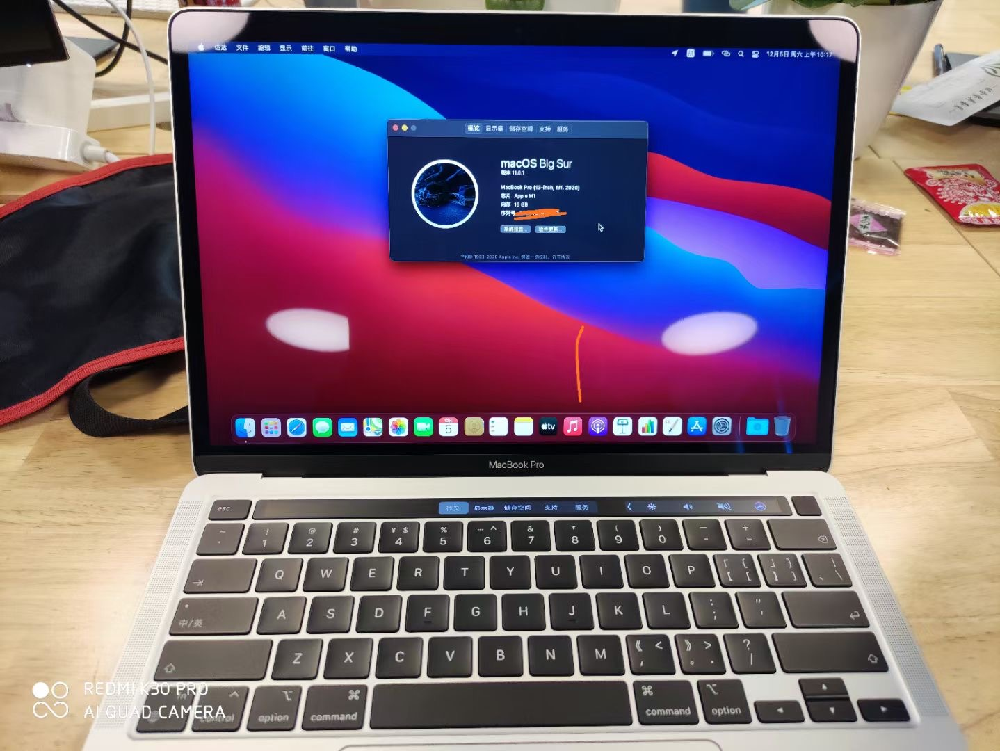
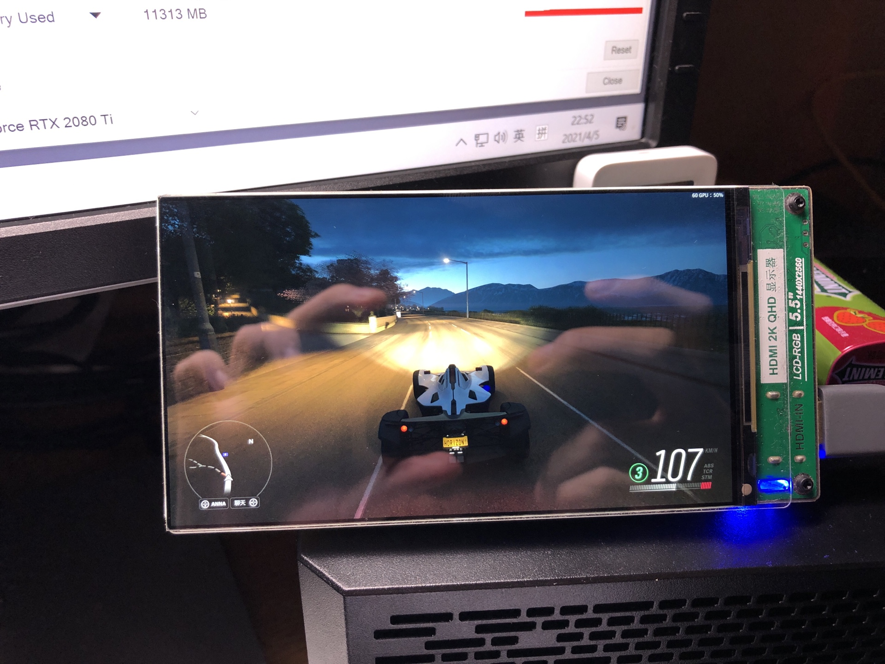
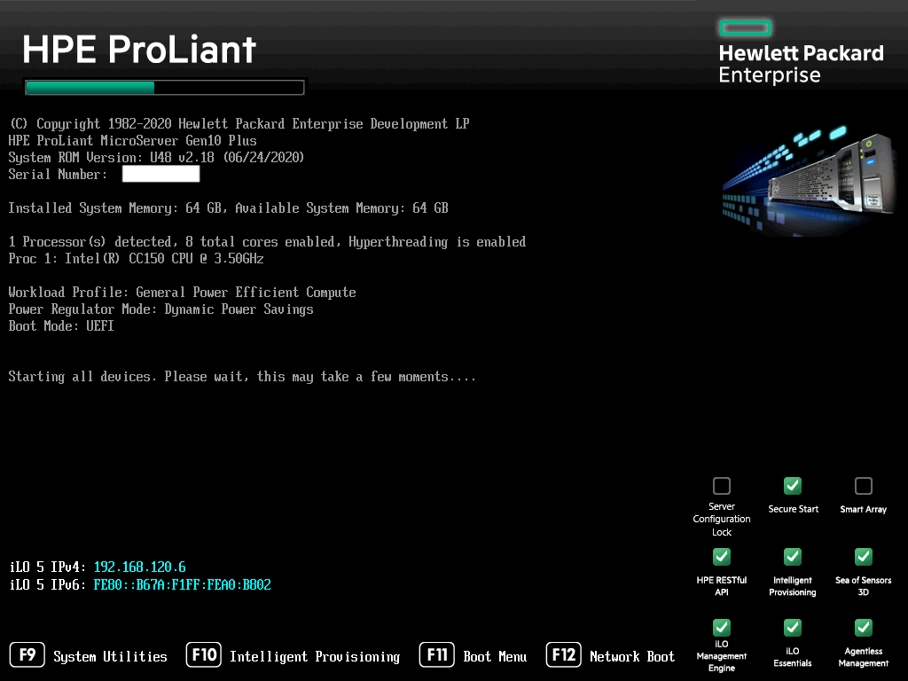

清明小长假按照传统是应该搞些事情的。本来某学弟的室友去长沙玩，草民有意同行，但又一想只有三天假，回来马上就上班，还是太过痛苦了。干脆再缓缓，五一多烧几天年假再去成都一边玩一边做些正事。

之前说 Gadgets 系列半年一发，但数了数近半年入手的设备并不算多，而且不少都在吃灰了。。。

# ARM MacBook Pro

本来说可能要写比较多的东西认真介绍，但是实话说果子哥这次做的真的很靠谱，以至于对于草民来说，它就基本上是一台跟之前一样的 Mac，大多数使用场景都根本没有什么变化。



简单写几个点好了。

## iOS Apps

实际体验还不错，主要说一个微博很舒服，bilibili 一般（主要是不能调整窗口尺寸，首屏有段时间莫名其妙的啥也没有，动态倒是没问题），公司的 Lark 也可以用 iPad 版，除了发截图比较费劲之外都很舒服。


但是其他的就没啥了，官方上架的并不太多，11.2 官方又封禁了通过 Apple Configurator 直接拉 ipk 下来双击安装的玩法，最终这个功能实际可玩性有限。

不得不说每次都是微软画的饼被苹果做出来。。。什么扁平化，UWP，ARM PC，都是微软先来的，结果 UWP 凉了，Surface Pro X 也不太行（M1 甚至半虚拟化都能吊打 SQ1，惨），Fluent Design 也没把 Windows 10 目前支离破碎的系统 UI 救回来，结果 Windows 10 X 也咕咕咕了。

## Daily Software

因为草民现在重活都在 NUC 上干，MacBook 基本只用来面试开会写文档等，所以没有装 JetBrains 全家桶，日常软件其实就是 Chrome 和 VSCode 比较多，当然终端还是需要的（包括博客用 jekyll，走了点弯路折腾，但现在反正能用）。虚拟化不是重点，主要只是想试试 M1 的性能如何。

其实就刚买来的时候开始绝大多数的 App 都已经给了原生，到现在草民电脑上装的所有东西里面，除了公司的 VPN 客户端还是必须 Rosetta 之外已经没有什么不是原生的 App 了。


Seal 有一个非常烦的点是它有一个 golang 写的常驻进程必须 Rosetta 跑。那玩意儿也没人知道干啥的

### Chrome

Chrome 应该是最早有 arm64 的，草民应该是 Chrome 有了正式版才下单购买这款 Mac 的。

用下来感觉就是正常的 Chrome，跟之前没有任何区别。

### Homebrew

2021 年年初官方正式支持了。在那之前也能用，除了一些细节之外也基本上没有什么明显的问题：

* 要装在 `/opt/homebrew` 下面，官方的意思是这个目录下装 arm64 的，原来的 `/usr/local/homebrew` 装 x86_64 的
* 刚开始的时候 arm64 版绝大多数东西都要 build from source，那其中又有很多编译不过去（比如 qemu 最早就完全编译不过去，当然现在虽然都 bottle 了也还是完全不能用）。正式支持之后大多数都是 bottle 了。

### VSCode

1.54.1 正式支持了 M1，比起其他的很多软件算是比较晚的了。

之前用了一段时间 Exploration 和 Insiders，似乎都没遇到啥问题，插件什么的也完全可以用。当然后面换回正式版的时候涉及到把测试版装的插件挪到正式版上，具体就是 mv 了两个目录（`~/Library/Application Support/Code` 和 `~/.vscode`），插件和配置什么的就都回来了。

### Virtualization

虚拟化的坑比较多，主要是靠谱的虚拟机很难找。

* Parallels 有是有了，但要花钱，还挺贵，草民不是刚需就没装，因此不知道具体如何。
* brew 装的 qemu 几个月了还是完全不能用，启动就崩溃。
* UTM 前段时间很火。搭配上 Virtio for Windows 驱动，认真调试是可以搞起来一个完全可用的 Windows 10 on ARM 环境的。但是 UTM 自己小问题很多，比如鼠标莫名其妙没了之类的会让人很心烦
* Docker 之前的测试版小问题比较多但是也勉强能用，大概一个月左右之前发了 RC（[https://docs.docker.com/docker-for-mac/apple-m1/](https://docs.docker.com/docker-for-mac/apple-m1/)），RC 还是相当稳定的。

草民的虚拟化场景主要是用来编译 OpenWrt，因此只需要命令行，就十分完美。当然话说回来，M1 上编译 OpenWrt 可以说一波三折。

* 最早想尝试直接在 macOS 上用原生的环境编译（甚至不过 Rosetta 那种）。然而工具链花式翻车，实在是折腾不动了。
* 后来是 UTM 开个虚拟机编译，环境没问题了，性能非常惊人。当时测了一下 `make dirclean` 之后编译 OpenWrt，M1 开 `-j8` 六分钟完事，9900K 开 `-j12` 好像是五分钟不到，可以说非常可怕了。但是 UTM 小问题太多，使用体验很差。
* 再后来等啊等的可算等到 Docker 了，弄了个镜像编译，效果很不错。于是目前一直就这样用了。

有一个点需要注意下：aarch64 下面 go-bootstrap 不能用，因此需要指定一个现成可用的 go 工具链，否则是无法编译比如 Xray 之类软件包的。apt 装一个然后按下面这个图找对应的配置项改掉就行了。


## Hardware

比起之前的 Mac 大概可以说有好有坏。好的自然是

* 非常优秀的性能和电池续航，好到让 Intel 连续破防（普且信
* 键盘很舒服，回到了类似 2015 款的设计，而且终于有了独立的 ESC 键，Touch Bar 也不再难以接受了。比起草民的 2015 款，回弹更加有力，打字体验非常好
* 触控板跟 16 款的一样，个人觉得虽然比 15 款大但是 Force Touch 的手感就不如 15 款的来的干脆
* 屏幕什么的保持了一直以来的优秀水平

坏的地方下面重点说一下。当然其实草民觉得最不爽的地方是没有 32GB 内存的配置，这年头 16GB 只能说勉强够用，跑个 JetBrains 全家桶再开几个 Chrome 真的就分分钟烧光。。。

### Connectivity

硬件上其实有一个很大的槽点是蓝牙和 WiFi 链接的稳定性真的很差，在公司连 AirPods 面试，可能半个小时左右，耳机和 WiFi 会突然同时断开。。。

一开始说是 Big Sur 的问题（顺便一提 Big Sur 真的拉胯，小毛病不断，甚至 UI 都开始出各种岔子了，真不如改名叫 Bug Sir 得了），然而更新了几次系统，现在是 11.2.3，好像也没有完全解决这个问题。

还有一个问题是每次把 AirPods 从手机切到 Mac 上，Mac 都会认为它是 Hands-Free 模式，而且 macOS 辣鸡就辣鸡在什么地方呢，它没有明确的能够改模式的地方。。。Windows 虽然也经常莫名其妙进 Hands-Free（怀念一下因此被我暴力破拆了的小米蓝牙音箱，虽然现在也能用但是在吃灰了），但右下角点一下就能切回来了，macOS 就要断开连接再连上好几次才能把模式正常改回来。

### SSD Wearing

M1 Mac 的 SSD 异常写入量问题网上有很多报道了，草民这台倒是还好，用了小半年现在写入大概也就 2TB 左右，距离 150TB 还有些日子

```
=== START OF SMART DATA SECTION ===
SMART overall-health self-assessment test result: PASSED

SMART/Health Information (NVMe Log 0x02)
Critical Warning:                   0x00
Temperature:                        43 Celsius
Available Spare:                    100%
Available Spare Threshold:          99%
Percentage Used:                    0%
Data Units Read:                    7,163,865 [3.66 TB]
Data Units Written:                 4,405,182 [2.25 TB]
Host Read Commands:                 141,403,280
Host Write Commands:                82,130,428
Controller Busy Time:               0
Power Cycles:                       173
Power On Hours:                     73
Unsafe Shutdowns:                   7
Media and Data Integrity Errors:    0
Error Information Log Entries:      0

Read 1 entries from Error Information Log failed: GetLogPage failed: system=0x38, sub=0x0, code=745
```

当然草民的是 16GB 内存的版本，听说 8GB 的那些情况就很严重了（所以为什么好多人在推荐 8GB 版还说什么跟 16GB 使用体验完全一样，内存这种东西真的永远不嫌多的，SSD 用不完就是用不完，内存可是太容易用完了）

## Summary

总结下来个人觉得买的不亏，这款 Pro 非常好的满足了草民对它的需求。之前用的 15 款和公司发的 17 款现在都吃灰了。

最后还有一个非常后悔的是去年真的应该把送修回来的 16 款 Mac 领回来的，这样去年买这款的时候还能直接官方折旧个三千多，那才是真的不亏

# LilyGo 的两个小东西

没时间搞，加上不熟悉 esp32，吃灰了。


透明电视那个，就感觉做工实在不太行，屏幕甚至是歪的。遥控器也很离谱，能不能用完全看脸。

墨水屏那个被我一不小心压坏了一个边，虽然好像不影响显示，但是看着真的很难受。所以说有个外壳还是非常非常重要的。

手头有好几个 esp8266 / esp32 的设备了，最近在想是否有可能在这种设备上跑 tinc 客户端实现非常低成本的内网穿透（主要给 iLO 用），但是估计不太容易，很可能还是得用 wr703n 或者其他能跑 Linux 带网线口的设备（手头也有不少了）来搞。

# 稚晖君开源的充电宝显示器

海象高科买的很早的一批。

做工比较差，最大的问题是外壳材质就是一圈亚克力还粘的很不走心，屏幕也贴的不是很好。送了一张钢化膜居然还比屏幕长一截，这轻轻一压就 GG 了，贴了还不如不贴。

技术很不成熟，问题很多，比如树莓派还需要用卖家提供的 config.txt 才能正常显示，估计 edid 写的很有问题。


_不改 config.txt 就这样，这玩个锤子_

x86 设备倒是正常，但是只能用 50Hz 的刷新率，就很离谱。



_在正确配置的前提下这块屏幕还是可以解锁很多姿势的_


_当然更实用的玩法应该还是倒过来，小屏看一些监控_

屏幕素质蛮不错的，肉眼观感很好，分辨率和颜色的都不错。虽然并没有设备认真测，仅供参考。

其实过了几个月，很多地方都已经在卖优化了很多的版本，兼容性好了很多，也有了起码像样的外壳。草民还是下手太早，而且现在其实也基本上用不到了，真的以后再有需求的话可能再另外考虑更好的了。

# USB HDMI 采集卡

这个主要是树莓派什么的都需要一个能 HDMI 输入的设备。之前用的是 Xbox，但是它现在吃灰了（啊明年能不能逃离帝都啊，想要大客厅，想要装投影）。网上一搜发现这玩意儿很便宜，就买了一个狗东自营（[https://item.jd.com/100016584544.html](https://item.jd.com/100016584544.html)）。用起来很方便，Windows 的话插上直接用，打开自带的相机就可以看到画面了，而且非常清晰，除了延迟比较大之外基本上没有什么问题。


有人可能觉得上面那个屏幕的图是不是线的问题或者树莓派的问题，上面这个图是用同一个树莓派同一根 hdmi 线接采集卡的效果。

# 稚晖君开源的量子计划开发板

看视频觉得很不错，但是实际拿到手，试玩了几天之后还是感觉比较坑。

* 发热高的离谱，真的是烫到不敢摸的那种，之前后面没贴散热片的时候，放一会儿不动就过热关机了
* 高温导致无线芯片（螃蟹的 8723BU，走 USB，同款但是走 SDIO 的 8723BS 非常常见于各种辣鸡平板）工作很不稳定
* 操作系统是个花式魔改的 Ubuntu 16.04，真的是很说不过去。。。所以说有一个很重要的点是真的尽量不要买国产 ARM 开发板，生态真的远远不如树莓派，甚至大多数都是丢过来一个能开机的就再也不维护了。

有个小技巧，官方给的说明上说要用一个 sd 卡启动。照做，启动进去了之后再拿个 U 盘什么的把官方给的那个镜像整个 dd 进内置的 emmc，再拔掉 sd 卡就可以从内置的 emmc 启动了。


目前吃灰，而且因为无线稳定性实在太差，真的也想不出来有什么用。如果这个以后能有比较像样的外壳并且能把散热弄好一点的话可能还是有点用。

其实说真的这种，看了很多国产的 Linux 开发板，最终树莓派还是永远的神，最后敲碗等一个靠谱的能跑 Linux 而且带无线的 RISC-V 板子。

# 万由的双盘位 NAS

其实本来说逃离帝都前不改目前的软路由方案了的，毕竟原来那个方案并没有什么问题，依然相当好用且十分稳定，但是因为硬盘已经几乎没停工作了一年半了，实在担心数据安全所以打算上两个盘 RAID1，恰好看到了某个视频介绍，价格也还行，就没忍住下手了。

到手之后其实就真的就是后悔，非常后悔。。。在我手里呆了刚好一个月，转手出掉了。

* 最大的问题是噪音太大，内置的风扇不是调速风扇，噪音又偏大，像草民这种情况就放哪儿都很不合适
* 其次是蓝色的指示灯是真的瞎眼，太瞎眼了。。。刚到手那天把原来 3215u 软路由的 SSD 用 USB 转接板连上这个 nas 当系统盘，那个转接板上的蓝色指示灯更过分，不仅亮，还会闪，晚上真的不要想好好睡觉，绝了
* 此外还有一个问题是内置的 emmc 太小，16GB 装个带图形界面的 Manjaro 就基本上 10GB 没了，要经常清理日志、pacman 缓存什么的避免把系统盘撑爆。
* 机器内置的只有一个 NVMe 插槽，没地方插无线网卡有点难受，于是不得不把吃灰很久的 Mikrotik hap ac2 拿出来当 ap 用。草民本来想试试用转接线装无线网卡，但不知道是什么原因并不能够使用，甚至设备都检测不到。万由官方那个四盘位的就很猛，直接在 nvme 插槽上插了一个 sata 转接卡……实话说这个真的有点坑，幸亏当时没有脑子一热直接上他家四盘位的。

其他的倒是还好，VT-d 直通很顺畅，并不需要改内核啥的。2.5G 的螃蟹网卡需要 5.10 以上的内核才能支持，比如 Manjaro 这些的选一下新内核就可以，或者 OpenWrt 没有开 testing kernel 就是还在用 5.4 内核的话把 [lean/r8125](https://github.com/immortalwrt/immortalwrt/tree/master/package/lean/r8125) 这个包拖下来编译就可以用了。如果切了 testing 的话选上 r8169 应该就行，但草民当时测的时候好像有些问题没起来，后面也就没再看了。

最后想吐槽一下万由那个官方的软路由系统，感觉非常粗糙，就是个半成品，毫无亮点，还不如自己整的 Manjaro 顺手。

总结下来其实觉得这一波真的血亏，仅仅为了 RAID1 换这套方案，实在是投入太高，收益太小。

# HPE MicroServer Gen10 Plus

也不记得是搜什么东西的时候搜到了这个 [https://www.chiphell.com/thread-2200679-1-1.html](https://www.chiphell.com/thread-2200679-1-1.html)，真的是一眼心动。其实一直都想买个靠谱的服务器，替代掉之前性能还是比较不够的工控小主板和 nas，恰好这次看到了这一款，纠结了几天还是下手了。

直接找了一个淘宝卖家改配，拉满 8 核 16 线程的 CC150 CPU 和 64GB 的 ECC 内存，加上 iLO 卡。



除了没有万兆网卡（之后也可以上群晖那种一个 pcie 槽集成万兆网卡加两个 nvme 槽的扩展卡，现在不上主要是因为海盗船只有千兆网卡，这台设备上万兆没有任何意义，其实挺遗憾的）之外都很完美。

系统盘就，因为 pcie 槽还空着，所以直接就是拿了一两年前买的某个拆机 UFS 转接的 U 盘当系统盘。当然这个 U 盘本身的性能很好，4k 什么的表现都堪比 ssd，拿来做系统盘并不会有任何性能上的问题，而且 128GB 的容量也完全足够。之前随便拿了一个能 UEFI 引导的 U 盘当系统盘，那个的性能就非常难以接受了。。。现在这种比较好的 U 盘也算是普及了，狗东什么的地方都有卖的。

64GB 内存是真的爽（所以说内存真的很容易用完）

```
> free
               total        used        free      shared  buff/cache   available
Mem:        65710080     1770168      490664       55532    63449248    63165684
Swap:              0           0
```

最后预告一下，因为这台设备到手也就刚一个星期左右，还没来得及认真折腾，更详细的折腾记录会写到新的 NAS 系列中。新的 NAS 系列名字会改成 `Real NAS Project`，大概第一篇内容会包括迁移系统的经历、如何组 btrfs raid 以及 HP 的 iLO 相关的一些东西。时间不确定，大概六月中旬吧。

