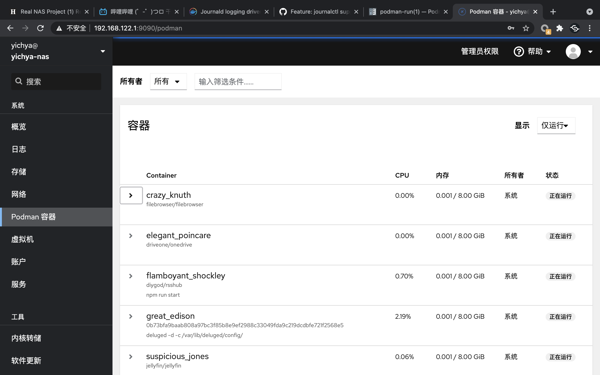

上回 Gadgets 说到，因为对数据安全性的担忧（主要是指当时小主机的硬盘已经连续工作一年半没停了），加上机缘巧合买了万由的 NAS，然后没过几天看到了 Gen10 Plus 又纠结了一番之后还是入手了。

现在到手也有个快一个月了，从上次算过来，最近一年在 NAS 上的升级也蛮多的，挑几个简单的点介绍下。

# Boot OpenWrt with UEFI

之前老的虚拟机都是用 SeaBIOS 启动的，后来了解了一下，装一个 edk2 就能把虚拟机搞成 UEFI 启动了。

```
> sudo pacman -Qs edk2
local/edk2-ovmf 202102-1
    Firmware for Virtual Machines (x86_64, i686)
```

已有的虚拟机想切换到 UEFI 的话也不难，虽然 virt-manager 里面不能改，但是可以用 `virsh edit` 来做。直接改一下 os 那一节，填上 UEFI Loader 就行：

```xml
<domain type='kvm'>
  <os>
    <type arch='x86_64' machine='pc-q35-4.2'>hvm</type>
    <loader readonly='yes' type='pflash'>/usr/share/edk2-ovmf/x64/OVMF_CODE.fd</loader>
    <nvram>/var/lib/libvirt/qemu/nvram/OpenWrt_VARS.fd</nvram>
    <boot dev='hd'/>
  </os>
</domain>
```

NVRAM 那一行不写也行，libvirt 之后会自动补上一个。

当然虚拟机里面的系统肯定是需要重装了，对于 OpenWrt 来说倒是简单，官方提供的镜像都是同时支持两种启动方式的，直接切换就行。如果从之前不支持 UEFI 的镜像升级到新的支持 UEFI 的镜像的话，**配置是会全丢的**，所以需要提前准备好备份。

切换之后实际的体验只能说：完全没啥区别，启动甚至还比以前慢了，还不如不弄。

# Virtio-fs & HugePage

Virtio-fs 这个实在是太猛了，比起之前那个 Plan 9 不知道高到哪里去了。虽然没有直接对比过性能（主要是旧的环境已经拆了，现在没条件了），但是可以很负责任的说比 Plan 9 至少快十几倍，几乎跟在 Host OS 里面直接读写硬盘差不多。

想用 Virtio-fs 需要在 Host 和 Guest 之间共享内存。根据文档（[https://libvirt.org/kbase/virtiofs.html](https://libvirt.org/kbase/virtiofs.html)）看有几种做法，草民比较推荐的做法是开 HugePage，因为这么做相对简单，同时也可以白嫖一些性能提升（虽然感知可能不一定很强）。

## Guest OS

Virtio-fs 大概是在 5.4 内核之后支持的，当然 OpenWrt 默认没带，需要 `make kernel_menuconfig` 选上。


重新编译，升级一下就行了。

## Host OS

Guest OS 支持了之后就需要对 Host OS 做一些配置了。基本参考 [https://libvirt.org/kbase/virtiofs.html](https://libvirt.org/kbase/virtiofs.html) 里面的介绍，跳过一些用不太到的步骤。这些配置同样 virt-manager 都不支持，所以还是全都需要上 virsh 来改。

首先准备一下 HugePage，这东西对虚拟化这种场景来说，肯定是有了绝对不亏的。一个 HugePage 正常来说是 2MB（Linux 还支持 1GB 的，但是好像开起来比较费劲），也不用太多，像这里就是 560MB，绰绰有余。

```
> cat /etc/sysctl.d/40-hugepage.conf
vm.nr_hugepages = 280
```

完成后改一下虚拟机的内存配置。

```xml
<domain type='kvm'>
  <memory unit='KiB'>570368</memory>
  <currentMemory unit='KiB'>570368</currentMemory>
  <memoryBacking>
    <hugepages>
      <page size='2048' unit='KiB'/>
    </hugepages>
    <access mode='shared'/>
  </memoryBacking>
</domain>
```

再重启，就能看到已经有一些 HugePage 被用掉了。

```
> cat /proc/meminfo
...
CmaFree:               0 kB
HugePages_Total:     280
HugePages_Free:        1
HugePages_Rsvd:        0
HugePages_Surp:        0
Hugepagesize:       2048 kB
Hugetlb:          573440 kB
...
```

最后 `virsh edit`，找到原来 Plan 9 的文件共享，加上一个 `<driver type='virtiofs'/>`，其他都不变。

```xml
<domain type='kvm'>
  <devices>
    <filesystem type='mount' accessmode='passthrough'>
      <driver type='virtiofs'/>
      <source dir='/mnt'/>
      <target dir='host_hdd'/>
      <address type='pci' domain='0x0000' bus='0x01' slot='0x00' function='0x0'/>
    </filesystem>
  </devices>
</domain>
```

重启进入虚拟机，改一下挂载的配置，把文件系统从 9p 改成 virtiofs，就可以挂载上了。

```bash
# cat /etc/rc.local
mount -t virtiofs host_hdd /mnt
```

简单测一下，读一个 1.1GB 的文件只需要不到 6 秒，比起原来 Plan 9 那个龟速可以说是飞跃。

```
# time dd if=1100M.zip of=/dev/null
2322610+1 records in
2322610+1 records out
real	0m 5.48s
user	0m 0.63s
sys	0m 1.91s
```

如果希望性能再好一些的话可以配 DAX，但草民自己感觉配起来太费劲，意义也不是特别大（主要是一些缓存上的优化，对频繁访问共享的小文件比如 Kata 那种场景来说比较有用），这次就没搞了。

# RAID1 on btrfs

刚刚入手万由的时候，把 18 年买的 10TB 的盘又翻出来搞的，结果还算好使，就是两块盘不一样大导致费了很多心思在怎么分区上。

之前 12TB 的盘（实际大概是 10.9TiB）是分成了 10TiB + 916GiB 的两个分区，大的那个整个给 btrfs 拆几个子卷出来一起用，小的那个专门用作 OneDrive 同步盘。但现在需要跟另一个 10TB（实际大概是 9.09TiB）的硬盘组 RAID1，想了很久最后决定原来 10TiB 那个拆成 9TiB + 1TiB 两个分区，9TiB 的那个拿去跟小一点的硬盘组 RAID1，然后小硬盘剩下的 90GiB 左右拿去当 /home，大硬盘多出来的 1TiB 随便装点不重要的东西。

btrfs 做这个倒是不难，只需要在一个已有的分区上 add 一个新的设备进去，配置一下数据和 meta 都进行 raid1 就行了。当然配置好之后需要手动做一次 balance，会花很长很长时间。。。

# HPE Proliant Gen10 Plus

这波下了血本，可以说自此安心退烧。

最早的工控小板那个配置用了三年半（并没坏，只是退休了）。感觉这个配置应该至少能用七年，说不定十年都行

## Hardware

下图这个配置当时入手是 7900 顺丰包邮，除了硬盘之外啥都有。买完第二天就涨价到 8300 了（现在也没货了）。


目前两个 12TB 机械盘 RAID1 加一个 SN550 做系统盘加缓存，顺便可能提一下把原来的 hap ac2 拿出来当 AP 了。

草民近几天一直在想要不要再买个竞斗云，或者把 ssd 换成 sata 的然后还在机器里面装无线网卡，或者再找找有没有那种好几个插槽的 NVMe 转接卡多接个无线网卡的转接线上去。这台机器四个网口可以分开直通进虚拟机，并不需要对内核做任何调整，十分舒服。

## Operating System Migration

从原来的小主机迁移操作系统过来，先挪到万由那个 NAS 上，再弄到 U 盘上，还是两个 U 盘倒着用，最后换到现在在用的 SN550 上，来回折腾了好多次。像上次有说，拿 U 盘当系统盘也不至于特别离谱，前提是 U 盘的性能起码得说得过去，同时确实也得做好 U 盘火葬场的准备，不要在上面放太要命的东西……

其实系统迁移对 linux 来说真的很简单，草民就只是用 gparted-live 来回把系统盘复制了几次（实际上就是跑几遍 e2image）再顺便改改 `/etc/fstab`。但是 e2image 有个问题是它会把 grub 的一些模块搞挂掉（`error: symbol 'grub_calloc' not found`），解决的话参考 [https://askubuntu.com/a/1263294](https://askubuntu.com/a/1263294)，简单的说就是找个能用的系统进去重新 `grub-install` 一遍就行了。具体原因没有细看，但凭借之前玩过 grub4dos 的经验来看，估计是因为文件不连续就加载不上来吧。

## iLO

IPMI 这种东西嘛，这都没有肯定是不好意思说自己是服务器的。

试用下来觉得还行，图像非常流畅，画质也不错，还可以应急，总体体验远优于 vnc 或者 xrdp。


最大的坑点主要是开机跑了几天之后会莫名其妙罢工，表现为图像正常但是不响应任何键盘鼠标动作。之前用 iLO 2.3x 的时候开机跑个一两天就挂了，后来升级了 2.41，能坚持多几天，最终还是会罢工，必须重启服务器才能恢复正常（还不是只重置 iLO 就行）。也不晓得是不是因为目前跑了一个桌面端的 Manjaro，有些什么奇怪的电源管理策略会碍事。

然后有一个问题是 iLO 的网口是在一个单独的硬件扩展卡上（虽然也可以用共享网口的方式，但是感觉就很亏）。这个网卡是完全独立的，也就是说并不能在 Host OS 里面用，只能连 iLO，就还是感觉很亏。

最后额外提一点，像草民这种在服务器里面开虚拟机跑 OpenWrt 的用法，因为网络是在服务器完全启动之后才 ready，这种情况下可能 iLO 最关键的一些能力（比如改 BIOS 设置或者远程重装系统）就没法用到了。草民近期也一直在考虑把老旧的 wr703n 拿出来专门做内网穿透，方便在真的有必要的情况下保命。

## BIOS Update

在 iLO 里面可以升级 BIOS，但是想找到 BIOS 更新却挺麻烦，需要先注册一个 HPE 的技术支持账号（[https://support.hpe.com/](https://support.hpe.com/)）然后去里面下载。下载完就直接在 iLO 里面升级就行了，非常方便简单。

值得一提的是这台服务器的 BIOS 也是双份的，每次升级实际操作的都是备用 ROM，重启的时候交换一下从新版 BIOS 启动，所以滚挂了也问题不大。

# Filesystem Change

因为买了 SSD 所以自然而然想试试拿 SSD 当缓存，结果发现 btrfs 居然还没这功能。看了一些其他方案，似乎都还需要在内核里面装一些其他的模块来做这个缓存，感觉不仅麻烦而且天知道稳不稳。而且还有一个原因是，btrfs 的 RAID5 还不稳定，不推荐使用，但是草民是打算四个盘都凑齐之后上 RAID6 的。关于凑四个盘这个事情，说起来吧，草民目前的打算是每年趁亚马逊打折海淘一块 WD Elements 12TB（俗称老母鸡，因为里面一般是个降速的日立氦气盘，大家买来基本都是为了杀鸡取卵，把里面的硬盘直接拆出来用的），凑够四块之后把跑的时间最长的换下来当冷备。

顺便一提，草民这儿 64GB 的内存大把都是闲着的（刚装好用的那几天日常就用个 1.5GB 左右，甚至开机放个几天不动就能有超过 60GB 都被拿来做 Cache）。

```
> free
               total        used        free      shared  buff/cache   available
Mem:        65710080     1770168      490664       55532    63449248    63165684
Swap:              0           0
```

今年三月底恰好看到亚马逊又有老母鸡，于是就顺手买了一块，但是海淘嘛时间长，服务器装好之后一个多星期它才到货。想着说这一直整 10TB + 12TB 这么崎岖的 RAID 也不是个事儿，还是认真整个看起来顺眼一点的，btrfs 这个现在看着又不太行，最后想了想干脆一把梭上 ZFS 得了。

## Installation and Pool Initialization

ZFS 可能最令人头疼的点就是它那个 [CDDL 许可证](https://en.wikipedia.org/wiki/Common_Development_and_Distribution_License#ZFS_in_the_Linux_kernel)，导致它不能直接编译进内核里面，想用的话颇要自己费一番功夫去装。

还好草民用的 manjaro 官方是给做了可以直接 pacman 装的那种，当然也有需要注意的点就是它是跟内核版本强绑定的（此处就不得不吐槽为什么还有人说 linux 内核模块化，到现在连个稳定 abi 都没有还敢吹模块化，不是能 insmod 就叫模块化的），如果用了一些很崎岖的内核版本的话可能就不一定有了。

```
> sudo pacman -Qs zfs
local/linux510-zfs 2.0.4-11 (linux510-extramodules)
    Kernel modules for the Zettabyte File System.
local/zfs-utils 2.0.4-1 (archzfs-linux)
    Kernel module support files for the Zettabyte File System.
```

装好之后照着教程初始化 pool 创建一些 volume 即可，创建好的 volume 会自动挂到 `/<pool name>/<volume name>` 上。当然建议把挂载点顺便改了，像草民之前都是挂到 `/mnt` 下面，用 `zfs set mountpoint=<path> volume` 改一下就行了。

```
> zfs get mountpoint nas/Private
NAME         PROPERTY    VALUE         SOURCE
nas/Private  mountpoint  /mnt/Private  local
```

## Data Migration

数据迁移的流程就比较复杂。目前需要迁移的数据有两个 btrfs 副本（12TB 盘上的一个，10TB 盘上的一个），但是由于要换文件系统，其中一个 btrfs 副本最终是要被炸掉。于是做法就有两种：

* 直接把旧的 12TB 盘清空掉，跟新的 12TB 盘组成 zfs raid1 阵列之后把 10TB 盘上的副本复制进去。
    * 好处是速度比较快，从 btrfs 复制到 zfs 的过程中镜像是同步建立的
    * 坏处是万一这个过程中 10TB 的盘暴毙了，数据就全丢了
* 先在新的 12TB 盘上建立 zfs pool，然后把 btrfs 里面的数据复制进去，完成后炸掉旧的 12TB 盘，再重建 zfs raid1 阵列
    * 好处是任何时候数据都至少有两个副本，任意一个盘炸了都不会导致数据全丢
    * 坏处就是要复制两次数据（btrfs -> zfs 和 zfs resilver），很慢

草民的硬盘都是正规渠道买的，几块盘 SMART 都一切正常，本来其实莽一点也无所谓（实际上整个弄完也并没有哪块硬盘暴毙），但是草民觉得也不是很着急，而且 resilver 并不影响数据可用性，因此就采取了比较稳的方案。于是，换 zfs 只能从原来的 btrfs 里面 rsync 进来，花了一晚上；zfs 再组 mirror 又 resilver 了一整个白天。

```
> zpool status
  pool: nas
 state: ONLINE
  scan: resilvered 3.17T in 06:56:43 with 0 errors on Mon Apr 12 20:15:46 2021
config:

        NAME         STATE     READ WRITE CKSUM
        nas          ONLINE       0     0     0
          mirror-0   ONLINE       0     0     0
            sda      ONLINE       0     0     0
            sdb      ONLINE       0     0     0
        cache
          nvme0n1p4  ONLINE       0     0     0

errors: No known data errors
```

ZFS 目前有一个问题是还不能把已经建好的 pool 转换成 RAIDZ1 或者 RAIDZ2……就还得想办法搞一些稀疏文件啥的 hack，不过这个功能据说在做了，可是说不定等草民凑够硬盘，btrfs 的 RAID6 也好使了，也支持 L2ARC 了，而且缓存还能跟内核共享不用自己划出来一大片空间。。。

## Automatic Mount

zfs 作为一个从 Solaris 搬过来的文件系统，其实处处都表现的跟 linux 里面的其他文件系统不一样，比如 SPL（Solaris Porting Layer），比如缓存硬是要自己申请一块儿内存弄，比如不能直接用 mount 命令挂载，自然也包括不能直接把挂载点写到 fstab 里面。。。

可以看 [https://lucanuscervus-notes.readthedocs.io/en/latest/Filesystems/ZFS/ZFS - Automount/](https://lucanuscervus-notes.readthedocs.io/en/latest/Filesystems/ZFS/ZFS%20-%20Automount/) 配置自动挂载。更详细的可以看 [https://wiki.archlinux.org/title/ZFS](https://wiki.archlinux.org/title/ZFS)，顺带一提 arch linux 的 wiki 是真的牛逼。

## L2ARC

zfs 开 L2ARC 就真的很简单，准备一个空分区比如 `nvme0n1p4`，然后 `zpool add <pool_name> cache /dev/nvme0n1p4`

当然 zfs 那边比较推荐的是用一个固定的路径比如 `/dev/disk/by-id/nvme-eui.00000000000000000000000000000000-part4` 避免设备太多，重启或者随便插拔一下顺序就乱了。

实际组起来发现命中率实在是感人，跟 ARC 那个从来没有低于过 90% 的命中率来比，感觉空间完全被浪费掉了（虽然那块儿地方不浪费也是闲着）

```
> arc_summary 

------------------------------------------------------------------------
ZFS Subsystem Report                            Sun May 02 15:24:13 2021
Linux 5.10.32-1-MANJARO                                          2.0.4-1
Machine: yichya-nas (x86_64)                                     2.0.4-1

ARC status:                                                      HEALTHY
        Memory throttle count:                                         0

ARC size (current):                                   100.0 %   31.3 GiB
        Target size (adaptive):                       100.0 %   31.3 GiB
        Min size (hard limit):                          6.2 %    2.0 GiB
        Max size (high water):                           16:1   31.3 GiB
        Most Frequently Used (MFU) cache size:         54.2 %   16.0 GiB
        Most Recently Used (MRU) cache size:           45.8 %   13.5 GiB
        Metadata cache size (hard limit):              75.0 %   23.5 GiB
        Metadata cache size (current):                  8.7 %    2.0 GiB
        Dnode cache size (hard limit):                 10.0 %    2.3 GiB
        Dnode cache size (current):                    26.8 %  645.1 MiB

......

ARC total accesses (hits + misses):                                61.0M
        Cache hit ratio:                               98.4 %      60.0M
        Cache miss ratio:                               1.6 %     988.2k
        Actual hit ratio (MFU + MRU hits):             98.1 %      59.9M
        Data demand efficiency:                        98.7 %      27.5M
        Data prefetch efficiency:                      34.0 %     806.0k

......

L2ARC status:                                                    HEALTHY
        Low memory aborts:                                             0
        Free on write:                                               128
        R/W clashes:                                                   0
        Bad checksums:                                                 0
        I/O errors:                                                    0

L2ARC size (adaptive):                                         246.8 GiB
        Compressed:                                    96.9 %  239.0 GiB
        Header size:                                    0.1 %  224.8 MiB

L2ARC breakdown:                                                  988.2k
        Hit ratio:                                     23.7 %     234.5k
        Miss ratio:                                    76.3 %     753.7k
        Feeds:                                                    268.7k

......
```

L2ARC 有一个比较大的问题是这个功能会导致 SSD 写入量爆炸多，像草民用的 SN550 这种不带缓存的就感觉压力很大，甚至目前开机三个周，写入量已经 1.3TB 了。

```
== START OF SMART DATA SECTION ===
SMART overall-health self-assessment test result: PASSED

SMART/Health Information (NVMe Log 0x02)
Critical Warning:                   0x00
Temperature:                        46 Celsius
Available Spare:                    100%
Available Spare Threshold:          10%
Percentage Used:                    0%
Data Units Read:                    405,769 [207 GB]
Data Units Written:                 2,535,170 [1.29 TB]
Host Read Commands:                 2,444,085
Host Write Commands:                22,313,354
Controller Busy Time:               39
Power Cycles:                       8
Power On Hours:                     524
Unsafe Shutdowns:                   2
Media and Data Integrity Errors:    0
Error Information Log Entries:      0
Warning  Comp. Temperature Time:    0
Critical Comp. Temperature Time:    0
```

其实草民最早想弄 L2ARC 的主要目的是想能把大部分硬盘读操作都扔到 SSD 的缓存上，尤其是草民要日常刷北邮人的上传，本来想着的是如果有个持久化的读缓存的话大多数硬盘的写操作都可以 cover 掉。至于其他的加速一些 steam 库什么的，感觉倒是次要的。但是后来一想，硬盘其实最大的损耗一般都在起停的时候对磁头组件的磨损，一直转着倒是没啥。这么一搞，考虑上 ssd 的磨损的话，总体算下来真的是觉得得不偿失。

## Quota

其实是一个拯救强迫症的功能，可以让每一个 volume 的容量看起来都很整齐。


直接 `sudo zfs set quota=10240G nas/Public` 即可，立即生效。

当然设置了 quota 之后会有一个问题是不太好看到实际 pool 的剩余空间，可以用 `zpool list -v` 来看，也可以直接去看其他没有设置 quota 的 volume 的总容量。

```
> sudo zpool list -v
NAME          SIZE  ALLOC   FREE  CKPOINT  EXPANDSZ   FRAG    CAP  DEDUP    HEALTH  ALTROOT
nas          10.9T  3.34T  7.57T        -         -     0%    30%  1.00x    ONLINE  -
  mirror     10.9T  3.34T  7.57T        -         -     0%  30.6%      -  ONLINE
    sda          -      -      -        -         -      -      -      -  ONLINE
    sdb          -      -      -        -         -      -      -      -  ONLINE
cache            -      -      -        -         -      -      -      -  -
  nvme0n1p4   265G   265G  55.8M        -         -     0%  100.0%      -  ONLINE
```

# Connectivity

这次比较突破性的事情是 [Cloudflare 的 Argo Tunnel 免费了](https://blog.cloudflare.com/tunnel-for-everyone/)（Smart Routing 还是收钱），内网穿透白送，速度还很快，简直爽到。顺便尝试了一下 Cloudflare for Teams，也很好用。

## Cloudflare Tunnel

Argo Tunnel 免费之后改了个名字。搭建很容易，而且速度还不错（主要指延迟比之前用 Xray 那个反向代理绕来绕去的做法低太多了，带宽跟那个比也略好一些）。

基本上照着教程来（[https://developers.cloudflare.com/cloudflare-one/tutorials/share-new-site](https://developers.cloudflare.com/cloudflare-one/tutorials/share-new-site)），几分钟就完事了。

实际体验，带宽大多数情况下能有个 300 - 400KB/s，如果脸好的话能有 1MB+ 的样子。


[cloudflare/cloudflared](https://github.com/cloudflare/cloudflared) 是一个纯 golang 写的项目，因此也能跑在 OpenWrt 上。做了一点微小的工作 [yichya/openwrt-cloudflared](https://github.com/yichya/openwrt-cloudflared)，当然有个问题是跑在 OpenWrt 上的话可能还得花点心思考虑要不要走透明代理。

## Cloudflare for Teams

Cloudflare for Teams 最有用的地方个人觉得是 Access 里面绑定的一个鉴权，真的非常好用。Free 版限制最多 50 个用户，完全足够。

个人觉得最舒服的用法是直接用 Github 登录（[https://developers.cloudflare.com/cloudflare-one/identity/idp-integration/github](https://developers.cloudflare.com/cloudflare-one/identity/idp-integration/github)），因为 Github 是为数不多同时被 Teams 支持、支持两步验证又没被墙的服务了。之前在 Github 上配置了使用硬件密钥的两步认证（这个也可以配置成使用某一台电脑提供密钥，比如 macOS，在常用电脑上按个指纹就行），用作统一登录，安全性足够。然后把自己加入特定的用户组，再配置一下每个 app 里面谁能访问就行了。


有了这个就能把很多之前不敢放公网的东西（比如 deluge 和 LuCI 这些没有两步认证的）放出来了，非常非常方便。

## SSH Forwarding

Cloudflare for Teams 有个网页版 SSH（[https://developers.cloudflare.com/cloudflare-one/tutorials/ssh#browser-rendered-terminal](https://developers.cloudflare.com/cloudflare-one/tutorials/ssh#browser-rendered-terminal)），还在 Beta，体验下来大概还算好用，毕竟算个添头，也就不要求那么高了。真的要求很高的话，不如自己部署一个 guacamole 之类的。


除了 UI 比较丑（主要是字体太大了，草民一般会缩小到 67% 来用）之外其他的还不错，似乎用了 WebAssembly，渲染性能很好。延迟个人感觉大概是个几百毫秒的水平，不过很稳定不会丢包。

# From Docker to Podman

算是个被吹了很久的东西，当然草民做这个迁移其实主要是因为 cockpit 放弃了对 docker 的支持，然后觉得 podman 也还行



## Migrate Storage

之前没做迁移的最主要的原因就是所有的镜像都要重新导入一遍，这个实在是令人感觉很麻烦，不过好在直接兼容 docker 的镜像，重新导入也基本上是体力活吧。

```
> sudo podman images
REPOSITORY                         TAG     IMAGE ID      CREATED       SIZE
docker.io/diygod/rsshub            latest  d869573842e9  2 weeks ago   697 MB
docker.io/jellyfin/jellyfin        latest  256eac9aa7e3  3 weeks ago   723 MB
docker.io/driveone/onedrive        latest  ac7c18802022  3 weeks ago   678 MB
docker.io/filebrowser/filebrowser  latest  a68f43720ea6  3 weeks ago   43.4 MB
docker.io/indes/flowerss-bot       latest  54ba2c743621  3 months ago  27.6 MB
<none>                             <none>  0b73bfa9baab  4 months ago  198 MB
```

还有一个坑是，因为 tag 查找的规则变化，好像不能直接启动不带 tag 的镜像了，除非用一个命令 [podman-run(1)](http://docs.podman.io/en/latest/markdown/podman-run.1.html#image) 一次完成导入加启动

```
> sudo podman run -d --restart always -p 8112:8112 -v /mnt:/mnt -v /opt/persistent/deluged/:/var/lib/deluged docker-archive:/home/yichya/deluge.image deluged -d -c /var/lib/deluged/config/
```

## Network Ranges

跟 Docker 不一样，podman 的网络地址不再是 `172.17.0.0/16`，而是默认一个 `10.88.0.0/16`。

草民之前的很多 rsshub 什么的在配置文件里面写死了 `172.17.0.1` 上跑的梯子，一开始没有卸载 docker 的时候原来的 veth 还在，一卸载 docker，veth 没了，结果导致草民的 bot 什么的挂了好久（还有个副作用是日志太多把 ssd 撑爆了）。

如果不想改原来每个容器的配置的话，就需要改一下 `/etc/cni/net.d/87-podman-bridge.conflist`，把里面默认的 `10.88.0.0/16` 改成跟 docker 一样的 `172.17.0.0/16`

```json
{
  "cniVersion": "0.4.0",
  "name": "podman",
  "plugins": [
    {
      "type": "bridge",
      "bridge": "cni-podman0",
      "isGateway": true,
      "ipMasq": true,
      "hairpinMode": true,
      "ipam": {
        "type": "host-local",
        "routes": [{ "dst": "0.0.0.0/0" }],
        "ranges": [
          [
            {
              "subnet": "172.17.0.0/16",
              "gateway": "172.17.0.1"
            }
          ]
        ]
      }
    },
    {
      "type": "portmap",
      "capabilities": {
        "portMappings": true
      }
    },
    {
      "type": "firewall"
    },
    {
      "type": "tuning"
    }
  ]
}
```

## Start containers on boot with systemd

podman 声称自己比 docker 比较大的一个提升是安全性：实现了用户隔离，用户不需要 root 权限也可以使用 podman，而不是像 docker 一样有一个权限很高的 daemon，只有 root 或者某个特定用户组的人可以操作。所以其实像草民这样全都用 sudo 来操作并不是一个很好的做法，留作后面的一个坑吧。 

当然，这么做其实基本也就等于把一些锅甩给用户了，比如就还需要自己准备 systemd target 来自动启动容器。虽然说 podman 可以自动生成，但是还是觉得很不方便，尤其是像草民这样懒得给容器命名的懒狗（

比如举个例子，起一个 [indes/flowerss-bot](https://github.com/indes/flowerss-bot) 并且在启动的时候加上 `--name flowerss` ，然后生成 systemd service 

```bash
sudo podman generate systemd --name flowerss
```

把它扔到 `/etc/systemd/system` 下面就行了。

不加 `--name` 的话生成的文件里面就全都是容器 ID，但不知道为什么加了 `--name` 之后 PIDFile 还是容器 ID

```systemd
# container-flowerss.service
# autogenerated by Podman 3.1.2
# Tue May  4 19:43:03 CST 2021

[Unit]
Description=Podman container-flowerss.service
Documentation=man:podman-generate-systemd(1)
Wants=network.target
After=network-online.target
RequiresMountsFor=/var/lib/containers/storage /run/containers/storage

[Service]
Environment=PODMAN_SYSTEMD_UNIT=%n
Restart=on-failure
TimeoutStopSec=70
ExecStart=/usr/bin/podman start flowerss
ExecStop=/usr/bin/podman stop -t 10 flowerss
ExecStopPost=/usr/bin/podman stop -t 10 flowerss
PIDFile=/run/containers/storage/btrfs-containers/01e9b0768231d44d71cd0be88555a9624a1da7debfa14e83b44ebd2bb48bb522/userdata/conmon.pid
Type=forking

[Install]
WantedBy=multi-user.target default.target
```

其实草民有一点好奇的是 podman 没有默认提供一个 `podman@.service`，当然也可能是出于上面说的安全考虑，不推荐这种用法吧。

## Logging with journald

有一点比较奇怪的是 podman 自动生成的 systemd 服务并不会把日志自动写到 journald 里面去，因为这个行为在 docker 的设定里面是容器启动的时候定义的（[Journald logging driver \| Docker Documentation](https://docs.docker.com/config/containers/logging/journald/)）。

想达到这个效果（[Feature: journalctl support for podman generate systemd](https://github.com/containers/podman/issues/8841)）的话，可以在 `podman run` 的时候加上一个参数 `--log-driver=journald`，但是好像不一定能用，不知道为什么。

```
May 04 19:34:41 yichya-nas podman[32120]: 2021-05-04 19:34:41.279793285 +0800 CST m=+0.500397020 container init 01e9b0768231d44d71cd0be88555a9624a1da7debfa14e83b44ebd2bb48bb522 (image=indes/flowerss-bot, name=flowerss)
May 04 19:34:41 yichya-nas podman[32120]: 2021-05-04 19:34:41.287883446 +0800 CST m=+0.508487182 container start 01e9b0768231d44d71cd0be88555a9624a1da7debfa14e83b44ebd2bb48bb522 (image=indes/flowerss-bot, name=flowerss)
May 04 19:34:41 yichya-nas podman[32120]: 01e9b0768231d44d71cd0be88555a9624a1da7debfa14e83b44ebd2bb48bb522
May 04 19:34:41 yichya-nas conmon[32224]:
May 04 19:34:41 yichya-nas conmon[32224]:    __ _
May 04 19:34:41 yichya-nas conmon[32224]:   / _| | _____      _____ _ __ ___ ___
May 04 19:34:41 yichya-nas conmon[32224]:  | |_| |/ _ \ \ /\ / / _ \ '__/ __/ __|
May 04 19:34:41 yichya-nas conmon[32224]:  |  _| | (_) \ V  V /  __/ |  \__ \__ \
May 04 19:34:41 yichya-nas conmon[32224]:  |_| |_|\___/ \_/\_/ \___|_|  |___/___/
May 04 19:34:41 yichya-nas conmon[32224]:
May 04 19:34:41 yichya-nas conmon[32224]:
May 04 19:34:41 yichya-nas conmon[32224]: 2021/05/04 11:34:41 DB Path: /var/flowerss/data.db
May 04 19:34:41 yichya-nas systemd[1]: Started Podman container-01e9b0768231d44d71cd0be88555a9624a1da7debfa14e83b44ebd2bb48bb522.service.
░░ Subject: A start job for unit podman_flowerss.service has finished successfully
░░ Defined-By: systemd
░░ Support: https://forum.manjaro.org/c/support
░░
░░ A start job for unit podman_flowerss.service has finished successfully.
░░
░░ The job identifier is 2112.
```

主要的意义大概是更方便 `sudo journalctl --vacuum-size=1M`

# File Browser

为了方便拖一些文件出来，简单架设了一个网盘。


[filebrowser/filebrowser](https://github.com/filebrowser/filebrowser) 还算好用，只是缺个两步认证，搭配 Cloudflare for Teams 就很棒。

# Finally

本来觉得五一之前能写完，结果节前一堆破事。剩下的部分在成都写了一半，回家写了一半。

说起来这次五一去成都，被辣鸡天气疯狂针对，连续四天大太阳，热到哪儿也不想去，简直是裂开。回来的时候倒好，飞机居然因为天气原因延误了，推迟了两个小时才起飞。整个下来也只能说一句发霉啦。

想想时间过的也是快，去年九月搞定户口到现在，距离满足成都购房资格要求也就最后四个月了。最近周围蛮多人都在操作买房的事情，草民也觉得差不多该动了。过段时间父母就会去成都先行考察，草民只希望一切顺利，能赶上明年逃离帝都的 timeline 就好。

最近有时候会觉得生活还是需要一些改变。可能说在帝都工作，就会怀念之前上大学的时候那种感觉，那如果逃离帝都在成都定居下来，会不会怀念在帝都工作的感觉呢？
