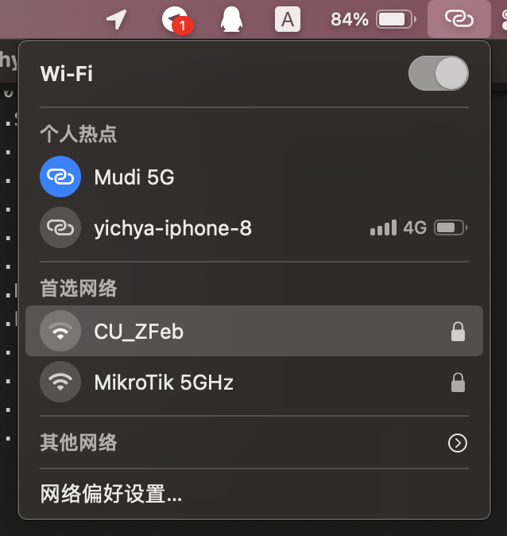

手里有了一台很不错的便携无线路由器，也插了一张流量足够多（20GB 每月）的手机卡，但是因为所有连上去的设备都不知道这是个手机热点，所以流量每次都跑的很快。Windows 还好，可以手动设置成低数据模式；macOS 个辣鸡就根本没办法设置这个。

后来一想，macOS 是可以区分出普通的 Wi-Fi 接入点和 iOS 设备热点的，接入 iOS 设备热点的时候流量消耗似乎会小很多。但它是怎么区分的呢？

# Search

用关键词 `macOS wifi personal hotspot` 搜，首先搜到的是下面这个五年前的问题：[How does iOS and OS X detect when a Wi-Fi network is a personal hotspot?](https://apple.stackexchange.com/questions/199163/how-does-ios-and-os-x-detect-when-a-wi-fi-network-is-a-personal-hotspot)

虽然里面没有什么特别有用的回答，不过这段逆向出来的代码里面提到了一个叫 `IOS_IE` 的东西，但怎么搜也搜不到这是个啥，只好作罢。

```objectivec
char -[CWNetwork(Private) isPersonalHotspot](void * self, void * _cmd) {
    eax = [*(self + 0x4) objectForKey:@"IOS_IE"];
    eax = LOBYTE(eax != 0x0 ? 0x1 : 0x0) & 0xff;
    return eax;
}
```

后来又看了看里面的回答，基本都说的是「这是个黑盒」「说不定是通过写死的 mac 地址啥的来判断的」之类，顿时觉得也没啥希望了。

直到有一天突然发现手里的 Redmi K30 Pro 的热点也可以在 macOS 里面识别成手机热点，虽然不能显示网络类型、信号强度、电池电量啥的，但是确实也是展示成个人热点的，感觉说不定搞清楚原理还是有戏的。。。

后来干脆广撒网，Windows 印象中也有这个特性，于是干脆搜 `detect wifi as metered`，又找到了这个：[Windows 10 does not detect Wi-Fi as metered connection](https://superuser.com/questions/1652404/windows-10-does-not-detect-wi-fi-as-metered-connection)

认真看了一遍，学到了一种叫做 `vendor-specific information elements (IEs)` 的东西。恰好这个题主也是在 OpenWrt 下配置，而且他介绍的十分清楚。说起来这个 IE 看起来好像有点眼熟，好像上面刚刚提过。。。

那这个 IE 到底长啥样呢，它下面恰好举了个在 Windows 下可用的例子

```
0x0000   80 00 00 00 FF FF FF FF-FF FF XX XX XX XX XX XX   €...ÿÿÿÿÿÿXXXXXX
0x0010   EC 41 18 50 A7 35 00 8E-99 81 50 23 98 00 00 00   ìA.P§5.Ž™.P#˜...
0x0020   64 00 31 04 00 1B YY YY-YY YY YY YY YY YY YY YY   d.1...YYYYYYYYYY
0x0030   YY YY YY YY YY YY YY YY-YY YY YY YY YY YY YY YY   YYYYYYYYYYYYYYYY
0x0040   XX 01 08 82 84 8B 96 0C-12 18 24 03 01 0B 05 04   Y..‚„‹–...$.....
0x0050   00 02 00 00 2A 01 00 32-04 30 48 60 6C 30 14 01   ....*..2.0H`l0..
0x0060   00 00 0F AC 04 01 00 00-0F AC 04 01 00 00 0F AC   ...¬.....¬.....¬
0x0070   02 0C 00 0B 05 04 00 08-00 00 3B 02 51 00 2D 1A   ..........;.Q.-.
0x0080   EC 01 17 FF FF 00 00 00-00 00 00 00 00 00 00 01   ì..ÿÿ...........
0x0090   00 00 00 00 00 00 00 00-00 00 3D 16 0B 00 04 00   ..........=.....
0x00A0   00 00 00 00 00 00 00 00-00 00 00 00 00 00 00 00   ................
0x00B0   00 00 7F 08 04 00 00 00-00 00 01 40 DD 18 00 50   ...........@Ý..P
0x00C0   F2 02 01 01 01 00 03 A4-00 00 27 A4 00 00 42 43   ò......¤..'¤..BC
0x00D0   5E 00 62 32 2F 00 DD 08-00 50 F2 11 00 00 00 02   ^.b2/.Ý..Pò.....
```

其中最后 10 个字节代表的就是这个 vendor-specific information elements 的一个例子

```
0xDD (Vendor-specific record)
0x08 (Record length : 8 bytes)
0x00 0x50 0xF2 (Vendor: Microsoft)
0x11 (OUI Type: Network Cost)
0x00 0x00 0x00 0x02 (Portable Hotspot Default: Metered network; limit unknown or not yet reached; matches Windows default for mobile broadband connections.)
```

至于怎么用，OpenWrt 下面只需要用一条简单的 uci 命令，加到 hostapd 的配置上，就可以生效。亲自试了一下，Windows 下面的确好使。

```
uci add_list wireless.radio0.hostapd_options='vendor_elements=DD080050F21102000200'
uci commit
reboot
```

到现在大概可以很合理的去想：Windows 是这么干的，那说不定 macOS 也是这么干的。所以问题就变成了如何获得一个 iOS 设备的 IE？

# Dump

上面那个回答的作者是用了一个 Windows 下的软件抓包。看了一下价格（[CommView](https://www.tamos.com/products/commview/)），可以说十分劝退了。。。

后来又看到一些用 WireShark 抓包的帖子，但是手头恰好没有很方便的无线网卡，于是只好掏出了吃灰半年多的树莓派。。。

等树莓派更新的功夫顺便看到了个在 macOS 下抓包的方式，有一个 macOS 自带的工具 [airport](https://blog.csdn.net/liteblue/article/details/49497893)

虽然一开始没抱什么希望，不过它好像有个 XML 格式的输出，于是试了一下

```
> /System/Library/PrivateFrameworks/Apple80211.framework/Versions/Current/Resources/airport -s --xml
```

得到一个 plist

```xml
<?xml version="1.0" encoding="UTF-8"?>
<!DOCTYPE plist PUBLIC "-//Apple//DTD PLIST 1.0//EN" "http://www.apple.com/DTDs/PropertyList-1.0.dtd">
<plist version="1.0">
   <array>
      <dict>
         <key>AGE</key>
         <integer>0</integer>
         <key>AP_MODE</key>
         <integer>2</integer>
         <key>BEACON_INT</key>
         <integer>100</integer>
         <key>BSSID</key>
         <string>7a:27:c0:89:1a:b3</string>
         <key>CAPABILITIES</key>
         <integer>4401</integer>
         <key>CHANNEL</key>
         <integer>149</integer>
         <key>CHANNEL_FLAGS</key>
         <integer>1040</integer>
         <key>EXT_CAPS</key>
         <dict>
            <key>BSS_TRANS_MGMT</key>
            <integer>1</integer>
         </dict>
         <key>HE_CAP</key>
         <data>/xYjAAAAAAAAAAAAAAAAAAAAAADw//D/</data>
         <key>HE_OP</key>
         <data>/wok9H8AD/z/AZsA</data>
         <key>HT_CAPS_IE</key>
         <dict>
            <key>AMPDU_PARAMS</key>
            <integer>19</integer>
            <key>ASEL_CAPS</key>
            <integer>0</integer>
            <key>CAPS</key>
            <integer>239</integer>
            <key>EXT_CAPS</key>
            <integer>0</integer>
            <key>MCS_SET</key>
            <data>//8AAAAAAAAAAAAAAAAAAA==</data>
            <key>TXBF_CAPS</key>
            <integer>16777216</integer>
         </dict>
         <key>HT_IE</key>
         <dict>
            <key>HT_BASIC_MCS_SET</key>
            <data>AAAAAAAAAAAAAAAAAAAAAA==</data>
            <key>HT_DUAL_BEACON</key>
            <false />
            <key>HT_DUAL_CTS_PROT</key>
            <false />
            <key>HT_LSIG_TXOP_PROT_FULL</key>
            <false />
            <key>HT_NON_GF_STAS_PRESENT</key>
            <false />
            <key>HT_OBSS_NON_HT_STAS_PRESENT</key>
            <true />
            <key>HT_OP_MODE</key>
            <integer>1</integer>
            <key>HT_PCO_ACTIVE</key>
            <false />
            <key>HT_PCO_PHASE</key>
            <false />
            <key>HT_PRIMARY_CHAN</key>
            <integer>149</integer>
            <key>HT_PSMP_STAS_ONLY</key>
            <false />
            <key>HT_RIFS_MODE</key>
            <false />
            <key>HT_SECONDARY_BEACON</key>
            <false />
            <key>HT_SECONDARY_CHAN_OFFSET</key>
            <integer>1</integer>
            <key>HT_SERVICE_INT</key>
            <integer>0</integer>
            <key>HT_STA_CHAN_WIDTH</key>
            <true />
            <key>HT_TX_BURST_LIMIT</key>
            <false />
         </dict>
         <key>IE</key>
         <data>
         AA9hcF9taXNoYXJlX2NmNjABCIwSmCSwSGBsIAEAOwUAU1R9gTAUAQAAD6wE
         AQAAD6wEAQAAD6wCDAAtGu8AE///AAAAAAAAAAAAAAAAAAAAAAAAAAEAPRaV
         BREAAAAAAAAAAAAAAAAAAAAAAAAA3RgAUPICAQGBAAIyAAAiMgAAQjJeAGIy
         LwC/DLIAgDP6/2ID+v9iA8AFAZsA+v9/CAUACAAAAABA/xYjAAAAAAAAAAAA
         AAAAAAAAAADw//D//wok9H8AD/z/AZsA3QoAF/IGAQEDAQAA
         </data>
         <key>IOS_IE</key>
         <dict>
            <key>IOS_IE_FEATURES</key>
            <data>AQAA</data>
            <key>IOS_IE_FEATURE_VERSION</key>
            <integer>1</integer>
            <key>IOS_IE_FEATURE_WOW_DISALLOWED</key>
            <true />
         </dict>
         <key>NOISE</key>
         <integer>-93</integer>
         <key>RATES</key>
         <array>
            <integer>6</integer>
            <integer>9</integer>
            <integer>12</integer>
            <integer>18</integer>
            <integer>24</integer>
            <integer>36</integer>
            <integer>48</integer>
            <integer>54</integer>
         </array>
         <key>RSN_IE</key>
         <dict>
            <key>IE_KEY_RSN_AUTHSELS</key>
            <array>
               <integer>2</integer>
            </array>
            <key>IE_KEY_RSN_CAPS</key>
            <dict>
               <key>GTKSA_REPLAY_COUNTERS</key>
               <integer>1</integer>
               <key>MFP_CAPABLE</key>
               <false />
               <key>MFP_REQUIRED</key>
               <false />
               <key>NO_PAIRWISE</key>
               <false />
               <key>PRE_AUTH</key>
               <false />
               <key>PTKSA_REPLAY_COUNTERS</key>
               <integer>16</integer>
               <key>RSN_CAPABILITIES</key>
               <integer>12</integer>
            </dict>
            <key>IE_KEY_RSN_MCIPHER</key>
            <integer>4</integer>
            <key>IE_KEY_RSN_UCIPHERS</key>
            <array>
               <integer>4</integer>
            </array>
            <key>IE_KEY_RSN_VERSION</key>
            <integer>1</integer>
         </dict>
         <key>RSSI</key>
         <integer>-30</integer>
         <key>SSID</key>
         <data>YXBfbWlzaGFyZV9jZjYw</data>
         <key>SSID_STR</key>
         <string>ap_mishare_cf60</string>
         <key>VHT_CAPS</key>
         <dict>
            <key>INFO</key>
            <integer>864026802</integer>
            <key>SUPPORTED_MCS_SET</key>
            <data>+v9iA/r/YgM=</data>
         </dict>
         <key>VHT_OP</key>
         <dict>
            <key>BASIC_MCS_SET</key>
            <integer>-6</integer>
            <key>CHANNEL_CENTER_FREQUENCY_SEG0</key>
            <integer>-101</integer>
            <key>CHANNEL_CENTER_FREQUENCY_SEG1</key>
            <integer>0</integer>
            <key>CHANNEL_WIDTH</key>
            <integer>1</integer>
         </dict>
      </dict>
   </array>
</plist>
```

结果就在里面看到了 IE，甚至还有 IOS_IE，狂喜。找到中间的 IE，复制出来解析一下

```
> echo AA9hcF9taXNoYXJlX2NmNjABCIwSmCSwSGBsIAEAOwUAU1R9gTAUAQAAD6wEAQAAD6wEAQAAD6wCDAAtGu8AE///AAAAAAAAAAAAAAAAAAAAAAAAAAEAPRaVBREAAAAAAAAAAAAAAAAAAAAAAAAA3RgAUPICAQGBAAIyAAAiMgAAQjJeAGIyLwC/DLIAgDP6/2ID+v9iA8AFAZsA+v9/CAUACAAAAABA/xYjAAAAAAAAAAAAAAAAAAAAAADw//D//wok9H8AD/z/AZsA3QoAF/IGAQEDAQAA | base64 -d | hexdump -C
00000000  00 0f 61 70 5f 6d 69 73  68 61 72 65 5f 63 66 36  |..ap_mishare_cf6|
00000010  30 01 08 8c 12 98 24 b0  48 60 6c 20 01 00 3b 05  |0.....$.H`l ..;.|
00000020  00 53 54 7d 81 30 14 01  00 00 0f ac 04 01 00 00  |.ST}.0..........|
00000030  0f ac 04 01 00 00 0f ac  02 0c 00 2d 1a ef 00 13  |...........-....|
00000040  ff ff 00 00 00 00 00 00  00 00 00 00 00 00 00 00  |................|
00000050  00 00 00 00 00 01 00 3d  16 95 05 11 00 00 00 00  |.......=........|
00000060  00 00 00 00 00 00 00 00  00 00 00 00 00 00 00 dd  |................|
00000070  18 00 50 f2 02 01 01 81  00 02 32 00 00 22 32 00  |..P.......2.."2.|
00000080  00 42 32 5e 00 62 32 2f  00 bf 0c b2 00 80 33 fa  |.B2^.b2/......3.|
00000090  ff 62 03 fa ff 62 03 c0  05 01 9b 00 fa ff 7f 08  |.b...b..........|
000000a0  05 00 08 00 00 00 00 40  ff 16 23 00 00 00 00 00  |.......@..#.....|
000000b0  00 00 00 00 00 00 00 00  00 00 00 00 f0 ff f0 ff  |................|
000000c0  ff 0a 24 f4 7f 00 0f fc  ff 01 9b 00 dd 0a 00 17  |..$.............|
000000d0  f2 06 01 01 03 01 00 00                           |........|
000000d8
```

可以看到两个 `dd` 开头的 vendor-specific 串，第一个是 `dd 18 00 50 f2 ...`，从上面可以了解到这个是 Microsoft 定义的，也就不是我们需要的了。那另一个 `dd 0a 00 17 f2 ...` 大概就是我们要找的了。

# Solution

到现在其实要做的事情就很简单了：照着上面那个帖子把配置写进去，重启路由器

```
uci add_list wireless.radio0.hostapd_options='vendor_elements=DD0A0017F206010103010000'
uci commit
reboot
```

果然好使。



虽然不知道是不是真的会省流量，但是看起来就牛逼了很多。
