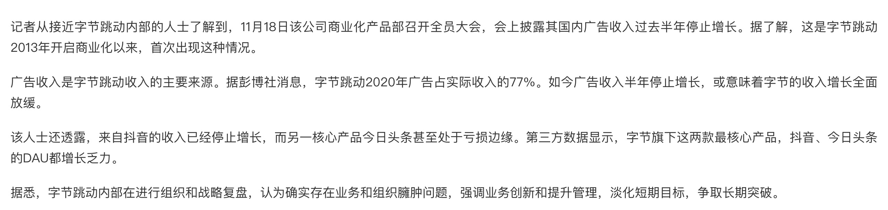
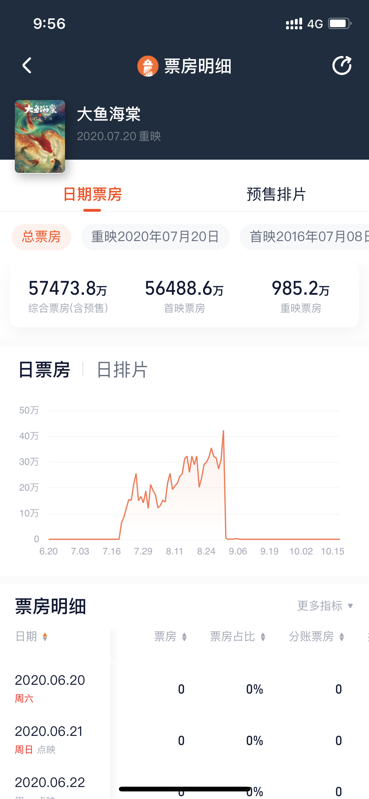
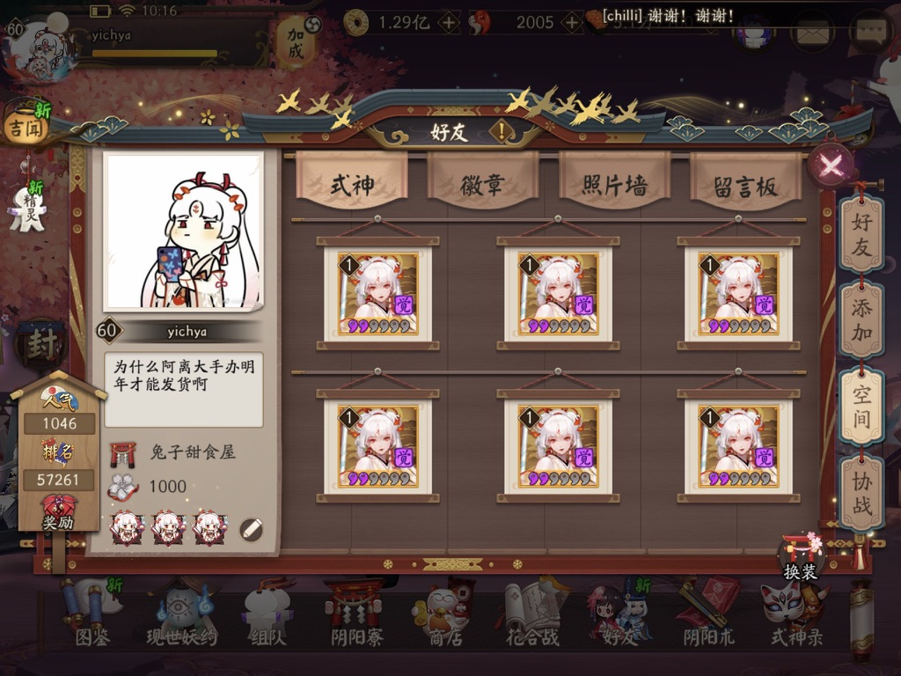

年常系列。

虽然说是年常，但今年对草民来说大概算是极为不平常的一年。总结下来，最大的感想大概可以说是「人生聚散如浮云」。

整个世界还是那个老样子。疫情还在肆虐，但大家的生活也还是那样照常过。想来今年最特别的事情反而还得算是社会主义铁拳，这个是真的没有想到。几拳下来，太多太多的行业都受到影响，太多太多的人生活都就此改变。

比如房地产。指导价，五道红线等等，都对整个市场带来了很大的冲击，甚至多家房企接连暴雷。此事大概对草民的影响最大，毕竟人生主线今年正是关键时刻。

比如教育，整个行业凉凉，甚至猿辅导要沦落到去卖羽绒服。大概是影响的人最多的行业。

比如游戏，虽然不至于整个行业凉凉，但是也有非常多的细分领域受到极大影响。

作为曾经广告部门的研发，房地产、教育和游戏行业的广告预算，数额之大，占比之高，令我印象极其深刻。今年这几个铁拳下来，字节跳动的广告收入在这种情况下还能做到仅仅是「停止增长」，可以说已经很难以置信了。不得不说电商那帮神仙是真的能卷。

很多时候我也真的对商业化部门的所做所为颇感不适，比如[“防水补漏”如何全网割韭菜](https://card.weibo.com/article/m/show/id/2309404715725276447308?id=2309404715725276447308)，虽然并不能确定是谁家，不过其中广告相关术语真的是听到耳朵都起茧子，大概率所言非虚。

今年草民自己也做了非常非常多的重大决定，比如提前推进人生主线、离开呆了近四年的字节跳动，等等。此次就是，「超越过去，一切自今日始」了吧。

# Life Mainline

去年立的最大的一个 Flag 今年算是成功的收了回来。持续交了一年社保，九月份终于搞定了购房资格；以及今年参与了部分期权回购，手里攒下的现金和公积金，即使在指导价导致贷款受限的现状下，加起来也已基本覆盖购房所需的首付，定居成都的基本条件已经得到满足。

本来按照之前的预想，应该在今年十月获得购房资格后用半年左右时间买房，房子问题解决后再开始执行「逃离帝都」计划。然而今年下半年发生了非常非常多的事情（下面会逐一说明），深思熟虑之后，觉得确实有必要加快进程，甚至为此放弃了很多很多东西（真的很多，相当肉疼）。因此，今年在人生主线上的进度，比年初预想的要提前了很多。

社会主义铁拳在这方面今年的动作多且密集。成都这边八月份的一个新政下来，实在是让草民心里慌得不轻。加快进程的最主要原因，也在于担心明年政策继续出现变动，夜长梦多。

虽然这次的新政其实主要还是针对新盘，而且最近新盘各种暴雷，甚至是全国性的，大家应该都已经知道了，也不必多言。草民目前处于极度厌恶风险的状态，也确实并不想再等几年交房，加上预算也难以负担高新区这边的新盘（这边新盘本就不多，而且大多数都是四居室，总价 400w+，并且新政后即使是刚一也要按照社保年限顺位，再加上人才优先等政策，如果想买小一点的房子真的很难很难摇到号），天府新区摇号顺位又很靠后，因此草民其实很早就确定还是购买地段成熟的二手房。在这种情况下，其实新政对草民的影响也并不大，只要购房资格仍然在手上就行。

二手房的话，有指导价这个事情在，对草民这样准备置业的人来说虽然听起来是好事，毕竟实打实的限价。但是换个角度，毕竟直接就是七八折下来，房东是很难接受的，因此房东大多也会选择不降价观望。但好处在于这种情况下市场热度也会降低，遇到房东着急换房，首付比例高的情况下总价可谈，捡到漏的机会会大一点（事实上就草民目前在的这个小区，因为各种原因，这一个来月也真的就错过了几个总价颇低的机会，想想真的是有一点难受）。

现在来看，当时考虑到政策、指导价、房贷相关，决定提前推进主线，时机还是比较合适的，当然如果再早一两个月开始的话，肯定还是会更好一些。近期在密集看房，甚至已经打入楼下中介内部，显著提高了信息收集的效率。然而最近打听到的消息是，出于维持市场稳定等原因政策有所放松，同时房贷利率也有所下调，很直接的结果就是这波又已经开始小涨了（草民所在小区对比一两个月前几乎都有 5% - 10% 的涨幅）；等到明年年初各家银行贷款额度恢复，怕是更要进一步上涨一波。只能说其实应该更快一些，真的是夜长梦多。反正明年年初一定会先把房子定下来。

最后，人在成都只是「逃离帝都」计划的开始，明年按照计划还需要完成的事情，包括个人职业发展等，还有很多很多。希望下次写总结，「逃离帝都」计划可以完成。

# Work

今年在字节跳动做的事情并不如去年那样多，最大的原因应该说是就像之前说的，去年真的还是比较努力的。到今年年初的时候可以说已经解决了绝大多数的技术债务问题，剩下的大多是一些零碎活儿了。

回想起来比较值得纪念的：

* 一月，拿了个「赋能大咖」（笑
* 三月，在技术债务基本解决的基础上，结合现状敲定了平台中长期的架构形态（bff -> biz -> bs / assembler -> core / nebula）
* 五月，终于时机成熟，把第一个使用 Python 3 的平台服务（tt_ads_brand）送上线，算是收了 2017 年实习时立下的 Flag
* 七月，初步完成了三月规划的架构形态的建设，支持了包括 TikTok Live Ads 等比较关键的项目。以及终于不再需要大小周了！
* 八月，终于彻底干掉了国际化最大的技术债务 adweb，并且核心服务部分集群也逐步迁移到了 Python 3
* 九月，在全公司级别的安全建设活动上作为业务方代表露了个面，讲了一些图样图森破的经验。可惜了图没留。

还有一个很值得一提的事情是，九月份还收到了专利系统的邮件，两年多之前申请的总共三个专利都批下来了，算是一个不大不小的成就。

其实帝都的人才政策是三个独立发明的专利或者总计 6 个专利都可以享受一些人才政策。这一波想想还有点亏，应该多搞几个。

其他的事情就让人很是血压升高。诸如同时做三个机房迁移项目这样的事情就真的很难让人理解，老板们真的觉得把几个 TB 的数据在那根天天拥塞还动不动就断的破跨洋光缆上面跟手绢一样丢来丢去的很好玩是嘛？还是说去年迁那一次机房迁的太顺利以至于老板们觉得这事儿可以随便搞？真的觉得毫无价值，完全对不起我在上面花掉的几个月时间。还有各种各样的紧急合规需求（什么 iOS 14.5 啊，什么 PCM 啊，什么莫名其妙的审计，等等想起来就让人血压爆表的事情），个人只能表示「呵呵」。

然后就是十月份离职了。原因不过有三：

* 人生主线任务：特指上述「逃离帝都」计划。这一点是绝对主要的原因。
* 个人发展选择：如上所述，平台在技术上可以做的事情确实已经不多了，有必要跳出平台的舒适区，做一些不一样的事情，锻炼自己的适应能力。这一点也是相对主要的原因。
* 个人主观原因：越来越难以认同公司的发展方式，以及因此导致的一系列不断累积、使我痛苦不堪的负面情绪。这一点应该说是最终使我决定离开的导火索。

前两点上面都已有比较详细的描述。至于个人主观原因中提到的这部分，从我离开前的沟通来看，很多大佬近一年应是有很明显的感受的。我想我现在可以以一个局外人的身份，说一说我的看法。

看一看，为什么创编和存储的骨干今年几乎全部选择离开？尤其是存储，2019 年 Nebula 什么样，2021 年 Nebula 还是什么样，尤其还是在老板表达过很多次 Nebula 不行的情况下它还是这个样子。这个事情是不是应该去反思？谁应该去反思？谁应该为此负责？

数一数，两三年前平台那些开荒大佬们，无论产品还是研发，现在还剩下几个？为什么他们一批一批的都离开了？现在整个平台，什么样的言论和观点，哪些人的言论和观点最讨老板们欢心？在这样的言论与观点的指导下，平台同学到底在用什么样的方式做事，做什么样的事？而这样的言论与观点在整个平台业务的发展过程中，究竟做出了怎样的贡献，创造了怎样的价值？在这样的情况下，如何去达到老板们口中所谓的「沉淀」和「积累」？还是说老板们其实觉得业务积累什么的根本不重要，只需要关心增长，至于嘴上说着「沉淀」，其实不过是摆出一副满口仁义道德的假象？

想一想，为什么近两年字节跳动的雇主品牌在外界的口碑直线下滑？所谓见微知著，上面提到的几点，是否就代表了整个公司的意志，指引着整个公司的发展方向？

去年的总结中我还 diss 过平台这边的一线产品同学，现在想来确实是错怪了他们。整个平台的现状发展成这个样子，并不是这些一线产品同学的问题，他们之中的很多人也是受害者，甚至有部分可能比研发还要痛苦些许。经过今年更深入的观察，我想我已经见到了足够多的令我感到极其荒谬的现象；我也已经针对上述这几点表达了充分的意见，但终究无力改变现状。加上八九月份发生的一系列事件，实在令我彻底忍无可忍。我不知道是不是公司大了就会变成这样，但我很清楚的是这样的公司一定不是我想要在其中工作的公司。即使我再怀念 2017 - 2019 年的字节跳动，现在看来，也只能说缘分已尽。

但行好事，莫问前程。不管怎么说，还是非常非常感谢字节跳动，以及多年来一起协作的各位大佬们。以及，我忠心希望字节跳动真的在「进行组织和战略复盘」，真的觉得「存在业务和组织臃肿问题」，真的会去「淡化短期目标，争取长期突破」。

离开字节跳动后，又听说了一些朋友选择转岗、离开公司，甚至离开帝都。说「人生聚散如浮云」，也是有感而发。虽然花了几个月的时间考虑之后何去何从，但社会主义铁拳这一波真的没有算到，之前计划中前往的某家 IAA 小公司也因此不再适合选择，虽然其实对我个人来说，也没有太大影响吧，算是一些开胃小菜。希望大家一切都好。

最后，像之前跟很多大佬们提过的，这次选择了一个稍小一点的团队，依然会去做技术建设方面的事情，而且目前来看可以做的事情蛮多（当然意味着很多事情都要从头开始，很开荒）。选择小团队自然是希望避免不必要的沟通成本，回归到更纯粹的工程师角色上，希望可以跟这个团队互相成就，共同成长。另外，毕竟铁拳余威尚在，加上快发年终奖了，强烈不建议大家现在跳槽，但如果有想来成都的大佬可以联系我。

# Health

其实离开字节跳动的原因，也包括身体健康上的。长期的不规律生活，以及难以排解的负面情绪，使我身心俱疲，甚至七八月份整个人的精神状态现在回想起来都觉得已经非常危险，偏头痛亦是家常便饭。

来到这边之后过上了朝十晚七的规律生活，晚上终于可以下班回家吃饭了，至今已有月余。加上成都的空气质量相对帝都要好蛮多（这边基本都在 50 - 100 之间，帝都动不动一两百非常正常），这段时间下来，身心状况的提升相当明显，尤其是偏头痛几乎再未犯过。其实现在想想，之前完全忽略了对自己健康的管理，是很不好的。现在也终于有条件对自己的身体好一些了。

去年立下的拔智齿 Flag 今年终于完成。三月一颗，九月一颗。顺便对口腔里面几颗问题比较严重的牙齿都做了修补，解了心头大患。在成都这边入职前的体检甚至被医生夸牙齿很不错（毕竟他没看到我门牙那一排严重的脱矿）。当然体检加上后来去换眼镜，也发现了一些其他问题，比如眼睛的散光又加重了。。。

然后是驾照体检，因为色弱，颇费了一些周折。其实算是草民第一次实际感觉到这方面的影响。

之后希望多出去走走，多锻炼，多去旁边银泰城的射箭馆打卡，好好把身体养起来。

# Enjoy Life

花了非常多时间在人生主线上（中秋和十一都在往回搬东西，毕竟正事要紧），玩玩玩的事情相对就少了一些，不过也还是值得记录。

上半年几乎没怎么往外跑，甚至过年都是在帝都过的，完全没回家。只有五一去成都晒了四天，本来是想着看看房子，然而天实在是太热了，哪儿也不想去，结果就真的在亚朵躺了四天。现在想想真就离谱。

七月份的团建去了太舞。毕竟是冬奥会举办地，确实不错。几个人租车去，比坐大巴的体验要好非常非常多。本来是很想有机会来这里滑一次雪的，可惜了。

拍这个风力发电机的时候成功获得成就「提控回家」

回来看 SD 卡，坠机前的珍贵影像还丢失了。还好 DJI Care 还剩几天才到期，不然真的当场爆哭。话说回来换新很快，只用了四天时间。

然后是终于盼到了不才的巡演。五月份看到这个时间安排的时候，真的只能说，实在是太离谱了。。。

去年立的 Flag「打卡全部巡演」完全没可能了，但帝都和成都的必须都安排上。

7.12 帝都场。又见到了好多「寒冬夜行人」那次就在的熟面孔。

7.21 成都场。毕竟老家，在这里就很放得开 hhh

希望下一次快点来，二专也快点来啊。

九月离开帝都前去看了同事推荐过很多次的这个展子

然后就是跑到成都之后了。十二月因为某天差点大喜大悲（其实就屁大点小事），觉得需要去拥抱一下大自然调整心情，所以干脆就又去了一次青城后山。

这次发现的最有意思的事情大概是，枯水期山上那个收两块钱的小湖会几乎完全干掉，就有一点蜜汁搞笑。下图无关。

晚上跟杨老师吃了个钵钵鸡。算是身体力行了一次之前跟各位大佬们提到的所谓「理想的周六」。

爽是真的爽，一整天山爬下来感觉肺里的浊气都排空了，心情也跟着愉快很多。当然也很不意外的，跟上次一样，回来腿疼了一个星期 hhhhhh

四川旅游资源非常丰富，有数不尽的自然风光。而且像上面 Health 提到的，从个人健康考虑，周末也真的需要经常周围走一走。

# Entertainment

除了到处转转转，日常一点的娱乐，今年也有很多印象颇深。

七月去成都那次恰好赶上小青首映，真的好棒。视效满分，剧情也非常对个人胃口。当然剧情是有一些争议在的，个人比较赞同 [BV1Ay4y177qt](https://www.bilibili.com/video/BV1Ay4y177qt) 的解释。

在电影院听到银临的吟唱，真的差点惊呼出声。辨识度好高。桃花妖好美。

看到小青吃鱼成功太爽了。每次想起大鱼海棠都想说 tm 什么垃圾，「你拒绝的是一个天神的爱！！！！！！」

| | |
|-|-|
| _在这个节骨眼上能超过大鱼真的很不错了_ | |

然后例行催一遍，草民买的那么多小青的手办，到底要拖到什么时候发货啊摔。

上面提到银临，年初银临的三娃也收到了。

最爱《琉璃》和《无际涯》。这几句歌词真的真的太美。

<video controls="controls">
  <source type="video/mp4" src="../assets/images/about-my-2021/22.mp4"></source>
  
Your browser does not support the video element.

</video>

当然上面这个视频其实不是银临原唱，是 Synthesizer V 新的 AI 声源「青溯」（[BV1Hb4y1b7r4](https://www.bilibili.com/video/BV1Hb4y1b7r4)，视频简介里面有原唱链接）。

今年真的被 Synthesizer V 和忘川风华录狠狠惊艳到了。其实原本是在网易云音乐上听歌的时候偶然听到「国服第一赤羽」调的《涟漪》（[BV1t4411h7qu](https://www.bilibili.com/video/BV1t4411h7qu)），然后在拜年祭上等到了《万象霜天》，虽然前两年的《冠世一战》和《万古生香》也很不错很好听，但是我真的从心底里认为 Synthesizer V 在拟真程度上无敌了。从来没敢想过虚拟歌姬也能达到这样的水平，真的是超过了绝大多数人类歌手。当然，防杠说明，不是说接近人声就是好，但是 Synthesizer V 能做到的是，在希望尽可能接近人声的时候，它能达到非常高的水准。

话说回来，趁着国庆回家收拾东西，终于可以把三个女神（不才 + 银临 + 晴愔）的签名放在一起秀一下。好开心。

最下面垫的是忘川的二专，全都是 Synthesizer V 歌手（准确一点说是五维介质），强推《不可道》（[BV1xD4y127im](https://www.bilibili.com/video/BV1xD4y127im)）和《天下局》（[BV1z4411q74Y](https://www.bilibili.com/video/BV1z4411q74Y)）。今年的网易云音乐和 B 站年度报告都是忘川 hhh

| | |
|-|-|
| _请忽略中间混进去的奇怪的东西_ | |

还有个很开心的事情是今天小女神来 B 站直播了！有空请来「[晴愔的直播间](https://live.bilibili.com/403047)」捧场。

# Gaming

说到游戏，今年国外本来大作就不是很多，年底各家拿出来的年货又一个接一个的翻车。不过还好，地平线 5 永远的神。有一说一电动车开起来真舒服。

十月份把 Xbox One X 拿回了家，终于让它接上了电视（图为地平线 4，十月份地平线 5 还没发售）。

说回国产游戏。等了六年多，终于等到仙七了。

| | 
| - |
| _疙瘩汤 yyds_ |

通关之后个人觉得其实挺不是滋味。简单的说仙六的缺点基本都被改掉了，看评价整体游戏流程都不错，画面和战斗系统等等都非常好，尤其是比如仙霞派这样的大地图，非常美非常有气势。但让草民非常非常难受的事情真的是剧情，尤其是与仙六相比，整个仙七的故事可以说平淡如水，毫无波澜，所有的有名字的角色第一次见到就知道是站哪边（真的，感觉没有任何例外），这种水平的主线剧情在整个仙剑系列中怕是只能排倒数。几年前听说沈瑢瑢离开北软的时候草民就很担心这件事，实际玩过，不得不说完全应验。

仙七最终是这样一个各方面都算比较均衡的作品，总体来说也不错吧，现在个人的希望只是能赶快安排一款低成本（同款引擎，复用资产以节约成本）的外传作品，把过于羸弱的剧情补充完善。

还有一个非常非常让草民激动的事情是小六要拍剧了。本来真的觉得心里一紧，毕竟仙六的剧情草民认为可以说是天花板级别（尤其是通了仙七之后。。。），这要是毁了可真就毁了。

不过后来稍微了解了一下山影，就说一个《琅琊榜》，反正我感觉悬着的心放下了一大半。后面围观了几天粉丝和电视剧官博的互动，别的不说这个官博真的很懂，他们也提到在尝试联系沈瑢瑢来做顾问。草民真的真的希望山影这次能把仙六的完全体拍出来，就如官博所说。

「我们都觉得小六的故事值得被大家看见！」

顺便，还收了一本粉丝制作的仙六剧本。

仙六原本是有一个官方剧本的，但是那个量就已经很少了。民间项目更是非常非常珍贵，并且印刷质量极佳，真的是可以当传家宝那种。

然后就是手游了。yys 还在坚持打。今年的崽战结束之后终于实现了空间被阿离占领的愿望。其实今年阴阳师的活动都很阴间，尤其五周年，简直了。直到五周年过了才稍微好转一些。

趁着两面包夹芝士的热度尝试了一下舟游。

甚至氪了几百块，然而太费脑子 + 氪金还没抽到限定陈，大概也就俩月就弃坑了。要是 42 姐出手办的话会安排一个 hhh

说到周边。中秋和国庆其实时间几乎都花在把这些宅物从帝都运回石家庄了。跑过两趟，把几年来囤的周边都摆在一起，真的好爽。

| | |
|-|-|
| _大约是攒了将近十年的宅物_ | |

来了成都之后又攒了一些东西，比如仙七的实体版、美术集、等了很久的花鸟卷手办（今年极其罕见的还能准时发货的手办，虽然草民拿到的时候手是断的，不得不搞了点 AB 胶粘上。还好粘接处比较隐蔽看不出来）。

今年还囤了很多设定集，尤其是包括白蛇、平安京、2077 等美术风格非常出色的作品。草民对这种东西真的是难以拒绝。

说起来春意红包还是没有拼（一年半了！！！），今年过年前一定安排上。

# Gadgets

今年的 Gadgets 只填了一个 [Gadgets (Early 2021)](../gadgets-early-2021/)

目前看来一年两发有点多，也可能是今年买的东西确实比较少，之后还是一年一发好了。今年没来得及介绍的这些，会安排在明年的 Gadgets 里面介绍。

* Redmi Buds 3
* 猫王·小王子（Atom 送的，一直想要但是真的舍不得买）
* Funkey S
* EROS TEN
* 小米显示器挂灯 1S（下面这张图的光源）

还有一个很炫酷的六足泰坦，其实是可以划分到宅物的范围里面，但是又有点奇怪，还是算作 Gadgets 好了。

还预定了比如像是 R86S 这样比较新鲜的东西，加上明年还要做家庭网络和智能家居的建设，Gadgets 的内容应该会相当丰富，可以期待一下。

# Projects

今年还在持续进行 OpenWrt / NAS 相关的迭代。年初买了 HPE Gen10 Plus 一步到位，也做了很多文件系统、连接性等的进化（[Real NAS Project (1) Real Server, ZFS, Connectivity, PodMan](../real-nas-project-1/)）。目前一切安好，除了偶尔在考虑是目前上面跑的 OS 是不是不那么合适，不过也没有很大的动力去换 hhh

个人项目上，最大的成就应该是 luci-app-xray 有 150+ Star 以及 4 个其他的 Contributor 了，算得上是好起来了。加上其他的几个仓库，在没有任何宣传，解决的问题也十分小众的前提下，GitHub 一年收获 200+ Star 也算是比较值得吹一吹的。

比较可惜的是 Xray 项目的主力维护者失联许久，不知这个项目的后续发展会怎么样。

其他的，还做了一点很有意思的小东西。

## LilyGo TTV CryptoCurrency Meter

显示两种加密货币的价格。因为字节跳动的内网只支持 EAP 证书验证，ESP32 无法接入，因此在这里是使用 BLE 通信。

端午期间无聊得之，算是个不错的桌面摆件。

## Odroid Go MP3 Player

基于 ESP32 的 MP3 播放器，支持蓝牙 a2dp 输出。

| | |
|-|-|
| _只要写死所有设备的地址就不需要做蓝牙搜索_ | |

目前只支持本地音乐播放，之后会增加调用网易云音乐 API 或者解析播客 RSS 进行流媒体播放的功能。全部完成后会专门写一篇 post 整体介绍。

## Next

除了现有项目的继续迭代，之后会尝试做的（全都是大坑）

* 智能家居从无到有（包括家庭网络的建设，购房装修的时候一定会遇到的非常非常有意思的大坑）
* Xray 的一些性能优化（主要针对嵌入式场景，尝试解决 Xray 启动太慢、资源占用难以控制的问题，比如利用 IPC 解耦资源文件加载这部分，等等）
* Rust 学习计划（Rust 版 Xray，OpenWrt 工具链，等等）
* 深入玩耍 ESP32（比如在 ESP32 上做内网穿透，跑 Rust 代码，等等）

# Finally

今年确实是做出了非常多非常关键的决定，个人总结下来，可以说非常的 Follow my heart，或许这也算是一种不同的成长。

「人生聚散如浮云」，以后大概就很难再见到帝都的小伙伴们了。

然后还是，新的一年许个愿。

主线：

* 2022 年，稳定为主。完成「逃离帝都」。

支线：

* 完成学车。
* 完成 Health 里面提到的健康目标，多出门走走，多去射箭馆打卡。
* 六月份之前填了今年配额的 Gadgets 的坑
* 坚持 NAS / 梯子 / OpenWrt 日常迭代，以及填完 Projects 里面的坑
* 2022 年大作井喷，接触更多第九艺术
* 继续收之前的玩玩玩 Flag，尤其是想去很久的九寨沟

最后还是认真感谢一下今年各位大佬对草民各方面的照顾，真的感谢
