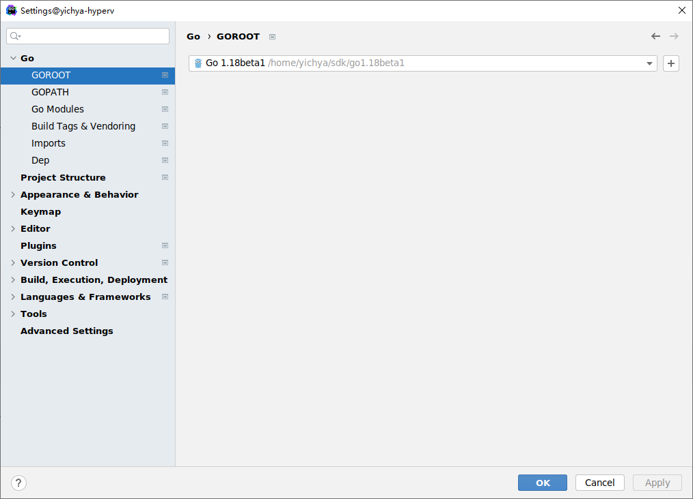
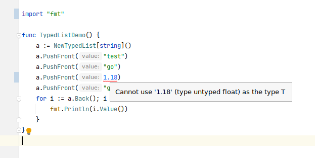
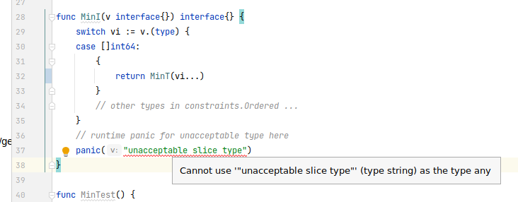

盼望着，盼望着，Go 的泛型……

* 本来说 1.16，结果完全咕咕咕
* 好不容易等到 1.17 扭扭捏捏的 `-gcflags=-G=3` 勉强开起来，还不能暴露到 package 外面
* 今年二月份将要发布的 1.18，终于要正式支持了

真的是等了好久好久啊。

虽然现在 Go 1.18 还没有正式发布，不过已经发布了基本可用的 Beta 1，趁此机会可以来抢先体验下。

# Try it out

首先需要一个正式版的 Go 环境（个人不是很建议直接装 Beta 版的 Go）。如果没有的话，自己装一个。

然后安装 Go 1.18 Beta 1

```bash
go install golang.org/dl/go1.18beta1@latest
go1.18beta1 download
```

默认情况下这个 SDK 会安装到 `~/sdk/go1.18beta1` 下面。用 Goland（这里使用 2021.3.2，已经默认开启泛型相关特性支持）创建一个新的 Project，并选择使用这个 SDK：



准备一个最简单的项目感受一下泛型的舒适：

```go
package main

import (
	"container/list"
	"fmt"
)

type Element[T any] struct {
	e *list.Element
}

func (e *Element[T]) Value() T {
	return e.e.Value.(T)
}

func (e *Element[T]) Prev() *Element[T] {
	prev := e.e.Prev()
	if prev == nil {
		return nil
	}
	return &Element[T]{e: prev}
}

func (e *Element[T]) Next() *Element[T] {
	next := e.e.Next()
	if next == nil {
		return nil
	}
	return &Element[T]{e: next}
}

type TypedList[T any] struct {
	l *list.List
}

func NewTypedList[T any]() TypedList[T] {
	return TypedList[T]{
		l: list.New(),
	}
}

func (t *TypedList[T]) PushFront(value T) *Element[T] {
	v := t.l.PushFront(value)
	return &Element[T]{e: v}
}

func (t *TypedList[T]) PushBack(value T) *Element[T] {
	v := t.l.PushBack(value)
	return &Element[T]{e: v}
}

func (t *TypedList[T]) Front() *Element[T] {
	front := t.l.Front()
	if front == nil {
		return nil
	}
	return &Element[T]{e: front}
}

func (t *TypedList[T]) Back() *Element[T] {
	back := t.l.Back()
	if back == nil {
		return nil
	}
	return &Element[T]{e: back}
}

func main() {
	a := NewTypedList[string]()
	a.PushFront("test")
	a.PushFront("go")
	a.PushFront("1.18")
	a.PushFront("generics")
	for i := a.Back(); i != nil; i = i.Prev() {
		fmt.Println(i.Value())
	}
}
```

直接运行：

```bash
> go1.18beta1 run .
test
go
1.18
generics
```

之后我们就直接使用这个环境开始试玩一下 Go 1.18 的泛型。需要注意的是，下面的部分 Demo 可能会在 Goland 中看到一些非预期的红色波浪线提示，这个是 Goland 自身对泛型支持还不完善导致的。

# Why Generics

个人理解，泛型（比较基础的泛型）最大的好处在于：能够把运行时的类型检查提前到编译期完成，且可以为更进一步的编译期优化提供指导。

第一点应该是比较容易理解的。举个例子，大家天天都在用的猜测一个 `interface{}` 的类型：

```go
package faulty_list

import (
	"container/list"
	"fmt"
)

func FaultyListDemo() {
	l := list.New()
	l.PushBack("1")
	l.PushBack(2)
	l.PushBack(3.5)
	for i := l.Front(); i != nil; i = i.Next() {
		fmt.Println("any", i.Value.(any))  // what type is i.Value ?
		if v, ok := i.Value.(string); ok { // checking type every time is quite annoying
			fmt.Println("if string", v)
		}
		fmt.Println("assertion without check", i.Value.(string)) // incorrect type assertion leads to panic
	}
}
```

同样运行这段代码：

```bash
> go1.18beta1 run .
any 1
if string 1
assertion without check 1
any 2
panic: interface conversion: interface {} is int, not string

goroutine 1 [running]:
github.com/yichya/generics_example/faulty_list.FaultyListDemo()
        /home/yichya/go/src/github.com/yichya/generics_example/faulty_list/faulty_list.go:18 +0x4ed
main.main()
        /home/yichya/go/src/github.com/yichya/generics_example/main.go:9 +0x17
exit status 2
```

而如果换为我们上面例子中的泛型版本，这个 List 在编译的时候就能够保证其中的元素类型统一：

```go
package typed_list

import "fmt"

func TypedListDemo() {
	a := NewTypedList[string]()
	a.PushFront("test")
	a.PushFront("go")
	a.PushFront(1.18)  // incorrect type here
	a.PushFront("generics")
	for i := a.Back(); i != nil; i = i.Prev() {
		fmt.Println(i.Value())
	}
}
```

尝试编译运行，很快得到一个错误：

```bash
> go1.18beta1 run .
# github.com/yichya/generics_example/typed_list
typed_list/typed_list.go:9:14: cannot use 1.18 (untyped float constant) as string value in argument to a.PushFront
```

事实上 Goland 也会直接在这里标记出类型的不匹配（只是目前 Goland 的提示似乎还不完善）。



关于第二点【编译期优化】，这个我们会在下面的【运行时与反射】和【性能测试】中简单举一个例子。

# 类型参数

Go 1.18 中引入的泛型，语法相当特别的使用了方括号 `[]` 而不是其他大多数语言中使用的尖括号 `<>`，据说是为了让编译器更好写

## 定义类型

定义类型的时候可以增加一个参数（名字不重要），用于指代满足某一要求的类型（这里用到的 `comparable` 下面会简单介绍）

```go
type Set[T1 comparable] struct {
	m map[T1]bool
}
```

也可以直接在定义函数的时候增加一个参数，比如实现一个 `min()`（这里用到的 `constraints.Ordered` 下面会简单介绍）

```go
package min

import (
	"constraints"
	"fmt"
)

func Min[T constraints.Ordered](v0 T, v ...T) T {
	var minT = v0
	for _, x := range v {
		if x < minT {
			minT = x
		}
	}
	return minT
}

func MinT[T constraints.Ordered](v ...T) T {
	var minT = v[0]
	for _, x := range v {
		if x < minT {
			minT = x
		}
	}
	return minT
}

func MinI(v interface{}) interface{} {
	switch vi := v.(type) {
	case []int64:
		{
			return MinT(vi...)
		}
		// other types in constraints.Ordered ...
	}
	// runtime panic for unacceptable type here
	panic("unacceptable slice type")
}

func MinTest() {
	fmt.Println(Min(9, 8, 7, 6, 1, 2, 3, 4, 5) + 10) // 11
	a := []int64{9, 8, 7, 6, 1, 2, 3, 4, 5}
	fmt.Println(MinT(a...) + 11)      // 12
	fmt.Println(MinI(a).(int64) + 12) // 13. type of return value must be asserted

	fmt.Println(Min(9.5, 8.5, 7.5, 6.5, 1.5, 2.5, 3.5, 4.5, 5.5)) // 1.5
	b := []float64{9.5, 8.5, 7.5, 6.5, 1.5, 2.5, 3.5, 4.5, 5.5}
	fmt.Println(MinI(b)) // panic: unacceptable slice type
}
```

这里的好处在于，比起将入参定义为 `interface{}`，此处可以避免没有必要的 type assertion，同时也可以避免 runtime panic

## 使用多个类型参数

使用类型参数的地方可以同时放多个参数，比如 Pair（官方是给出了 [golang.org/x/exp/maps](golang.org/x/exp/maps) 这个库实现了 map 的 `Items()` 方法的）

```go
package typed_pair

import "fmt"

type Pair[T1 comparable, T2 any] struct {
	first  T1
	second T2
}

type Map[T1 comparable, T2 any] struct {
	m map[T1]T2
}

func (m *Map[T1, T2]) Set(k T1, v T2) {
	if m.m == nil {
		m.m = map[T1]T2{}
	}
	m.m[k] = v
}

// Items Python 2 Like items() method (unordered as well)
func (m *Map[T1, T2]) Items() []Pair[T1, T2] {
	l := make([]Pair[T1, T2], 0, len(m.m))
	for k, v := range m.m {
		l = append(l, Pair[T1, T2]{first: k, second: v})
	}
	return l
}

func TypedPairDemo() {
	m := Map[string, int]{}
	m.Set("123", 123)
	m.Set("456", 456)
	for _, item := range m.Items() { // so pythonic isn't it ?
		fmt.Println(item.first, item.second)
	}
}
```

编译运行，得到的结果相当符合预期：

```bash
> go1.18beta1 run .
456 456
123 123
```

当然就 Go 本身的实现来说这里的实现是相当基础的，比起很多类型系统更强的语言（比如 TypeScript 或者 C#）来说还是有明显的能力限制，比如没有 [variadic type parameters](https://en.wikipedia.org/wiki/Variadic_template)，想实现 [Currying](https://en.wikipedia.org/wiki/Currying) 或者 [Partial](https://en.wikipedia.org/wiki/Partial_application) 就是一个相当难受的事情（当然比起完全没有泛型来说还是要好太多太多了）：

```go
package typed_currying

import "fmt"

func PartialT2R1V2[T1, T2, R1 any](f func(t1 T1, t2 T2) R1, v1 T1, v2 T2) func() R1 {
	return func() R1 {
		return f(v1, v2)
	}
}

func PartialT3R1V1[T1, T2, T3, R1 any](f func(t1 T1, t2 T2, t3 T3) R1, v1 T1) func(v2 T2, v3 T3) R1 {
	return func(v2 T2, v3 T3) R1 {
		return f(v1, v2, v3)
	}
}

func CurryingT3R1[T1, T2, T3, R1 any](f func(t1 T1, t2 T2, t3 T3) R1) func(v1 T1) func(v2 T2) func(v3 T3) R1 {
	return func(v1 T1) func(v2 T2) func(v3 T3) R1 {
		return func(v2 T2) func(v3 T3) R1 {
			return func(v3 T3) R1 {
				return f(v1, v2, v3)
			}
		}
	}
}

func add3(i int8, j int16, k int32) int64 {
	return int64(i) + int64(j) + int64(k)
}

func CurryingDemo() {
	c1 := PartialT3R1V1[int8, int16, int32, int64](add3, 5) // you have to manually pick your PartialTxRyVz function here
	fmt.Println(c1(6, 7))                                   // 18
	c2 := PartialT2R1V2(c1, 6, 7)                           // type arguments can be omitted
	fmt.Println(c2())                                       // 18
	f := CurryingT3R1(add3)                                 // currying
	fmt.Println(f(5)(6)(7))                                 // 18
}
```

而且即使在使用的时候也很不方便（比如上面的 `PartialTxRyVz` 如果全都改名为 `Partial` 的话是编译不过去的）

```bash
> go1.18beta1 run .
# github.com/yichya/generics_example/typed_currying
typed_currying/implementation.go:11:6: Partial redeclared in this block
        /home/yichya/go/src/github.com/yichya/generics_example/typed_currying/implementation.go:5:6: other declaration of Partial
typed_currying/implementation.go:17:6: Partial redeclared in this block
        /home/yichya/go/src/github.com/yichya/generics_example/typed_currying/implementation.go:5:6: other declaration of Partial
typed_currying/implementation.go:28:27: got 4 type arguments but want 2

```

# 类型约束

Go 1.18 中的类型约束是复用了 `interface` 关键字来进行描述，但跟 `interface` 关系并不大。下面看几个例子。

## 内置约束：any 与 comparable

Go 语言的 runtime 内置了两个类型约束 `any` 和 `comparable`

### any

`any` 事实上就是 `interface{}`，被内置大概是为了图省事

```go
// any is an alias for interface{} and is equivalent to interface{} in all ways.
type any = interface{}
```

Go 1.18 的 runtime 和标准库中把很多 `interface{}` 都换成了 `any`，Goland 经常一脸懵逼。



### comparable

`comparable` 代表一类实现了 `==` 和 `!=` 两个运算符的内置类型，包括下面这些

```go
// comparable is an interface that is implemented by all comparable types
// (booleans, numbers, strings, pointers, channels, interfaces,
// arrays of comparable types, structs whose fields are all comparable types).
```

演示 `comparable` 最好的工具当然是自己搓一个 Set

```go
package typed_set

import "fmt"

type Set[T comparable] struct {
	m map[T]bool
}

func (s *Set[T]) Add(value T) {
	if s.m == nil {
		s.m = map[T]bool{}
	}
	s.m[value] = true
}

func (s *Set[T]) List() []T {
	t := make([]T, 0, len(s.m))
	for i, v := range s.m {
		if v {
			t = append(t, i)
		}
	}
	return t
}

func TypedSetDemo() {
	s := Set[string]{}
	s.Add("1")
	s.Add("2")
	s.Add("1")
	s.Add("3")
	s.Add("4")
	l := s.List()
	for _, x := range l {
		fmt.Println(x)
	}
}
```

编译运行：

```bash
> go1.18beta1 run .
4
1
2
3
```

`comparable` 被内置，个人理解是因为 Map 的 Key 被要求是 `comparable`，比如把 `Set[T]` 上 `T` 的约束写为 `any` 的话就会报这样的错误：

```
> go1.18beta1 run .
# github.com/yichya/generics_example/typed_set
typed_set/implementation.go:6:8: invalid map key type T (missing comparable constraint)
typed_set/implementation.go:11:13: invalid map key type T (missing comparable constraint)
```

## 定义约束

定义约束的语法很简单：使用 `interface` 并在其中填写可以使用的类型（多个类型用 `|` 连接）。

```go
package define_constraints

import "fmt"

type MustSigned interface {
	int | int8 | int16 | int32 | int64
}

type UnderlyingMustSigned interface {
	~int | ~int8 | ~int16 | ~int32 | ~int64
}

type SomeEnum int64

const (
	SomeEnum_ONE SomeEnum = 1
	SomeEnum_TWO SomeEnum = 2
)

func MustOne[T MustSigned](v T) bool {
	return v == 1
}

func UnderlyingMustTwo[T UnderlyingMustSigned](v T) bool {
	return v == 2
}

func DefineConstraintsDemo() {
	fmt.Println(MustOne(SomeEnum_ONE))
	fmt.Println(UnderlyingMustTwo(SomeEnum_TWO))
}
```

符号 `~` 代表 underlying type（[Types](https://go.dev/ref/spec#Types)），比如上面的代码，`MustOne()` 使用的约束 `MustSigned` 没有 `~`，编译会报错：

```bash
> go1.18beta1 run .
# github.com/yichya/generics_example/define_constraints
define_constraints/implementation.go:29:21: SomeEnum does not implement MustSigned (possibly missing ~ for int64 in constraint MustSigned)
```

但是在定义约束的时候存在一个很大的限制：因为 Go 目前还不支持实现 Operator（[General notes on type sets](https://go.googlesource.com/proposal/+/refs/heads/master/design/43651-type-parameters.md#general-notes-on-type-sets)），因此比如想针对某一自定义类型实现 Less，就会遇到阻碍：

```go
package min_comparable_interface

import (
	"constraints"
	"fmt"
	"time"
)

type ordered interface {
	Less(other ordered) bool
}

type Ordered interface {
	constraints.Ordered | ordered
}

func MinT[T Ordered](v ...T) T {
	var minT = v[0]
	for _, x := range v {
		if ox, ok := x.(ordered); ok { // although Go generics uses a syntax which looks like interface, it is actually not
			if ox.Less(minT.(ordered)) {
				minT = x
			}
		} else {
			if x < minT {
				minT = x
			}
		}
	}
	return minT
}

type OrderedTime struct {
	t time.Time
}

func (d *OrderedTime) Less(other *OrderedTime) bool {
	return d.t.Before(other.t)
}

func (d *OrderedTime) Time() time.Time {
	return d.t
}

func MinTest() {
	var O1 = []int64{9, 8, 7, 6, 1, 2, 3, 4, 5}
	fmt.Println(MinT(O1...))

	var O2 = []*OrderedTime{
		{
			t: time.Date(2022, 1, 20, 0, 0, 0, 0, time.UTC),
		},
		{
			t: time.Date(2022, 1, 10, 0, 0, 0, 0, time.UTC),
		},
		{
			t: time.Date(2022, 1, 30, 0, 0, 0, 0, time.UTC),
		},
	}
	fmt.Println(MinT(O2...).Time())
}
```

编译的时候会得到如下错误，原因见 [Permitting constraints as ordinary interface types](https://go.googlesource.com/proposal/+/refs/heads/master/design/43651-type-parameters.md#permitting-constraints-as-ordinary-interface-types)

```bash
> go1.18beta1 run .
# github.com/yichya/generics_example/min_comparable_interface
min_comparable_interface/implementation.go:14:24: cannot use github.com/yichya/generics_example/min_comparable_interface.ordered in union (interface contains methods)
min_comparable_interface/implementation.go:20:16: invalid operation: cannot use type assertion on type parameter value x (variable of type T constrained by Ordered)
min_comparable_interface/implementation.go:21:15: invalid operation: cannot use type assertion on type parameter value minT (variable of type T constrained by Ordered)
min_comparable_interface/implementation.go:25:7: invalid operation: cannot compare x < minT (operator < not defined on T)
```

这个限制可以说极大程度上限制了目前 Go 泛型的使用场景，希望这项功能可以尽快加入到后续的 Go 版本中。

## 标准库中的 constraints 包

Go 1.18 自带的 constraints 包提供了一些内置约束。

* `Signed` = `~int | ~int8 | ~int16 | ~int32 | ~int64`
* `Unsigned` = `~uint | ~uint8 | ~uint16 | ~uint32 | ~uint64 | ~uintptr`
* `Integer` = `Signed | Unsigned`
* `Float` = `~float32 | ~float64`
* `Complex` = `~complex64 | ~complex128`
* `Ordered` = `Integer | Float | ~string`

# 造一些常见的轮子

下面举一些相对复杂的例子来说明泛型能在哪些地方发挥作用。

## Iterable

大多数语言（比如 Python 和 C#）中都很常见的概念。

```go
package iterator

import "fmt"

type Iterator[T any] interface {
	Value() T
	Next() Iterator[T]
}

type ST[T any] []T

type sliceIterator[T any] struct {
	s   ST[T]
	pos int
}

func (i *sliceIterator[T]) Value() T {
	return i.s[i.pos]
}

func (i *sliceIterator[T]) Next() Iterator[T] {
	if i.pos+1 < len(i.s) {
		return &sliceIterator[T]{
			pos: i.pos + 1,
			s:   i.s,
		}
	}
	return nil
}

func (s ST[T]) ToIterator() Iterator[T] {
	return &sliceIterator[T]{
		pos: 0,
		s:   s,
	}
}

func ToSlice[T any](i Iterator[T]) []T {
	var t []T
	for v := i; v != nil; v = v.Next() {
		t = append(t, v.Value())
	}
	return t
}

func IteratorDemo() {
	d := []int64{1, 2, 3, 4, 5, 6, 7, 8, 9, 10}
	st := ST[int64](d)
	i := st.ToIterator()
	fmt.Println(ToSlice(i)) // [1 2 3 4 5 6 7 8 9 10]
}
```

## Future

常见于 C#（`Task<T>`）、JavaScript（`Promise`）、Python（`concurrent.Future`）等，尤其多见于使用 `async` / `await` 这样的异步模型的语言。

```go
package future

import (
	"fmt"
	"golang.org/x/sync/errgroup"
	"runtime"
	"sync"
	"time"
)

type Task[T any] struct {
	sync.RWMutex
	f      func() T
	done   bool
	result T
}

func (t *Task[T]) Start() {
	go func(self *Task[T]) {
		r := self.f()
		self.Lock()
		self.result = r
		self.done = true
		self.Unlock()
	}(t)
}

func (t *Task[T]) Done() bool {
	t.RLock()
	defer t.RUnlock()
	return t.done
}

func (t *Task[T]) Await() T {
	for {
		t.RLock()
		if t.done {
			t.RUnlock()
			return t.result
		}
		t.RUnlock()
		runtime.Gosched()
	}
}

func NewTask[T any](f func() T) *Task[T] {
	return &Task[T]{
		f: f,
	}
}

// All quite limited implementation of Javascript Promise.All or C# Task.WaitAll
func All[T any](f ...func() T) *Task[[]T] {
	resp := NewTask(func() []T { // NewTask[[]T]()
		r := make([]T, len(f))
		var eg errgroup.Group
		for index, task := range f {
			indexClosure := index
			taskClosure := task
			eg.Go(func() error {
				r[indexClosure] = taskClosure()
				return nil
			})
		}
		_ = eg.Wait()
		return r
	})
	return resp
}

func TaskTest() {
	t := NewTask(func() int64 {
		time.Sleep(3 * time.Second)
		return 10
	})
	t.Start()
	fmt.Println(t.Done()) // false
	time.Sleep(time.Second)
	fmt.Println(t.Done()) // false
	r := t.Await()
	fmt.Println(t.Done()) // true
	fmt.Println(r + 3)    // 13

	all := All(func() int64 {
		time.Sleep(3 * time.Second)
		return 3
	}, func() int64 {
		time.Sleep(4 * time.Second)
		return 4
	}, func() int64 {
		time.Sleep(5 * time.Second)
		return 5
	})
	all.Start()
	fmt.Println(all.Await()) // [3 4 5]
}
```

## ORM

Gorm 中大量方法都使用 `interface{}` 作为参数，这导致很多问题都被延后到运行时发现，甚至可能会导致线上的 panic；本身 ORM 也是最适合使用泛型的场景之一。

```go
package typed_gorm

import (
	"fmt"
	"gorm.io/driver/sqlite"
	"gorm.io/gorm"
)

type TypedGormDB[T any] struct {
	db *gorm.DB
}

func NewTypedGormDB[T any](txIn *gorm.DB) *TypedGormDB[T] {
	var tm T
	return &TypedGormDB[T]{
		db: txIn.Model(tm),
	}
}

// First simplified and typed implementation of (*gorm.DB).First
func (t *TypedGormDB[T]) First(dest *T) *TypedGormDB[T] {
	t.db = t.db.First(dest)
	return t
}

// Find simplified and typed implementation of (*gorm.DB).Find
func (t *TypedGormDB[T]) Find(dest *[]*T) *TypedGormDB[T] {
	t.db = t.db.Find(dest)
	return t
}

// Where simplified implementation of (*gorm.DB).Where
// however binding conditions to query would require Dependent Type support in the language
func (t *TypedGormDB[T]) Where(query string, conds ...any) *TypedGormDB[T] {
	t.db = t.db.Where(query, conds...)
	return t
}

// Create typed (*gorm.DB).Create
func (t *TypedGormDB[T]) Create(v *T) *TypedGormDB[T] {
	t.db = t.db.Create(v)
	return t
}

// Error return (*gorm.DB).Error
func (t *TypedGormDB[T]) Error() error {
	return t.db.Error
}

// AutoMigrate just for creating table in memory sqlite database
func (t *TypedGormDB[T]) AutoMigrate() error {
	var tm T
	return t.db.AutoMigrate(tm)
}

type Model struct {
	Id   uint64 `gorm:"column:id"`
	Name string `gorm:"column:name"`
}

func (Model) TableName() string {
	return "model"
}

func TypedGormDemo() {
	db, e0 := gorm.Open(sqlite.Open("file::memory:?cache=shared"), &gorm.Config{})
	if e0 != nil {
		panic(e0)
	}

	var result []*Model
	td := NewTypedGormDB[Model](db)

	if e1 := td.AutoMigrate(); e1 != nil {
		panic(e1)
	}

	m := []*Model{
		{
			Id:   1,
			Name: "test1",
		},
		{
			Id:   2,
			Name: "test2",
		},
		{
			Id:   3,
			Name: "test3",
		},
	}
	for _, mi := range m {
		td.Create(mi)
	}

	if e2 := td.Where("id in (?)", []int64{2, 3}).Find(&result).Error(); e2 != nil {
		panic(e2)
	}

	fmt.Println(result[0].Name, result[1].Name) // test2 test3
}
```

## Functional Programming

有了泛型，可以很方便的实现一些之前比较难实现的函数式写法。

```go
package functional_common

import "fmt"

func Map[T1, T2 any](s []T1, f func(T1) T2) []T2 {
	r := make([]T2, len(s))
	for i, v := range s {
		r[i] = f(v)
	}
	return r
}

func Reduce[T1, T2 any](s []T1, initializer T2, f func(T2, T1) T2) T2 {
	r := initializer
	for _, v := range s {
		r = f(r, v)
	}
	return r
}

func Filter[T any](s []T, f func(T) bool) []T {
	var r []T
	for _, v := range s {
		if f(v) {
			r = append(r, v)
		}
	}
	return r
}

func FunctionalCommonDemo() {
	fmt.Println(Reduce(Map(Filter([]int32{1, 2, 3, 4, 5}, func(t int32) bool {
		return t < 4 // [1, 2, 3]
	}), func(t int32) int64 {
		return int64(t) + 1 // [2, 3, 4]
	}), int64(0), func(t1, t2 int64) int64 {
		return t1 + t2 // 2 + 3 == 5; 5 + 4 = 9
	})) // 9
}
```

# 运行时与反射

由于不像 Java 那样有在 .class 层面的兼容性要求，Go 的运行时并不像 Java 那样对类型信息做了擦除，因此可以在运行时通过反射拿到完整的类型信息。可以很简单进行验证：

```go
package reflection

import (
	"fmt"
	"reflect"
)

func PrintTypeOf[T1, T2 any](v1 T1, v2 T2) {
	fmt.Printf("%T %T %v\n", v1, v2, reflect.TypeOf(v1) == reflect.TypeOf(v2))
}

func ReflectionDemo() {
	a := []int64{1, 2, 3}
	b := []int32{4, 5}
	c := []int64{6}
	PrintTypeOf(a, b) // []int64 []int32 false
	PrintTypeOf(a, c) // []int64 []int64 true
}
```

更详细的内容，可以参考 [https://github.com/akutz/go-generics-the-hard-way/tree/main/05-internals](https://github.com/akutz/go-generics-the-hard-way/tree/main/05-internals)

# 性能测试

做一下测试：简简单单的做一个给 Slice 里面所有元素 +3，观察一下使用泛型的方式对性能的影响。

## Baseline

很直接。

```go
package performance

func Add3Int32(s []int32) []int32 {
	for index := range s {
		s[index] += 3
	}
	return s
}

func Add3Int64(s []int64) []int64 {
	for index := range s {
		s[index] += 3
	}
	return s
}
```

## Using Interface & Interface Slice

做了两种实现：一种是比较简单的，判断一下传入的 `interface{}` 的类型是不是 `[]int64` 或者 `[]int32`；另一种则是传入一个 `[]interface{}`，并逐一判断其中每个元素。

事实上第二种会更加常见：我们希望入参至少能明确是一个 Slice，但这种情况就不得不将入参和出参都做一次复制，转换为 `[]interface{}`，无形中带来了很多性能损失；而且这种代码写起来也让人十分烦躁。

```go
package performance

func Add3Interface(s interface{}) interface{} {
	if sint64, ok := s.([]int64); ok {
		return Add3Int64(sint64)
	}
	if sint32, ok := s.([]int32); ok {
		return Add3Int32(sint32)
	}
	if sinterface, ok := s.([]interface{}); ok {
		return Add3InterfaceSlice(sinterface)
	}
	panic("unsupported slice type")
}

func Add3InterfaceSlice(s []interface{}) []interface{} {
	for index, value := range s {
		switch vi := value.(type) {
		case int32:
			{
				s[index] = vi + 3
			}
		case int64:
			{
				s[index] = vi + 3
			}
		default:
			{
				panic("unsupported slice element type")
			}
		}
	}
	return s
}
```

## Using Generics

使用泛型解决这一问题可以说非常优雅简洁。

```go
package performance

type SupportedIntegers interface {
	~int64 | ~int32
}

func Add3Generics[T SupportedIntegers](s []T) []T {
	for index := range s {
		s[index] += 3
	}
	return s
}
```

## Benchmark and Results

使用以下代码做 Benchmark

```go
package performance

import (
	"testing"
)

func BenchmarkBaseline(t *testing.B) {
	// baseline
	si32 := []int32{1, 2, 3}
	si64 := []int64{4, 5, 6}
	for i := 0; i < t.N; i++ {
		Add3Int32(si32)
		Add3Int64(si64)
	}
}

func BenchmarkInterface(t *testing.B) {
	// using interface
	si32 := []int32{1, 2, 3}
	si64 := []int64{4, 5, 6}
	for i := 0; i < t.N; i++ {
		Add3Interface(si32)
		Add3Interface(si64)
	}
}

func BenchmarkSliceInterface(t *testing.B) {
	// using slice of interface
	sinterface1 := []interface{}{int32(1), int32(2), int64(3)}
	sinterface2 := []interface{}{int64(4), int64(5), int64(6)}
	for i := 0; i < t.N; i++ {
		Add3InterfaceSlice(sinterface1)
		Add3InterfaceSlice(sinterface2)
	}
}

func BenchmarkGenerics(t *testing.B) {
	// using generics
	si32 := []int32{1, 2, 3}
	si64 := []int64{4, 5, 6}
	for i := 0; i < t.N; i++ {
		Add3Generics(si32)
		Add3Generics(si64)
	}
}
```

结果如下：

```bash
> go1.18beta1 test -bench . -benchmem
goos: linux
goarch: amd64
pkg: github.com/yichya/generics_example/performance
cpu: Intel(R) Core(TM) i7-6770HQ CPU @ 2.60GHz
BenchmarkBaseline-6             143243968                8.260 ns/op           0 B/op          0 allocs/op
BenchmarkInterface-6            15730483                77.61 ns/op           48 B/op          2 allocs/op
BenchmarkSliceInterface-6       11284230               101.2 ns/op            39 B/op          5 allocs/op
BenchmarkGenerics-6             145107482                8.316 ns/op           0 B/op          0 allocs/op
PASS
ok      github.com/yichya/generics_example/performance  6.645s
```

可以看到，由于不涉及 [Boxing](https://github.com/akutz/go-generics-the-hard-way/blob/main/06-benchmarks/01-boxing.md)，不需要做内存分配，Baseline 的性能最佳；使用泛型的性能与 Baseline 基本一致；而 `interface{}` 和 `[]interface{}` 的性能都明显比较不理想。

# Next

Go 1.18 目前仅在语法层面上支持了比较初级的泛型，但终于算是一个从无到有的突破。Go 的泛型草案中已经提到了一些目前不支持但已经提上日程的特性：

* [Permitting constraints as ordinary interface types](https://go.googlesource.com/proposal/+/refs/heads/master/design/43651-type-parameters.md#permitting-constraints-as-ordinary-interface-types) 就是上面提到的带 Method 定义的 `interface{}` 不能作为类型约束
* [Type inference for composite literals](https://go.googlesource.com/proposal/+/refs/heads/master/design/43651-type-parameters.md#type-inference-for-composite-literals) 在初始化带类型参数的类型时自动推导类型参数
* [Type inference for generic function arguments](https://go.googlesource.com/proposal/+/refs/heads/master/design/43651-type-parameters.md#type-inference-for-generic-function-arguments) 在调用函数时自动推导类型参数
* 等等

个人觉得类型系统是一个编程语言最重要的组成部分，它可以决定一个语言的表达能力的上限。[编程语言的类型系统为何如此重要？](https://www.zhihu.com/question/23434097/answer/1599184843)

目前工业界上崭露头角的比较新的语言，大多在类型系统上都下了一番功夫（像 Go 这种 2022 年才终于憋出个泛型的，已经可以说是比较拉了）。比如 TypeScript 和 Rust 这样现代编程语言中在类型系统上走在前面的语言，最近已经得到了越来越多的关注：TypeScript 的火热程度已是有目共睹，Rust 亦在最近成为第二种被接纳进 Linux 内核的语言，可以说前途无量；传统一些的语言比如 C#、C++ 也在逐渐引入更多概念用来表达更复杂的类型。更靠近学术界的语言，强大的类型系统几乎可以说是标配，其中的代表比如 Haskell 甚至 Idris 这样的函数式语言，甚至支持包括 [Dependent Type](https://www.zhihu.com/question/29706455/answer/45474267) 等一系列高级特性。或许未来某一天，足够强大的类型系统将成为工业界语言的标配，或许那时的码农们可以不用再为了 `panic: interface conversion` 掉头发。

如果像更深入了解类型系统相关，可以先从 TypeScript 学起。TypeScript 的类型系统非常优秀，很适合用来打开新世界的大门。

# Reference

[https://go.googlesource.com/proposal/+/refs/heads/master/design/43651-type-parameters.md](https://go.googlesource.com/proposal/+/refs/heads/master/design/43651-type-parameters.md)

[https://bignerdranch.com/blog/exploring-go-v1-18s-generics/](https://bignerdranch.com/blog/exploring-go-v1-18s-generics/)

[https://github.com/mattn/go-generics-example](https://github.com/mattn/go-generics-example)

[https://www.reddit.com/r/golang/comments/pj4va2/never_felt_need_for_generics_did_you/](https://www.reddit.com/r/golang/comments/pj4va2/never_felt_need_for_generics_did_you/)
