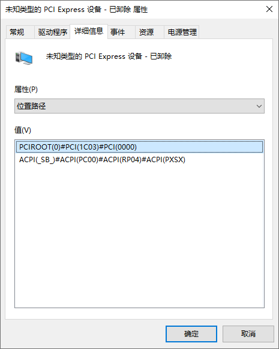

今年上半年因为一些事情（购房装修、父亲摔伤等）占据了大部分精力（准确一点说，应该是心情，这种现象也可以称之为电子杨伟），计划中的定期更新，包括 My Own Hackday、Nas and OpenWrt、Gadgets 都没能投入精力去进行。

好在上周第三次复查，父亲的骨折恢复状态不错，已经可以脱离轮椅甚至仅用单拐行走，工伤认定也已经完成；购房基本一切顺利，装修虽然不完全顺利但也基本可控。目前生活基本回到正轨，终于有心情继续填该填的坑。

按照计划最近的应该是 Gadgets，那就从 Gadgets 的坑开始填吧。虽然上次预告应该会有这些东西：

* Redmi Buds 3
* 猫王·小王子（Atom 送的，一直想要但是真的舍不得买）
* Funkey S
* EROS TEN
* 小米显示器挂灯 1S

再加上后来搞到的一些：

* Philips 的蓝牙音频转接器
* Switch Lite
* BROUNION R86S
* TG-BOX 850 UPS
* 两个充电头
* 小米蓝牙开关

但这次只介绍 R86S，其他的（主要投入的精力确实有限，也不那么值得扯很多）除了蓝牙开关和 UPS 会分别在对应的系列介绍之外，大概会在下个月一次性补上，可能还会顺便再补一点小东西。

# Hardware

[r86s.net](https://r86s.net)

近一两年软路由、nas 等概念逐渐出圈，已经从之前「使用路由器、IPFS 矿机（蜗牛星际）、工控主板等进行魔改」这样只有垃圾佬活跃其中的小众爱好，发展为如今吸引很多中小硬件厂商，甚至正规军推出产品抢占市场的热门话题。比如 NanoPi R2S、R4S 等设备都是在这样的背景下推出的产品，都获得了巨大成功，但它们采用瑞芯微的 ARM SoC，相对 x86 设备，性能和扩展性都显得偏弱，不能满足高端玩家的需求，于是很多厂商开始推出基于 Intel 低功耗 x86 SoC 的软路由产品，R86S 便是其中非常典型的代表。


目前有几个不同版本的 R86S

* 众筹款（有的商家称为 2.0 版）
    * N5105，8G / 16G 内存，128G emmc
    * 一个 I211-V 千兆网卡，两个 I225-V 2.5G 网卡
    * nvme 款：一个 M.2 2280 nvme 插槽 + 一个 M.2 2230 无线网卡插槽
    * 万兆款：带一个拆机万兆网卡，没有上面的插槽
* 新款（有的商家称为 3.0 版）
    * 增加了被动散热 N5095 款，TDP 限制到 6w
    * 网口全都换成 I225-V
    * 设计了新的外壳，散热比众筹款更好
    * nvme 款：同众筹款
    * 万兆款：增加了一款万兆 + nvme 的转接板，但是没有无线网卡的位置了
    * 万兆款还可选 N6005 款，自带 AX201 无线网卡

忘记是从哪里看到的这款设备的众筹车了，但第一眼看到的时候就觉得很不错，直接下单 nvme 16G 内存款式。

因为买的是 nvme 版，不像万兆款那么麻烦（折腾猫棒、给万兆网卡刷固件等等；草民目前觉得意义不大，也确实没有用万兆内网的条件），拿到手之后基本上也就简单改了改 UEFI 设置。简单引用一些官方资料，额外加一点说明。

## Power Saving

[官方说明](https://docs.r86s.net/#/start/%E7%9C%81%E7%94%B5)

开启 C-State 和 PCIe ASPM 可以节省电量消耗、减少发热，不过可能对性能有一定影响，可以自行尝试、自行取舍。草民是全开了的。

## CMOS Battery

如果拆机并把 CMOS 小电池拔下来过，下次开机黑屏的时间会非常长（超过一分钟）。并不是坏了，需要耐心等待。草民第一次装无线网卡的时候，扣回去插电源半天屏幕都不亮，搞得草民还以为是上 PCB 螺丝的时候用力过猛把 CPU Die 干碎了（

## Secure Boot

如果清空过 CMOS 或者做过类似操作，需要手动进 UEFI 设置，重置一次 Secure Boot 选项才能正确开启 Secure Boot，开启后状态会从「Enabled，Not Active」变成「Enabled，Active」

# Software

R86S 出厂系统是厂家自己整的 OpenWrt，厂家描述是「完全符合法律法规」。毫无疑问它只有被抹掉的命运。

草民选择的是 Windows Server 2022 + Hyper-V 里面跑 OpenWrt 这种看起来非常小众的方案，主要考虑到它的使用场景

* 作为路由器，取代原来跑在 MicroServer 上的 OpenWrt 虚拟机，解决原来网络环境下 iLO 和 Samba 等访问不够方便的问题
* 利用 n5105 核显的能力，接电视进行一些 Steam 串流、刷剧等需求
* 一个比较方便的 RDP 服务器，包括 X Server、配好梯子的的浏览器等，用来应付一些需要梯子或某些 GUI 工具但又不便安装的情况
* 偶尔挂机痒痒鼠，等等

其实草民最早还考虑了 Deepin Linux，但它的核显驱动似乎有点问题，HDMI 只能输出 4K30Hz，Windows 下却能正常 4K60Hz，加上已经有 MicroServer 跑可以开图形界面的 Manjaro，再整一个 Linux 设备意义不大，最终决定上 Windows 实现对 HDMI 接口的充分利用。

至于选 Server 版，其实仅仅是因为 Hyper-V PCIe Passthrough 必须要 Windows Server 而已。。。如果能跑正常的消费者版 Windows 我是绝不愿意用 Windows Server 的，毕竟 Windows Server 合法激活的成本有点高（当然，这事儿属于是各显神通了，小提示：vlmcsd），又不好意思老是 `slmgr.vbs /rearm` 对吧（

当然这台机器取代了原来 MicroServer 上跑的 OpenWrt 虚拟机，肯定会涉及到网络结构的调整，这部分内容会与 UPS 一起留到下次 Real NAS Project 2 进行介绍。

## Network Device Drivers

R86S 正式版的网卡是 I219-V / I225-V，V 系列是用作消费者产品的，与之相比 I219-LM / I225-LM 则是用于服务器系列。这两块卡其实区别很小，只有些什么 vPro 之类大多数人用不到的功能上有差别，但是 Intel 的市场营销部门就硬是在驱动程序上区分开了这两款产品：Windows 10 / 11 只支持 V 系列，Windows Server 只支持 LM 系列。

起初草民是打算跟 MicroServer 的用法一样，Host OS 跟 OpenWrt 通过桥接或者 NAT 的方式共享千兆网卡，这样就需要想办法在 Windows Server 上把 I219-V 驱动起来。查了半天资料了解到，实际使用的时候，只需要强行给 V 卡装上 LM 驱动就可以了，使用起来完全正常。

虽然感觉被营销手段狠狠恶心到了一把，但 Intel 这次倒是没把事情做绝，还算有点人性（

后来觉得太麻烦，而且希望 Host OS 使用跟内网一样的环境方便翻墙啥的，于是最终干脆把所有网卡都直通进 OpenWrt 虚拟机了。

## Hyper-V PCIe Passthrough

Hyper-V PCIe Passthrough 是高贵的 Windows Server 才有的功能（真的不懂为啥）。2017 年尝试的时候没成功，这次倒还算顺利。

打开设备管理器，找到要直通的设备，记下位置路径的第一行，然后禁用设备。比如这里位置路径是 `PCIROOT(0)#PCI(1C03)#PCI(0000)`



然后打开一个提权的 PowerShell，进行以下操作。

首先把设备从 Host OS 上摘掉。此处对于一些特定设备（不属于有线网卡、nvme 盘或者显卡的设备，比如无线网卡）会有一个提示说「Windows 不认识这种设备，不知道怎样直通，硬要直通的话加一个 `-force` 参数」，照做即可。

```powershell
Dismount-VMHostAssignableDevice -locationpath "PCIROOT(0)#PCI(1C03)#PCI(0000)" -force
```

然后把 VM 关机，并把网卡挂接到虚拟机上。此处草民的虚拟机名字叫 `OpenWrt`

```powershell
Add-VMAssignableDevice -vmname OpenWrt -locationpath "PCIROOT(0)#PCI(1C03)#PCI(0000)"
```

如果这一步提示虚拟机有保存状态之类的错误，就把这里的设置改为「强行关闭虚拟机」。之后可以再改回「关闭来宾操作系统」。当然，保存状态是肯定没得用了。


个人觉得 Hyper-V 这种提前把设备摘掉的做法，比起 KVM 那种只在虚拟机启动前做设备摘除的方式更好，这种明确分配的做法可以避免 Host OS 和 Guest OS 启动过程中设备乱跳，同时也能加快开机速度，当然可能就会损失一部分灵活性（比如多个虚拟机时分复用 PCIe 设备这种用法，虽然听起来并不是什么很好的主意）。

## Compiling OpenWrt for Hyper-V

为了使用 Hyper-V 的网卡和直通的 PCIe 设备，需要开启对应的内核支持。

在 `make kernel_menuconfig` 中选中下面这些选项，重新编译即可。

```
> cat target/linux/x86/config-5.15 | grep HYPERV | grep -v HYPERVISOR
CONFIG_DRM_HYPERV=y
CONFIG_FB_HYPERV=y
CONFIG_HID_HYPERV_MOUSE=y
CONFIG_HYPERV=y
CONFIG_HYPERV_BALLOON=y
CONFIG_HYPERV_IOMMU=y
CONFIG_HYPERV_KEYBOARD=y
CONFIG_HYPERV_NET=y
CONFIG_HYPERV_STORAGE=y
CONFIG_HYPERV_TIMER=y
CONFIG_HYPERV_UTILS=y
CONFIG_HYPERV_VSOCKETS=y
CONFIG_PCI_HYPERV=y
CONFIG_PCI_HYPERV_INTERFACE=y
```

## Hyper-V Internal Network

Hyper-V 有一种「仅内部」的网络交换机，不与任何实际的网卡关联，适合用于 Host - Guest 之间通信。


配好交换机之后还需要把 MAC 地址欺骗选中，Host OS 才能正常联网。


最后在 OpenWrt 里面把对应的虚拟网卡（草民这里是 eth1）增加到 br-lan 里面就可以了。


Host OS 就像直接插在 OpenWrt 的 lan 口的设备一样会获得一个内部 IP，默认路由也从 OpenWrt 过。Hyper-V 虚拟的是一个万兆网卡，虽然不太清楚是不是半虚拟化，但实际性能还是很不错的。


# Wireless

这台机器其实在设计上是做了支持无线网络的准备的，包括一个 M.2 插槽和一个预留的 AX201 cnvi 模块的空焊盘（左下角网口和内存颗粒之间，下面盗了张某位群友已经淦上去了的图）


然而要淦这个需要一定的动手能力（以及钢网和热风枪等等），或者加钱买已经淦好的新款 N6005 版本。Intel 网卡目前还会有不能开 AP 的问题（下面会说），草民觉得完全没有考虑的必要，还是购买 M.2 的无线网卡比较靠谱。

## Selection

草民买了 3 张卡（qca6391，mt7921，mt7921k），目前 mt7921k 插在机器上用了，下图左边是 qca6391 右边是 mt7921


目前能买到的网卡大致有这么几类，但基本都有一些不是那么好的地方

### Intel

Intel 最大的问题是，虽然大家都拿来做客户端，但几乎没人拿来开 AP 用，Intel 官方也直接说网卡都不支持 AP

* AX200 / AX201 / AX210 / AX211（11ax）
    * AX2x0 和 AX2x1 的区别主要在于接口（PCIe 或者 cnvi，cnvi 相当于半个网卡，另外半截在 CPU 里面）
    * 有很多 Killer 的马甲名字
    * 目前确认因为 [LAR](https://wireless.wiki.kernel.org/en/users/drivers/iwlwifi)（简单的说是一个通过扫描周围 WiFi 来确定使用的 regulation domain 的功能）可能有 bug 或者说 Intel 官方强行限制的关系，并不能在 5GHz 频段上开启 AP，只能作为客户端使用
* 稍旧一代 11ac 的网卡，比如 8260NGW，8265NGW，7265NGW 等等
    * 也有一些 Killer 的马甲名字
    * 几乎没人在 OpenWrt 上用这些卡，能不能开 AP 更是不确定，不建议浪费钱尝试

### Qualcomm

买路由器的话，高通的方案应该是最好的选择，性能好、稳定、可玩性足。但如果是软路由，情况就复杂一些

* ath11k（11ax）系列卡
    * 比较容易买到的是 qca6391（好像也有个 Killer 贴的牌子，Dell XPS 里面用过），但
        * 卖家少，而且贵，将近 200
        * 草民买到的在 Windows 下完全不能用（即使装了驱动，Client 也啥都扫不到）；随便整了个 Ubuntu 可以开 Client，AP 没试
    * ath11k 驱动似乎依赖一个新的 PCIe 特性，导致它目前不能在 Hyper-V 下面穿进虚拟机，KVM 能不能支持不知道
    * ath11k 在 OpenWrt 里面的支持不知道要等到啥时候
    * 总体来说目前不建议，过段时间如果支持完善了可以再试试
* ath10k（11ac）系列卡
    * 目前比较容易买到 qca6174（qcnfa344a），而且很便宜，30 块钱就能买到 DW1820
    * ath10k 属于比较成熟的方案，ap 和 pcie passthrough 都可以上，openwrt 也支持
    * 缺点主要是因为只有两个通道还是 11ac，带宽肯定是稍低一些的，蓝牙的版本也比较旧
    * 草民可能以后会尝试一下

### MediaTek

目前可选的主要是 mt7921 / mt7921k / mt7922，双通道，支持 11ax 和蓝牙 5.2，五月份 OpenWrt 支持了这些网卡的 AP 模式。

* mt7921 / mt7921k
    * mt7921k 也叫 AMD RZ608，比 mt7921 多了 6GHz，但国内不能用 6GHz 所以别想了
    * 这俩玩意儿很好买，甚至狗东有自营，基本就是七八十块钱的水平，如果去蹲闲鱼拆机卡甚至可能有三四十块的
        * 草民都买了，感觉上草民买到的 RZ608 做工要好一点，但实际用下来几乎没有区别
    * 这俩网卡在 linux-firmware 里面用的是完全一样的一套固件
    * 结合使用体验和 iw list 的输出，草民觉得硬件上完全就是一毛一样的，只是简单判断下型号然后屏蔽一下 6GHz
* mt7922
    * 也叫 AMD RZ616，比 RZ608 多了 160MHz
        * 这张卡在 linux-firmware 里面是跟 mt7921 分开的，所以硬件上应该也不完全一样
        * 但 160MHz 在国内能支持的信道就一个，还有一半 DFS，因此实际效果并不理想，大部分时候都只能退到 80MHz 用
    * 比较不容易买到，淘宝总共就一家在卖（闲鱼感觉也是他们家，图都一样），个人觉得不是很放心就没有买
    * 之后货多一点的话可能会尝试

目前比较推荐使用 RZ608，各项表现都属于勉强说得过去（毕竟联发科的东西能不碰还是不要碰，会变得不幸，这次属于是没的选），后面会有简单的性能表现介绍。

### Realtek

虽然说买卡也是能买到的，卡也比较便宜（比如 RTL8822CE，25 块钱 11ac 和蓝牙 4.1），但是折腾成本太高，不建议尝试

* 主要是 Linux 驱动程序太拉，虽然厂商开源，但不完全符合规范，因此缺乏 Linux 或者 OpenWrt 官方支持，想在 OpenWrt 上拉起来很难
* 比下面那个稍微好点在于它至少还是能拿到厂商的源代码的，社区改一改适配一下也凑合着能跑起来
* 如果不装 OpenWrt 而是自己整个比较传统的能 DKMS 的 Linux，再自己配配 dhcp 和 nat 啥的也不是不能用，但不推荐，成本太高收益太低

### Broadcom

不管能不能碰，都不要碰，真的会变得不幸

* 主要原因是实在是太闭塞了，驱动啥的都完全自己整一套。规范是什么？不存在的，老子就是规范，不爽不要用
* 个人建议，除非是运营商设备比如光猫啥的没得选，或者就硬是要装黑苹果，否则不要买任何使用 Broadcom 方案的设备

## Installation

选定网卡之后，购买几根 IPEX 4 代、外螺内针、至少 10cm 长的馈线（如果要用 nvme 盘的话建议 20cm 长），再随便买几根双频的天线就可以了。


这台机器预留的天线孔位是有限位的（简单的说孔不是完全圆的），所以把弹簧垫圈放到外面（另一个薄的金属片可以丢掉不用），然后无脑拧紧螺母就可以了，以后无论怎么拆装天线都基本不会松。

建议从 CPU 旁边的一个小孔里面把馈线穿到 PCB 背面，其他的地方要么比较挤，要么线不够长。


卖无线网卡的卖家应该会送一个小铁片用来固定无线天线，像这样把它压在 IPEX 接头上面即可牢牢固定。如果要用 nvme 盘，可以从无线网卡旁边的小孔里面把馈线穿过来，当然这种情况需要更长的馈线，所以买的时候注意一下。


装好盖子，拧上天线即可。


无线网卡做 PCIe Passthrough 的步骤跟有线网卡基本一样，但它就是比较典型的需要在摘掉的时候增加 `-force` 参数的设备，遇到的时候照做就行了。

## Performance

目前草民使用 RZ608，简单展示一下性能表现，但无线网络最大的特点就是可能转个身带宽就当场减半，因此这里也就不给出很严谨的数据了，仅供参考。

### Bandwidth

客户端用 M1 MacBook Pro 2020，受连接设备数量、距离等因素影响，用 iperf3 随便跑的结果，最快能跑接近 800 Mbits/sec，隔一堵墙平均能有 400～500 Mbits/sec，日常使用完全足够。

### Latency

从 NetData 上看 Ping 监控，非常离谱。


M1 MacBook Pro 2020（10.32.15.186）延时巨烂，平均几十 ms，最烂 200ms，这 tm 走有线网络够从四川到洛杉矶了。使用诸如 SSH 之类的应用的时候感知很强，令人十分不悦。不过同样连接过来的小爱音箱 Pro（10.32.15.187），还有比如 iPad Mini 5 等设备的延迟就还不错，像小爱音箱 Pro，图上最差情况下只有 20ms 左右。

但是在网络条件产生一些变化的时候（比如接入了一些特定设备，运行一些特定应用，或者哪怕是放一会儿不动之后），上述情况又会出现一些改变，比如下图是一台 GPD MicroPC 连接上之后上面两台设备 Ping 值波动发生的变化：


可以看到 MacBook Pro 的延迟有比较明显的好转，小爱音箱则变得稍差了些。然后再把 MicroPC 关掉，Ping 值波动也基本会保持上图的样子。

总结下来就是这 Ping 值的波动很不好找规律，也不好说是谁的锅，但它确实不丢包，看视频传文件之类的也都没问题，只能用一个凑合能用的态度来对待。

## Issues

为什么说「不要靠近联发科，会变得不幸」呢？

除了上面提到的跳 Ping 这锅不好说是谁的之外，还有下面这几个锅也不知道该怎么分，但确实当年用 qca9880 的时候以下问题都从来没出现过。下面的问题 MT7921 和 MT7921K（草民现在用的 RZ608）都出现了，更让草民觉得这俩卡本质上就是一个东西。

### TxPower

OpenWrt 里面显示的发射功率是错的。这个 3dBm 粗略看了一下代码，大概是从某个本来应该读到实际的 TxPower 的地方读到的值是 0，然后加上一个天线增益之类的常数，再乘上两根天线，再换算成 dBm 就得到 3 这个数。。。


设置发射功率也没啥效果，实际用起来信号确实也比较一般，隔一堵墙掉一格，带宽直接减半。

### DFS on U-NII-1 Channels

不知道为什么，36 - 48 信道也要 DFS，而且 DFS 一直失败，所以只能用 149 - 161 信道（165 只有 20MHz），这样有些日版 Switch 之类的设备就用不了，也不知道是 OpenWrt 的锅还是这玩意儿驱动有问题。

```sh
> iw list
Wiphy phy0
	# ...
	Band 2:
		# ...
		Frequencies:
			* 5180 MHz [36] (20.0 dBm) (radar detection)
			* 5200 MHz [40] (20.0 dBm) (radar detection)
			* 5220 MHz [44] (20.0 dBm) (radar detection)
			* 5240 MHz [48] (20.0 dBm) (radar detection)
			* 5260 MHz [52] (20.0 dBm) (radar detection)
			* 5280 MHz [56] (20.0 dBm) (radar detection)
			* 5300 MHz [60] (20.0 dBm) (radar detection)
			* 5320 MHz [64] (20.0 dBm) (radar detection)
			* 5500 MHz [100] (disabled)
			* 5520 MHz [104] (disabled)
			* 5540 MHz [108] (disabled)
			* 5560 MHz [112] (disabled)
			* 5580 MHz [116] (disabled)
			* 5600 MHz [120] (disabled)
			* 5620 MHz [124] (disabled)
			* 5640 MHz [128] (disabled)
			* 5660 MHz [132] (disabled)
			* 5680 MHz [136] (disabled)
			* 5700 MHz [140] (disabled)
			* 5720 MHz [144] (disabled)
			* 5745 MHz [149] (30.0 dBm)
			* 5765 MHz [153] (30.0 dBm)
			* 5785 MHz [157] (30.0 dBm)
			* 5805 MHz [161] (30.0 dBm)
			* 5825 MHz [165] (30.0 dBm)
			* 5845 MHz [169] (disabled)
			* 5865 MHz [173] (disabled)
```

### Deferred Wireless Startup

每次 OpenWrt 重启，到 netifd 准备启动无线的时候总是找不到无线网卡，但启动完成之后手动用 `wifi` 命令开启一下无线，就一切正常了。实际原因目前尚不清楚（这个可能是 Hyper-V 的锅，但真的不确定）。

```
Sat Jul 16 13:08:55 2022 user.notice firewall: Reloading firewall due to ifup of lan (br-lan)
Sat Jul 16 13:08:55 2022 daemon.notice netifd: radio0 (2195): Phy not found
Sat Jul 16 13:08:55 2022 daemon.notice netifd: radio0 (2195): Could not find PHY for device 'radio0'
Sat Jul 16 13:08:55 2022 daemon.notice netifd: Wireless device 'radio0' set retry=0
Sat Jul 16 13:08:55 2022 daemon.crit netifd: Wireless device 'radio0' setup failed, retry=0
Sat Jul 16 13:08:55 2022 daemon.notice netifd: radio0 (2300): WARNING: Variable 'data' does not exist or is not an array/object
Sat Jul 16 13:08:55 2022 daemon.notice netifd: radio0 (2300): Bug: PHY is undefined for device 'radio0'
Sat Jul 16 13:08:55 2022 daemon.notice netifd: Wireless device 'radio0' is now down
```

临时解决的方法是把无线网卡初始化拖到 init 完成之后。有两种方式实现：

* 改 `/etc/rc.local` 增加一行 `wifi`，简单有效，但不够优雅
* 增加一个启动很晚的 init 脚本

```sh
#!/bin/sh /etc/rc.common
# SPDX-License-Identifier: MIT

START=99

boot() {
        wifi
}

start() {
        wifi
}

restart() {
        wifi
}

stop() {
        return 0
}
```

把以上脚本保存为 `/etc/init.d/deferred_wifi` 并 `chmod +x /etc/init.d/deferred_wifi`，然后 `service deferred_wifi enable` 就行。

当然，一劳永逸的方法还是直接在编译的时候带上 [yichya/deferred_wifi](https://github.com/yichya/deferred_wifi) 这个包。

### Other Instability Issues

之前用 mt7921 的时候还遇到过多次不稳定的情况，表现为网卡突然失去响应，dmesg 打出一条 command timeout 然后驱动尝试 reset 网卡但是并不能成功，还是需要手动重启一下无线，有时候重启无线都不够，需要重启整个 OpenWrt 虚拟机。

可能因为做工或者批次问题吧，目前使用 RZ608 的时候暂时没有再遇到这个问题，不过还需要再观察一段时间。

## Bluetooth

mt7921 和 mt7921k 都是带一个走 USB 的蓝牙模块的，找一个 RZ608 的蓝牙驱动程序装上就可以正常搜索蓝牙设备了。但是 Windows Server 有点坑，缺很多蓝牙协议（不是蓝牙设备）的驱动，结果是设备可以搜到，可以配对，但是配对完之后在设备管理器只能看到一大堆感叹号，没有驱动可以装。


这个要解决起来，需要从 Windows 10 里面把蓝牙协议的驱动拷过来，但是因为驱动有数字签名的关系，实际做起来相当棘手。这部分留做一个待填的坑吧，后续处理。

# Heat Spreading Improvement

众筹款的硅脂比较差，而且外壳和 cpu 之间的接触面是直接车出来的，不仅完全不平，而且 PCB 螺丝上紧之后接触面还有一定空隙，所以散热表现相当不理想。冬天的时候还好，室温比较低，没觉得如何；到了夏天，打开痒痒鼠能直接干到 105 度拉满。。。

## Fix

草民的解决方案是弄了片 0.5mm 的导热贴，因为原来 CPU 和外壳之间有空隙，接触面还不平，所以当时的想法就是直接用导热贴让它压紧一点。肯定不如直接接触或者只有一点点硅脂的效果好，不过对于这个 10w 左右 tdp 的 cpu 应该也问题不大，总比空气强。


_这一片只用了大概不到八分之一吧，剩下的可以拿来给无线网卡或者固态硬盘啥的用_

群友们比较推荐使用信越 7921 硅脂，据说效果很好，可以试试。如果想要更好的散热，可以考虑新款外壳，群友们说提升非常明显。


不过要额外花 150 块钱，草民觉得意义不大，真有需求可以参考。

| | |
|-|-|
| _新款顶壳用了一片薄铜片做接触，效果好很多_ | _风扇也改成了涡轮，风量有一定提升_ |

## Test

没有准备 baseline，主要现在能买到的机器基本都是新外壳，至少也是厂家换过新硅脂的了，不会跟 baseline 的表现一样烂，以下数据仅供参考不用于对比。

室温 28 度左右，闲置状态 50 度左右。


打开痒痒鼠，PL2 这块板子限制应该是 12w 左右（hwinfo 显示并不准）。目前用的导热贴，传热相对没那么快，短时间温度能干到 90 度以上，一两秒之后降到 85 度左右。


PL2 只有 30 秒，然后会降到 PL1 10w 左右，温度大概能维持在 80 度上下。


全程跑下来只有 Power Limit，不会因为过热降频。在草民这种绝大多数情况下都没啥负载的用法下，总体来说勉强够用。

# Recommendations

回到开头，简单说一点个人建议。

## Cheaper options

近期很火的 R68S，NanoPi R5s 等等这些基于 rk3568 的机器，价格都只是 R86S 的三分之一甚至更少，同时也有一定的可玩性，但草民觉得这类设备还是处于一个比较尴尬的状态。

向下看的话，目前 Qualcomm 和 MediaTek 方案的路由器配置越来越高，比如一代神机 R619AC 仅需一百块出头就能得到 ipq4019 四核 armv7 + 512MB 内存 + 128MB 存储，可以大把大把装插件，还有性能不错的 11ac 无线；四五百块钱的机型搭载四核 armv8 加 512MB 甚至 1GB 的内存都不罕见。目前 OpenWrt 也已经有了官方 Docker 支持（甚至小米路由器官方系统刷开发版都可以直接用 Docker 了），对大多数小白用户来说更适合作为入门设备。以后如果添置了更强的软路由设备，这些路由器本身的无线性能也相当不错，还可以刷回原厂系统作为 AP 或者 Mesh 节点使用，发挥更纯粹的作用。在这种场景下，额外花三四百购入低价 ARM 设备（往往还没有任何无线能力）的意义很小，以后若添置了更强的设备，这些低价设备也往往只能落得个抽屉里吃灰或者闲鱼回血的下场。

向上看的话，这些 ARM 设备对比 R86S 或者类似的 x86 设备，无论是硬件配置本身（比如内存大小、存储空间的 IO 性能、扩展接口数量等），还是实际应用场景（比如虚拟化、硬件解码、甚至说就要装 Windows）都有很明显的劣势，但价格差距又确实没那么大。考虑到设备生命周期，x86 设备显然是更好的选择。

## Just Buy It ?

R86S 草民觉得确实可以说是目前市面上可选的各方面都相当突出的设备，毕竟体积小、网口多，还有万兆、无线和 nvme 等不同扩展方案可搭配，即使价格贵一点也是物有所值。

当然扩展性越强的设备也就越需要投入时间和精力去折腾，所以如果有一定时间和精力的话还是很推荐的，过程中可以获得相当多的乐趣。
