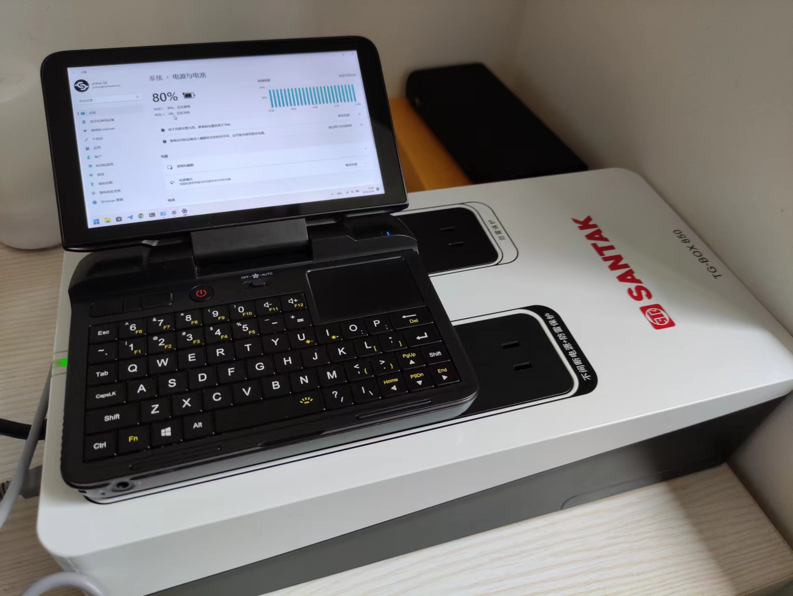
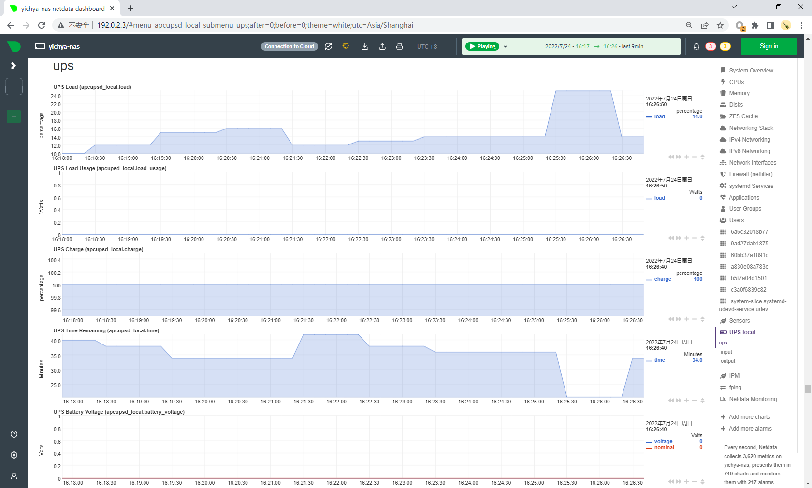

虽然因为各种原因拖了差不多一个月，不过坑还是要填的。细数了下这一年来入手的东西也不算少。

# Logitech M720

某位前同事的同款。带惯性的滚轮非常爽，如果一定说有点什么怨念就是没电了得换电池，不是充电的。侧面的「alt + tab」键其实我觉得应该是很好用的，但我好像从来没怎么用过。


正好 2014 年买的狼蛛用到现在右键似乎已经开始出问题了。等到它寄了，下次就整个能充电而且带侧向滚轮的鼠标，进一步提升生产力。

# Funkey S

众筹产品，等了得有半年。配置是全志的 V3s，一个拿来做行车记录仪的 SoC，自带 64MB 内存，搭配一个 240x240 的 TFT 屏幕，再加个不知道啥牌子的 32GB TF 卡。这么一想六百多，确实还是有点贵。小是真的小，差不多就跟 AirPods 的充电盒一样大，当然屏幕也是真的瞎眼，操作也是真的难受，尤其是两个肩键，无论什么姿势拿着主机，按肩键都非常非常困难。

基本上就是用来玩 GBA 的 Pokemon，毕竟这机子外形一看就很有既视感，而且 240x240 的屏幕也是跟 GBA 完美点对点，实际显示效果确实也很不错，但因为电子杨伟问题也忘了打了多少就鸽了。某天突然发现 PS1 有暴力摩托，试着用这台小机器上的 PS1 模拟器玩了一下，那可真叫爷青回，非常流畅，而且操作不需要用到肩键，太爽了。

| | |
|-|-|
| 好像是绿叶，具体记不清了 | PS1 版暴力摩托，真·爷青回 |

这台机器实际上是 Linux 4.14 内核，还可以 usbnet + ssh，usb 存储是挂了个盘出来，不是 mtp 那种辣鸡

| | |
|-|-|
| 文件系统 | 终端 |

官方感觉已经开摆，系统（[FunKey-Project/FunKey-OS](https://github.com/FunKey-Project/FunKey-OS)）从未更新过，不过也好像没什么可更新的。

没搞 PS1 模拟器的时候，实在不觉得里面会需要放 32GB 这么多东西，于是把 Odroid Go 一直不认的 4GB 小破 TF 卡放进去了。装完系统之后剩下的空间大概是 2.6GB 左右的样子。后来搞起 PS1 模拟器之后发现 PS1 游戏里面好像全都是视频，一个游戏就 700MB，里面可能有超过 600MB 是过场动画。但这样一搞装 3 个游戏就满了，好像不应该换 TF 卡的。算了，等什么时候真的空间不够用了再说吧。

最后感觉就是差个蓝牙，不然甚至还可以听歌用，甚至说不定可以对战，那将绝杀，可惜加不得。

# Redmi Buds 3

音质很烂，被 AirPods 2 吊打，真的吊打。手势非常烂，识别率可能有个 10% 不到，更别提什么自定义手势约等于无的事儿了（双击上一曲、三击下一曲这种设定已经很奇葩了，更让人血压爆表的是经常连戳五六下都没啥反应）。以上两个因素导致我完全不会考虑用它听歌这种事情，只能打电话用，最多偶尔看视频用一下。当然价格摆在那，音质问题属于是一个要啥自行车，不过手势。。。是真的没法忍


跟 miui 搭配倒是还算顺畅，有弹窗，而且起码不像锤子那个动不动就断连，电池续航也不错，入耳检测也能用。至于什么 aptx adaptive 之类的，就这被 AirPods 吊打的音质，就当不存在吧。

# 猫王·小王子

Atom 送的，一直想要但是真的舍不得买（好像重复了很多次，不过真的是实话，这玩意儿我是真的心动很多次了，但是三百多好像，这个价格是真的离谱）


这种带天线、拧旋钮调音量调台的体验是真的好，音质也不错，唯一的怨念是背后一个 Micro USB 是 FM 天线 + Aux In + 充电三个功能复用。FM 天线倒是用不用都行，不能一边充电一边 Aux In 多少还是有点不方便。

# 小米显示器挂灯 1S

跟之前介绍过的一代相比，只是多了智能控制的能力，光照基本上没区别。


_鹿鸣：又是我，不过这次从鸢尾换成了风信_

对着小爱吼一嗓子比用遥控器开关要方便很多，而且大部分设备都可以装米家 App，因此遥控器已被束之高阁。


旧款的灯因为草民之前天天通过从底座上掰下来的方式开灯，触点旁边的塑料融化坏掉了。搜了一下淘宝发现那玩意儿故障率贼高，但能买到的备件只有金属触点，旁边损坏的塑料件没有现成的。又不想花三十块钱寄修，回头有空一坨锡好了。

# Philips SWR3115A

蓝牙音频转接器。主要为了拿来搭配 ESP32 MP3 听歌用，结果成了两个杯具（MP3 没时间搞了 & 这个转接器也吃灰了）

做工和音质都很不错，但有一点比较蛋疼，没有音频输入或者输入是 0 电平的时候会节能，但从节能恢复的时间有点长，所以能感知到比如听歌的时候前奏少了几十毫秒。

# EROS TEN

因为之前真·垃圾堆里面捡来的 YP-U5 关机漏电的问题实在是令人难以接受，然后之前家里翻出来用了得有十几年的纽曼 M520 虽然还能用、音质还行、电池续航也不错，但是毕竟它的按钮全塌下去了，而且 MiniUSB 实在是不太方便。。。还是觉得需要一个纯音频 MP3 用来解决纯粹的听歌需求，当然如果有蓝牙（主要是接收能力，发射不需要）就更好。

翻了一圈就这个爱国者的算是牌子不错，功能也满足需求，除了没有自带存储之外感觉都还行就买了。音质确实不错，而且 USB 还有 DAC 模式，可以用来当 USB 声卡（曾经总是想接个声卡到路由器上用，拿来做网络收音机）


音量旋钮是那种棘轮开关，可以类比鼠标滚轮，但是很不灵敏，松松垮垮，有时候滚动一格完全没反应，有时候滚动一格音量动了两格甚至三格，非常之蛋疼，让草民回想起多年前使用带滚轮的黑莓，那个滚轮进灰了就是这种感觉。同样反映了做工问题的还有明显歪了的 TF 卡槽，还有紧的一逼非常难以取下的背夹。

系统交互也很一般，比如：

* 旋钮只能用来调音量，不能用来滚动歌曲列表，歌曲列表很长的时候就很痛苦
* 锁屏会把除了电源键之外的按钮全部锁定，切换歌曲就很不方便，但是不锁屏吧，音量旋钮又经常搞事

草民主要的需求点之一的蓝牙接收能力，延迟非常非常高，几乎等于不能用；发射如何没试过，本来也这没需求。

想去官网看一下有没有升级过固件解决一下蓝牙接收延迟巨高的问题，但只有一个非常老的固件。顺手解开一看发现操作系统居然是个嵌入式 Linux，真的没想到。简单看了一下是个很有年头的 buildroot，估计是厂商（好像是 broadcom 的一个什么全家桶方案）给的 SDK，里面甚至还有一个 adbd 和一个奇怪的 authorized_keys 文件。

```
yichya@yichya-nas /m/P/P/EROS> ls -al
total 26841
drwxrwxrwx   3 yichya yichya        9 Dec  7  2021 ./
drwxr-xr-x 104 yichya yichya      129 Jul  8 17:35 ../
-rwxrwxrwx   1 yichya yichya        4 Aug 12  2016 _gitigno*
drwxr-xr-x   3 yichya yichya        3 Dec  7  2021 system/
-rwxrwxrwx   1 yichya yichya 24379392 Oct 25  2017 system.ubi*
-rwxrwxrwx   1 yichya yichya   341768 Oct 25  2017 uboot.bin*
-rwxrwxrwx   1 yichya yichya  2517948 Oct 25  2017 uimage.bin*
-rwxrwxrwx   1 yichya yichya      259 Oct 25  2017 update.txt*
-rwxrwxrwx   1 yichya yichya       71 Oct 25  2017 version.txt*
yichya@yichya-nas /m/P/P/EROS> file uimage.bin
uimage.bin: u-boot legacy uImage, Linux-3.10.14, Linux/MIPS, OS Kernel Image (gzip), 2517884 bytes, Wed Oct 25 08:42:59 2017, Load Address: 0X80010000, Entry Point: 0X803F5760, Header CRC: 0XFB9F5C85, Data CRC: 0XC2F531DC
yichya@yichya-nas /m/P/P/EROS> cd system/raw
yichya@yichya-nas /m/P/P/E/s/raw> ls -al
total 80
drwxr-xr-x 19 yichya yichya  23 Dec  7  2021 ./
drwxr-xr-x  3 yichya yichya   3 Dec  7  2021 ../
drwxr-xr-x  2 yichya yichya  89 Dec  7  2021 bin/
drwxr-xr-x  2 yichya yichya   3 Dec  7  2021 data/
drwxr-xr-x  5 yichya yichya   6 Dec  7  2021 dev/
drwxr-xr-x 10 yichya yichya  38 Dec  7  2021 etc/
drwxr-xr-x  2 yichya yichya   3 Dec  7  2021 firmware/
drwxr-xr-x  3 yichya yichya   3 Dec  7  2021 home/
-rw-r--r--  1 yichya yichya 176 Dec  7  2021 init
drwxr-xr-x  2 yichya yichya  41 Dec  7  2021 lib/
lrwxrwxrwx  1 yichya yichya   3 Dec  7  2021 lib32 -> lib/
lrwxrwxrwx  1 yichya yichya  11 Dec  7  2021 linuxrc -> bin/busybox
drwxr-xr-x  2 yichya yichya   2 Dec  7  2021 media/
drwxr-xr-x  2 yichya yichya   2 Dec  7  2021 mnt/
drwxr-xr-x  2 yichya yichya   2 Dec  7  2021 opt/
drwxr-xr-x  2 yichya yichya   2 Dec  7  2021 proc/
drwxr-xr-x  3 yichya yichya   6 Dec  7  2021 root/
lrwxrwxrwx  1 yichya yichya   3 Dec  7  2021 run -> tmp/
drwxr-xr-x  2 yichya yichya  65 Dec  7  2021 sbin/
drwxr-xr-x  2 yichya yichya   2 Dec  7  2021 sys/
drwxr-xr-x  3 yichya yichya   3 Dec  7  2021 tmp/
drwxr-xr-x  8 yichya yichya   9 Dec  7  2021 usr/
drwxr-xr-x  3 yichya yichya  10 Dec  7  2021 var/
yichya@yichya-nas /m/P/P/E/s/raw> file sbin/adbd
sbin/adbd: ELF 32-bit LSB executable, MIPS, MIPS32 rel2 version 1 (SYSV), dynamically linked, interpreter /lib/ld.so.1, for GNU/Linux 2.6.12, with debug_info, not stripped
yichya@yichya-nas /m/P/P/E/s/raw> cat etc/os-release
NAME=Buildroot
VERSION=2014.05-00012-gd40d476-dirty
ID=buildroot
VERSION_ID=2014.05
PRETTY_NAME="Buildroot 2014.05"
yichya@yichya-nas /m/P/P/E/s/raw> cd root
yichya@yichya-nas /m/P/P/E/s/r/root> ls -al
total 27
drwxr-xr-x  3 yichya yichya   6 Dec  7  2021 ./
drwxr-xr-x 19 yichya yichya  23 Dec  7  2021 ../
-rw-r--r--  1 yichya yichya   0 Dec  7  2021 .bash_history
-rw-r--r--  1 yichya yichya 175 Dec  7  2021 .bash_logout
-rw-r--r--  1 yichya yichya 161 Dec  7  2021 .bash_profile
drwxr-xr-x  2 yichya yichya   3 Dec  7  2021 .ssh/
yichya@yichya-nas /m/P/P/E/s/r/root> cd .ssh
yichya@yichya-nas /m/P/P/E/s/r/r/.ssh> ls
authorized_keys
yichya@yichya-nas /m/P/P/E/s/r/r/.ssh> cat authorized_keys
ssh-rsa AAAAB3NzaC1yc2EAAAADAQABAAABAQC6NB8XeL+Ay9ySEXg5TNChKS0F0PxH2eXeVcQguEc/yh/SeV+2HLr3spjGlFRm8rfRhgT03GwTbdKrSyumQd/mJ4+gFm7uvaJ9byg7mnIDu0Srxd1UN2TxqQGf0wTI4S78MX96r8LTr5duVKSIVRX/ZHff8nsvH4m9NVowONy4h42jjc60o989Y8YjFY6aiPbrcBA9OSvYsQg+oAnyjnmfu/aEwYdlBpXqAe3RG1JhtM3Zv80V93yF89aiN7D1iN2OlzmbS1PMph/6W7lIIVMvKPqzBgxLeDqZScKkFV31WAUxn0M28KtVn2uqUyBROEjygqrO2v1SOt/vIEv2eWl7 dyn@hb
yichya@yichya-nas /m/P/P/E/s/r/r/.ssh>
```

看固件更新也没有什么校验机制，说不定会找个机会把它魔改一下，把 adb 打开什么的。

# Switch Lite

其实一直想买 Switch 来着，但一方面担心吃灰（这个事情现在发现确实是不可避免的），另一方面摇杆漂移的问题一直没得到彻底解决。不过后来杨老师打算换 Switch OLED，草民就干脆接盘了。这个蓝色真不戳呀。


草民起初以为 Lite 除了手柄拆不下来、没有视频输出之外跟普通的也没啥区别，后来才想起来 Lite 完全没有手柄振动，体验重大损失。另外一个比较难受的点是，日版的 5GHz 无线没有 149 - 165 信道，只能用 36 - 64，多少有点不方便。Switch 的 5GHz 下载速度最快也就 40Mbit/s 的样子，不过还是比 2.4GHz 快了将近十倍。

至于游戏，有一说一，Switch 的游戏可真贵。买来半年多，买游戏的钱已经比机器的两倍还多了，不过电子杨伟太严重，下图是草民买的所有游戏，但其中只勉强通了马车、卡比、TerrorBane 和 Crysis 3（其实真的是因为 Crysis 全家桶移植到 Switch 上了才终于下定决心买的）
。这台机器目前基本上就是马车专用机，心烦的时候来一把相当放松，不得不说任天堂是真的会做聚会游戏


至于之前担心的摇杆漂移问题，目前还没遇到。很明显的一个点是大部分游戏左摇杆的负担都比右摇杆大的多，但 Lite 上的左摇杆又比右摇杆难换。。。真的需要换再说吧。

好友来一波秋梨膏 `SW-2107-2362-1147`

# 微软无线多媒体键盘

纯纯的辣鸡，以至于它虽然就在我手边上，但我都忘了它的存在。甚至懒得拍照片了，偷一张图。


主要买来给插在电视上的 R86S 用的，但是无线信号巨差，接收器放电视下面，人坐在两米开外的沙发上就已经没法用了，必须放在茶几上才能勉强使用。触控板手感也比较拉，松松垮垮的，包括别的细节做工也很烂，但这些在巨烂的无线信号面前都已经不重要了。

本来草民对微软的键鼠印象一直不错，但这破玩意儿辣鸡到让人无语，不知道是哪家贴牌的产品。完全不值得考虑。

# SANTEK TG-BOX 850

某天中午无通知停电一个小时，完后 `zfs scrub` 跑了一天。觉得这样不行，还是得买 UPS，不过这事儿确实小概率，买来之后再也没出现过。当然买都买了图个省心。买来配好之后直接安排上了之前一直没敢开的 `ZIL SLOG`，然后发现这玩意儿没球用，当然这是后话了。



UPS 目前是通过 USB 线插到 MicroServer 上的，搭配 apcupsd 做监控和自动关机，并且同步到 R86S 上。

```
> sudo apcaccess status
APC      : 001,028,0674
DATE     : 2022-07-24 16:29:31 +0800
HOSTNAME : yichya-nas
VERSION  : 3.14.14 (31 May 2016) unknown
UPSNAME  : yichya-nas
CABLE    : USB Cable
DRIVER   : USB UPS Driver
UPSMODE  : Stand Alone
STARTTIME: 2022-07-20 23:27:29 +0800
MODEL    : SANTAK TG-BOX
STATUS   : ONLINE
LOADPCT  : 10.0 Percent
BCHARGE  : 100.0 Percent
TIMELEFT : 42.0 Minutes
MBATTCHG : 5 Percent
MINTIMEL : 3 Minutes
MAXTIME  : 0 Seconds
OUTPUTV  : 230.0 Volts
DWAKE    : -1 Seconds
LOTRANS  : 184.0 Volts
HITRANS  : 264.0 Volts
ALARMDEL : 30 Seconds
NUMXFERS : 0
TONBATT  : 0 Seconds
CUMONBATT: 0 Seconds
XOFFBATT : N/A
STATFLAG : 0x05000008
SERIALNO : Blank
END APC  : 2022-07-24 16:29:51 +0800
```

这台机器相对低端，apcupsd 能看到的数据很少，基本上只有容量、负载、剩余时间是比较有用的，电压和功率之类的都没有。平时负载 10% 能撑 40 分钟，编译 OpenWrt 之类拉高负载之后会到 20% - 25% 左右，完全够用。



为此又重新规划了家庭网络，把掉电也考虑在内（简单的说把内网和外网的电源也隔离了）。


这里只简单贴几张图，更多细节会在 Real NAS Project 2 里面介绍。

# 小米米家智能开关

因为价格很便宜，而且是单火的，就买了一个试试，效果很不错。这个开关其实更像一个按钮，没有那种物理上的切换状态，一开始还挺不习惯的。


需要一个蓝牙 Mesh 网关，草民的是小爱音箱 Pro，另外如果不需要用它来直接控制灯的通断（比如用的是 Yeelight 那种智能灯），也可以把它真的在米家里面配置成一个按钮，然后设置它的一些联动动作。


新家装修，直接一次性买了十个，进行一个拉满。


八月份差不多就会安排上了，下次见。

# 附赠一组猫猫

「吃一点坚果对身体好。」


纯摆件，但很萌。

近期暂时没有什么新的打算买的东西，目前在考虑 iPhone 13 Mini，如果：

* iPhone 14 确定没有 Mini
* 低端型号依然是 A15 
* A16 或者说超大杯没啥特别 awesome 的功能（比如放弃 Lightning 改用 Type-C）

以上三个条件都满足的话，大概会入手。其他的在考虑入手一些 EE 常用工具比如 PD 输入的可调电源什么的，当然这个随缘吧。
