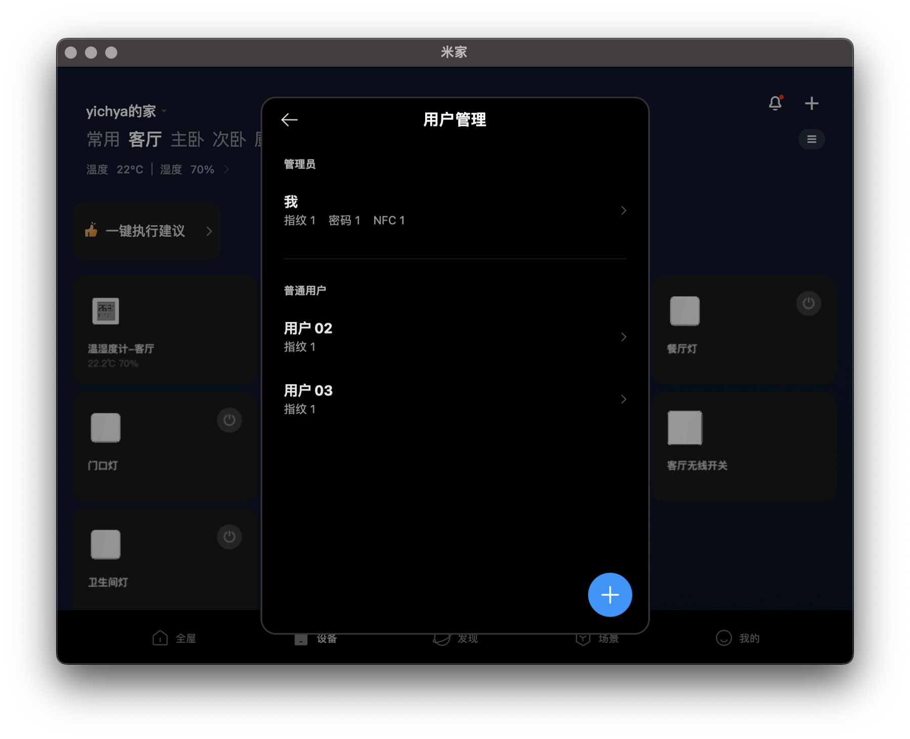

Project Home 2 主要介绍一下家庭网络和智能家居的事情。

# New Network

想来大家租房的时候都会因为扯来扯去的网线头疼。既然有了新家，那肯定是要仔细考虑一下如何建设家庭网络。

## Wiring

初步看了一下原来每个房间有哪些线连到弱电箱里面：

* 外面进来的：有线电视同轴线 x1；光纤 x1
* 客厅：有线电视同轴线 x1；光纤 x1
* 主卧：电话线 x1；有线电视同轴线 x1
* 次卧：电话线 x1

有线电视同轴线和电话线现在显然都没有任何用处了。之前的光纤是从沙发后面出来的，也十分不合理。改线方案初步考虑：

* 光纤从户外接到弱电箱，再穿到电视柜下面，在电视柜下面接光猫、IPTV 机顶盒、NAS、R86S 之类设备
* 电视柜回一根线到弱电箱，在弱电箱里面装一个交换机接到两个卧室

于是重新穿了到电视柜下面的光纤，并且其他室内的电话线和有线电视线全换成 Cat5E 网线（因为并不长所以没有搞更高标号的）

<svg xmlns="http://www.w3.org/2000/svg" xmlns:xlink="http://www.w3.org/1999/xlink" version="1.1" width="762px" height="501px" viewBox="-0.5 -0.5 762 501" content="&lt;mxfile host=&quot;app.diagrams.net&quot; modified=&quot;2022-11-05T14:25:53.411Z&quot; agent=&quot;5.0 (Macintosh; Intel Mac OS X 10_15_7) AppleWebKit/537.36 (KHTML, like Gecko) Chrome/107.0.0.0 Safari/537.36&quot; etag=&quot;JF_zOBZsju9XRFDUw2C_&quot; version=&quot;17.4.2&quot; type=&quot;onedrive&quot;&gt;&lt;diagram id=&quot;57SOjtfMvLMALhvKQCJH&quot; name=&quot;Page-1&quot;&gt;7VrbctowEP0aPSZjyfdH20D60E4yk5leHlUssBtjMUYE6NdXwjK+yFxCDKZNZzIZ77FWWHvOrlYGoAez9UOG59EXGpIEIC1cA30AELIdi/8XwCYHoA1hjkyzOJRYCTzHv4kENYku45AsagMZpQmL53VwTNOUjFkNw1lGV/VhE5rUP3WOp0QBnsc4UdFvcciiHHWQXeKfSDyN5Cebjp7fmOFirFzIIsIhXVUgfQj0IKOU5VezdUASEbsiLLnfaM/d3XNlJGWnOATk8SfVXx7W6QI/fp2YxIif7qAhH45tigWTkK9fmjRjEZ3SFCfDEvUzukxDIqbVuFWO+UzpnIOQg78IYxtJJl4yyqGIzRJ5l6xj9l2435vS+iEnE9eDddXYFEbKsk3FSZg/ivmEUbptrdIv9IQMuJnSlOTIKE4SeT/Ei2i7FjFRHgwRgb1BltCCLrMxORRZqVWcTQk7MA7tpMBTiNAZ4Q/P/TKSYBa/1p8DSy1Pd+OkK18h3lQGzGmcskVl5icB8AEyLaElRSmz8s5tiqfhoKPDDvwif4bCqiymhLaKfIs67T7VCava3Cn1mDqr2tTubbNLeQrjCTNGsnSLIK0n0RrvFG1FNmeowr0dVaDzZIGOyaJG+zGN/IUCOKtq6c2qZWtHqlbTwdGuUbXyz3zFyVIGAgxN4AfAh2BoA9cAvikuvKFAmlJeRTEjz3O8pWnFe6q6DPFinnc5k3gtBCLJfyUZI+vD9Kt0FQ7N4m4XwKrS8UgoqjQ7BdZ5iqOWEFrAC4AHRSydAfDUraGHyO0iUEQOak7PoYOqpP53dJ3URuPE2mj3uTkaLZmzqzmOSBt+IuO55I6AG9xCCllas0b3XXzslhDy+DnA9yvFR0M3GT237/rjqNFT6pGSwJUo1UvRqemrBqiyfrNl/QX2to5F6TAcRb1WI7B5WZFuB3oV49hEed1RJuqqa3E/FG+G3hlvzZkgNK7LHGxhqq8dH56240NwwVNyh1t+8RLy6J6/R8xXOhBrp+1YN3HYsJuHjf5bZtRPy7zn3cBNvTG6uPBP2wytJvenVmcLNmayzesWZ2R+rH1V2Qy1M5lTTtbKTJdmzuqUubO2qJuhUTs3Afe/ILkWjS3Hua5ofF91vR1yz+19VXKvfGhBLadN3vB4CLjqlwS8Z2F1ahcsoy8koAnNSuonfCttQDiJp4LhMSeQcNwXHVA8xoknb8ziMNx2BW0NVVsFf1cLpZZGqHZQVouA0KU6KL3tnbcN/AFwt++8fQ/4ow9EiOb2TQhqTQyH/7mSEE/96v8fJsS+GCHcLH/EkRe28pcw+vAP&lt;/diagram&gt;&lt;/mxfile&gt;" resource="https://app.diagrams.net/#W16b139462937480f%2F16B139462937480F!245952"><defs/><g><path d="M 120 420 L 120 220 L 280 220 L 280 140" fill="none" stroke="rgb(0, 0, 0)" stroke-miterlimit="10" stroke-dasharray="3 3" pointer-events="stroke"/><path d="M 160 460 L 360 460 L 360 380 L 560 380" fill="none" stroke="rgb(0, 0, 0)" stroke-miterlimit="10" stroke-dasharray="1 1" pointer-events="stroke"/><path d="M 160 440 L 320 440 L 320 340 L 560 340" fill="none" stroke="rgb(0, 0, 0)" stroke-miterlimit="10" stroke-dasharray="3 3" pointer-events="stroke"/><rect x="80" y="420" width="80" height="80" fill="rgb(255, 255, 255)" stroke="rgb(0, 0, 0)" pointer-events="all"/><g transform="translate(-0.5 -0.5)"><switch><foreignObject pointer-events="none" width="100%" height="100%" requiredFeatures="http://www.w3.org/TR/SVG11/feature#Extensibility" style="overflow: visible; text-align: left;">

弱电箱

</foreignObject><text x="120" y="464" fill="rgb(0, 0, 0)" font-family="Helvetica" font-size="12px" text-anchor="middle">弱电箱</text></switch></g><rect x="240" y="60" width="80" height="80" fill="rgb(255, 255, 255)" stroke="rgb(0, 0, 0)" pointer-events="all"/><g transform="translate(-0.5 -0.5)"><switch><foreignObject pointer-events="none" width="100%" height="100%" requiredFeatures="http://www.w3.org/TR/SVG11/feature#Extensibility" style="overflow: visible; text-align: left;">

次卧

</foreignObject><text x="280" y="104" fill="rgb(0, 0, 0)" font-family="Helvetica" font-size="12px" text-anchor="middle">次卧</text></switch></g><path d="M 600 320 L 600 240" fill="none" stroke="rgb(0, 0, 0)" stroke-miterlimit="10" stroke-dasharray="3 3" pointer-events="stroke"/><rect x="560" y="320" width="80" height="80" fill="rgb(255, 255, 255)" stroke="rgb(0, 0, 0)" pointer-events="all"/><g transform="translate(-0.5 -0.5)"><switch><foreignObject pointer-events="none" width="100%" height="100%" requiredFeatures="http://www.w3.org/TR/SVG11/feature#Extensibility" style="overflow: visible; text-align: left;">

电视柜

</foreignObject><text x="600" y="364" fill="rgb(0, 0, 0)" font-family="Helvetica" font-size="12px" text-anchor="middle">电视柜</text></switch></g><rect x="560" y="160" width="80" height="80" fill="rgb(255, 255, 255)" stroke="rgb(0, 0, 0)" pointer-events="all"/><g transform="translate(-0.5 -0.5)"><switch><foreignObject pointer-events="none" width="100%" height="100%" requiredFeatures="http://www.w3.org/TR/SVG11/feature#Extensibility" style="overflow: visible; text-align: left;">

主卧 2

</foreignObject><text x="600" y="204" fill="rgb(0, 0, 0)" font-family="Helvetica" font-size="12px" text-anchor="middle">主卧 2</text></switch></g><path d="M 760 280 L 0 280" fill="none" stroke="rgb(0, 0, 0)" stroke-miterlimit="10" pointer-events="stroke"/><path d="M 390 280 L 390 0" fill="none" stroke="rgb(0, 0, 0)" stroke-miterlimit="10" pointer-events="stroke"/><path d="M 720 140 L 720 480 L 160 480" fill="none" stroke="rgb(0, 0, 0)" stroke-miterlimit="10" stroke-dasharray="3 3" pointer-events="stroke"/><rect x="680" y="60" width="80" height="80" fill="rgb(255, 255, 255)" stroke="rgb(0, 0, 0)" pointer-events="all"/><g transform="translate(-0.5 -0.5)"><switch><foreignObject pointer-events="none" width="100%" height="100%" requiredFeatures="http://www.w3.org/TR/SVG11/feature#Extensibility" style="overflow: visible; text-align: left;">

主卧 1

</foreignObject><text x="720" y="104" fill="rgb(0, 0, 0)" font-family="Helvetica" font-size="12px" text-anchor="middle">主卧 1</text></switch></g><path d="M 0 460 L 80 460" fill="none" stroke="rgb(0, 0, 0)" stroke-miterlimit="10" stroke-dasharray="1 1" pointer-events="stroke"/><path d="M 0 40 L 40 40" fill="none" stroke="rgb(0, 0, 0)" stroke-miterlimit="10" pointer-events="stroke"/><path d="M 0 60 L 40 60" fill="none" stroke="rgb(0, 0, 0)" stroke-miterlimit="10" stroke-dasharray="3 3" pointer-events="stroke"/><path d="M 0 80 L 40 80" fill="none" stroke="rgb(0, 0, 0)" stroke-miterlimit="10" stroke-dasharray="1 1" pointer-events="stroke"/><rect x="40" y="30" width="60" height="20" fill="none" stroke="none" pointer-events="all"/><g transform="translate(-0.5 -0.5)"><switch><foreignObject pointer-events="none" width="100%" height="100%" requiredFeatures="http://www.w3.org/TR/SVG11/feature#Extensibility" style="overflow: visible; text-align: left;">

墙

</foreignObject><text x="70" y="44" fill="rgb(0, 0, 0)" font-family="Helvetica" font-size="12px" text-anchor="middle">墙</text></switch></g><rect x="40" y="50" width="60" height="20" fill="none" stroke="none" pointer-events="all"/><g transform="translate(-0.5 -0.5)"><switch><foreignObject pointer-events="none" width="100%" height="100%" requiredFeatures="http://www.w3.org/TR/SVG11/feature#Extensibility" style="overflow: visible; text-align: left;">

网线

</foreignObject><text x="70" y="64" fill="rgb(0, 0, 0)" font-family="Helvetica" font-size="12px" text-anchor="middle">网线</text></switch></g><rect x="40" y="70" width="60" height="20" fill="none" stroke="none" pointer-events="all"/><g transform="translate(-0.5 -0.5)"><switch><foreignObject pointer-events="none" width="100%" height="100%" requiredFeatures="http://www.w3.org/TR/SVG11/feature#Extensibility" style="overflow: visible; text-align: left;">

光纤

</foreignObject><text x="70" y="84" fill="rgb(0, 0, 0)" font-family="Helvetica" font-size="12px" text-anchor="middle">光纤</text></switch></g></g><switch><g requiredFeatures="http://www.w3.org/TR/SVG11/feature#Extensibility"/><a transform="translate(0,-5)" xlink:href="https://www.diagrams.net/doc/faq/svg-export-text-problems" target="_blank"><text text-anchor="middle" font-size="10px" x="50%" y="100%">Text is not SVG - cannot display</text></a></switch></svg>

_户型图肯定是简化了的，不过不要在意细节_

然后跟规划对应，用的时候就是图上的主卧 1 和次卧两个口，主卧 2 虽然接了线，但因为大概会被柜子挡住，所以就先扔着不用了。不过后来买家具的时候重新考虑了一下房间布局，柜子改为放在了另一面墙上，而且弱电箱没有 220V，交换机虽然可以用 PoE 但终究是有些麻烦。于是干脆不再用主卧 1 了，弱电箱里面也不再装交换机而是直接把电视柜回来的线跟次卧那根线连起来。

## ISP

搬家之前办了宽带，这次用了电信。

这次给的设备（还是叫光猫吧，叫习惯了）是 10G EPON，四个千兆口（一个给 IPTV），没有 WiFi，然后电信有一个骚操作是搭售了两个定制的小米 CR8809，本来是不打算用的，但是一看是高通方案的 11ax，想着说凑合用也行。结果装好之后去缴费，收费方式居然是每月每台十块钱。。。这 tm 过于离谱，直接退掉。

最后套餐是一个月 89

* 300M 的宽带，够用了
* 两张手机卡（办宽带给了一张，顺便把之前的一张手机卡也绑进去了，不用加钱），每月 30G 流量

总体来看还是不错的。另外，因为 Tinc 已经整的比较好了，所以也懒得改桥接、整公网 IP，直接用。

## Connection

搬进来之后就要考虑各种设备的连接了。主卧 2 和电视柜仅有一墙之隔（而且是那种比较薄的砖墙，基本不影响无线信号），但次卧就比较远，而且要考虑使用场景上的区分。简单说结论：

* R7800
    * 放在次卧，直接连在光猫上，WiFi 覆盖次卧
    * 主要给父母用，没有什么透明代理之类的能力
    * 因为几乎不会重启，考虑稳定性，同时把米家设备全部接入 
* R86S
    * 放在客厅，直接连在光猫上，WiFi 覆盖客厅和主卧
    * 自己用，需要透明代理
    * 因为经常更新 OpenWrt，并不是很稳，下面接自己用的电脑手机平板啥的
    * 搭配 hap ac2 解决网口数量、WiFi 特定信道等需求
* NAS
    * 需要同时接入有透明代理的网络和没有透明代理的网络，支持不同需求
    * 同时连在光猫和 R86S 上

最终所有设备如图连接，区分开几个网段（用不同的线表示）

<svg xmlns="http://www.w3.org/2000/svg" xmlns:xlink="http://www.w3.org/1999/xlink" version="1.1" width="721px" height="441px" viewBox="-0.5 -0.5 721 441" content="&lt;mxfile host=&quot;app.diagrams.net&quot; modified=&quot;2022-11-06T03:34:58.267Z&quot; agent=&quot;5.0 (Macintosh; Intel Mac OS X 10_15_7) AppleWebKit/537.36 (KHTML, like Gecko) Chrome/107.0.0.0 Safari/537.36&quot; etag=&quot;csl8YQK4wOpfcWeRIM6a&quot; version=&quot;17.4.2&quot; type=&quot;device&quot;&gt;&lt;diagram id=&quot;57SOjtfMvLMALhvKQCJH&quot; name=&quot;Page-1&quot;&gt;5Vtbc9o4FP41zOw+lPFFMuaR0IR0pglMs9Nk9021FazWWIwtAvTXr4RtfJEBA74lbWYa6+hi/J1P53xHJj19vNhMfLR0HqiN3Z6m2Jue/rmnaaoCTP5LWLahZaANQsPcJ3Y0KDE8kd84nhlZV8TGQWYgo9RlZJk1WtTzsMUyNuT7dJ0d9krd7F2XaI4lw5OFXNn6TGzmRFbVGCYd95jMnejWZvx8CxQPjp4kcJBN1ymTftvTxz6lLLxabMbYFeDFuITz7g707j+Yjz1WZsIYT39Q/ddk4wVo+v0VYkBmn/TIPQHbxk+MbQ5A1KQ+c+icesi9Taw3Pl15NhbLKryVjPlK6ZIbVW78iRnbRt5EK0a5yWELN+rFG8JeUtf/iqX6MGp93kQr7xrbuOExf/uSbqRmiWYybddK5tkjwQPe9KiHQ8sdcd2oX4YxQjagK9/Cx7DTIz4if47ZsYFGOFAgm7pF5KYJpgvMPzEf4GMXMfKWpR6KGDzfj4um8sdC29SAJSUeC1Irz4SBD4g3oxExcZtt35Ucr2cJxi/CTxC3Uo+SmHYkPIOQQGmTkEp/ANOc/LCMHFbNyBQrLnC63p0oNPiwYQho3QhDIBeGzBNhKDcegAbCEOwQI7UPy0gddoORZo6R4AQjc+M1pQFGxqC+IXe118gTbridTR8lsmapuHYIw09LtPPamgv1LO0OevoN+wxvjnom6s3v6Vj0rhPNHIPmpNWyUlNGgZqEVhsb2kaBs5uvlthwYvAMMYZ9bzdDUy6OCVfsXVhy70K1LQmxgS9j/7/bnw/30Jy5ywc2seafWnHvRQoiw4kDPj/BlEtDfqHHquNJoWMGVUR0KQRDtbiW2S8Rfq5oVsKtc1MDyIf6fJF9YnyuxqopNUAp2H0bmIpcSZ3IAyhYhkcor2QjGFpFYohzo+SotjIDGHQnUtSk7M7KOleEAKNkqgCVy7zrGDB8f9qg0lpVK5cn6uWE2Sn5ALsTFM5QD+9BJxQQotADZiM6QTNBLTpBB0fPSk+PP1Fy5nXFueM1swkdYsg6xDSeeprhcs/f/PD51Vxc/TVdYu/ZZ393UaHspUdbCkWX89OX2T/fu4gVaFvMyWX+46iIcPc0ELujp92IJb9OO8k8oLQNp1xIjKkfIMKBVKY8wXQAND33Vqp1DsJ231hdJAjVrB4YdKSiiEXhe3mVkc/i4MysD5o4HYCgO/y8jJ4n65WPT8+rihujTQJ85OKmiBCFHhhWEZ1kkT+A2XACcjnuQHFT2Xc1TEkuOFwC8PtbWoEGG814F/XcbSfEV15H6G0fTMYvVFJojoJV0EWs2n+9JwtVOcZJ8SOFUja8lXglcxDFkzE+hREswCi2XRkLjJy0MMw+UJXkn55dMAxtUmSQlzXzyzYaYaB8onCNn9+bE8Ew60QNVuPF+AS8KS8O6tut782l5rAaF+bXqduFcqpXh1pf5WFG7W8kb/K8wrIuDJhPf+ExdamfuPiVq7mcCblkLuKuxf2Juf1GZCliIXcUdSyIbe8UalEeLLndy2c+aeeUS3xabYlPPhtUlb74+YOcUFKp1eaE+P5ZJ+h8O8A/yQ0lz8mrcENhUSXr5WdyR4ReUz1kyQWI1geT+9+8fySKVakbhp1jh/+nF5TMrkuWgQA74EWOMFouXdkHwJe+XSfBXOCMg8jD/JcoCg6K95o8jb1aG/jytxH34KPNEewfBbWPYq8aaqfB1wqKn4bBB/UxH3ab+XpBAm4YfFnMzpwdqflyigzug/DLPb83/zVBXJSyqkr6q4DNB/MmS/rD7/8zsD4IKgtQyQzZ4VUKacysfheBbPJ91OGzxgyQT2vCLKeLYNV46Mabyd9WhmVQ8heq+u3/&lt;/diagram&gt;&lt;/mxfile&gt;"><defs/><g><path d="M 80 120 L 120 120.07 L 120 280.07 L 160 280" fill="none" stroke="rgb(0, 0, 0)" stroke-miterlimit="10" pointer-events="stroke"/><path d="M 60 80 L 60 40.07 L 160 40" fill="none" stroke="rgb(0, 0, 0)" stroke-miterlimit="10" pointer-events="stroke"/><path d="M 80 140 L 100 140.07 L 100 400.07 L 160 400" fill="none" stroke="rgb(0, 0, 0)" stroke-miterlimit="10" pointer-events="stroke"/><path d="M 80 100 L 140 100.07 L 140 160.07 L 160 160" fill="none" stroke="rgb(0, 0, 0)" stroke-miterlimit="10" pointer-events="stroke"/><rect x="0" y="80" width="80" height="80" fill="rgb(255, 255, 255)" stroke="rgb(0, 0, 0)" pointer-events="all"/><g transform="translate(-0.5 -0.5)"><switch><foreignObject pointer-events="none" width="100%" height="100%" requiredFeatures="http://www.w3.org/TR/SVG11/feature#Extensibility" style="overflow: visible; text-align: left;">

10G EPON

</foreignObject><text x="40" y="124" fill="rgb(0, 0, 0)" font-family="Helvetica" font-size="12px" text-anchor="middle">10G EPON</text></switch></g><path d="M 240 140 L 280 140.07 L 280 120.07 L 320 120.07" fill="none" stroke="rgb(0, 0, 0)" stroke-miterlimit="10" stroke-dasharray="1 1" pointer-events="stroke"/><path d="M 240 180 L 440 180.07 L 440 120.07 L 640 120" fill="none" stroke="rgb(0, 0, 0)" stroke-miterlimit="10" stroke-dasharray="1 1" pointer-events="stroke"/><rect x="160" y="120" width="80" height="80" fill="rgb(255, 255, 255)" stroke="rgb(0, 0, 0)" pointer-events="all"/><g transform="translate(-0.5 -0.5)"><switch><foreignObject pointer-events="none" width="100%" height="100%" requiredFeatures="http://www.w3.org/TR/SVG11/feature#Extensibility" style="overflow: visible; text-align: left;">

R7800

</foreignObject><text x="200" y="164" fill="rgb(0, 0, 0)" font-family="Helvetica" font-size="12px" text-anchor="middle">R7800</text></switch></g><path d="M 240 260 L 280 260.07 L 280 240.07 L 320 240" fill="none" stroke="rgb(0, 0, 0)" stroke-miterlimit="10" stroke-dasharray="3 3" pointer-events="stroke"/><path d="M 240 300 L 280 300.07 L 280 340.07 L 320 340" fill="none" stroke="rgb(0, 0, 0)" stroke-miterlimit="10" stroke-dasharray="3 3" pointer-events="stroke"/><path d="M 240 280 L 300 280.07 L 300 300.07 L 440 300.07 L 440 240.07 L 640 240" fill="none" stroke="rgb(0, 0, 0)" stroke-miterlimit="10" stroke-dasharray="3 3" pointer-events="stroke"/><rect x="160" y="240" width="80" height="80" fill="rgb(255, 255, 255)" stroke="rgb(0, 0, 0)" pointer-events="all"/><g transform="translate(-0.5 -0.5)"><switch><foreignObject pointer-events="none" width="100%" height="100%" requiredFeatures="http://www.w3.org/TR/SVG11/feature#Extensibility" style="overflow: visible; text-align: left;">

R86S (OpenWrt)

</foreignObject><text x="200" y="284" fill="rgb(0, 0, 0)" font-family="Helvetica" font-size="12px" text-anchor="middle">R86S...</text></switch></g><rect x="160" y="0" width="80" height="80" fill="rgb(255, 255, 255)" stroke="rgb(0, 0, 0)" pointer-events="all"/><g transform="translate(-0.5 -0.5)"><switch><foreignObject pointer-events="none" width="100%" height="100%" requiredFeatures="http://www.w3.org/TR/SVG11/feature#Extensibility" style="overflow: visible; text-align: left;">

IPTV

</foreignObject><text x="200" y="44" fill="rgb(0, 0, 0)" font-family="Helvetica" font-size="12px" text-anchor="middle">IPTV</text></switch></g><rect x="160" y="360" width="80" height="80" fill="rgb(255, 255, 255)" stroke="rgb(0, 0, 0)" pointer-events="all"/><g transform="translate(-0.5 -0.5)"><switch><foreignObject pointer-events="none" width="100%" height="100%" requiredFeatures="http://www.w3.org/TR/SVG11/feature#Extensibility" style="overflow: visible; text-align: left;">

NAS (Host + iLO)

</foreignObject><text x="200" y="404" fill="rgb(0, 0, 0)" font-family="Helvetica" font-size="12px" text-anchor="middle">NAS...</text></switch></g><rect x="320" y="200" width="80" height="80" fill="rgb(255, 255, 255)" stroke="rgb(0, 0, 0)" pointer-events="all"/><g transform="translate(-0.5 -0.5)"><switch><foreignObject pointer-events="none" width="100%" height="100%" requiredFeatures="http://www.w3.org/TR/SVG11/feature#Extensibility" style="overflow: visible; text-align: left;">

Corsair One

</foreignObject><text x="360" y="244" fill="rgb(0, 0, 0)" font-family="Helvetica" font-size="12px" text-anchor="middle">Corsair One</text></switch></g><path d="M 320 380 L 300 380.07 L 300 420.07 L 240 420" fill="none" stroke="rgb(0, 0, 0)" stroke-miterlimit="10" stroke-dasharray="3 3" pointer-events="stroke"/><path d="M 320 360 L 280 360.07 L 280 380.07 L 240 380" fill="none" stroke="rgb(0, 0, 0)" stroke-miterlimit="10" stroke-dasharray="3 3" pointer-events="stroke"/><path d="M 400 360 L 640 360" fill="none" stroke="rgb(0, 0, 0)" stroke-miterlimit="10" stroke-dasharray="3 3" pointer-events="stroke"/><rect x="320" y="320" width="80" height="80" fill="rgb(255, 255, 255)" stroke="rgb(0, 0, 0)" pointer-events="all"/><g transform="translate(-0.5 -0.5)"><switch><foreignObject pointer-events="none" width="100%" height="100%" requiredFeatures="http://www.w3.org/TR/SVG11/feature#Extensibility" style="overflow: visible; text-align: left;">

hap ac2 (AP only)

</foreignObject><text x="360" y="364" fill="rgb(0, 0, 0)" font-family="Helvetica" font-size="12px" text-anchor="middle">hap ac2...</text></switch></g><rect x="320" y="80" width="80" height="80" fill="rgb(255, 255, 255)" stroke="rgb(0, 0, 0)" pointer-events="all"/><g transform="translate(-0.5 -0.5)"><switch><foreignObject pointer-events="none" width="100%" height="100%" requiredFeatures="http://www.w3.org/TR/SVG11/feature#Extensibility" style="overflow: visible; text-align: left;">

Asus

</foreignObject><text x="360" y="124" fill="rgb(0, 0, 0)" font-family="Helvetica" font-size="12px" text-anchor="middle">Asus</text></switch></g><path d="M 600 28.41 L 640 28" fill="none" stroke="rgb(0, 0, 0)" stroke-miterlimit="10" stroke-dasharray="1 1" pointer-events="stroke"/><path d="M 600 9.41 L 640 9" fill="none" stroke="rgb(0, 0, 0)" stroke-miterlimit="10" pointer-events="stroke"/><path d="M 600 49 L 640 49" fill="none" stroke="rgb(0, 0, 0)" stroke-miterlimit="10" stroke-dasharray="3 3" pointer-events="stroke"/><rect x="640" y="0" width="80" height="20" fill="none" stroke="none" pointer-events="all"/><g transform="translate(-0.5 -0.5)"><switch><foreignObject pointer-events="none" width="100%" height="100%" requiredFeatures="http://www.w3.org/TR/SVG11/feature#Extensibility" style="overflow: visible; text-align: left;">

192.168.1.x

</foreignObject><text x="680" y="14" fill="rgb(0, 0, 0)" font-family="Helvetica" font-size="12px" text-anchor="middle">192.168.1.x</text></switch></g><rect x="640" y="20" width="80" height="20" fill="none" stroke="none" pointer-events="all"/><g transform="translate(-0.5 -0.5)"><switch><foreignObject pointer-events="none" width="100%" height="100%" requiredFeatures="http://www.w3.org/TR/SVG11/feature#Extensibility" style="overflow: visible; text-align: left;">

10.0.0.x

</foreignObject><text x="680" y="34" fill="rgb(0, 0, 0)" font-family="Helvetica" font-size="12px" text-anchor="middle">10.0.0.x</text></switch></g><rect x="640" y="40" width="80" height="20" fill="none" stroke="none" pointer-events="all"/><g transform="translate(-0.5 -0.5)"><switch><foreignObject pointer-events="none" width="100%" height="100%" requiredFeatures="http://www.w3.org/TR/SVG11/feature#Extensibility" style="overflow: visible; text-align: left;">

10.32.15.x

</foreignObject><text x="680" y="54" fill="rgb(0, 0, 0)" font-family="Helvetica" font-size="12px" text-anchor="middle">10.32.15.x</text></switch></g><path d="M 490 90 C 466 90 460 120 479.2 126 C 460 139.2 481.6 168 497.2 156 C 508 180 544 180 556 156 C 580 156 580 132 565 120 C 580 96 556 72 535 84 C 520 66 496 66 490 90 Z" fill="rgb(255, 255, 255)" stroke="rgb(0, 0, 0)" stroke-miterlimit="10" pointer-events="all"/><g transform="translate(-0.5 -0.5)"><switch><foreignObject pointer-events="none" width="100%" height="100%" requiredFeatures="http://www.w3.org/TR/SVG11/feature#Extensibility" style="overflow: visible; text-align: left;">

WiFi 11nac 2.4GHz Auto 5GHz Ch 36

</foreignObject><text x="520" y="124" fill="rgb(0, 0, 0)" font-family="Helvetica" font-size="12px" text-anchor="middle">WiFi 11nac...</text></switch></g><path d="M 490 210 C 466 210 460 240 479.2 246 C 460 259.2 481.6 288 497.2 276 C 508 300 544 300 556 276 C 580 276 580 252 565 240 C 580 216 556 192 535 204 C 520 186 496 186 490 210 Z" fill="rgb(255, 255, 255)" stroke="rgb(0, 0, 0)" stroke-miterlimit="10" pointer-events="all"/><g transform="translate(-0.5 -0.5)"><switch><foreignObject pointer-events="none" width="100%" height="100%" requiredFeatures="http://www.w3.org/TR/SVG11/feature#Extensibility" style="overflow: visible; text-align: left;">

WiFi 11ax 2.4GHz None 5GHz Ch 161

</foreignObject><text x="520" y="244" fill="rgb(0, 0, 0)" font-family="Helvetica" font-size="12px" text-anchor="middle">WiFi 11ax...</text></switch></g><path d="M 490 330 C 466 330 460 360 479.2 366 C 460 379.2 481.6 408 497.2 396 C 508 420 544 420 556 396 C 580 396 580 372 565 360 C 580 336 556 312 535 324 C 520 306 496 306 490 330 Z" fill="rgb(255, 255, 255)" stroke="rgb(0, 0, 0)" stroke-miterlimit="10" pointer-events="all"/><g transform="translate(-0.5 -0.5)"><switch><foreignObject pointer-events="none" width="100%" height="100%" requiredFeatures="http://www.w3.org/TR/SVG11/feature#Extensibility" style="overflow: visible; text-align: left;">

WiFi 11nac 2.4GHz Auto 5GHz Ch 56

</foreignObject><text x="520" y="364" fill="rgb(0, 0, 0)" font-family="Helvetica" font-size="12px" text-anchor="middle">WiFi 11nac...</text></switch></g><rect x="640" y="80" width="80" height="80" fill="rgb(255, 255, 255)" stroke="rgb(0, 0, 0)" pointer-events="all"/><g transform="translate(-0.5 -0.5)"><switch><foreignObject pointer-events="none" width="100%" height="100%" requiredFeatures="http://www.w3.org/TR/SVG11/feature#Extensibility" style="overflow: visible; text-align: left;">

Phone,  Mi Home Gadgets

</foreignObject><text x="680" y="124" fill="rgb(0, 0, 0)" font-family="Helvetica" font-size="12px" text-anchor="middle">Phone,...</text></switch></g><rect x="640" y="200" width="80" height="80" fill="rgb(255, 255, 255)" stroke="rgb(0, 0, 0)" pointer-events="all"/><g transform="translate(-0.5 -0.5)"><switch><foreignObject pointer-events="none" width="100%" height="100%" requiredFeatures="http://www.w3.org/TR/SVG11/feature#Extensibility" style="overflow: visible; text-align: left;">

Mac, iPad, Phone, etc.

</foreignObject><text x="680" y="244" fill="rgb(0, 0, 0)" font-family="Helvetica" font-size="12px" text-anchor="middle">Mac, iPad, Ph...</text></switch></g><rect x="640" y="320" width="80" height="80" fill="rgb(255, 255, 255)" stroke="rgb(0, 0, 0)" pointer-events="all"/><g transform="translate(-0.5 -0.5)"><switch><foreignObject pointer-events="none" width="100%" height="100%" requiredFeatures="http://www.w3.org/TR/SVG11/feature#Extensibility" style="overflow: visible; text-align: left;">

Switch

</foreignObject><text x="680" y="364" fill="rgb(0, 0, 0)" font-family="Helvetica" font-size="12px" text-anchor="middle">Switch</text></switch></g></g><switch><g requiredFeatures="http://www.w3.org/TR/SVG11/feature#Extensibility"/><a transform="translate(0,-5)" xlink:href="https://www.diagrams.net/doc/faq/svg-export-text-problems" target="_blank"><text text-anchor="middle" font-size="10px" x="50%" y="100%">Text is not SVG - cannot display</text></a></switch></svg>

其中：

* NAS 在 10.32.15.x 里面的两条线分别用于 iLO（HPE 的 IPMI，前面介绍过）和正常的网络需求。
* 2.4GHz WiFi 因为基本没人用（除了智能家居设备之外只有电视和某些老手机用），所以摆烂
* 5GHz WiFi 考虑不同用途做频段区分
    * R86S 之前有提到过只能用 149 - 161
    * R7800 在剩下的 36 - 48 - 64 信道里面选择不需要 DFS 的 36 - 48，保证父母使用时的稳定性需求
    * hap ac2 选择剩下的 48 - 64，主要给 Switch 用，也用来给不是很稳定的 R86S 那个无线做备份
* R86S、hap ac2 和 NAS 接在 UPS 上，保证掉电时的数据安全（一些联动之类会在 Real NAS Project 2 介绍）。

目前来看 PC、NAS 这些主要设备都没有更新的需求，网络方案应该在相当长一段时间内不会再有变动了。

# Smart Home

既然终于有机会自己装修了，那肯定得整一套对不对。当然考虑到个人需求，第一次整这个没有整太多东西，主要就是灯。

预算不太多，所以客厅和卧室选了 Yeelight 的智能灯，其他的餐厅走廊阳台之类就随便买了些普通的 LED 吸顶灯，搭配小米的智能开关实现全屋所有灯接入米家控制。

除了灯之外还装了小米的指纹锁，不过那个就不涉及到什么智能之类的事情了。

## Yeelight Bedroom Lights

买的是灵犀 Mini，24W Ra95 的智能灯，两个。各种参数和晒图之类到处都是，就不贴了。用起来还不错，除了两个槽点：

* 接入米家只能通过连 2.4G WiFi 的方式，网络寄了的话，想通过自动化场景关灯都会很麻烦
* 自带一个蓝牙网关，但是
    * 不是 mesh 网关，也就不能控制蓝牙 mesh 设备
    * 这个灯也不能在米家里面作为一个蓝牙设备控制，还关不掉蓝牙网关功能
    * 总结为没球用

## Yeelight Living Room Lights

买的是跟卧室灯同一个系列的灵犀 Pro，除了功率（90W）和体积（客厅灯当然大很多，灯罩的形状和固定方式也变了）之外没啥区别。

安装的时候发现固定灯罩的卡扣断了三个。跟客服联系，客服一开始说补发一套卡扣，草民觉得时间太久就让客服直接走京东换货，客服也没说啥就安排了，结果换来的货卡扣断的更多了。

再次找客服直接问卡扣怎么回事，这次客服倒是直接说这一批卡扣都有问题，会补发一套改良的。居然一整批都是坏的，离谱……以及客服又顺便送了一个小夜灯。

除了卡扣问题之外倒是一切都很好。当然，既然是同一个系列，这个灯跟卧室灯一样也只能连 2.4GHz 的 WiFi 控制，也自带一个没啥用的蓝牙网关，跟卧室灯唯一一点不同是可以在米家里面把网关功能关掉。

还带一个遥控器，是跟卧室灯通用的，但是只能跟一个灯配对。

## Mi Smart Switch

之前有介绍过小米这个智能开关搭配普通的灯使用的体验，确实效果很好。但现在有搭配智能灯使用的情况了，实际体验下来有些问题：智能灯是需要保持供电的，开关由灯自己决定。虽然小米这个开关也可以设置成【转换为无线开关】（也就是不再控制通断），但是这样的话，这个开关的事件只有【单击】一种，就很没用。

而且如果遇上固件升级之类重启，这个开关并不会恢复到默认导通的状态，还需要在米家里面手动先关闭【转换为无线开关】，再开启这个开关，再打开【转换为无线开关】，才能恢复正常使用。

目前感觉搭配智能灯的话，确实还是 Yeelight 的那种纯机械的凌动™️（就不知道为什么米家的 UI 上面要强调这是个商标）开关更好一点，也不会有上面提到的如果没有本地中枢网关（下面会提），或者小米云服务器寄了，或者自家网络出问题之类事情发生的时候，就没法通过自动化来开关灯的情况。希望后面有固件升级能支持双击之类的事件，并且能保持【转换为无线开关】之后的通断状态吧。当然哪天要是觉得心烦把这三个换成凌动™️开关也不一定（

## Mi Central Gateway

小米这个蓝牙网关体系里面分中枢网关、从网关、盲网关。

* 中枢网关：可以执行本地自动化
* 从网关：可以跟中枢网关通信，但是中枢网关挂了的话，自动化还是只能在云端执行
* 盲网关：不能跟中枢网关通信，只能跟云端通信

走云端的自动化依赖网络和云服务器的可用性，但是呢：

* 小米的云服务器大概几个月前挂过一阵儿，所有云端自动化全跪；即使平时服务器没问题的时候，反应也比较慢
* 草民家里唯一的 mesh 网关（小爱音箱 Pro）之前是连在不太稳定的 R86S 的 WiFi 上面的，也没有本地执行自动化的能力

父母抱怨了两三次灯关不上 / 打不开之类，确实觉得这样不太好所以还是买了中枢网关。

接上之后确实效果很好，原来走云端的自动化执行可能有一两秒的延迟，改为本地执行后感觉只有几十毫秒就能响应。但是这玩意儿除了这个之外着实没有啥别的功能了，而且好尼玛贵，三百多，还不支持 Zigbee，老设备都不能拿来用（好像也没什么老设备了

在米家里面可以看到某个特定自动化规则是在云端执行还是在本地执行。

一般来说不涉及到开关自动化 / 一些太复杂的动作之类都可以本地执行，当然如果是新接入了中枢网关的话，之前已有的规则需要重新保存一下才能重新判断是否在本地执行。中枢网关的固件也在持续更新，应该会逐渐支持更强大的本地执行能力。

## Mi Wireless Switch

有两个按键的蓝牙开关，搭配中枢网关可以得到几乎没有延迟的本地自动化。

这个开关支持的事件就比较多，如果米家智能开关也能支持长按 / 双击的事件就好了。

这个开关也是有 86 盒使用的固定螺丝孔位的，但可惜它是用 CR2032 纽扣电池工作，虽然换电池并不需要把开关拆下来（只要掀开按钮盖板就行了），但把这样一个东西几乎永久固定在墙上可能还是不太合适。

## Mi Temp / Humid Sensor 2

米家这个温湿度计其实 2020 年就买了一个，后来因为确实很便宜，加上成都冬天没暖气还是有点冷，就又买了俩。

实际这个因为温度上报频率太低、延迟太高而没什么用，看温度还行，用来比如触发空调自动开关之类就完全不可行。

## Mi Smark Lock 1S

门锁自然还是选了智能锁，主要确实懒的带家门钥匙（虽然还是要带自行车钥匙，不过那个就算忘带也无所谓，家门钥匙可不行）

1S 支持天地钩，不过天地钩其实没啥用。现在安装的时候，安装师傅基本都不会装这个了。虽然草民自己是国庆假期花了几天时间研究了下这个钩子怎么装，而且因为原来门上的天地钩有些变形、生锈，尺寸也有几毫米的差距，最终着实颇费了一番功夫才把它装上，当然细节就不说了，还是建议就不装天地钩（

这把锁支持指纹、NFC 和密码这三种解锁方式，也能通过蓝牙网关接入，但蓝牙网关能做的事情不多：

* 事件触发（比如开门和锁门事件，联动自动化）
* 调整一些简单的设置（比如说没有关门、没有上锁时候的提示音量之类）
* 跟开关门相关的唯一能做的事情是下发一次性临时密码

其他的添加用户之类都需要手机蓝牙直连才能进行。

# Next

Project Home 会跟 DIY / Real NAS Project 一样持续迭代。后续会做的一些事情包括

* 电视柜部分的细节完善（因为放的设备比较多，而且还涉及到一些串流之类的需求）
* 一些桌面搭配和塑料小人摆放之类
* 装修过程中踩的一些坑

这个系列的内容大概很难称为经验分享（基本全是坑），有兴趣看下去的话就当图一乐嘛。
