年常系列。

今年大事颇多，比 2020 年更深切体会到了什么叫【覆巢之下，焉有完卵】。

很多名声如雷贯耳的大佬离开了我们，比如长者。


网易新闻的年度总结很真实，真实到被全网下架，只能出去看了。[Youtube](http://www.youtube.com/watch?v=7GimZhzg5-Y)

「人不是活一辈子，不是活几年、几月、几天，而是活几个瞬间」。致敬每一个扛住了生活的平凡人。

# Life Mainline

今年办了最重要的大事，基本上是按之前的预想完成了购房 + 户口迁移。除了随后的装修有些波折之外，总体还算比较顺利。

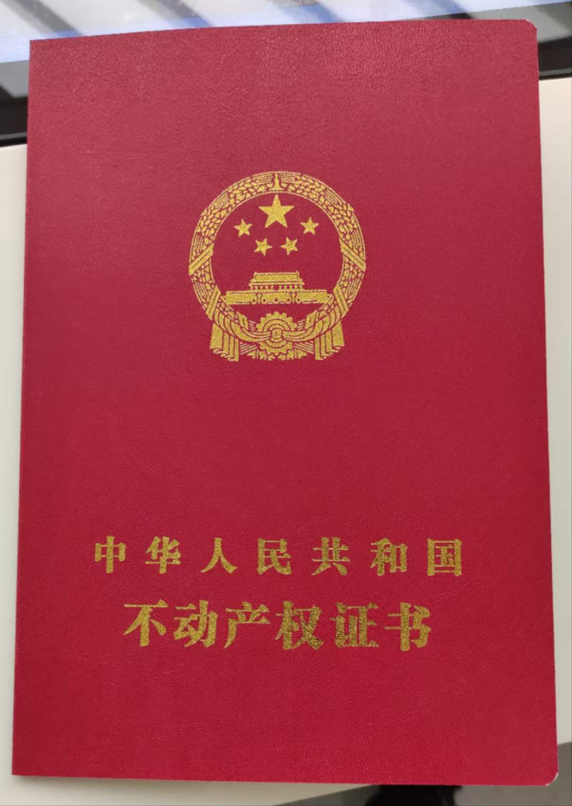

草民买在了高新区大源这边。选择这边的原因基本也是按之前的考虑：

* 通勤方便。成都的互联网企业基本都扎堆在天府三街那一片。草民目前上下班，骑自行车十五分钟，体验极佳
* 板块成熟。出门走路一两分钟就是五号线地铁，周围有教科院的附属中学、有医院、有公园、有不止一个大商圈，啥都不缺

虽然房子稍微老一点（十年多点），不过比起帝都那种比草民年纪都大的房子来说体验还是好非常多，而且这套房子以后是留给父母住的，加上预算有限，所以对房龄之类的要求没有那么高。

家具还没完全置办完成，回头会在 Project Home 里面单独做一次 Room Tour，现在只简单发一个工（游）作（戏）区 + 收藏区的图。

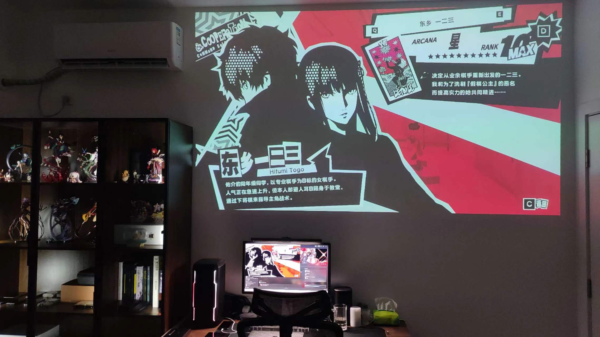

_柜子送的灯很离谱，回头再换_

今年经济形势显著变差，房地产市场更是不稳定，草民刚买完房就遇上年中的量价齐跌，到了年末政策又开始持续放松救市。说草民心情完全没有波动是不可能的，但认真考虑过，在这种不稳定的情况下试错的成本太高，与其搏一搏倒不如尽量在不确定性中多抓住一些确定的东西，苟过这一波之后再做更多考虑。而且就购房这一件事来讲，草民一个刚需，本身投入有限（而且还没有贷款，利率波动与我无关），实话说即使有些波动也没觉得太怎么样，没必要患得患失。

讲完房地产的事情，也从其他角度看看后续的情况。

今年各互联网公司的日子比去年显著的更难过了，砍 HC、冻结招聘、裁员等等都层出不穷。就目前这个情况来看，即使有各种政策试图提振经济，甚至到年底突然放松疫情管控，但就草民浅薄的认识来说也很难有什么实质性改变：

* 互联网国内增量发展基本到头，各大巨头基本都在做出海，但在目前国际局势大背景极其不稳定的情况下，做出海难度非常非常高
* 去年被猛锤的教育行业已经元气大伤，即使今年政策放松也很难恢复；而且在目前出生率持续走低的情况来看，长期发展也难说
* 房地产上面提过，再简单补充一点：目前政策着力于【保交楼】，大家对这个事情的预期可见一斑
* 目前还没有出现能够替代互联网 / 教育 / 房地产之类能强力拉动经济的新行业，而且短时间内能出现这样一个行业的可能性相当低

或许这就是经济危机了吧。还是上面那句话，在这种不稳定的情况下试错的成本太高，与其搏一搏倒不如尽量在不确定性中多抓住一些确定的东西，苟过这一波之后再做更多考虑。希望这一波快点过去。

# Accident

父亲遭遇了交通事故，整了个股骨颈骨折，还是挺严重，打了四个钉子内固定。

大半年过去恢复的还行，目前自己出门买个菜啥的完全可以。遗留的问题是骨折的地方卡进去了一点，导致愈合有点错位，两腿差了大概一厘米的高度，对正常走路多少有点影响。

事故对方全责 + 因为在下班路上所以也判定为工伤。伤残鉴定流程全部走完，书面结果已出具，赔偿流程进行中。至于后续是否会出现股骨头坏死、需要做整个关节置换之类的事情，还需要以年为单位的长期观察，希望一切顺利。

这个事情对个人的教训大概是，意外和明天真的不知道哪个先来，真的还是有必要考虑买保险的。也作为明年的 Todo 之一吧。

# Work

今年像之前说的，在一家小一点的公司，回归到更纯粹的工程师角色。具体做的事情上，绝大部分时间都在跟 TiDB 斗智斗勇，其实算是圆了之前多用点 NewSQL 的心愿。工作节奏比起之前要缓和很多，终于不必再花巨量的精力来回做无用的沟通，能花更多精力在实际要解决的问题上。当然，面对的问题跟之前相比也更有挑战。

比如初始团队的技术选型。目前的业务实际上主库是 Mongo，初始团队比较熟这个，而且业务起步阶段 Schemaless 迭代比较快。但到了后面业务一复杂、人一多，问题就来了。暂且抛开 Schemaless 的弊端不谈，Mongo 这玩意儿遇到 join 就很难搞，有些其他的复杂查询，尤其是涉及到 OLAP 的场景也不太好支持。引入 TiDB 除了一些业务上对关系型数据库的需求之外，实际上更多的也是为了解决 OLAP 场景的问题（说到这个就很怪，公司还有一套 Doris / StarRocks 用来整这个，那个草民接触不多，听说又有些其他的坑）。但是这个过程就需要做 Mongo -> TiDB 的数据同步，这真的是个巨坑，基本上每一个步骤都会有意想不到的问题，延时、性能、一致性都充满挑战，比起同类型数据库的数据同步要困难太多太多了。好在对应团队比较有经验，今年做这一套数据同步方案的大佬深入交流了很多次，收获颇丰。

比如经济不好这种事情，草民这里也是难以避免的会受到影响，因此要想尽办法节约花在机器上的预算，但是 TiDB 尤其是 TiFlash 又贼耗资源，优化器又多少有点蠢，结果就是在钱没怎么充够的情况下不是很好用，稍不小心就会 IO 爆炸，只能当人形优化器。从用 TiKV 还是用 TiFlash，到执行时间限制，甚至到子查询要不要改写成 join 什么的都要人工指定，一条 SQL 起码三个 hint，还要花式拼分片键做分区裁剪。在这样一种情况下应对不算小的数据量（还要 join 来 join 去、各种花式排序什么的）着实有些棘手。

```
+----------------------------------------+---------+--------------+---------------+----------------------------------------------------+
| id                                     | estRows | task         | access object | operator info                                      |
+----------------------------------------+---------+--------------+---------------+----------------------------------------------------+
| StreamAgg_14                           | 1.00    | root         |               | funcs:count(1)->Column#7                           |
| └─TableReader_48                       | 9.00    | root         |               | data:ExchangeSender_47                             |
|   └─ExchangeSender_47                  | 9.00    | cop[tiflash] |               | ExchangeType: PassThrough                          |
|     └─HashJoin_44                      | 9.00    | cop[tiflash] |               | inner join, equal:[eq(test.t1.id, test.t1.id)]     |
|       ├─ExchangeReceiver_19(Build)     | 6.00    | cop[tiflash] |               |                                                    |
|       │ └─ExchangeSender_18            | 6.00    | cop[tiflash] |               | ExchangeType: HashPartition, Hash Cols: test.t1.id |
|       │   └─Selection_17               | 6.00    | cop[tiflash] |               | not(isnull(test.t1.id))                            |
|       │     └─TableFullScan_16         | 6.00    | cop[tiflash] | table:a       | keep order:false                                   |
|       └─ExchangeReceiver_23(Probe)     | 6.00    | cop[tiflash] |               |                                                    |
|         └─ExchangeSender_22            | 6.00    | cop[tiflash] |               | ExchangeType: HashPartition, Hash Cols: test.t1.id |
|           └─Selection_21               | 6.00    | cop[tiflash] |               | not(isnull(test.t1.id))                            |
|             └─TableFullScan_20         | 6.00    | cop[tiflash] | table:b       | keep order:false                                   |
+----------------------------------------+---------+--------------+---------------+----------------------------------------------------+
12 rows in set (0.00 sec)
```

_看了一年这玩意儿。TiDB 的 EXPLAIN 比起 MySQL 的要详细许多，分析问题很有用，但是如果 Planner 能少整点问题出来就更好了_

比如要协助不同业务做上面 Mongo -> TiDB 的迁移或者直接支持新业务在 TiDB 上的建设，过程中要深入理解整个公司不同团队的业务，以及基建还有很多缺乏，这一年又搞起了老本行之一的 Feature Flag，还有协助建设 GRPC 解决方案，等等。。。

总体感觉：

* 换了公司换了赛道，无论是技术还是业务，都学到了很多新东西。
* 可以做的事情更多，草民自己也觉得回归纯粹工程师的角色之后更舒服。
* 团队氛围也不错，大家在做好业务的同时，还有很强的意愿去做技术上的钻研与积累。
* 工作与生活相对更平衡，一年过去，身心健康比之前有显著改善，之前的偏头痛问题几乎再没犯过，心态也比之前明显更加平和。

明年继续共同成长吧。

# Health

虽然身体健康情况总体向好，不过之前欠下的债还是要还。

连续三年，每年清明前后似乎都在补牙。这次更狠了，门牙脱矿太厉害，一把补了三个。。。好在瑞泰可以用医保个人账户支付，比起之前瑞尔还是要好些。

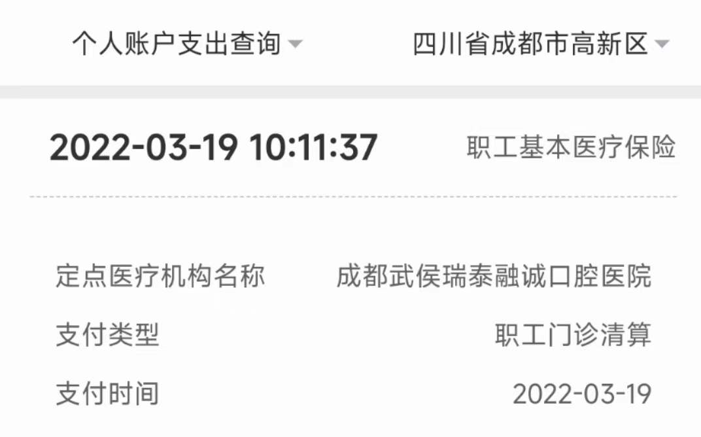

这次医生倒是说脱矿的原因主要是太经常用嘴呼吸，可乐虽然有影响但是比较有限。但还是尽量控制下少喝快乐水吧（难

十一月很怪，颞颌关节挂了几天。这个病可真是难瞧，华西口腔排号能排半年多，其他的很多医院压根没有关节科。回想起之前大半夜去北大口腔排队，关节科的号也是瞬间就没的那种。

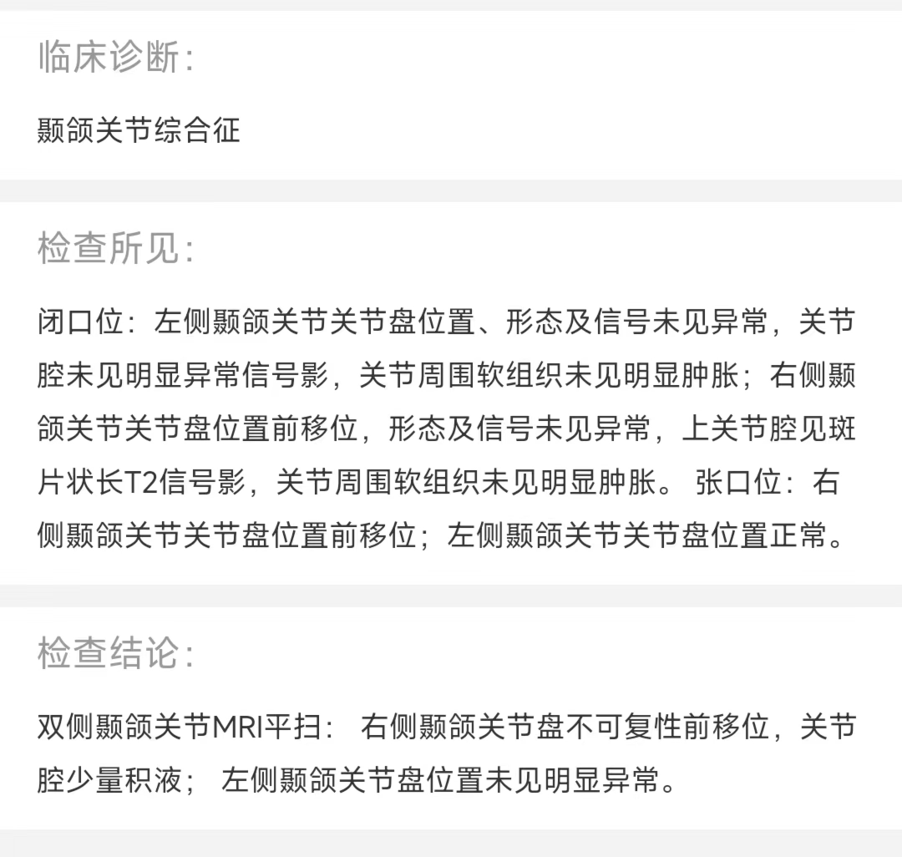

好在这个病属于自限性，放在草民自己身上，理疗了几天也就恢复到了之前那种有移位但是不疼、不影响关节正常功能的状态。

然后就是新冠了。十二月上旬刚宣布放开，没过几天草民便全家中招，烧了好几天。仅就草民自己来说，真的想不起来上次发烧 39 度是啥时候了，但这次真的是极为痛苦。而且刚开始几天抗原检测试剂根本抢不到，请假都难，还是跟同事乞讨了几个度过难关。

前后过了一个星期，全家症状基本消失，目前只剩草民自己目前还在咳嗽，可能还要再过一段时间才能完全恢复吧。今天看到四川疾控的公众号文章，初步问卷调查感染率超过 60%，看来这一波大概快要过去了，希望下一波晚点来，来了也不要跟这次一样痛苦。

# Enjoy Life

今年大部分的空闲时间基本上都用在收拾房子和转家居城了，再加上疫情影响，完全没有什么机会出门走一走。明年一定要补上。

遭遇了两次摇一摇。前面一次在公司 14 楼，当时整个楼都在上下晃。。。后一次封在家 5 楼，感觉比前面那次还猛，真的有点慌

|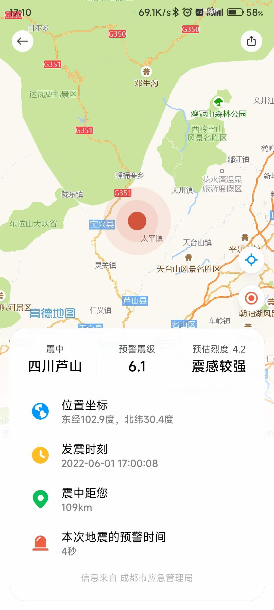 | 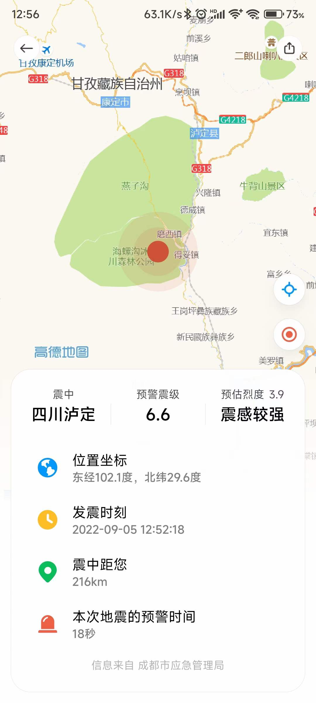|
|-|-|
| 2022.6.1 | 2022.9.5 |

今年成都的天气也着实有些反常，七八月份都没下多少雨导致严重缺电，甚至八月被迫节能（真·节能大厦

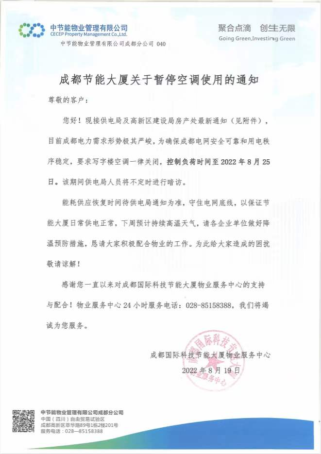

难得的比较开心的事情是见了几位大学室友，在当时那种不知道什么时候就会来一波封控的日子里实属难得。

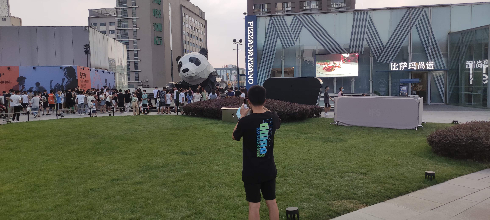

_头一次上到 IFS 顶上_

# Entertainment

因为上面提到的各种原因不能出去溜达，所以在家宅的事儿也多了起来（这跟在帝都的日子有啥区别啊

## 风起洛阳

奔着七娘的颜值去的（有一说一真的好看），最后看完感觉也真的不错


_这一幕深深的 emo 了_

## 弈

叔叔的年货（[BV1q34y1271d](https://www.bilibili.com/video/BV1q34y1271d)）之一，每年最期待的节目。今年是散装忘川 + SV 苍穹（和苍穹 AI），都是老熟人了（

真心觉得今年的命题作文，从各方面讲，都比之前水平更高，尤其立意，三位一体，着实无敌。

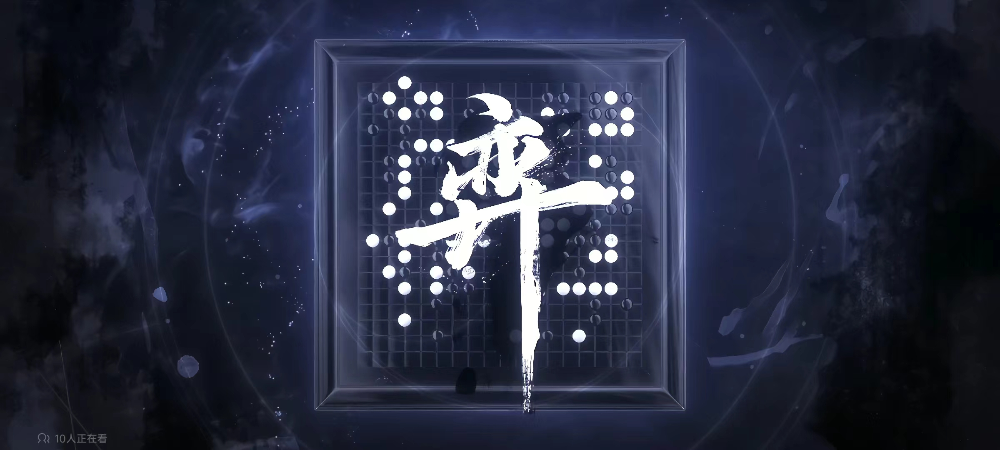

可惜这个播放量就是上不去。今年奶一口星尘 Infinity，再过三周见分晓

## 破事精英

从各方面来说，味儿都很正，尤其里面有太多老熟人了。


还没看完。年前事儿相对少一点，慢慢补。

## 规则类怪谈

年中迷上了这种特别的文体。

大部分人可能是从动物园接触到规则类怪谈的（草民也不例外），不过还是大洛山系列最让草民觉得印象深刻

[https://www.bilibili.com/read/readlist/rl518702](https://www.bilibili.com/read/readlist/rl518702)

虽然整个系列很长，但真的强烈推荐（会写就多写点嘛

## 新神话·杨戬

电影里面有些设定很有意思（比如一本正经念文言的合成语音广播），但整体个人觉得不如小青（

中间依然银临献唱，加上那段舞蹈，真是美翻了。十月份杭州有银临的 live，因为疫情关系没去成，相当可惜。

## 艺画三体依托答辩

懒得喷了，一图流。


今年还脑子一热买了《三体世界观》，啥破玩意儿，只想怒吼一声 RNM 退钱

## 一些其它专辑 / 周边

现在这年头用爱发电着实不容易，支持优秀创作者也是一种投票的方式（不说别的，总比 jntm 好吧（虽然偶尔还是会踩雷

今年收的新专辑：

* ChiliChill《每到夜里我就很饿》
* 少司命《摩天小楼》
* Hanser《一抹憨色》

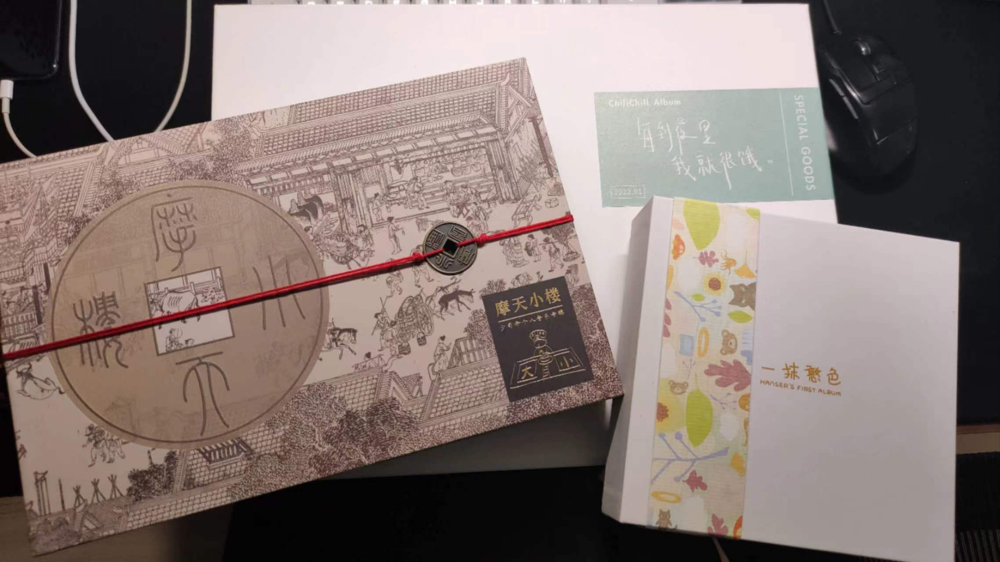

另外买了《成何体统》《有药》和《人匠》实体书，有一说一皇叔什么时候把人匠的坑填完啊（敲碗

还有今年最喜欢的周边之一，五维的几个小石头（2021 年就说好的赤羽大手办到现在还没个影子

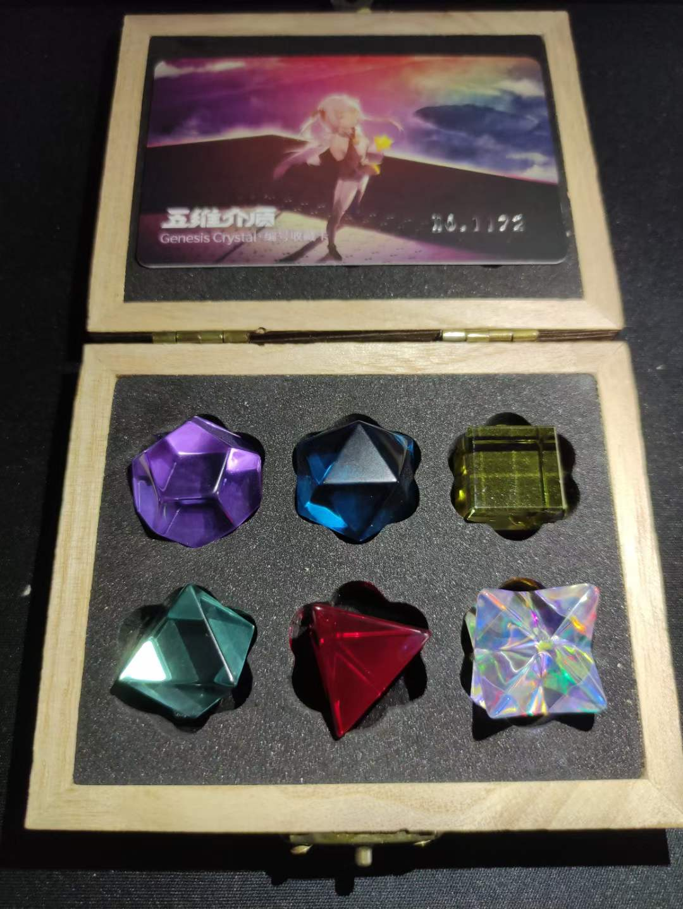

最后春意红包终于拼了！

# Gaming

痒痒鼠今天刚好签到 2250 天了！有一说一，每天求到的这个签还真有那么一点点准的（

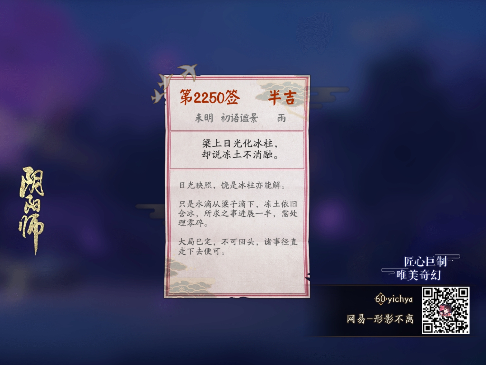

说到网易就不得不提辣鸡玻璃渣，再次怒吼 RNM 退钱（这个图梗太多了


今年买了 Switch，比去年稍微多玩了点游戏

* 马车，今年 DLC 加了几张新图，偶尔跑一把，很放松
* 星之卡比：探索发现，打了一周目然后没继续
* 塞尔达，稍微玩了一点发现这玩意儿就是个时间黑洞
* MC（草民也不知道为什么突然就在 Switch 上玩起了 MC

另外专门提几个比较有意思的。

一个很 Meta 的小品游戏 Terrorbane，真·在 Bug 里找游戏

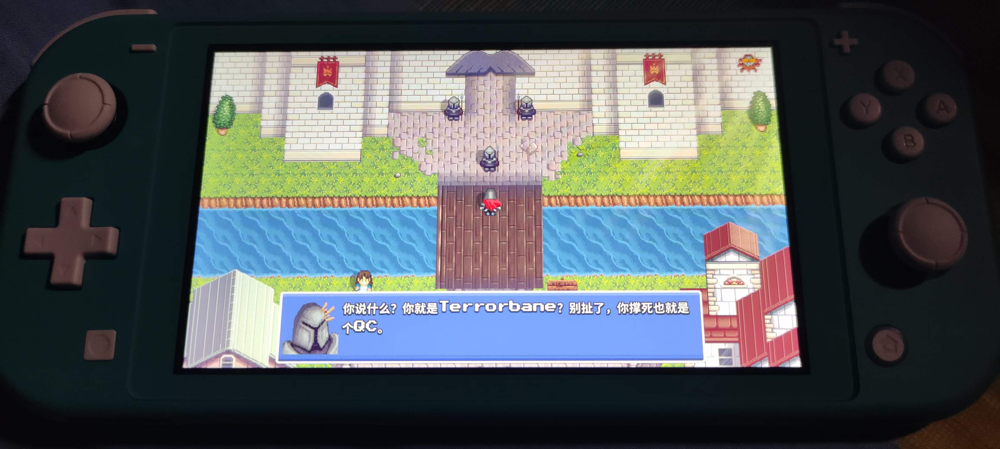

然后是期待已久的 P5R，虽然感觉第二学期最后那点剧情确实是有些强行造神了，导致之后节奏有些崩，但其他的部分真的很棒很棒


_这个梗后面在剧情里起码又出现了两次，每次看到都忍不住笑_

目前第三学期刚开始，后面应该还会开二周目认真搞 Cooperation

手办今年也到了不少，0617 / 彼岸花 / 说来就来的 42 姐

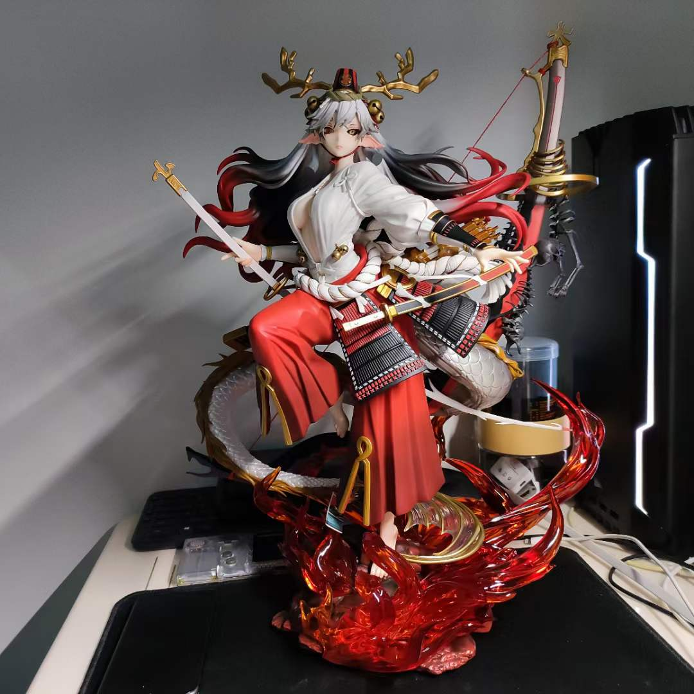

还有之前预定的仙四两把剑 1:1 模型也到货了。望舒是真的质感超好，羲和就稍微差点意思。现在十分头疼该放哪

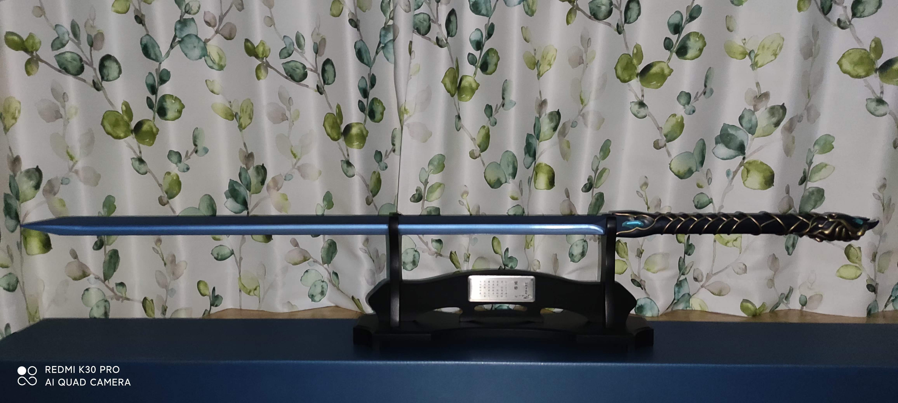

明年大概会找个时间回庄再拿点宅物过来（醒醒，还有七八个大手办在路上，再拿怕是真没地方放了

# Gadgets

今年填了 [Gadgets (2022)](../gadgets-2022/) ，虽然晚了一些。其他的还有

* [BROUNION R86S Experience](../r86s-experience/)
* [小米智能家居全家桶](../project-home-2/)

其他预计下次 Gadgets 会介绍的东西，目前手里攒的小玩意儿不多，到时候看情况：

* 光影猫（折腾中）
* 漫步者 HECATE GT4S（音质很拉，别的还行）
* Dev Kit 2023（毫不意外的吃灰了）

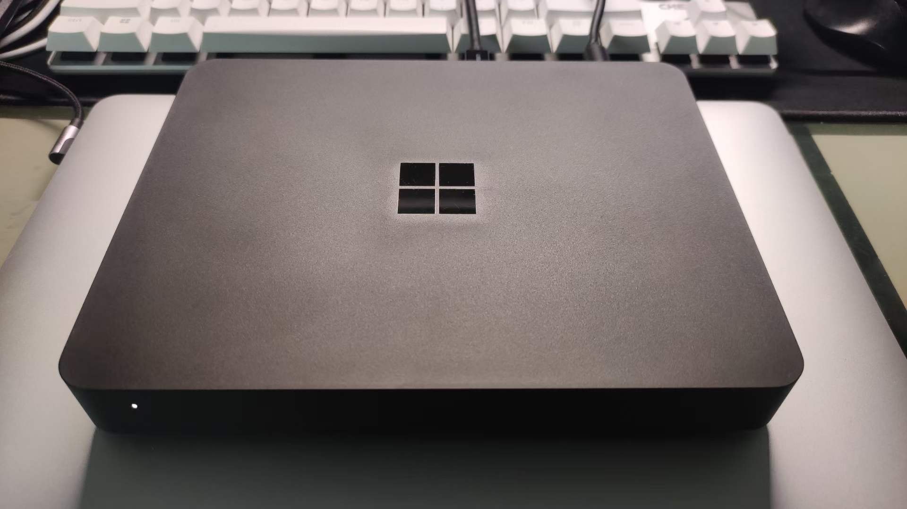

_这东西 WiFi 稳定性成谜，其他的倒是还行，虽然是 ARM64 设备，但是正常的 Windows 体验基本没啥问题。在考虑拿来干点重活试试_

# Projects

今年的空闲时间大头基本都花在房子上了，所以 Projects 今年开的坑并不多。

luci-app-xray 今年持续迭代，支持了 OpenWrt 新的防火墙实现 fw4 和脚本引擎 ucode（终于不用写 lua 了）。Star 数 150+ -> 280+


其他项目加起来凑够了 400+ Star，还凑合。

顺便，今年开始用 GitHub Projects 记录自己的一些 idea 和进行中的 Projects，这样能够很好保留那些突然跳出来的灵感。

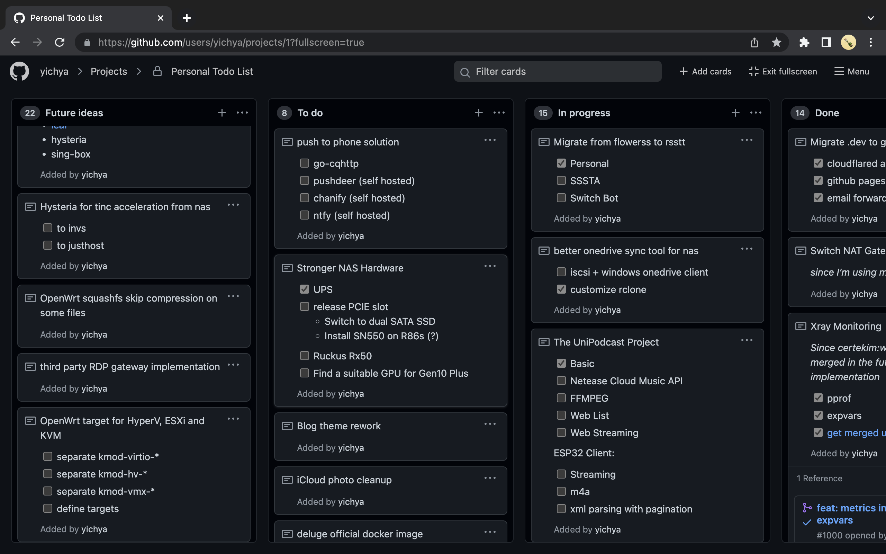

_这里面要填的坑着实还是挺多的_

## New Network

新家的网络在 [Project Home 2](../project-home-2/) 跟智能家居一起做了介绍，目前的体验还是很不错的。

## Real NAS Project

其实有写，但是一方面迭代不是很多（当然也不算少了，UPS、监控、Rootfs on ZFS 等等），另一方面今年杂事比较多，多少占据了些空闲时间。春节补上。

## Geodata Reader / xray-geodata-cut

方便查看和裁剪 GeoIP / GeoSite 的两个小工具。GeoData Reader 是用 [egui.rs](https://www.egui.rs/) 做的，顺便学了一丢丢 Rust，不过其实不值一提

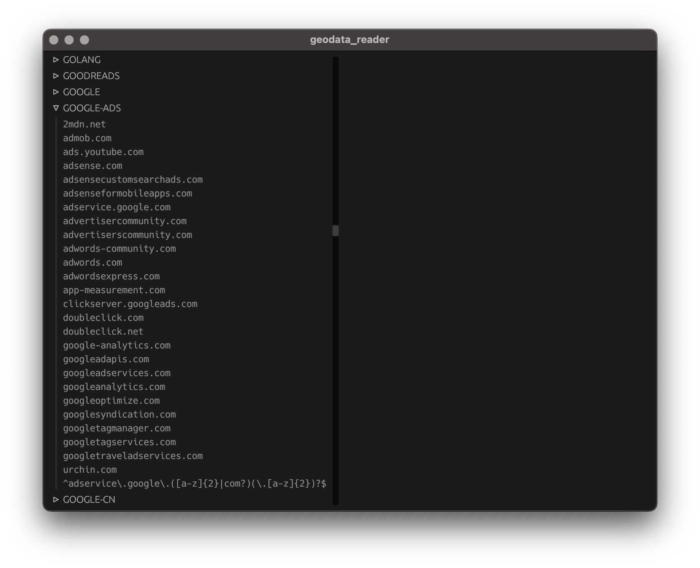

比较有意思的是它可以编译到 wasm，这样可以直接把它嵌在 LuCI 或者类似的地方，说不定这会是未来 Web 前端的一种新玩法（

## UniPodcast

其实是去年 Odroid Go MP3 Player 的延续。本来是想在设备上把所有的活都干完，但发现 ESP32 内存着实有点小，不得不整个服务端搭配工作。结果这玩意儿现在最大的作用是爬喜马拉雅的 RSS 并转发到 Telegram（

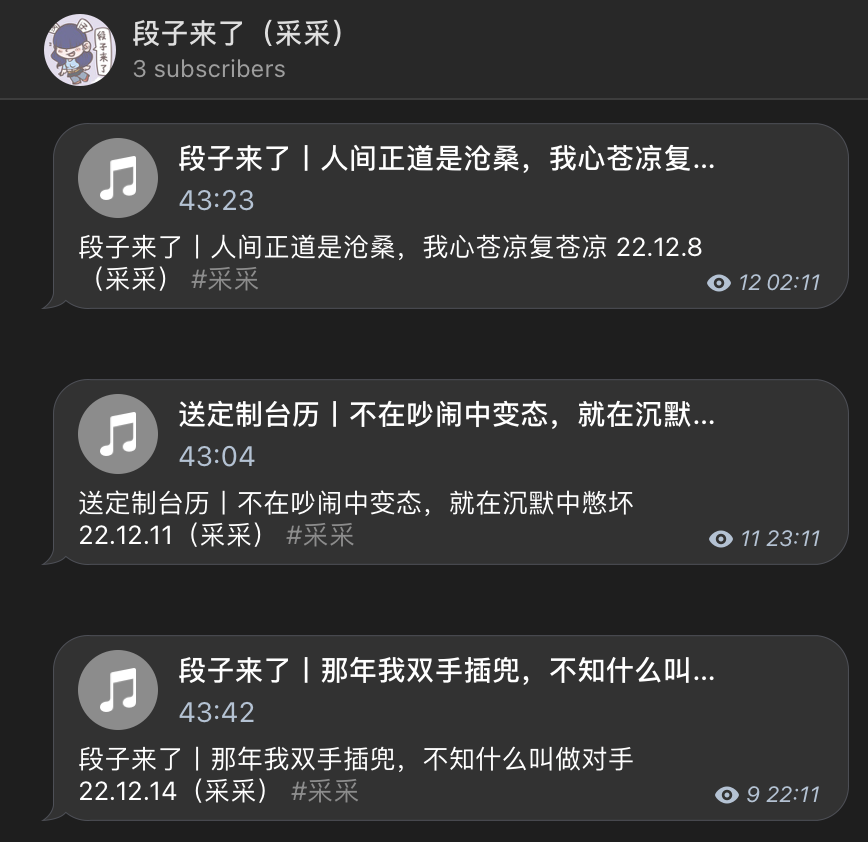

## Next

既然用起来 GitHub Projects 了，照着填坑就是。

* 上面提到的几个继续填
* 继续学 Rust，包括 OpenWrt 工具链、科学工具、GUI 框架等等都搞一搞
* 自建手机推送解决方案
* 等等。。。

# Finally

去年立的很多 flag 比如学车、耍弓箭、出去走走等，都翻车了。2023 年一定要补上。

那么新的一年许个愿：

* 主线：苟过经济周期，继续完成【逃离帝都】计划。
* 支线：
  * 完成学车。
  * 认真考虑一下保险相关的事情。
  * 耍弓箭的计划认真执行起来。
  * 按照重新制定了的 blog 更新计划，固定完成年度迭代与记录
  * 今年大部分时间花在了房子上，加上疫情管控，完全没怎么能出去走走。新的一年一定要多转转。

最后送上一首今年真的很喜欢的《流年如歌》，希望大家新的一年越来越好。

<iframe src="//player.bilibili.com/player.html?aid=94304902&bvid=BV1BE411p7oi&cid=161422087&page=1" scrolling="no" border="0" frameborder="no" framespacing="0" allowfullscreen="true" height="600px" width="100%"> </iframe>
