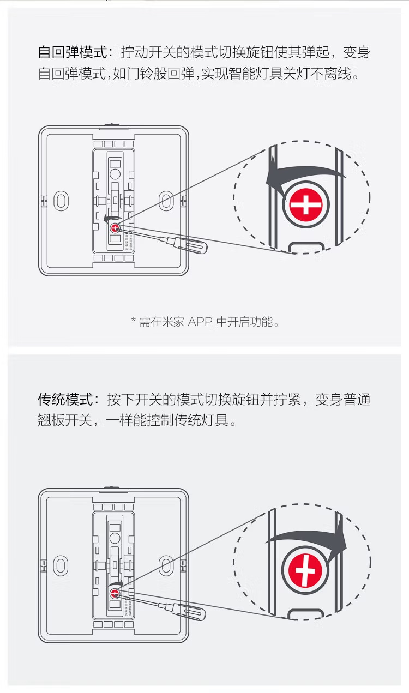

上次 Project Home 2 有提到用小米智能开关搭配 Yeelight 的智能灯体验比较差的问题，后来又交了些学费买来了几种不同的开关体验了一下，简单分享一点经验。

Yeelight 的灯可以用四种方式控制：

* 跟非智能灯一样用，直接通断电
* 接入小米智能家居生态控制
* 纯机械控制通断电的凌动™️开关
* Yeelight 自家的遥控器（或者长得虽然不像遥控器，但实际上是遥控器的一些东西）

直接通断电自然很容易理解。好处是简单稳定，坏处自然是断电之后没办法遥控开灯了，所以才会有其他的几种控制方式。

# 米家

Project Home 2 有介绍过，如果想要达到比较好的效果的话需要：

* 把智能开关转换成一个按钮，然后把按钮的单击事件跟灯的状态切换绑定
* 为了避免云端自动化出问题，再买一个本地中枢

然而，即使这些都做了，因为 Yeelight 的吸顶灯只能通过 WiFi 控制，如果遇上家里路由器挂了还是开不了灯。

# 凌动™️开关

这个开关其实完全是一个非常非常普通的机械开关，然后在下半部分加一个弹簧。按下开关下半部分之后松手，弹簧会直接把下半部分弹起来恢复到上半部分按下的状态，实际把它变成一个按钮。

这个功能可以通过里面的一个小螺丝切换。

至于它控制智能灯的原理其实非常简单：灯里面用一个小电容之类，维持主控工作一小段时间，在这段时间内一次通断电视为对灯的状态切换。因为它实际的工作逻辑都在灯里面，所以也就只有支持这个功能的灯才能搭配这种开关使用。

一般按开关的时间也就几十到几百毫秒，Yeelight 的主控个人实测大约可以维持 3 秒左右。超过这个时间主控就寄了，再恢复通电的话灯会无条件亮起来。

这个功能默认不开启，需要在米家里面点一下。米家 UI 里面的这个梗过不去了（

以及，狗东自营那种最便宜的凌动™️开关（就是上面图上那种）大概到手三十来块钱一个，但说实话这个开关很拉，主要体现为机械结构碰撞的声音非常大，草民不太推荐。狗东还有些什么超薄款的，草民没有买，需要的话自行尝试。

# 遥控器

这个就没啥好说的了，遥控器用的是蓝牙 4.2 不过是私有协议。

好处是十分稳定，不会有那种家里断网了就没法关灯的问题；坏处主要是没有任何定制空间，比如不能自定义按钮功能，也不能联动其他的传感器之类。当然，其实遥控器最大的麻烦还是容易随手往哪儿一扔就找不到了。

# 智能调光开关

Yeelight 的这个智能调光开关分两种形态，一种是 86 盒那样直接装到墙上，以及另一种贴装的，功能基本一样。

就跟产品宣传图说的一样：这玩意儿看起来像个智能开关，但实际上是个遥控器，跟米家那种智能开关有本质区别：

* 它并不能在米家里面单独作为一个设备接入，只是挂在某个灯下面的一个遥控器
* 它的 86 盒版并不能远程控制电路通断，只是用来取电给前面的旋钮部分

当然 86 盒版下面有一个物理开关可以直接整个断电，偶尔需要重启 / 重置智能灯的时候用起来也挺方便。至于贴装版，就完全是一个换了换样子的遥控器，里面是装了一个跟遥控器里面一样的 CR2032 纽扣电池的。

既然是遥控器，遥控器的好处自然是都有，而且固定安装的话也不会有不知道扔到哪儿去了的问题，但是功能无法自定义的问题自然也保留了下来，比如草民的灯并没有调颜色的功能，这个开关的【长按】事件就等于无效了。

目前草民自己是把两个卧室的灯都换成了这种调光开关，客厅因为有遥控器所以是用凌动™️开关。这个调光开关的做工、手感之类都还可以，草民比较推荐。

# 再插播一点新家网络相关

之前一直是乱糟糟一大坨所以没晒图。趁周末认真收拾了下，目前看起来很清爽（因为大部分线都藏到下面去了

* 上面
  * 上任房主留下来的辣鸡海信电视，没来得及换，之后处理掉
  * 右边竖起来两根小天线的 R86S，放在外面是为了方便维护 & 接无线键鼠的接收器
* 中间
  * hap ac2
  * HPE Microserver Gen10 Plus，以及它上面是电信的 IPTV 机顶盒
  * 电信的光猫
* 底下
  * Gen10 Plus 的电源
  * UPS

Real NAS Project 2 的坑还在慢慢填，春节一定补上（
