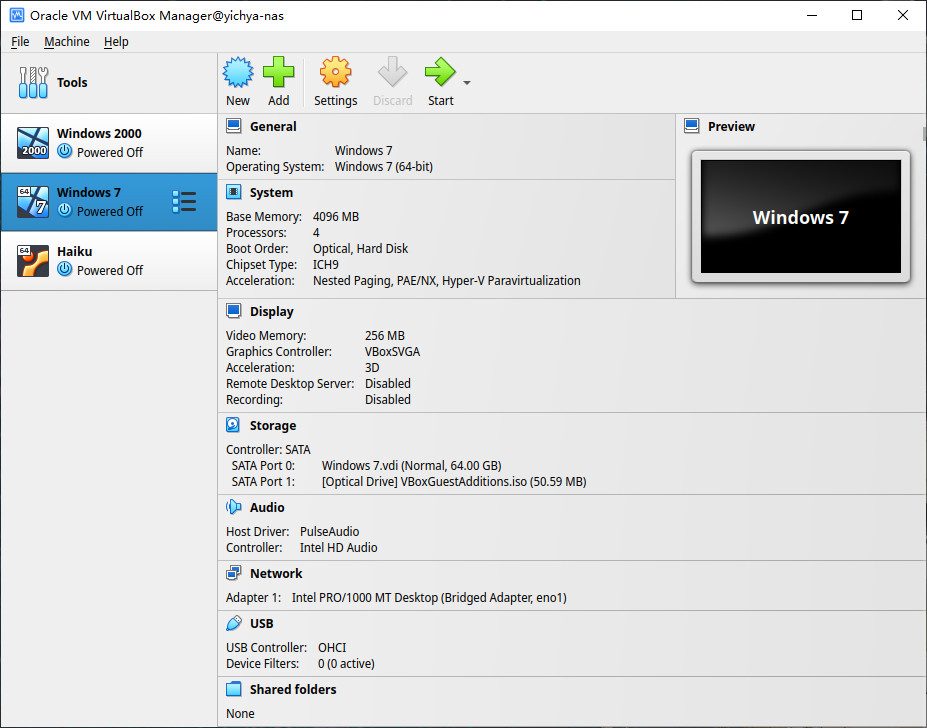

时隔一年半，继续填 Real NAS Project 的坑。

这次涉及到的内容就会比较零散了，会分别对不同的几个点进行简单介绍。

# New Setup

这一年半发生的事情比较多，期间整套设备从帝都搬到成都，在成都从租的房子搬到买的房子，宽带运营商、接入设备都有更换，也添置了一些设备，使得网络结构等都发生了不小的变化。当然之前也有部分提到过。

[Project Home 2](../project-home-2) 最后有提到后面会补电视柜那里的细节。其实 [Project Home 3](../project-home-3) 结尾有简单介绍，因为确实感觉很不错所以再晒一下。


具体的网络结构、设备等可以参考上面两个链接中的内容。

# R86S Wireless Upgrade

之前 [BROUNION R86S Experience](../r86s-experience/) 里面有提到要再尝试几张卡，这里也简单提一下。

## MT7922

买了 MT7922，但是只能说这钱浪费了。

> 也叫 AMD RZ616，比 RZ608 多了 160MHz

实际买到的卡在 OpenWrt 里面就显示成 Generic MAC80211，并不像 RZ608 那样会显示成 AMD RZ616，蓝牙驱动装上之后 Windows 里面显示的蓝牙控制器名字也是 MediaTek 啥的，不确定它跟 RZ616 是不是完全一样的产品。

> 这张卡在 linux-firmware 里面是跟 mt7921 分开的，所以硬件上应该也不完全一样

买它其实主要是期望它可能会在硬件上解决一些 MT7921 / MT7921K 不稳定的问题啥的，实际用下来，最严重的问题是 MT7922 对 PCIE Passthrough 非常不友好，表现为虚拟机重启的话，它这个 PCIE 设备就直接没了，然后必须重启物理机才能使用。像草民这种经常升级 OpenWrt 的场景，升级完虚拟机自动重启，然后 Hyper-V 找不到网卡直接拒绝启动虚拟机，宿主机直接断网得手动重启了，这一个问题就基本排除了拿它日常使用的可行性。

这张卡在它短暂的使用过程中的其他表现跟 MT7921K 基本上没区别，Ping 同样不稳定，吞吐量也基本上是一样的。至于 Timeout 的问题，在上面那个更严重的问题面前没有办法让它运行足够长的时间来确认。它比起 MT7921K 唯一多出来的 160MHz 之前也提到对环境要求严格，基本没有太大意义。

这张卡比烂大街的 MT7921K 还要贵上个几十块钱，结论是完全不值得考虑。

## QCA6391

去年大概年底 OpenWrt 官方支持了 ath11k，年前试了一下，很惊喜的发现 QCA6391 能用了！！！使用的方式依然是跟之前一样通过 Hyper-V 做 PCIE Passthrough，但这次非常顺利，没有遇到任何问题，着实令人十分意外。


手头这张卡有点奇怪的是无论用哪个信道，发射功率只能设置到 21 dBm，不过它没有 MT7921 那个奇怪的 36 - 48 也要 DFS 的问题，即使设置了需要 DFS 的 48 - 64 信道也可以正常花一分钟时间完成 DFS，当然感觉没啥必要，所以还是按之前的习惯设置到 149 - 161 信道。


试用了几天，目前感觉 Ping 延迟比之前明显要好，但吞吐量有所降低。暂时没有遇到 MT7921 时有发生的整个无线失去响应的现象，也不需要那个延迟启动 WiFi 的 hack，所以说尽量不要碰联发科，会变得不幸。


对比之前 MT7921 的监控（10.32.15.186），可以看到 MT7921 即使是在没有出现原因不明的离谱延迟时，仍然有非常严重的毛刺，但 QCA6391 基本保持平稳，维持在 5ms 上下。


说到离谱延迟，在 QCA6391 上也会有一样的现象，个人目前倾向于认为是 M1 MacBook Pro 的 Broadcom WiFi 有什么节能模式之类的。

因为 QCA6391 测试结果不错，又买了高通家支持 WiFi6E 和 160MHz 的 WCN685x，但大概要下个月才能送过来了，到时候会再做测试。另外补充一点：Qualcomm 的这一代卡跟 MediaTek、Intel 一样都自带了蓝牙，但在有些卡上蓝牙似乎不走 USB，而是走 UART 的（比如草民这张卡就是），这种驱动起来可能会十分困难，甚至可能就没戏，如果对蓝牙有强烈需求的话需要仔细询问、考虑清楚。

# Root on ZFS

之前 Manjaro 是装在 NVMe 固态上的，后来突然想干脆把整个系统盘也挪到 ZFS 上吧。这么干主要是出于几个考虑：

* ZFS 开机先占个一半内存做缓存，这部分还不是跟其他文件系统共享的，多少有些浪费
* 系统盘没有冗余，万一寄了整起来有点麻烦
* 虽然 ZFS 数据都在机械盘上，但现在有 L2ARC 了，把系统盘直接挪上去也应该不会慢多少

当然实际弄完之后发现慢得多，有一点点后悔。回头加点钱整一下 special metadata device 的活。

## Data Migration

现在肯定都用 UEFI 启动了，所以至少还需要一个 FAT32 分区用来做 EFI System Partition 并且还要把 GRUB2 装进去，这里我们简单起见就是 /boot，以及为了省事儿，把内核和 initrd 也直接放到 /boot 里面，整个 /boot 是不会挪到 ZFS 上的。这部分启动完之后就用不到了，平时也几乎不会改到，不用 ZFS 也无所谓。

```
yichya@yichya-nas /boot> ls -al
total 231313
drwxr-xr-x  5 root root     4096 Jan  1  1970 ./
drwxr-xr-x 21 root root       29 Nov  2 17:14 ../
drwxr-xr-x  3 root root      512 Jan  1  1970 efi/
drwxr-xr-x  6 root root     4096 Jan 24 23:59 grub/
-rwxr-xr-x  1 root root 64812588 Jan 24 23:58 initramfs-5.15-x86_64-fallback.img*
-rwxr-xr-x  1 root root 39041844 Jan 24 23:58 initramfs-5.15-x86_64.img*
-rwxr-xr-x  1 root root 67339813 Jan 24 23:58 initramfs-6.1-x86_64-fallback.img*
-rwxr-xr-x  1 root root 37888134 Jan 24 23:58 initramfs-6.1-x86_64.img*
-rwxr-xr-x  1 root root  5678080 Nov  9 03:02 intel-ucode.img*
-rwxr-xr-x  1 root root       22 Jan 19 04:36 linux515-x86_64.kver*
-rwxr-xr-x  1 root root       20 Jan 19 04:36 linux61-x86_64.kver*
drwxr-xr-x  2 root root     4096 Jan 24 23:56 memtest86+/
-rwxr-xr-x  1 root root 10800032 Jan 24 23:57 vmlinuz-5.15-x86_64*
-rwxr-xr-x  1 root root 11258560 Jan 24 23:57 vmlinuz-6.1-x86_64*
```

剩下的都要从原来的文件系统里面复制出来。跨文件系统挪数据也没什么好办法，所以就建一个 dataset（类似于 btrfs 的 subvolume），然后在一个稳定的环境下（肯定不能挪正在运行的操作系统吧，随便找个 Live 系统，带 ZFS 的就行了）直接 `rsync -av`，当然对于 podman 之类会利用文件系统特性的应用，需要使用它们的 export 和 import，不能直接 rsync

比如草民的 pool 叫 `opt`（为了自动挂在 `/opt` 上，省事儿），数据挪完之后新的 dataset 叫 `opt/Root`，顺便可以把 `/home` 之类的也建好单独的 dataset，这个看个人需求，之后搞也行。

```
yichya@yichya-nas ~> zfs list -d 1
NAME             USED  AVAIL     REFER  MOUNTPOINT
opt             5.42T  5.36T     3.07G  /opt
opt/Containers  2.46G  9.68G     7.79M  /var/lib/containers
opt/Critical    58.3G   967G     58.2G  /mnt/Critical
opt/Home        69.6G  58.4G     63.9G  /home
opt/Private      559G   520G      505G  /mnt/Private
opt/Public      4.69T  5.36T     4.54T  /mnt/Public
opt/Root        54.2G  9.81G     32.0G  /new_root
```

## Boot from ZFS Root

挪文件系统很简单，从挪过去的文件系统上启动才是个麻烦事。

### initrd

ZFS on Root 依赖的一个很关键的部分就是它实际上是把 ZFS 需要的内核模块都打在了 initrd 里面，以此绕过 CDDL 那个不能跟内核链接到一起的要求。虽然这样做是否违反 CDDL 还有待商榷，不过目前大多数发行版都在干这种事儿，其中甚至包括 TrueNAS Scale 这种会卖商业授权的发行版。

Manjaro 下面需要先更新 `/etc/mkinitcpio.conf` 加上 zfs hook，注意放在 block 后面和 filesystems 前面

```conf
HOOKS="base udev autodetect modconf block keyboard keymap zfs filesystems"
```

然后 `sudo mkinitcpio -P` 更新一下 initrd 就行了。因为 GRUB 跟内核没有放在 ZFS 上，所以不需要改变 GRUB 的模块设置。

### Update zfs.cache

做完上一步之后，先重启进 emergency 模式，方法是临时改 GRUB 启动参数。

* 开机，自检快结束的时候狂按 ESC
* 看见 GRUB 菜单之后按 E 修改第一行
* 把内核启动命令行上的 `root=<any>` 删掉
* 按 F10 启动，等待 shell 出现

shell 出来之后手动 import zpool 并把 rootfs 挂到 `/new_root`，如果打算给 zpool 改名也可以在这个时候操作（比如草民其实是在这里把 zpool 的名字从 nas 改成的 opt）

```bash
zfs import nas opt
zfs set canmount=noauto opt/Root
zfs set mountpoint=/new_root opt/Root
```

挂好了之后按下 Ctrl + D 退出 shell，然后系统应该会正常在新的 dataset 上启动。

启动完成后强制更新一下 zfs.cache，然后再更新一下 initrd

```bash
sudo zpool set cachefile=/etc/zfs/zpool.cache opt
sudo mkinitcpio -P
```

然后再按下面的步骤更新一下 GRUB 配置

### GRUB

GRUB 识别 rootfs 的脚本在 zpool 由好几个设备组成的情况下有 bug，因此要改一下 `/etc/grub.d/10_linux`，才能正确拼上 root 参数。

```diff
--- a/etc/grub.d/10_linux
+++ b/etc/grub.d/10_linux
@@ -72,261 +76,17 @@
 	    GRUB_CMDLINE_LINUX="rootflags=subvol=${rootsubvol} ${GRUB_CMDLINE_LINUX}"
 	fi;;
     xzfs)
-	rpool=`${grub_probe} --device ${GRUB_DEVICE} --target=fs_label 2>/dev/null || true`
+	for rpooldev in ${GRUB_DEVICE}; do
+	    rpool=`zdb -l ${rpooldev} | grep " name:" | cut -d\' -f2`
+	    if [ ! -z ${rpool} ] ; then
+	        break
+	    fi
+	done
 	bootfs="`make_system_path_relative_to_its_root / | sed -e "s,@$,,"`"
 	LINUX_ROOT_DEVICE="ZFS=${rpool}${bootfs%/}"
 	;;
 esac
```

改完之后 `sudo update-grub` 更新配置，并检查一下 `/boot/grub/grub.cfg` 里内核命令行上的对应参数 `root=ZFS=opt/Root`，确认都正确之后重启，然后就可以把旧的系统盘清理掉了。

最后因为这个 grub.d 脚本会随 GRUB 更新，因此每次 `pacman -Syyuu` 之后也都需要检查一下 `/boot/grub/grub.cfg` 看看 zpool 是否还在，如果不在了的话就还得修改这个脚本文件并且重新更新 GRUB 的配置。

# Other ZFS Related Things

日常使用过程中还对 ZFS 做了一些小调整，其中包括一次误操作导致不得不整个重建 zpool，实惨

## ZIL SLOG

ZFS 除了 L2ARC 这种外部读缓存之外，还有 SLOG 这种延缓写入的能力。之前没开主要是因为没有 UPS，如果断电的话这部分写入可能会有问题。后来买了 UPS 就开了，但实际用下来发现没球用，尤其对草民这种除了编译 OpenWrt 和拖北邮人之外基本没什么持续写入的场景，真的是完全没用。目前似乎唯一真的用得上的情况是虚拟机磁盘的写入（装了 VirtualBox 之后发现的，KVM 不晓得）会真的用得上 SLOG

```
NAME          SIZE  ALLOC   FREE  CKPOINT  EXPANDSZ   FRAG    CAP  DEDUP    HEALTH  ALTROOT
opt          10.9T  4.91T  5.99T        -         -     3%    45%  1.00x    ONLINE  -
  mirror-0   10.9T  4.91T  5.99T        -         -     3%  45.0%      -    ONLINE
    sda          -      -      -        -         -      -      -      -    ONLINE
    sdb          -      -      -        -         -      -      -      -    ONLINE
logs             -      -      -        -         -      -      -      -  -
  nvme0n1p3     8G  1.47M  8.00G        -         -     0%  0.01%      -    ONLINE
cache            -      -      -        -         -      -      -      -  -
  nvme0n1p4   456G   406G  50.2G        -         -     0%  89.0%      -    ONLINE
```

分了 8G+，日常占用几 MB，还要为此冒丢掉这几 MB 数据的风险（虽然有 UPS 了这个风险很小，而且就算丢了也没啥影响），感觉其实没啥意义。

## Weekly scrub

OpenZFS 2.1.4 开始直接提供 `zfs-scrub-weekly@.timer` 等几个 systemd 定时器，可以简单通过 `systemctl enable zfs-scrub-weekly@opt.timer` 这样的方式增加一个每周 scrub 一次的定时任务。

```bash
> sudo systemctl status zfs-scrub-weekly@opt.timer
● zfs-scrub-weekly@opt.timer - Weekly zpool scrub timer for opt
     Loaded: loaded (/usr/lib/systemd/system/zfs-scrub-weekly@.timer; enabled; preset: disabled)
     Active: active (waiting) since Mon 2022-08-29 19:12:46 CST; 3 days ago
      Until: Mon 2022-08-29 19:12:46 CST; 3 days ago
    Trigger: Mon 2022-09-05 00:45:42 CST; 2 days left
   Triggers: ● zfs-scrub@opt.service
       Docs: man:zpool-scrub(8)

Notice: journal has been rotated since unit was started, output may be incomplete.
```

定期 scrub 还是很关键的，比如加拿大白嫖王就翻了个大车（

## Special Device

ZFS 支持把一部分数据专门放在额外的速度更快的设备上加速访问。

> Special Allocation Class
> 
> The allocations in the special class are dedicated to specific block types. By default this includes all metadata, the indirect blocks of user data, and any deduplication tables. The class can also be provisioned to accept small file blocks.

草民简单尝试了一下，把 Metadata 和小文件放在 SSD 上加速存取确实有用，而且确实是十分明显能感受到。但是这个草民还没折腾清楚，中途没有留意 Special 设备的一些重点注意事项，结果导致 Special 设备没有冗余而且摘不下来了，最终是直接重建了整个 zpool，花了很长时间。这部分等过段时间加点钱准备两块 SSD 再整吧，细节也就留作下次介绍，这里只提几点

* 建 zpool 的时候一定手动设置 `ashift=12`，尤其是在机械硬盘上初始化 zpool 的时候，不然加 Special 能加，删就删不掉了
* Special Device 是 pool 不可缺少的组成部分，比 L2ARC 或者 ZIL SLOG 重要得多，挂了的话整个 pool 就废了，必须考虑硬件冗余

# UPS

未雨绸缪的必备品（当然对草民来说多少有点亡羊补牢的感觉）

> 某天中午无通知停电一个小时，完后 `zfs scrub` 跑了一天。

买的是狗东上比较热门的 SANTAK TG-BOX 850，其实主要是看中它插孔比较多，不用再在上面接一个插线板，显得稍微整齐一点


可以用 USB 跟它通信，然后装个软件就可以看到状态了，草民选的是 apcupsd

> 这台机器相对低端，apcupsd 能看到的数据很少，基本上只有容量、负载、剩余时间是比较有用的，电压和功率之类的都没有。平时负载 10% 能撑 40 分钟，编译 OpenWrt 之类拉高负载之后会到 20% - 25% 左右，完全够用。

一月初又遇上了一天内两次停电，好在完全不慌：

* 第一次电池稳稳撑了半个多小时然后正常关机，看了日志确认是走完了整个正常关机的流程
* 第二次电池还没充满又停电了，只撑了十五分钟

```
yichya@yichya-nas ~> sudo journalctl -u apcupsd -S "2023-01-11 11:00:00"
Jan 11 11:29:43 yichya-nas apcupsd[3026]: Power failure.
Jan 11 11:29:49 yichya-nas apcupsd[3026]: Running on UPS batteries.
Jan 11 11:29:50 yichya-nas apcupsd[1872581]: mail: Cannot start /usr/sbin/sendmail: executable not found (adjust *mta* variable)
Jan 11 11:29:50 yichya-nas apcupsd[1872581]: /root/dead.letter 41/999
Jan 11 11:29:50 yichya-nas apcupsd[1872581]: mail: ... message not sent
Jan 11 12:05:53 yichya-nas apcupsd[3026]: Battery power exhausted.
Jan 11 12:05:53 yichya-nas apcupsd[3026]: Initiating system shutdown!
Jan 11 12:05:53 yichya-nas apcupsd[3026]: User logins prohibited
Jan 11 12:05:53 yichya-nas systemd[1]: Stopping APC UPS Power Control Daemon for Linux...
Jan 11 12:05:53 yichya-nas apcupsd[3026]: apcupsd exiting, signal 15
Jan 11 12:05:53 yichya-nas apcupsd[3026]: apcupsd shutdown succeeded
Jan 11 12:05:54 yichya-nas systemd[1]: apcupsd.service: Deactivated successfully.
Jan 11 12:05:54 yichya-nas systemd[1]: Stopped APC UPS Power Control Daemon for Linux.
Jan 11 12:05:54 yichya-nas systemd[1]: apcupsd.service: Consumed 35.515s CPU time.
-- Boot be39038bd9534c1fb8e6d45974be00a4 --
Jan 11 14:05:17 yichya-nas systemd[1]: Starting APC UPS Power Control Daemon for Linux...
Jan 11 14:05:17 yichya-nas systemd[1]: Started APC UPS Power Control Daemon for Linux.
Jan 11 14:05:17 yichya-nas apcupsd[2736]: apcupsd 3.14.14 (31 May 2016) unknown startup succeeded
Jan 11 14:05:17 yichya-nas apcupsd[2736]: NIS server startup succeeded
Jan 11 17:16:27 yichya-nas apcupsd[2736]: Power failure.
Jan 11 17:16:33 yichya-nas apcupsd[2736]: Running on UPS batteries.
Jan 11 17:16:33 yichya-nas apcupsd[817393]: mail: Cannot start /usr/sbin/sendmail: executable not found (adjust *mta* variable)
Jan 11 17:16:33 yichya-nas apcupsd[817393]: /root/dead.letter 41/999
Jan 11 17:16:33 yichya-nas apcupsd[817393]: mail: ... message not sent
Jan 11 17:30:32 yichya-nas apcupsd[2736]: Battery power exhausted.
Jan 11 17:30:32 yichya-nas apcupsd[2736]: Initiating system shutdown!
Jan 11 17:30:32 yichya-nas apcupsd[2736]: User logins prohibited
Jan 11 17:30:33 yichya-nas apcupsd[2736]: apcupsd exiting, signal 15
Jan 11 17:30:33 yichya-nas apcupsd[2736]: apcupsd shutdown succeeded
Jan 11 17:30:33 yichya-nas systemd[1]: Stopping APC UPS Power Control Daemon for Linux...
Jan 11 17:30:34 yichya-nas systemd[1]: apcupsd.service: Deactivated successfully.
Jan 11 17:30:34 yichya-nas systemd[1]: Stopped APC UPS Power Control Daemon for Linux.
Jan 11 17:30:34 yichya-nas systemd[1]: apcupsd.service: Consumed 1.328s CPU time.
-- Boot 05edf4c49a5e43ccaccc1a1dd23c6ff7 --
Jan 11 17:52:05 yichya-nas systemd[1]: Starting APC UPS Power Control Daemon for Linux...
Jan 11 17:52:05 yichya-nas systemd[1]: Started APC UPS Power Control Daemon for Linux.
Jan 11 17:52:05 yichya-nas apcupsd[3037]: apcupsd 3.14.14 (31 May 2016) unknown startup succeeded
Jan 11 17:52:05 yichya-nas apcupsd[3037]: NIS server startup succeeded
```

## Synchronize over network

同样接在 UPS 上的还有 R86s，装一个 Windows 版的 apcupsd 然后简单配置一下通过局域网连接 UPS 就行了。当然注意把网络设备（草民这里是 hap ac2）也接到 UPS 上，不然肯定是没法同步状态的。


一般来说宽带接入设备就不需要了，毕竟停电这种事儿，小区里面的运营商设备说不定凉的更早（上面那两次，看日志里面在 UPS 状态切换之前一两分钟很多 RSS bot 之类的请求都超时了，大概率是这样的）

# New Apps

这段时间把 RSS Bot 从 flowerss 换成了 [https://github.com/Rongronggg9/RSS-to-Telegram-Bot](https://github.com/Rongronggg9/RSS-to-Telegram-Bot)，感觉更好用一些。

除此之外还有下面几个新服务

## Jenkins

这个应该很多人用过了，拿来

* 编译 OpenWrt 顺便 sysupgrade
* 定时任务（rclone 用来同步 Onedrive，以及之前简单介绍过的 UniPodcast）

建议在容器里面跑 Jenkins 本体，然后用 ssh 连到宿主机上跑 worker，方便升级什么的。


槽点主要在于内存占用过于离谱了。。。本体扔着不管一段时间能直接干到 13G+，worker 也能干出 1G+


咱也不知道是 JRE 的问题还是啥，不设置 -Xmx 就使劲儿往上吃，无论是本体还是 worker 都把内存当饭吃

## netdata

很方便的监控，主要用来 fping 以及盯 ups 的状态。前面也出现过很多次了。


目前个人用 v1.35.1，因为 v1.36 开始加入了一个非常显眼而且关不掉的广告。。。为了方便控制版本，比较建议整个跑在容器里面，当然需要 `--privileged`，还需要把宿主机上的一些目录挂进容器。

```
sudo podman run -d --name=netdata \
                    -p 19999:19999 \
                    -v /opt/persistent/netdata/etc:/etc/netdata \
                    -v /opt/persistent/netdata/lib:/var/lib/netdata \
                    -v /opt/persistent/netdata/cache:/var/cache/netdata \
                    -v /etc/passwd:/host/etc/passwd:ro \
                    -v /etc/group:/host/etc/group:ro \
                    -v /proc:/host/proc:ro \
                    -v /sys:/host/sys:ro \
                    -v /etc/os-release:/host/etc/os-release:ro \
                    --restart always \
                    --privileged --log-driver journald \
                docker.io/netdata/netdata:v1.35.1
```

而且即使这样做了，有些比如磁盘剩余空间之类的也是看不到的，这个就是容器文件系统隔离的限制了。

netdata 比起自己搭一套 prometheus + grafana + node-exporter 之类的要方便很多，而且自带一个云，还不要钱，当然它自然也是有广告、不那么灵活、不好配置报警啥的，看个人需求，homelab 的话其实 netdata 完全足够了。

## VirtualBox & UI

因为 KVM 的网络和显卡都不是很好使，还动不动就装个 dnsmasq 接管服务器的所有域名解析请求，很是让人心烦。干脆装了个 VirtualBox，然后发现用起来还不错，而且 Windows 7 可以开 Aero（后来某次版本更新之后又不能开了，迷）



目前遇到的最大的问题是 X Forwarding 太卡了。。。

# Next

Real NAS Project 目前感觉基本上趋于稳定了，草民目前的需求暂时不觉得会再有什么很大的调整。

下一篇应该是个人工作区（或者包括整个主卧）的介绍，不过目前还没有完全折腾完，估计起码三月份见了 hhh
