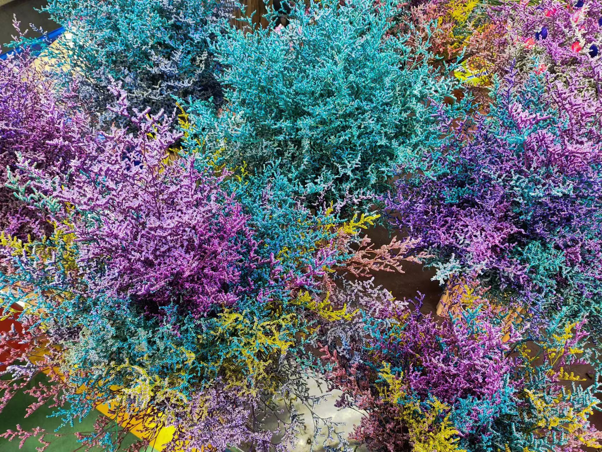
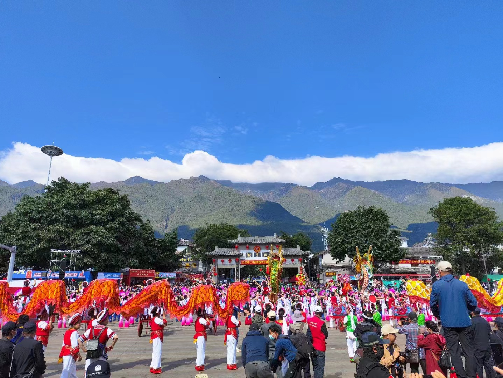
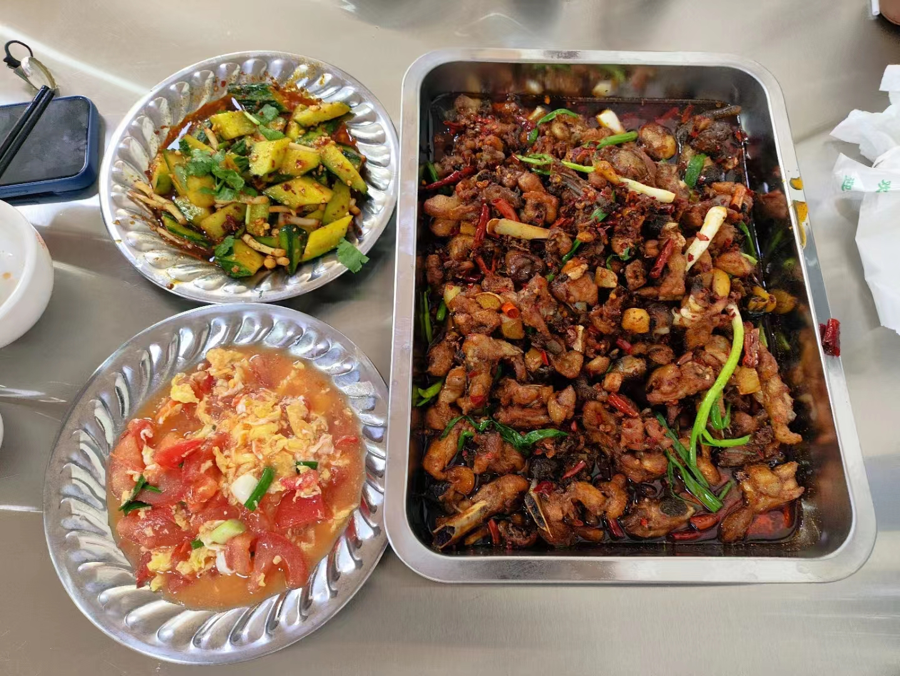

时隔两年又整了个大的出去玩的活。这个记录是在丽江的客栈天台上开始写的（然后在家慢慢补完）

今年五一假期是 4.29 - 5.3 嘛。本来草民是打算按之前的操作一样前面请两天假、后面在家休息一天半左右的节奏来安排，结果两个大佬订了 4.30 晚上的飞机（回来的时候才知道是因为有那种巨便宜的捡漏机会，帝都到昆明不算燃油和机场建设才不到二百块，路程是草民近三倍的同时总价才是草民的不到一半，属实是酸了），而且还打算 5.7 回去。想想也确实，这两年各种事情比较多，好久没整大的了不如狠狠浪一波，干脆同步一下行程安排，4.30 一早前往昆明。

# 猛追湾

说来很巧，草民恰好有个两年半（警觉）没见的前同事 4.29 从深圳跑来成都玩，住在牛王庙那边，真是差一点就错过了。于是顺便过去那边约了个饭。

猛追湾之前没去过，去了发现算是个网红打卡点吧（成华区这种地方蛮多的），人挺多。恰了好久没吃的竹涟（前同事视角，图上是草民）

闲逛的时候顺便入坑星穹铁道。三月七好可爱，但是这游戏抽卡爆率也太离谱了，毛都不出一根。UID 见图，欢迎加好友捏

_今天也是三月七~_

# 出门前看天气

云南那边几个城市都在说干旱预警，说实话草民没当回事（这个预警持续了一整个假期）。

呆了几天发现确实很干旱。。。自从来了成都之后很久没有那么干的感觉了。但空气质量也确实不错，比成都这种莫名其妙很多灰尘的情况好不少

# 昆明

4.30 中午到 5.2 中午两天时间（草民比另外两位大佬多一下午）。草民是 8:00 双流 - 长水 9:30，然后差不多一个小时地铁到市区。

## 住的地方

下了地铁发现有共享小电动车，贼开心，骑了几分钟到了住的地方。本来草民打算习惯性住亚朵，但确实挺贵，在大佬的建议下选了民宿。昆明这个是酒店式公寓，挺不错的。

中午简简单单恰了个炒饭外卖，味道一般

## 滇池

前一天晚上肝游戏 + 早上赶飞机没怎么睡，于是果断摆了起来。下午睡醒四点了，感觉左右无事，就去按个人喜好看看大水塘。

哈啰青桔美团都有在昆明大量投放共享电动车。骑小电动车去到那边，一边走一边随机下雨，体验不是很好 hhh 其实可以直接坐地铁的，但是感觉电动车会更快乐一点。

大坝那边挺不错的（后悔忘带无人机去了（带了也没用因为没带卡（其实后来又想起来 MP3 里面有个小容量的卡凑合用一下也行

南边的湿地公园比较辣鸡，虽然搭了栈道但是严重缺乏维护，而且经常遇到铁丝网拦路，水质也一般，没啥可看的。个人建议是大坝那边看了就行，也可以顺便在大坝那边坐个船溜一圈，南边那些什么湿地公园就不用太花时间去了

## 南屏街

晚上差不多十点左右接到了两位大佬，去觅食。主要是吃小吃去的，被奇怪的调料拌水果摧毁了味觉（实在是太怪了！！！），以及还是完全欣赏不来鲜花饼

椰子蛋 get，很好喝，但吃起来一般般

## 翠湖公园

5.1 上午人果然不少。

这个公园其实就是每个城市里面都会有的那种有点儿水的公园（而且实话实说水质也跟大部分公园一样不怎么样），没什么特别的，不过里面奇奇怪怪的花很多。

## 斗南花市

某个大佬来昆明的几乎唯一目的。人实在是太太太太多了，裂开。

从这里进去会先发现外面有很多很多大棚。实际都逛完之后个人觉得比起花市里面体验要好得多，适合真的去买花 / 多肉 / 其他什么植物。这里多肉真的种类非常非常多，完全刷新了草民对这种植物浅陋的认知

花市本身更像个景点（而且没什么看点，里面甚至会有那种所有景区都有的辣鸡珠宝、香水小样、其他的工艺品什么的，总之不是很建议往那个里面挤

有些干花制品倒是很值得欣赏。花市门口就有中通营业点，快递纸箱子都是花市定制的，想买干花完全可以直接寄回家

偶遇了一种名字很怪的多肉（

种草了这种看起来像矿石一样的多肉，真的晶莹剔透。某宝搜了一下贼便宜，几块钱（当然外面大棚比某宝可能还便宜），花市直接买可能要十几二十块，还不好带回去

## 躺板板大餐 1

小红书上看到这个品牌还不错。本来打算是从翠湖公园出来直接吃，不过那边的店爆满，于是改为逛完花市之后去那边的一家同品牌店。这家店的外面写的很有意思

吃野生菌火锅会有 SOP

* 汤锅端上来，把各种蘑菇一把梭扔进去，盖上盖子
* 开锅之后再煮 15 分钟（桌上会有个计时器），在这段时间里面连用筷子搅一搅汤都是不允许的
* 15 分钟之后留个样就可以吃了。

干等十五分钟会很饿，建议顺便点一些马上能吃的东西。

具体有哪几种野生菌忘了，有认识的大佬们可以留言嗷。

一锅炖。其实实话说，野生菌味道咋样也忘了，但汤是真的好喝。

## 官渡古镇

出来往古镇慢慢溜达，路上看到了很好看的云。

至于这个古镇，个人评价为非常辣鸡，除了东西竟然意外的不太贵之外毫无看点，不建议去浪费时间。

看在夜景还凑合的份儿上不再多喷了。

古镇出来随便在旁边找了一家云南菜，味道不错，不过不重要，跳过吧。

## 前往大理

5.2 摆了一上午，十二点半差不多才退房，以及发现非常成功的晒伤了，贼疼（

因为摆了太久只好在昆明站吃点德克士（居然没有 kfc 是没想到的，而且这个车站很小还不太标准，感觉很像那种县级市车站。可能昆明南站是比较大的标准车站？

在昆明站第一次见到了适用于火车的隔离门，打开的时候是直接往上抬起来，可以说是非常实用且优雅的设计了。

这一部分完了说一点对昆明简单的个人印象：

* 其实很多方面跟深圳类似，比如
    * 说下就下说停就停的雨
    * 似乎完全没有什么规划，十分随心所欲的街道
    * 街上非常非常多的电动自行车（还有共享电动车这种二线城市才有的东西
* 但是跟深圳不同的是城市界面有点老
    * 可能是因为没有去到职能类似高新区的地方吧，写字楼和比较大规模的现代商圈都没太见到
    * 最怪的大概算是非常频繁出现的等待拆迁的旧楼，太多了
* 没有看到明显本地品牌的便利店，这个真的有点怪
* 虽然有很大一片水系，但个人感觉是比较一般的
    * 滇池，大坝那部分不错，再往南那几个湿地公园就感觉不是很好了
    * 翠湖就图一乐，憋当回事
* 总体来说印象是比较一般的，并无什么亮点

# 大理

5.2 下午 16:20 到了大理站，然后打车到民宿大概用了半个多小时。

## 住的地方

某个民宿，就在古城边上。交通很方便（指蹦蹦很多），天台不错，视野贼好。当然从房间的角度评价，就完全农村自建房水平。

甚至偶遇彩虹（而且是两道捏，不过外面那圈太浅，需要努力一点看

## 大理古城 Day 1

头一次逛比较晚的。感觉晚上意外的很有气氛，街上全是拍照的，还有随处可见的塔罗牌，甚至还有马车（某个大佬很想坐马车，这就是节目效果过于离谱的部分了

城门楼子无论是被拍还是上去拍夜景都贼好看。

逛的时候遇到射箭体验店，射了几根箭，个人评价为又菜又爱玩（flag 需要收了

## 躺板板大餐 2

在古城里面随机看评价选择的一家菌火锅。一样是完全不记得都有什么了，认识的大佬可以评论。

汤比上一家淡一点，但还是好吃的。有很好的芝麻酱。另外，有了上次干等十五分钟的经验，提前点了干巴菌炒饭，真的赞，尤其是泡汤吃。

带领两位大佬解锁了生吃蔬菜的世界（

## 洱海

第二天又摆到了中午（准确的说下午才出门，正是太阳最毒的那会儿，doubleplus sunburn（新话

骑行算是保留节目。洱海边的设施显然是精心维护着的，骑车体验很好，不过实在是太晒了，晒伤程度雪上加霜。

但是在交通工具的选择上可以说踩了大坑，结果是又浪费钱（估计仨人自行车电动车摆渡车倒腾下来，总共得花了两百多吧）又浪费时间。强烈不建议租那种需要回去还的自行车（草民遇到的是二十一辆 + 押金一百），草民为此浪费了差不多一个半小时骑车回去。建议是

* 景区里面的哈啰电动车
    * 除了贵（20 一个小时，P 点之外停车调度费 30）、比较慢（反正比骑自行车慢）和不太好碰到（草民只在才村码头和 S 湾那里见到）之外，没有别的问题
    * 很多车扫的时候会提示暂不可用，那种是被临时锁车了，也就是说还有别的人在用
    * 它会不停抱怨说即将离开服务区要断电了，不用管
* 黄色的官方自行车（印着「大理洱海生态廊道」那种）
    * 实际上也是哈啰（不过看起来有点像 ofo），随便啥都能扫码扫开直接骑，2.5 一个小时，押金 30
    * 随便哪儿一扔就行（也不完全随便不过 P 点非常多，可能一两百米一个）
    * 以上两种都不用走回头路，可以骑到很远然后坐摆渡车或者出去打个车回住处
* 不骑车，直接摆渡车
    * 小贵，取决于路程 20 - 60，往返再加倍
    * 最远到 S 弯那儿，如果想去更北边的古城就要自己想办法了
    * 当然上面提到过 S 弯全是电动车，骑一个过去差不多不到一个小时，扔那儿玩够了再打车回住处就是

路上经过的某个咖啡馆，地垫相当符合打工人的心境

吃了才村里面的某个白族菜（好像叫小溪私房菜，高德上的评价很到位），石榴花炒蛋还挺好吃。

前面两位蜜汁欢乐的大佬（

恰好出去玩的几天是农历月中，月相甚好。而且云南的云确实好看

## 大理古城 Day 2

从洱海出来居然堵在了路上（还是坐的蹦蹦），见鬼，这帮人都不用上班的嘛

又逛了个比较晚的。买了传统艺能冰箱贴。晚上恰了一个老白族石板烧，个人评价一般般，不过他们家炒饭很好吃

## 三月街

也是运气好，在大理的最后半天刚好赶上传统民族节日。虽然。。。卧槽人太尼玛多了，比斗南花市都多。。。真真的是人挤人，什么赛马场之类的地方就直接限流，而且天还贼热

「苍山不墨千秋画，洱海无弦万古琴」（有点反光看不清

起晚了只赶上了开幕式的最后几分钟（不过反正早点也根本挤不进去，连能让无人机起飞的地方都没有，结果都是一样的啥也看不见

整个活动其实就是一个规模巨大的集市，比较有意思的是有一些中草药专区、长街宴、黄焖鸡专区啥的。中草药是不懂了（试图对着仙三找不过只看到了重楼和景天），长街宴要预约、是露天的、要顶着个巨大的太阳、而且还是跟陌生人拼桌，于是逛了一阵儿直奔黄焖鸡专区。

这边的黄焖鸡其实个人觉得更像去掉辣椒的辣子鸡，很小块、很油、有点干、有点辣，味道只能说还凑合。菜单是固定的几样

* 鸡称重 45 一斤，图上印象中是三斤多
* 凉拌黄瓜、番茄炒蛋就图上这么多，每份 15，味道相当一般，黄瓜里面有致死量的折耳根。。。
* 还有些别的什么腌蒜、蔬菜汤之类的也都是 15 一份，米饭餐位一共 5 块一个人

总之这个集市，个人评价是完全没必要去，非要去的话。。。还是别去了，真的。另外其实在三月街就见到风花雪月的摊儿了，不过当时一看是啤酒就没当回事。

## 天龙八部影视城

因为就在三月街边儿上（其实主要是可以骑马过去 & 某个大佬非常想骑马）所以顺便去看了看。印象就仨字：好小啊

买的是 80 的带什么冰雪大世界的门票，被坑了，建议 40 的就行（谁看冰雪大世界啊（主要是时间也不够了

反正去看看也不是不行吧，本着一个来都来了的心态。比较意外的是角落上那个西夏王宫那里比较高，恰好可以看到洱海

还有一个比较坑的是从冰雪大世界那个口出来相当不好叫车。。。

## 前往丽江

从影视城出来都 16 点了，这个点儿才滚回民宿拿了所有的行李（此处对民宿老板表示深深的感谢

以及最后依然是个人印象：

* 因为住在古城边上所以没什么机会观察城市界面，拼凑一点细节
    * 火车站旁边那块儿给人一种十几年前的石家庄的感觉 hhh
    * 几乎完全没见到什么很高的建筑，大部分路面印象中也是水泥硬化的那种（简单理解为没多宽好了
* 古城
    * 比昆明那个好太多了，强烈建议晚上去遛弯，很有气氛，而且也不会像白天那样又热又晒
* 洱海
    * 因为没做什么计划，没来得及去北边的古镇和东边的度假村看看（不过也不太想再去了
    * 交通工具注意避坑，其实也没什么必要绕圈，但是如果有机会的话，在里面住一天挺好的
* 三月街
    * 太尼玛挤了，也没什么很有意思的东西，个人强烈不建议去凑那个热闹。。。
* 天龙八部影视城
    * 个人评价是去不去的吧
* 还有苍山啥的没去看，就这天气爬山还是算了，如果有下次（怕是不好说

# 丽江

丽江留的时间比较多，一晚上加两个整天。

下火车之前抢了玉龙雪山大索道 140 的票（其实过了假期一点都不难抢，当然也不是说想买就买那种了，还是要在前一天晚上八点左右尽量定下来的

## 住的地方

这个客栈过于优秀了，老板娘更是太优秀了，下次还来照顾老板娘生意（但是下次会是啥时候呢

定了楼顶的两个房间。甚至有浴缸，为了保证卫生会有一个一次性的浴缸套子（就是一个巨大的塑料袋）。个人评价是泡一泡很解乏很爽

老板娘是个东北大妞，非常热情，拉着说了好长时间的注意事项。第二天要去玉龙雪山嘛，按照老板娘建议

* 提前租防寒服
    * 小程序上 50 / 件 / 天，如果外面美团租的话就 15 - 30（押金 100）
* 氧气古城里面买，15 一瓶
    * 小程序啊、山上啊、去那边的路上几百家雪山供氧中心什么的统统 60，但东西完全一样
    * 老板娘的意思是一人带一瓶就够了，完全够用，下面会说一下草民自己的建议
* 买点巧克力、面包之类可以快速补充能量的食物，还有水。不用带太多

_如需老板娘联系方式，请通过三次元找草民_

## 丽江古城 Day 1

出来已经比较晚了，按老板娘推荐吃了渣渣米线，没想到的是这边的豪华米线套餐配料是真的多。味道很不错（甚至加了一份米线

回来买巧克力之类的时候看见桃花味的风花雪月，不知道为什么就突然想带一罐尝尝（可能因为草民真的很喜欢桃花），然后发现真香

## 玉龙雪山

索道是 12:00 - 12:30 的，考虑堵车之类叫了十点的出租过去。回过头来看，这个车就叫的又比较失败

* 其实可以早一点，留出一个小时提前看蓝月谷（虽然其实大家都在摆，所以这个就算了
* 定位要定在游客中心，草民定到了靠南边的一个出口，从那里到游客中心还要花十五块钱一个人坐公交车（打车的费用快六十，但如果直接打车到游客中心就不到八十的样子）
* 出租车司机会强烈建议在路上购买 60 块钱一瓶的氧气，但实际上跟古城里面 15 块钱的没有半毛钱区别，后来问了老板娘说是他们有些返利之类的操作（以及幸亏听老板娘的，提前搞了防寒服，否则估计又要被捞一笔）。草民对比了一下没有听他的他还挺不乐意 hhh

索道票是包含了景区内的摆渡车的钱的，但是进入景区还需要每人一百块的门票，门口直接买就行，不需要预约之类的操作。

### 游客中心

有 KFC 啥的，所以也不用带太多吃的上来，当然人很多。旁边有邮局，如果有那种收集邮戳的喜好的话不要错过。

还有个意义不明但有点好看的柱子

### 冰川公园

就是俗称的大索道（140 块那个）。索道起点是海拔 3356，上到 4560 的地方，然后要走几百米的楼梯到 4680

上面风贼大（前一天索道直接因为风太大停了），草民去的时候还下大雪（准确一点说，不是片状的雪，而是直径一两毫米甚至更大的小冰晶颗粒，还挺硬，风一吹砸在防寒服上啪啦啪啦响。。。但确实是白色，看起来很像那种塑料泡沫小球，暂且认为是雪吧），真的巨冷（居然真的有小姐姐光腿上去的，草民穿两条裤子都冷），所以一定要做好防寒

防寒上面说了非常重要，氧气倒其实确实无所谓（再次感谢老板娘帮草民省钱）。高反的体验个人是

* 无氧呼吸介入会显著提前，表现为没爬几步楼梯腿就贼酸，使不上力气，但稍微休息一下就好。氧气可以加速恢复过程（有点用，但不多）
* 上面呆久了或者下来之后一两个小时内会开始严重头痛，类似发烧的感觉（但测过体温其实并不发烧），比如心率直冲一百二
* 其他感觉还好

结合个人感受，氧气这块儿，除了上面老板娘说的采购方式之外，数量上个人建议

* 如果对自己身体没信心 / 之前有过高原反应的：古城买两瓶氧气带上去。一大瓶也就 1400 毫升（1.0MPa；15 块钱的都这样，也有小瓶的不过那个完全就浪费钱），确实用不了多久
* 如果对自己身体比较有信心：可以在大索道起点那里买从索道下来的游客用剩下的（偶尔会有游客大声兜售，也可以直接问），超过十块一瓶就血亏，请自行发挥砍价技能
* 如果对自己身体非常有信心：不用花钱买，直接在冰川公园捡垃圾（挺多，会随机出现在地上、路边凳子上、垃圾桶上面等等，当然垃圾桶里面的就不要翻出来了），为环保做出贡献的同时蹭一些氧气
* 一般情况下买一瓶带上去足够应付大多数情况了，主要背包空间有限，氧气瓶子虽然很轻但是体积不小，没必要多带，带多了也浪费钱。在山上可以灵活搭配捡垃圾技能，而且实在顶不住山上也买得到 60 的

上面建议是不要待超过一个小时，草民个人的体验是又冷又高反谁 tm 会想在上面呆超过一个小时，要不是人太多估计半个多小时就能转一圈下来了。下来之后草民吞了一粒布洛芬，然后睡了一觉（到第二天上午那种）身体就完全恢复了，不是很确定是哪个发挥了效果。

### 蓝月谷

确实好看，最牛逼的是天气比较神奇，只有雪山那一片乌云密布（然后随机下雨），于是效果就是面对雪山 / 背对雪山几乎完全不一样，双倍快乐

据说建议早上去，草民是下午四点左右看的，感觉也很棒（此处上下照片基本在同一个地方拍的）。水很清，尤其上游清澈见底。比较怪的是几个池子怎么看怎么不像水池，水底光秃秃的，水生植物很少（但是有鱼，更怪了），反而会有些树干莫名其妙插在水里

但是因为持续高反很难顶。。。所以其实上面会说不如先去蓝月谷，最后去冰川公园，这样可以把高反导致的头疼啥的留给晚上回家之后的时间（睡一觉就好了反正

以及这里拍结婚照的人巨多，逛那么一两个小时遇上了起码十对

### 丽江古城 Day 2

晚上闲逛，月色甚好。打卡了大水车，以及买了一大堆纪念品，有个香包不错

中间酒吧街的灯笼着实好看（风花雪月为了推广这个桃花味新品，直接每个酒吧定制一款带酒吧 logo 的粉红色灯笼，这很品牌广告

### 躺板板大餐 3

吃了最后一顿躺板板大餐（这么多顿吃下去也没真躺板板，小人都没见一个），这顿羊肚菌安排上，预算直接拉满。也点了炒饭，但是上的太慢结果没吃多少。

迎宾的小姐姐也过于好看了（没有图你们想象一下吧

### 丽江古城 Day 3

因为大家都在高反 + 连轴转好几天很累，于是摆到了下午。

基本没干啥，去古城里面几个角落走了走

* 热闹的地方基本就是大水车 & 四方街 & 酒吧街，大致就是整个古城北部 + 中间的一片
    * 西南是狮子山，收门票，草民没去
    * 东南人不多，基本都是客栈，没啥意思
* 大部分高德上标记出来的什么【必游】都非常辣鸡，建议当不存在
    * 点名批评什么卖草场之类的，就是一片稍微大一点的空地罢了
    * 其实说实话也没有什么可浪费的时间，过去看一眼就走就行了。。。

偶然走到了一个天上挂满伞的地方，有点惊艳（不要细看图案，有点出戏

顺便去外面骑了一会儿共享单车，稍微观察了下城市界面（但看到的也很少），感觉跟大理基本差不多

### 回家

七号早上回家。丽江的机场确实很小 hhh

最后依然是个人印象：俩字，值得

* 丽江古城
    * 比西塘好（西塘还是多少有些太过随意的地方了，但丽江古城感觉就哪里都很好
    * 吊打除了西塘之外草民去过的所有古镇（懒得解释为什么，真没必要
* 玉龙雪山
    * 去一次就行了，高原反应确实难顶
* 泸沽湖之类其他地方都没来得及，但是并不觉得遗憾，因为确定会再去一次丽江了捏（只是时间没定

# End

回家之后的一个星期基本上都在晒伤后遗症，疯狂脱皮。。。胳膊脖子脑门都在脱，好在周六终于差不多掉完了。

疫情之后的第一个节假日，出门玩的人确实很多（尤其是草民的朋友圈，感觉真的好多好多人在云南），但与此同时疫情第二波也来了，草民回到公司发现周围同事阳了不少，十几个人的小组四分之一中招，不过大多数是第二次阳了，基本都是在家歇一天就完事。有一说一草民还挺希望赶紧阳了的，这样说不定可以再顶半年（

之前似乎是有提过，草民其实觉得最近跟之前的朋友之间的联系是在逐渐减弱的，不过这也是没有办法的事情。所以有机会的话，还是多跟小伙伴们一起玩玩捏。

还有一个悲伤的事情是这次假期被至少四个人说胖了，看来真的得注意一下了（
