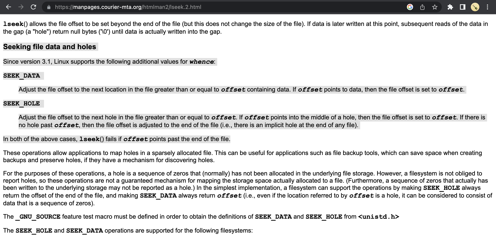

草民运气很好（大概？），遇上了 ZFS 2.1.10 的重大数据错误问题，加更一下问题排查的经过，顺便也把近期的一点小迭代也更新一下。

# ZFS Data Corruption

TL;DR: [https://github.com/openzfs/zfs/issues/14753](https://github.com/openzfs/zfs/issues/14753)

下面草民自己排查问题的过程按实际操作时间来排序，所以会有些许混乱（这也是因为草民当时确实有点慌，真的是想到啥看啥

## Problem

从 4 月 22 号开始，草民的例行 OpenWrt 编译就再也过不去了，会随机卡在一些难以理解的地方：


这个卡的形式着实很难以理解，而且还不固定，重复 `make dirclean` 再构建几次，每次卡的地方还都不一样，百思不得其解。

把日志级别调高之后再跑，然后抽了一次失败的构建仔细看了一下日志，发现似乎有问题的文件会变成全 0


进到构建目录里面简单看了一遍，过程中的中间产物要么全 0，要么完全正常。全 0 可能发生在过程中产生的任何文件上，包括源代码、通过工具生成的代码（比如什么 `automake` 出来的配置）、构建出来的中间产物（比如一些 `.a` 文件）和最终产物（比如 `bison` 或者 `patch`）。有一说一，草民折腾电脑二十多年得有了，如此诡异的问题当真是头一次遇到。。。

## Code

一开始肯定会怀疑 OpenWrt Master 代码又炸了，但上面这个问题实在是过于离谱，真的很难这样怀疑：

* 再怎么炸，炸成这个样子真的是有点困难的，而且如果是源代码问题的的话，炸的范围应该相当固定，不可能如此随机
* 看了那几天的 Commit 完全就没有什么大改动，基本就只有一些内核上用的特定硬件的 patch
    * 但是非常有趣的是，虽然 OpenWrt 构建各种爆炸，但其中编译内核的步骤十分稳定，完全没有任何问题，其他的随便什么东西都可能随机暴毙
* 如果这么容易复现的话，按照 OpenWrt 社区的活跃程度应该很快就有人处理了，但无论是 issues 还是论坛都完全没人提这事儿

## Kernel

前几天刚更新了 Manjaro，所以当时也在想是不是内核爆炸导致一些延缓写入产生问题，于是先装了个 6.2.x（原来是 6.1.25）的内核。

重新试了一下发现完全没变化，该怎么炸怎么炸。。。

## Hacked?

前几天草民某台 VPS 被黑了（这又是另一个很有趣的事情，下面会简单说一下），那台 VPS 是接入到了草民的 Tinc 大局域网了的，而且草民这个 NAS 的密码也很弱（虽然跟上面那个 VPS 不一样），当时着实很担心黑客会不会顺着 Tinc 网络直接把草民整个内网淦翻。

今天遇到这个极其怪异的事儿之后忍不住会往被人搞了的方向去想，尤其草民之前还看到过一些替换 glibc 隐藏挖矿脚本之类的活儿，这个活儿如果整的不干净的话确实可能会导致系统出现各种各样奇奇怪怪的问题。但实在是没抓到任何证据（CPU 占用率，传感器之类都完全显示为空载状态，也没看到什么怪进程），很难确认或排除这个因素，所以这块儿也就只好先搁置了。

## ZFS Scrub

跟几位群友聊过之后也怀疑是不是盘坏了，但挨个看了 smart 和 zpool 状态，都一切正常，而且草民每周定时 scrub 完全没遇到过问题

但现在确实该怀疑一下文件系统或者磁盘了，于是开了个 `zpool scrub` 跑着。不过跑一遍要十来个小时，让它跑了一会儿（大概 10%）左右没看到任何异常，于是让它后台跑着，继续考虑其他可能的问题

## Other Code

虽然上面有说过 OpenWrt 自己炸的可能性着实不大，但查了一顿其他可能的地方实在是让人不得不怀疑是不是 Master 真的炸了，于是翻出了好长时间没动过的 OpenWrt 21.02，然后发现也炸了


跑了几次，跟 Master 的表现完全一样，也是中间产物会随机莫名其妙变成全 0，这足够说明不是 OpenWrt 自己代码的问题。开始感觉不对劲


## WSL

为了进一步排除代码问题，把上面一直在爆炸的 OpenWrt Master 直接整个 rsync 到了另一台电脑上的 WSL 里面编译

除去一点环境问题之外一切正常，编译出来的东西也跑的很顺利


至此得到明确结论：排除 OpenWrt Master 代码自己的问题

## ZFS L2ARC

此时有些开始怀疑有没有可能是 ZFS 的问题了，考虑到是写入场景的问题于是打算先把 SLOG 关掉，但是关的时候可能是因为还在同步跑 scrub，卡住了。。。等了好久终于关掉了。回过头来偶然看到 dmesg 上有一些 ZFS 的 task hung（什么 l2arc_feed 之类的），大喜过望，以为是 L2ARC 读的时候一致性爆炸导致的问题，立即关掉 L2ARC，然后马上试了一次。。。


还是没用，该怎么爆炸怎么爆炸。回过头来一想这些 task hung 应该是上面那个关 SLOG 的时候卡住的提示。。。

话说回来，以前有 L2ARC 的时候觉得也不是很有用，摘了发现嘿，没有 L2ARC 还真不行

## MemTest

虽然草民完全不相信内存可能出问题，但草民实在不知道会是什么问题了，就真的去跑了！

跑了快三个小时，结果也确实是完全没问题。。。

## LiveCD

草民又回过头来去想会不会是 glibc 有问题，于是做了这样的操作：

* 下载最新版的 Manjaro LiveCD（刚刚 Release 的最新 Stable，跟草民硬盘上的版本，从内核到系统组件应该都完全一样
* 对比 glibc 的 md5，完全一样
* 安装工具链和 zfs 模块，挂载硬盘上的 zfs 文件系统，进去编译，爆炸


到这一步应该可以 90% 以上排除 userspace 的问题了，问题要么是内核要么是文件系统

## Change Filesystem

既然已经在怀疑可能是 ZFS 的问题，那就干脆整个别的文件系统，如此应该可以完全确认是不是 ZFS 带来的问题。

此时已经快凌晨五点了，于是随手搞了一个 ext2 的虚拟盘，并把刚才在 WSL 上确认过没问题的同一份代码复制上去，开起来编译就去睡了。

早上九点多醒过来看了一眼，果然一切正常

## Kernel Again

到这个时候其实差不多已经可以确认就是 ZFS 的问题了，但中间又有个小插曲：不知道是因为早上贼懵还是啥，草民配了一个（自以为）全部在 tmpfs 上的环境，结果它又爆炸了（当然后来一看是 OpenWrt 里面的 staging_dir 下面的一个目录没映射好

本来上面那个换文件系统的试验应该可以确认就是 ZFS 的问题了，但因为这个插曲草民又非常绝望的降了一下大版本内核（6.1.25 降到 5.15.108），然后发现没有任何用处

后来草民去看了一眼 [kernel.org](https://kernel.org/)，非常不出意外 Stable 和几个 LongTerm 其实都在同一天有更新，所以其实上面提到的把内核从 6.1 降到 5.15 其实很大概率是没啥球用的

Manjaro 对一个大版本内核只留一个小版本，不像 Ubuntu 之类会留两三个，草民的 /boot 又没有放在 zfs 上（其实是可以放的但是有些麻烦，而且感觉没必要），查了半天也没查到要怎样在 Manjaro 上回退小版本内核（包括各种模块，嗯，比如 zfs）

## Trying strace

跟群友们进行了进一步交流，群友建议要不要搞点 ebpf 看看具体坏掉的文件被谁操作过。虽然草民不完全确定这种大概率是文件系统爆炸的事情在内核里面的表现是怎么样的，但因为这个坏的表现又很奇怪（文件要么完全正常，要么全 0），感觉或许也能看到一些端倪，所以还是拿出了 strace

```bash
# original command: make V=99 -16
sudo strace -u yichya -ff -o ~/duplicate_test_2/strace.txt make V=99 -j16 > /home/yichya/duplicate_test_2/stdout.txt 2> /home/yichya/duplicate_test_2/stderr.txt
```

跑了两遍，然后得到了加起来 11G+，一共 360000+ 个文件（每一个文件对应一个过程中产生的 pid）的系统调用追踪，只能苦一苦 VSCode 了。

```
yichya@yichya-nas ~> du -hs duplicate_test*
8.0G    duplicate_test
3.3G    duplicate_test_2
yichya@yichya-nas ~> cd duplicate_test
yichya@yichya-nas ~/duplicate_test> ls -1 | wc -l
261035
yichya@yichya-nas ~/duplicate_test> cd ../duplicate_test_2/
yichya@yichya-nas ~/duplicate_test_2> ls -1 | wc -l
105193
```

对着报错日志里面异常的文件开始找对应的 strace，果然发现了奇怪的地方：问题出在复制文件的过程中，原文件明明存在、有内容（确认过了正常），`openat` 原文件都正常拿到 fd 了，`lseek` 却报了个非常怪异的错误，下面一步 `ftruncate` 直接在目标那儿写了一个全空的稀疏文件。。。


似乎遇到问题的都是在复制文件的过程中尝试了使用 `SEEK_DATA` + `SEEK_HOLE` 这种方式的，了解了一下，这个大致是一个用来复制稀疏文件的操作。



另外一次的情况略有不同：之前的文件都是全 0，这次的这一个文件是坏在 128K 开始的地方


但在对应的 strace 中也找到了完全匹配的记录：原来的文件是满满当当 4M 多大，复制的时候 `SEEK_HOLE` 硬说只有 128KB，于是目标文件就只有前面 128KB 内容，后面快 4M 都是空洞


试图使用对应的命令（实际上就是 coreutils 里面的 `install` 和 `cp`）复现，没成功，但是得到了正常的 strace 结果，用于对比


## Actual Problem

跟群友们交流了一下上面的发现。就在草民还在想上面这个问题到底是内核炸了还是 zfs 炸了的时候，群友手速比我快，直接在 GitHub 上搜到了前面贴的那个 issue，确认就是 zfs 2.1.10 引入的严重 bug，为此专门发了一个 2.1.11 进行修复。问题确实只影响使用 `SEEK_DATA` + `SEEK_HOLE` 读文件的操作，而且是个 race condition，只在有比较明显 io 压力的时候容易复现，而且这个问题因为并不是盘上数据结构异常，ZFS 自带的 Checksum 和 Scrub 之类机制都没有办法检测到（话说回来，如果它们检测到了甚至开始主动尝试修复数据的话，说不定麻烦会更大）。反馈这个问题的大佬跟草民的使用场景十分相似，是构建 FreeBSD 软件包的过程中遇到随机失败。

至于构建过程中编译内核的部分为何保持稳定，其实很简单，它是整个过程中相对独立的一个步骤（不会被其他的 job 失败打断），并且它没有涉及到上面那种读取方式。

知道啥问题其实也就还好，对现有数据不会造成任何影响，只是复制的时候会有概率出问题，那对草民来说影响不大，等 Manjaro 升级到 zfs 2.1.11 就行了。于是终于睡了一个安稳觉。

## Fixing

下一个比较扯的问题就又不知道是谁的锅了：草民兴冲冲从 stable 切到 testing，装上 zfs 2.1.11，结果一重启 rootfs 挂不上了。。。苦哈哈拿出 LiveCD 一顿修，发现 initcpio 脚本文件名改了。。。。。。虽然这个比起上面那个问题就根本不算事，几分钟修好。但是最扯的是，这个问题甚至活到了 Manjaro 发 Stable，发出来又过了一天才修复，真真的开源灵车。。。

最终问题在 5 月 8 号完全解决，耗时差不多两个星期。

## Thoughts

关于这个问题个人的一点思考

* 即使是 ZFS 这种久负盛名的文件系统，也可能说灵车就灵车，所以数据备份还是要按照 321 的最佳实践来做
* Manjaro 这种小版本内核只留一个的做法其实不太好，虽然这次是 ZFS 的锅，ZFS 除非做 dataset 快照，否则确实没办法留多个
* 所以说其实是有必要搞一下 pool 或者至少 dataset 级别的快照，再遇到这种问题或者类似的滚挂之类的情况可以快速排除问题

# Really Get Hacked

上面说被黑这个事情是怎么个经过呢？4.21 晚上发现草民某台新加坡 VPS 被黑进去了。这台机器吧

* Windows Server 2022，补丁慢了一个月
* Administrator 弱密码
* VPS 提供商统一改的跟邻居一样的 RDP 端口

显然是个非常完美的靶子，而且完美到甚至不太确定是被弱密码淦进去还是被什么别的漏洞淦进去（也说不定是都被淦过了呢），不过大概率是弱密码

草民是怎么发现被黑了呢？这就非常搞笑了，这位大哥大摇大摆在 Edge 里面搜「download firefox」然后装了个 Firefox，然后注册了一个 Amazon 账号，绑了一张 Visa 卡，买了一根还没运费贵的激光笔……然后还没退出账号登录，甚至历史记录都没有清理。


本来想直接给他退了，但是 Amazon 没法直接取消订单，得人肉把商品寄回。。。不管了，小开个盒，虽然这卡大概率来路不正

后来又翻了翻 Windows Defender 的记录，起码清明节那会儿就已经被人搞进去了，害


粗看了一下除了被装了某个挖矿软件（正常操作，不过很搞笑的是因为不明原因它没能自动启动）之外似乎没发现其他行为，重装系统重打补丁改端口改默认用户完事。之后看了系统日志，天天都在被人扫 RDP，即使改了端口也是，十分头秃


所以对 VPS 的安全性还是得上点心，以及 Windows 什么时候能在不开 AD 的情况下支持稍微好一点的验证方式（尤其是硬件密钥

# ACME

之前一直头疼怎样在家里路由器这种没有公网 IP 的环境下实现自动更新 LetsEncrypt 的 TLS 证书。

因为没有公网 IP，http 验证会相当麻烦（只能通过内网穿透的方式进行，但又觉得链路太长，很不稳定），而且 http 验证不能签发 wildcard 证书，所以最好还是用 DNS 方式。虽然也考虑过用 Cloudflare 的 API，但同样觉得很麻烦，而且 Cloudflare 已经设置了 Edge 证书，再额外弄一个别的证书似乎也有点怪。

草民这个 .dev 域名一开始是在 namecheap 上买的，后来为了方便使用邮件转发（以及为了续费省钱）挪到了 Google Domains，但之前 Google Domains 没个像样的 API 支持也就没办法通过 DNS 方式自动更新证书。前段时间突然发现 Google Domains 支持了 API，而且 OpenWrt 自带的 luci-app-acme 使用的 acme.sh 也合并了一个支持的插件（[https://github.com/acmesh-official/acme.sh/pull/4542](https://github.com/acmesh-official/acme.sh/pull/4542)），看来这个问题可以得到解决了。

## Resolve and Get Token

先在 Google Domains 这里申请一个 API Token


同时配置一下域名解析，比如下面都以 `*.home.yichya.dev` 为例，这里解析到家中 OpenWrt 的 Tinc 地址，这样所有接入 Tinc 大局域网的设备都可以直接在这个域名上正常使用 HTTPS 访问


## Add Rebind Protection Exemption

从这里开始的操作在 OpenWrt 上完成。

出于安全考虑（SSRF），OpenWrt 的 dnsmasq 默认会阻止结果为内网地址的解析，所以需要把对应的域名过滤掉。省事儿一点就直接在这里写一个 `yichya.dev`


## Configure ACME

先安装 luci-app-acme，然后因为 OpenWrt 自带的 acme.sh 版本比较老，而且即使是 acme.sh 自己最新的 Release 也还没来得及包含这个脚本，所以需要把上面这个 pr 里面的脚本下载下来放在 `/usr/lib/acme/client/dnsapi` 下面

```
root@OpenWrt:/usr/lib/acme/client/dnsapi# ls -al
drwxr-xr-x    2 root     root            43 May 14 20:45 .
drwxr-xr-x    3 root     root            44 May 14 20:45 ..
-rwxr-xr-x    1 root     root          4387 May 14 20:45 dns_googledomains.sh
```

在 LuCI 里面填一下对应内容（或者直接改 `/etc/config/acme`）填写好对应的信息就行了，比如我这里是

```
config acme
	option account_email 'yichya.2008@gmail.com'
	option debug '1'

config cert 'wildcard_home_yichya_dev'
	option enabled '1'
	option staging '1'
	option dns 'dns_googledomains'
	option use_staging '0'
	option keylength 'ec-256'
	option update_uhttpd '0'
	option validation_method 'dns'
	list credentials 'GOOGLEDOMAINS_ACCESS_TOKEN=<redacted>'
	list domains '*.home.yichya.dev'
```

运行一次 `/etc/init.d/acme start` 就会自动尝试签发证书，如果没什么问题的话就可以在 `/etc/acme` 下面看到每个域名的证书

```
root@OpenWrt:/etc/acme/*.home.yichya.dev_ecc# ls -al
-rw-r--r--    1 root     root          1578 May 10 11:42 *.home.yichya.dev.cer
-rw-r--r--    1 root     root           799 May 10 11:42 *.home.yichya.dev.conf
-rw-r--r--    1 root     root           432 May 10 11:41 *.home.yichya.dev.csr
-rw-r--r--    1 root     root           152 May 10 11:41 *.home.yichya.dev.csr.conf
-rw-r--r--    1 root     root           227 May 10 11:41 *.home.yichya.dev.key
drwxr-xr-x    2 root     root          3488 May 14 21:08 .
drwxr-xr-x    1 root     root          3488 May 14 21:08 ..
-rw-r--r--    1 root     root          3751 May 10 11:42 ca.cer
-rw-------    1 root     root          5556 May 10 11:42 combined.cer
-rw-r--r--    1 root     root          5329 May 10 11:42 fullchain.cer
```

一般情况下证书用 `fullchain.cer`，私钥就是唯一一个 `.key` 文件。建议在需要的地方建一个符号链接使用这两个文件，下面会以草民的用法为例

## Configure HTTPS

草民这里使用 Xray 直接做 SNI 分流转发，[luci-app-xray](https://github.com/yichya/luci-app-xray) 提供了很好的支持。

首先先把证书通过符号链接放到 luci-app-xray 要求的 `/etc/luci-uploads/xray` 下面

```
root@OpenWrt:/etc/luci-uploads/xray# ls -al
drwxr-xr-x    1 root     root          3488 May 14 21:08 .
drwxr-xr-x    1 root     root          3488 May 14 21:08 ..
lrwxrwxrwx    1 root     root            45 May 14 21:08 server.crt -> /etc/acme/*.home.yichya.dev_ecc/fullchain.cer
lrwxrwxrwx    1 root     root            53 May 14 21:08 server.key -> /etc/acme/*.home.yichya.dev_ecc/*.home.yichya.dev.key
```

在 luci-app-xray 的 HTTPS Server 这个 Tab 里面简单设置，使用一个支持 SNI 回落的协议（比如 VLESS）即可，当然也可以用它连回家庭网络


在下面的 Fallback 里面设置按照 SNI 进行转发即可，不在这个列表里面的 SNI 会被转发到上面的 Default Fallback HTTP Server


然后就可以在内网正常使用 Jenkins 了。


## Update Frequency

证书的更新是每天 0 点自动运行，当然每次 OpenWrt 启动的时候也会运行。不是每次运行都会实际去更新证书，应该会是到期之前一个月左右去实际进行更新。

虽然可能并非所有 HTTPS Server 都能不重启直接使用新的证书（比如 Xray 就草民没有实际确认过这块儿的行为），但对于草民自己来说，因为更新 OpenWrt 大概是每天或者每几天进行一次的操作，更新证书之后可能几个小时或者最多两三天就会重启然后加载到新的证书，所以这对草民来说完全不影响。

# End

下一篇会是 Gadgets (2023)，说好的个人工作区介绍因为一些咕咕咕的原因估计要拖到十月份，从石家庄拿回所有需要的东西之后了（
