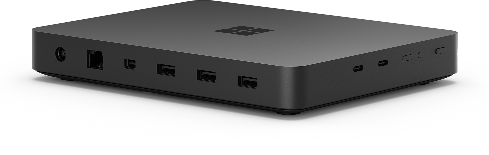
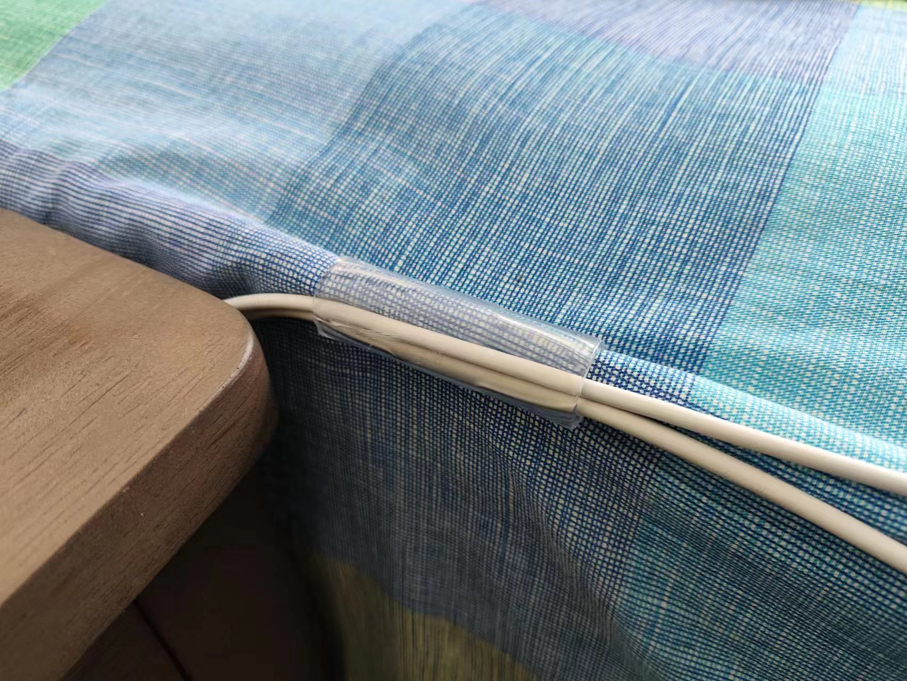
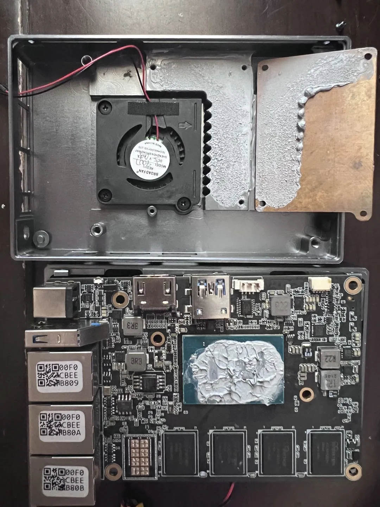
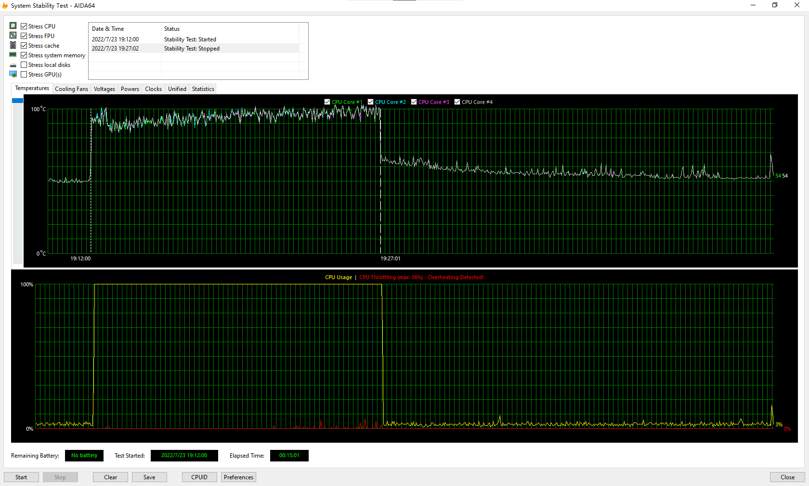
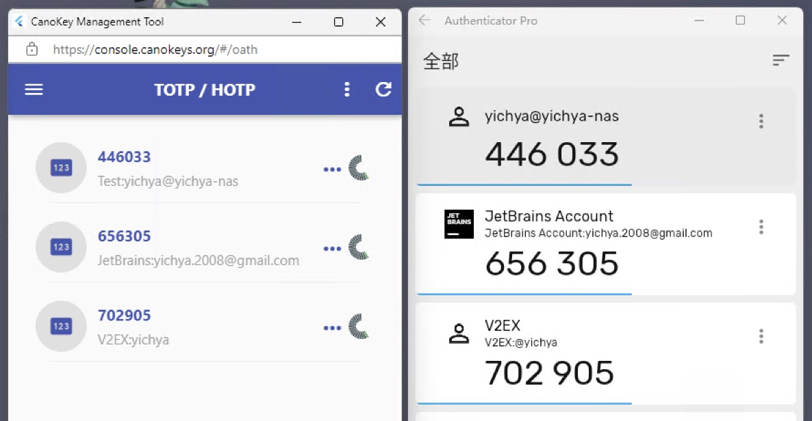

端午假期例行更新，大致按购买时间排序。说起来今年的 My Own Hackday 因为清明假期只有一天的关系又没了。。。

# Smart Home

之前有介绍过，见「[小米智能家居全家桶](../project-home-2/)」和「[智能开关选型](../project-home-3/)」。

用了大半年，目前感觉比较稳定，除了感觉本地中枢现在来看没啥用之外基本没有什么问题

# Xbox Wireless Adapter

它的硬件实际上是一个联发科的无线网卡（虽然并不能拿来当无线网卡用，即便是 Linux 下面也不行


但是这玩意儿的驱动吧

* Windows 上的驱动只有 amd64 的，所以下面那个 aarch64 的 Windows Dev Kit 2023 就没戏了
* 而且还依赖 DirectX 的一些组件，于是 Windows Server 2022 上也装不上去（之前说过 Windows Server 2022 上蓝牙也很难搞，所以蓝牙连更没戏

实际它的信号比蓝牙稍好一点有限，隔一堵墙可用性已经比较差了，可能会随机断线。加上买电视这事儿一直被拖着，客厅串流就很难搞。还是回头把 Xbox One X 拿来放在客厅比较靠谱一些。

# Aurvana Air Again

Flag 回收。网图一张，不自己搞了。这次买已经买不到狗东自营了，只能在第三方店铺买，不知道几年之后这副寄了该再买什么。


音质依然非常完美，不过最近越来越没有听歌的兴致了。

# Photonicat 光影猫

一个基于 RK3568 的便携路由。

两个千兆网口 + HDMI 输出 + USB 3.0 + 两个 PCIE M2 插槽（一个只能插 5G Modem，大概只有 USB 定义；另一个能插 PCIE 无线网卡）


草民选的配置是 4GB RAM + 64GB Flash 再加 RM500U-CN（不知道具体是哪家的 5G 方案，反正不是高通，不能用 QMI 所以之前的短信转发 Bot 也就不能用了

之前买来因为官方开源的 OpenWrt 是个基于 Lean 的魔改分支，草民自己的 luci-app-xray 没法用，加上很长一段时间内没啥需求所以就一直在吃灰。五一出门需要用所以就拿出来收拾了一下，刷了一下官方四月初的固件、装了 passwall 然后试着用了一下：

* 自带无线太辣鸡了，断流飞起（之前好像没这么烂，不知道是不是新固件的问题，懒得刷回去对比了）
* 官方固件支持 MT792x 和 QCNFA765 所以插了一个闲置的 MT7921 上去，为此 5G Modem 上的天线需要拔掉两个，才很勉强能用
* 电池续航很差，可能 5G + MT7921 一起这样用只能撑一两个小时，差不多可以说完全没什么便携的能力，比起之前草民那个 GL-E750 七八个小时的水平差太远了，虽然它性能比 GL-E750 强很多但是完全没意义

也试着折腾了一下官方开源出来的那个 OpenWrt，编译流程非常非常奇怪，魔改的地方非常多，各方面都很难搞。。。

总之总结为一次比较失败的购买经历，先吃灰或者可能刷个 Android 之类的吧，之后或许啥时候官方有了 RK3568 支持再看情况收拾收拾

# Windows Dev Kit 2023

这个一开始是打算专门拆出来一篇来介绍的，结果中间真的试着拿去干活，但是前后只坚持了三个星期。。。

<br/>



后面吃灰了几个月又拿出来整理，结果又发现可以吐槽的比预想的多，所以最后还是打算单独写了（其实本来是打算在这篇之前发出来的，但是最近沉迷王国之泪和星穹铁道，所以咕咕咕

# 相变硅脂

本来是准备给 R86s 用的，但后来换了外壳发现已经很不错了，而且之前的硅脂也是比较好的那种，于是就没有弄


这玩意儿相变 45 度，可能对于 R86s 来说大部分工作时间都在相变温度以下。。。所以可能回头会拿去给别的设备用，先扔着吧

# 京造的钳子

没怎么用就丢在机场了。不知道为什么头昏了带去。


有一说一，这个价其实也基本就图一乐吧，没法太认真。

# 床单固定神器

强迫症究极救星。很便宜，一包好像十几二十个，一个双人床肯定是绰绰有余了。草民是床头 7 个，两侧各 3 个，床尾因为经常要抬起来拿下面的东西所以没有固定，实际也用不到。

实际适合比较厚一点的床单，太薄或者太滑的话效果一般（比如上家某年过年发的那个深绿色四件套，里面的床单就不是很好

还有一个小技巧是它可以顺便用来固定一些充电线，进一步拯救强迫症



# 漫步者 HECATE GT4S

前面有说过 Windows Server 2022 蓝牙很难搞，草民偶尔开会之类还是需要无线耳机，然后这款耳机有一个用 2.4G 无线连接的模式（就是图上那个 USB 接口的东西，是个标准的 USB Audio Class 设备），宣传为游戏低延迟模式。当然草民主要看中这个模式不需要蓝牙，价格也不算贵（现在应该不到三百了），就买来试了试。


问题其实跟很多这个价位的 TWS 耳机差不多：

* 音质真的烂，完全没法用来听歌。这个表现为不要钱一样的低音，真的轰头
* 手势不灵敏、复杂且不能自定义

它的 USB 接收器下面那个小的部分可以拔出来得到一个 Type-C 接口的本体，不过体积偏大不能直接怼在骷髅峡谷后面的 Type-C 接口上，于是最终又是拿回家吃灰了。至于开会，还是接着用有线耳机好了，反正现在可能一两个星期都用不到一次

# Logitech MX Master 3S

趁打折 499 入手。很不错的鼠标，尤其是那个惯性滚轮贼好玩。侧面滚轮确实还是挺有用的。比较可惜的是 Type-C 接口只能用来充电，不能真的用来临时作为有线鼠标使用。在公司用的时候偶尔会掉帧，需要开关一下鼠标电源，还不行就得充电了。


Flow 也确实好用，但就是 Options 那个程序资源占用有点多。顺便 M720 拿回家里了，但那玩意儿侧面胶皮太容易磨损了，现在已经是一个大坑，只能在上面贴一些遮盖胶带避免它进一步恶化。

# R86S 新上盖 & BIOS

R86s 原来的外壳风扇突然就寄了（就在骷髅峡谷的风扇寄了之后没多久，可能是因为那会儿买了除尘气罐，见啥喷啥，把灰尘喷进轴承里面了。说起来这俩风扇都是把轴承完全用硬塑料封死的，完全不能打开加油之类处理，看不懂为啥）。喷了一大堆松动剂进去效果一般，干脆直接整个上盖换掉。直接用一张旧图吧（除了颜色之外东西是一样的



换过外壳之后散热果然有非常显著的提升。刚好跟上次跑 aida64 的时间隔快一年了，气温差不多，直接上图对比



同样是 15 分钟烤鸡（两张图时间轴的比例尺不一样），换外壳之前一开始测试就直冲 90 度，然后很快开始过热降频；换壳之后最高温也不过刚刚 80 度，全程无过热降频，而且结束之后在很短的时间内就降到了 50 度左右，是不是立竿见影。


以及五月份官方出了新的 BIOS 更新了 CPU 微码，据说解决了虚拟机死机问题。虽然草民好像没有遇到过虚拟机死机的情况，但是偶尔会碰见 IOMMU 报错，不知道这个与微码有没有关系。


这个问题可怕就可怕在一旦发生，会直接把 OpenWrt 虚拟机连同穿进去的 QCA6391 一起带走，而且重启虚拟机并不会重置 QCA6391 的状态，甚至重启一次物理机可能也不够，需要重启两次物理机。。。因为这个问题草民近期一直在考虑 Router 和 AP 拆分为两个虚拟机避免无线网卡把整个路由一波带走的方案，如果确认下来后面会再介绍。

# CanoKey Pigeon

一个国产开源方案的硬件密钥，支持的特性很全，Fido2 / PIV / OpenPGP / TOTP / HOTP 啥的都支持，当然一般来说最常用的也就是 Fido2 和 TOTP。最大的槽点主要是 NFC 是真的不好用，需要在很严格的角度上才能识别出来，官方说是因为芯片功耗问题导致的，所以想用 NFC 的话只能用挂绳，不能直接栓在钥匙上。


一次买 5 个可以打 9 折，平均一个 150 多，飞天的一个可能接近 200（主要是国内没渠道不好买到）。两个同事每人带两个，剩一个自用


管理工具就是一个网页，所以可以非常方便的使用它的 TOTP 功能，当然要导入密钥进去是个挺麻烦的事情（简单的说扫那个绑定 TOTP 的二维码然后会看到链接里面有一个 Secret 由大写字母和数字组成，导入的话要一个一个把所有的密钥打进去）。



其他的跟飞天的 Key 差不多，User Presence（就是要摸一下的那个验证）反应速度快不少。

OpenSSH 某个版本之后直接支持 Fido2 了，这意味着 Git 什么的也可以绑在上面，不过用起来还是不那么直接，之后折腾一下。

# Kica 的小风扇

其实是涡轮扇，风量确实很足，当然噪音也是真的大。


草民买来主要是除尘用，但跟压缩空气比还是有点差距，物体表面的灰尘还是很难全吹走，还得擦。目前基本用来辅助日常卫生打扫

# QCNFA765

之前很难买到，现在淘宝到处都是了，甚至跟 MT792x 一个价。草民买到的这一张卡蓝牙走 USB，驱动应该直接装就行了。


顺带一提 Windows Dev Kit 2023 里面也是这个无线方案，当然那个拆不下来，而且蓝牙是走 UART 的。在设备管理器里面按连接查看的话，走 UART 的蓝牙是直接跟所有 Platform Device 在一个层级上，而不是挂在某个 USB Root Hub 或 PCI Express Root Complex 下面的


OpenWrt Master 没法直接用，[下载 WCN6855 最新的几个 Firmware 文件](https://github.com/kvalo/ath11k-firmware/tree/master/WCN6855/hw2.0/1.1/WLAN.HSP.1.1-03125-QCAHSPSWPL_V1_V2_SILICONZ_LITE-3.6510.23)，放在 OpenWrt 的对应位置才能正常使用它。

实际用下来，Ping 比 QCA6391 慢大概 2ms 的样子，其他区别不大，比 MT792x 还是显著要好的，但是它的发射功率比起前面两张卡就要再小两三个 dB 了。具体的测试数据因为时间比较久了找不到了，也实在不想再拆开 R86s 重新折腾一遍（尤其是在 AP 和 Router 没有区分开的情况下，换无线网卡需要整个重新配 PCIE Passthrough 才能让虚拟机重新正常启动，真的很麻烦

这张卡支持 WiFi 6E 但是大家也懂这个国内频率没审批下来，暂时用不了。综合考虑，目前是换回了 QCA6391 接着用

# MangoPi MQ Pro

大概是市面上为数不多满足以下所有条件的 RISC-V 开发板：

* 能跑 Linux（虽然很慢，但也能忍
* 带 WiFi（虽然是螃蟹、SDIO 而且只有 2.4GHz，但连接稳定信号好，甚至还带个估计更难折腾出来的蓝牙
* 非常便宜（一百多好像
* 有 Ubuntu 官方直接支持
    * [https://ubuntu.com/download/risc-v](https://ubuntu.com/download/risc-v)
    * 也不是很直接（就有一个叫 Sipeed LicheeRV Dock 的开发板，它的包可以直接拿来用

薅两张官方图，来自 [https://mangopi.org/mangopi_mqpro](https://mangopi.org/mangopi_mqpro)


板子上有个 SPI Flash 焊盘（有一种可能这个 TF 卡也是跟老树莓派一样用 SPI 模式的所以特别慢），在想有没有可能焊一个上去，刚好 OpenWrt Master 有人提了 PR 支持这块儿板子，后面可以搭一个刚好塞得下的 OpenWrt 出来玩


草民的体验都基于两三个版本的 Ubuntu，没有用官方的 armbian 什么的（毕竟那种一般都不怎么靠谱）。拿到手一开始折腾起来还是有点痛苦，最大的槽点主要是无线驱动装起来实在是太麻烦了，而且 Ubuntu 官方那个 23.04 启动的时候拉不起来无线（22.04 & 22.10 没这问题），必须进了 shell 之后重新 `netplan apply`，很怪。。。

装无线驱动的话，如果是官方的 22.10 就装 licheerv-rtl8723ds-dkms 一个包进去就行了，如果是 22.04 则需要先装 dkms，而 dkms 大家应该知道它是包括 build-essential 及其组成部分（gcc make 等等一大堆）的，这一堆依赖全手动处理的话着实比较酸爽，所以必须准备一个简单能用的 USB 网络连接：

* 最省事儿的办法是拿个 Android 手机开 USB 网络共享（当然前提是有一个能这么干的 Android 手机
* 如果手头有 USB 有线网卡或者带以太网口的 Type-C 转接头的话也可以直接用
* 如果都没有的话建议狗东买一个最便宜的 USB 有线网卡，十几块钱吧

如果实在不愿意搞的话就还是用 22.10，当然个人还是比较建议 22.04 的，毕竟 LTS 还是省心一些

这玩意儿还必须配一个 HDMI 否则真的搞不定初始设置。假如真的花很大力气都调好了的话稳定性还挺不错，包括无线信号也挺不错的（虽然板子上有一个 IPEX，但完全不用接外接天线，信号就很不错），比什么量子计划好太多了，不过不知道是哪里的问题，如果它连接的 AP 重启了它的重连会一直失败，挺奇怪的（个人感觉是螃蟹的锅）。然后最近可能大概也许是天热了，它的 WiFi 似乎也开始不稳定起来了，表现为 RouterOS 上看无线还连着但是 ping 已经不通了，或者能 ping 但是 ssh 没反应。遇到这种情况直接在 RouterOS 上把它踹了就行，过几秒它自动重连上来就恢复了。感觉可能还是螃蟹的锅（

性能只能说挺烂的，差不多就只能跟树莓派 Zero 打个有来有回（当然会被树莓派 Zero 2 或者树莓派 3 以后的版本吊打）那种，主要是 IO 性能真的是烂到离谱，无论是杂牌 C10 卡还是 SanDisk A2 卡都卡得一逼。至于其他的什么图形性能之类的都当不存在好了，总之买来尝鲜倒是也还行，反正没几个钱。油管上有个小评测个人觉得还能看看 [https://www.youtube.com/watch?v=-g18PMjjlcc](https://www.youtube.com/watch?v=-g18PMjjlcc)

比较有意思的大概算是这玩意儿居然用 UEFI 启动，虽然好像也不完全是，它还是要从 TF 卡上两个固定分区加载一些迷之二进制代码（loader1 不知道是什么，loader2 叫什么 OpenSBI）再切换到 UEFI 环境。UEFI 启动还是先启动 GRUB，以及安全启动无（这一点都不意外吧）。说起来前段时间见到 Fedora 不打算维护普通 BIOS 方式启动的内核了，打算改用 U-Boot 之类的提前搭一个 UEFI 环境出来再用它启动内核（[https://www.phoronix.com/news/Fedora-U-Boot-x86-BIOS](https://www.phoronix.com/news/Fedora-U-Boot-x86-BIOS)），有一说一草民觉得还挺合理的

后来又折腾了一下蓝牙，其实很简单，补两个固件就行（不知道为什么这两个没提交到 linux-firmware）：

```
sudo wget -O /lib/firmware/rtl_bt/rtl8723ds_config.bin https://github.com/armbian/firmware/raw/master/rtl_bt/rtl8723ds_config.bin
sudo wget -O /lib/firmware/rtl_bt/rtl8723ds_fw.bin https://github.com/armbian/firmware/raw/master/rtl_bt/rtl8723ds_fw.bin
```

再装两个包就可以了。

```
sudo apt install bluez bluez-tools
```

# Iriver ICM10

之前想找一个靠谱 MP3 的后续。官网半死不活，不过固件居然还挺新的。。。


实际用下来，滚轮比 EROS TEN 还松（不过它起码可以用来滚动歌曲列表啥的了），底噪很大，随机播放不好用（上一曲居然是完全随机的，还不如 EROS TEN），然后屏幕盖板居然轻轻一按就裂了，于是吃灰。总之各方面都非常令人失望，又是一次比较失败的购买经历

# Xiaomi Civi 2

三月份去龙泉赏桃花的时候 K30 Pro 寄了，当时急着用就只好随便买了一台。至于草民为什么选了一台线下 & 面向女性用户的手机，其实草民主要想的是，反正下半年 iPhone 8 -> iPhone 15，这台机器只要手感好、轻、能用就行（

实际买下来用了一段时间，个人感觉是手感确实不错，而且 120Hz 的屏幕确实是用过就回不去了。有一说一，这玩意儿居然有前置补光灯，而且还是左右各一个，还贼亮，简直离谱，但这玩意儿后置虽然凸起来那么多，其实甚至不如 K30 Pro


槽点主要是充电真的慢，亮屏充电几乎充不进去，然后屏幕默认颜色很怪严重偏蓝，开护眼也没用，需要进高级模式强行把蓝色降低。其他的很多地方感觉也有点卡，总体体验感觉甚至还不如几年前的 K30 Pro，以及指纹位置真的很靠下按起来挺别扭的。。。

买来十天就出了下面那个，结果血亏一千块转手了，前后加起来也没用几天，算逑

# Redmi Note 12 Turbo

首发买了 16GB + 1TB 的（颜色也是下面这个图的），当然草民主要是奔着 16GB 内存去的，结果目前只能说 1TB 确实用不完了。各方面都还挺不错的，打星穹铁道比 iPad Mini 5 还要流畅许多，电池续航、充电那些也很好，还有外星科技 3.5mm 耳机接口。


虽然大家都在说扫码头，但个人觉得还行，除了感觉对焦略费劲之外没啥别的。当然槽点吧也有：

* 侧面电源键指纹，实在是不怎么好用，很容易误触而且需要一些很怪的使用习惯（比如除了右手大拇指之外还应该顺便录入左手中指的指纹），以及微信支付的指纹总是莫名其妙自动关掉，不知道是不是因为小米换机过来的 bug
* 跟上面那个一样屏幕默认颜色很怪，也是用一样的方式把蓝色大砍
* 还有一些细节问题比如桌面图标，刚重启的时候不能五个字放一排，但是切一下手机分身回来就又可以了。。。

在酷安上见到几个机身弯了的，也不算太意外，反正再过几个月它的角色就是备用机了（

# 指尖魔方 & 指尖魔方 Plus Plus Plus

Plus³ 确实是跟 2³ 个小魔方堆起来基本一样大，然后就真的搞了个八合一。八合一盘起来手感明显是不如 Plus³ 的，而且组装很麻烦


友情出镜：服役五年半（其中高强度四年多吧），刚换完风扇继续高强度服役的骷髅峡谷

# 小米的一些充电器

以前完全没留意过（因为基本都用第三方充电器），后来才知道就这里面弯弯绕绕还挺多的，65w 的，67w 的，普通接口魔改接口的。


上面三个都是小米魔改 Type-A，从左到右：K30 Pro 送的 33W，Civi 2 送的 67W，去年线下买的 67W

小米魔改的这种是在 Type-A 原来留给 USB 3.0 的那个位置的正中间额外加了一个 PD 用的 CC 引脚，需要搭配小米自己这个特殊的 Type-A 转 Type-C 线，就可以支持 PD 可以充 MacBook Pro，不过 33W 的看 [https://www.chongdiantou.com/archives/56474.html](https://www.chongdiantou.com/archives/56474.html) 的介绍 PD 应该只有 27W，67W 的几个走 PD 应该最多只有 65W


上面两个就是比较平平无奇的 GAN 充电头了，线下买的，扔在公司用。虽然都有 Type-A 但是不像上面那些做了 Type-A 上的魔改，不过后面买的俩 Type-C 口的那个支持小米的私有 67W 协议（当然走 PD 也是只有 65W），前面那个就只有 PD 了。具体的输出功率什么的，充电头网上的相关数据相当全，草民自己现在手头就没有 USB 测试器了，回头再买一个搞搞

# 两块新盘

NAS 里面两块盘，一块 WD120EMAZ 三年多没停（30000 小时了），另一块 WD120EDAZ 18000+ 小时，也接近两年半（警觉）了。加上最近 WD 整了一个活说通电三年左右的盘建议更换，想来虽然这俩盘目前一切正常没有任何问题，但还是做好替换计划的好。
 
上面两块盘一看型号很明显就是老母鸡拆的。这两块盘虽然不知道型号上的区别到底代表什么，不过据说硬件上区别不大，都是企业级氦气盘降速。因为草民一直是 ZFS Mirror 所以实际用着也没感觉出过什么区别。前几天看了一下 Amazon 发现老母鸡似乎价格又还行，于是又收一块，这次就比较不幸抽中了 WD120EMFZ 这种 14TB 降容到 12TB 的盘。。。更难顶的是这块盘看贴纸，生产日期居然是差不多三年半以前了，不知道是堆了多久的库存货。不过要说也确实是非常巧，三个老母鸡刚好把 12TB 所有型号凑齐，不过鉴于这次买到的这个老母鸡，硬盘极为离谱、库存时间更离谱，以后应该不会再买老母鸡了。

因为这三个杀鸡取卵盘目前情况都比较难说，想了想为了求稳还是狗东又买了一块正常的 HC520（HGST HUH721212ALE600），这次拿到的是去年年底生产的一块很普通的盘。考虑到盘的情况和重建阵列太麻烦这件事，目前直接干脆组了 Mirror x4，过段时间可能会按照之前的计划那样从家里把冷盘拿来然后重建成 RAIDz2

```
> zpool status
  pool: opt
 state: ONLINE
  scan: scrub repaired 0B in 11:53:54 with 0 errors on Tue Jun 20 13:00:12 2023
remove: Removal of vdev 3 copied 1.91M in 0h0m, completed on Sun Jun 18 12:40:59 2023
        552 memory used for removed device mappings
config:

        NAME          STATE     READ WRITE CKSUM
        opt           ONLINE       0     0     0
          mirror-0    ONLINE       0     0     0
            sda       ONLINE       0     0     0
            sdb       ONLINE       0     0     0
            sdc       ONLINE       0     0     0
            sdd       ONLINE       0     0     0
        logs
          nvme0n1p3   ONLINE       0     0     0
        cache
          nvme0n1p4   ONLINE       0     0     0

errors: No known data errors
```

其实 12TB 就已经很难用完了，现在用了大概不到 5T，Scrub 一周跑一次，一次已经要十几个小时，近期大概率还是会再删一些没啥用的东西

# 计划

近期打算买的：

* 米家眼镜耳机，看看线下样品，大概率会买
* iPhone 15 超大杯，不解释
* 有点想换显示器了，还有电视，这个看情况
* 国庆大概会从家里拿 Xbox One X、耳机还有些塑料小人啥的回来

# 附赠一只猫猫

在云南买的一个木头摆件，确实是十分可爱。


下次是 Windows Dev Kit 2023 折腾记录，大概七月中旬发。
