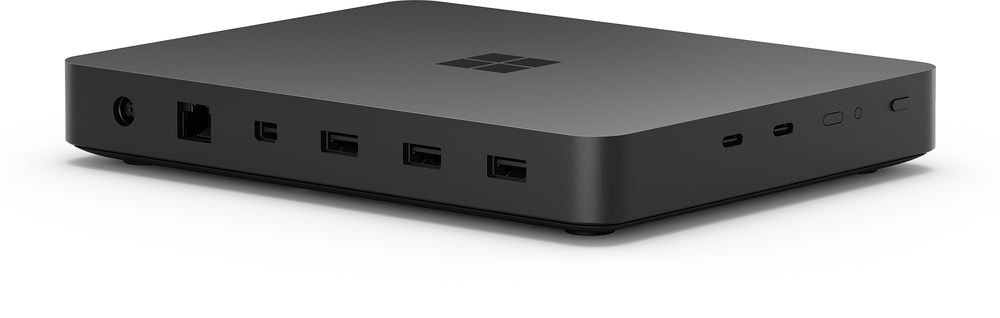
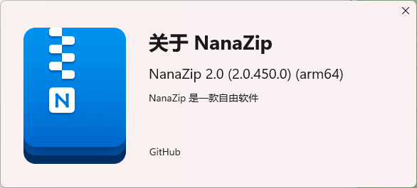
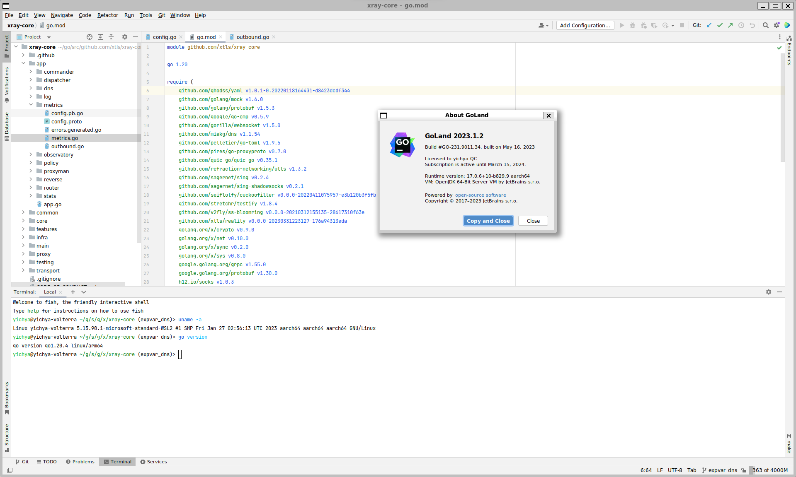
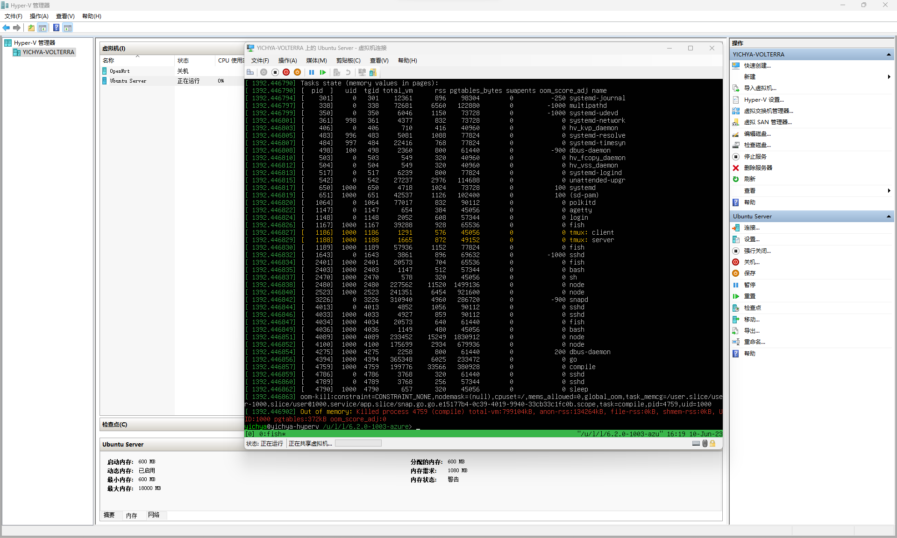
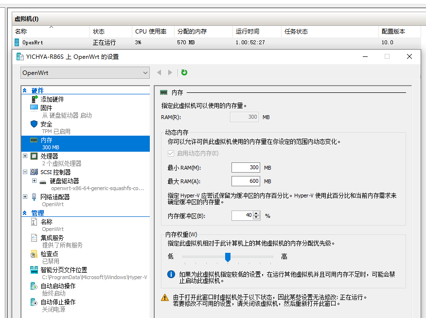
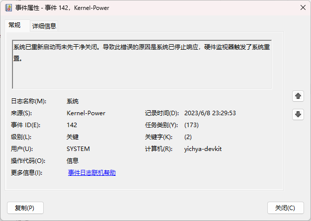
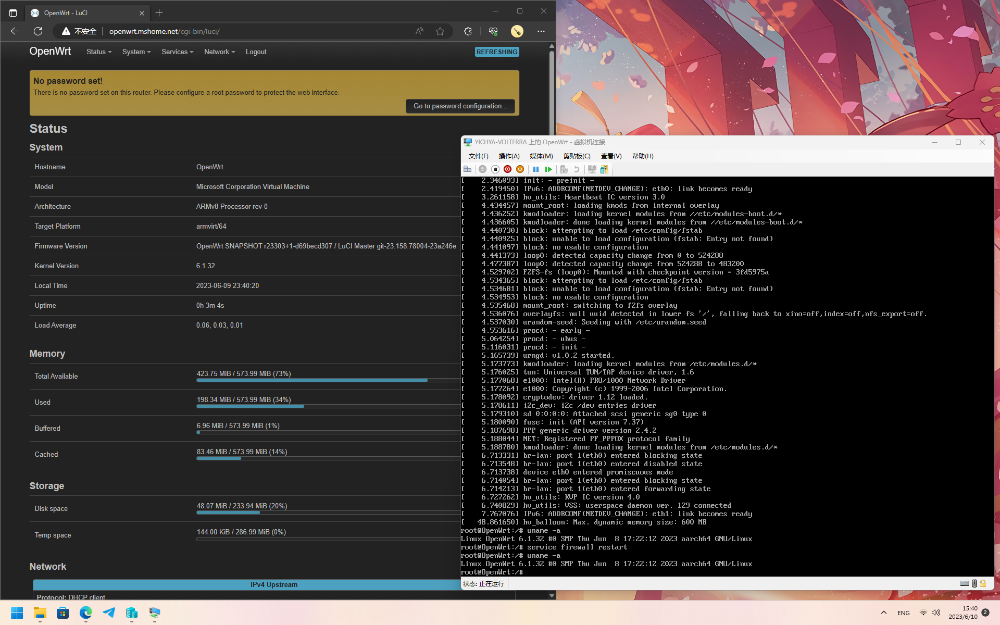

这篇踩坑记录，其实本来是打算合并到 Gadgets (2023) 里面的，但是那个内容量比预想中显著的多，其中这个占据的篇幅有点大，而且整理的过程中细节越来越多，最终还是拆出来了。

至于为什么是 First Experience，主要是因为实际高强度使用它的时间太短，本身对大部分问题都不深入，而且后面又吃灰了很久，印象更浅了。。。

需要强调的是下面的内容基本都是基于 2023 年前两个月的体验完成，小部分为五六月份重新整理的时候补充，Windows on ARM 总体还是在逐渐完善的（比如近期 WSL2 有挺大更新），所以请注意信息时效性。

# Overview

~~Surface Mini~~ Project Volterra，微软官方出的一个面向开发者的 Windows on ARM 设备。32G + 512G 的价格是 4488，也算不上很贵，不过可能因为不能三包之类的问题吧，国内不能直接买，需要企业资质，当然草民直接摇了一个内部学长解决问题（

实际里面是 Surface Pro 9 5G（Qualcomm Snapdragon 8cx Gen 3，普通版是 Intel，几代忘了）的主板，拆掉 Modem 然后加一些转接板和一个螃蟹的 USB 有线网卡，再加一个相当大的散热器（然而它几乎不动，除非是负载很高的时候，所以外壳大部分时候还是温热的）。

虽然大塑料，但实际拿到手质感还行。

<br/>



中间因为骷髅峡谷风扇坏了（那个风扇轴承是封死的，没法拆开上油，只好淘宝 50 块钱买了一个换上，很完美），拿它来干了大概三个礼拜左右的活，总体来说确实是没有 M1 迁移那次爽（当然平心而论两个设备做的事情难度也是有差距的），然后因为 Windows on ARM 有些小问题、WSL2 和 JetBrains Gateway 各种问题太多，而且骷髅峡谷已经修好，就又拿回家吃灰了。

# Windows Applications

其实大部分普通 Windows 程序都没遇到啥问题

* 自家的 Edge、VSCode、Office（ARM64EC，可以兼容 x86 插件）使用完全正常，完全感觉不出来跟 x86 有什么区别
* 需要 Xta 的第三方程序大部分正常，草民也就有企业微信（32 位的，呵呵。。。）和几个小工具（包括一些 Electron 的，还有 Unigram 之前是有 ARM64 的但这俩月突然又没了，x64 倒也能用），还有游戏比如 Steam 和 PC 版阴阳师，阴阳师甚至性能还不错
* 不需要 Xta 的第三方程序现在不多，目前草民手头有的就剩下 Everything、NanaZip 两个了，都很不错



NanaZip 是一个重新封装了一下并且上架 Microsoft Store 的 7-Zip，很好用，强烈推荐。

比较怪的也真的是有，主要似乎都是跟图形相关的，后面会举两个例子，下面先说一下干活的环境问题。

# Working with WSL2

干活还是需要 Linux 环境以及图形界面。WSL2 + WSLg 功能上倒是没有什么问题，装 JetBrains 家 IDE 只需要先 apt 装 xterm 补一下基本的 X 环境依赖，再去官网下 arm64 的包就行了。本来是想直接用 snap 装的，但是 snap 上没有 arm64 的包，只能用官网的 tar.gz，总体还是稍有不便。Golang 工具链本身倒是有 arm64 的 snap（甚至 riscv64 的都有



一开始打算就直接 WSL2 + WSLg 了，用了一段时间发现不行。。。WSL2 最大的问题是 IRQ 会时不时卡住几秒甚至几十秒，这段时间整个 WSL2 是没任何反应的，其他时候倒是都很正常。但这随机卡几十秒这种事儿，干活的时候遇上的话是真的非常搞人心态

```
[24843.677056] rcu: INFO: rcu_sched self-detected stall on CPU
[24843.677682] rcu:     4-....: (14999 ticks this GP) idle=7df/1/0x4000000000000002 softirq=74545/74545 fqs=7288 
[24843.678193]  (t=15000 jiffies g=263025 q=37837)
[24843.678196] Task dump for CPU 4:
[24843.678197] task:fsnotifier      state:R  running task     stack:    0 pid: 5381 ppid:  5243 flags:0x00000002
[24843.678201] Call trace:
[24843.678202]  dump_backtrace+0x0/0x1c8
[24843.678208]  show_stack+0x1c/0x28
[24843.678211]  sched_show_task+0x14c/0x180
[24843.678215]  dump_cpu_task+0x48/0x54
[24843.678218]  rcu_dump_cpu_stacks+0xf4/0x138
[24843.678220]  rcu_sched_clock_irq+0x938/0xaa0
[24843.678224]  update_process_times+0x9c/0x2e0
[24843.678226]  tick_sched_handle.isra.0+0x38/0x50
[24843.678229]  tick_sched_timer+0x50/0xa0
[24843.678230]  __hrtimer_run_queues+0x11c/0x328
[24843.678233]  hrtimer_interrupt+0x118/0x300
[24843.678235]  hv_stimer0_isr+0x28/0x30
[24843.678238]  hv_stimer0_percpu_isr+0x14/0x20
[24843.678240]  handle_percpu_devid_irq+0x8c/0x1c0
[24843.678243]  handle_domain_irq+0x64/0x90
[24843.678246]  gic_handle_irq+0xb8/0x128
[24843.678247]  call_on_irq_stack+0x28/0x3c
[24843.678249]  do_interrupt_handler+0x54/0x5c
[24843.678251]  el1_interrupt+0x2c/0x40
[24843.678254]  el1h_64_irq_handler+0x14/0x20
[24843.678256]  el1h_64_irq+0x74/0x78
[24843.678257]  filldir64+0x1fc/0x2d0
[24843.678259]  call_filldir+0xa0/0x118
[24843.678262]  ext4_readdir+0x548/0x810
[24843.678263]  iterate_dir+0x168/0x1b8
[24843.678265]  __arm64_sys_getdents64+0x6c/0x148
[24843.678267]  invoke_syscall.constprop.0+0x50/0xd8
[24843.678269]  do_el0_svc+0x54/0x150
[24843.678270]  el0_svc+0x14/0x48
[24843.678271]  el0t_64_sync_handler+0xa8/0xb0
[24843.678273]  el0t_64_sync+0x158/0x15c
[24855.488319] hrtimer: interrupt took 43241303 ns
```

Update：等了一年似乎终于有人修这个问题了 [https://github.com/microsoft/WSL/issues/10667](https://github.com/microsoft/WSL/issues/10667)

加上公司的网络环境有点复杂，会屏蔽 NAT 后面的设备（具体不知道是怎么做的），而且偶尔会需要 VPN 访问测试环境的数据库。草民之前的用法是通过一个 OpenWrt 虚拟机统一中转（顺便翻墙），但 WSL2 的交换机配起来有些麻烦，OpenVPN 弄起来也不方便，上面的卡顿问题也没法解决，最终还是放弃了。

# Working with Hyper-V

WSL2 / WSLg 情况不乐观，那旧的方案呢？Hyper-V Ubuntu 22.04 的 Balloon 不能用，忍了，直接开机分 24G 内存给虚拟机，结果 Host 上 Edge 内存又不够了，只能再砍掉一些内存。。。

四月底那会儿本来想着 23.04 可能就修了，结果 23.04 最开始直接就启动不起来。。。还得接着忍。这几天翻出来一看又能起来了，但是动态内存还是不能用，明明已经装了 linux-azure 内核，都已经能从 Hyper-V 管理器上看到 Guest 的内存需求了，但还是不能动态扩充内存（当然了，缩也是不行的），不知道到底是缺了什么。



说起来 OpenWrt 的动态内存也一直不能用。这几天又研究了一下，得知要开几个内核选项：

```
CONFIG_MEMORY_HOTPLUG=y
CONFIG_MEMORY_HOTPLUG_DEFAULT_ONLINE=y
CONFIG_MEMORY_HOTREMOVE=y
```

x86 的 OpenWrt 之前也是没开的，开了之后就没问题了，动态增减都一切正常。



但 ARM64 上开了还是完全没用，吐血，不过在内核日志里面发现一个报错

```
[    0.084730] hv_utils: Registering HyperV Utility Driver
[    0.084732] hv_vmbus: registering driver hv_utils
[    0.084761] hv_vmbus: registering driver hv_balloon
[    0.084867] drop_monitor: Initializing network drop monitor service
[    0.085106] hv_utils: FCopy IC version 1.1
[    0.085270] hv_utils: Heartbeat IC version 3.0
[    0.086042] hv_utils: TimeSync IC version 4.0
[    0.086161] hv_utils: Shutdown IC version 3.2
[    0.086406] hv_utils: VSS IC version 5.0
[    0.086763] hv_balloon: Using Dynamic Memory protocol version 2.0
[    0.086768] hv_balloon: Memory hot add disabled on ARM64
```

对着报错又翻了一下内核代码，然后发现 [hv_balloon.c](https://github.com/torvalds/linux/blob/830b3c68c1fb1e9176028d02ef86f3cf76aa2476/drivers/hv/hv_balloon.c#LL1704C19-L1704C30) 就直接是代码里面写死了在 ARM64 上禁用 Memery hot add，令人窒息。算了。回头研究一下能不能用传统一点的 balloon

除了动态内存的问题之外倒是没有别的问题，WSL 上 IRQ 迷之卡顿几十秒的情况从未出现过。

## Graphics Related Problems

先说工作。JetBrains 家的 IDE 还是需要个图形界面，但这个怎么搞出来就很让人头疼。没有 WSLg 就还是得装一个 X Server，一开始打算还用 VcXsrv，但无论 32 位还是 64 位（都是 x86，没有找到 arm64 的）都非常卡，而且是持续非常卡，主要是上下滚动代码搓一下滚轮可能几百毫秒屏幕才会动，真没法用。换了几个不同的 X 服务器比如什么 Mobaxterm，都一样的卡。

于是回去又翻出来之前问题很多的 JetBrains Gateway，虽然之前用过，但是之前问题太严重了（终端不会自动 resize，Find Usages 之类的窗口渲染完全破碎），甚至还没高强度使用就直接劝退了。这次再翻出来，上面说的两个问题倒是已经修了，而且也没有更好的办法，进行了一波重度使用，然而问题还是非常多：

* 有些 Database 之类的控件会随机渲染不出来（取决于版本）
* 有的时候整个 Projector（指 JetBrains 做远程 Swing 渲染的机制）都会挂掉，所有控件都会渲染不出来，必须断开重新连接
* 下班前锁屏，第二天上班一看屏幕上就只剩一个 Connection Closed 的对话框，也不知道什么时候就突然断开连接
* 有些代码折叠之类的会折错位置，以及很多地方会出现远端渲染的代码框，又卡又难看。虽然这些相对已经算是小问题了
* 还有各种各样的小问题吧。。。

还有些 Go 调试器也会偶尔出问题（遇到的主要是断点里面的 Watch 到的变量一看就不对，甚至直接报错），总之真的很搞人心态。

摸鱼的过程中遇到的图形相关的怪问题就更多了，最让人裂开的是一些视频渲染的场景偶尔会变得非常离谱，会随机出现在任何地方，在 Unigram 和 Edge 里面都见到过（Edge 那次甚至还是全屏幕的，巨吓人


还有最近发现的一个怪问题：Type-C 口插显示器的时候在上面启动星穹铁道，登录进去之后三秒之内就会直接重启（甚至似乎不是 BSOD，事件日志里面找不到 BSOD 相关的内容，只能看到一个似乎是硬件 Watchdog 超时的记录，但系统又并未失去响应）。更怪的是如果走 RDP 的话，就完全不会有这个问题，这个大概只能是显卡的锅



# Windows Subsystem for Android

用的不太多，只简单写一点印象。虚拟化性能感觉比起 x86 上转译（拿 Corsair One 来对比，9900K + 2080Ti）也没啥区别，主要是图形性能依然很烂，而且该怎么不稳定也还是怎么不稳定。

# Others

中间顺便编译了适用于 Hyper-V aarch64 的 OpenWrt 然后跟之前保持基本一样的用法，结果是大部分功能都基本正常，除了键盘死活没反应，初始配置绕了好大弯子。前几天又认真研究了一下，把 AT 这种老键盘的驱动加进去就一切正常了。。。



写到这儿时候的版本 `OpenWrt SNAPSHOT r23352-3baa45fbd8` 需要解决这些问题：

* sysupgrade 会丢配置（一月份的版本没问题，现在突然又有问题了），原因是试图把配置文件写到 /dev/sda2 上，但是没有做文件系统类型的兼容，这里需要调整成跟 x86 一样的方式
* kernel_menuconfig 开启所有 HYPERV 开头的特性以及 AT 键盘

# Next

以上差不多是今年上半年的折腾记录，总体来看确实坑比较多，至于为什么拖到现在就是另一回事了。。。过去半年多也没有再高强度使用它了，现在摆在床头柜上吃灰

不过另一个方向却来了个新活：几个月之前吐槽过的 Photonicat 最近突然发了一个基于 6.1.40 内核的 Ubuntu 桌面版，相当完整，除了内核还是自己编译的之外也基本没什么定制的地方，最有意思的是它可以直接跑 ARM SystemReady 的 KVM，甚至可以正常跑上面那个给 Hyper-V 准备的 OpenWrt 同时直通 USB 设备（比如 5G 网卡）。可惜 sdio 的无线网卡没法通不然就很完美了。

下一步的计划是打算认真搞一搞 ARM SystemReady 和 RK3568 上的 OpenWrt，而且似乎已经有人做了 RK3568 的 UEFI 环境，或许会考虑拿来适配一下光影猫，这样两个 Topic 可以合并为一个。
