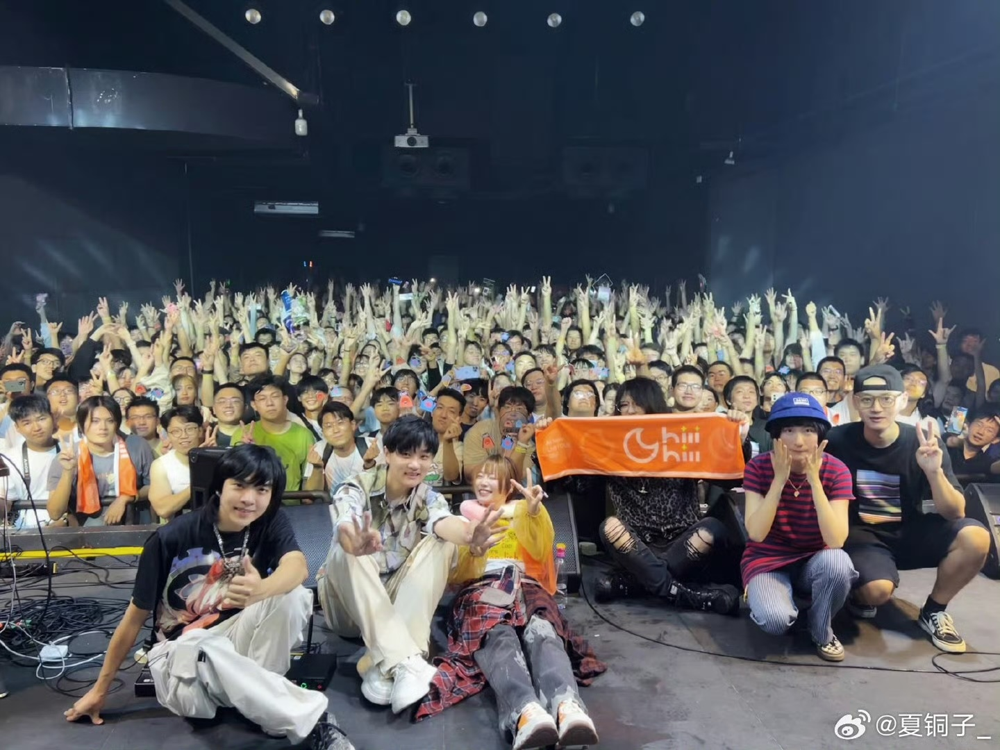
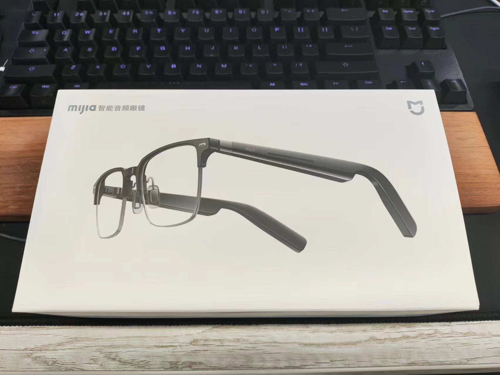
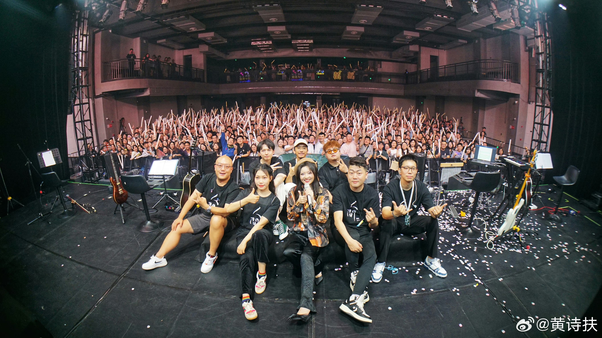

今年国庆确定要回家，出去玩的计划无，不过九月份前同事结婚去了趟长沙，后面又趁周末去了趟重庆，前后凑下来也算个长假的水平了。

## 长沙

前同事 9.16 结婚，刚好 9.15 晚上在梅溪湖有一场 ChiliChill 的 live，这肯定要一起安排上。

虽然是头一次来长沙，而且也想认真观察一下城市界面和产业等等各方面，不过时间关系（主要还是年假不够了）也就只能呆到周一，所以除此之外就很难有其他安排，基本上都是随缘了。

### 天府机场初体验

去程选了一趟很便宜的飞机，四百多的样子，当然很不意外的要从天府机场走。

十点一刻的飞机，草民差不多七点上了 5 号线，然后到孵化园换到 18 号线。虽然是周五不过早上 18 号线也差点没地方坐，9 号线就更别提了，着实令草民十分意外。

机场里面的设施倒是很有趣，比如出地铁之前就可以值机，以及户外小庭院和专门的户外吸烟区（里面有个小亭子装电子点烟器

登机口比较近，从出地铁到安检完走到登机口差不多只花了不到半个小时，远比之前预期要短。如果下次不是规避地铁早高峰，感觉提前一个半小时到机场都绰绰有余，但这波就只能干等差不多俩小时了。

### 住的地方

这波第一天自己在长沙住，所以习惯性选了亚朵。梅溪湖那边还是亚朵 S，而且意外的便宜只要三百多（重庆都要五百多了还不是 S

从机场出来 6 号线坐了差不多一个小时出来，然后看到共享电动车，小开心，不过这边对头盔的要求很严格，戴上头盔车子才通电。有日子没住亚朵了，看见桌子下面的小冰箱感觉贼亲切 hhh

顺便在重庆的亚朵也见到这个小卡片了（不过没拍照片

### 橘子洲小转一下

本着一个来都来了的心态，打算特种兵一波，趁着晚上 LiveHouse 之前的三四个小时功夫转几个地方。为了顺便观察城市界面就还是计划骑共享电动车，但是整个这个道路交通体验就真的让人心态非常爆炸，在极差的道路交通体验下浪费了很多时间，也基本上没啥心情玩了，时间还很紧，结果是只在橘子洲呆了一小会儿。

这么出名的雕像高低得看看对吧。然后小火车花了四十块钱，以及这个景区商业化程度个人评价为离谱。。。

至于交通到底是怎么个让人心态爆炸：

* 非机动车道无（也不能说无，它体现为随机贴在路面上的一些蓝色不规则几何图形），结果是汽车、公交车、电动车、共享电动车抢一个车道，这个车道甚至不知道该怎么命名，而且这个车道真的是要靠抢，电动车根本没有路权，遇上公交车抢道只能自认倒霉
* 像什么橘子洲大桥这种更是重量级，设计上显然完全没有考虑非机动车通行的需求（也没办法，机动车上桥都 tm 要预约的，堪称奇观），结果电动车只能在人行道上飞驰，骑车的和走路的谁也别想有好果子吃
* 共享电动车运营区域非常奇怪，有时候过一个十字路口就突然断电说离开了服务区；更令人血压飙升的是这运营区域几家还不一样，哈啰骑的好好的地方美团就不能骑；最终的暴击则在灰溜溜从运营区域外把车整回来的路上由少得可怜的停车点和大概率没有的脚蹬子共同呈现，搭配上基本等于不存在的非机动车道提供的强力 Debuff 给每一个试图骑共享电动车的人全方面无死角的脑中风体验
* 共享电动车一定要戴头盔这没问题，但是头盔检测动不动就失效这就很有问题，当然这个也就表现为一些催促把头盔戴好的噪音罢了（虽然它一直说再不戴好头盔就要断电不过似乎并不会真的断），比起上面几个甚至可以说不算什么

坐了 40 块钱的小火车会送一张小卡片（这能评上 5A 草民表示很难评价

回来差不多五点半了，稍微恰点东西。能在长沙买到风花雪月还挺让人意外的（不过只见到了这一次

换掉衣服冲向场地。

### ChiliChill @ VOX LIVEHOUSE

冷辣椒这波也是二刷了。虽然下午体验很差，但是晚上还是很开心（夏老师太可爱了

这个场地比较小所以票也放的少了一些（虽然并不影响最后又找不到自己

本来想签一专的但是最后想了想没拆（VTA 买了不少，随便拆一个拿来签都行

### 前往宁乡吃席

婚礼在旁边宁乡，于是怎么过去就是个非常蛋疼的事情。正常来说坐城际比较省事，但梅溪湖已经在相当靠西边的地方了，坐城际还得先回到市区，太花时间。草民先是提前约了个 8 点的车，然后被放鸽子，后面又换了一辆张口就要一百块的返程费，令人吐血，最后干脆坐了一个小时公交到宁乡某个汽车站再打车到酒店。咱就是说这个地方的道路交通怎么就这么全方位血压爆炸的。。。

前同事安排了本地的高端酒店品牌（维纳斯维也纳傻傻分不清楚），房间甚至是小度的全屋智能，突然就有那么一点种草电动窗帘。这个电梯就很有意思，比如意义不明的跟 4 层同时出现的 3A（事实上同时还有 3 层，但好像 2 层不见了，这种讲究真的令人摸不到头脑），以及更加令人难绷的名为 Laundry 的健身房（当然实际人家真的是放在一间屋的所以也不算有问题

要说这位前同事也是着实令人羡慕，咱就没有一个能从初中延续到现在的爱情故事（

有时候也真的会想一想咱这个八字是不是起码得把笔拿起来啊。

### 龙泉漂流

仪式进行的很快（这点好评），于是下午安排大家一起去凉快凉快。湖南的这个龙泉过去还挺远的，大巴一个多小时。

前面有一点跟语言完全不通的嬢嬢因为十块钱吵了半天的小插曲，细节不表。漂流贼刺激，落差有点大，开局几分钟衣服直接全湿透，根本就不需要任何武器打水仗，比起多年前十渡那个漂流猛得多。比较难绷的是半途筏子被撞翻了，损失眼镜一副（什么叫墨菲定律啊，倒是无所谓，反正也该换了

当天晚上只好在宁乡用上次的验光结果加急整了一副，没想到差不多一个小时就配出来，而且各方面都意外的很不错，虽然价格只是之前那副 1/7，但甚至比之前的还舒服一些

回来看见银临的巡演终于官宣了，而且第一轮就有成都，突出一个激动，这波国庆回家该拿的东西都得拿过来

### 马王堆

周日蹭某位大佬的特斯拉回到长沙市区小逛。午饭整到了第一杯茶颜悦色，味道甚好，要说人家这个火爆确实是有点东西的。

马王堆遗址三号坑跟湖南省人民医院共用入口大概是每个游客都会经历的一点小小震撼。

里面很小就一个坑，几分钟就看完了，于是前往湖南博物院。

### 湖南博物院

博物院礼拜天真是人山人海，还好前一天晚上提前预约过，否则怕是门都进不来。这里的游览路线设计的确实不错

当然草民主要关注的肯定是这件非常出名的衣服

毕竟这才是代表了当时的顶尖科技和生产力水平。

前一天漂流把卡包也泡烂了，于是顺便买了个零钱包回来（这个吉祥物的画风咱反正是不太能欣赏得来

### 晚上再蹭个饭

回宁乡之后又跟着大佬蹭了一顿人家的家宴（怪难为情的

见到了一位非常牛逼的长辈，虽然年纪大一点但跟草民这一辈交流起来几乎毫无代沟。然后被拉去尝试了一下黑色经典，事实证明这东西在嗅觉和味觉上保持了高度一致，草民确实完全没法接受。。。

完事儿只好再整一杯茶颜悦色缓一缓。要说宁乡这边建设的也真是不错，这个商圈挺大，该有的差不多都有。薅了两张小卡片

### 溜

周一最后整一杯然后坐高铁回家。总结一下对长沙的印象：

* 交通太灾难了，第一天的经历完全摧毁了草民对长沙的第一印象
* 城市界面很新，包括旁边的宁乡，其实除去道路规划之外的基础建设还是可以的
* 其他还记得的大概只剩下茶颜悦色确实有点东西。总之是印象比较差，大概是不会想再去了

到家之后买了前面提到过的智能音频眼镜（这玩意儿槽点主要在于特别箍脑袋，明年的 Gadgets 里面会简单介绍一下

卡点抢了银临的票，这波真是惊险，差一点没抢到。不出意外应该是今年赶的最后一场 LiveHouse

## 重庆

这波来二刷黄黄的巡演。因为上一次的后劲实在是太足，草民甚至订了二轮郑州场的票，但后来郑州场意外取消了，又在重庆加了一场。

刚好重庆也有前同事可以碰个面，也比较近，走起。

### Saturday

定了到沙坪坝的高铁，成都东站过去只要一个小时多一丢丢，相当方便。不过这个高铁票是真的可怕，本来以为跟北京到石家庄差不多的距离应该票也随便买，结果点开一看一大片都是售空，回来甚至只能从重庆北站走了。。。

住依然是习惯性选了最近的亚朵。从高铁站出来没几步居然又碰见了茶颜悦色，整（而且后来发现重庆到处都是，为什么成都没有

其实也不是第一次来重庆了，甚至场地还在磁器口里面，一想起那个地方挤的水泄不通的小路就感到害怕，不过实际到了之后发现这次场地很大，差不多是正常 LiveHouse 两倍大了，甚至排队都可以排三队

仙女依然发挥稳定，场地效果也很好，但是乐手老师们似乎有自己的想法（突出一个不看谱子瞎弹，Key 乱七八糟。。。

结束之后出来偶然看到头上的灯笼挺好看。

这次终于能勉强看到自己的半个脑袋了（这个场地是不是真的还挺大的，以及手动表白黄黄左边的二胡小姐姐

没有再错过气氛组中的小彩蛋。顺便一提现场还有两个版本的《见过》EP 在卖（哎呀是谁有签过名的典藏版呀真是让人羡慕呢

### Sunday

隔天约了另一个前同事吃饭。观音桥之前倒是没来过，既然来了就再整一杯。

中间贴了一个招聘广告，要说这个薪资其实还真不算低，当然累怕是真的累，一家店三四个店员，然后前面无论啥时候都排起码十几个人，平均一人两三杯，又不像霸王茶姬那种大部分工序全自动。。。

这位也是跟上面那位刚结婚的差不多：回到家乡找到了靠谱的工作，勾搭到了女票（当然这次这个还没到结婚的时候），之前买的房也交了装一装就准备住。。。周围全是人生赢家啊

吃完溜。目前看重庆可能一年会去那么一两次赶 LiveHouse，也可以趁机会再蹭几顿饭

## End

今年数一数居然已经参加了五场 LiveHouse 了，还差最后银临的一场，也趁着这个机会出去走了走，见到了很多新老朋友，十分开心。可惜就是年假已经消耗殆尽，不出意外的话国庆之后不会再安排什么新的大活了。

下一篇应该是从石家庄回来之后的 Project Home 4 个人工作区介绍，应该会在十一月初左右发。
