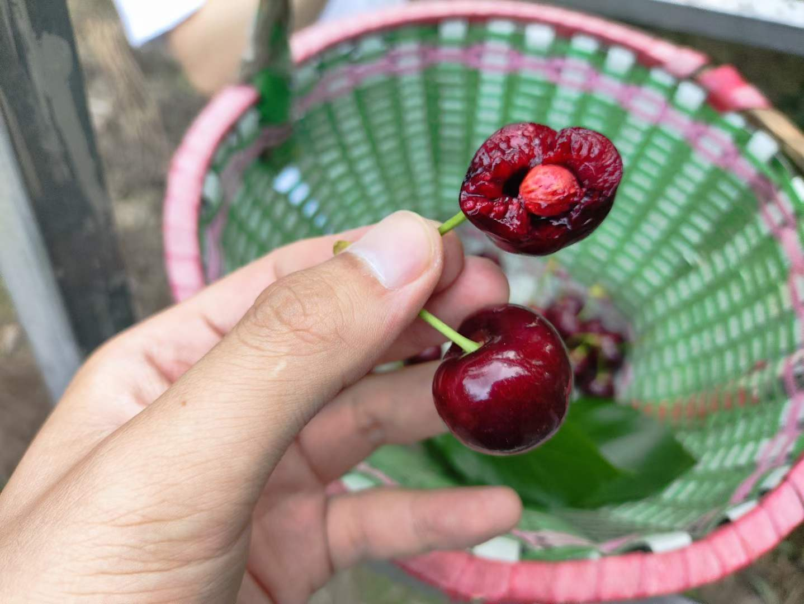

年常系列。注意：图多杀猫（当然现在已经晚了），以及第二张图可能 NSFW（还不晚，慢点往下划）

开头先看一下今年 Blog 更新计划完成咋样：

|↘|Category|Comment|
|-|-|-|
|✅|Life|[Project Home 3](../project-home-3/) 其实不是很有营养，计划中的 Project Home 4 个人工作区介绍还缺点东西所以推迟了|
|❌|My Own Hackday|今年清明只有一天假，所以凉了（钓鱼去了），说起来这个 Flag 好几年都倒了，怠惰了啊|
|✅|NAS and OpenWrt|[Real NAS Project 2](../real-nas-project-2/) 虽然基本都是去年的活；[Real NAS Project 3](../real-nas-project-3/) 突出一个灵车漂移，ZFS 能炸，Google Domains 也能关门|
|✅|Gadgets|[Gadgets 2023](../gadgets-2023/) 加一个支线 [Windows Dev Kit 2023 的介绍](../wdk2023-first-experience/)，近几年产出都比较稳定|
|✅|Play Around|[Vacation 2023](../vacation-2023/)、[Vacation 2023.2](../vacation-2023-2/) 以及零零散散的很多很多地方，超额完成了|
|❌|Technology|虽然不在日常计划中，但确实一整年下来都没整出什么像样的活，怠惰了，怠惰了啊|

其实从上面的统计或许也能看出来，今年草民突出一个高强度享受生活，其他方面从各种意义上都算得上平静无波，以至于刚开始写的时候都不知道开头该写什么。当然还是要（也许是被迫）关注这个世界的，如果一定说有什么事情要有（甚至说已经有了）足够大的影响。。。

# The Real Big Things

今年大概任何一个跟互联网稍微沾点边的从业者都会被 AIGC 和 LLM 这两个东西轰炸，甚至催生了 Prompt 工程师这种抽象职业。。。

LLM 目前还是得有些钱才玩得起，但是感谢 Meta 的 llama，这个赛道现在也多少有些卷了。试了试 ChatGPT 3.5 Turbo（ChatGPT 4 不好白嫖，主要是付款方式多少有点费劲），在草民的工种里面最多只能说比智障好一些，现状是写 Prompt 要花费的精力比直接写代码要高得多，产出的东西也大概率不太靠谱，不过绝对不可否认能很明显看到发展的潜力，而且 LLM 发展极快并向多模态演进，能力越来越丰富，明年一定会掀起更大的风浪。

上面的问题是如何在 Rust 里面实现单例（具体点的场景是启动的时候读一个结构化的配置，但这个动作要由另一个封装好的包控制具体行为，所以有一点复杂），这个显然不在 std 里面的东西是 [rust-lang-nursery/lazy-static.rs](https://github.com/rust-lang-nursery/lazy-static.rs)，草民最后是用了 [OnceLock](https://doc.rust-lang.org/std/sync/struct.OnceLock.html)（Rust 1.70+）

至于 AIGC，这玩意儿现在已经事实上是个零门槛的东西，图片、音频、视频都已经有非常成熟的技术，甚至很多大厂比如网易之类已经多次声称在使用 AIGC 制造一些游戏内的美术资产之类，还在画师等圈子里引发了非常强烈的争议。草民也试玩了一下 Stable Diffusion 体验了一下真正的现代魔法吟唱，然后就一不小心沉迷了好几天，真的是魔法

_上图草民不保留任何权利，Prompt：[Civitai 131824](https://civitai.com/images/131824) 注意 NSFW，推理硬件是 2080 Ti，以及真的很努力避免露太多了可惜基础模型就这样_

AIGC 做音频生成今年也是狠狠火了一把。除了草民一直在关注的 Synthesizer V AI，以及今年很热门的 ACE Studio（今年拜年纪的[《人间游》](https://www.bilibili.com/video/BV1zY4y1Z7C7)就用了 [ACE](https://ace-studio.timedomain.cn/) 家的虚拟歌姬「绮萱」，草民十分喜欢）这种专业的歌声合成引擎之外，也有 [so-vits-svc](https://github.com/svc-develop-team/so-vits-svc) 之类完全没有门槛没有管控、大家都在玩的社区项目（当然没人管的话就会跟 Stable Diffusion 一样很容易玩脱，case 不少这里就不举例子了。。。

总结一下就是，今年 AI 相关应用集中爆发，技术进步绝对是好事，但也会带来很多全新的挑战，无论是对一些人类工种的替代导致的冲击、AIGC 涉及到的内容法律风险、还是 LLM 越来越强甚至可能已经无限接近 AGI 的能力演进是否需要更进一步的管控，都是现阶段亟待解决的重大问题。这一轮科技革命已经开始，然而现阶段大力出奇迹之后的 AI 技术能带给人类的还尚未可知

# Life Mainline

今年大环境其实还是很不好（尤其地缘政治冲突严重加剧，导致很多行业日子都很更加难过），而且魔幻的事情越来越多。。。也不举例了

大环境不好反映在草民身上就是公司六月份又进行了一轮组织架构调整，现在的规模甚至收缩到了三年前的水平。虽然到年底似乎稍微看到了一丢丢行业回暖的迹象，但也很难说能不能持续，毕竟去年草民在「大环境」这件事上的判断目前似乎依然没有什么显著改观，暂且继续苟着。

考虑到上述原因和一些其他情况，今年除了把母亲的户口迁移过来，以及初步进行一部分石家庄的资产安排之外，没有继续推进主线。至于明年的打算，目前可以确定的是：成都的二手房行情目前也显然进入下行周期，这倒是符合草民的需求。目前估计不晚于明年完成这个阶段的资产配置，至于其他事情延续目前的保守策略，突出一个不莽、不立 Flag，一切随缘。

顺便还有一件主线之外的事儿：今年拖到差不多年底终于开始认真学车，然后科目二挂了两次 = = 感觉真的可以说至少来成都之后从来没遇到过这么大挫折

# Work

回想了一下今年工作上的事情，感觉大多水到渠成，除了一些上面提到的裁员（人话）导致的新锅旧锅一起背之外基本上没啥波澜。

去年做的基础建设按预期支撑起了几块核心业务，周边业务的建设也比较顺利，也多整了一些以前想整但是没整成的活（比如在 golang 服务里面嵌入 starlark 解释器做动态能力什么的）。算下来今年遇到的最难的活似乎还是在做人肉 Planner 的事情。业务多了数据源就多，但是机器资源又有限（就算无限也不可能想怎么搞怎么搞），同一个接口进来的请求要从各种场景考虑怎么样出得来，怎么样出的更快，怎么样避免客户发现有主从延迟，怎么样避免不必要的 Join 啥的。TiDB 的优化器又着实有点烂，总是要人工打很多 Hint 进去精细控制它的行为，做着做着就逐渐有了一点很烂的 RBO 的感觉，当然代码也是 Flag 越来越多，颇有一点「防御性编程」的感觉（绝非草民本意，甚至草民已经在尽量想办法让业务方自己来写查询逻辑、避免草民成为单点了，只是有些东西真是不好处理）。

业务更多关注成本、关注效率。抠细节的过程中也开始有一个新的判断：目前这套云计算的庞大叙事，或许跟讲过很多次的其他互联网故事一样，已经过了拐点

* 一般大家选公有云其实最看重的当然是成本，然而在目前的经济情况下需要更加紧密结合业务考虑。草民的观点一直是「在业务发展达到一个特定规模后自建的成本将低于使用公有云的成本」，而目前的趋势是这个「特定规模」来的越来越早。草民今年看了一些下云案例，也简单计算了一下公司的测试环境开销：一次性投入三个月的云账单那么多钱，就足够买一整套机器稳稳用三年（有一说一现在硬件真不贵）。而且公司本来就有私有化团队，完全可以借此实现研发相关设施上的成本优化
* 公有云厂商这几年有句讲句基本就玩命搞营销，说白了就是除了涨价之外基本上整不出什么新活，整出来的也大部分都很烂（尤其国内的几个公有云简直烂到令人发指，此处必须点名所谓低代码平台。。。），并且不断通过一些技术上刻意的不兼容试图绑定客户（比如某家国内公有云自己瞎 jb 魔改 ES 拿来卖），而且运维水平一塌糊涂（就那个 ES，竟然有一次被对面处理工单的人搞崩了半天之久，草台班子都不敢用这么烂的草）
* 即便是从公有云能提供的比较成熟的技术来考虑，能够提供的核心卖点实际上对大部分业务来说也并非痛点，甚至可以说可有可无。从手底下业务出发举个例子：所谓存算分离，其实到头来还是得靠算子下推和 partitioning 把压力尽量卸到下面「存」的部分保证整体性能，至于上面「算」的部分很多情况下无论再怎么 scale out 也就那么回事儿（尤其对在线业务来说，离线业务可能还好点，不过所谓「离线业务」是不是真正意义上的离线业务，其实很大程度上又要结合第一点考虑），更不要提很多业务无论是「算」和「存」都根本没法去做 scale out，甚至可能永远都到不了需要 scale out 的一天
* 无论是之前还是现在遇到的一系列数据安全以及合规上的要求（大到各国都在抓的主权云，小到草民所在公司的大多数关键客户也都要求私有化部署）之类，其实都是越来越严格，而云厂商鼓吹的安全认证大多数情况下跟技术上的安全并没有半毛钱关系，反而会因为很难解决的侧信道攻击等更复杂原因给租户带来额外风险
* 今年相关的负面事件异常的多（今年阿里、滴滴、腾讯等等都有过影响非常大的事故），甚至捧红了一个词「降本增笑」（虽然实际上的原因肯定远比公开信息复杂的多），公有云今年在资本市场上的故事（尤其是国内）也并不好讲

结合一些前同事的动作，逐渐开始觉得，相关从业者很可能之后要考虑往回归理性与传统的方向走。草民明年应该会在这个方向上多花一些时间。说起来好像各行各业都有那么一丢丢这样的趋势，或许这就是具像化的大环境吧（

当然这里一定要分清楚营销概念和真正的技术发展，技术是不会停止前进的（此处还是忍不住放一张堪称天道好轮回的图

最后还是要叠一下甲：上面都是草民毫无根据的暴论，看个乐子就行了，不要太认真。以及，上面也提到年底似乎也感受到了行业一定程度的回暖，希望明年一切顺利。

# Health

父亲的股骨头还是并不意外的有了坏死征兆，目前保守治疗中，不过估计是没啥用。疼的厉害了就换人工关节吧，也没什么更好的法子。赔偿的流程果然是并不顺利（要说这个流程也真是有意思。。。还是先不做展开，最后所有事项都处理的差不多的时候再另行介绍吧），看这流程估计要换了关节重新评估伤残等级一起算账了。

今年虽然还是没逃过固定日子看牙，还好牙齿没有什么大问题。但是非常令草民感到意外的是突然发现体重显著上升了，目前已经稳稳超过 80kg，比逃离帝都前涨了差不多 15kg。。。肚子已经鼓起一个大球，今年见到的所有前同事老同学全都在说草民明显胖了。。。真的活这么大从来没想过这种事情会发生在草民身上，太可怕了。。。

今年射箭的 Flag 又倒了，就算是为了控制体重上升这件事也不能再鸽了，明年一定一定要安排上。

# Play Around

去年有提到今年一定要多走走，于是今年出去玩的次数差不多得跟前面几年加起来一样多了。这个 Flag 差不多可以说超额完成？

## 3.18 桃花故里 

爱桃人士狂喜（）挺不错的，明年还去。

比较可惜的是今年七月没凑齐人再去摘一波桃子（刚裁了员加上确实有点热），明年尽量安排上吧

## 4.1 五块石旧货市场

有些老物件确实很有意思，不过个人的感受倒是更多集中于城北的式微

当天晚上顺便去了博物馆，不过没拍什么图（有点太累了

## 4.5 欢乐塘

清明只有一天假导致 My Own Hackday 咕咕咕了。被大学室友拉去提前感受一下中年男人的娱乐活动，新手光环拉满（

不过后面没再去了，草民还是宅属性更多。

## 4.30 - 5.6 云南七天乐

时隔两年半（？）的大活，详情见 [Vacation 2023](/vacation-2023/)

明年成都到昆明的高铁就通车了，这波高低得去泸沽湖呆两天。

## 5.27 川西摘樱桃

虽然因为各种原因浪费了非常多的时间，但现摘的樱桃是真的太好吃了。

最经典的大概是这张《人不如鸡》

这个明年也一定会再安排上，而且必须超级加倍

## 9.15 - 9.18 长沙

前同事结婚 + ChiliChill 的巡演，这波必须得去。

羡慕前同事之余还是狠狠吐槽了一波长沙，之前不知道哪里来的似乎还不错的印象一点不剩，当然茶颜悦色是值得的。

## 9.22 - 9.23 重庆

上次去重庆得是五年多前了。连同上面长沙的详情见 [Vacation 2023.2](/vacation-2023-2/)

不出意外的话明年可能还会去重庆看一两次巡演，可以再找几个前同事蹭饭（

## 10.4 正定古城

回石家庄顺便去玩。这个上次来得是差不多二十年前了？

虽然城市界面焕然一新，但还是多少有些萧条之感。没办法，确实难。

## 11.4 东安湖

考科目一完事儿顺便去转了一圈。环境不错，就是去一趟成本略高（什么时候高新区修个东西贯通的地铁啊

回来被同事拉着骑小黄骑了四分之一圈绿道，整个人都麻了。

## 12.30 二刷峨眉山

突然有两个大佬就打算元旦来成都（勇气可嘉）。照着六年前的作业抄了一份七七八八的，不过大概是因为胖了，这次逛猴区时间就不太够

上次本来也想记录一下的，但是因为种种原因就咕咕咕了，这次的细节会放在后面 Vacation 2024.1 介绍，大概一月下旬发吧。

# Livehouse

这一部分独立出来的原因是确实今年跑了好多场（虽然不如超话里面那些神仙，毕竟实在是没那么多假可以请

## 4.9 不才《固执的尘埃》成都

第四次来不才的线下了（后援会小伙伴已经成功混脸熟了

这次除了签名还有合影（但是草民太磕碜了就不放了

## 6.17 黄诗扶《人间》成都

第一次见仙女好激动！

今年感觉体验最好的一场，各方面都可以说是完美，尤其《红白》现场版可以称之为震撼人心

## 7.1 ChiliChill《每到夜里》成都

草民是从《时光盲盒》认识这个组合的

听了这一场才知道冷辣椒还写了很多原神同人金曲。《我不曾忘记》劲儿是真大，草民这个从来没玩过原神的听一遍都没绷住

## 9.15 ChiliChill《每到夜里》长沙

超级加倍就是了。

连同下面那一场在 [Vacation 2023.2](/vacation-2023-2/) 里面也都有记录。已经在期待他们明年的大活了（

## 9.23 黄诗扶《人间》重庆

依然是超级加倍。

说起来因为上一场后劲儿太大草民甚至订了去郑州场的票，不过后来重庆加了一场 & 郑州场因不可抗力取消了。也是很有意思的经历（

## 11.11 银临《山色有无中》成都

你们可能不知道草民等这一天等了多久。。。

去年半梦因为各种原因只能眼馋，上面的巡演也很难挤出时间专门跑一趟杭州，但是这次终于！终于！！见到活的了！！！

今年最有参与感的一场（所有的歌都不知道循环了多少次而且全场几乎都这样（~~以及白嫖了好多东西~~，必须要认真感谢一下神仙们

以及顺便买到了这张图（西安场）里面的抱枕（说起来上半年不才杭州场嘉宾是银临，下半年银临西安场嘉宾是不才，双厨狂喜啊狂喜

签名合体四舍五入也就是见过现场合体了（

最后狠狠期待新专辑 + 明年二巡一切顺利！！！

# Album

巡演跑得多于是专辑什么的也买的多（其实压根没什么关系

今年买到的大部分都有签名就非常开心（

## 《沙漠玫瑰》

图上没有印出来的作者，只有签名：[祈 Inory - 萌娘百科](https://zh.moegirl.org.cn/%E7%A5%88Inory)

同时有 CD 和数字版（盒子左上角的那个 U 盘，里面有 wav）就非常棒（毕竟现在想找个光驱是真的很难了

## 《羊角挂书》《无事发生》

买来发现豪华版里面塞了一个简装版（刚好有个学弟没买到，简装不拆了回头给他

顺便补了一专实体，好耶

## 《见过》EP

虽然今年黄黄的巡演都没安排签售，但可以靠爆表的运气补上（耶

豪华版里面附带了一盒磁带，就非常非常的有仪式感（当然也真的更难找到磁带机了

## 《半梦半醒》《V.T.A》

这次终于轮到草民拿着限量版的周边（指一专豪华版里的小册子《每到夜里我就写歌》）秀优越了，好开心

《V.T.A》一不小心就买了一大堆，跟不才的《山止川行》一样多了

## 其他

其实就是没有签名的（

* 《离地十公分》银临（咱就是说这个封面真是，无论怎么拍都一个字也看不清。。。
* 《BI》冰兔（因为脸不够白而没有签名
* 《在人间》瞳荧（送了好多好多好多东西铺不下了有机会下次一定
* 《梦倾天下》兰音 Reine（虽然盒子上的立绘是《人间万朵红》。其实草民觉得不如统一换成《一舞千年》

然后再专门吐槽一下《梦倾天下》这个实体版，就这个盒子质量还不错，但里面的东西吧，U 盘勉勉强强，歌词本印的糊成一坨，真的是，实在很难硬买好几盒。。。真不如成本高点，定价再高点。评价为格局小了，希望[《兰·音》](https://item.taobao.com/item.htm?id=743191427689)别这样，最好能再出个豪华一点的版本

# Collection

除了签名碟之外还 merge 了一下塑料小人之类的收藏（可以从里面看到一些之前就出现过的东西，不过还没有全部带过来

今年买到的塑料小人主要是下面几个（一些小的盒蛋之类的就不列出来了）：

* 左上角的「不知火 · 业火离歌」（这个槽点主要是公差很大，右边的扇子很难装进去
* 第一排中间的「不知火 · 浴火蝶舞」（被大家称为「没有那种世俗的欲望」，以及拖了两年吧差不多
* 右上角的「泠鸢 yousa · 随舰海鸥」（个人觉得是今年买到的最好的一个吧，而且价格也不太贵
* 第二排中间的「初音未来 · 未来有你 2021」（很好，槽点主要是实在拖太久，从名字就能看出来了
* 第二排右边格子里的月姐姐「月清疏」（比例小不说还挺贵，脸也略崩，还改成光腿了差评啊
* 第三排小红帽后面的「泠鸢 yousa · 月下歌」（这个个人评价是不太行，估计没地方就收起来了

下面还有不少设定集也是今年入手的，包括塞尔达、平安京、忘川风华录、长安三万里、星际争霸 2（玻璃渣生前算个体面人啊，不过这几天似乎又在传，微软收购完之后跟网易又重新谈好了）什么的。受限于空间目前能摆出来的基本就这些了（有一说一把它们都塞进去可真是费脑子，把它们的包装盒收好更是非常令人头疼，衣柜和床底下所有能用的地方都占上了），余下的可能就要人生主线推进之后再议

# Game

今年三次元的活整得多，二次元的活就比较少了，是好事。个人觉得电子那啥的水平基本维持住了吧（

## YYS

什么破游戏能坚持玩七年多（其实已经 2600+ 签到了

结合之前数据看看其实真的人数越来越少，刚好最近一波大节奏（钞鬼王这活整的真不知道 Zen 是有多缺钱，还被骂到撤回一个 SSR

|||
|-|-|
|||

今年最大的意外是居然在一年内同时达成了「非洲大阴阳师」和「欧皇」两个纯看脸的成就，于是「人生赢家」日月同辉

全图还差最后一个嫩爹（SP 萤草），不知道啥时候能抽到，也不知道还能不能等到 3000 天了。最后紧那罗手办快端上来罢（敲碗

## HSR

第一时间赶来得瑟刚刚抽到的阮 · 梅（毕竟有谁能拒绝阮饭呢

崩铁的内容实在是过于优秀，玩法简单（玩过阴阳师的话上手极快）且不肝，模拟宇宙很有意思，每个版本的活动更是非常顶（尤其是 1.5 这个活动，梗的密度大到简直离谱，令人不由得感叹这帮编剧冲浪速度着实非常快

甚至于有个说法：「你可以随便发表爆论，但你说的每一句话都会被改编进崩坏 · 星穹铁道」

跟这段时间的 YYS 对比下来。。。再加上年底一波节奏过来，已经有点想弃坑专心崩铁

## ZTK

王国之泪好玩捏，不过 Switch Lite 屏幕太瞎眼了。附一张颜艺（

目前地图开差不多，但眼睛真的遭不住，可能等到下一代 Switch 出来的时候直接二周目吧（

## PAL7DLC

终于还是彻底凉凉（指整个公司都被收购）了，可惜就是死的不太体面，也没办法。

_复活吧我的爱人（大雾），可惜这次真的已经结束了_

说真的还真不如隔壁，起码人家混的真不错，今年《白荆回廊》都端上来了（有一说一司危和芙蕖确实，很有想法，虽然草民应该不会尝试

最后大概也就只能期待一下明年小六剧（说到这个害，也忍不住在想如果 7 的剧情还是沈瑢瑢上的话会不会。。。

# Entertainment

除了上面说的小六剧之外，突然想起来破事 2 忘了看了草，过年的时候补一下吧

## 央视三体

aka 腾讯三体。真的顶，太顶了，跟那个什么玩意儿比，真真一个天上一个地下

第二部不确定啥时候，但明年有球状闪电（草民觉得甚至比三体更适合拍剧，希望别浪费了）。至于 Netflix 的看不看的吧，不需要了感觉

## 球 2

就问太空电梯爽不爽，草民是真的看爽了。

虽然有一说一草民不是很吃数字生命这一套（个人觉得多少有点那种强行造神的感觉，数字生命是个筐什么都可以往里装），但还是看的非常爽，所以球 3 见（很急，但是先别急

## 长安三万里

评价为追光讲故事讲的最好的一次，超过姜子牙真的是实至名归，扬眉吐气（深海就边上稍稍就行了，懒得吐槽

以及可能是设定集到手最快的一次，好评（上面的 Collection 里面有可以找找看

## 拜年纪 & 网抑云

虽然上面跑了那么多场巡演买了那么多碟，但是草民是！兰！音！的！狗！（骄傲

|  |  |  |
| :-: | :-: | :-: |
| 年度歌曲 | 年度总结 | 年度歌手 |

今年的年度歌曲还是《流年如歌》，虽然说来有点可惜 b 站今年年货里最期待的大菜无了（虽然兰音唱的[《定影听潮起》](https://www.bilibili.com/festival/2023bnj?bvid=BV1bA411R7BN)也挺好听，但就是没有那味儿）。还好还有代餐：[前方高燃！一首歌唱出中国科幻千年梦想《到深空更深处去》【星尘 Infinity】【2023 虚拟歌手贺岁纪单品】](https://www.bilibili.com/festival/VSF2023live?bvid=BV1Zv4y1C7Ty)，有一说一这个所有东西都基本到位了，直接挤在《定影听潮起》前面多好。说起来这个视频甚至是今年草民 b 站刷的最多的视频

|  |  |  |
| :-: | :-: | :-: |
| 老二刺猿了啊（ | 到深空更深处去 | 还是兰音的狗（ |

明年年货也有点不确定了，虽然导演嘴上一直说要退休，但这一天真的到来的时候还是多少有点失落的

说起来真的从 2019 年开始再也没看过春晚，每年都在期待叔叔的年货，不知道一个多月之后的新导演会整个什么活

# Projects

luci-app-xray 每年差不多 150 star 稳步提升，很神奇的是今年追着问问题的好像大部分都是外国友人（俄罗斯伊朗等等地方的 bro

今年主要做的能力除了 Issues 中经常提到的 IPv6 支持之外，重点是完善本地流量管理的能力，比如更完善的局域网设备策略、Dynamic Direct 和 FakeDNS 这些都是着重于本地入流量侧的体验提升。其他的点则是做了一些可观测性的优化，对包括 nftables 和 Xray 本身的一些关键指标做了更直观的展示。不过因为个人精力上的原因，草民明年应该会一定程度上降低在这件事上的投入，并且之后的主要方向应该会是做一些针对部分功能的解耦，最终期望的形态大概会有点像 Surge 那样（懂得都懂不懂就算了不多说了

## Real NAS Project & Exit the Cloud

[Real NAS Project 2](../real-nas-project-2/) 的结尾其实也提到目前 NAS 的形态基本稳定，今年的迭代其实只有内网 HTTPS，结果没多久 Google Domains 就裂了，明年应该还会重新整一下（而且确实目前挂在 Xray 上这种形态不是很好用），以及一些原来放在 GitHub 上的东西挪到了自建 Gitea 上，还有自建推送通知设施 Bark 等。当然中间还遇上了 ZFS 爆炸这种节目效果拉满的事情，算个乐子（

家庭网络今年整的一个比较有意思的活：OpenWrt 年中支持了 Hostapd Radius 服务器，于是尝试了一下 EAP，不过目前暂时只用 PEAP + MSCHAPV2 做了身份认证。后面整 VLAN 绑定，搭配 OpenWrt 自身足够强大的 nftables 等组件做本地流量管理才是最有价值的功能，而且从日常使用的角度来说，这种方案还不需要开一堆 SSID，也不担心什么万能钥匙之类的把访客 WiFi 分享出去导致一系列不可控的安全风险

前面 Work 的部分有提到下云，明年也会更进一步尝试把更多目前依赖公有云 / 大企业的服务用自建服务代替，具体实践可以期待一下接下来的 Real NAS Project 2024（没错，既然迭代不会太频繁，之后编号也就跟其他 Category 同步了

## One More Thing

草民做 luci-app-xray 的过程中逐渐觉得：路由器上做本地流量管理的一些常见 case，其实与 mesh sidecar 的能力有很多相似之处：

* 比较复杂的 DNS 能力（使用域名做服务发现、namespace 隔离等等，其实与路由器上做 EDNS 优化、去广告等需求也有共通之处）
* 四层上做负载均衡（将请求按照一定的规则转发到不同的目标，两边都是很常见的需求）
* 七层上做协议转发（最基本的功能，这个应该不需要解释了）
* 健康检查、监控（与负载均衡结合，做动态权重调整之类）
* 限流、熔断（当然在路由器上可能之前关注这些的比较少）
* 流量采样与分析（也是在交换机 / 路由器上非常常见的功能）

于是今年也产生了一个新的想法：打算进行一个拿来主义，把上面提到的一些很好用但分布在不同工具中的能力借用过来，使用 Rust 从头开始实现一个比较纯粹的本地流量管理工具，并且在保证纯粹的前提下，利用 starlark 这样的嵌入脚本引擎实现尽可能强的定制化能力，甚至在一定程度上接近业界常用 mesh sidecar 所具备的能力。这个项目大概会是未来相当长一段时间草民主要花时间的个人项目，会在适当的时候发出来。

# Gadgets

端午节如期更新了 [Gadgets 2023](../gadgets-2023/) ，到现在刚好又过了半年，可以盘一盘下半年入手的东西：

* 啪啪币（现在的年轻人都在玩一些很新的核桃
* iPod Shuffle 4
* 米家智能音频眼镜
* 鼠标防滑贴
* iPhone 15 Pro Max 原色 & 图拉斯的壳
* 小米的 MagSafe 电池
* 预订了但是不知道什么时候才能收到的 uConsole

顺便一提，之前提到过的很箍头的音频眼镜在把主力机换到 iPhone 之后就彻底吃灰了。。。

下次例行更新就明年端午假期见，目前感觉这个节奏还是比较合适的。

# Finally

扯到结尾其实确实今年个人只能评价为真没整出什么活，除了玩就是摆，确实是有点子怠惰了（但是确实挺开心的

按照惯例，结束之前还是：新的一年许个愿。

主线：

* 做完资产配置，继续完成【逃离帝都】计划
* 苟过经济周期，不立 Flag，其他的一切随缘

支线：

* 完成学车（农历新年肯定指望不上了，浅立一个清明前完事儿的 Flag 吧）
* 看在体重的份儿上，弓箭的事情不要再鸽了。。。
* 明年到黄龙九寨、昆明的高铁通车，泸沽湖和九寨沟都去认真玩一次
* 依照计划固定推进 Projects 并完成年度 Blog 更新，尤其是 My Own Hackday 不能再鸽一次了

最后依然送上草民真的很喜欢的《流年如歌》，希望大家新的一年越来越好。

<iframe src="//player.bilibili.com/player.html?aid=94304902&bvid=BV1BE411p7oi&cid=161422087&page=1" scrolling="no" border="0" frameborder="no" framespacing="0" allowfullscreen="true" height="600px" width="100%"> </iframe>
