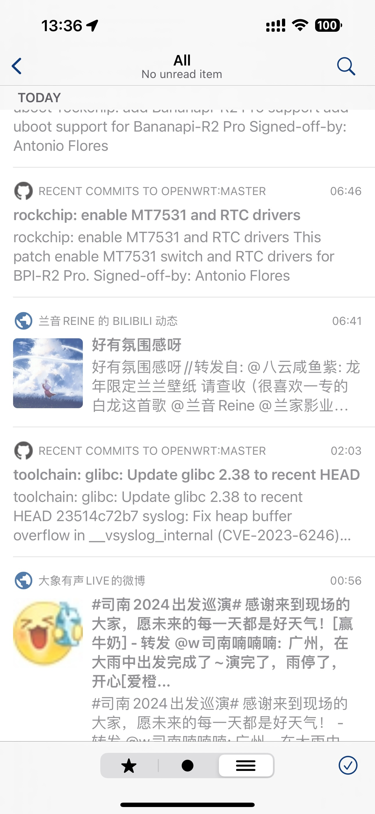
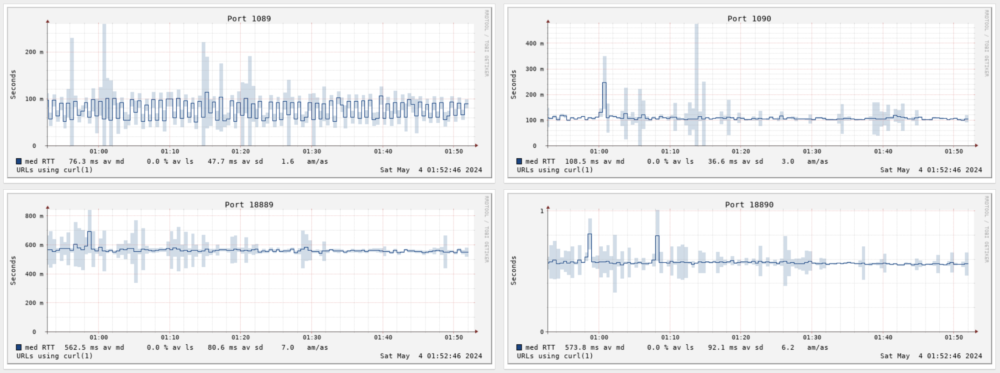

今年本来五一打算出门，但是昆明 / 九寨沟两个方向的高铁都没有通。虽然驾照是有了，但又不能摇到一个三年老司机带草民开车 = = 那么被迫看房之余，简单进城转转好了。多出来的时间呢，考虑到目前的 NAS 作为底座基本已经稳定，年前也有提到在自建上多花精力，那么启动一下这个新的 Self Hosted 系列。说起来清明的 My Own Hackday 又凉了，今年的就混在这个系列里面做吧（

Self Hosted 这个系列比起之前的 Real NAS Project 会尽量以服务为基本单元，更加详细的介绍迁移自建这件事上的各种考虑，顺便赠送一些小块内容。RSS 对自建来说复杂度较低，同时搭配 Bark 做推送应该可以实现足够理想的效果，所以作为第一次介绍的内容。

# 关于尽可能多的自建这件事

之前说了企业视角，从个人用户的角度再考虑一下为什么要做自建这种麻烦事儿，作为整个 Self Hosted 系列的前提：

* 成本问题（主要是各种跟着 App 带的订阅制 SaaS 服务）
    * 买断也就算了，价格不太离谱的话，支持一下没问题
    * 像是 Reeder 这种一年一个大版本重新买断的就很难绷，而且发了新版本，旧版本就直接停止更新甚至下架
    * 直接上各种订阅的就真的更加难绷，而且这种可是真的敢要价，什么阿猫阿狗都敢要价几十几百一年（不点名
* 政策风险
    * 国区 App 备案机制收紧，包括 Telegram 在内的一系列 App 从国区 App Store 下架
    * 虽然现在外区 Apple ID 属于 iOS 用户必需品，但是还是有风险
* 网络边界 / 访问相关 / 服务商本身稳定性等考虑
    * 很多服务（比如 Jenkins 之类）不希望跨越外网边界，链路尽量短
    * GitHub 之类正常情况下连接很不稳定
    * Telegram 很容易炸，很多托管服务也是一样，重点在于炸了没有任何办法只能等
* 定制需求，总会有需求想提 / 问题得修的

# (Almost) Complete RSS Solution

明确到做纯自建 RSS 这件事的原因，除了上面提到的自建相关，其实还有基于威胁模型（之后单独讲一下，本来打算这次一起，但是这次内容已经有点多了，所以咕咕咕，下次一定）的考虑，目前的主力机（iPhone）上要尽可能规避一些风险应用，尤其是 Telegram / 各类 VPN，这使得草民之前依赖 RSStT（[https://github.com/Rongronggg9/RSS-to-Telegram-Bot](https://github.com/Rongronggg9/RSS-to-Telegram-Bot)）的 RSS 推送机制失效。

恰好四月国区 App Store 下架了 Telegram，几件事情都叠在了一起，于是趁着五一放假，开始考虑尽可能纯粹的自建方案。

## 现有的 RSS 订阅方案

常见的 RSS 订阅方案，存在的一些问题主要如下：

* 纯客户端方案：本地维护订阅、本地拉取
    * 在没有连接到内网时，无法对接内网 Feed
    * 客户端定时拉取成本很高，且消息时效性无法保证
* 服务端托管方案：SaaS 模式，服务端维护订阅、服务端拉取
    * 价格昂贵，几刀甚至十几刀每月
    * 完全无法对接内网 Feed
    * SaaS 存在不可控的各类风险
* 自建服务端，对外提供通用 API 方案
    * 缺少直接推送能力，往往需要借助邮件、IFTTT 等第三方手段完成推送，流程长、时效性一般
* 自建 Bot 方案
    * 依赖提供 Bot 的基础平台（比如 Telegram），同样存在各类不可控风险

## 需求

就三句话：能自建的都要自建，能不花钱就不花钱，要有推送。展开来讲：

* 服务端开源，能够完全自建（满足内网对接 RSSHub、Jenkins 等需求），依赖尽量少
    * 顺便，RSStT 体验极佳，并不想抛弃
    * 可以考虑在以 RSStT 为主、尽可能不侵入 RSStT 的情况下做一定程度的对接
* 基于通用 API 实现的 iOS 客户端，且不接受任何订阅
    * 如果确实有必要，可以接受合理价格买断
    * Android / 桌面端接着用 RSStT，这方面没有需求
* 服务端自带推送更新能力，或者能简单改动对接 Bark 等推送工具，保证消息的时效性
    * 不接受客户端后台定时拉取更新（时效性非常差）
    * 不接受通过 IFTTT 之类额外服务商完成推送

## 服务端选择：yarr

常见的服务端阅读器 API 实现主要是 Fever 和 Google Reader 两种。开源的实现还挺多，过程中考虑过几个：

* Miniflux [https://github.com/miniflux/v2](https://github.com/miniflux/v2)
    * 很久以前部署过，各种 API 都兼容（甚至直接可以推送到 Telegram），也有 WebHooks
    * 最大的问题在于不太想专门为了这玩意儿装个 PostgreSQL，不方便容器管理
* FreshRSS [https://github.com/FreshRSS/FreshRSS](https://github.com/FreshRSS/FreshRSS)
    * PHP，自带 Google Reader API，但没有现成的 webhook 插件，也不太好做（更不想专门为了这个需求学 php
    * 有强制性、并不好绕过的刷新频率限制（最快二十分钟，RSStT 默认三十秒），完全不能满足草民的推时效性需求
* yarr [https://github.com/nkanaev/yarr](https://github.com/nkanaev/yarr)
    * Golang 写的，支持 Fever API，数据库默认 SQLite，比上面两个要轻量很多；结构简单，方便魔改
    * 虽然默认刷新时间也比较久，但是没有强制限制，很容易绕过

最终选定的方案 yarr 甚至还有个不错的 UI，个人觉得比 Miniflux 和 FreshRSS 都要舒服很多：


_关注叶里谢谢喵（其实是并排放图的时候下面必须打几个字，字数还得一样否则图片一个大一个小。然后一碗水端平_

虽然因为浏览器的 Referrer 头的关系，大部分图片都加载不出来。除了添加订阅之外，应该是不太需要这个 UI

## 客户端选择：ReadKit

客户端可选的也不少，目前推荐的：

* NetNewsWire
    * 免费，甚至开源 [https://github.com/Ranchero-Software/NetNewsWire](https://github.com/Ranchero-Software/NetNewsWire)
    * 可以直接对接 FreshRSS，但是 FreshRSS 草民不考虑了；不支持 Fever 是最可惜的
* ReadKit
    * 免费，但是有内购，不过内购不买也没影响，功能完全够用；应该是没有开源的
    * 支持 Fever，跟 yarr 对接完全没有问题

因为 yarr 只提供了 Fever API，所以目前先用着 ReadKit，体验还不错，但其实个人还是觉得 NetNewsWire 更好，不排除后期 RSStT 有魔改方案了之后在上面做个 Google Reader API 实现。

|  |  |
| :-: | :-: |
| 关注晴愔馒头妞谢谢喵 | 关注兰音和司南谢谢喵 |

ReadKit 客户端不能直接操作添加订阅，略有不便，添加订阅还需要用 yarr 的 Web 界面。还在思考这块儿如何处理，留个坑。

## 推送通知：Bark

Bark 真的很有用，很好用，iOS 用户强烈推荐。与 IFTTT 之类第三方平台最大的不同点在于，Bark 服务端直接与苹果 APNS 服务器通信（甚至都提供了不经过 Bark 服务端直接调用 APNS 接口发推送的教程），链路很短，时效性非常强。Bark 接到通知可以直接预览、点击跳转 URL，还有图标、声音、分组等一系列定制能力，Bark App 本身也有记录通知历史 / iCloud 同步的功能

|  |  |
| :-: | :-: |
| 关注银临谢谢喵 | 关注慵狐谢谢喵 |

服务端强烈建议自建，而且只需要内网访问做注册就可以了，正常推送不需要始终保持与 Bark 服务端连接，十分安全。

Bark 跟 yarr 对接就稍微复杂一点，首先要选择触发推送的时机。草民选择了直接拦截数据库写入：yarr 连接 SQLite 只有一个连接，所以隔离级别就是 Serializable；在这个前提下 yarr 写库一次写一条，而且有个 `on conflict (feed_id, guid) do nothing`，所以直接用返回的 `RowsAffected > 0` 判断，在传入的回调 `onCreate` 里面调用 Bark 即可。调用 `CreateItems` 的地方有几个，只需要在 Worker 批量更新的地方传入回调，其他比如添加 Feed 等地方都传入 `nil` 即可达到预期的效果。

```patch
diff --git a/src/storage/item.go b/src/storage/item.go
index 68c6821..04d2aaa 100644
--- a/src/storage/item.go
+++ b/src/storage/item.go
@@ -1,6 +1,7 @@
 package storage
 
 import (
+       "database/sql"
        "encoding/json"
        "fmt"
        "log"
@@ -94,7 +95,7 @@ func (list ItemList) Swap(i, j int) {
        list[i], list[j] = list[j], list[i]
 }
  
-func (s *Storage) CreateItems(items []Item) bool {
+func (s *Storage) CreateItems(items []Item, onCreate func(i *Item)) bool {
        tx, err := s.db.Begin()
        if err != nil {
                log.Print(err)
@@ -107,7 +108,8 @@ func (s *Storage) CreateItems(items []Item) bool {
        sort.Sort(itemsSorted)
        
        for _, item := range itemsSorted {
-               _, err = tx.Exec(`
+               var r sql.Result
+               r, err = tx.Exec(`
                        insert into items (
                                guid, feed_id, title, link, date,
                                content, image, podcast_url,
@@ -127,6 +129,13 @@ func (s *Storage) CreateItems(items []Item) bool {
                        }
                        return false
                }
+               if onCreate != nil {
+                       rowsAffected, _ := r.RowsAffected()
+                       if rowsAffected > 0 {
+                               log.Printf("inserted %d rows", rowsAffected)
+                               onCreate(&item)
+                       }
+               }
        }
        if err = tx.Commit(); err != nil {
                log.Print(err)
```

接下来是处理文本内容的时候有亿点手撕各种烂 HTML 的细节：

* GitHub 的 RSS 只有一个 `pre` 标签，要把里面的内容提出来，这里就会有 `<` 转义的问题
* 要考虑 RSS 正文中是否已经包含了标题，但是判定的标准又要有一定的容忍程度
    * 比如微博、Bilibili 之类，对表情符号 / 换行符之类转义非常混乱，都需要额外处理
    * 这里是参考 RSStT 的处理方式用了 [FuzzyWuzzy](https://stackoverflow.com/questions/62142264/python-fuzzywuzzy-ratio-how-does-it-work)，效果很不错

最后是点击跳转，虽然 Bark 没有办法直接拉起 ReadKit，但仔细思考之后觉得也不太需要这种用法

* 音视频 App 本身也不需要拉起 ReadKit 来查看详情，直接跳 App 本身 ById 界面是最好的
    * 比如 bilibili 和网易云音乐之类，也包括微博、秀动之类的
* 大部分信息类 App 点通知其实就是用 App 内置浏览器打开一个网页
    * 比如 IT 之家，甚至也可以包括知乎什么的
* 没有 App 可以拉起的可能才需要考虑是 ReadKit 里面打开，还是直接系统默认浏览器打开
    * 说实话在 iOS 上没什么区别，而且大部分人应该都更倾向于系统默认浏览器

如果要做的好一点可能就还是 App 自身要有接通知的能力，然后做成大部分信息类 App 那样，点开链接直接拉起 App 内置浏览器渲染页面，同时后台更新列表（或者不后台更新，返回到列表页面的时候再更新，拉取完了把已读标记搞对就成），感觉这个是从整个产品角度来说，真的可以做的好一点的地方

## 外网更新：Cloudflared

Fever 的 API 是 HTTP，所以处理的方法很多，有公网 IP 就直接用公网 IP，没有的话随便选一个内网穿透方案都行。草民这里是白嫖 Cloudflared，完全够用。这个教程满天飞，就不赘述了。一点安全上的考虑：不要暴露整个 yarr，只暴露 Fever API 就足够了（这个 API 本身也还是有鉴权的），而且地址可以魔改一下，避免被无聊的人爆破

```yaml
tunnel: redacted-uuid-1111-2222-abcdefabcdef
credentials-file: /etc/cloudflared/redacted-uuid-1111-2222-abcdefabcdef.json

ingress:
  - hostname: yarr.example.redacted
    path: /redacted-uuid-1111-2222-abcdefabcdef/fever
    service: http://localhost:5080
  - service: http_status:404
```

在有 Bark 推送通知（包括通知历史、直接跳转原文）的能力的情况下，通过 Fever API 访问差不多就是能用就行，没有什么指标要求，甚至炸几个小时影响都不大。实际使用体验其实基本上都很稳定，而且拉取更新基本上也就需要几秒钟时间，完全足够使用。

## 魔改服务端：对接 RSStT 避免重复拉取

基于 yarr + ReadKit 的流程整体跑通之后，考虑下一个问题：RSStT 和 yarr 都要高强度轮询几十个 Feed，浪费带宽不说还有更大概率触发反爬，同时两个工具间同步 RSS 订阅也有一定成本（虽然变更订阅的频率很低），那么在不侵入 RSStT 的前提下有没有可能魔改 yarr 直接使用 RSStT 已经拉取的数据提供给 Fever API 和 Bark？

做这种对接的思路一般都比较常规。RSStT 目前没有插件这种部分侵入的能力，感知变更只能从数据库入手：

* 增量（直接扫库或者使用类似 binlog 的同步机制）作为触发
* 全量（在 yarr 上叠一个适配层直接读 RSStT 的数据）

然而看过 RSStT 的数据库发现，RSStT 完全没有持久化 Feed 内容，甚至内容都没有单独一个表存，只在 Feed 表上存了一个 hash 还是直接 json 存在一个 TEXT 列上的，有一说一，这数据库设计着实是有点迷惑


顺便看了一眼之前用过的 flowerss，结果发现它也没有做内容持久化（也是只存了个 hash 但是起码拉出来一张表，可以扩展一些关系了）。在没有内容持久化的情况下全量数据肯定是指望不上了。

增量倒是能做：这张表上有一个 `last_modified`，刚好可以用来触发。于是直接在 yarr 里面开一个 goroutine 连接这个数据库，每秒检查一次这张表上 `max(last_modified)` 是否发生变化，如果发生变化就说明 RSStT 拉取到了新的内容，此时触发 yarr 自己的全量 feed 更新即可；yarr 自己只保持特别低的刷新频率（每小时一次）用做兜底即可。实际使用下来效果很好，RSStT 经过 Telegram 发到桌面端上的通知跟 yarr 通过 Bark 发到手机上的通知基本上是同步的，而且可以显著减少 yarr 定时重复拉取 feed 带来的额外开销。

下一步考虑 RSStT 与 yarr 之间的 RSS 订阅同步，但是两个工具的形态略有不同：

* yarr 只支持单个用户，RSStT 则支持多用户，且是多对多关系
* yarr 有订阅分组能力，RSStT 没有；yarr 的订阅分组是多对一关系

考虑到这些设计上的不同点，订阅同步大概会是个比较麻烦的事情，可能还是得考虑对 RSStT 做一些修改，再留一个坑好了。

## 结果

这一套弄下来，感觉还挺商机的，为什么没有人出个一揽子解决方案，尤其是把「自建服务端推送」这件事解决掉，然后卖个 Pro（买断六块钱什么的，这玩意儿比起某些 App 花里胡哨完全不知道设计规范为何物的 UI 不是有用多了，那玩意儿可真敢要价啊

回头随机抽取一位幸运观众借用一下 Apple 开发者账号吧，真不想花 99 美刀一年就为了这个。

# 一点额外内容

已经自建但是也不太值得特别大篇幅说的一些小东西，算是附赠

## Gitea

GitHub 是好的，但是有的时候手滑用公司的邮箱推 commit 上去就很麻烦，还是最好中间有个拦一道的步骤，而且像草民这种改了代码推到 dev 分支，OpenWrt 构建软件包的时候马上又要拉下来，一来一回中间稍微一遇上梯子出问题就很耽误时间。自建了之后评价为真爽，早该自建了。


上图为 1.22 的新配色方案，比之前那个绿色好看太多了。

Gitea 也有自己的 Actions 做 CI / CD，很大程度兼容 GitHub Actions，不过草民有自建 Jenkins 没太用上（而且 Jenkins 也是手动去戳的

### 略微不同的 codeload

Gitea 和 GitHub 下载 tar.gz 之后目录结构不完全一样，Gitea 下载下来的文件中，目录名上没有版本号


自动化脚本里面需要做一些适配，稍微有点麻烦。

### OpenId

Gitea 可以当个 SSO 用，还能支持两步验证，包括 TOTP 和硬件密钥（不过暂时还不支持 passkey 这种直接绕过密码的；看 1.22 的更新日志好像有涉及到 passkey 的；试了一下 1.22.0-rc1，并没有，而且数据库变更之后降不回去了，凑合用吧

但是对于大部分不支持 OAuth2 的应用来说还需要搭配个 OAuth2 代理（比如 [https://github.com/oauth2-proxy/oauth2-proxy](https://github.com/oauth2-proxy/oauth2-proxy)），不过对草民这种就自己用的好像也不太需要


## RSSHub 上的额外调整

叔叔搞的反爬越来越厉害了，大概是四月中旬突然上了一个策略，UP 主动态全都拉不下来了，好在社区花了几天就解决了，但是代价是不得不拖一个 Headless Chromium 来获取某些特定 Cookie 绕过反爬。这样启动一个：

```
$ /usr/bin/chromium --headless --remote-debugging-port=9222 --remote-debugging-address=172.17.0.1
```

每一次 Headless Chromium 启动的时候 URL 都会变，但是可以用 `http://172.17.0.1:9222/json/version` 获取到这个 URL

```json
{
   "Browser": "HeadlessChrome/123.0.6312.122",
   "Protocol-Version": "1.3",
   "User-Agent": "Mozilla/5.0 (X11; Linux x86_64) AppleWebKit/537.36 (KHTML, like Gecko) HeadlessChrome/123.0.6312.122 Safari/537.36",
   "V8-Version": "12.3.219.16",
   "WebKit-Version": "537.36 (@31f8248cdd90acbac59f700b603fed0b5967ca50)",
   "webSocketDebuggerUrl": "ws://172.17.0.1:9222/devtools/browser/a0291e41-2825-4608-aec4-da09c06a71ea"
}
```

RSSHub 需要调整一下传入给 Puppeteer 的参数，使用 `browserUrl` 而不是 `browserWSEndpoint` 连接。这个文件直接用 Volume 挂到官方的容器里面就行，不用重新打包

```patch
diff --git a/lib/utils/puppeteer.ts b/lib/utils/puppeteer.ts
--- lib/utils/puppeteer.ts
+++ lib/utils/puppeteer.ts
@@ -43,9 +43,9 @@
         }
     }
     const browser = await (config.puppeteerWSEndpoint
         ? insidePuppeteer.connect({
-              browserWSEndpoint: config.puppeteerWSEndpoint,
+              browserURL: config.puppeteerWSEndpoint,
           })
         : insidePuppeteer.launch(
               config.chromiumExecutablePath
                   ? {
```

即便不是 RSSHub 启动的 Headless Chromium 也会被 RSSHub 主动关掉，所以还要用 systemd 自动拉起来，需要注意的是 Chromium 的沙盒需要额外的 Capability `SYS_ADMIN`

```ini
[Unit]
Description=Chromium Headless
After=network-online.target

[Service]
CapabilityBoundingSet=SYS_ADMIN
AmbientCapabilities=SYS_ADMIN
NoNewPrivileges=true
ExecStart=/usr/bin/chromium --headless --remote-debugging-port=9222 --remote-debugging-address=172.17.0.1
Restart=always
LimitNPROC=10000
LimitNOFILE=1000000
User=yichya
Group=yichya

[Install]
WantedBy=multi-user.target
```

其实这玩意儿占用资源意外的并不多，挂着不动的时候内存居然只有几十 MB，CPU 占用也很少

```
● chromium.service - Chromium Headless
     Loaded: loaded (/etc/systemd/system/chromium.service; enabled; preset: disabled)
     Active: active (running) since Sun 2024-05-05 23:39:30 CST; 13min ago
   Main PID: 1742904 (chromium)
      Tasks: 52 (limit: 76954)
     Memory: 68.9M (peak: 71.3M)
        CPU: 361ms
     CGroup: /system.slice/chromium.service
```

## Smokeping 

netdata 广告越来越多，其他指标大部分也不是很有意义，扬了，但是 Ping 还是得看。用了一阵 Smokeping 还不错，还有 curl 采集器，但是 Perl + CGI，而且 UI 太原始，curl 采集器也挺原始的一次起一大堆进程，感觉还是后面换成 Prometheus + Grafana 吧



四个图访问的是同一个新加坡节点做一次完整的 `curl https://cp.cloudflare.com/`，上面俩白嫖 CDN 走香港，下面俩正常用 CDN 绕到不知道哪儿去。白嫖的延迟直接五分之一不到，比直连都快的多得多，所以说白嫖爽，当然白嫖的问题就是天知道什么时候可能就会断

## nginx-mod-vts

三月份过 Cloudflare 的流量居然有接近 4TB，查日志发现每天都有人在扫草民 Cloudflared 挂出去的静态文件，有的时候一天就能干出去 300GB，气死，加监控。这玩意儿之前 Ubuntu 上好像没带，Manjaro 倒是直接可以 `sudo pacman -Syyuu nginx-mod-vts` 装，然后在 Nginx 配置最前面加载上这个模块就好了：

```nginx
load_module /usr/lib/nginx/modules/ngx_http_vhost_traffic_status_module.so;
```

这个模块也可以直接输出 Prometheus Exporter 需要的格式，回头跟上面的那个一起弄。顺便，等草民的域名被 Google Domains 甩给 SquareSpace 了就认真搞一下 nginx 证书，目前从 OpenWrt 上的 Xray 转发还是有些不方便。

## Quadlet 迁移

之前 podman 自动启动还需要 `podman generate systemd` 生成一个把已经创建好的容器拉起来的 systemd service

后来有了一个东西叫 Quadlet，大致上是一个转换器，跟 `podman generate systemd` 的区别在于 Quadlet 转换出来的服务还会负责创建、启动、销毁容器。比如要启动 RSSHub，手写这样一个文件放到 `/etc/containers/systemd` 下面就行：

```ini
[Unit]
Description=Podman RSSHub
After=network.target

[Container]
Image=docker.io/diygod/rsshub:latest
ContainerName=rsshub
AddCapability=SYS_ADMIN
Environment=DEBUG_INFO=FALSE
Environment=PROXY_URI=socks5h://172.17.0.1:1088
Environment=PUPPETEER_WS_ENDPOINT=http://172.17.0.1:9222
PublishPort=1200:1200
Volume=/opt/persistent/rsshub/puppeteer.ts:/app/lib/utils/puppeteer.ts

[Service]
Restart=always

[Install]
# Start by default on boot
WantedBy=multi-user.target default.target
```

其实语法还是很简单的，但是为什么 podman 不直接支持一个转换命令呢。另外注意因为这个 service 是通过 quadlet 生成的，不能直接 enable，所以必须要像示例中那样设置 `[Service]` 和 `[Install]` 

Quadlet 跟之前的 `podman generate systemd` 相比，pull 完了不用手动删容器建容器了很方便，也不用专门装个 `docker-compose`

# End

下一篇不出意外的话是端午 Gadgets (2024)，顺便数一下，大致按时间顺序的话预计包括：

* 啪啪币
* iPod Shuffle 4
* 米家智能音频眼镜
* Xbox One X（就算拿回来了，买来马上五年了，Edge 看个 B 站都卡，写它干什么啊
* iPhone 15 Pro Max 原色 + 图拉斯的壳
* 小米的 MagSafe 电池
* 小米的去毛球器
* DJI Osmo Mobile 5
* ZMI（现在叫酷态科）20 号，一个巨大的移动电源
* 龙芯 3A6000 NUC（简单写一点，后面会再有一个篇幅长一点的折腾记录
* 鼠标防滑贴、醋酸胶带、键盘刷、双面胶片儿什么的小东西（看心情

也简单列一下后面的安排：

* 预计六月下旬：Vacation 2024.1
    * 因为五一没有安排大活，可能会凑一凑把上半年的活 merge 一下，主要也不想年常里面这类内容太多
    * 目前是整了三四个活了，如果上半年没有定下其他的大活的话，差不多就压到五月下旬摘完樱桃，或者六月端午出门回来一起弄
    * 六月下旬大概也许可能会有新活整，暂时还不确定
* 预计七月：个人信息安全 + 威胁模型介绍
    * 其实是一个 2019 年就想说的话题，但是中间因为各种事情丢下了，最近又因为其他的一些事情回忆起来
* 时间暂不确定：龙芯 3A6000 NUC + 新世界详细体验
    * 每年认真整一个稍微复杂点的新设备（前年 R86S，去年 Windows Dev Kit 2023），或许是可以坚持下来的？

暂定这些嗷，之前咕咕咕了很久的个人工作区介绍估计就有缘再见了（
