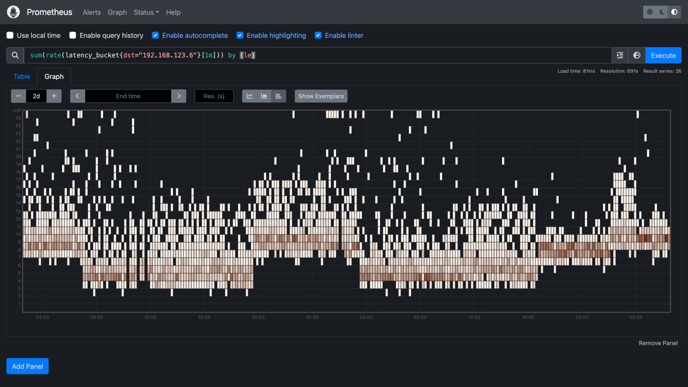
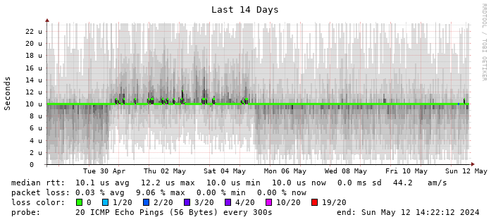
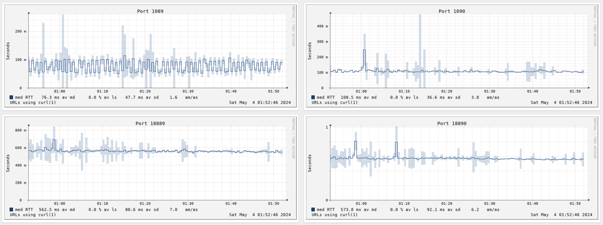
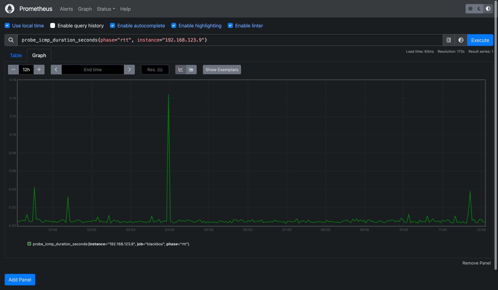
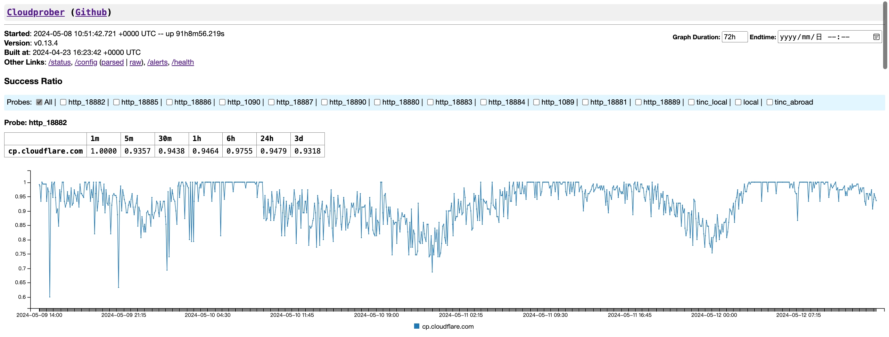
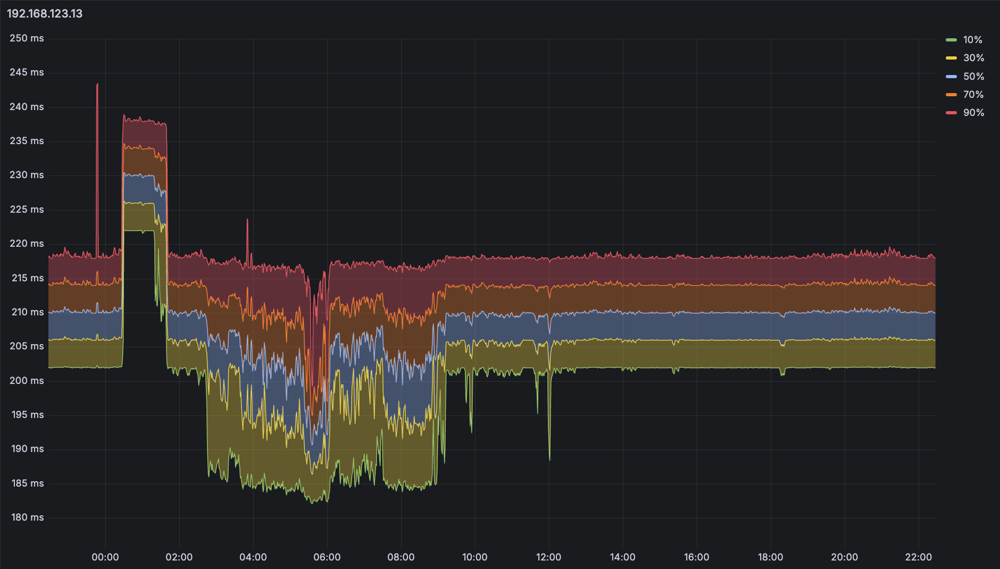
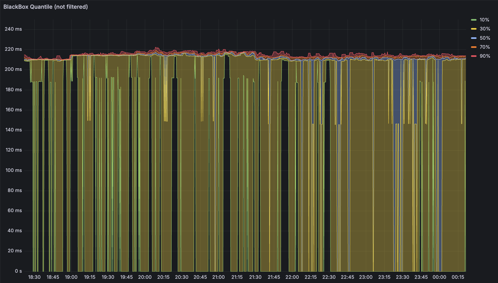
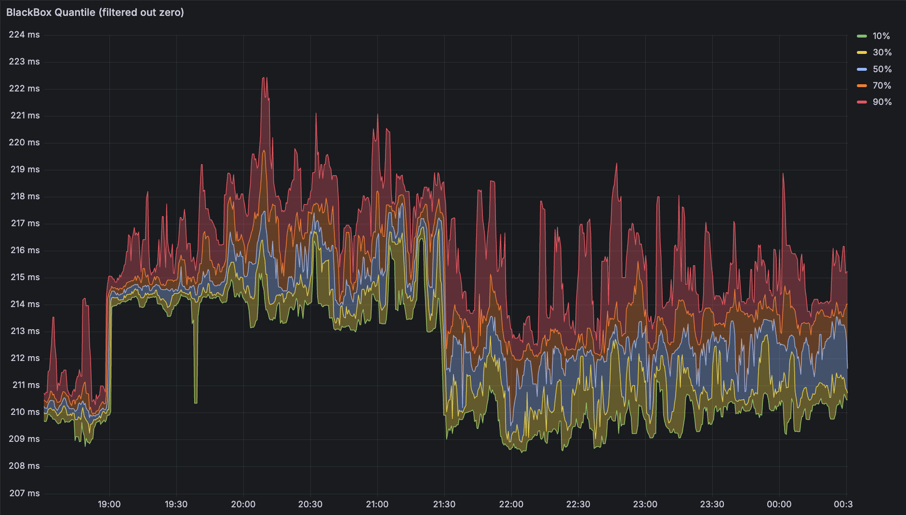
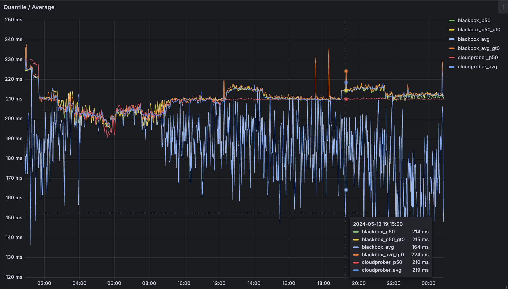

这次简单介绍一下如何更好的观测网络延迟，也简单介绍下草民的方案迭代流程。

草民做这件事的目的其实说起来非常简单。从公司到家的网络结构存在两种状态：通过旁边的阿里云 VPS 中转和 NAT 打洞直连。这两种状态下的网络存在许多区别，简单来说中转的延迟、带宽表现都不如直连，而且还会有一些奇奇怪怪的丢包问题（似乎是特定特征的 TCP 包在特定路径上有概率被丢掉，比如从公司到家的 TLS Client Hello 有的时候就百分百会被丢，但是同一时刻从家到公司的就不会被丢，或者从阿里云直接访问两端也都正常，不晓得是公司还是阿里云上有什么奇怪的防火墙）。



从上面这张图（怎么画出来的下面会介绍）可以看的出来有明显的两个不同等级的延迟：高一些的是中转，低一些的是直连。令人头疼的是，这两种状态的切换十分随机，并不能找到什么规律，于是考虑先收集信息记录下状态，遇到一些奇怪问题的时候也更容易确定是否是网络相关原因导致。

# Netdata to Smokeping to Grafana

起初是用 Netdata，它的优势是基本上开箱即用，内置的功能也确实是比较丰富。但是吧

* 着实是越升级广告越多
* 几乎不能做什么定制，至少也是非常困难
* 每个版本几乎都会多少引入一些不兼容的变动，比如把 FPing 干掉挪到 go plugin 里面去了，配置全都需要重新写

总之最终还是决定换掉，尝试了一下 Smokeping 这个比较传统的观测工具。

Smokeping 的一张图上的信息非常丰富：延迟、抖动、丢包都有，非常直观（下面随便找了一个网图



而且能支持的 Prober 也比较丰富，除了 Ping 还有 HTTP / DNS 之类（下面这个图是草民自己后面添加用来观测梯子状态的



Smokeping 用了半年左右，确实感觉不错，但也存在一些问题：

* Smokeping 确实是传统工具，但是传统到多少有些原始
    * Apache + CGI + Perl，二三十年前的方案吧差不多
    * 每次服务端起来先 Fork 出十来个 httpd 扔着啥也不干，很扎眼
    * 每个 http 请求再由 httpd 拉起一个 perl，更扎眼
* AnotherCurl 的问题比较多，但也没有很好的替代品
    * 每次探测都要拉起来一个 Curl 进程。像草民这种要观测十几个 Port 的情况下每次都要同时启动十几个 Curl，非常扎眼
    * 似乎不能区分 HTTP 状态码（HTTP 4xx 也会显示为成功），甚至超时也会显示成一个花了两秒钟的 Success

上面这些问题虽然说除了最后一个之外都不算是多大问题，但作为一个现代 Web 码农实在是看不得这个，还是决定换到 Prometheus + Grafana 这种相对现代一些的方案上。

# Blackbox Exporter

Prometheus 的话肯定要找个能用来做 Ping 和 HTTP 的 Prober，首先尝试了官方的 Blackbox Exporter，配置十分简单参考官方示例即可，只要注意如果放在容器里的话需要给它 `CAP_NET_RAW` 并且最好 `--net host` 就行了。

全都配置好之后可以访问它的默认端口查看每一次 Ping 的相关日志，很方便。日志里也会包括对应的 Metrics

```prometheus
# HELP probe_dns_lookup_time_seconds Returns the time taken for probe dns lookup in seconds
# TYPE probe_dns_lookup_time_seconds gauge
probe_dns_lookup_time_seconds 2.4943e-05
# HELP probe_duration_seconds Returns how long the probe took to complete in seconds
# TYPE probe_duration_seconds gauge
probe_duration_seconds 0.010389143
# HELP probe_icmp_duration_seconds Duration of icmp request by phase
# TYPE probe_icmp_duration_seconds gauge
probe_icmp_duration_seconds{phase="resolve"} 2.4943e-05
probe_icmp_duration_seconds{phase="rtt"} 0.00999028
probe_icmp_duration_seconds{phase="setup"} 0.000144807
# HELP probe_icmp_reply_hop_limit Replied packet hop limit (TTL for ipv4)
# TYPE probe_icmp_reply_hop_limit gauge
probe_icmp_reply_hop_limit 64
# HELP probe_ip_addr_hash Specifies the hash of IP address. It's useful to detect if the IP address changes.
# TYPE probe_ip_addr_hash gauge
probe_ip_addr_hash 3.5618281e+09
# HELP probe_ip_protocol Specifies whether probe ip protocol is IP4 or IP6
# TYPE probe_ip_protocol gauge
probe_ip_protocol 4
# HELP probe_success Displays whether or not the probe was a success
# TYPE probe_success gauge
probe_success 1
```

然后就可以用 `probe_icmp_duration_seconds{phase="rtt"}` 画图，当然要加上 `instance` 过滤。这个指标是一个 Gauge，简单来说就是只有一个值，一般都用来上报什么温度、连接数之类的。如果把延迟当作链路的固定物理属性的话，跟温度好像也能勉强算一类东西（



直接用这个指标画出来的图似乎很不稳定，经常会有一些极大值出现，影响对指标的判断；遇到丢包之类情况图上又会体现为 0 值，稍微丢一点儿包整个图就全都是大坑，几乎都没法看了。

另外，Blackbox 每次 Prometheus 发出请求时才触发 Ping，每次触发只能获取一个延迟数据，而 Smokeping 和 Netdata 则是利用 FPing 这样的工具，在单位时间内同时发出多个请求，汇总计算各种统计指标，因此可以比较直观的看到单位时间内延迟的分布情况，也能比较好避免极大值 / 极小值带来的一些误差。

# Cloudprober and Histogram

基于上述考虑，打算把 Blackbox 换掉。一开始找到了 [https://github.com/SuperQ/smokeping_prober](https://github.com/SuperQ/smokeping_prober/)，用了一阵儿发现它也有上面提到的 AnotherCurl 的 DNS 不更新问题，于是后面又改为使用来自 Google 后面单飞的开源项目 [https://github.com/cloudprober/cloudprober](https://github.com/cloudprober/cloudprober)，最前面的图就是用它画的。

Cloudprober 功能十分全面，支持很多协议，而且自带一个简单 GUI 可以显示成功率（这个 UI 就很有 Google 早期产品的风格，好评）



然而吧，同样可能是来自 Google 的关系，官方例子的配置用了 pbtext（都找不到能高亮这玩意儿的东西，虽然也可以用 yaml），而且文件结构相对比较复杂。比如下面分别是一个过代理的 HTTP（上图）和一个 Ping（下面的 Metrics 示例）：

```bash
probe {
  name: "http_18882"
  type: HTTP
  targets {
    host_names: "cp.cloudflare.com"
  }
  http_probe {
    proxy_url: "socks5://172.17.0.1:18882"
  }
  interval_msec: 2000  # 2s
  timeout_msec: 1000   # 1s
  latency_unit: "ms"
  latency_distribution {
    explicit_buckets: "350,370,390,410,430,450,470,490,510,530,550,570,590,610,630,650,670,690,710,730,750,770,790,810"
  }
}

probe {
  name: "tinc_local"
  type: PING
  targets {
    host_names: "192.168.123.6,192.168.123.9,192.168.123.10"
  }
  interval_msec: 2000  # 2s
  timeout_msec: 1000   # 1s
  latency_unit: "ms"
  latency_distribution {
    explicit_buckets: "1,2,3,4,5,6,7,8,9,10,11,12,13,14,15,16,17,18,19,20,21,22,23,24,25"
  }
}
```

上面的 Ping 配置会提供下面这些 Metrics，类型是一个 Histogram

```prometheus
# TYPE latency histogram
latency_sum{ptype="ping",probe="tinc_local",dst="192.168.123.9"} 1684996.3836719608 1715487313802
latency_count{ptype="ping",probe="tinc_local",dst="192.168.123.9"} 312458 1715487313802
latency_bucket{ptype="ping",probe="tinc_local",dst="192.168.123.9",le="1"} 0 1715487313802
latency_bucket{ptype="ping",probe="tinc_local",dst="192.168.123.9",le="2"} 4 1715487313802
latency_bucket{ptype="ping",probe="tinc_local",dst="192.168.123.9",le="3"} 8794 1715487313802
latency_bucket{ptype="ping",probe="tinc_local",dst="192.168.123.9",le="4"} 90244 1715487313802
latency_bucket{ptype="ping",probe="tinc_local",dst="192.168.123.9",le="5"} 187305 1715487313802
latency_bucket{ptype="ping",probe="tinc_local",dst="192.168.123.9",le="6"} 251947 1715487313802
latency_bucket{ptype="ping",probe="tinc_local",dst="192.168.123.9",le="7"} 283316 1715487313802
latency_bucket{ptype="ping",probe="tinc_local",dst="192.168.123.9",le="8"} 295765 1715487313802
latency_bucket{ptype="ping",probe="tinc_local",dst="192.168.123.9",le="9"} 301300 1715487313802
latency_bucket{ptype="ping",probe="tinc_local",dst="192.168.123.9",le="10"} 304163 1715487313802
latency_bucket{ptype="ping",probe="tinc_local",dst="192.168.123.9",le="11"} 305952 1715487313802
latency_bucket{ptype="ping",probe="tinc_local",dst="192.168.123.9",le="12"} 307089 1715487313802
latency_bucket{ptype="ping",probe="tinc_local",dst="192.168.123.9",le="13"} 307865 1715487313802
latency_bucket{ptype="ping",probe="tinc_local",dst="192.168.123.9",le="14"} 308415 1715487313802
latency_bucket{ptype="ping",probe="tinc_local",dst="192.168.123.9",le="15"} 308852 1715487313802
latency_bucket{ptype="ping",probe="tinc_local",dst="192.168.123.9",le="16"} 309174 1715487313802
latency_bucket{ptype="ping",probe="tinc_local",dst="192.168.123.9",le="17"} 309446 1715487313802
latency_bucket{ptype="ping",probe="tinc_local",dst="192.168.123.9",le="18"} 309689 1715487313802
latency_bucket{ptype="ping",probe="tinc_local",dst="192.168.123.9",le="19"} 309899 1715487313802
latency_bucket{ptype="ping",probe="tinc_local",dst="192.168.123.9",le="20"} 310036 1715487313802
latency_bucket{ptype="ping",probe="tinc_local",dst="192.168.123.9",le="21"} 310185 1715487313802
latency_bucket{ptype="ping",probe="tinc_local",dst="192.168.123.9",le="22"} 310311 1715487313802
latency_bucket{ptype="ping",probe="tinc_local",dst="192.168.123.9",le="23"} 310417 1715487313802
latency_bucket{ptype="ping",probe="tinc_local",dst="192.168.123.9",le="24"} 310513 1715487313802
latency_bucket{ptype="ping",probe="tinc_local",dst="192.168.123.9",le="25"} 310609 1715487313802
latency_bucket{ptype="ping",probe="tinc_local",dst="192.168.123.9",le="+Inf"} 312458 1715487313802
```

Histogram 就是直方图「📊」。简单讲会将原始数据先按照预先指定的桶进行分类，汇总后提供给 Prometheus，汇总后的数据包括 Sum、Count 以及将数值分桶汇总后每个桶命中的次数。这里桶的参数是需要手动指定的，比如上面这个示例 Metrics，分桶参数就是上面配置里面的 `1,2,3,4,5,6,7,8,9,10,11,12,13,14,15,16,17,18,19,20,21,22,23,24,25`。利用这个 Metrics 可以画出最前面的那张 Heatmap 很直观的表示出单位时间内延迟数据的分布情况，颜色越深密度越大。

Histogram 还可以取出百分比分布。选择另一台机器 `192.168.123.13`，在 Grafana 中画出下面五条线：

* 10% `histogram_quantile(0.1, sum(rate(latency_bucket{dst="192.168.123.13"}[3m])) by (le))`
* 30% `histogram_quantile(0.3, sum(rate(latency_bucket{dst="192.168.123.13"}[3m])) by (le))`
* 50% `histogram_quantile(0.5, sum(rate(latency_bucket{dst="192.168.123.13"}[3m])) by (le))`
* 70% `histogram_quantile(0.7, sum(rate(latency_bucket{dst="192.168.123.13"}[3m])) by (le))`
* 90% `histogram_quantile(0.9, sum(rate(latency_bucket{dst="192.168.123.13"}[3m])) by (le))`

再利用 Series Override 中的 Graph Style > Fill Below To 进行颜色填充：



从这张图上得到的结果其实就已经有点 Smokeping 那味儿了，调整一下颜色和透明度几乎可以以假乱真，但是对于上面这张图（192.168.123.13 是一台海外机器）似乎大部分时间几条线都是平行的，这就是接下来要谈到的「预先指定分桶」带来的精度问题了。

# Better than Histogram

上图桶参数为 `100,120,140,160,180,200,220,240,260,280,300,320,340,360,380,400,420,440,460,480,500,520,540,560,580,600`，这是一个考虑了这台机器实际情况后做出的设置，可以看到每个桶间隔都是 20ms，也就是说无法区分 20ms 以下的延迟波动。事实上这台机器的延迟大部分情况下都是一条直线，但因为分桶精度问题，百分比分布只能假设为在这个桶的范围内均匀分布，画出来就是 200ms - 220ms 之间几乎平行的五条线。

Histogram 有这样的精度问题，那有没有什么解决的办法呢？

## Summary

客户端可以直接上报单位时间内的聚合后指标（平均数、中位数、特定的百分比分布比如 99% 等），查询时直接查询聚合后指标，无需在 Prometheus 上重新聚合。聚合后的值仍然可以保证精度，不像 Histogram 那样只能按照落到的一些范围做统计。

Prometheus 自身的一些指标就以这样的方式进行了上报：

```prometheus
# HELP prometheus_engine_query_duration_seconds Query timings
# TYPE prometheus_engine_query_duration_seconds summary
prometheus_engine_query_duration_seconds{slice="inner_eval",quantile="0.5"} 0.004375506
prometheus_engine_query_duration_seconds{slice="inner_eval",quantile="0.9"} 0.008412444
prometheus_engine_query_duration_seconds{slice="inner_eval",quantile="0.99"} 0.013798053
prometheus_engine_query_duration_seconds_sum{slice="inner_eval"} 25.749239202999888
prometheus_engine_query_duration_seconds_count{slice="inner_eval"} 8276
```

直接使用 Summary 上报关键指标（比如 p50，p99 等）可以很好避免 Histogram 的精度问题，但是 Summary 自身也有一些局限：

* Summary 的计算成本比较高：每次更新这个值都可能需要操作一个全局锁，遇到非常频繁更新的情况，这个锁就可能会成为瓶颈，而 Histogram 只需要一些 Atomic 的数值即可。
* Summary 的指标不能再做聚合：比如某个集群中两台机器分别上报自己某指标的中位数是 0.5 和 0.6，计算整个集群的中位数并不能简单的把两个数平均一下。

大概是由于上述问题的存在，Summary 类型似乎并不常见于大多数工具 / 框架中，Prometheus 官方也建议 SDK 作者优先实现 Histogram

## Native Histogram

为了解决 Histogram 预先指定分桶导致的精度问题，Prometheus 目前也推出了实验性质的 Native Histogram

> NOTE: Beginning with Prometheus v2.40, there is experimental support for native histograms. A native histogram requires only one time series, which includes a dynamic number of buckets in addition to the sum and count of observations. Native histograms allow much higher resolution at a fraction of the cost. Detailed documentation will follow once native histograms are closer to becoming a stable feature.

目前 Prometheus 的这一特性还很不稳定（甚至可能会导致 TSDB 崩溃），文档也并不完善，所以先挖个坑，等到后面这个特性相对稳定之后应该可以尝试一下

# Back to Gauge

除了在单位时间内的数据上跟聚合死磕之外，有没有可能还是可以回到 Gauge 类型，考虑另一个维度上的聚合：

* Prober 平均每 i 秒钟发出一个 Ping，然后可能会对结果做聚合
* Prometheus 每 j 秒获取一次 Prober 聚合后的数据
* Grafana 画图时取 k 秒范围内的点，对这 n 个点进行聚合即可

继续拿出 Blackbox，Prometheus 抓取的时候它当场发出请求所以 i 和 j 相等，那么假设在配置文件内设置 6s 抓取一次，每次聚合取出 3 分钟范围的数据，那么 n 就是 30，可以拿来聚合了。Prometheus 提供了 `quantile_over_time` 函数，也同样可以画出五条线：

* 10% `quantile_over_time(0.1, probe_icmp_duration_seconds{phase="rtt", instance="192.168.123.13"}[3m])`
* 30% `quantile_over_time(0.3, probe_icmp_duration_seconds{phase="rtt", instance="192.168.123.13"}[3m])`
* 50% `quantile_over_time(0.5, probe_icmp_duration_seconds{phase="rtt", instance="192.168.123.13"}[3m])`
* 70% `quantile_over_time(0.7, probe_icmp_duration_seconds{phase="rtt", instance="192.168.123.13"}[3m])`
* 90% `quantile_over_time(0.9, probe_icmp_duration_seconds{phase="rtt", instance="192.168.123.13"}[3m])`

一样做颜色填充后可以得到下面这张图，可以看到这张图顶部的线范围明显更小，说明精度提升有效



但是又受到了丢包导致 Scrape 到 0 的影响。那么用什么办法处理呢？

* 丢包不频繁的话把 Range 范围拉大一些。坏处是曲线与实际情况 gap 变大，而且对于丢包频繁的情况效果不好
* 筛掉 0 点。可以使用 Prometheus 的子查询完成：[https://prometheus.io/docs/prometheus/latest/querying/examples/#subquery](https://prometheus.io/docs/prometheus/latest/querying/examples/#subquery)

尝试子查询 `quantile_over_time(0.1, (probe_icmp_duration_seconds{phase="rtt", instance="192.168.123.13"} > 0)[3m:6s])` 其中 Range 的第二个参数（分辨率）最好与 Prometheus 的 Scrape Interval 一致，否则用不用子查询的两条线不重叠，看起来会很奇怪。

成功筛掉 0 点之后，图就很完美了。如果真的链路特别差以至于一段时间全是 0，图上的线会直接断开，不影响正常读图。



这张图上也可以更清晰的看到精度提升带来的信息量增加。接下来把上面几种方式得到的数据做一下对比

# Comparisons

依然选择 `192.168.123.13` 这个丢包比较严重的海外机器，把用几种方式得到的中位数 / 平均数叠在一张图上观察：



上面这张图可以比较明显看出几种指标的对比。平均数在不筛掉 0 的情况下偏差非常大，筛掉 0 的情况也可能受到波动带来的极大值影响，利用参数为间隔 20ms 的 Histogram 分桶得到的中位数则无法感知到 5ms 左右的延迟波动。

回到最开始的目标：利用 Ping 观测延时，综合下来，对比几个指标，个人觉得如果只能画一条线的话，选择 Gauge 筛掉 0 值之后，在时间维度上聚合得到的中位数最好。如果可以多画几条线的话，基于 Gauge 筛掉 0 值之后画百分位分布能够提供最多的信息。

# Service / Prober

从上面针对 Prometheus 提供的不同数据类型的讨论不难想到：不同的应用，统计延迟的方式也会有所不同。

* HTTP / RPC 之类，单个请求一般几十毫秒，两次 Scrape 之间可能产生非常大量的数据，因此在单位时间内做聚合统计属于刚需
* Ping 之类，固定间隔持续探测，频率一般远小于 Service，可能几秒甚至几分钟进行一次，不太关心单位时间内的分布情况

一句话总结：服务类型的应用还是需要 Histogram 做单位时间内的聚合，而探针则是使用跨时间范围的聚合效果更好。

# End

Gadgets (2024) 已经在路上了，会按期发出来；Vacation 2024.1 应该会稍微推一推，到六月下旬吧。

以及，关于 Self Hosted 1 里提到的订阅同步，突然有了个似乎还不错的主意：从网络拦截，具体来说是做一个明文 HTTP 转发工具，利用转发请求做触发的同时取出原文进行维护，这样几乎可以实现所有的目标：

* 对 RSStT 零侵入（仅仅是要把 RSStT 的订阅地址改一下以完成 HTTPS 拦截，几乎没有什么影响）
* 同步触发（只有一个触发源）
* 零重复请求（RSStT 请求一次，同时作为双方的结果）
* 无需额外做订阅同步（因为触发在外部完成，外部不触发的话不会产生变更，已经退订的也只会有一些历史数据，几乎没有影响）

总之大概会是一个效果非常好的方案。这个应该马上就会开始做了（
