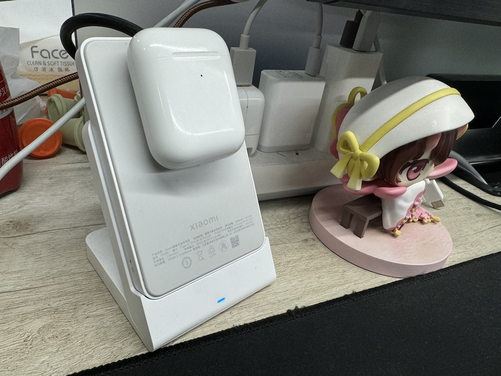

端午假期例行更新，不过有一说一，感觉这次买到的东西有意思的并不算多（也可能是电子那啥又加重了

# 啪啪币

凑单买的，里面的结构就是两片金属，每一片中间有 6 个小磁铁互相吸住，中间夹一个类似滚柱轴承一样的东西，搓起来就会啪啪啪响


其实比想象中无聊，主要是磁铁略少，搓一下 60 度不容易连贯起来，体验一般。搓了几天就失去兴趣了

# 又买了一个 Yeelight 的旋钮

跟之前挂墙的基本上一样，只是改成用魔术贴固定，供电也换成一个 3V 小电池了


蓝牙协议破解了（[https://github.com/custom-components/ble_monitor/issues/999](https://github.com/custom-components/ble_monitor/issues/999)，上面那张图也是这个里面偷来的），所以说可以拿来多做点事儿，也许可能拿来整个 Windows 上的旋钮，不过这玩意儿的回报率挺低的，不确定效果怎么样

因为懒，上面的想法并没有能得到执行，实际上还是放床头柜抽屉里用来在不睁眼（戳手机）不出声（叫小爱同学）的情况下开关吸顶灯

# iPod Shuffle 4

Telegram 二手🐎频道偶然刷到的。到手看着它的数据线就很难忍住来一波如图所示操作（图上那个 Type-C 小尾巴也是苹果的


虽然是老东西了，但是续航还不错，重点在于关机的时候终于不会偷偷掉电了，比近几年用过的 MP3 都省心很多。用一根很短的线接在大耳上听歌非常方便（顺便这个耳机还是从贵协某位大佬那里买的，之前吃灰了好几年，现在住处稳定下来用这个真的很舒服，各方面都很好


唯一可惜就是容量偏小，所有歌都只能压到 192kbps AAC 然后刚刚好能塞下三百首，多一首都塞不进去。

# 米家智能音频眼镜

去年在长沙玩的时候眼镜掉水里之后买的。


稍微用了一阵儿，评价为作为眼镜和耳机都不算好用

* 镜片离眼镜太远，眼睛很疲劳（当然不排除是因为草民眼睛度数不小，还担心不适应所以用了价格比较低但是折射率也比较低的镜片
* 镜腿儿太粗，戴上的时候会把眼睛掰开一个小角度，而且贴在头上的部分很容易出汗。还好顺便买了普通镜腿，那个就舒服的多得多
* 开阔声场，嘈杂的地方听不见声音，安静的地方容易打扰别人，有一说一镜腿儿夹那么紧为什么不做成骨传导呢

之前大半年基本都在吃灰，结果这几天，一不小心把去年在长沙配的眼镜框搞坏了，所以就继续用这个，不过大部分情况下还是用普通镜腿。话说回来戴了一阵儿基本上也习惯了，不太觉得眼睛疲劳了，但还是完全不想用它的耳机腿儿

# Xbox One X

2019 年年底买的（结果前面几年的 Gadgets 都没写评价），后面好几年基本都在吃灰。在成都稳定下来之后觉得不如当个电视盒子，就拿过来了（顺便还拿来了两个老 TI 计算器）。


有一说一天蝎座这个造型是真好看。但是吧这玩意儿现在来看多少有点难绷

* 玩游戏吧确实能玩，毕竟上世代主机也不算特别过时（看看隔壁的 Switch），当然就还是得买游戏或者 XGP
* 电视盒子就很难，B 站 UWP 没了，Edge 看 B 站卡的一逼（无 JIT，视频解码只能 H264，就算这样也还动不动就标签页 OOM
* 别的也没法干，UWP 应用你们懂的，而且还缩放比例强制 300% 就很离谱（虽然在已经很没用的情况下，这也算不上有什么影响

评价为没什么球用，要不是考虑手柄操作方便，感觉甚至不如 R86S 有用，只能放电视旁边吃灰。还是等下一代 PS 吧。

# 鼠标防滑贴

罗技鼠标真的必备。防滑还是次要的，主要是可以很好避免鼠标本身的表面橡胶老化（甚至说老化了也可以直接眼不见心不烦


草民目前只贴了左手大拇指那块儿，把老化最严重的部分盖住，不过目前看不太够，回头还是搞个全覆盖的

# iPhone 15 Pro Max 原色 + 图拉斯 O1S 支点壳

首发下单，等了一个月才收到，到手亏一千，哭死。这个壳抱一推荐了好几次，实际用下来确实不错，阻尼到位，就是多少有些贵


另外还从马老板那里蹭了个膜，带一个贼好的治具，可惜没注意上下贴反了。说回本体

* 灵动岛 / 拍照 / 常显 / 高刷这些确实不错
* 电池还行，更新几次系统后，续航基本稳一天。端午第一天早上七点出门，差不多十二个小时在外面，回来剩下 15%
* Type-C 充电速度一般般，但是好在终于可以抛弃 Lightning 线了
* 信号中等偏下，高通基带也还是不如红米
* 发热不行，打痒痒鼠时间长一点的话无线充电直接提示过热暂停，跟 iPhone 8 一个德行

16 大概率是不会换了，听说 17 可能会有一款摄像头居中的，到时候再看

# 小米的 MagSafe 电池 + 底座

在公司就吸上，基本上工作日手机电量不会掉下 90%，也不太影响到处拿着跑，比插线方便很多。但是充电功率比较低，就算不考虑上面说的温度问题，打游戏的时候也基本上充不进去（影响不大，毕竟在公司偶尔拿下来摸一下鱼差不多得了

顺便它可以用一个非常刁钻的方式给 AirPods 2 充电，但是吸不住，一碰就掉下来了，需要沾一点水增加接触面积（或者也可以拿下来放平



旁边是陪伴多年的小桃花（最后有一张清楚的）。所以在公司可以彻底抛弃 Lightning 线了（虽然包里还是会带一根

# 小米毛球修剪器

强迫症救星系列（图为产品详情页里面的示意，实际不是透明的


简单可靠好用的小工具，每个家庭都值得拥有一个。

# DJI Osmo Mobile 5

为了在 LiveHouse 里稍微放松一下双手买的，感谢杨老师便宜出手，恰好他这一代可以拉开几十厘米，完美


比较难绷的是 App 没有 Dolby Vision，拍出来的东西完全没有 HDR，哭死。追踪也不算好用吧。评价为慎用 App，其他的还凑合

# ZMI 20 号移动电源

ZMI 现在叫酷态科，有一说一紫米确实不是啥好人但是 ZMI 能整出这事儿也实在是过于抽象

这个电源就卡着 100WH 的线，实测上地铁高铁都无问题，可以带，飞机理论上也是可以的


顺便买了一根弯头的小米魔改 Type-A 转 PD 线，放床上用来专门伺候 MacBook Pro

# 龙芯 3A6000 NUC

某个群里 2599 买了首发 16G（没注意品牌）+ 256G（PC005），现在狗东应该比这个再贵个两百块左右。目前还没太深入折腾，简单写一点初步印象，后面会再有一个篇幅长一点的折腾记录

* CPU 性能确实还不错，跑个 OpenWrt 构建差不多十五六分钟，完全够用；GPU 应该是指望不上的
* 官方 OpenWrt 支持了（但是有限，比如没有 squashfs 和有线网卡驱动），另外自举会有很多问题，构建还是需要 x86
* 自带螃蟹无线网卡纯纯电子垃圾，建议换 QCNFA765（去年介绍过，客户端角度来说算是 WiFi6 毕业卡），AOSC OS 直接可以用
* 网口坏一个很烦（截止端午能买到的两三款龙芯 NUC 方案应该差不多，两个网口都只能用一个），希望官方下半年真的能解决这问题
* 主线内核上好多 IOMMU 之类的还没的支持，加上上面坏一个网口这事儿，估计当软路由得等很久，甚至可能就没戏了

这机子除了 NVME 之外顶盖下面还有个 2.5 寸的盘位，草民现在是装了个 SATA 转 MSATA 把之前 DIY NAS Project 里面那个老的 20G SSD 拿来利用了一下（那玩意儿买来马上九年了，连续通电看 SMART 是 20000 小时但感觉实际上得是这数两倍以上


目前装了新世界 AOSC OS，但就目前它这个情况就很尴尬，也不知道拿来干什么用

# MT7925

据说是老卡魔改，不过看了一下 OpenWrt 刚好有驱动，就决定买来试试看。分别装在龙芯 NUC 和 R86S 上都试了试，一句话，电子辣鸡


_旁边的是龙芯 NUC 带的 RTL8822CE，卧龙凤雏，都是电子辣鸡_

龙芯上直接就能跑，但是特别搞笑：如果从 NUC 发起 Ping 的话延迟很低，比上面现在装的 QCNFA765 还要低，但是其他的情况下就非常非常离谱，轻则 Ping 延迟一百多毫秒，重则 ARP 都不更新，从外面 SSH 进去都费劲的要命 = = 也不知道是怎么做到的。

虽然也没抱什么希望但还是给它了个面子，装到了 R86S 上。驱动的话，OpenWrt 构建的时候选上 `mt7925-common` 和 `mt7925e` 就可以了，但是 Makefile 里面写的内核模块的加载有些问题，这个倒是简单，把 `/etc/modules.d/mt7925e` 的内容改对成 `mt7925e` 就行，也可以直接改源代码里的 Makefile 再重新构建

```patch
diff --git a/package/kernel/mt76/Makefile b/package/kernel/mt76/Makefile
--- package/kernel/mt76/Makefile
+++ package/kernel/mt76/Makefile
@@ -341,17 +341,17 @@
   $(KernelPackage/mt76-default)
   TITLE:=MediaTek MT7925U wireless driver
   DEPENDS+=+kmod-mt792x-usb +kmod-mt7925-common
   FILES:= $(PKG_BUILD_DIR)/mt7925/mt7925u.ko
-  AUTOLOAD:=$(call AutoProbe,mt7921u)
+  AUTOLOAD:=$(call AutoProbe,mt7925u)
 endef
 
 define KernelPackage/mt7925e
   $(KernelPackage/mt76-default)
   TITLE:=MediaTek MT7925e wireless driver
   DEPENDS+=@PCI_SUPPORT +kmod-mt7925-common
   FILES:= $(PKG_BUILD_DIR)/mt7925/mt7925e.ko
-  AUTOLOAD:=$(call AutoProbe,mt7921e)
+  AUTOLOAD:=$(call AutoProbe,mt7925e)
 endef
 
 define Package/mt76-test
   SECTION:=devel
```

还有一个问题是 OpenWrt 没有直接带 MT7925 的固件，这个倒是也简单，复制这两个文件到对应的地方就行

```bash
# pwd
/lib/firmware/mediatek/mt7925
# ls -al WIFI*
-rw-r--r-- 1 root root  210656 Feb 21 23:11 WIFI_MT7925_PATCH_MCU_1_1_hdr.bin
-rw-r--r-- 1 root root 1086064 Feb 21 23:11 WIFI_RAM_CODE_MT7925_1_1.bin
```

这两个文件在 [https://github.com/openwrt/mt76/tree/master/firmware/mt7925](https://github.com/openwrt/mt76/tree/master/firmware/mt7925) 就有，当然也可以自己修 Makefile 加上

上面两个问题修掉，直通进 Hyper-V 虚拟机，然后 LuCI 里面正常设置一下 AP 就可以用。粗略用了一个多小时下来感觉：

* Ping 确实比 QCA6391 低一点，算是唯一的优点了
* 没有 MT7922 那个直通之后重启虚拟机，设备直接消失的问题，算是起码的吧
* 非常不稳定，比 MT7921K 还差劲，动不动内核就 Message Timeout，甚至用到后面，驱动连 Reset 都做不到了
* 发射功率低非常非常多，感觉比 QCA6391 少 10dB 差不多。同样隔一堵墙，之前 iPad 信号满格的地方这张卡就剩一两格

评价为电子垃圾，本来想着不好使就装到龙芯里面，结果不得不说还是不要靠近联发科，会变的不幸。

预定还要买 MT7927（虽然，又是联发科）/ QCNCM865（高通），但是这俩现在实在是贵的离谱，OpenWrt 还俩都没驱动，起码也明年见了；然后可能会再买一张 QCA2066 但这张现在也有点贵，看着跟 QCA6391 区别也不大（更像 QCNFA765，所以说高通整的这一堆破玩意儿），OpenWrt 也没带固件。。。不一定买，看情况吧

# uConsole

等了半年发货了，直接国内顺丰标快（笑死，地址不知道怎么还写成双流区怡心街道了


安装过程比较简单，甚至自带一张装好系统的 TF 卡。装好之后浅浅玩儿了几天

* 跟预想的一样屏幕前面没有任何保护
* 键盘很烂。。。手感很一般，背光不均匀，各种丢事件
* 无线用的好像是树莓派同款，但是信号特别烂，特别特别烂，跟光影猫差不多一个水平那种烂，烂的简直难以理解
* 做工不太好，除了上面说的背光不均匀之外，主要体现为各种公差（金属后盖右边缝隙巨大，还好一套泰式按摩基本掰回来了
* 又一次踩了国产 SOC 完全不考虑系统维护的坑，R01 只有一个魔改 5.4 内核上跑的魔改 Ubuntu 22.04，还好有内核源代码

看了一下 [https://github.com/clockworkpi/uConsole/blob/master/Code/patch/r01/20230614/r01_v1.01_230614.patch](https://github.com/clockworkpi/uConsole/blob/master/Code/patch/r01/20230614/r01_v1.01_230614.patch) 大部分改动似乎都只是 DTS、默认配置什么的，真的涉及到驱动的改动基本都是一些细枝末节，似乎也可以试试基于 OpenWrt 上的 d1 target 简单改一下放上去。另外顺便尝试启动了一下 Ubuntu 24.04 RISC-V（跟 MangoPi 一样用那个 Lichee RV Dock 的

* 能通过 HDMI 显示、能从 TF 卡启动到登录界面
* USB 接口 / 键盘（这个也是走 USB）/ 自带屏幕完全没反应
	* 基本可以确定是 GPIO 控制的 +5V 供电没有出来（很多小破路由器都这么干。估计还得改 DTS 导出 GPIO
  * 因为 USB 没反应，UART 线又不太好接，啥也操作不了，摆了

其实能启动就还不错，要是有办法把 USB 的电源先拉起来的话，应该就只剩屏幕和电池要操心，感觉似乎也不是不能试一试干脆 DKMS？顺便也试了一下 OpenWrt 官方 D1 镜像，Lichee RV Dock 和 MangoPi Pro 的都起不来，HDMI 一点动静都没有，不知道是什么问题

总结下来，这玩意儿除了看起来不像塑料小人之外，拥有塑料小人的很多特点：

* 看起来贼几把炫酷，但是基本上只能用来看
* 某些组件非常脆弱，一不小心可能就干碎了
* 有的地方做工一般，不得不想办法忍受公差
* 价格都在一千上下，下单还得等个半年出荷

估计最终的归宿也是跟塑料小人一样扔柜子里面吃灰去了，如果能搞定上面的内核的话大概也许可能搓一个 OpenWrt 出来至少利用一下

# End

除了上面买了一些醋酸胶带、键盘刷、双面胶片儿什么的小东西，比较懒就不再介绍了。

最后今年没找到好看的猫猫了，附赠一个上面出现过的桃桃吧。可惜这家店也凉了好久了（


下一个是 Vacation 2024.1，端午回来整。
