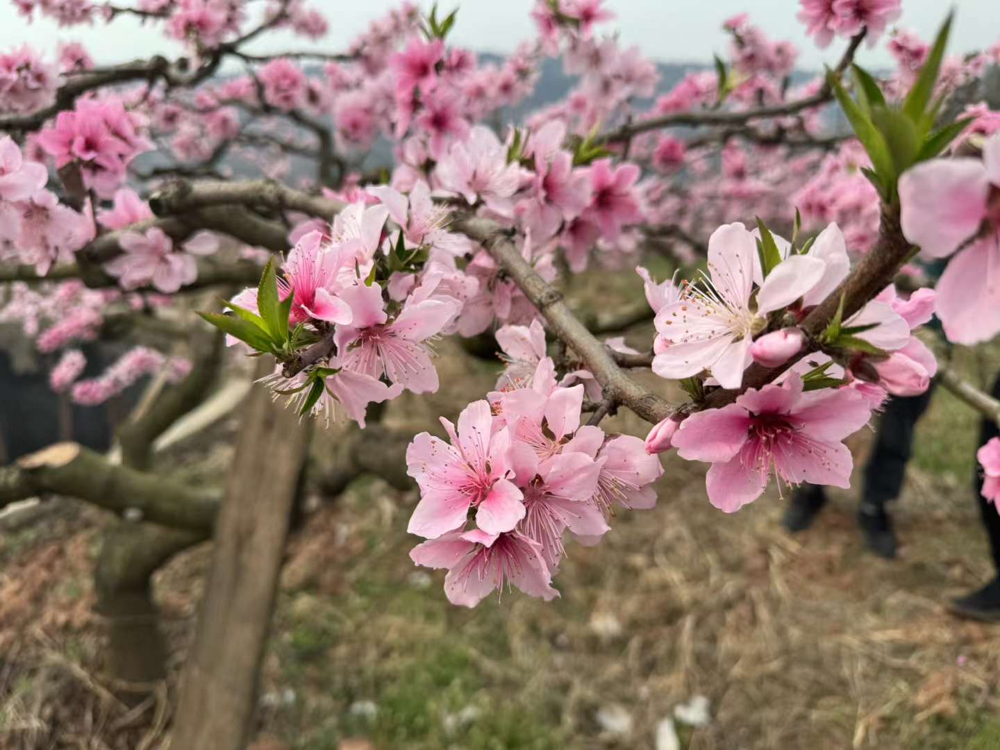
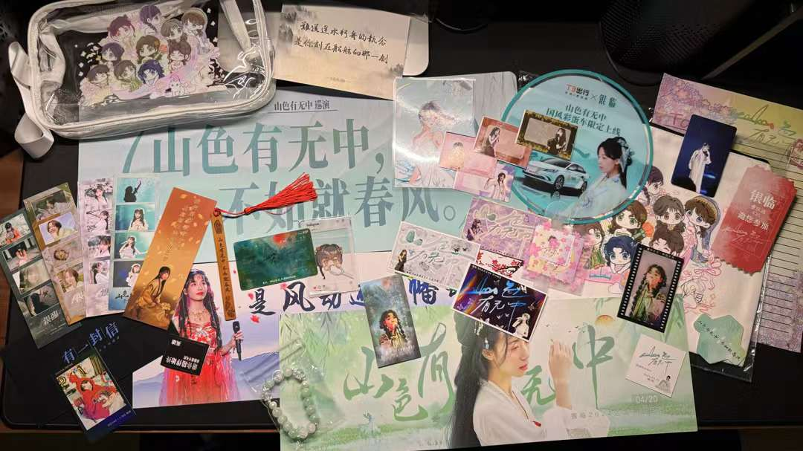

端午回来，上半年的活就算整完了。没想到的是，数了一下竟然每个月基本都会出去一两趟，虽然大部分都是之前去过，或者市区里随便溜达着就过去了的地方。所以这次也就不打算额外扯太多细节

# 12.30 峨眉山

算是个不太成功的二周目，主要表现为各种原因导致的时间不够用。一周目的记录最终也没写，这儿简单糊一个

* 报国寺：上山的公交车站旁边（约等于车站），节假日人多早上七点就去排队比较好
* 零公里：开车最远到的地方，再往上还是得坐车
* 雷洞坪：上去的车一般都到这儿，坐车上来一个半小时左右。旁边就是金顶步道起点，也有索道上下；提示牌上说一个半小时到金顶最好别当回事，怎么也得走个两到三个小时吧；索道很快，下去几分钟，当然排队需要可能十几分钟，建议循环式索道，往复式听同事说体验较差
* 从雷洞坪车站往后山（下面两个地方）坐车 1 号口。坐车需要花的时间：
  * 万年寺（一个小时）：上次看没看都不记得了，这次反正没看（至于下次，怕是一定没下次了
  * 五显岗（清音阁）（加半个小时）：猴区入口，路比较好走，不过出来得走回头路；下山的车六点收摊关注时间。这一片民宿很多，但冬天又冷又枯水期，其实也可以考虑夏天来这边住一次（这 flag 上次就立了然而时隔六年还是没回收

时间不够用就体现在这：上次往猴区里面走了很远，差不多走到头又走回来，但这次只进去很小一段路，基本上看见下面这只素质极差的猴子就打道回府了。从清音阁出来坐车回报国寺大概二十来分钟，中间会先路过黄湾，那里应该是有直接到高铁站的免费班车，当时就突然有个想法：周末去猴区转悠的时间成本跟去青城后山差不多，车票也差不多，但是门票贵不少（20 vs 淡季 110）。结论：还是算了

另外补充一点这次可参考的东西：

* 酒店：城市便捷酒店，就在公交站旁边，很不错，价格也很便宜
* 装备：最好带点食物（早餐如果晕车的话自行考虑），冰爪 8 块钱的就行但一定要带（否则遇上天气不好的话真·寸步难行）；提前看小红书上有个天气预报的号决定穿啥，不过不建议太厚容易闷一身汗，凉风再一吹就寄了
* 顺便，又去了一次旁边的灵秀温泉但是人好多。。。这个没什么说的自己带个泳裤就行，他们会提供浴巾拖鞋，然后他们家似乎扩展了温泉酒店业务但就是多少有点贵；只泡温泉的话可以找酒店代预定，可能能比自己在小程序上定便宜几块十几块；然后他们这次里面多整了不少活儿看不看的都行，池子的温度梯度似乎跟上次不一样自己注意吧（

这个不出意外应该真不会三刷了（除非真的确定要住在猴区里面的民宿

# 1.20 青龙湖

网络热门话题之：无奖竞猜图上是什么花（提示：花瓣缺口 & 花托

住周围的话还不错，适合作为周末放松心情的地方，但草民这种南门居民平常来一趟着实略远。期待一下规划中的骑龙公园吧（

# 2.11 青羊宫

过年期间好几天都在瞎转悠，基本上就是跟着爹妈跑了几个庙烧香，加上什么望江楼之类的老地方

至于把这一天拎出来的原因，除了这个牌子有点意思之外，主要还是差一点就能偶遇阿先生了（

# 3.23 桃花故里

大概算一种年常吧（小竹说草民有执念，评价为确实）。比较意外的是居然摇到了黎老板（

虽然花期有所延迟，但是人比去年还多，主要还是时间窗口就两个周末，赶早不赶晚了。柴火鸡还是挺好吃。虽然这波七月天又贼热，而且周末基本都安排贼满，之前说的上山摘桃子估计比较悬了（

# 4.20 银临 Live

过程有些崎岖（比如年前抢票、当天抢号啥的都不算顺利）但结果还是很好的。感谢马哥陪草民一起玩（

感谢神仙们系列（有一说一 T3 那个彩蛋车真的有人打到嘛

这次终于成功拿到了老粉证明！

隔天顺便找黎老板又蹭了个饭（以及例行喝茶颜悦色），某种意义上也属于是保留节目了（这张照片看着真的是胖了好多啊

后面坐等四专实体版啦，以及预祝帝都的最终场一切顺利（草民就肯定不会去了

# 5.4 熊猫基地

这个真的是三刷了。好热，热到室外都没有熊猫营业（当然也可能是因为下午才去的吧

新馆还不错，虽然还是溜了一圈回去南边旧的那一片，以及没怎么看见孔雀。这个真的说什么都不再去了（

# 5.18 叶里 Live

最靠前的一次，里少笑起来真好看（草民就表情管理大失败

作为一个关注八年多但拢共没认真听过几首歌的假粉，这波确实是听爽了，以及还是感谢神仙们系列（很难受的是一个手滑把签名抹花了

说不定大概也许明年又可以成为找黎老板蹭饭的理由（

# 5.25 摘樱桃

上次时间几乎都花在路上了，这次计划的比较早，路上基本没堵车节省了很多时间，但到了那边人还是太多所以上去也耽误了些时间；至于回来的路上连续两个加油站加不上油，以至于不得不绕到汶川的事儿就，只能说很有节目效果吧。另外大概因为来太早，摘到的东西品质确实不如去年（主要是不算很熟吧），下次还是稳一手

回来之前顺便花一个小时去羌寨里面溜了一圈，门票三十块，还挺有意思。他们那边的建筑很有当地风格，里面绕来绕去真跟迷宫一样而且四通八达，材料基本都是当地某种有强烈金属光泽的片状岩石，不知道具体是什么矿物

开始写这个的时候（六月底）又买了点看起来很紫很大那种樱桃，但实话说味道很是寡淡，吃起来真的远不如当时摘的

# 6.8 都江堰

大概也算是三刷了，虽然第二次只在外面古城溜了一圈。有一说一离堆公园那一站怎么看都太像是地铁站了吧（

顺便推荐一下 [BV1Ni4y1e7GL](https://www.bilibili.com/video/BV1Ni4y1e7GL)，这个 up 的视频质量确实不错

# 6.10 安康

去参加学弟的婚礼。刚好端午当天到的，十分安康（

博物馆不错，江边遛弯也不错。城市里有个面积比较大的水系真的会很舒服，就是夏天水也很浅，目测已经不通航了

隔天上午正事。下午本想去瀛湖，可惜太晚跑空了（下午三点之前必须得到，再晚就没船坐了），略有遗憾（基本上不太可能有下次了

顺便喝到了很久没喝的冰峰（终究还是个北方胃

# End

年底的 Vacation 2024.2 估计会包括：

* 7.20 墨村 Live
* 8.17 司南 Live
* 8.24 囧菌 Live（还没开票，也不知道能不能抢得到 VIP，不过抢专辑的运气倒是不错
* 后面应该还会有个 ChiliChill 的 Live，具体日子没定，可能是在十一月
* 其他的暂时都没定

话说回来，最近刷到两个泸沽湖的视频（比如 [BV1TBVHeeESX](https://www.bilibili.com/video/BV1TBVHeeESX)），嗨呀，贼想去，不晓得今年有没有希望。九寨沟那边的高铁今天说铺轨全铺完了，但通车也不知道要等到啥时候；昆明那边更没信儿。国庆的话因为近期又买了房的关系，如果上面这两个目的地都不好落实的话，不出意外就应该是没活了

最后依然还是下期预告：

* 前面提到过的零侵入 RSS Pipe 已经能拿出 0.1.0 版本了 [https://github.com/yichya/rss_pipe](https://github.com/yichya/rss_pipe)，README 里面也有打算扩展的一些功能。
* 下一篇是威胁模型介绍，还要些时间再整理思路，所以也往后挪一些，预计九月发吧。
