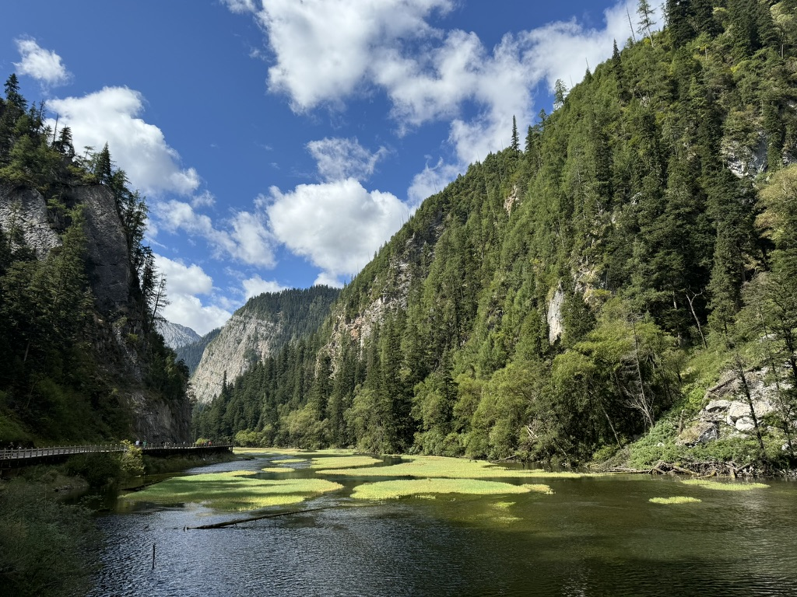
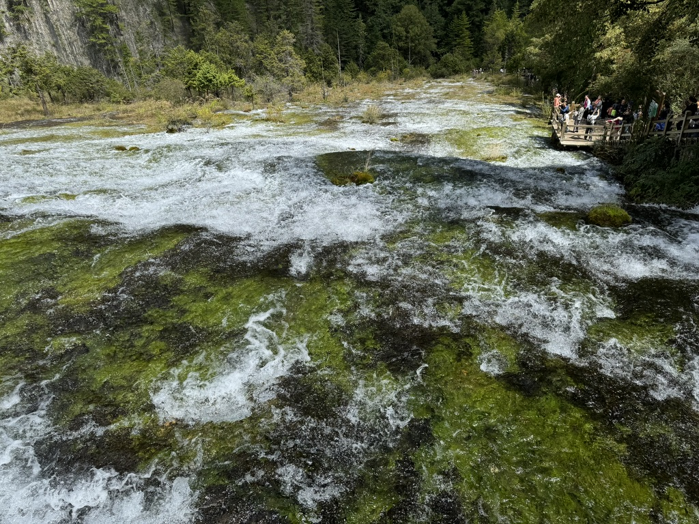
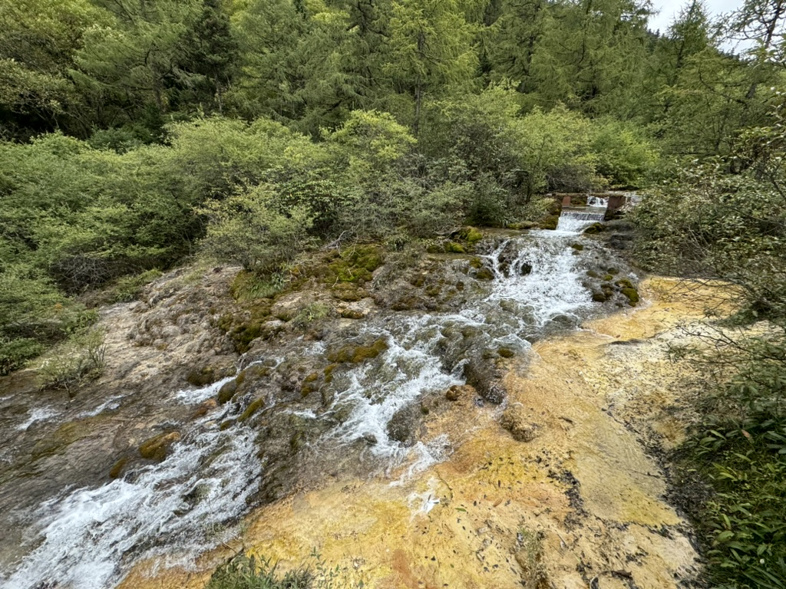
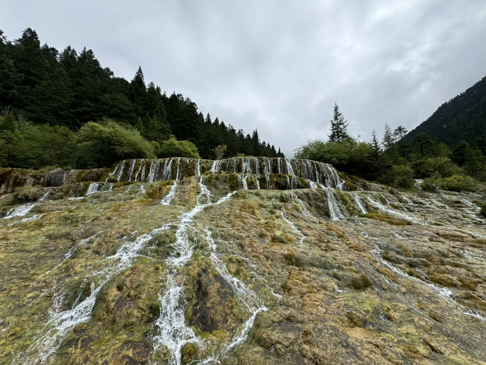
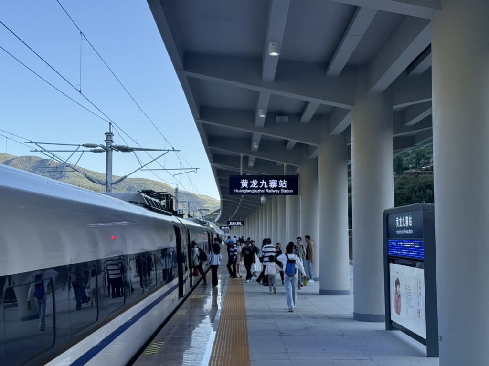

上个月还在寻思到九寨沟的高铁不知道啥时候能通。本来估摸着能赶上国庆就不错了，结果就很突然，8.30 就通了。抱着个凑热闹 + 抢先体验踩踩坑的心态，回收一下五六年前的 Flag

图多杀猫，但是 iPhone 原相机随手拍，为了放在 GitHub Pages 上还都压成了 1024x768 的极低分辨率，所以凑合看吧（

# Preparations 1

中秋国庆连着调休，正常的周末只剩下 9.7 / 9.8 这一个。本来打算摇不到人就 9.7 当天特种兵来回，结果一不小心摇了 5 个人（大学同学 + 他的两个小伙伴；同事 + 家属），所以还得做个计划

## Schedule

简单考虑了一下所有人的时间，然后选了一个比较常规的方案：

* 9.6 周五：下班过去，九寨沟附近住一晚上
* 9.7 周六：全天九寨沟，还是住九寨沟附近
* 9.8 周日：黄龙，然后回家

交通只采用公共交通（虽然也是可以考虑在那边包车或者租车的，但感觉不如公共交通靠谱，第一次去还是避免踩坑

## Tickets

景区接待人数有限（虽然一般来说好像也没那么紧张），且门票可以无责任取消（但是有时间限制，距离参观日期只有两三天的时候就不能退了），所以建议最优先定下来。

* 九寨沟 190，内部摆渡车 90；门票当天有效（所以不是很建议搞那种一天左边一天右边的玩法，成本有点高
* 黄龙 170（淡季 60），上行索道 80，内部观光车 20（这些建议都买，下行索道不要买，另外完全不需要超过一天的玩法

买票都在 [https://www.abatour.com/](https://www.abatour.com/) 上操作就行了，不过好像没在 PC 端看见黄龙那个观光车的票，手机上（从微信公众号「九寨沟」点进去就是上面这个网站的移动版）是有的，买的时候注意一下

## Long Range Traffic

怎么到黄龙九寨这块儿就各凭本事，订不上就把门票取消了吧

* 高铁：成都东 - 黄龙九寨，来回基本都是 140 左右；也可以考虑备选方案从松潘高铁站过，区别不大
* 飞机：应该是都要从成都转一趟再到九寨黄龙机场。价格不确定，同学从帝都飞过来 500 多，回程 800 多但是转机时间很离谱

个人是更推荐高铁（甚至哪怕飞到成都再换高铁都行）。这次选了 C5756/7 和 C5798/5 两趟车来回

特种兵方案可以选两趟直达，不过当天回可能不太好选大巴（最接近的是 19:10 的一趟，按两个小时算的话非常极限；17:20 的在景区里的时间又过于紧张、基本不够逛完。可能只能选 18:30 左右出来花两三百打个车这样，建议他们回头加个 18:00 左右的大巴车次

另外，虽然也是可以大巴或者自驾的，但是怎么也要五六个小时，所以还是算了吧

## Hotel

特种兵当天来回就不需要。景区附近酒店的选项相当多，常见品牌基本都有，所以这个也是各凭本事就行

建议尽量靠近九寨沟客运中心、游客中心那块（这俩距离 1km 多点，酒店离哪个近都无所谓），交通会方便很多

## Bus

基本上不用太操心，就算买不到大巴车票也可以直接打车（就是贵亿点，估计得两三百，虽然人多的话平摊下来也没比大巴车贵多少？

这里基于上面说的「尽量靠近九寨沟客运中心、游客中心」提供结论，方便抄作业

### 黄龙九寨高铁站到九寨沟

小程序「九旅悦行」买。有手机号就行，一个人可以买多张。时间点基本是跟高铁对齐的，出站不用等直接上大巴，很方便

* 51 / 人
* 两个小时左右
* 可选的终点有几个，但价格都一样，找一个离自己酒店比较近的就行

### 九寨沟客运中心到黄龙

没找到在线渠道（找到的感觉不太靠谱），于是决定第二天进景区之前线下买，这边同样建议这样操作。买票至少需要身份证号（不用拿着身份证，去窗口报姓名和身份证号就可以），能不能使用护照不太确定。所以说这个真的建议还是跑一趟

* 55 / 人
* 三个小时左右（中间会有些上卫生间的时间 / 高原反应科普 / 推销之类耽误点时间
* 发车车次只有 7:10 7:40 8:10，所以建议最好是住在离客运中心不太远的地方（否则早上万一遇上堵车的话不好过来

### 黄龙到高铁站

一样在「九旅悦行」那个小程序买。到高铁站的时间差不多是比对应的高铁发车时间早一两个小时，有足够的预留时间

* 28 / 人（也有到松潘高铁站的车，贵五块钱
* 四十分钟左右
* 可选的起点有一个什么酒店和「黄龙景区 3 号停车场」，这个停车场就在景区往左手边走个几百米的位置，所以比较推荐选停车场

## Environment

山里天气无常，海拔又高（九寨沟 2000 左右，黄龙超过 3000），多做准备

* 这边还是有点冷，夏天来也至少得带个厚外套
* 防晒措施很重要（最好上面那个外套有个帽子
* 海拔不高应该不至于高反但是个人看情况考虑

草民虽然穿了个带帽子的外套但是脸上还是晒伤了 = = 虽然倒是远远没有上次在云南那回严重

# Day 0

周五晚上下班出发，到成都东站坐高铁，差不多两个小时左右。关注两点：

* 黄龙九寨高铁站出口的卫生间非常小。强烈建议在下火车之前解决如厕问题，否则要么卫生间排队导致错过大巴，要么就得在大巴上憋好久
* 山里晚上气温相当低，下车前加件衣服

如果选择坐飞机过来的话不确定有没有大巴之类。同学约了九黄机场接机，270 到酒店，他们三人均摊就也还可以接受

## Bus 1

出站是个下沉广场，坐电梯上去再走个差不多几十米到停车场（像下面这张走之前拍的图这样面对车站，停车场在左手边），找「九旅悦行」的告示牌就可以搭乘上面 51 块钱的那个车

小程序上预定之后到时间会有通知车牌号（也可以点进订单上看），照着找车即可，人满就直接开。不过还是建议出站利索一点，抢个合适一点不会晕车的位置，毕竟俩小时大巴还是有些酸爽的（之前八个小时大巴怎么坐下来的太可怕了

快到的时候司机会在几个终点挨个问有没有人下车。建议是关注一下窗外，大部分酒店应该都在行车方向的右手边。

上面这张图上的路线方向基本上就是行车方向。看见自己酒店就直接跟司机嗷一嗓子他就会就近停车，错过就得自己往回走几步路了

## Hotel

这次按个人习惯选亚朵，不过这边的叫什么「轻居」？定的早的话就几种房型都有而且价格不贵，标准双床房 350 左右一天；隔了几天同事再看的时候就只剩标准间了，还涨了两百多块

入住体验总结：可以理解为青春版，甚至给人一种贴牌的感觉

* 房间差不多只有正常亚朵标准间的三分之二那么大甚至更小
* 装饰（尤其是灯具）也砍掉比较多，少一些亚朵特色的东西（比如电梯楼层标识
* 日常维护感觉比较差劲，比如换气扇差不多整个被灰尘堵死了，屋子里的空气就一直感觉不新鲜
* 其他的配套勉强算是跟亚朵沾点边吧，该有的也差不多都有吧。。。

感觉稍微有点踩坑，勉勉强强及格水平，三百多的话就还凑合住，五百多就完全不值。同事选择了同一个楼的汉庭，因为订的晚了几天价格应该是四百多，反馈是除了小一点之外还可以没啥问题，仅作参考。

## Dinner & Shop

这家亚朵一楼是个牦牛肉火锅，味道还不错，适合饿了当夜宵。牦牛肉真的很柴，很费牙，店家会专门提供刀叉用来切块（好离谱）但除此之外跟正常牛肉似乎并无什么明显的味道上的区别（至少草民妹吃出来

吃完之后旁边超市简单买了点巧克力、水啥的备用，价格就正常物价水平。明天 Day 1 起大早

# Day 1

确实早上七点就起了（原因是晚上睡眠质量不知为何非常差。好久没有这种住在郊外起大早的体验了，上次恐怕还是元旦在峨眉山

住的地方刚好可以看到山脉。早起一看外面以为阴天就拿了伞，但实际上一点都没用上

## Preparations 2

按照前面说的，进景区门之前到旁边的九寨沟客运中心买了 8:10 到黄龙风景区的票（纸质的看起来有点像发票的那种车票

这里发车只有 7:10 7:40 8:10 三趟，而且票不多，一定要提前至少一天买。旁边的自助机器可以刷身份证买票，也可以去人工窗口

## Enter

景区只有一个出入口，导航到游客中心就行。本来打算走过去，但同学的小伙伴打了个车，早上过去 15，晚上回来 20，一口价。虽然草民住的地方距离大门口只有一公里多一点，又堵车，真不一定比走路舒坦，但是回来的话其实打车就打车吧真的累（

8:30 左右到游客中心，跟着人流从大门口左边的楼梯上去。验票之后上绿色的内部公交车，景区也有 VIP 包车服务（应该是三百块一个人），个人的态度是不推荐：

* 不灵活，公交车基本都是随到随走，最多等四五分钟；VIP 还要凑人
* 导游服务基本没有什么意义，看介绍牌就好了，上行的公交车上到每个景点也会有简单的语音讲解

接下来参考这张图（图例稍微有点小，不过下面草民会尽量说明路线）。整个景区差不多是一个 Y 字形

公交车会随机（指不受游客意愿控制）把车上的所有人扔在 Y 字形的：

* 左端（长海）
* 右边中间（剑竹海）
* 右端（原始森林）

如果被扔在了剑竹海的话建议原地等几分钟，搭下一趟车上原始森林。

## Right Y Branch

草民被扔在了剑竹海，然后原地换车上原始森林。非常巧的是同事晚进来十几分钟被分配到了长海，于是可以对比一下

以下按草民的游览顺序排列，每个地方会标注是从上一个地方坐车下来还是走下来，走的距离没有特别说明的话一般都是几百米。

### 原始森林

差不多 9:30 下车。早上来的关系这里太阳照在山上贼好看。

原始森林可以进去溜一圈，草民因为打算往下走一段路（3KM 左右到天鹅海坐车），足够呼吸新鲜空气了，所以没进去。同事下午进去呆了一小会儿，评价挺高（大意是原始森林和人工维护的区域分界线很明显，值得一看），所以看个人兴趣和时间安排就行

### 草海

往下走的过程中会经过这里。有的地图上叫芳草海，这里以景区内介绍牌为准

人不多，很适合走一段呼吸新鲜空气，风光也很好，几个方向的山脉都非常漂亮

尤其是到天鹅海之前有一个桥，超级适合拍照，上面这张应该说是草民当天拍到的最满意的照片

### 天鹅海

从草海走下来。据说真的有天鹅（

上面这张大概算是当天第二满意的照片。天鹅海里能明显看到一些蓝色的钙化区域（下图左下角就有两个），这种区域比其他地方要深很多，而且有一些侵蚀下去的通路（能明显看到一些漩涡），感觉真的还挺神奇的

从原始森林下来这一段人都不算多，体验相当好，给人极佳的第一印象。草民一帮人走了差不多一个多小时

天鹅海坐车的地方旁边会路过一个山洞叫「鹰爪洞」。感觉意义不大，跳过了，没进去

### 剑竹海 & 剑竹海瀑布

从天鹅海坐车过来。

上图这里就是上来的时候被扔下来的地方

到这儿已经十一点多，从这儿开始人就明显多起来了。

剑竹海有一个环形栈道可以绕到另一侧，但是要多走很多路（具体多少忘了但很长），草民考虑到体力关系没有绕进去。

往下走就是剑竹海瀑布，叠叠乐。钙华是很脆的，沉积多了就会掉下来，时间久了就会垒成一大堆

这里有一说一很难克制住稍微玩一下水的冲动（但是还是注意素质，以及千万别喝

### 熊猫海

从剑竹海瀑布走路过来。据说真的有熊猫（

应该是这次看到的颜色最亮的一个海。这里可以看到水里的鱼，小小的一条一大片很像小石潭记那种感觉。

忘了叫什么鱼了，但据说吃蚊子幼虫，好，狠狠的吃（有一说一这个景区真的几乎没什么小动物，相比之下黄龙那边就挺多的

### 五花海

从熊猫海坐车过来。九月份树叶还没怎么变红，没有十月的时候那么鲜艳，后面会贴一张比较好看的明信片

五花海跟剑竹海一样，另一边也有个环形栈道（1.4km），刚下车的时候栈道上人巨多特别挤，到能看见分叉路牌的地方才稍微好一点

水的颜色确实有一点层次感（但不多），水里小鱼蛮多（边上还有只鸭子

时节不对，人又很多，还多少有点累，环形栈道实在走不动了，所以大概下次一定（

### 珍珠滩 & 珍珠滩瀑布

从五花海坐车过来。飞溅的水珠加上强烈的阳光确实有那么点像珍珠

个人认为是全程最值回票价的一块地方，无论是上面的滩还是下面的瀑布都非常壮观，一定不要错过

顺便可以勾起一下小时候在电视上来回看西游记电视剧的回忆。真的是死去的回忆突然袭击系列

### 8.8 石

从珍珠滩瀑布下来，往镜海停车场走的时候会路过的用于纪念 2017.8.8 九寨沟 7.0 级地震的纪念碑

印象中草民 2018 年想来的时候就因为地震限流，一天好像只接待四五千人这样（现在是 4.1w，旺季仍然供不应求

### 镜海

看过上面那个石头就到镜海停车场了，从这里坐车到诺日朗中心。中间司机会问有没有人在镜海下车，打算下的话嗷一嗓子。实话说，镜海跟前面的比其实就有些平平无奇（可能是开始有一点审美疲劳了

好在镜海的可活动区域很小，而且是原地上下车，所以也不用花很多时间，想看的话五分钟下来闪现一下再原地坐车往回走就行了，实在来不及也可以跳过

## Lunch at Center

差不多 13:50 回到诺日朗中心。穿过一片小商品商店之后到达餐厅（同事十一点左右就在吃饭了

当然这里的食物就别抱什么期望了。简单列举一下情况：

* 草民点了 30 的牦牛肉面，量不多，味道评价为凑合能吃的水平
* 同事点了也是 30 的饺子，反馈是还不错
* 同学的小伙伴点了 48 的回锅肉套饭，反馈是很油很难吃，看着他们只吃了两口就没再吃了

餐厅还有其他的自助餐区域什么的，价格看着偏贵，味道估计也跟上面这个情况差不多，看情况选择吧。

## Left Y Branch

吃完午饭 14:30，去坐车 18km 到左边尽头长海。这边会路过一个据说海拔最高的瑞幸咖啡（

### 长海

差不多 15:00 下车来到左侧端点。评价为跟镜海差不多，可活动区域也一样不是很大

除了海拔比较高之外没啥特点（有一说一回过头来想真的是有点凡尔赛了

公交车上会提到一个只长一边的老人柏，需要绕到右边（面对水面的右边）下去看（就是上图牌子右边那个

### 五彩池

从长海走路下来。路上的山依然非常好看（

五彩池的水据说是从长海渗下来的，牌子上只说是有地下水持续补充（那地下水还能从哪儿过来嘛，总不能从下面的镜海抽上来吧）。颜色确实好看，但真的很小，人又很多，加上有些累了，总之感觉一般。当时就觉得或许上午先来左边再来右边的话感受会很不一样（

完事儿在这里挤公交车直接回诺日朗中心。这里挤车的人特别多，有点酸爽，不过也花不了几分钟，等个三四趟肯定能上

## Middle

下行路中间还有「上季节海」和「下季节海」，但是没有公交站（说明不重要 hhh），走下来 18km 可能会死所以建议算了

总之感觉左边挺辣鸡的，远远不如右边。差不多 16:00 回到诺日朗中心

### 诺日朗瀑布

从诺日朗中心走路过来。

虽然看过珍珠滩瀑布之后觉得已经是九寨沟的巅峰水准了，但这个瀑布也还不错

据说冬天这里结成的冰都是蓝色的。有一说一希望哪次运气好能赶上下雪的时候来，那感觉应该会很不一样

### 犀牛海

从诺日朗瀑布坐车过来（有栈道，但是不开放，看牌子要走 2.5km）。这次确实没有犀牛了（

公交车下来的地方稍微有点凌乱，可以往里面走几步（别走回诺日朗瀑布就行

旁边有些转经轮有点意思

### 老虎海

从犀牛海坐车过来。这次也确实没有老虎了（

不得不说到这里明显有些审美疲劳了，所以九寨沟也确实真没必要玩两天（尤其是在现在门票只有当天有效的情况下

### 树正瀑布

从老虎海走过来。

这个跟前面几个大的比起来就真的只能算是一般般，不过往前走几步也还不错

这里还有个磨坊没找到具体在哪，不过不重要，这些人造物看不看的吧

### 树正寨

从树正瀑布走过来。

可以去对面买蜜雪冰城，但是草民懒得进去，实在是太累了（顺便吐槽一句永远不会缺席的旅拍

这个点背后的山色更加好看，看水之余也换换心情

### 火花海

从树正寨坐车过来。

平着看平平无奇，后来才知道从顶上往下看会很好看，可惜这里不让飞无人机。后面会贴一张俯拍的明信片

### 双龙海 & 双龙海瀑布

从火花海走过来。这里距离盆景滩那儿的乘车点有超过 4km，需要走过去，如果很累了的话建议回去火花海那里坐车

双龙海里面的双龙没怎么看见，瀑布倒是确实不错，而且人不多旁边可以休息一会儿

据说这个瀑布在地震之后水量大了很多。之前还觉得地震之前没机会来有点遗憾，但看到这里又觉得各有各的美

### 女神像

从双龙海走过来。

有一说一，有点抽象，对着说明牌看了半天才看明白

### 芦苇海

从女神像走过来。

早上来的时候还觉得很好看，现在暴走一天回来好像都没啥感觉了，不过这个芦苇真的好大一片，确实可以说是海了

### 盆景滩

从芦苇海走过来。

来的时候最早看到的景点，当然也就是全程走完的最后一个景点（当时真的累到脑子里只有废话文学）。从这里坐车直接回到游客中心。

## End

出口有文创商店，从明信片上看到了桃花（对没错这就是买下它的原因）。里面还有上面提到的，很好看的俯拍火花海。这个一套十张二十块，都很好看但不全放了，挑四张比较有特点的晒一下（草民这个不盈利应该不会被追究版权问题

有一说一俯拍那些这地方不让飞无人机没办法，还有些秋天叶子红了时候的五花海估计人太多也不方便凑热闹（其实也不是不能考虑周末特种兵，当天来回的那种凑热闹）。但长海那个雪景确实……来了成都之后再也没见过下雪，着实有点想找个下雪的日子再摇几个小伙伴一起去九寨沟看看雪

其他就日常买一点冰箱贴就溜了。回去之后才知道听说有个名人当天也在，没遇上 hhh

## Summary

这波应该所有主要景点都溜了一圈（达成全收集），结果是 ~3w 步，着实是很累了。晚上也不想吃什么本地特色了，直接外卖

最后主观打个分（很主观，尤其是考虑到前后对比和审美疲劳的因素

* 珍珠滩 + 珍珠滩瀑布差不多值票价一半，真的各种意义上都非常非常好看，一定不要错过
* 除了珍珠滩之外的右侧分支差不多值 30%，从原始森林到天鹅海这一段给人超好的第一印象，其他的大都也很不错，五花海感觉这个季节一般般
* 中间（入口到诺日朗中心的部分）值 15%，没啥毛病但是审美疲劳 + 跟右侧分支比确实没有那么亮眼
* 左侧分支整个值 5%，确实只能评价为是比较辣鸡的一部分

基于上述评价，感觉如果不是第一次来，又被随机到左边的话，可以选择当场直接坐车下去再换到右边（不确定分流策略是否允许这么干，不能的话尽量节约时间留给右边吧

以及，九寨沟确实接待水平顶尖，流程设计可以说完美，几乎不会浪费时间或者走错路，这点要大大好评。整体游览体验相当好，可以说票价确实是物超所值

# Day 2

吃完外卖出门扔垃圾，但硬是找不到垃圾桶，走了好几百米才找到一个。真是草了

晚上依然没太睡好，感觉就是整个身体好几个部分各睡各的，结果就是睡了但又好像没睡。早上天还没亮，差不多五点多，跟同学俩人都醒了（然后五点半左右还遇上一回酒店跳闸，屋里灯全亮了……幸亏那会儿都醒着不然怕是能给气死。这个亚朵轻居真的是各种意义上的离谱

## Preparations 3

出门之前买了回高铁站的票，从黄龙景区 3 号停车场出发。

同事没买到黄龙九寨回去的票，于是从松潘回去，买了 15:28 的车次；其他人正常从黄龙九寨走，买的是 15:43 的车次。后来发现这个时间有点紧，在里面稍微耽误一下就会完全没有时间吃饭，只能 16:30 左右在高铁站附近吃了。可以选后面 16:30 左右那一趟，这样前后都能留出时间吃点东西（当然也别错过了入园时间

## Bus 2

到九寨沟客运中心坐车去黄龙。前一天买的票是 8:10 的，所以 8:00 之前到客运站，刷身份证进去就行

一点小插曲：前一天用身份证号买的票有一半刷身份证刷不出来，不过影响不大，人工扫一下纸质票上的条形码就行了。感觉九寨沟这块儿整体流程确实做的挺完善的

## Before Arrival

差不多十点四十的时候有一个小姐姐上大巴来介绍一些高原反应相关知识：

* 黄龙景区的海拔情况，不过她不知道为什么说成最高三千九，实际最高是不到三千六
* 常见的高原反应症状和预防、缓解方案，包括大巴后面开上去的过程中会有一些快速的海拔升降可能带来的影响。听一下关注一下
* 最后会推销一个一百块钱的什么药，不建议买，事实上也基本上没人买

## Up

十一点左右下车，留了时间的话可以在附近先吃点东西。到景区游客中心可以存个包 / 买个氧气，这里氧气比较好的一点是无论哪儿买都是 20，玉龙雪山那种山下十六山上六十就有点坑。出了游客中心不要直接进大门，找这个牌子（从这张图也可以看出来黄龙其实就一条线

按照指示的方向往前走，到「黄龙索道公交站」坐车（免费）到缆车起点，然后缆车上行到距离五彩池 2500m 的地方下缆车

### 下了缆车之后

取决于有没有买那个 20 块的观光车票：

* 买票了就坐观光车（但是观光不存在的，车跑在一段封闭道路上，两边全是树，实际上毛都看不见
* 观光车限制接待人数，一天只有五千，到的时候已经卖完了。感觉那个车的运力非常充裕，不理解为什么只利用了很少一部分
* 同事没买观光车票，这一段路就只能走过来，大概得走个四十来分钟这样（但是他们说路上经常偶遇小松鼠，感觉甚至有点赚

最后会到达一个距离五彩池 700m 的地方，走上去就行了，路上会经过大面积的钙华和一些小瀑布什么的

### 五彩池

有一说一，还行，颜色梯度很好看

不加滤镜不调饱和度出来基本就是上面这个效果，没有那么深到夸张的颜色（

其实风光也挺不错，但累 + 昨天看的确实很 nb，今天难免有些索然无味感

## Down

看过五彩池之后下行有两种选项

* 回到上行缆车终点，原地坐缆车下去（但是如果没有买摆渡车票的话要往回走差不多 3km，还要再花 40 买缆车下行票，确实很亏
* 从另一个方向走下去，4km 多一点（草民一队人都选择走下去了

走下去基本就是一条路，偶尔有那种绕到森林里面去的岔路，不要走（也没人往那边走）。栈道上每隔 50m 会有一个小牌指示目前位置，这点好评

### 各种池子

下行路上的各种池子跟五彩池比起来少一些蓝色，不过非常多很大一片。有些还是挺好看的，就是看多了就累了

主要问题在于名字多且缺乏记忆点（不像九寨沟那样区域之间的边界很清晰），而且池子本身也没有什么特点都一个样子，结果就是根本记不住（也可能是太累了脑子不太动

### 地表钙华滩流

下图是「金沙铺地」，是从「七里金沙」走过来的。实话说这俩看起来真的一毛一样（要不是特意拍了介绍牌，根本分不清哪张对应哪儿

顺便抓到一张难得的小队同框。因为各种意外直到最后一段旅程才凑到一块儿（然后回去坐车又是各坐各的

### 一些瀑布

评价为比水池子和水垢好看一些

下面这个地点叫「洗身洞」。难得一个有些特点的瀑布用上面的小坑当名字，多少有点迷惑

下面这个叫「飞瀑流辉」，要从一个叫「莲台飞瀑」的地方走过来。就真的感觉很难区分具体的区域，更难把名字跟区域对应起来

### 路程走完出门

就像上面举出的例子，中间其实大部分景观都差不多一个样子，路程也都是一条线走下来，所以也就懒得像九寨沟那样每个地方都贴出来了

草民这帮人本身体力消耗比较大，又走走停停，一共大概走了俩小时。走快一点的话，从五彩池走下来一个半小时多点就够了（仅供参考

## End

感觉跟九寨沟比起来确实是差出不止一个档次……尤其还是看完九寨沟过去的，很难不拿来对比

* 五彩池值个三十块钱（比九寨沟那个五彩池稍微好一点
* 下行整条路差不多值个八十块钱（就差不多跟上行索道一个价吧
* 路上偶尔会遇到小松鼠，还挺可爱，算个二十块钱（下图来自草民同学的小伙伴，在「飞瀑流辉」附近拍到

总之是觉得不值门票钱的，撑死也就值个不到一半吧。再考虑到高反风险 / 时间消耗 / 前一天九寨沟体力消耗（今天几个小伙伴基本腿都很疼了）什么的，就不是很推荐。后面也考虑了一下先黄龙再九寨沟的玩法，结论是时间根本安排不开（除非后面再加一点比如说去周边其他景点的安排，那样应该还可以考虑），而且黄龙再怎么说也要走个 1w 步，晚上要是没休息好的话很影响第二天在九寨沟玩的心情。

### 坐车回高铁站

从景区大门口出来。旁边有个文创店，里面东西感觉没啥亮点（主要是没找到那种半球形的冰箱贴），最终啥也没买。

面对大门口右手边就是游客中心，拿了包出来往索道公交站那块儿去，再往前走一百米左右到 3 号停车场，然后得在里面慢慢找自己回高铁站的大巴。同事的车很离谱，说 15:28 到但实际等到 15:40 才来，据说司机还不知道目的地是哪，跟接待人员 battle 了半天才发现自己收到的时刻表在十分钟之前突然变了。多少有点难绷，不过影响不大

草民的车也晚了差不多十分钟，16:30 到黄龙九寨高铁站

### 高铁回家

高铁站周围（包括里面）没有餐饮也没有便利店什么的，吃东西需要打个车到旁边川主寺。因为实在是太累了，直接摆烂让出租车司机推荐了一家川菜馆，价格小贵（四个老爷们点了五个菜 310 没吃完，打车 20）但味道还行。

吃完叫了个车回高铁站。司机说「高铁通了把九黄机场干死了，把大巴也干死了」。评价为确实，九黄机场只能从成都转机，高铁通了之后重要性肯定显著下降，个人感觉估计得损失超过一半的客流（无凭无据纯盲猜）；至于八个小时的大巴，那更是重量级

高铁站人超多，巨挤，不过上车倒是也没花多长时间。在高铁上稍微睡了一会儿，感觉上这次全程基本上没有什么明显的高原反应（除了心率稍高一点），跟上次玉龙雪山比完全可以说是无事发生。

# Finally

回来之后不出意外腿又疼了好几天。这次整体还算顺利，基本没有遇到预期外的情况

今年国庆可能抽一天再去青城后山溜一圈，后面还有 11.9 的 ChiliChill Live（说起来还是在黄龙那个五彩池边上抢到的早鸟票

然后也许会像上面说的找个下雪的日子再去九寨沟溜一圈，除此之外大概率不会再整什么大活了，泸沽湖最早也是明年见了吧（
