简单考虑了一下几个固定时间点安排，以后劳动节假期还是尽量出去溜达溜达，所以 Vacation 系列大概会固定安排在 5 月下旬和 11 月下旬更新（主要也是为了避免在年常里面糊太多没啥营养的东西）。

算上九月份去九寨沟那次，依然是保持了每个月出去玩一两次的节奏，以及今年又是 6 场 Live 嘿嘿

# 7.20 墨村 Live

突出一个运气不好：网友见面没见到，签名抽奖没抽到

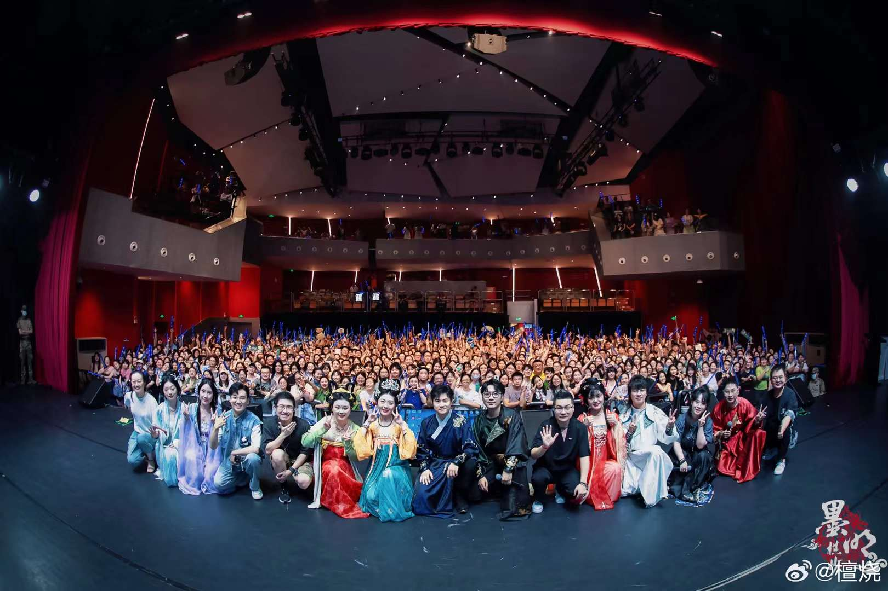

嗨呀这个签名越想越气，劳资多花钱买 VIP 还要抽奖，再有下次真不伺候了

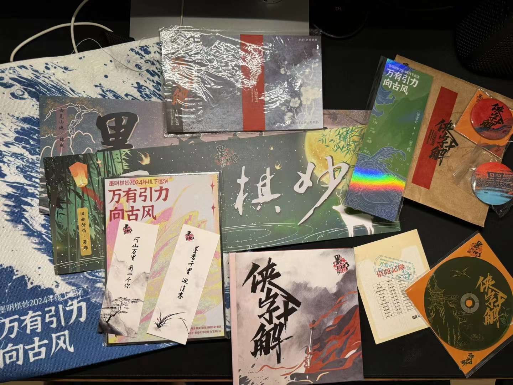

现场也卖这个碟，草民这个是四月份收到的就来盖了个戳

# 8.17 司南 Live

贼靠前，听爽了。合影稍微管理了一下表情，大概还行（？

亲签也 Get 了不过在左下角那张票的反面没晒出来。另外感谢赞助商老板们（真的商业鬼才

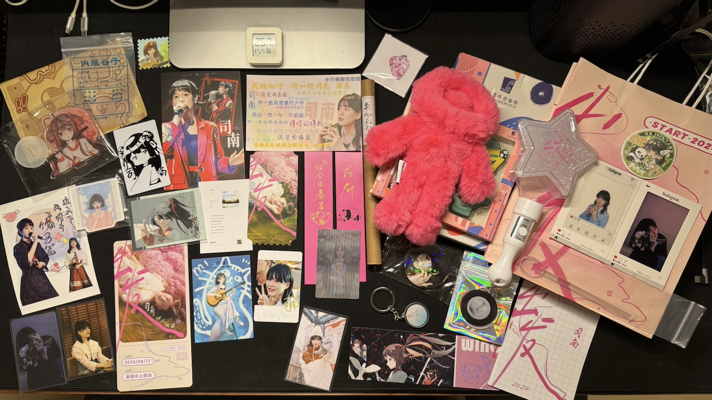

# 8.24 囧菌 Live

人好多好多，以及草民被迫营业（图就不发了

一巡海报全收集（太多了不全放了

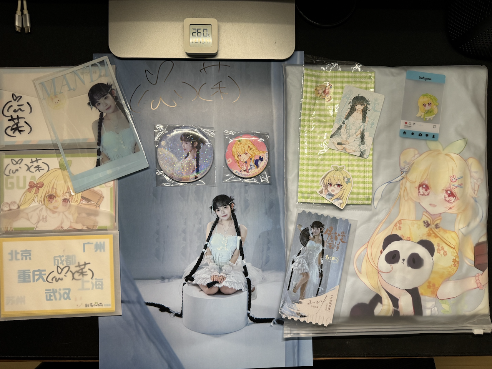

加上后面买到的碟（何以解忧，唯有暴富

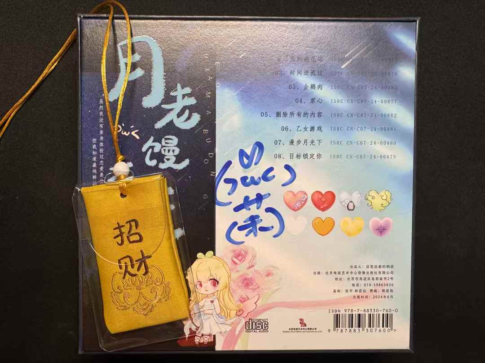

# 10.5 青城后山三刷

体力跟三年前比真是显著下降，被马哥和小竹远远甩在后面

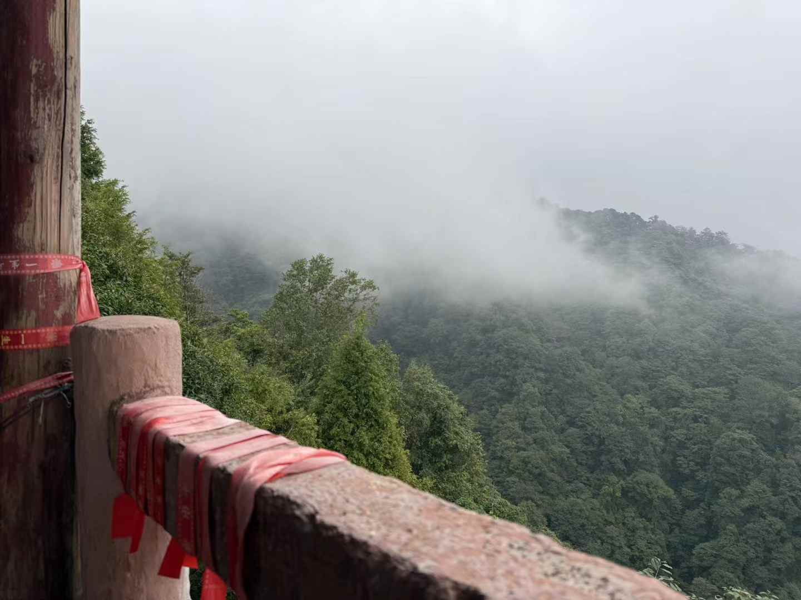

回来还堵在路上了，差一点回不了家（突出一个计算准确但过于谨慎，但总之节假日还是少出去凑热闹了，一定要凑的话留足时间

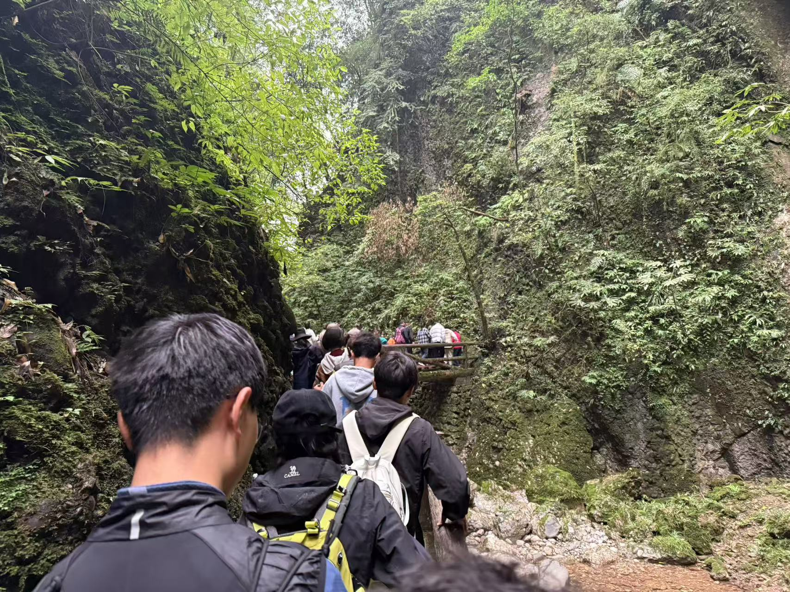

然后还是再强调一次：山顶上那个破白云寺不要去，都 tm 修了四年多了还是个破破烂烂的工地，这次比上次还更难走了

# 11.9 ChiliChill Live

这次场地在天府国际动漫城。这地方是真不错啊，更期待明年 yousa 的线下活动了

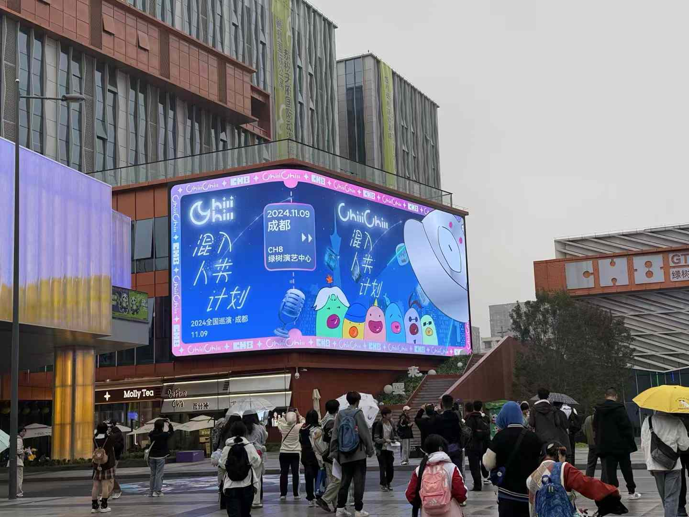

去年第一次听《别让我担心》的时候还没什么感觉。这次在现场听了全场大合唱，又一次体会到了去年听《我不曾忘记》大合唱的时候那种感觉，总之就是后劲儿贼大。这大概就是 Live 的魅力吧（

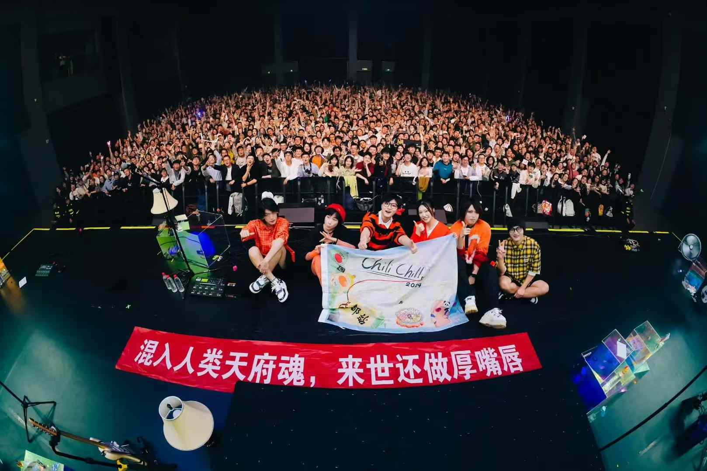

签名 x2（其实应该顺便再买个新版的每到夜里

# 11.16 九寨沟二刷

淡季第一天怎么不算抢先体验呢（虽然是淡季但是 2.3 万张票还是卖完了

这波主要是补几个成就（和上次没拍到的牌子什么的

## 准备工作

这次高铁选择了直达的 C5786（不过不知道为什么前面那张图的终点站是松潘），回来选周日中午松潘站始发的 C5788

C5786 比上次 C5756 可以少请一个小时的假，不过这次是改签过来的，只有一等座了，算下来跟事假少扣的钱差不多，约等于白嫖。实际坐下来觉得一等座也就前后宽敞一点，但是小桌板远不如二等座那种方便，评价为没啥必要

酒店的话，小竹订了桔子酒店，挺不错的，各方面都比较靠谱，比上次那个亚朵轻居好太多了

* 四百块左右一晚上。支付宝可以白嫖华住的金会员，送早餐（顺便支付宝也送亚朵的会员，权益更多，建议搞一个
* 九旅悦行上有一个叫【见九寨】的站点（去门口看了一眼应该是个会展中心之类的场地），这个桔子酒店在它往游客中心去的那个方向上大概 1km 远的地方（看见一个立交桥就差不多了，走到它下坡的地方过马路就是），下车走几步路透透气缓解一下晕车刚好就到了
* 这家酒店有到游客中心旁边农业银行的接送班车，早上最早 7:50（7:30 之前要到酒店前台登记；过去要十分钟左右，但是淡季景区 8:30 才开门），晚上最后一趟大概是 18:15，没赶上的话打个车二十块钱也行

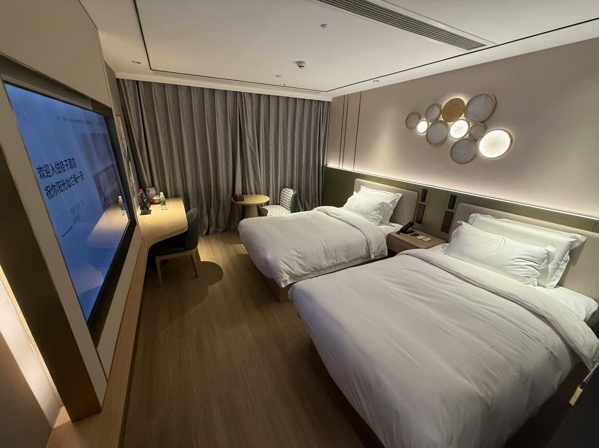

另外晚上 18:00 出来的时候发现游客中心有广播说有直通车到高铁站。感觉如果跟九旅悦行不一样，能做到随到随走的话，当天来回的可行性会高出不少（不过急着回酒店，没再仔细了解，后面有机会试一下

## 淡季变化

游客中心早上开门时间推迟到八点半，不过八点二十左右就开始放人进去了（看这人排队排的哪有点淡季的感觉

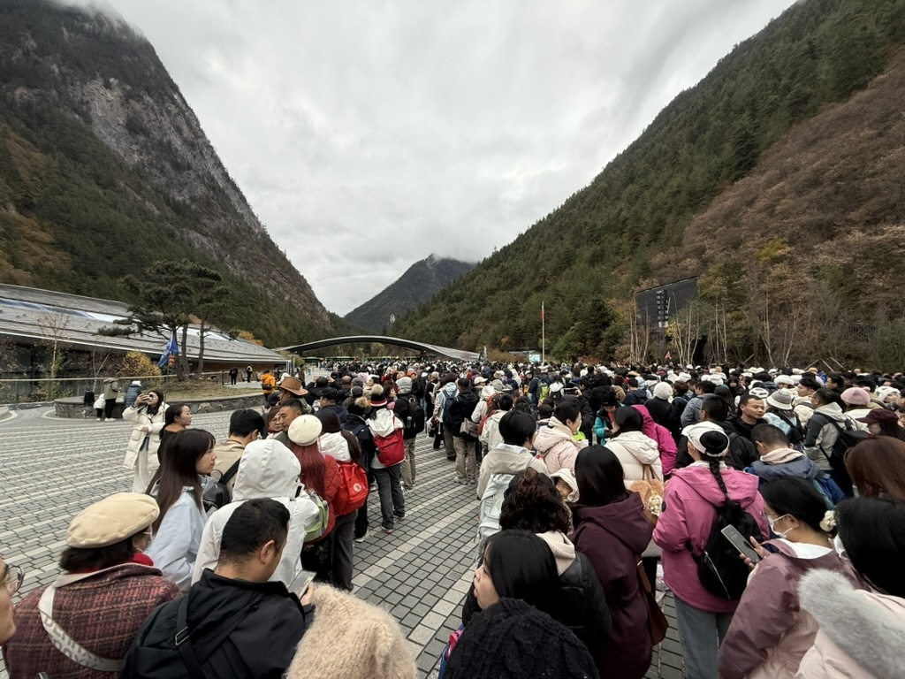

本来以为淡季只是原始森林不让进去，但实际上是从箭竹海就不能再往上了（等于连着草海和天鹅海一起砍掉，实话说没再去天鹅海那个桥还挺可惜的），所以也无了。上次没拍到的原始森林介绍牌子这次也没机会拍了（另外剩下的几个这次倒是应该拍全了

顺便关注了一下长海那边的两个季节海。上季节海是真的几乎一点水都没有，下季节海还稍微好点

## 没赶上雪

十月中下旬某一天下了雪。本来期望着这次去也有点积雪的，但刚好前两天有个朋友在，那天是一点雪都没有。草民这次去虽然是大阴天，但也就是中午零星飘了几滴毛毛雨下来（属于是手机屏幕都很难打湿的那种

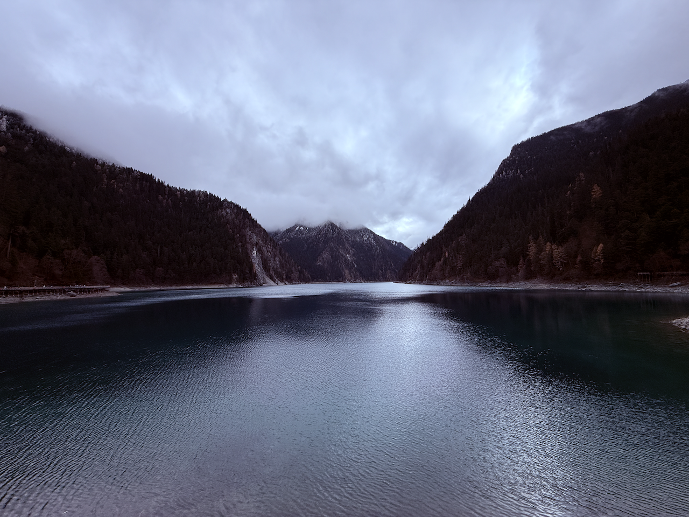

这波又是被扔到右边，下午去长海的时候看见旁边山上有那么一丢丢，下来到五彩池的路上也能看见化剩下的一点点，但也就仅此而已了。结果更难绷的是刚回来就下雪了，还连着下了好几天（图片来自公众号），甚至 24 号这一天雪大到要封路（有点难绷

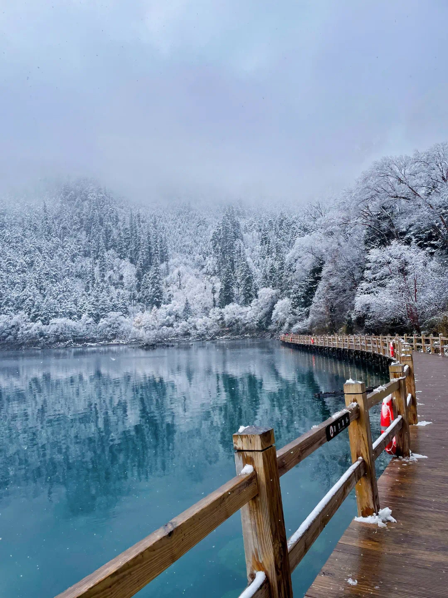

所以说下次再来还是找一个有些积雪但是最好还没有正在下大雪的日子吧（也算留个念想，虽然怎么也得是后年了

## 箭竹海栈道

上次留的第一个 Flag，走过之后才发现其实这个栈道不太长，而且走不走都行，不过淡季嘛既然错过了天鹅海。。。

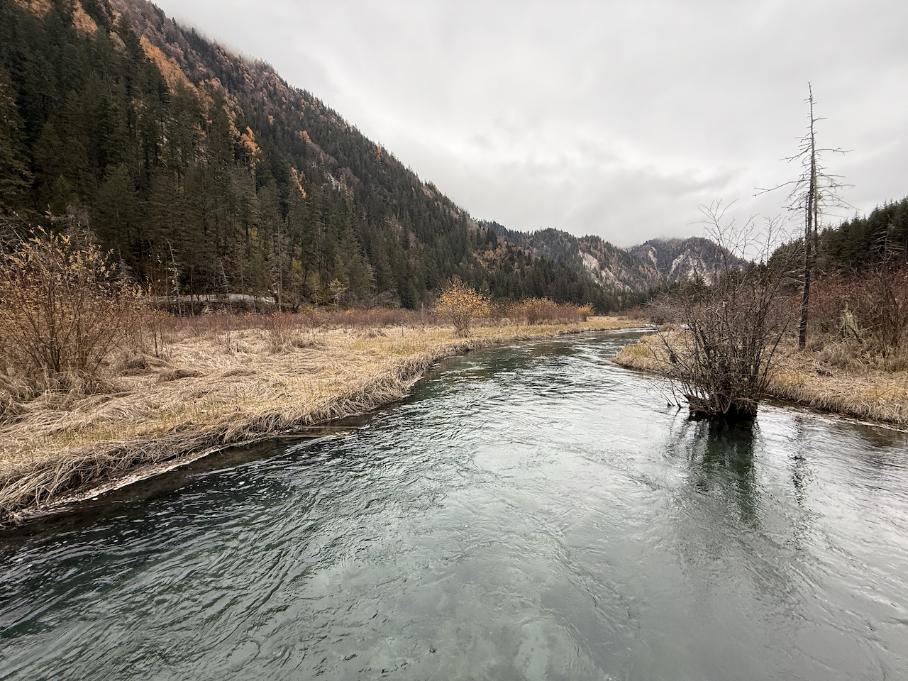

跟上次去比，水位确实下降很多（不过其实下面树正沟那一片就还好），植物基本都趴了（所以说淡季又不下雪的话还是不要来了

## 五花海栈道

上次留的第二个 Flag，这个栈道是真的长。但有一说一，不走这边真的血亏（还好这次走了，顺便找到了上次没拍到的牌子

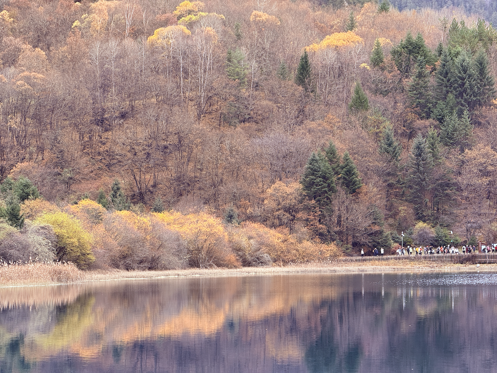

虽然彩林也无了（时间窗口真的很窄，这会儿已经只能勉强拍到上图那样了），但意外拍到了网红小动物

可惜离太远只能拍成这样了。算是一定程度上弥补了没看见雪的遗憾吧（

## 诺日朗瀑布观景台

当时看明信片上的照片还以为只能用无人机拍到。如果不是偶然在 b 站刷到视频的话，这地方确实不太容易注意到吧

有一说一，从这个角度看这个瀑布确实还是能跟珍珠滩瀑布平起平坐的（上图远处就是镜海

## 老虎海上面的奇怪栈道

也不知道怎么上去，能看见的唯一一个入口还是封闭了的（但上面还确实有人）。留作下次的 Flag 吧

## 蜜雪冰城 & 午饭优化

蜜雪冰城贵一块钱，印象中跟上次去青城山在高铁站前面买的一样

顺便关于午饭，这次去了诺日朗风情街，有一说一里面的食物靠谱多了。整了个沙县炒米粉，虽然三十块有点贵，而且是上一波炒好的所以有点凉了，但是味道还行，而且量大管饱。沙县旁边有个德克士，不知道吃什么或者懒得找的话都可以直接去，算个保底方案

## 树正群海观景台

树正群海这一截上次是从水边走的，这次走上面发现视野好太多了，尤其树正瀑布比上次看起来壮观许多

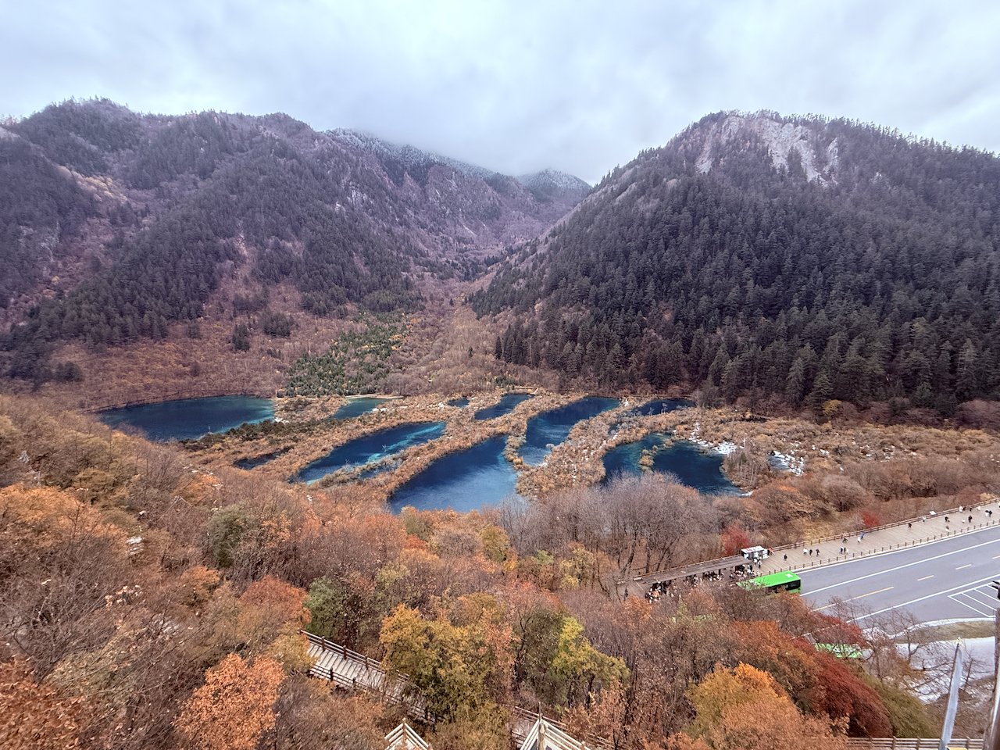

至于观景台，视野倒是也没再有什么质的提升，不过过去的路上碰到了三四只猫，也不亏

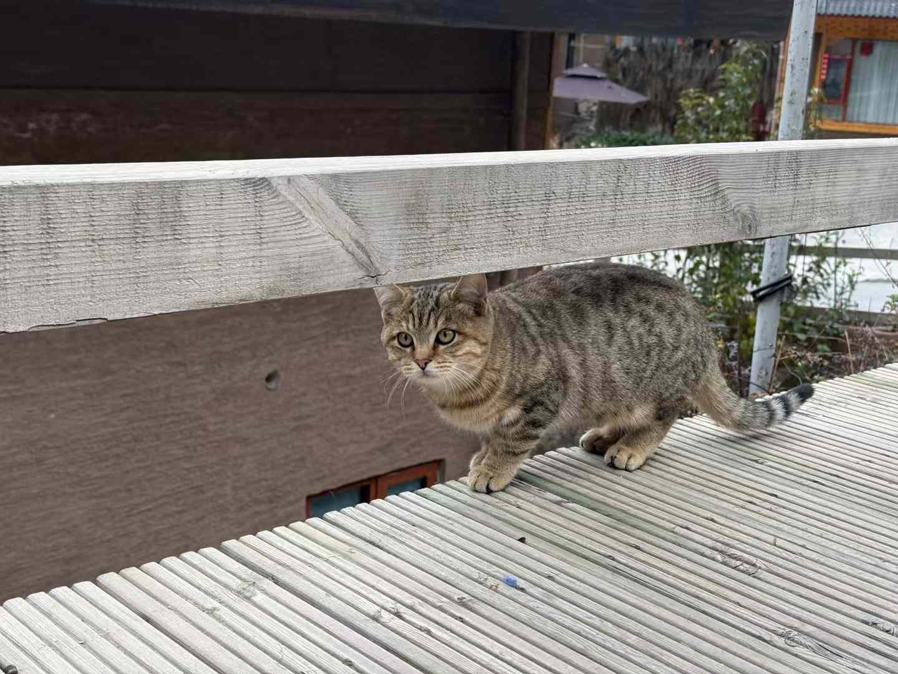

考虑到时间，到这的时候已经五点多了，就算这个看起来贼长的栈道能通到老虎海上面也不想走了（结果出来发现又是走了三万步

## 结束

跟上次比，虽然运动量几乎一样，但完全没觉得腿疼，甚至都不算太累，看来前面几次运动还是有点效果

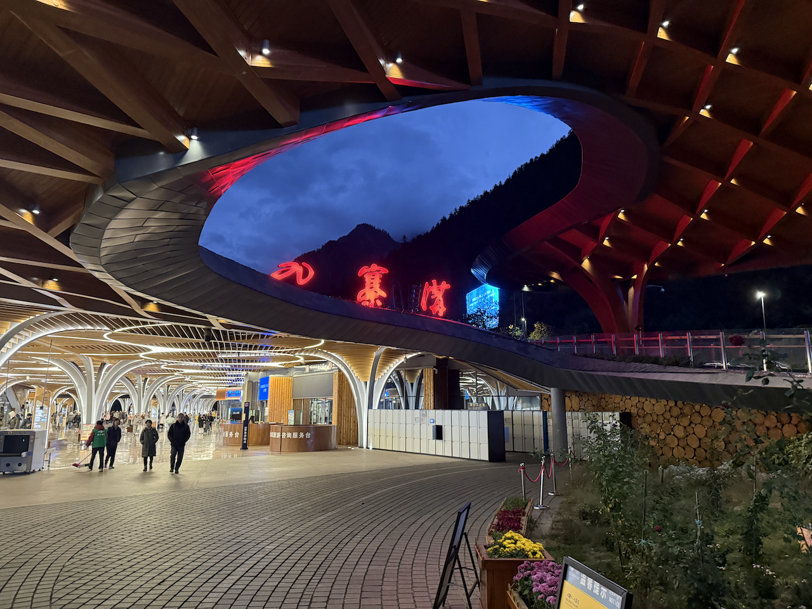

晚上吃了酒店推荐的藏式小火锅，味道还行，就是篝火晚会这个实在是社恐人地狱时刻。隔天中午从松潘站回，路上还经过了一个有点积雪的地方，但是到车站附近又是晴天。另外感觉松潘更接近一个普通的县城而不是那种古镇，或许有机会来逛逛

# End

十二月估计事情会比较多，空出来的时间还要弄年常，而且元旦只有周三一天假，不出意外的话应该是不会整什么活了（？

顺便在这里补一下今年买到的其他的碟（礼盒就不挨个晒了不然真摆不下

* 《叙梦流光》玄觞（当天完全忘了这事儿，然后就只有普通版了
* 《空气蛹》知更鸟 / HoYoMix / Chevy（讲真，这种周边请多来点
* 《形神合一》兰音 Reine（虚研社的实体出问题差不多能算传统艺能了。。。
* 《Switch On》小柔 Channel（这个碟又没出什么问题，或许发挥不稳定才是虚研社的传统艺能？
* 《自下而向上生》泠鸢 yousa（果然还是脸黑啊，不过看了 B 站晒单的大佬们都是八抽甚至十抽一个保底，那好像也就无所谓了
* 《冬以外》纱依 shayi（有签名！而且有签名的那张还是 bonus track
* 《梦游全世界》MeUmy / 咩栗 / 呜米（虽然草民纯看切片
* 《NG》冰兔（虽然开了两次 live 但是都非常不巧，希望明年有机会吧

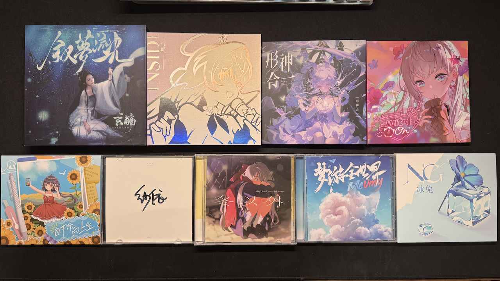

还有一大堆各种各样的 V 碟（基本上是看着眼熟就买一个基础版的，纯粹支持一下，不一个个介绍了

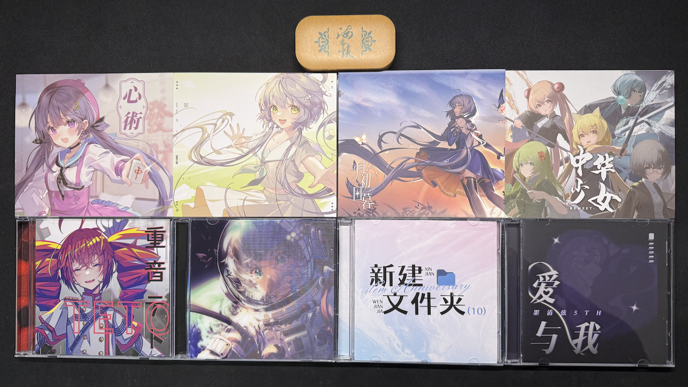

最后明年期待一下：

* 一些年常（不一定都能安排上了，sad
* 已经确定的 Live：2.15 yousa（坐等开票
* 算是有些眉目但还没定下来的 Live：黄黄 / 不才
* 张家界（大概可能也许是在暑假，跟这回九寨沟二刷差不多的人组个团
* 泸沽寻梦 / 泼墨漓江（如果张家界没约上应该会选一个去，取决于到昆明的高铁能不能通
